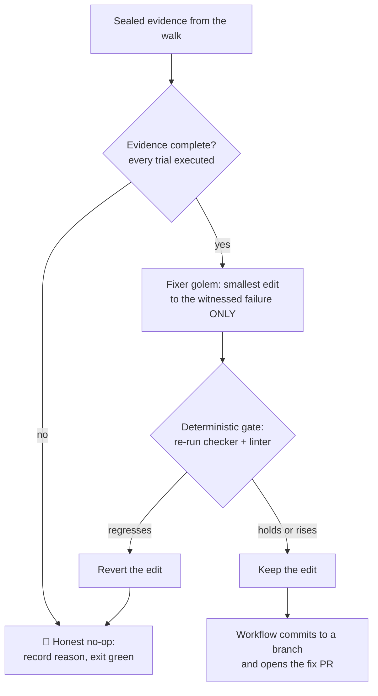
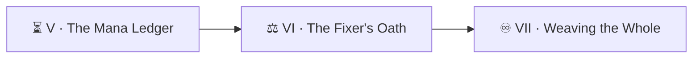

*Until now your loop could witness a broken spell but never mend it. Today it earns hands — under the strictest oath in the campaign. A fixer golem may repair **only what the sealed evidence witnessed break**, with the smallest edit that mends it, and every edit is kept or reverted by a **deterministic gate** — a score the golem cannot charm, a linter it cannot flatter. And when the evidence is partial? It walks away. In this realm, a golem that does nothing honestly outranks one that does something plausible.*

*The real-world skills: scoping autonomous write access to witnessed defects, keep/revert gating on machine-checkable signals (never the model grading its own homework), treating the clean no-op as success, and circuit breakers that hand stubborn work to humans instead of looping forever.*

> 🧭 **Campaign note:** Level `1101` is Machine Learning & AI — where prophecy is studied and, more importantly, where its error bars live. A fixer is applied prophecy; the gate is its error bar.

## 📖 The Legend Behind This Quest

*The engine's first autonomous repair is a matter of public record. The walker witnessed two spells fail inside one quest — Liquid incantations that rendered as dead text when copied. The fixer read the sealed evidence, made five small edits, and for each one ran the structural validator before and after: score held at 78.4%, style linter clean, edit kept. It also found a skipped command in the same scroll and **declined to touch it** — the skip was the sandbox's limitation, not the quest's defect, and the oath forbids repairs without a witnessed failure. The same morning, two sibling fixers received evidence with one errored trial each — and both walked away empty-handed, on purpose, leaving notes for a cleaner walk. One repair shipped; two no-ops recorded; zero plausible guesses. That ratio is the oath working.*

## 🎯 Quest Objectives

By the end of this quest you will:

- [ ] **Define "verified issue"** — the only defects your fixer may touch are witnessed, machine-recorded failures
- [ ] **Summon a fixer golem** — write-scoped to content files only, forbidden from git and from the evidence
- [ ] **Build the keep/revert gate** — a deterministic before/after check that decides an edit's fate in code
- [ ] **Honor the honest no-op** — partial or unexecuted evidence → abort with a reason, exit green
- [ ] **Install a circuit breaker** — N fully-covered-but-still-failing rounds → mark it `needs-human` and stop

## 🗺️ Quest Prerequisites

- 📋 Chapters I–V complete — sealed evidence and the coverage ledger are this chapter's raw materials
- 📋 One deliberately broken potion whose fix is *knowable* (a typo'd command, a missing flag)

## 🧙‍♂️ Chapter 1: The Oath, Written as Steps

The fix lane is a second workflow (gated by its own `FIX_ENABLED` switch — Chapter II taught you why). Its shape is oath-as-pipeline:



The fixer's role file carries the oath's hard rules:

```markdown
<!-- .claude/agents/potion-fixer.md -->
# potion-fixer

You repair potions. Your license is the sealed evidence — nothing else.

## Hard rules (never break)
- Repair ONLY failures evidence.txt witnessed. A skipped or unrun spell
  is not a defect; leave it and say so.
- Make the SMALLEST edit that mends the witnessed failure.
- Edit ONLY files under potions/. Never touch scripts/, workflows,
  ledger.json, or evidence.txt.
- Never run git. Never grade your own work — the gate decides.
- If the evidence is partial, truncated, or not executed: change NOTHING,
  write fix-notes.md explaining why, and stop. A no-op is a valid outcome.
```

### 🔍 Knowledge Check
- [ ] Why is "smallest edit that mends the witnessed failure" safer than "improve the potion while you're in there"? (The Sirens have a verse about this.)
- [ ] Why must the no-op path exit **green**?

## 🧙‍♂️ Chapter 2: The Gate That Cannot Be Charmed

The keep/revert decision belongs to code. The pattern: capture a deterministic **before** score, let the golem edit, recompute **after**, and let arithmetic rule:


```yaml
      - name: Gate — keep or revert (deterministic, never the golem's opinion)
        run: |
          set -euo pipefail
          potion="${{ steps.pick.outputs.potion }}"

          # AFTER: the witnessed failure must now pass…
          if ! ./scripts/check.sh "$potion" >/dev/null 2>&1; then
            echo "::warning::fix did not mend the witnessed failure — reverting."
            git checkout -- "$potion"
            exit 0
          fi
          # …and style must not regress (any deterministic linter works):
          if ! npx --yes markdownlint-cli2 "$potion" >/dev/null 2>&1; then
            echo "::warning::fix mended the spell but broke the style gate — reverting."
            git checkout -- "$potion"
            exit 0
          fi
          echo "edit KEPT: checker passes and linter is clean."
```


Then — and only then — the **workflow** commits the kept edit to a branch and opens a pull request (`gh pr create` in a step; the golem never sees these verbs). Two disciplines from the reference build worth stealing verbatim:

- **Hold-or-rise, not "above the floor."** The real gate compares each quest's structural score against its own pre-edit baseline: a fix that drags 95% down to 72% fails the gate even though 72% clears the absolute threshold. Repairs must not spend quality as currency.
- **Separate the witness from the surgeon.** The walk lane and the fix lane are different workflows with different switches. You can freeze all repairs (`FIX_ENABLED=false`) while the walker keeps witnessing — invaluable the week you're debugging the fixer.

### ⚔️ Skills You'll Forge
- Before/after gating with `git checkout --` as the revert primitive
- Composing gates: functional (checker) AND stylistic (linter), both deterministic
- Write-scope enforcement by path

### 🔍 Knowledge Check
- [ ] The golem claims its edit is excellent, but the checker still fails. Who wins, and which line of the workflow enforces it?
- [ ] Why does the *workflow* own `git checkout --` rather than asking the golem to revert itself?

## 🧙‍♂️ Chapter 3: The Circuit Breaker — When the Loop Must Ask for Help

A loop that fixes, re-walks, and still fails will happily do so forever — burning mana, flooding reviewers. The breaker counts **full** rounds and surrenders gracefully. In your ledger script:

```python
# After computing coverage (Chapter V): breaker discipline.
MAX_ROUNDS = 3
fully_covered = covered == shelf
if fully_covered and not data["perfect"]:
    data["fix_rounds"] = data.get("fix_rounds", 0) + 1
    if data["fix_rounds"] >= MAX_ROUNDS:
        data["needs_human"] = True          # the loop STOPS choosing this work
elif data["perfect"]:
    data["fix_rounds"] = 0                  # convergence resets the breaker
    data["needs_human"] = False
```

The subtlety that bit the real engine: **a mid-sweep turn is progress, not a failed round.** Only a *fully covered* shelf that still isn't perfect counts against the breaker — otherwise a 26-item shelf on window 5 trips `needs_human` before its first sweep even finishes.

## 🔁 Reproduce It

The first autonomous repair, and the oath it obeyed:

- PR [#445](https://github.com/bamr87/it-journey/pull/445) — `bamr87/it-journey@08ca5d1cc` (+33/−28): two witnessed Liquid failures mended with a block-level guard, three evidence-backed recommendations applied, structural score held at 78.4% on every kept edit, one skipped command explicitly left alone — read its PR body; it is the fixer's fragment, edit by edit, gate result by gate result
- The oath at scale: `.claude/skills/quest-fix/SKILL.md` (the abort-on-unverified rules) and the M1 no-regression gate inside `.github/workflows/quest-fix.yml`
- The honest no-ops from the same morning: two sibling fix lanes in run `28791022929` consumed partial evidence and recorded "clean no-op — aborted at the honest-run gate" instead of guessing

## 🎮 Mastery Challenge

**Objective:** one kept repair, one forced revert, one honest no-op — the fixer's full behavioral triangle.

**Success Criteria:**
- [ ] **Kept:** the fixer mends your knowable broken potion; the gate keeps it; the workflow opens a fix PR whose body lists the witnessed evidence
- [ ] **Reverted:** sabotage the gate (make the linter unsatisfiable for that file) and verify the edit is reverted with a warning while the run stays green
- [ ] **No-op:** hand the fixer truncated evidence (delete half of evidence.txt after sealing — from a workflow step, not the golem) and verify it changes nothing and writes fix-notes.md
- [ ] **Breaker:** simulate three fully-covered failing rounds and confirm `needs_human: true` stops the fix lane from selecting that potion

## 🎁 Rewards & Progression

- ⚖️ **The Honest Fixer** — earned on your first gate-kept repair *or* your first principled no-op; mastered when you have both
- ⚡ Skills unlocked: keep/revert gates · verified-only scope · circuit breakers · no-op discipline
- 📊 **+150 XP**

## 🗺️ Quest Network



## 🔮 Next Adventures

- ♾️ [Chapter VII — Weaving the Whole](/quests/1110/ouroboros-loop-07-weaving-the-whole/): the capstone — the serpent closes its own circle with self-merging gates
- 👑 Campaign hub: [Epic Quest: The Ouroboros Loop](/quests/codex/ouroboros-loop/)

## 📚 Resource Codex

- [markdownlint-cli2](https://github.com/DavidAnson/markdownlint-cli2) — a ready-made deterministic style gate
- [`gh pr create`](https://cli.github.com/manual/gh_pr_create) — the workflow's verb, never the golem's
- [Martin Fowler: CircuitBreaker](https://martinfowler.com/bliki/CircuitBreaker.html) — the pattern's family history

## 🕸️ Knowledge Graph

*Structured wiki-links connect this quest to the IT-Journey knowledge graph.*

**Campaign hub:** [[Epic Quest: The Ouroboros Loop]] **Previous:** [[The Mana Ledger]] · **Next:** [[Weaving the Whole]] **Level home:** [[Level 1101 - Machine Learning & AI]]
