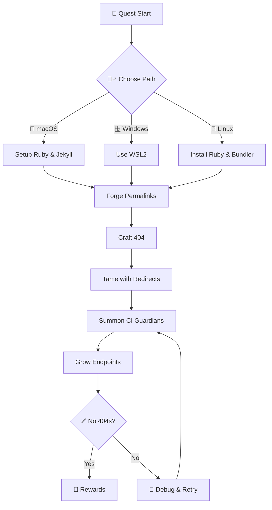

*[In the digital matrix where URLs thread through luminous forests, a wraith prowls—the 404 Specter. Its hunger is broken paths; its lair, forgotten slugs. Today you rise as a Link Warden, weaving binary incantations to bind the 404 and light every trail.]*

Your quest blends myth and method: a practical Jekyll journey powered by GitHub CI/CD that harmonizes with the companion article “404 Hunting: The Quest for Resources.” Follow these chapters to forge stable permalinks, etch redirect runes, summon automated hyperlink guardians, and grow living resource endpoints so your realm strengthens with every release.

## 🌟 The Legend Behind This Quest

Once, refactors fractured timelines and slugs wandered nameless. Guild lore taught three arts to restore order: predictable permalinks, decisive redirects, and vigilant guardians that patrol every merge. Master these and the 404 Specter fades into mist.

## 🎯 Quest Objectives

### Primary Objectives

- [ ] Forge predictable paths with pretty permalinks and a purposeful 404 page
- [ ] Tame migrations with `jekyll-redirect-from` front‑matter runes
- [ ] Summon CI hyperlink guardians (Lychee or HTMLProofer)
- [ ] Grow missing endpoints organically using collections and data

### Secondary Objectives

- [ ] Centralize redirects with a small data map
- [ ] Add a weekly link‑rot sweep to CI
- [ ] Expose an issue opener on 404 to recruit allies

### Mastery Indicators

- [ ] Explain how `pretty` permalinks affect trailing slashes
- [ ] Add a non-looping redirect for a moved page
- [ ] Configure CI to ignore flaky hosts responsibly

## 🌍 Choose Your Adventure Platform

### 🍎 macOS Kingdom Path

```bash
brew install rbenv ruby-build
rbenv install 3.2.4
rbenv local 3.2.4
gem install bundler
bundle install
bundle exec jekyll serve --livereload
```

### 🪟 Windows Empire Path (WSL)

```powershell
# Use WSL2 Ubuntu and follow Linux steps
```

### 🐧 Linux Territory Path

```bash
sudo apt-get update && sudo apt-get install -y ruby-full build-essential zlib1g-dev
gem install bundler
bundle install
bundle exec jekyll serve
```

### ☁️ GitHub Actions Path

- Run link checks on PRs and on a schedule
- Build Jekyll in CI to validate redirects post-build

## 🧙‍♂️ Chapter 1: Forge Unbreakable Paths (Permalinks & 404)

### ⚔️ Skills You'll Forge

- Predictable, human-friendly URLs
- A helpful custom 404 that guides travelers

### 🏗️ Workshop: Redirect Implementation

Add or confirm in `_config.yml`:

```yaml
permalink: pretty
url: https://your-domain.example
baseurl: "" # set to "/repo" for project pages
plugins:
  - jekyll-sitemap
  - jekyll-feed
  - jekyll-redirect-from
```

Create an inviting `404.html`:

```html
---
permalink: /404.html
---
<main class="not-found">
  <h1>🧭 Lost in the Linkwood</h1>
  <p>The path you sought fades into mist. Try these routes:</p>
  <ul>
    <li><a href="{{ site.baseurl }}/">Return to camp (home)</a></li>
    <li><a href="{{ site.baseurl }}/sitemap.xml">Consult the star map (sitemap)</a></li>
  </ul>
  <h2>Recent beacons</h2>
  <ul>
    
      <li><a href="{{ post.url | relative_url }}">{{ post.title }}</a></li>
    
  </ul>
  <p>If this seems wrong, please <a href="https://github.com/{{ site.github.repository_nwo }}/issues/new?title=404:%20{{ page.url }}">open a scroll (issue)</a>.</p>
  <style>.not-found{max-width:720px;margin:3rem auto;padding:0 1rem}</style>
</main>
```

### 🔍 Knowledge Check: Paths

- [ ] Do you know when to set `baseurl` and how to use `relative_url`?
- [ ] Can you describe why pretty permalinks reduce duplication?

## 🧙‍♂️ Chapter 2: Tame the Wraith (Redirects)

### ⚡ Powers You'll Gain

- Non-looping redirects for moved content
- Canonical slugs that survive refactors

### 🏗️ Workshop: CI Setup

Enable redirects:

```ruby
# Gemfile
gem "jekyll-redirect-from"
```

```yaml
# _config.yml
plugins:
  - jekyll-redirect-from
```

On the new canonical page, add old trails:

```yaml
redirect_from:
  - /2023/11/04/old-title/
  - /posts/old-title/
```

Or create a dedicated redirect stub:

```markdown
---
redirect_to: /posts/new-canonical-title/
permalink: /legacy-path/
---
```

### 🔍 Knowledge Check: Redirects

- [ ] Can you pick one canonical URL per artifact?
- [ ] Can you spot a potential redirect loop before merge?

## 🧙‍♂️ Chapter 3: Summon Hyperlink Guardians (CI)

### 🛡️ Abilities You'll Master

- Fast link sweeps and strict post-build checks

### 🏗️ Workshop: Collections & Data

Lychee (quick, generous):

```yaml
name: Hyperlink Guardian
on:
  pull_request:
  push:
    branches: [ main ]
  schedule:
    - cron: '0 3 * * 1'
jobs:
  lychee:
    runs-on: ubuntu-latest
    steps:
      - uses: actions/checkout@v4
      - name: Run lychee
        uses: lycheeverse/lychee-action@v1
        with:
          args: >-
            --verbose --no-progress --cache --max-cache-age 1d
            --accept 200,204,206,301,302,308
            --exclude-mail
            --timeout 20
            **/*.md **/*.html
        env:
          GITHUB_TOKEN: ${{ secrets.GITHUB_TOKEN }}
```

HTMLProofer (strict, post-build):

```yaml
name: Link Checker
on: [push, pull_request]
jobs:
  htmlproofer:
    runs-on: ubuntu-latest
    steps:
      - uses: actions/checkout@v4
      - uses: ruby/setup-ruby@v1
        with:
          ruby-version: '3.2'
          bundler-cache: true
      - name: Build Jekyll
        run: |
          bundle install --path vendor/bundle
          bundle exec jekyll build --trace
      - name: HTMLProofer
        run: |
          gem install html-proofer
          htmlproofer ./_site \
            --assume-extension \
            --check-external-hash \
            --enforce-https \
            --typhoeus-config 'timeout:20' \
            --url-ignore "^https://localhost,https://127.0.0.1" \
            --http-status-ignore '0,429'
```

### 🔍 Knowledge Check: Guardians

- [ ] Can you schedule a weekly sweep and tune ignore lists?
- [ ] Do you know when to choose Lychee vs HTMLProofer?

## 🧙‍♂️ Chapter 4: Grow Endpoints Organically (Collections & Data)

### 🔧 Capabilities You'll Build

- Content growth without manual toil

### 🏗️ Building Your Knowledge Foundation

Declare a collection:

```yaml
collections:
  resources:
    output: true
    permalink: /resources/:path/
```

Example content `_resources/magic-spell.md`:

```markdown
---
title: The Magic Spell of Code
---

Content about spells...
```

Data-driven links via `_data/quests.yml`:

```yaml
- name: 404 Hunting
  description: Banish errors!
```

Template snippet:

```liquid

  <a href="/quests/{{ quest.name | slugify }}">{{ quest.name }}</a>

```

### 🔍 Knowledge Check: Growth

- [ ] Can you create a collection item and predict its URL?
- [ ] Can you render data into navigable links?

## 🎮 Quest Implementation Challenges

### Challenge 1: Refactor Without Regret (🕐 20–30 minutes)

Objective: Rename an existing page and preserve the old trail.

Requirements:

- [ ] Update permalink to the new canonical
- [ ] Add `redirect_from` for the old paths
- [ ] Verify locally and in CI

Success Criteria:

- [ ] Visiting the old URL cleanly redirects to the new one

### Challenge 2: Guardian’s Vigil (🕐 20–30 minutes)

Objective: Add one link checker on PRs and a scheduled weekly sweep.

Requirements:

- [ ] Lychee or HTMLProofer workflow added
- [ ] Ignore list tuned for flaky hosts

Success Criteria:

- [ ] CI status turns red for seeded bad links; green after fixes

### 🏆 Master Challenge: De‑404 a Trail (🕐 30 minutes)

Objective: Use guardian logs to create a minimal viable resource (MVR) or redirect to resolve a real 404.

## 🎁 Quest Rewards and Achievements

- 🏆 Resource Guardian — Link integrity mastery
- ⚡ Redirect Adept — Clean, canonical trails
- 🛠️ CI Templar — Automated guardians at the gates

## 🔮 Your Next Epic Adventures

- Permalink Lore: deepen slug strategies and canonical design
- CI Scribes: extend quality checks to images and anchors
- Content Gardens: scale with collections, tags, and data

## 📚 Quest Resource Codex

- Companion Article: </posts/404-hunting-quest/>
- Jekyll Permalinks: <https://jekyllrb.com/docs/permalinks/>
- jekyll-redirect-from: <https://github.com/jekyll/jekyll-redirect-from>
- jekyll-sitemap: <https://github.com/jekyll/jekyll-sitemap>
- HTMLProofer: <https://github.com/gjtorikian/html-proofer>
- Lychee Action: <https://github.com/lycheeverse/lychee-action>
- GitHub Pages 404s: <https://docs.github.com/en/pages/getting-started-with-github-pages/creating-a-custom-404-page-for-your-github-pages-site>



---

### 🗺️ Quest Network Position

Prerequisite Quests:

- Terminal Mastery — Basic CLI spells (Level 0001–0010)

Follow-Up Quests:

- CI Scribes — Advanced checks and dashboards (Level 1111)
- Content Gardens — Collections at scale (Level 10100)

Validation Recap:

- [ ] Link checks pass on PR and scheduled runs
- [ ] 404 page aids recovery and reporting
- [ ] Redirects cover moved content without loops
