---

title: Level 1110 - Quality Assurance
description: Advanced testing patterns, error handling, and robust application development
preview: images/previews/level-1110-quality-assurance.png
permalink: /quests/level-1110/
lastmod: 2025-11-29T23:41:31.776Z

layout: quest-collection
level: 1110
categories: quests
---

# Level 1110: Quality Assurance

*Quality is not an accident—it's built through careful testing, error handling, and attention to edge cases. Level 1110 teaches you to build robust applications that handle errors gracefully and recover from unexpected situations.*

## Quest Overview

Level 1110 quests focus on:
- **Error Handling** - Graceful failure and recovery patterns
- **Edge Case Testing** - Finding and fixing the unusual scenarios
- **Quality Metrics** - Measuring and improving code quality
- **Debugging Mastery** - Advanced problem-solving techniques

## Available Quests

### 🔍 Error Handling

#### [404 Hunting Quest](404-hunting.md)
**Quest Type**: Main 🏰 | **Difficulty**: 🟡 Medium | **Estimated Time**: 60-90 minutes

Master the art of hunting down and handling 404 errors. Learn to create user-friendly error pages and implement robust error handling strategies.

**Skills You'll Master:**
- Custom 404 page creation
- Error logging and monitoring
- User experience for error states
- Link validation and prevention

**Prerequisites:** Web development basics, HTML/CSS

## Learning Path Recommendations

### For Quality Engineers
1. [404 Hunting Quest](404-hunting.md) - Error handling fundamentals
2. Combine with Level 1010 automation
3. Build comprehensive test suites

### For Full-Stack Developers
1. [404 Hunting Quest](404-hunting.md)
2. Apply to existing projects
3. Implement monitoring and alerting

## Quest Dependencies & Progression

```mermaid
graph TD
    A[Level 1100 Complete] --> B[🔍 404 Hunting Quest]
    B --> C[Advanced Quests]
    B --> D[Real-World Projects]
```

## Quest Completion Benefits

Upon completing Level 1110 quests, you'll unlock:
- **Error Handling** - Graceful failure patterns
- **User Experience** - Better error states
- **Debugging Skills** - Advanced problem-solving
- **Quality Mindset** - Proactive error prevention

## Congratulations!

You've reached the highest standard quest level in the IT-Journey! From here, you can:
- **Revisit lower levels** to reinforce skills
- **Contribute quests** to help others learn
- **Build real projects** applying all you've learned
- **Mentor newcomers** starting their journey

---

*Quality is the foundation of trust. Build applications people can rely on.* 🔍✨
