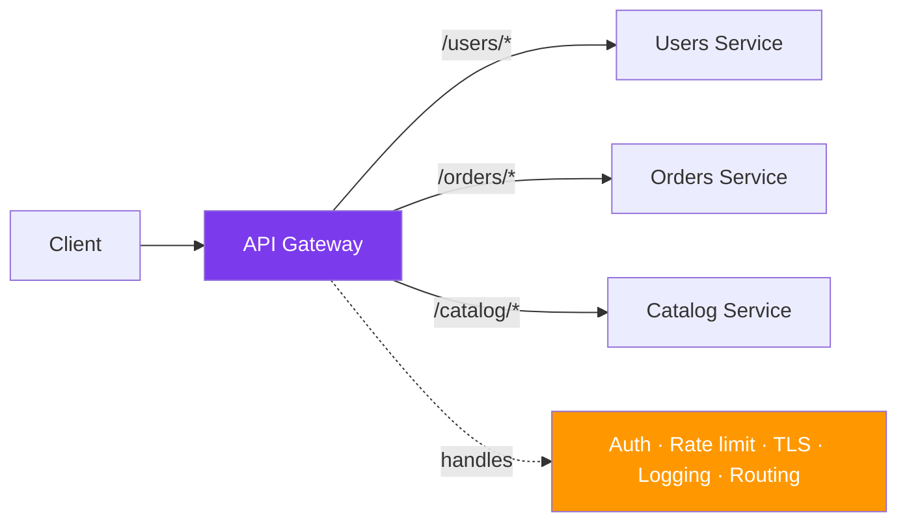
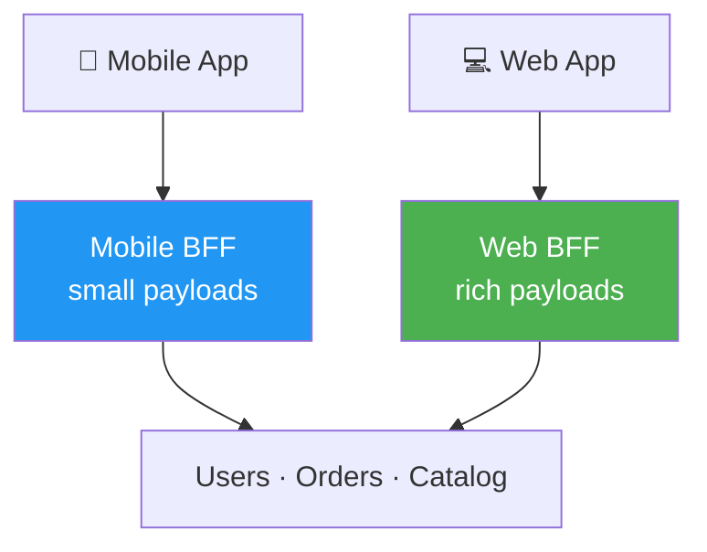

*Architect, your kingdom of services now sprawls - and your clients are lost, knocking on a dozen different gates, each demanding its own credentials. An **API Gateway** is the single grand entrance to the Citadel: one address where every request arrives, is checked, is routed to the right keep, and is sent on its way. Master it, and your clients see one clean facade instead of a chaotic warren of services.*

*Whether your mobile app is making fifteen calls to render one screen, or every service is re-implementing authentication slightly differently, this quest forges the patterns of the gateway: routing, authentication, rate limiting, aggregation, and the elegant Backend-for-Frontend that gives each client a door shaped just for it.*

## 📖 The Legend Behind This Quest

*When you split a monolith into services, you also split its front door. Suddenly the client must know the address of every service, handle each one's authentication, and stitch together a dozen responses. This leaks internal structure to the outside world and bloats every client.*

*The API Gateway pattern restores order by inserting one component at the edge. It becomes the home of **cross-cutting concerns** - the things every request needs but no single service should own: authentication, rate limiting, TLS termination, logging, and routing. The gateway is so useful that it carries a real danger too: it can become a single point of failure and a bottleneck. Wielding it wisely - and knowing when a Backend-for-Frontend serves better - is the lesson of this quest.*

## 🎯 Quest Objectives

By the time you complete this epic journey, you will have mastered:

### Primary Objectives (Required for Quest Completion)
- [ ] **Gateway Responsibilities** - Name the cross-cutting concerns a gateway centralizes
- [ ] **Routing** - Direct requests to the right service by path, host, or header
- [ ] **Auth and Rate Limiting** - Authenticate once at the edge and protect services from floods
- [ ] **Response Aggregation** - Compose one client response from several service calls

### Secondary Objectives (Bonus Achievements)
- [ ] **Backend-for-Frontend (BFF)** - Give each client type its own tailored gateway
- [ ] **Gateway Pitfalls** - Avoid the god-gateway and the single point of failure
- [ ] **TLS Termination and Observability** - Centralize encryption and request logging

### Mastery Indicators
You'll know you've truly mastered this quest when you can:
- [ ] List five cross-cutting concerns a gateway should own
- [ ] Explain why aggregation belongs at the edge, not in the client
- [ ] Describe when a BFF beats a single shared gateway
- [ ] Name how to keep the gateway from becoming a single point of failure

## 🗺️ Quest Prerequisites

### 📋 Knowledge Requirements
- [ ] Understand microservices and HTTP routing
- [ ] Familiarity with JWT or similar auth tokens
- [ ] Completed [Microservices Architecture](/quests/1110/microservices-architecture/) (required)

### 🛠️ System Requirements
- [ ] Modern operating system (Windows 10+, macOS 10.14+, or Linux)
- [ ] Docker for the optional gateway lab
- [ ] A text editor or IDE (VS Code recommended)

### 🧠 Skill Level Indicators
This **🔴 Hard** quest expects:
- [ ] You have called more than one backend service from a client
- [ ] You understand cross-cutting concerns like auth and logging
- [ ] Ready for 3-4 hours of focused study

## 🌍 Choose Your Adventure Platform

*The patterns are gateway-independent. The lab uses NGINX as a reverse proxy because it is everywhere; the same ideas apply to Kong, Traefik, Envoy, or a cloud gateway.*

### 🍎 macOS Kingdom Path

<details>
<summary>Click to expand macOS instructions</summary>

```bash
brew install --cask docker
# Run NGINX with a custom config you will write below
docker run -d -p 8080:80 -v "$PWD/nginx.conf:/etc/nginx/nginx.conf:ro" nginx:alpine
```

</details>

### 🪟 Windows Empire Path

<details>
<summary>Click to expand Windows instructions</summary>

```powershell
winget install Docker.DockerDesktop
docker run -d -p 8080:80 -v "${PWD}/nginx.conf:/etc/nginx/nginx.conf:ro" nginx:alpine
```

</details>

### 🐧 Linux Territory Path

<details>
<summary>Click to expand Linux instructions</summary>

```bash
sudo apt update && sudo apt install -y docker.io
sudo systemctl enable --now docker
sudo docker run -d -p 8080:80 -v "$PWD/nginx.conf:/etc/nginx/nginx.conf:ro" nginx:alpine
```

</details>

### ☁️ Cloud Realms Path

<details>
<summary>Click to expand Cloud/Container instructions</summary>

```bash
# Managed gateways (AWS API Gateway, GCP API Gateway, Azure APIM) provide the
# same responsibilities as configuration rather than a container. The concepts
# transfer directly.
docker run -d -p 8080:80 nginx:alpine
```

</details>

## 🧙‍♂️ Chapter 1: The Gateway's Responsibilities

*A gateway is a reverse proxy with opinions. Before any config, understand precisely what it should and should not own.*

### ⚔️ Skills You'll Forge in This Chapter
- The cross-cutting concerns a gateway centralizes
- What belongs at the edge vs. in a service
- The single-point-of-failure risk

### 🏗️ One Door, Many Concerns



| Concern | Why it belongs at the gateway |
| --- | --- |
| **Routing** | Clients use one address; the gateway maps paths to services |
| **Authentication** | Validate the token once at the edge, not in every service |
| **Rate limiting** | Protect all services from floods in one place |
| **TLS termination** | Decrypt once; talk plaintext on the trusted internal network |
| **Aggregation** | Combine several service calls into one client response |
| **Observability** | Log and trace every request from a single chokepoint |

What does **not** belong at the gateway: business logic. A gateway that starts making domain decisions becomes a "god gateway" - a new monolith at the edge.

### 🔍 Knowledge Check: Responsibilities
- [ ] Why authenticate at the gateway instead of in each service?
- [ ] What is the danger of putting business logic in the gateway?
- [ ] How does a gateway become a single point of failure, and how do you mitigate it?

## 🧙‍♂️ Chapter 2: Routing, Auth, and Rate Limiting in Practice

*Now configure a real gateway. NGINX makes routing and rate limiting declarative.*

### ⚔️ Skills You'll Forge in This Chapter
- Path-based routing to upstream services
- Rate limiting per client
- Forwarding an authenticated identity downstream

### 🏗️ A Minimal Gateway Config

```nginx
# nginx.conf — route by path prefix, rate-limit, and front two services
events {}
http {
    # 10 requests/second per client IP, with a small burst allowance
    limit_req_zone $binary_remote_addr zone=api:10m rate=10r/s;

    upstream users    { server users:8000; }
    upstream orders   { server orders:8000; }

    server {
        listen 80;

        location /users/ {
            limit_req zone=api burst=20 nodelay;   # rate limit at the edge
            proxy_pass http://users/;
            proxy_set_header X-Request-Id $request_id;   # trace every request
        }

        location /orders/ {
            limit_req zone=api burst=20 nodelay;
            proxy_pass http://orders/;
            proxy_set_header X-Request-Id $request_id;
        }
    }
}
```

### 🏗️ Authenticating at the Edge

A common pattern: the gateway validates a JWT, then forwards the verified identity to the (now-simpler) services as a trusted header.

```python
# A tiny auth gateway in Python (FastAPI) — validate once, forward identity
import jwt, httpx
from fastapi import FastAPI, Request, HTTPException

app = FastAPI()
SECRET, SERVICES = "change-me", {"users": "http://users:8000",
                                 "orders": "http://orders:8000"}

@app.middleware("http")
async def authenticate(request: Request, call_next):
    token = request.headers.get("authorization", "").removeprefix("Bearer ")
    try:
        claims = jwt.decode(token, SECRET, algorithms=["HS256"])
    except jwt.PyJWTError:
        raise HTTPException(status_code=401, detail="invalid token")
    request.state.user_id = claims["sub"]   # services trust this, set only here
    return await call_next(request)
```

### 🔍 Knowledge Check: Routing and Auth
- [ ] What does `limit_req` protect against?
- [ ] Why forward the user identity as a header the services trust?
- [ ] Why must services be unreachable except through the gateway for this trust to be safe?

## 🧙‍♂️ Chapter 3: Aggregation and the Backend-for-Frontend

*A mobile screen often needs data from several services. Forcing the client to make many round trips over a slow network is wasteful. The gateway can aggregate - and a BFF can do it per client type.*

### ⚔️ Skills You'll Forge in This Chapter
- Response aggregation at the edge
- The Backend-for-Frontend pattern
- Choosing between one gateway and many BFFs

### 🏗️ Aggregation

```python
# The gateway fans out to several services and composes one response.
import asyncio, httpx

async def home_screen(user_id: str) -> dict:
    async with httpx.AsyncClient() as client:
        # Parallel calls — the client waits once, not three times
        profile, orders, recs = await asyncio.gather(
            client.get(f"http://users:8000/{user_id}"),
            client.get(f"http://orders:8000/recent?user={user_id}"),
            client.get(f"http://catalog:8000/recommend?user={user_id}"),
        )
    return {
        "profile": profile.json(),
        "recent_orders": orders.json(),
        "recommendations": recs.json(),
    }
```

### 🏗️ Backend-for-Frontend

A mobile app and a web app have different needs: the mobile client wants tiny, pre-shaped payloads; the web client wants richer data. Instead of one gateway compromising for both, the **BFF** pattern gives each client type its own gateway, owned by the team that builds that client.



The trade-off: BFFs eliminate one-size-fits-none compromises but multiply the number of edge components to maintain. Use a single gateway until client needs genuinely diverge.

### 🔍 Knowledge Check: Aggregation and BFF
- [ ] Why aggregate at the gateway instead of the mobile client?
- [ ] What problem does a BFF solve that a shared gateway cannot?
- [ ] What is the cost of adopting BFFs?

## 🎮 Mastery Challenges

### 🟢 Novice Challenge: Route Two Services
**Objective**: Configure NGINX to route `/users/` and `/orders/` to two upstreams.

**Requirements**:
- [ ] Both paths reach the correct service
- [ ] A rate limit is applied at the edge
- [ ] A request id is forwarded downstream

**Validation**: `curl localhost:8080/users/` and `/orders/` hit the right service.

### 🟡 Intermediate Challenge: Edge Authentication
**Objective**: Add token validation at the gateway and forward a trusted identity header.

**Requirements**:
- [ ] An invalid token is rejected with 401 at the edge
- [ ] A valid token forwards `X-User-Id` to the service
- [ ] Services are unreachable except through the gateway

**Validation**: A service receives the identity without ever validating the token itself.

### 🔴 Advanced Challenge: Aggregation or BFF Design
**Objective**: Design the edge for an app with a mobile and a web client.

**Requirements**:
- [ ] Decide: single gateway with aggregation, or two BFFs
- [ ] Justify the choice from the clients' differing needs
- [ ] Name the operational cost of your decision

**Validation**: The design avoids both a god-gateway and needless BFF sprawl.

## 🏆 Quest Rewards & Achievements

**🎖️ Badges Earned**:
- 🏆 **Gatekeeper** - You built the single secure entrance to a kingdom of services
- 🛡️ **Warden of the Threshold** - You centralize auth, routing, and rate limiting wisely

**🛠️ Skills Unlocked**:
- **Gateway Configuration** - Route, secure, and rate-limit at the edge
- **Cross-Cutting Concern Design** - Decide what belongs at the gateway and what does not

**🔓 Unlocked Quests**:
- Scaling Strategies - Load-balance behind the gateway to scale horizontally

**📊 Progression Points**: +90 XP

## 🗺️ Next Steps in Your Journey

**Continue the Main Story**:
- 🎯 [Scaling Strategies](/quests/1110/scaling-strategies/) - Scale the services behind your gateway

**Explore Side Adventures**:
- ⚔️ [Event-Driven Design](/quests/1110/event-driven-design/) - The async core behind the sync facade
- ⚔️ [Microservices Architecture](/quests/1110/microservices-architecture/) - Revisit the services the gateway fronts

### Character Class Recommendations

**💻 Software Developer**: Continue to [Scaling Strategies](/quests/1110/scaling-strategies/)  
**🏗️ System Engineer**: Explore running the gateway in high availability  
**🛡️ Security Specialist**: Deepen edge authentication and TLS termination

## 📚 Resources

### Official Documentation
- [NGINX reverse proxy guide](https://docs.nginx.com/nginx/admin-guide/web-server/reverse-proxy/) - The proxy used above
- [Kong Gateway docs](https://docs.konghq.com/gateway/) - A full-featured API gateway
- [Envoy Proxy docs](https://www.envoyproxy.io/docs/envoy/latest/) - The data plane behind many gateways

### Community Resources
- [microservices.io - API Gateway](https://microservices.io/patterns/apigateway.html) - The canonical pattern
- [Sam Newman - Backends For Frontends](https://samnewman.io/patterns/architectural/bff/) - The BFF pattern by name
- [Building Microservices (Sam Newman), Ch. on the edge](https://www.oreilly.com/library/view/building-microservices-2nd/9781492034018/) - Gateways in context

### Learning Materials
- [Traefik documentation](https://doc.traefik.io/traefik/) - A modern, auto-configuring gateway
- [JWT introduction](https://jwt.io/introduction) - The token format used in edge auth

## 🤝 Quest Completion Checklist

- [ ] ✅ Completed all primary objectives
- [ ] ✅ Configured a gateway routing to two services
- [ ] ✅ Answered all knowledge check questions
- [ ] ✅ Completed at least one mastery challenge
- [ ] ✅ Explored the resource library
- [ ] ✅ Identified your next quest in the journey

## 🕸️ Knowledge Graph

*Structured wiki-links connect this quest to the IT-Journey knowledge graph. Open the [Obsidian Graph View](/docs/obsidian/graph/) to explore connections.*

**Level hub:** [[Level 1110 - Architecture & Design Patterns]]
**Overworld:** [[🏰 Overworld - Master Quest Map]]
**Prerequisites:** [[Microservices Architecture: Decomposing the Monolith]]
**Unlocks:** [[Scaling Strategies: Horizontal Growth, Caching, and CAP]]
**Obsidian docs:** [[Obsidian Knowledge Graph and Wiki Links]]
