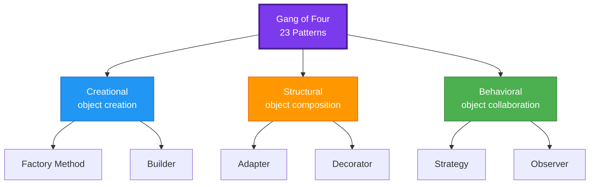

*Greetings, Architect! You have ascended to the **Master tier**, where the Citadel of Architecture rises above every kingdom you have ever built. Here you do not write a single spell - you design the very grammar in which all spells are written. This quest, **Software Design Patterns**, hands you the master builder's catalog: named, battle-tested solutions to problems that have recurred in software since the first object met the first method.*

*Whether you have wrestled with a tangle of `if/else` that no one dares touch, or you are formalizing instincts you already half-trust, this adventure forges the structural vocabulary every Architect needs: the Gang of Four patterns, the SOLID principles, and - most importantly - the judgment to know when a pattern is medicine and when it is poison.*

## 📖 The Legend Behind This Quest

*In 1994, four scholars - Gamma, Helm, Johnson, and Vlissides, forever known as the Gang of Four - catalogued 23 recurring solutions to design problems. They did not invent these patterns; they discovered them, the way naturalists discover species already living in the wild. A pattern is not a library you import. It is a name for a shape your code can take, so that when you say "Strategy" or "Observer," another engineer instantly understands the whole structure.*

*This quest teaches you the "why" behind each pattern, so you can reach for one deliberately rather than cargo-culting it. Master this, and the rest of the Citadel - domain-driven design, microservices, event-driven systems - becomes a set of larger patterns you can reason about with the same confidence.*

## 🎯 Quest Objectives

By the time you complete this epic journey, you will have mastered:

### Primary Objectives (Required for Quest Completion)
- [ ] **The Three Pattern Categories** - Distinguish creational, structural, and behavioral patterns and what problem each family solves
- [ ] **Five Core Patterns in Depth** - Implement Factory, Strategy, Observer, Adapter, and Decorator from scratch
- [ ] **The SOLID Principles** - Explain all five and recognize a violation of each in real code
- [ ] **Refactoring to Patterns** - Replace a brittle conditional with a pattern that absorbs change

### Secondary Objectives (Bonus Achievements)
- [ ] **Composition over Inheritance** - Articulate why the GoF favored composition and apply it
- [ ] **Anti-Patterns** - Recognize over-engineering and the "patterns for their own sake" trap
- [ ] **Pattern Vocabulary** - Use pattern names to communicate design intent on a real team

### Mastery Indicators
You'll know you've truly mastered this quest when you can:
- [ ] Explain a pattern's intent, participants, and trade-offs without notes
- [ ] Map a SOLID violation to the pattern that resolves it
- [ ] Decide, for a new requirement, whether a pattern earns its complexity
- [ ] Refactor real conditional logic into a Strategy or State pattern

## 🗺️ Quest Prerequisites

### 📋 Knowledge Requirements
- [ ] Comfortable writing classes, interfaces, and functions in an OO language
- [ ] Understand inheritance, polymorphism, and composition
- [ ] Have maintained a codebase large enough to feel design pain

### 🛠️ System Requirements
- [ ] Modern operating system (Windows 10+, macOS 10.14+, or Linux)
- [ ] Python 3.10+ installed (`python3 --version`)
- [ ] A text editor or IDE (VS Code recommended)

### 🧠 Skill Level Indicators
This **🔴 Hard** quest expects:
- [ ] You can read a UML class diagram
- [ ] You have felt code that fights back when you try to change it
- [ ] Ready for 4-5 hours of focused study and practice

## 🌍 Choose Your Adventure Platform

*Patterns are language-independent, but the examples here use Python for clarity. Pick the path that fits your setup; the concepts transfer to Java, C#, TypeScript, and beyond.*

### 🍎 macOS Kingdom Path

<details>
<summary>Click to expand macOS instructions</summary>

```bash
# Python ships with modern macOS, but a Homebrew install is cleaner
brew install python@3.12

# Create an isolated workspace for the quest
mkdir -p ~/patterns-quest && cd ~/patterns-quest
python3 -m venv .venv && source .venv/bin/activate

# Verify
python --version
```

</details>

### 🪟 Windows Empire Path

<details>
<summary>Click to expand Windows instructions</summary>

```powershell
# Install Python via winget
winget install Python.Python.3.12

# Create a workspace and virtual environment
mkdir patterns-quest; cd patterns-quest
python -m venv .venv; .\.venv\Scripts\Activate.ps1

python --version
```

</details>

### 🐧 Linux Territory Path

<details>
<summary>Click to expand Linux instructions</summary>

```bash
# Debian/Ubuntu
sudo apt update && sudo apt install -y python3 python3-venv

# Fedora/RHEL
# sudo dnf install -y python3

mkdir -p ~/patterns-quest && cd ~/patterns-quest
python3 -m venv .venv && source .venv/bin/activate
python --version
```

</details>

### ☁️ Cloud Realms Path

<details>
<summary>Click to expand Cloud/Container instructions</summary>

```bash
# Any container with Python works; a Codespace or a base image is fine
docker run -it --rm python:3.12-slim bash
# Inside the container:
python --version
```

</details>

## 🧙‍♂️ Chapter 1: The Three Families - A Map of the Catalog

*Every GoF pattern answers one of three questions. Memorize this map and the 23 patterns stop being a random list.*

### ⚔️ Skills You'll Forge in This Chapter
- The intent of each pattern family
- How to pick the right family for a problem
- The vocabulary to discuss design with other engineers

### 🏗️ The Three Categories

| Family | Question it answers | Representative patterns |
| --- | --- | --- |
| **Creational** | How are objects created, so creation is flexible and decoupled? | Factory Method, Abstract Factory, Builder, Singleton, Prototype |
| **Structural** | How are objects and classes composed into larger structures? | Adapter, Decorator, Facade, Proxy, Composite, Bridge, Flyweight |
| **Behavioral** | How do objects communicate and distribute responsibility? | Strategy, Observer, Command, State, Template Method, Iterator, Mediator |



### 🔍 Knowledge Check: The Families
- [ ] Which family does Builder belong to, and why?
- [ ] You need to add behavior to an object at runtime without subclassing. Which family?
- [ ] Why is Strategy behavioral but Factory creational, even though both produce variation?

## 🧙‍♂️ Chapter 2: Creational and Behavioral Patterns in Code

*Patterns earn their keep when they absorb a change that would otherwise ripple through your code. Here are the two most useful in practice.*

### ⚔️ Skills You'll Forge in This Chapter
- Factory Method for decoupled object creation
- Strategy for swappable algorithms
- Observer for event notification

### 🏗️ The Factory Method

A factory centralizes the decision of *which* concrete class to instantiate, so callers depend on an abstraction, not a constructor.

```python
from abc import ABC, abstractmethod

class Notifier(ABC):
    @abstractmethod
    def send(self, message: str) -> None: ...

class EmailNotifier(Notifier):
    def send(self, message: str) -> None:
        print(f"EMAIL: {message}")

class SmsNotifier(Notifier):
    def send(self, message: str) -> None:
        print(f"SMS: {message}")

def notifier_factory(channel: str) -> Notifier:
    """One place to change when a new channel is added."""
    registry = {"email": EmailNotifier, "sms": SmsNotifier}
    try:
        return registry[channel]()
    except KeyError as exc:
        raise ValueError(f"Unknown channel: {channel}") from exc

notifier_factory("email").send("Quest accepted")
```

### 🏗️ The Strategy Pattern

Strategy replaces a sprawling conditional with interchangeable objects. The classic smell it cures: a method that branches on a "type" flag.

```python
from abc import ABC, abstractmethod

# ❌ The smell Strategy cures:
# def price(order, kind):
#     if kind == "regular":  return order.total
#     elif kind == "vip":    return order.total * 0.8
#     elif kind == "staff":  return order.total * 0.5
#     ...grows forever as new kinds appear

# ✅ Each algorithm is its own object, open for extension:
class PricingStrategy(ABC):
    @abstractmethod
    def price(self, total: float) -> float: ...

class Regular(PricingStrategy):
    def price(self, total): return total

class Vip(PricingStrategy):
    def price(self, total): return total * 0.80

class Staff(PricingStrategy):
    def price(self, total): return total * 0.50

class Checkout:
    def __init__(self, strategy: PricingStrategy):
        self.strategy = strategy
    def total(self, amount: float) -> float:
        return self.strategy.price(amount)

print(Checkout(Vip()).total(100.0))   # 80.0 — add a new tier without touching Checkout
```

### 🏗️ The Observer Pattern

Observer lets one subject notify many dependents without knowing who they are - the backbone of event systems and the spiritual ancestor of pub/sub.

```python
class Subject:
    def __init__(self):
        self._observers = []
    def subscribe(self, fn):
        self._observers.append(fn)
    def notify(self, event):
        for fn in self._observers:
            fn(event)

orders = Subject()
orders.subscribe(lambda e: print(f"Email team: {e}"))
orders.subscribe(lambda e: print(f"Update analytics: {e}"))
orders.notify("order#42 placed")
```

### 🔍 Knowledge Check: Patterns in Code
- [ ] What changes in `Checkout` when you add a "Student" pricing tier? (Answer: nothing)
- [ ] How does Observer differ from a direct method call?
- [ ] Why does the factory raise on an unknown channel instead of returning `None`?

## 🧙‍♂️ Chapter 3: Structural Patterns and the SOLID Bedrock

*Structural patterns wire objects together. SOLID is the geology beneath them - five principles that, followed, make patterns natural and, ignored, make every change painful.*

### ⚔️ Skills You'll Forge in This Chapter
- Adapter and Decorator
- The five SOLID principles
- Mapping a violation to its remedy

### 🏗️ Adapter and Decorator

```python
# ADAPTER — make an incompatible interface fit what your code expects.
class LegacyPrinter:
    def print_text(self, s): print(f"[legacy] {s}")

class Printer:                       # the interface our app wants
    def output(self, s): ...

class LegacyPrinterAdapter(Printer):
    def __init__(self, legacy): self._legacy = legacy
    def output(self, s): self._legacy.print_text(s)

LegacyPrinterAdapter(LegacyPrinter()).output("hello")

# DECORATOR — add behavior by wrapping, not subclassing.
def with_timestamp(printer):
    import datetime
    class Wrapped(Printer):
        def output(self, s):
            printer.output(f"{datetime.date.today()} {s}")
    return Wrapped()

with_timestamp(LegacyPrinterAdapter(LegacyPrinter())).output("decorated")
```

### 🏗️ SOLID - The Five Principles

| Principle | One-line meaning | Violation smell |
| --- | --- | --- |
| **S** - Single Responsibility | A class has one reason to change | A "God class" doing I/O, logic, and formatting |
| **O** - Open/Closed | Open to extension, closed to modification | Editing a switch every time you add a type |
| **L** - Liskov Substitution | Subtypes must be usable as their base type | A subclass that throws on a method it "shouldn't" have |
| **I** - Interface Segregation | Many small interfaces beat one fat one | Implementers forced to stub methods they ignore |
| **D** - Dependency Inversion | Depend on abstractions, not concretions | High-level code importing a concrete database driver |

The Strategy pattern from Chapter 2 is the Open/Closed Principle made concrete: adding a pricing tier extends the system without modifying `Checkout`. Dependency Inversion is why the factory returns a `Notifier` abstraction rather than a concrete class.

### 🔍 Knowledge Check: Structure and SOLID
- [ ] Which SOLID principle does Strategy most directly satisfy?
- [ ] How does Adapter differ from Decorator in intent?
- [ ] When is applying a pattern actually a *violation* of good design?

## 🎮 Mastery Challenges

### 🟢 Novice Challenge: Name the Pattern
**Objective**: For five real scenarios, name the most fitting GoF pattern and justify it in one sentence.

**Requirements**:
- [ ] "Swap the compression algorithm at runtime" → ?
- [ ] "Wrap a stream to add encryption" → ?
- [ ] "One config object for the whole app" → ? (and note its danger)
- [ ] "Notify many widgets when a model changes" → ?

**Validation**: Each answer cites the pattern's intent, not just its name.

### 🟡 Intermediate Challenge: Refactor the Conditional
**Objective**: Take a method with a 4+ branch `if/elif` on a type flag and refactor it to Strategy.

**Requirements**:
- [ ] Define a strategy interface and one class per branch
- [ ] The original method shrinks to a single delegated call
- [ ] Adding a new case requires zero edits to existing classes

**Validation**: Demonstrate adding a fifth case by writing only one new class.

### 🔴 Advanced Challenge: Pattern Trade-off Memo
**Objective**: For a feature you are building, choose between Strategy, State, and a plain function. Write a one-page memo arguing your choice.

**Requirements**:
- [ ] State the forces (change frequency, number of variants, team size)
- [ ] Name what each option costs in complexity
- [ ] Recommend one and defend it

**Validation**: The memo would convince a skeptical reviewer that you are not over-engineering.

## 🏆 Quest Rewards & Achievements

**🎖️ Badges Earned**:
- 🏆 **Pattern Smith** - You can forge a solution from the GoF catalog on demand
- 🧱 **Keeper of SOLID** - You recognize and repair violations of all five principles

**🛠️ Skills Unlocked**:
- **Refactoring to Patterns** - Turn brittle conditionals into open, extensible designs
- **Design Trade-off Analysis** - Decide when a pattern earns its complexity

**🔓 Unlocked Quests**:
- Domain-Driven Design - Model the business itself, not just the objects
- Microservices Architecture - Apply patterns across service boundaries
- Event-Driven Design - Scale the Observer pattern across a whole system

**📊 Progression Points**: +90 XP

## 🗺️ Next Steps in Your Journey

**Continue the Main Story**:
- 🎯 [Domain-Driven Design](/quests/1110/domain-driven-design/) - From objects to a shared model of the domain

**Explore Side Adventures**:
- ⚔️ [Microservices Architecture](/quests/1110/microservices-architecture/) - Patterns at the system scale
- ⚔️ [Event-Driven Design](/quests/1110/event-driven-design/) - Observer, grown up

### Character Class Recommendations

**💻 Software Developer**: Continue to [Domain-Driven Design](/quests/1110/domain-driven-design/)  
**🏗️ System Engineer**: Explore [Microservices Architecture](/quests/1110/microservices-architecture/)  
**🛡️ Security Specialist**: Revisit how Dependency Inversion eases secure dependency swaps

## 📚 Resources

### Official Documentation
- [Refactoring Guru - Design Patterns](https://refactoring.guru/design-patterns) - Illustrated catalog with code in many languages
- [Python `abc` module](https://docs.python.org/3/library/abc.html) - Abstract base classes used above
- [SOLID Principles (original Robert C. Martin papers)](https://web.archive.org/web/20150906155800/http://www.objectmentor.com/resources/articles/Principles_and_Patterns.pdf) - The source

### Community Resources
- [Design Patterns: Elements of Reusable OO Software (GoF)](https://www.oreilly.com/library/view/design-patterns-elements/0201633612/) - The 1994 book that started it
- [Sourcemaking - Design Patterns](https://sourcemaking.com/design_patterns) - Concise pattern reference
- [Refactoring (Martin Fowler)](https://martinfowler.com/books/refactoring.html) - How to move toward patterns safely

### Learning Materials
- [Game Programming Patterns](https://gameprogrammingpatterns.com/) - Patterns explained through a domain that needs them
- [Head First Design Patterns](https://www.oreilly.com/library/view/head-first-design/9781492077992/) - Approachable, example-driven

## 🤝 Quest Completion Checklist

- [ ] ✅ Completed all primary objectives
- [ ] ✅ Implemented Factory, Strategy, and Observer from scratch
- [ ] ✅ Answered all knowledge check questions
- [ ] ✅ Completed at least one mastery challenge
- [ ] ✅ Explored the resource library
- [ ] ✅ Identified your next quest in the journey

## 🕸️ Knowledge Graph

*Structured wiki-links connect this quest to the IT-Journey knowledge graph. Open the [Obsidian Graph View](/docs/obsidian/graph/) to explore connections.*

**Level hub:** [[Level 1110 - Architecture & Design Patterns]]
**Overworld:** [[🏰 Overworld - Master Quest Map]]
**Unlocks:** [[Domain-Driven Design: Modeling the Business in Code]] · [[Microservices Architecture: Decomposing the Monolith]] · [[Event-Driven Design: Pub/Sub, Event Sourcing, and CQRS]]
**Obsidian docs:** [[Obsidian Knowledge Graph and Wiki Links]]
