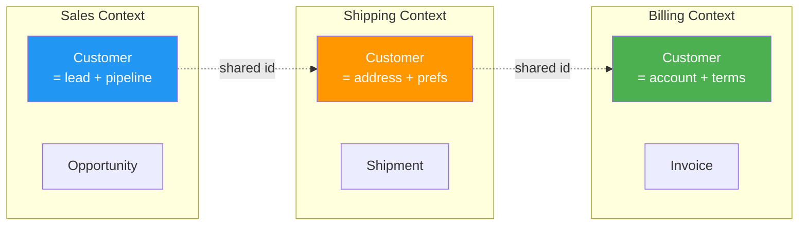

*Welcome back to the Citadel, Architect. You have learned to shape objects with patterns; now you must learn to shape the meaning the objects carry. **Domain-Driven Design** is the discipline of letting the business domain - not the database, not the framework - drive the design of your software. It is how a payments team and a payments codebase come to speak exactly the same language.*

*Whether your last project drowned in a "God service" that knew everything, or you have watched two teams argue because "customer" meant different things to each, this quest forges the tools to carve a complex domain into models that stay clean as they grow.*

## 📖 The Legend Behind This Quest

*In 2003, Eric Evans gave a name to a craft that great engineers practiced by instinct: aligning the model in the code with the model in the experts' heads. He observed that the costliest defects are not bugs in algorithms but mistranslations - the moment a developer guesses what "settlement" means and guesses wrong.*

*DDD's remedy is twofold. **Tactical patterns** (entities, value objects, aggregates, repositories) give you a precise vocabulary for the building blocks. **Strategic patterns** (bounded contexts, context maps, the ubiquitous language) keep large systems from collapsing into one tangled model. Master both and your microservices - which you will design next - will have boundaries that actually make sense.*

## 🎯 Quest Objectives

By the time you complete this epic journey, you will have mastered:

### Primary Objectives (Required for Quest Completion)
- [ ] **Ubiquitous Language** - Build a shared vocabulary that lives in code, tests, and conversation
- [ ] **Entities vs. Value Objects** - Decide what has identity and what is defined purely by its attributes
- [ ] **Aggregates and Invariants** - Draw consistency boundaries that protect business rules
- [ ] **Bounded Contexts** - Split a large domain into models that are internally consistent

### Secondary Objectives (Bonus Achievements)
- [ ] **Repositories** - Abstract persistence behind a domain-shaped interface
- [ ] **Domain Events** - Capture meaningful business occurrences as first-class objects
- [ ] **Context Mapping** - Describe how bounded contexts relate (shared kernel, anticorruption layer)

### Mastery Indicators
You'll know you've truly mastered this quest when you can:
- [ ] Defend why a given concept is an entity rather than a value object
- [ ] Draw an aggregate boundary and name the invariant it protects
- [ ] Explain why "customer" can legitimately mean two different things in two contexts
- [ ] Write a ubiquitous-language glossary that a domain expert would approve

## 🗺️ Quest Prerequisites

### 📋 Knowledge Requirements
- [ ] Comfortable with OO modeling and composition
- [ ] Completed [Software Design Patterns](/quests/1110/design-patterns/) (recommended)
- [ ] Have worked on a system with real business rules

### 🛠️ System Requirements
- [ ] Modern operating system (Windows 10+, macOS 10.14+, or Linux)
- [ ] Python 3.10+ installed
- [ ] A text editor or IDE (VS Code recommended)

### 🧠 Skill Level Indicators
This **🔴 Hard** quest expects:
- [ ] You have seen requirements lost in translation between teams
- [ ] You can model a small domain on a whiteboard
- [ ] Ready for 3-4 hours of focused study

## 🌍 Choose Your Adventure Platform

*DDD is a way of thinking, so the platform matters little. The code samples use Python; the modeling exercises need only paper or a whiteboard.*

### 🍎 macOS Kingdom Path

<details>
<summary>Click to expand macOS instructions</summary>

```bash
brew install python@3.12
mkdir -p ~/ddd-quest && cd ~/ddd-quest
python3 -m venv .venv && source .venv/bin/activate
python --version
```

</details>

### 🪟 Windows Empire Path

<details>
<summary>Click to expand Windows instructions</summary>

```powershell
winget install Python.Python.3.12
mkdir ddd-quest; cd ddd-quest
python -m venv .venv; .\.venv\Scripts\Activate.ps1
python --version
```

</details>

### 🐧 Linux Territory Path

<details>
<summary>Click to expand Linux instructions</summary>

```bash
sudo apt update && sudo apt install -y python3 python3-venv  # Debian/Ubuntu
mkdir -p ~/ddd-quest && cd ~/ddd-quest
python3 -m venv .venv && source .venv/bin/activate
python --version
```

</details>

### ☁️ Cloud Realms Path

<details>
<summary>Click to expand Cloud/Container instructions</summary>

```bash
docker run -it --rm python:3.12-slim bash
python --version
```

</details>

## 🧙‍♂️ Chapter 1: The Ubiquitous Language - One Tongue for All

*A bounded context's first asset is its words. When developers, testers, and domain experts use the same term to mean the same thing, mistranslation - the costliest defect - disappears.*

### ⚔️ Skills You'll Forge in This Chapter
- Distilling a glossary from how experts actually speak
- Letting that language name your classes, methods, and tests
- Spotting when one word secretly means two things

### 🏗️ Language That Lives in Code

The ubiquitous language is not documentation you write once. It is the names in your code. If experts say "a policy *lapses*," your code says `policy.lapse()`, not `policy.set_status(3)`.

```python
# ❌ Anemic, framework-shaped — the business vocabulary has vanished
order.status = 2
order.update()

# ✅ Ubiquitous language made executable — the method names ARE the glossary
order.confirm()        # transitions a draft to a confirmed order
order.ship(carrier)    # only legal once confirmed
order.cancel(reason)   # records why, not just that
```

When a new term appears in a meeting ("backorder," "settlement window"), it belongs in the glossary first, then in the code. A drifted name is a future bug.

### 🔍 Knowledge Check: Language
- [ ] Why is `order.confirm()` better than `order.status = 2`?
- [ ] What should happen first when a domain expert uses a word you do not have?
- [ ] How does a shared glossary reduce defects?

## 🧙‍♂️ Chapter 2: Tactical Patterns - Entities, Value Objects, Aggregates

*Now we forge the building blocks. The central question for every concept: does it have an identity that persists through change, or is it defined entirely by its values?*

### ⚔️ Skills You'll Forge in This Chapter
- Entities vs. value objects
- Aggregates as consistency boundaries
- Repositories as the seam to persistence

### 🏗️ Entities vs. Value Objects

An **entity** has a thread of identity: a `Customer` is the same customer even after they change their name. A **value object** is interchangeable when its attributes match: two `Money(10, "USD")` instances are equal and immutable.

```python
from dataclasses import dataclass

@dataclass(frozen=True)            # value object: immutable, compared by value
class Money:
    amount: int                    # store minor units (cents) to avoid float drift
    currency: str
    def __add__(self, other: "Money") -> "Money":
        if self.currency != other.currency:
            raise ValueError("Cannot add different currencies")
        return Money(self.amount + other.amount, self.currency)

class Customer:                    # entity: identity persists through change
    def __init__(self, customer_id: str, name: str):
        self.id = customer_id      # equality is by id, not by attributes
        self.name = name
    def rename(self, new_name: str) -> None:
        self.name = new_name       # still the same customer afterwards

print(Money(500, "USD") + Money(250, "USD"))   # Money(750, 'USD')
```

### 🏗️ Aggregates - The Consistency Boundary

An **aggregate** is a cluster of objects treated as one unit for data changes, with a single **root** that is the only entry point. The aggregate guards an *invariant* - a rule that must always hold.

```python
class OrderLine:
    def __init__(self, sku: str, qty: int):
        self.sku, self.qty = sku, qty

class Order:                       # aggregate root
    MAX_LINES = 50
    def __init__(self, order_id: str):
        self.id = order_id
        self._lines: list[OrderLine] = []   # internals are private
    def add_line(self, sku: str, qty: int) -> None:
        # Invariant enforced HERE, at the root — nowhere else may mutate lines
        if len(self._lines) >= self.MAX_LINES:
            raise ValueError("An order may not exceed 50 lines")
        if qty <= 0:
            raise ValueError("Quantity must be positive")
        self._lines.append(OrderLine(sku, qty))
    @property
    def line_count(self) -> int:
        return len(self._lines)
```

Rule of thumb: keep aggregates small, reference other aggregates by id (not by object), and load/save each aggregate as a whole through a **repository**.

```python
from abc import ABC, abstractmethod

class OrderRepository(ABC):        # domain-shaped persistence seam
    @abstractmethod
    def get(self, order_id: str) -> Order: ...
    @abstractmethod
    def save(self, order: Order) -> None: ...
```

### 🔍 Knowledge Check: Tactical Patterns
- [ ] Is an `Address` usually an entity or a value object? Why?
- [ ] Why must all changes to order lines go through the `Order` root?
- [ ] Why reference other aggregates by id rather than holding the object?

## 🧙‍♂️ Chapter 3: Strategic Design - Bounded Contexts and Context Maps

*One model cannot serve an entire enterprise. A **bounded context** is an explicit boundary within which a model and its language are consistent. Cross the boundary and the same word may mean something new.*

### ⚔️ Skills You'll Forge in This Chapter
- Carving a domain into bounded contexts
- Reading and drawing a context map
- The anticorruption layer

### 🏗️ Why "Customer" Means Two Things

In **Sales**, a Customer is a lead with a pipeline stage. In **Shipping**, a Customer is an address and a delivery preference. Forcing both into one bloated `Customer` class is how models rot. Bounded contexts let each model be exactly as rich as its own job requires.



A **context map** documents the relationships between contexts - shared kernel, customer/supplier, or an **anticorruption layer (ACL)** that translates an external model into yours so a foreign model never leaks in. These boundaries are the natural seams along which you will later split microservices.

### 🔍 Knowledge Check: Strategic Design
- [ ] Why is one giant `Customer` model a liability across an enterprise?
- [ ] What does an anticorruption layer protect you from?
- [ ] How do bounded contexts foreshadow service boundaries?

## 🎮 Mastery Challenges

### 🟢 Novice Challenge: Build a Glossary
**Objective**: Pick a domain you know (a library, a gym, a game). Write a 10-term ubiquitous-language glossary.

**Requirements**:
- [ ] Each term is one a domain expert would actually use
- [ ] Mark which terms are entities and which are value objects
- [ ] Flag any term that means two things in two parts of the domain

**Validation**: A non-developer in that domain agrees the definitions are correct.

### 🟡 Intermediate Challenge: Draw an Aggregate
**Objective**: Model one aggregate from your domain in code, enforcing one real invariant at the root.

**Requirements**:
- [ ] An aggregate root with private internals
- [ ] At least one value object
- [ ] An invariant that the root enforces and tests prove

**Validation**: A test demonstrates the invariant cannot be violated from outside.

### 🔴 Advanced Challenge: Context Map
**Objective**: Decompose your domain into 3+ bounded contexts and draw the context map.

**Requirements**:
- [ ] Name each context and its core model
- [ ] Identify one term that legitimately differs across contexts
- [ ] Mark at least one relationship as an anticorruption layer and explain why

**Validation**: Each context's model is internally consistent and minimal.

## 🏆 Quest Rewards & Achievements

**🎖️ Badges Earned**:
- 🏆 **Domain Cartographer** - You can carve a business into clean bounded contexts
- 🗣️ **Speaker of the Ubiquitous Tongue** - Your code and your conversations use one language

**🛠️ Skills Unlocked**:
- **Tactical Modeling** - Entities, value objects, aggregates, repositories
- **Strategic Design** - Bounded contexts and context mapping

**🔓 Unlocked Quests**:
- Microservices Architecture - Turn bounded contexts into deployable services
- Event-Driven Design - Let domain events flow between contexts

**📊 Progression Points**: +90 XP

## 🗺️ Next Steps in Your Journey

**Continue the Main Story**:
- 🎯 [Microservices Architecture](/quests/1110/microservices-architecture/) - Bounded contexts become services

**Explore Side Adventures**:
- ⚔️ [Event-Driven Design](/quests/1110/event-driven-design/) - Domain events as the connective tissue

### Character Class Recommendations

**💻 Software Developer**: Continue to [Microservices Architecture](/quests/1110/microservices-architecture/)  
**🏗️ System Engineer**: Explore [Event-Driven Design](/quests/1110/event-driven-design/)  
**📊 Data Scientist**: Note how bounded contexts clarify which data is authoritative where

## 📚 Resources

### Official Documentation
- [Domain-Driven Design Reference (Eric Evans, free PDF)](https://www.domainlanguage.com/ddd/reference/) - The condensed pattern catalog
- [Python `dataclasses`](https://docs.python.org/3/library/dataclasses.html) - Used for value objects above

### Community Resources
- [Domain-Driven Design (Eric Evans, the "Blue Book")](https://www.dddcommunity.org/book/evans_2003/) - The foundational text
- [Implementing Domain-Driven Design (Vaughn Vernon)](https://www.informit.com/store/implementing-domain-driven-design-9780321834577) - The practical "Red Book"
- [DDD Community](https://www.dddcommunity.org/) - Articles and example projects

### Learning Materials
- [Martin Fowler - Bounded Context](https://martinfowler.com/bliki/BoundedContext.html) - A crisp definition
- [Martin Fowler - DDD Aggregate](https://martinfowler.com/bliki/DDD_Aggregate.html) - Aggregates explained

## 🤝 Quest Completion Checklist

- [ ] ✅ Completed all primary objectives
- [ ] ✅ Wrote a ubiquitous-language glossary for a real domain
- [ ] ✅ Answered all knowledge check questions
- [ ] ✅ Completed at least one mastery challenge
- [ ] ✅ Explored the resource library
- [ ] ✅ Identified your next quest in the journey

## 🕸️ Knowledge Graph

*Structured wiki-links connect this quest to the IT-Journey knowledge graph. Open the [Obsidian Graph View](/docs/obsidian/graph/) to explore connections.*

**Level hub:** [[Level 1110 - Architecture & Design Patterns]]
**Overworld:** [[🏰 Overworld - Master Quest Map]]
**Prerequisites:** [[Software Design Patterns: Gang of Four and Modern Patterns]]
**Unlocks:** [[Microservices Architecture: Decomposing the Monolith]] · [[Event-Driven Design: Pub/Sub, Event Sourcing, and CQRS]]
**Obsidian docs:** [[Obsidian Knowledge Graph and Wiki Links]]
