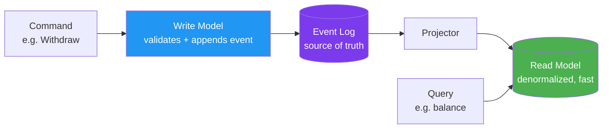

*Architect, your services now stand as separate keeps - but they still shout across the courtyard, each waiting for the other to answer. **Event-Driven Design** teaches them a better way to communicate: instead of demanding answers, a service simply *announces what happened* and lets anyone who cares react. This single shift - from commands to events - is the secret behind systems that scale, decouple, and heal.*

*Whether you have watched a synchronous call chain collapse because one service was slow, or you want an audit log that is the source of truth rather than an afterthought, this quest forges the patterns of events, pub/sub, event sourcing, and CQRS - along with the hard-won wisdom of eventual consistency.*

## 📖 The Legend Behind This Quest

*A request/response call is a question: "Reserve this stock - and I will wait." An **event** is a statement of fact: "OrderPlaced happened." The difference is profound. A question couples the asker to the answerer's availability. A fact, once published, can be consumed by zero or a hundred listeners, now or an hour from now, without the publisher ever knowing.*

*From this idea grow three great patterns. **Pub/sub** decouples producers from consumers through a broker. **Event sourcing** stores the events themselves as the source of truth, reconstructing state by replaying them. **CQRS** splits the write model from the read model so each can be optimized independently. The price for all this power is **eventual consistency** - and learning to design for it is the heart of this quest.*

## 🎯 Quest Objectives

By the time you complete this epic journey, you will have mastered:

### Primary Objectives (Required for Quest Completion)
- [ ] **Events as Facts** - Model a workflow as a stream of things that happened, named in past tense
- [ ] **Publish/Subscribe** - Decouple producers and consumers through a message broker
- [ ] **Event Sourcing** - Store events as the source of truth and rebuild state by replay
- [ ] **CQRS** - Separate the command (write) model from the query (read) model

### Secondary Objectives (Bonus Achievements)
- [ ] **Eventual Consistency** - Design for the window where readers see stale data
- [ ] **Idempotency** - Make consumers safe to receive the same event twice
- [ ] **Ordering and Partitioning** - Reason about when event order matters

### Mastery Indicators
You'll know you've truly mastered this quest when you can:
- [ ] Name events as past-tense facts, not as commands in disguise
- [ ] Explain why a consumer must be idempotent
- [ ] Decide when event sourcing's cost is justified
- [ ] Describe a read model rebuilt from events for a fast query

## 🗺️ Quest Prerequisites

### 📋 Knowledge Requirements
- [ ] Understand microservices and inter-service communication
- [ ] Completed [Microservices Architecture](/quests/1110/microservices-architecture/) (required)
- [ ] Basic grasp of queues and append-only logs

### 🛠️ System Requirements
- [ ] Modern operating system (Windows 10+, macOS 10.14+, or Linux)
- [ ] Docker for the optional broker lab
- [ ] A text editor or IDE (VS Code recommended)

### 🧠 Skill Level Indicators
This **🔴 Hard** quest expects:
- [ ] You have felt synchronous coupling slow a system down
- [ ] You can reason about ordering, retries, and duplicates
- [ ] Ready for 4-5 hours of focused study

## 🌍 Choose Your Adventure Platform

*The patterns are broker-independent. The optional lab spins up a single-node Kafka (or Redpanda) so you can publish and consume real events.*

### 🍎 macOS Kingdom Path

<details>
<summary>Click to expand macOS instructions</summary>

```bash
brew install --cask docker
# Redpanda is a lightweight, Kafka-compatible broker for local use
docker run -d --name redpanda -p 9092:9092 \
  redpandadata/redpanda:latest redpanda start --overprovisioned --smp 1
```

</details>

### 🪟 Windows Empire Path

<details>
<summary>Click to expand Windows instructions</summary>

```powershell
winget install Docker.DockerDesktop
docker run -d --name redpanda -p 9092:9092 `
  redpandadata/redpanda:latest redpanda start --overprovisioned --smp 1
```

</details>

### 🐧 Linux Territory Path

<details>
<summary>Click to expand Linux instructions</summary>

```bash
sudo apt update && sudo apt install -y docker.io
sudo systemctl enable --now docker
sudo docker run -d --name redpanda -p 9092:9092 \
  redpandadata/redpanda:latest redpanda start --overprovisioned --smp 1
```

</details>

### ☁️ Cloud Realms Path

<details>
<summary>Click to expand Cloud/Container instructions</summary>

```bash
# In a Codespace or container host, the same image works.
docker run -d --name redpanda -p 9092:9092 \
  redpandadata/redpanda:latest redpanda start --overprovisioned --smp 1
```

</details>

## 🧙‍♂️ Chapter 1: Events and Pub/Sub - Announce, Don't Ask

*The first move is mental: stop calling services and start publishing facts. A broker sits between producers and consumers so neither knows the other exists.*

### ⚔️ Skills You'll Forge in This Chapter
- Naming events as past-tense facts
- The producer / broker / consumer triangle
- Why decoupling buys resilience and extensibility

### 🏗️ Events Are Facts in the Past Tense

```python
# ❌ A command pretending to be an event — couples producer to a specific reaction
{"type": "SendWelcomeEmail", "user_id": 42}

# ✅ An event — a fact about what happened; consumers decide what to do
{"type": "UserRegistered", "user_id": 42, "at": "2026-06-14T10:00:00Z"}
```

The `UserRegistered` event can trigger a welcome email, a CRM record, and an analytics update - and you can add a fourth consumer next year without touching the producer.

### 🏗️ Publish/Subscribe in Action

```python
# Producer — publishes a fact to a topic and moves on (fire and forget)
from kafka import KafkaProducer
import json

producer = KafkaProducer(
    bootstrap_servers="localhost:9092",
    value_serializer=lambda v: json.dumps(v).encode("utf-8"),
)
producer.send("user-events", {"type": "UserRegistered", "user_id": 42})
producer.flush()
```

```python
# Consumer — one of many subscribers; the producer has no idea it exists
from kafka import KafkaConsumer
import json

consumer = KafkaConsumer(
    "user-events",
    bootstrap_servers="localhost:9092",
    group_id="welcome-emailer",                  # consumer groups enable scaling
    value_deserializer=lambda b: json.loads(b.decode("utf-8")),
)
for message in consumer:
    event = message.value
    if event["type"] == "UserRegistered":
        print(f"Sending welcome email to user {event['user_id']}")
```

### 🔍 Knowledge Check: Events and Pub/Sub
- [ ] Why is `UserRegistered` a better message than `SendWelcomeEmail`?
- [ ] What does the broker decouple the producer from?
- [ ] How does adding a new consumer affect the producer? (Answer: not at all)

## 🧙‍♂️ Chapter 2: Event Sourcing and CQRS - The Log as Truth

*Most systems store current state and overwrite the past. Event sourcing flips this: the **events are the truth**, and current state is just a projection you can always rebuild.*

### ⚔️ Skills You'll Forge in This Chapter
- Event sourcing vs. state-oriented storage
- Rebuilding state by replaying events
- CQRS: separate write and read models

### 🏗️ State as a Fold over Events

```python
# The event log is append-only and is the source of truth.
events = [
    {"type": "AccountOpened", "balance": 0},
    {"type": "Deposited",  "amount": 100},
    {"type": "Withdrew",   "amount": 30},
]

def apply(state: int, event: dict) -> int:
    match event["type"]:
        case "AccountOpened": return event["balance"]
        case "Deposited":     return state + event["amount"]
        case "Withdrew":      return state - event["amount"]
        case _:               return state

# Current state is derived by replaying every event — never stored as the truth
balance = 0
for e in events:
    balance = apply(balance, e)
print(balance)   # 70 — and you have a perfect audit trail for free
```

Event sourcing gives you a complete history (great for audit, debugging, and "what did the world look like on Tuesday?"), but it costs complexity: you need snapshots for performance and a strategy for evolving event schemas.

### 🏗️ CQRS - Two Models, One Truth

**CQRS** (Command Query Responsibility Segregation) splits the model that *changes* state from the model that *reads* it. Writes go through the event log; a separate, denormalized read model is updated from those events for fast queries.



The read model lags the write model by a small window - this is **eventual consistency**, the subject of Chapter 3.

### 🔍 Knowledge Check: Event Sourcing and CQRS
- [ ] What is stored as the source of truth in event sourcing?
- [ ] Why might a read model be denormalized while the write model is not?
- [ ] What problem do snapshots solve in an event-sourced system?

## 🧙‍♂️ Chapter 3: Eventual Consistency and Idempotency

*Asynchronous systems trade immediate consistency for availability and decoupling. Mastering the consequences - stale reads and duplicate deliveries - is what separates a working event system from a corrupting one.*

### ⚔️ Skills You'll Forge in This Chapter
- Designing for the stale-read window
- Idempotent consumers
- Reasoning about ordering

### 🏗️ Idempotency - Surviving Duplicates

Most brokers guarantee *at-least-once* delivery: a consumer may see the same event twice (after a crash and retry). Consumers must therefore be **idempotent** - processing an event twice has the same effect as once.

```python
processed_ids: set[str] = set()   # in production: a database with a unique index

def handle(event: dict) -> None:
    event_id = event["id"]
    if event_id in processed_ids:           # already handled — skip safely
        return
    # ... apply the effect exactly once (e.g. credit the account) ...
    processed_ids.add(event_id)
```

A non-idempotent consumer that "adds $100" on every delivery will double-credit on a retry - a real bug that idempotency keys prevent.

### 🏗️ Designing for Stale Reads

Because the read model lags, a user who places an order may not see it in their list for a few hundred milliseconds. Design around it: show an optimistic "processing" state, read-your-own-writes from the write side when freshness matters, and reserve strong consistency for the few operations that truly need it.

### 🔍 Knowledge Check: Consistency
- [ ] Why must an at-least-once consumer be idempotent?
- [ ] What is the eventual-consistency window, and where does it come from?
- [ ] When is eventual consistency unacceptable, and what do you do then?

## 🎮 Mastery Challenges

### 🟢 Novice Challenge: Produce and Consume
**Objective**: Using the local broker, publish three events and consume them with two independent consumers.

**Requirements**:
- [ ] Events are named as past-tense facts
- [ ] Two consumers in different groups both receive every event
- [ ] One consumer demonstrates idempotency on a replayed event

**Validation**: Replaying an event does not double-apply its effect.

### 🟡 Intermediate Challenge: Event-Source an Aggregate
**Objective**: Model a small aggregate (a bank account or a shopping cart) as an event log and rebuild its state by replay.

**Requirements**:
- [ ] An append-only event list as the source of truth
- [ ] An `apply` fold that reconstructs current state
- [ ] A snapshot to avoid replaying from the beginning

**Validation**: State rebuilt from events matches state rebuilt from snapshot + tail.

### 🔴 Advanced Challenge: CQRS Design Memo
**Objective**: For a workflow you know, design a CQRS split and name the consistency trade-off.

**Requirements**:
- [ ] Define the command, the events it emits, and the read model
- [ ] Identify the eventual-consistency window and its user-facing impact
- [ ] Justify why CQRS is worth its complexity here (or argue it is not)

**Validation**: The memo names a concrete read query that CQRS makes fast.

## 🏆 Quest Rewards & Achievements

**🎖️ Badges Earned**:
- 🏆 **Herald of Events** - You model systems as streams of facts, not chains of calls
- 🔮 **Keeper of the Log** - You wield event sourcing and CQRS deliberately

**🛠️ Skills Unlocked**:
- **Event Modeling** - Turn a workflow into well-named events
- **Eventual-Consistency Reasoning** - Design safely around stale reads and duplicates

**🔓 Unlocked Quests**:
- Scaling Strategies - Asynchronous events are the backbone of horizontal scale

**📊 Progression Points**: +95 XP

## 🗺️ Next Steps in Your Journey

**Continue the Main Story**:
- 🎯 [Scaling Strategies](/quests/1110/scaling-strategies/) - Events let you scale consumers independently

**Explore Side Adventures**:
- ⚔️ [API Gateway Patterns](/quests/1110/api-gateway-patterns/) - The synchronous front door to your async core
- ⚔️ [Domain-Driven Design](/quests/1110/domain-driven-design/) - Domain events are where this began

### Character Class Recommendations

**💻 Software Developer**: Continue to [Scaling Strategies](/quests/1110/scaling-strategies/)  
**🏗️ System Engineer**: Revisit [Microservices Architecture](/quests/1110/microservices-architecture/) with events in mind  
**📊 Data Scientist**: Note how an event log is a ready-made stream for analytics

## 📚 Resources

### Official Documentation
- [Apache Kafka Documentation](https://kafka.apache.org/documentation/) - The reference broker
- [Redpanda docs](https://docs.redpanda.com/) - The Kafka-compatible broker used in the lab
- [kafka-python](https://kafka-python.readthedocs.io/) - The client library above

### Community Resources
- [Martin Fowler - Event Sourcing](https://martinfowler.com/eaaDev/EventSourcing.html) - The canonical explanation
- [Martin Fowler - CQRS](https://martinfowler.com/bliki/CQRS.html) - When to use it (and when not to)
- [microservices.io - Event-driven patterns](https://microservices.io/patterns/data/event-driven-architecture.html) - Pattern catalog

### Learning Materials
- [Designing Event-Driven Systems (Ben Stopford, free)](https://www.confluent.io/designing-event-driven-systems/) - A full free book
- [Greg Young - Event Sourcing talk](https://www.youtube.com/watch?v=8JKjvY4etTY) - From the pattern's chief evangelist

## 🤝 Quest Completion Checklist

- [ ] ✅ Completed all primary objectives
- [ ] ✅ Published and consumed real events with an idempotent consumer
- [ ] ✅ Answered all knowledge check questions
- [ ] ✅ Completed at least one mastery challenge
- [ ] ✅ Explored the resource library
- [ ] ✅ Identified your next quest in the journey

## 🕸️ Knowledge Graph

*Structured wiki-links connect this quest to the IT-Journey knowledge graph. Open the [Obsidian Graph View](/docs/obsidian/graph/) to explore connections.*

**Level hub:** [[Level 1110 - Architecture & Design Patterns]]
**Overworld:** [[🏰 Overworld - Master Quest Map]]
**Prerequisites:** [[Microservices Architecture: Decomposing the Monolith]] · [[Domain-Driven Design: Modeling the Business in Code]]
**Unlocks:** [[Scaling Strategies: Horizontal Growth, Caching, and CAP]]
**Obsidian docs:** [[Obsidian Knowledge Graph and Wiki Links]]
