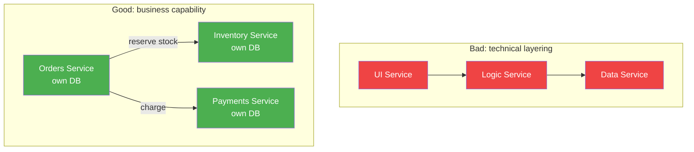

*Architect, the Citadel now turns from the design of a single keep to the design of a *kingdom*. **Microservices Architecture** is the art of splitting one application into many independently deployable services - and the wisdom to know when that splitting helps and when it merely trades simple problems for distributed ones.*

*Whether your monolith has become a fearsome thing that no one dares deploy on a Friday, or you are tempted to start a green-field project with forty services because the conference talks said so, this quest forges the judgment to decompose deliberately, along boundaries that the business itself defines.*

## 📖 The Legend Behind This Quest

*Once, every application was a monolith: one codebase, one deployment, one database. This is not a sin - it is often the right answer. But as teams grow and a single codebase becomes a single point of contention, the monolith can calcify. Microservices emerged as a way to let teams deploy independently, scale parts separately, and isolate failures.*

*The catch, learned by every team the hard way: a microservice architecture replaces in-process function calls (fast, reliable) with network calls (slow, fallible). You inherit the **fallacies of distributed computing** - the network is not reliable, latency is not zero, bandwidth is not infinite. This quest teaches you to weigh those costs honestly, so you decompose only when the benefit is real.*

## 🎯 Quest Objectives

By the time you complete this epic journey, you will have mastered:

### Primary Objectives (Required for Quest Completion)
- [ ] **Monolith vs. Microservices** - Articulate the real trade-offs and choose deliberately
- [ ] **Decomposition by Bounded Context** - Find service boundaries that follow the business, not the code
- [ ] **Inter-Service Communication** - Compare synchronous (REST/gRPC) and asynchronous (events) styles
- [ ] **Data Ownership** - Apply database-per-service and confront the loss of distributed transactions

### Secondary Objectives (Bonus Achievements)
- [ ] **The Fallacies of Distributed Computing** - Internalize why distribution is hard
- [ ] **Resilience Patterns** - Apply timeouts, retries, and circuit breakers
- [ ] **The Saga Pattern** - Maintain consistency across services without a global transaction

### Mastery Indicators
You'll know you've truly mastered this quest when you can:
- [ ] Defend "keep the monolith" as a valid, often-correct answer
- [ ] Draw service boundaries along bounded contexts and justify each cut
- [ ] Explain why a chatty service boundary is a design smell
- [ ] Describe how a saga replaces a distributed transaction

## 🗺️ Quest Prerequisites

### 📋 Knowledge Requirements
- [ ] Understand HTTP APIs and service-to-service calls
- [ ] Familiarity with Docker basics
- [ ] Completed [Domain-Driven Design](/quests/1110/domain-driven-design/) (recommended)

### 🛠️ System Requirements
- [ ] Modern operating system (Windows 10+, macOS 10.14+, or Linux)
- [ ] Docker installed (`docker --version`) for the optional lab
- [ ] A text editor or IDE (VS Code recommended)

### 🧠 Skill Level Indicators
This **⚔️ Epic** quest expects:
- [ ] You have shipped at least one networked service
- [ ] You understand that a network call can fail or hang
- [ ] Ready for 5-6 hours of focused study

## 🌍 Choose Your Adventure Platform

*The concepts are platform-independent. The optional lab runs two tiny services in containers so you can watch them call each other.*

### 🍎 macOS Kingdom Path

<details>
<summary>Click to expand macOS instructions</summary>

```bash
brew install --cask docker
# Verify the engine is running
docker --version
docker compose version
```

</details>

### 🪟 Windows Empire Path

<details>
<summary>Click to expand Windows instructions</summary>

```powershell
winget install Docker.DockerDesktop
docker --version
docker compose version
```

</details>

### 🐧 Linux Territory Path

<details>
<summary>Click to expand Linux instructions</summary>

```bash
sudo apt update && sudo apt install -y docker.io docker-compose-plugin
sudo systemctl enable --now docker
docker --version
```

</details>

### ☁️ Cloud Realms Path

<details>
<summary>Click to expand Cloud/Container instructions</summary>

```bash
# A Codespace or any host with Docker works identically.
docker compose version
```

</details>

## 🧙‍♂️ Chapter 1: Monolith vs. Microservices - The Honest Ledger

*The most important microservices decision is whether to use them at all. Start here, with both columns of the ledger.*

### ⚔️ Skills You'll Forge in This Chapter
- The real benefits and real costs of each style
- The "monolith first" heuristic
- When team topology, not technology, decides

### 🏗️ The Trade-off Table

| Concern | Monolith | Microservices |
| --- | --- | --- |
| **Deployment** | One unit - simple, but all-or-nothing | Independent per service - flexible, more moving parts |
| **Scaling** | Scale the whole app | Scale hot services only |
| **Failure isolation** | A bug can take down everything | Failures can be contained (if designed for it) |
| **Communication** | In-process calls (fast, reliable) | Network calls (slow, fallible) |
| **Data** | One database, easy transactions | Database per service, no global transactions |
| **Team autonomy** | Coordination on one codebase | Teams own and deploy services independently |
| **Operational cost** | Low | High (observability, networking, CI/CD per service) |

The pragmatic heuristic from Martin Fowler: **"Monolith first."** Begin with a well-structured monolith, learn where the real boundaries are, and extract services only when a boundary proves stable and a team genuinely needs independent deployment.

### 🔍 Knowledge Check: The Ledger
- [ ] Name two costs microservices add that a monolith does not have
- [ ] Why might "monolith first" save you from premature service boundaries?
- [ ] When does team size justify splitting even a modest system?

## 🧙‍♂️ Chapter 2: Decomposition and Communication

*If you do split, the cut must follow a business boundary, not a technical layer. A "users service," "orders service," and "inventory service" mirror bounded contexts; a "controllers service" and "database service" do not.*

### ⚔️ Skills You'll Forge in This Chapter
- Decomposing by bounded context
- Synchronous vs. asynchronous communication
- Database-per-service and its consequences

### 🏗️ Boundaries Follow the Business



### 🏗️ Synchronous vs. Asynchronous

A service can call another **synchronously** (request/response, REST or gRPC) or **asynchronously** (publish an event and move on). Synchronous is simpler to reason about but couples availability: if Payments is down, Orders waits. Asynchronous decouples but adds eventual consistency.

```yaml
# docker-compose.yml — two services that talk over HTTP on a shared network
services:
  orders:
    build: ./orders
    ports: ["8001:8000"]
    environment:
      INVENTORY_URL: "http://inventory:8000"   # service discovery by name
    depends_on: [inventory]
  inventory:
    build: ./inventory
    expose: ["8000"]                            # internal only — reached via the gateway later
```

```python
# orders/app.py — a synchronous call with a timeout and graceful degradation
import os, httpx

INVENTORY_URL = os.environ["INVENTORY_URL"]

def reserve_stock(sku: str, qty: int) -> bool:
    try:
        # ALWAYS set a timeout — the network is not reliable
        resp = httpx.post(f"{INVENTORY_URL}/reserve",
                          json={"sku": sku, "qty": qty}, timeout=2.0)
        return resp.status_code == 200
    except httpx.RequestError:
        # Inventory is unreachable — fail clearly, do not hang the user
        return False
```

**Database per service** means each service owns its data and no other service touches its tables. This buys independence but costs you cross-service transactions - which Chapter 3 addresses.

### 🔍 Knowledge Check: Decomposition
- [ ] Why is a "data service" usually a bad boundary?
- [ ] What does Orders lose if Payments must be called synchronously and is down?
- [ ] Why must every network call set a timeout?

## 🧙‍♂️ Chapter 3: Distributed Reality - Failure, Sagas, and Resilience

*Distribution is not free. The defining skill of an Architect here is to design for the failures that in-process code never had.*

### ⚔️ Skills You'll Forge in This Chapter
- The fallacies of distributed computing
- Sagas for cross-service consistency
- Timeouts, retries, and circuit breakers

### 🏗️ The Saga Pattern

With no global transaction, a business process that spans services becomes a **saga**: a sequence of local transactions, each with a **compensating action** that undoes it if a later step fails.

```text
Place Order saga (orchestrated):
  1. Orders:    create order (pending)        → compensate: cancel order
  2. Inventory: reserve stock                  → compensate: release stock
  3. Payments:  charge card                    → compensate: refund
  4. Orders:    mark order confirmed
If step 3 fails: run compensations 2 and 1 in reverse — never a half-charged order.
```

### 🏗️ Resilience Patterns

```python
# A circuit breaker stops hammering a failing dependency.
class CircuitBreaker:
    def __init__(self, threshold=5, reset_after=30):
        self.failures, self.threshold = 0, threshold
        self.open_until, self.reset_after = 0, reset_after
    def call(self, fn, *args):
        import time
        if time.time() < self.open_until:           # circuit OPEN — fail fast
            raise RuntimeError("circuit open; skipping call")
        try:
            result = fn(*args)
            self.failures = 0                         # success resets the counter
            return result
        except Exception:
            self.failures += 1
            if self.failures >= self.threshold:       # trip the breaker
                self.open_until = time.time() + self.reset_after
            raise
```

Pair circuit breakers with **timeouts** (never wait forever) and **bounded retries with backoff** (retry transient failures, but not so hard you create a retry storm).

### 🔍 Knowledge Check: Distributed Reality
- [ ] What is a compensating action in a saga?
- [ ] Why is an unbounded retry dangerous during an outage?
- [ ] How does a circuit breaker protect both the caller and the callee?

## 🎮 Mastery Challenges

### 🟢 Novice Challenge: Two-Service Lab
**Objective**: Run the Orders and Inventory services from Chapter 2 with Docker Compose and watch one call the other.

**Requirements**:
- [ ] Both services start with `docker compose up`
- [ ] An Orders request triggers an Inventory call
- [ ] Stopping Inventory shows Orders degrade gracefully, not hang

**Validation**: Logs prove the timeout fired instead of a stuck request.

### 🟡 Intermediate Challenge: Decomposition Proposal
**Objective**: For a monolith you know, propose a split into 3-4 services.

**Requirements**:
- [ ] Each service maps to a bounded context, not a layer
- [ ] Name the data each service owns
- [ ] Identify one cross-service process that would need a saga

**Validation**: A reviewer agrees the boundaries minimize chatty calls.

### 🔴 Advanced Challenge: Trade-off Defense
**Objective**: Write a recommendation for a real or hypothetical team: monolith, modular monolith, or microservices.

**Requirements**:
- [ ] State team size, deploy frequency, and scaling needs
- [ ] Weigh operational cost honestly
- [ ] Recommend one and name what would change your mind

**Validation**: The memo would survive a skeptical staff-engineer review.

## 🏆 Quest Rewards & Achievements

**🎖️ Badges Earned**:
- 🏆 **Monolith Breaker** - You decompose along true business boundaries, only when warranted
- 🕸️ **Weaver of Services** - You design for the failures distribution introduces

**🛠️ Skills Unlocked**:
- **Service Decomposition** - Find boundaries that follow bounded contexts
- **Distributed Trade-off Analysis** - Weigh independence against operational cost

**🔓 Unlocked Quests**:
- API Gateway Patterns - Give your services one front door
- Event-Driven Design - Decouple services with asynchronous messaging
- Scaling Strategies - Scale the services that actually need it

**📊 Progression Points**: +100 XP

## 🗺️ Next Steps in Your Journey

**Continue the Main Story**:
- 🎯 [API Gateway Patterns](/quests/1110/api-gateway-patterns/) - The single front door for many services

**Explore Side Adventures**:
- ⚔️ [Event-Driven Design](/quests/1110/event-driven-design/) - Asynchronous, decoupled communication
- ⚔️ [Scaling Strategies](/quests/1110/scaling-strategies/) - Scale horizontally with confidence

### Character Class Recommendations

**💻 Software Developer**: Continue to [API Gateway Patterns](/quests/1110/api-gateway-patterns/)  
**🏗️ System Engineer**: Explore [Scaling Strategies](/quests/1110/scaling-strategies/)  
**🛡️ Security Specialist**: Note how a gateway centralizes auth across services

## 📚 Resources

### Official Documentation
- [microservices.io - Pattern Language](https://microservices.io/patterns/index.html) - Chris Richardson's canonical pattern catalog
- [Docker Compose docs](https://docs.docker.com/compose/) - Used in the lab above
- [Saga pattern (microservices.io)](https://microservices.io/patterns/data/saga.html) - The reference description

### Community Resources
- [Building Microservices (Sam Newman)](https://www.oreilly.com/library/view/building-microservices-2nd/9781492034018/) - The definitive book
- [Martin Fowler - Microservices](https://martinfowler.com/articles/microservices.html) - The article that named the trend
- [MonolithFirst (Martin Fowler)](https://martinfowler.com/bliki/MonolithFirst.html) - Why to resist premature splitting

### Learning Materials
- [Fallacies of Distributed Computing explained](https://www.simpleorientedarchitecture.com/8-fallacies-of-distributed-computing/) - The eight assumptions that bite
- [Release It! (Michael Nygard)](https://pragprog.com/titles/mnee2/release-it-second-edition/) - Stability and resilience patterns

## 🤝 Quest Completion Checklist

- [ ] ✅ Completed all primary objectives
- [ ] ✅ Ran the two-service lab and observed graceful degradation
- [ ] ✅ Answered all knowledge check questions
- [ ] ✅ Completed at least one mastery challenge
- [ ] ✅ Explored the resource library
- [ ] ✅ Identified your next quest in the journey

## 🕸️ Knowledge Graph

*Structured wiki-links connect this quest to the IT-Journey knowledge graph. Open the [Obsidian Graph View](/docs/obsidian/graph/) to explore connections.*

**Level hub:** [[Level 1110 - Architecture & Design Patterns]]
**Overworld:** [[🏰 Overworld - Master Quest Map]]
**Prerequisites:** [[Software Design Patterns: Gang of Four and Modern Patterns]] · [[Domain-Driven Design: Modeling the Business in Code]]
**Unlocks:** [[API Gateway Patterns: The Single Front Door]] · [[Event-Driven Design: Pub/Sub, Event Sourcing, and CQRS]] · [[Scaling Strategies: Horizontal Growth, Caching, and CAP]]
**Obsidian docs:** [[Obsidian Knowledge Graph and Wiki Links]]
