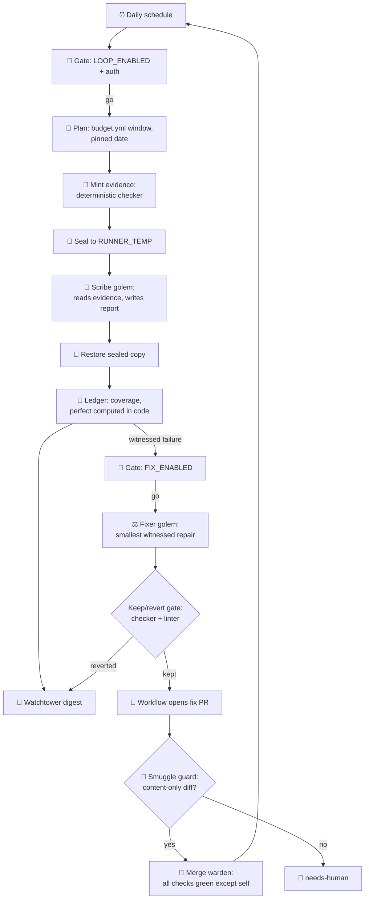
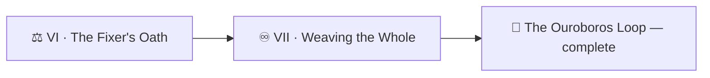

*Everything you have forged now joins: the turning wheel, the warden's gate, the oath-bound golems, the sealed evidence, the mana ledger, the honest fixer. One arc remains — the most dangerous one. For the serpent to close its circle, the loop must **merge its own repairs**. The realm grants that power only behind two final wards: a merge job that waits for every check except its own reflection, and a customs gate that inspects each pull request's cargo before the seal falls. Then you turn the whole wheel, hands off, and watch a defect you planted get witnessed, repaired, gated, merged, and certified — by nothing but the machine you built.*

*The real-world skills: composing multi-lane automation into one architecture, the self-referential deadlock class (a checker that waits on itself), diff classification as a merge precondition, and reading a fully autonomous run end-to-end.*

> 🧭 **Campaign note:** Level `1110` is Architecture & Design Patterns — precisely what this chapter is: the pattern language of the whole campaign, assembled.

## 📖 The Legend Behind This Quest

*The engine's merge warden carried one flaw so quiet it survived every review: told to "wait until every check on the pull request finishes," it waited — on all of them — including **its own**. And its own check could never finish while it stood there watching. Thirty minutes of a warden staring at his own reflection, then a timeout, then a red mark, every single time. Four dependency scrolls piled up unmerged before anyone read the water. The cure was one idea: when you are one of the checks, **excuse yourself from the list you are waiting on.** The morning after that fix merged, the whole circle closed for the first time: six slices walked, one repair gated and kept, and the merge warden — no longer hypnotized — sealed it into the chronicle unaided.*

## 🎯 Quest Objectives

By the end of this quest you will:

- [ ] **Draw the full architecture** — every lane, gate, and artifact of your loop on one map
- [ ] **Build the merge warden** — auto-merge that polls checks *excluding its own run* and merges only on all-green
- [ ] **Install the smuggle guard** — classify the fix PR's diff; only pure content merges itself
- [ ] **Close the circle** — one full turn: plant a defect → walk witnesses → fixer repairs → gates pass → auto-merge seals → ledger certifies
- [ ] **Write the runbook** — the one page a human needs the morning something is red

## 🗺️ Quest Prerequisites

- 📋 Chapters I–VI complete and green
- 📋 `AUTOMERGE_ENABLED` left **unset** until the final battle — you'll arm it last, like a professional

## 🧙‍♂️ Chapter 1: The Map of the Whole

Before the last weld, draw what you have built. This is your potion book's architecture — and, scaled up, the realm's quest-perfection engine:



Every box is something you built. The two unbuilt ones — the smuggle guard and the merge warden — are today.

### 🔍 Knowledge Check
- [ ] Trace a forged-evidence attempt through the map. Where does it die?
- [ ] Trace a mana drought. Which boxes limit the damage, and which record it?

## 🧙‍♂️ Chapter 2: The Merge Warden and the Mirror

The naive merge warden is one line — `gh pr checks "$PR" --watch` then merge — and it carries the deadlock: `--watch` waits for **every** check, including the warden's own, which stays pending exactly as long as it watches. Build the cured version:


```yaml
# .github/workflows/auto-merge.yml
name: Merge Warden
on:
  pull_request_target:
    types: [labeled, opened, synchronize, ready_for_review]

permissions:
  contents: write
  pull-requests: write
  checks: read

jobs:
  merge:
    if: >-
      vars.AUTOMERGE_ENABLED == 'true' &&
      github.event.pull_request.head.repo.full_name == github.repository &&
      contains(github.event.pull_request.labels.*.name, 'auto-fix') &&
      !contains(github.event.pull_request.labels.*.name, 'needs-human')
    runs-on: ubuntu-latest
    timeout-minutes: 30
    env:
      GH_TOKEN: ${{ github.token }}
      PR: ${{ github.event.pull_request.number }}
      RUN_ID: ${{ github.run_id }}
    steps:
      - name: Wait for every check EXCEPT our own reflection, then merge
        run: |
          set -euo pipefail
          deadline=$(( $(date +%s) + 25 * 60 ))
          while :; do
            rows=$(gh pr checks "$PR" --json bucket,link \
                     --jq '.[] | [.bucket, .link] | @tsv' 2>/dev/null || true)
            others=$(printf '%s\n' "$rows" | grep -v "/${RUN_ID}/" || true)
            if [ -z "$others" ]; then    # only our own check exists so far — wait, don't merge unchecked
              [ "$(date +%s)" -ge "$deadline" ] && exit 1
              sleep 30; continue
            fi
            if printf '%s\n' "$others" | awk -F'\t' '$1=="fail"{f=1} END{exit !f}'; then
              gh pr edit "$PR" --add-label needs-human
              echo "a real check failed — standing down."; exit 1
            fi
            if printf '%s\n' "$others" | awk -F'\t' '$1=="pending"{p=1} END{exit !p}'; then
              [ "$(date +%s)" -ge "$deadline" ] && exit 1
              sleep 30; continue
            fi
            break                        # no fails, none pending → all green
          done
          gh pr merge "$PR" --squash --delete-branch
```


The four verdict branches, in oath form: **a real failure blocks; pending waits; all-green merges; "only my own reflection" waits rather than merging unchecked.** That last branch is the humility clause — silence is not proof.

Before the warden may reach for the seal, the **smuggle guard** inspects the cargo. An `auto-fix` label is a claim; the diff is the truth:


```yaml
      - name: Smuggle guard — the label says content; verify the diff agrees
        run: |
          set -euo pipefail
          files=$(gh pr view "$PR" --json files --jq '.files[].path')
          bad=$(printf '%s\n' "$files" | grep -vE '^potions/' || true)
          if [ -n "$bad" ]; then
            gh pr edit "$PR" --add-label needs-human
            echo "::error::auto-fix PR touches non-content paths:"; echo "$bad"
            exit 1
          fi
```


Now a golem that somehow smuggled a workflow edit into a "content fix" meets a wall made of `grep`, not trust. Run this step before the wait-and-merge step.

### 🔍 Knowledge Check
- [ ] Why key the exclusion on the *run id* rather than the check's *name*?
- [ ] Why does the smuggle guard read the diff itself instead of trusting the label the fix lane applied?

## 🧙‍♂️ Chapter 3: The Full Turn — Hands Off

The final battle is a checklist, not a fight. Arm everything, plant one defect, and touch nothing else:

```bash
# Arm all three switches — the loop is now fully autonomous:
gh variable set LOOP_ENABLED --body true
gh variable set FIX_ENABLED --body true
gh variable set AUTOMERGE_ENABLED --body true

# Plant a knowable defect on today's window (typo a command in one potion),
# commit it like an innocent mistake, and step away from the keyboard:
git add -A && git commit -m "content: update elixir recipe" && git push

gh workflow run first-turn.yml     # or wait for the morning cron
gh run watch
```

Then read the turn like a saga, artifact by artifact: the walk witnesses the failure (sealed evidence, ledger `fail`, Watchtower digest) → the fix lane opens a PR whose body quotes the witnessed evidence → the smuggle guard passes it → the merge warden waits out every *other* check and seals it → the next walk of that window flips the ledger to `pass` → coverage completes → **`perfect: true`**. If every arrow fired without your hands, the circle is closed.

- [ ] **The circle closed:** defect planted → witnessed → repaired → gated → merged → certified, zero human interventions

## 🔁 Reproduce It

The real closing of the real circle:

- PR [#441](https://github.com/bamr87/it-journey/pull/441) — `bamr87/it-journey@d8313a993` (+99/−35): the self-deadlock cure applied to all three merge lanes at once — read its body for the log excerpt of a warden watching himself time out
- PR [#444](https://github.com/bamr87/it-journey/pull/444) — `bamr87/it-journey@4eefc45d7`: the consolidated digest of the first fully-autonomous morning (six slices walked, windows and coverage per slice)
- PR [#445](https://github.com/bamr87/it-journey/pull/445) — `bamr87/it-journey@08ca5d1cc`: the repair from that same morning — opened by the fix lane, **merged by the merge warden**, no human hands
- The smuggle guard at scale: `scripts/ci/classify_changes.py` + its gate in `.github/workflows/content-auto-merge.yml`

## 🎮 Mastery Challenge

**Objective:** prove the wards hold, then write the human's page.

**Success Criteria:**
- [ ] **Deadlock demo:** temporarily revert the warden to `--watch`, open a fix PR, and watch it hang on its own reflection; restore the cure and watch the same PR merge
- [ ] **Smuggle demo:** make the fixer's branch also touch `scripts/check.sh` (edit it from a workflow step for the test) and verify the guard labels it `needs-human` instead of merging
- [ ] **The runbook:** one page — what each switch disarms, where evidence/ledger/digest live, what `needs-human` means, and the first three commands to run when the morning digest is red
- [ ] **The disarm drill:** `gh variable delete AUTOMERGE_ENABLED` and confirm fixes still open PRs that politely wait for a human — autonomy degraded, never wedged

## 🎁 Rewards & Progression

- ♾️ **Loop Weaver** — the serpent turned once, unaided, on a repo you built from an empty directory
- 👑 **Perfection Engineer** — campaign complete: return to the [hub](/quests/codex/ouroboros-loop/) and claim it
- ⚡ Skills unlocked: loop architecture · self-merge safety · smuggle guards · runbook writing
- 📊 **+200 XP**

## 🗺️ Quest Network



## 🔮 Next Adventures

- 👑 Claim the campaign: [Epic Quest: The Ouroboros Loop](/quests/codex/ouroboros-loop/)
- 🏰 The prequel, if you skipped it: [Epic Quest: The Self-Operating Website](/quests/codex/self-operating-website/)
- 🔭 Deepen the scrying: [Level 1010 — Monitoring & Observability](/quests/1010/)

## 📚 Resource Codex

- [`gh pr checks`](https://cli.github.com/manual/gh_pr_checks) — read its `--watch` caveat with today's eyes
- [GitHub Actions: `pull_request_target`](https://docs.github.com/actions/writing-workflows/choosing-when-your-workflow-runs/events-that-trigger-workflows#pull_request_target) — why the warden never checks out the PR's code
- [Google SRE workbook: alerting & runbooks](https://sre.google/workbook/alerting-on-slos/) — the mortal world's runbook school

## 🕸️ Knowledge Graph

*Structured wiki-links connect this quest to the IT-Journey knowledge graph.*

**Campaign hub:** [[Epic Quest: The Ouroboros Loop]] **Previous:** [[The Fixer's Oath]] **Level home:** [[Level 1110 - Architecture & Design Patterns]]
