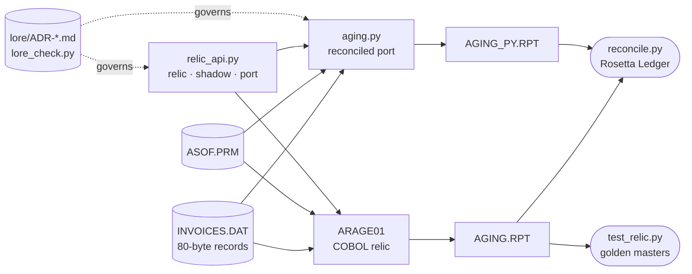
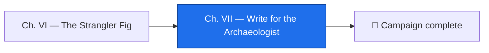

*Everything you built in this campaign is a future relic. In twenty years the Python will look as strange as the COBOL does now, the gate's routing rule will be a comment nobody understands, and you will be the Elder who does not answer email. The difference between a relic that gets raised and one that gets guessed at is not the age of the code. It is whether the reasons were left where the next archaeologist digs. This chapter is where you leave them.*

*The real-world skill: documentation that survives its authors — an architecture map, a runbook, decision records, and a roadmap that separates what a system knows from how it happens to be housed.*

## 📖 The Legend Behind This Quest

*A bronze mechanism from the second century BC was, in the words of the researchers who finally decoded it, "technically more complex than any known device for at least a millennium afterwards." It survived. The understanding did not — nobody had to sink it; it simply lived in a few heads and was never written where the next person could find it. The Relic Raisers end every campaign with the same rite: write for the archaeologist. Not for the reader who shares your context, but for the one who arrives after it is gone, with a familiar in one hand and no one to ask.*

## 🎯 Quest Objectives

### Primary Objectives

- [ ] **Draw the map** — a Mermaid diagram of the revived system that shows the real mechanism: files, engines, gate, trials, lore
- [ ] **Write the runbook** — a README whose every command comes from a file in the repository, drafted by a familiar and audited by you
- [ ] **Record your own decisions** — ADRs for the choices this campaign made: exact decimals, shadow before cutover, and the 2050 cliff
- [ ] **Write the roadmap** — what stays because it is right, what changes because it is housing, and what is deferred with a date
- [ ] **Forge `verify.sh`** — one script that runs every gate, locally and in the Factory

### Mastery Indicators

- [ ] A stranger can clone the repository, run one script, and know within a minute whether the system is whole
- [ ] Every "why" in the system has an ADR with evidence, including the whys you introduced
- [ ] You can explain the difference between old-because-right and old-because-unread, with an example of each from this relic

## 🗺️ Quest Prerequisites

- **Chapters I–VI** — the map draws what exists; the runbook documents commands that already run.
- **`lore_check.py`** from Chapter III — the gate your new ADRs must pass.
- **The Factory** — `verify.sh` becomes its final step.

## 🧙‍♂️ Chapter 1: Draw the Map

### ⚔️ Skills You'll Forge

- A diagram that shows mechanism, not decoration
- Mermaid as the realm's cartographer's ink

A map a stranger can use shows what flows where and which gate guards what. Put this in `README.md` under a heading of its own; Mermaid renders it on GitHub and on most bit forges.



Read it back as the archaeologist would: two engines fed by the same files, a ledger that judges them against each other, trials that judge the relic against its own past, a gate that decides who answers, and a Lore that says why. If your map cannot be read that way, the system cannot either.

### 🔍 Knowledge Check

- [ ] Which two arrows on the map are the proof that the port may be trusted?
- [ ] What is missing from the map if the gate were cut over to `port` permanently?
- [ ] Why draw the Lore as governing the port and the gate rather than as another box?

## 🧙‍♂️ Chapter 2: The Runbook — a Familiar Drafts, You Audit Every Command

### ⚔️ Skills You'll Forge

- Prompting for documentation grounded in files, not memory
- The three sections every runbook must have

A runbook has three sections that matter at 2 a.m.: how to run it, how to verify it, how to roll it back. Let the familiar draft from the repository itself — pipe the files in, and redirect the answer into the runbook — and bind it to the same rule the whole campaign has obeyed: nothing goes in that a file does not contain.

```bash
cat ARAGE01.cob INVREC.CPY aging.py reconcile.py test_relic.py relic_api.py lore/*.md | claude -p "These are the files of a revived legacy system. Draft the runbook half of a README with these headings: What this system is, Strata (its history), How to run, How to verify, How to roll back, Who to ask. Every command you include must appear verbatim in the input; cite the file after each command. If a section cannot be written from the input, write TODO and say what is missing." > README.draft.md
```

Note where that redirect points. `README.md` already holds the map you drew in Part 1, and `>` would erase it without a word — the failure is silent, and you would not notice until the Mastery Challenge asked for a map that is no longer there. Draft to a scratch file, audit it, then append what survives.

`verify.sh` is deliberately absent from that list too — Part 4 has not written it yet, and piping a file that does not exist is how a runbook ends up citing a command nobody can run. Come back and add it once it exists.

Audit the draft the way you audited the dictionary: run every command it proposes; delete every sentence that explains something the files do not show. Then join the two halves, map first:

```bash
cat README.draft.md >> README.md && rm README.draft.md
head -20 README.md   # the map is still at the top, the runbook follows
``` The sections that survive should read like this:

```markdown
## How to run
cobc -x -o arage01 ARAGE01.cob 2>/dev/null             # build the relic (verify.sh)
./arage01                                              # run it (verify.sh)
python3 aging.py                                       # the port (verify.sh)
python3 relic_api.py --engine shadow --port 8765       # the gate (relic_api.py)

## How to verify
./verify.sh                                            # trials, ledger, lore — exit 0 or it is broken

## How to roll back
# Restart the gate with the relic answering. Nothing else changes.
python3 relic_api.py --engine relic --port 8765

## Who to ask
See lore/ELDERS.md. Every rule has an ADR under lore/; read it before you change the rule.
```

A runbook that says `# TODO` in one section is honest; one that describes a command nobody can run is a Plausible Ghost with a heading.

### 🔍 Knowledge Check

- [ ] Why must every command in the runbook be one that already exists in a file?
- [ ] What belongs under "Who to ask" once the Elders have retired?
- [ ] Which runbook section is the one a stranger reads during an incident, and why must it be the shortest?

## 🧙‍♂️ Chapter 3: Record Your Own Decisions, Then the Roadmap

### ⚔️ Skills You'll Forge

- ADRs for choices you made, not only choices you inherited
- The roadmap discipline: keep the idea, replace the housing, date the deferrals

You inherited two rules and wrote ADRs for them in Chapter III. You *made* at least three decisions since, and they need records just as much — the next archaeologist will wonder why the port uses `Decimal` exactly as much as you wondered about status `7`. Write them with the familiar's help and the same spell as before, then hold them to the gate:

- **`ADR-0003`: Money is `Decimal`, never float.** Evidence: the relic's `COMP-3` fields; `python3 -c "print(0.1 + 0.2)"`; Chapter V's ledger design.
- **`ADR-0004`: The gate runs in shadow mode before any cutover, and cutover is a flag.** Evidence: `relic_api.py`'s three engines; the gate log showing five matches and zero mismatches; the rollback command in the runbook.
- **`ADR-0005`: The century pivot stays at 50 until a dated review.** Status: *Deferred, review by 2049-01-01.* Evidence: `MOD 11/99`; the profiler's year list; the fact that no due date before 1950 exists in the data. Consequences: in 2050 a due date of `500101` will window to 1950, and someone must decide before then.

```bash
python3 lore_check.py
# lore/ADR-0001-status-7-means-disputed.md: ok — 3 evidence item(s)
# lore/ADR-0002-pivot-year-is-50.md: ok — 2 evidence item(s)
# lore/ADR-0003-money-is-decimal.md: ok — 3 evidence item(s)
# lore/ADR-0004-shadow-before-cutover.md: ok — 3 evidence item(s)
# lore/ADR-0005-pivot-review-by-2049.md: ok — 3 evidence item(s)
```

Then the roadmap. Modernization fails in two directions: rebuilding the relic's mistakes at cloud prices, or discarding the relic's *ideas* along with its housing. The roadmap in `ROADMAP.md` is a table with three columns and a reason in every cell:

| Element | Verdict | Why |
|---|---|---|
| Five aging buckets at 0/30/60/90 | **Stays** — an idea | Accounting reads receivables this way; the bucket edges are policy, not plumbing |
| Disputed invoices excluded from aging | **Stays** — an idea | `ADR-0001`; the rule protects customers and the collections team alike |
| Exact decimal money | **Stays** — an idea | `ADR-0003`; the relic was right and the first port was wrong |
| 80-byte fixed-width records | **Changes** — housing | `ADR-0006`, to be written: the new store keeps ISO dates and a real decimal column; the port keeps reading the old file until the gate is silent on the new one |
| Two-digit years | **Changes** — housing | Four-digit dates in the new store; the pivot survives only at the boundary where old records are read |
| Nightly batch | **Changes** — housing | The gate already answers on demand; the batch remains as the shadow's second opinion until retired |
| Pivot year 50 | **Deferred** — dated | `ADR-0005`; review by 2049 |

The archaeologist who reads this table in 2046 knows exactly what they may change and what they must not — and the one who reads it in 2050 finds the decision waiting for them, with a date on it.

### 🔍 Knowledge Check

- [ ] Give one element from the roadmap that is old-because-right and one that is old-because-unread.
- [ ] Why does the pivot get a dated deferral instead of a fix?
- [ ] What makes `ADR-0005` different in kind from `ADR-0001`?

## 🧙‍♂️ Chapter 4: One Script for Every Gate

### ⚔️ Skills You'll Forge

- A single verification entry point
- The Factory's final step

Save this as `verify.sh` and make it executable. It compiles the relic, runs it, runs the trials, runs the port, reconciles, and checks the Lore — and it stops at the first gate that fails.

```bash
#!/usr/bin/env bash
# verify.sh — the whole gauntlet in one cast: trials, ledger, lore.
set -euo pipefail
cobc -x -o arage01 ARAGE01.cob 2>/dev/null
./arage01
python3 -m unittest -q test_relic
python3 aging.py > /dev/null
python3 reconcile.py AGING.RPT AGING_PY.RPT | tail -1
python3 lore_check.py
echo "ALL GATES PASSED"
```

```bash
chmod +x verify.sh && ./verify.sh
```

```text
----------------------------------------------------------------------
Ran 5 tests in 0.027s

OK
RECONCILED — the ledger ties out.
lore/ADR-0001-status-7-means-disputed.md: ok — 3 evidence item(s)
…four more ADR lines…
ALL GATES PASSED
```

In `.github/workflows/gauntlet.yml`, the last three steps each ran one gate. Delete them:

```yaml
      - run: python3 forge_relic_data.py && ./arage01 && diff AGING.RPT golden/AGING-260914.RPT
      - run: python3 -m unittest -v test_relic
      - run: python3 aging.py && python3 reconcile.py AGING.RPT AGING_PY.RPT
```

and put one step in their place, so the Factory and the runbook agree on what "whole" means:

```yaml
      - run: python3 forge_relic_data.py && ./verify.sh
```

Commit, tag the monument, and push. The tag is for the archaeologist: `git log` will show them the day the relic was raised.

```bash
git add README.md ROADMAP.md lore verify.sh .github/workflows/gauntlet.yml
git commit -q -m "codex: map, runbook, ADR-0003..0005, roadmap, verify.sh"
git tag -a v1-revived -m "ARAGE01 revived: pinned, reconciled, gated, documented"
git push --follow-tags
```

### 🔍 Knowledge Check

- [ ] Why does `verify.sh` use `set -euo pipefail`, and which gate would slip through without it?
- [ ] What does the tag give a future reader that the commit message does not?
- [ ] If `verify.sh` fails on the Lore gate only, what has changed and what has not?

## 🎮 Mastery Challenge

**Objective:** the portfolio artifact — a repository a stranger can trust in one minute.

- [ ] `README.md` has the map **and** the six runbook sections — the draft was appended, not redirected over the top — and every command in it exists in a file
- [ ] `ADR-0003`, `ADR-0004`, and `ADR-0005` pass `lore_check.py`; `ADR-0005` carries a review date
- [ ] `ROADMAP.md` gives every element a verdict and a reason, and names the next ADR to write
- [ ] `./verify.sh` prints `ALL GATES PASSED` locally and the Factory is green with it as the final step
- [ ] The tag `v1-revived` exists on the remote

## 🎁 Rewards & Progression

- 🗺️ **Cartographer of the Lore** — you left the map, the runbook, and the roadmap where the next raiser digs
- 👑 **The Relic Raiser** — you completed the campaign: read, pinned, translated, proven, gated, and documented
- 🗺️ **Skill unlocked:** architecture maps that show the real mechanism
- 📖 **Skill unlocked:** runbooks whose every command is executable
- 🧭 **Skill unlocked:** modernization roadmaps that keep the idea and replace the housing
- **+150 XP** — and +200 XP for the campaign

## 🔁 Reproduce It

`verify.sh` and its output above were executed on 2026-09-14 on Ubuntu 24.04 with GnuCOBOL 3.1.2 and Python 3.11 (any 3.10+ works; stock Ubuntu 24.04 ships 3.12) in the reference lab, where the Lore held `ADR-0001`; with your five records in place the lore gate prints five lines. The map, runbook, and roadmap describe files that exist in the lab exactly as shown across Chapters I–VI.

## 🗺️ Quest Network



*Chapters sit at different levels by design: the campaign runs through the levels, and each chapter also appears on its own level hub.*

## 🔮 Next Adventures

The relic is raised and the reasons are written down. Two campaigns continue the same discipline in other realms:

- 🏺 **Campaign hub:** [Epic Quest: The Relic Raisers](/quests/codex/relic-raisers/) — claim the capstone badge
- 🤖 [Epic Quest: The Agentic Codex](/quests/codex/agentic-codex/) — build and govern the familiars you commanded here
- 🏰 [Epic Quest: The Self-Operating Website](/quests/codex/self-operating-website/) — verify-before-trust, applied to a site that runs itself
- 🧩 [Domain-Driven Design](/quests/1110/domain-driven-design/) — the craft of naming what an old system knows

## 📚 Resource Codex

- [Mermaid flowcharts](https://mermaid.js.org/syntax/flowchart.html) — the cartographer's ink
- [Architecture decision records (ADR) on GitHub](https://adr.github.io/) — templates and examples for the records you wrote
- [Freeth et al., *Decoding the ancient Greek astronomical calculator known as the Antikythera Mechanism* (Nature, 2006)](https://www.nature.com/articles/nature05357) — the artifact that outlived its own understanding
- [GAO: Agencies Need to Plan for Modernizing Critical Decades-Old Legacy Systems](https://www.gao.gov/products/gao-25-107795) — the scale of the relic problem, in the largest Empire there is

## 🕸️ Knowledge Graph

*Structured wiki-links connect this quest to the IT-Journey knowledge graph. Open the [Obsidian Graph View](/notes/obsidian/graph/) to explore connections.*

**Campaign hub:** [[Epic Quest: The Relic Raisers]] **Level hub:** [[Level 1110 - Quality Assurance]] **Previous:** [[The Strangler Fig: Put a Modern Gate in Front of the Relic]] **Next:** none — the campaign ends here **Siblings:** [[Epic Quest: The Agentic Codex]] · [[Epic Quest: The Self-Operating Website]] **Obsidian docs:** [[Obsidian Knowledge Graph and Wiki Links]]
