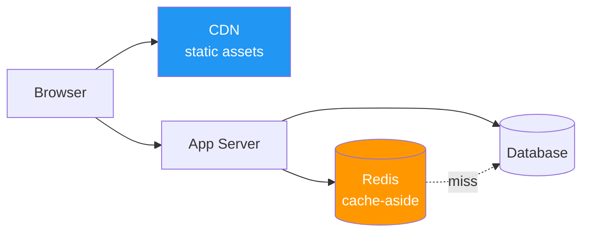

*Architect, your kingdom thrives - and with success comes a new siege: load. Ten users become ten thousand, and the keeps that served them gracefully now groan under the weight. **Scaling Strategies** is the discipline of growing a system to meet demand without it collapsing: adding machines, caching the hot paths, splitting the data, and balancing the flow. Master it, and traffic that would have toppled a lesser realm becomes a number on a dashboard.*

*Whether your database has become the bottleneck that throttles everything, or you are choosing between a bigger machine and more machines, this quest forges the tools of scale - and the sober law that governs them all: the CAP theorem, which says you cannot have everything at once.*

## 📖 The Legend Behind This Quest

*There are two ways to make a system handle more load. **Vertical scaling** (scaling up) buys a bigger machine - more CPU, more RAM. It is simple but finite: there is a largest machine, and it is expensive. **Horizontal scaling** (scaling out) adds more machines and spreads the load across them. It is nearly unbounded but demands that your services be stateless and your data be partitionable.*

*Behind every horizontally scaled data store lurks Eric Brewer's **CAP theorem**: when the network partitions (and it will), you must choose between **Consistency** and **Availability**. You cannot have both during a partition. Every scaling decision - which cache, which database, which replication model - is ultimately a negotiation with this law. This quest teaches you to make those trades deliberately.*

## 🎯 Quest Objectives

By the time you complete this epic journey, you will have mastered:

### Primary Objectives (Required for Quest Completion)
- [ ] **Vertical vs. Horizontal Scaling** - Choose the right axis for a given bottleneck
- [ ] **Load Balancing** - Spread traffic across replicas and keep services stateless
- [ ] **Caching** - Place caches at the right layer with a sound invalidation strategy
- [ ] **Sharding and Replication** - Partition and copy data to scale reads and writes

### Secondary Objectives (Bonus Achievements)
- [ ] **The CAP Theorem** - Reason about consistency vs. availability under partition
- [ ] **Auto-Scaling** - Add and remove capacity automatically with demand
- [ ] **Bottleneck Analysis** - Find the true constraint before scaling blindly

### Mastery Indicators
You'll know you've truly mastered this quest when you can:
- [ ] Identify a system's bottleneck and pick the scaling axis that addresses it
- [ ] Place a cache and name how it gets invalidated
- [ ] Explain sharding vs. replication and when each helps
- [ ] State the CAP trade-off a chosen database makes

## 🗺️ Quest Prerequisites

### 📋 Knowledge Requirements
- [ ] Understand stateless vs. stateful services
- [ ] Familiarity with databases and HTTP load
- [ ] Completed [Microservices Architecture](/quests/1110/microservices-architecture/) (required)

### 🛠️ System Requirements
- [ ] Modern operating system (Windows 10+, macOS 10.14+, or Linux)
- [ ] Docker (optionally local Kubernetes via kind or minikube)
- [ ] A text editor or IDE (VS Code recommended)

### 🧠 Skill Level Indicators
This **🔴 Hard** quest expects:
- [ ] You have seen a service slow down under load
- [ ] You can reason about where a system's bottleneck lives
- [ ] Ready for 4-5 hours of focused study

## 🌍 Choose Your Adventure Platform

*The strategies are platform-independent. The optional lab uses Docker (and Kubernetes if you have it) to run multiple replicas behind a load balancer and a Redis cache.*

### 🍎 macOS Kingdom Path

<details>
<summary>Click to expand macOS instructions</summary>

```bash
brew install --cask docker
brew install kind        # local Kubernetes, optional
# A Redis cache for the caching exercise
docker run -d --name cache -p 6379:6379 redis:7-alpine
```

</details>

### 🪟 Windows Empire Path

<details>
<summary>Click to expand Windows instructions</summary>

```powershell
winget install Docker.DockerDesktop
winget install Kubernetes.kind   # optional
docker run -d --name cache -p 6379:6379 redis:7-alpine
```

</details>

### 🐧 Linux Territory Path

<details>
<summary>Click to expand Linux instructions</summary>

```bash
sudo apt update && sudo apt install -y docker.io
sudo systemctl enable --now docker
sudo docker run -d --name cache -p 6379:6379 redis:7-alpine
```

</details>

### ☁️ Cloud Realms Path

<details>
<summary>Click to expand Cloud/Container instructions</summary>

```bash
# Managed Kubernetes (EKS/GKE/AKS) and managed caches (ElastiCache/Memorystore)
# provide these primitives as services. The concepts are identical.
docker run -d -p 6379:6379 redis:7-alpine
```

</details>

## 🧙‍♂️ Chapter 1: The Two Axes and Load Balancing

*Before you scale, find the bottleneck. Then choose the axis - up or out - that relieves it.*

### ⚔️ Skills You'll Forge in This Chapter
- Vertical vs. horizontal scaling
- Why statelessness enables horizontal scale
- Load balancing across replicas

### 🏗️ Up vs. Out

| | Vertical (scale up) | Horizontal (scale out) |
| --- | --- | --- |
| **How** | Bigger machine | More machines |
| **Ceiling** | Hard (largest machine) | Near-unbounded |
| **Cost curve** | Steep at the top | Roughly linear |
| **Complexity** | Low | Higher (LB, statelessness) |
| **Failure** | One big single point | Survives node loss |

Horizontal scaling requires **stateless** services: any replica can serve any request, because no request depends on memory held by a specific instance. Session state moves to a shared store (Redis, a database), and a **load balancer** distributes requests across the replicas.

```yaml
# Kubernetes: run 5 stateless replicas; the Service load-balances across them
apiVersion: apps/v1
kind: Deployment
metadata: { name: orders }
spec:
  replicas: 5                    # horizontal scale: just change this number
  selector: { matchLabels: { app: orders } }
  template:
    metadata: { labels: { app: orders } }
    spec:
      containers:
      - name: orders
        image: orders:latest
        resources:
          requests: { cpu: "250m", memory: "256Mi" }   # vertical sizing per pod
---
apiVersion: v1
kind: Service
metadata: { name: orders }
spec:
  selector: { app: orders }
  ports: [{ port: 80, targetPort: 8000 }]   # round-robins to the 5 pods
```

### 🔍 Knowledge Check: Axes and Balancing
- [ ] Why must a service be stateless to scale horizontally?
- [ ] When is scaling up the wiser first move?
- [ ] What does a load balancer do that lets you add replicas freely?

## 🧙‍♂️ Chapter 2: Caching - Speed by Not Doing Work

*The fastest request is the one you never compute. Caching stores results so they can be served without redoing the work - the single highest-leverage scaling technique.*

### ⚔️ Skills You'll Forge in This Chapter
- Cache placement (client, CDN, application, database)
- Cache-aside and invalidation
- The two hard problems: invalidation and stampedes

### 🏗️ The Cache-Aside Pattern

```python
# Cache-aside: check the cache, fall back to the source, then populate.
import redis, json

cache = redis.Redis(host="localhost", port=6379)
TTL = 300   # seconds — bound staleness so data eventually refreshes

def get_product(product_id: str) -> dict:
    key = f"product:{product_id}"
    cached = cache.get(key)
    if cached:                                  # cache HIT — skip the database
        return json.loads(cached)
    product = db_fetch_product(product_id)      # cache MISS — do the real work
    cache.setex(key, TTL, json.dumps(product))  # populate with a TTL
    return product

def update_product(product_id: str, data: dict) -> None:
    db_update_product(product_id, data)
    cache.delete(f"product:{product_id}")       # invalidate so readers refetch
```



The two famous hard problems: **invalidation** (keeping the cache from serving stale data) and the **cache stampede** (when a popular key expires and a thousand requests hit the database at once - solved with locks or staggered TTLs).

### 🔍 Knowledge Check: Caching
- [ ] In cache-aside, who populates the cache - the read path or the write path?
- [ ] Why give cache entries a TTL even if you also invalidate on write?
- [ ] What is a cache stampede and how do you prevent it?

## 🧙‍♂️ Chapter 3: Data at Scale - Sharding, Replication, and CAP

*Eventually the database is the bottleneck. You scale reads with **replication** and scale writes (and storage) with **sharding** - and both run headlong into the CAP theorem.*

### ⚔️ Skills You'll Forge in This Chapter
- Replication for read scale and availability
- Sharding for write and storage scale
- The CAP theorem and PACELC

### 🏗️ Replication vs. Sharding

**Replication** copies the whole dataset to multiple nodes. Reads scale (any replica answers), and you gain failover - but writes still funnel to a primary, and replicas can lag.

**Sharding** splits the dataset by a key (e.g. `user_id % N`) across nodes, so each shard holds a slice. Writes and storage scale - but cross-shard queries and rebalancing become hard.

```python
# A simple hash shard router: pick a shard from the key.
SHARDS = ["db-shard-0", "db-shard-1", "db-shard-2", "db-shard-3"]

def shard_for(user_id: int) -> str:
    return SHARDS[user_id % len(SHARDS)]   # consistent placement per user

# In production, prefer CONSISTENT HASHING so adding a shard moves
# only ~1/N of the keys instead of remapping everything.
print(shard_for(1024))   # db-shard-0
```

### 🏗️ The CAP Theorem

When a network partition splits your nodes, you must choose:
- **CP** (Consistency + Partition tolerance): refuse to answer rather than serve stale/divergent data (e.g. traditional RDBMS with synchronous replication, etcd, ZooKeeper).
- **AP** (Availability + Partition tolerance): keep answering even if nodes disagree, and reconcile later (e.g. Cassandra, DynamoDB, Riak).

```text
              Partition happens — pick a side:
  CP: "I'd rather be unavailable than wrong."   → banking ledgers, locks
  AP: "I'd rather be available than perfectly consistent." → shopping cart, feeds
PACELC refines it: Else (no partition), trade Latency vs. Consistency.
```

There is no "CA" system in the real world, because partitions are not optional - the network *will* fail. The Architect's job is to know which trade each datastore makes and to match it to the business need.

### 🔍 Knowledge Check: Data at Scale
- [ ] Does replication scale reads, writes, or both?
- [ ] Why is consistent hashing better than `id % N` when adding a shard?
- [ ] For a bank balance, do you choose CP or AP? For a social feed?

## 🎮 Mastery Challenges

### 🟢 Novice Challenge: Scale Out and Balance
**Objective**: Run three replicas of a stateless service behind a load balancer and watch requests spread.

**Requirements**:
- [ ] Three replicas serve the same endpoint
- [ ] A load balancer distributes requests across them
- [ ] Killing one replica does not take the service down

**Validation**: Responses show different instance ids across requests.

### 🟡 Intermediate Challenge: Add a Cache
**Objective**: Put a cache-aside layer in front of a slow data source and measure the win.

**Requirements**:
- [ ] First request misses; subsequent requests hit the cache
- [ ] Writes invalidate the cached key
- [ ] Entries carry a TTL

**Validation**: Cached responses are measurably faster than the cold path.

### 🔴 Advanced Challenge: Scaling Plan with CAP
**Objective**: For a system you know, write a one-page scaling plan that names its bottleneck and its CAP stance.

**Requirements**:
- [ ] Identify the true bottleneck (CPU, DB writes, etc.)
- [ ] Choose scaling axis, caching, and sharding/replication
- [ ] State the CAP trade your data store makes and why it fits

**Validation**: The plan would survive a staff-engineer design review.

## 🏆 Quest Rewards & Achievements

**🎖️ Badges Earned**:
- 🏆 **Load Bearer** - You grow systems to absorb traffic without buckling
- ⚖️ **Keeper of CAP** - You reason honestly about consistency vs. availability

**🛠️ Skills Unlocked**:
- **Horizontal Scaling and Load Balancing** - Scale out stateless services
- **Caching and Data Partitioning** - Speed by caching, scale by sharding

**🔓 Unlocked Quests**:
- System Design Interviews - Put every Citadel skill to the test under pressure

**📊 Progression Points**: +95 XP

## 🗺️ Next Steps in Your Journey

**Continue the Main Story**:
- 🎯 [System Design Interviews](/quests/1110/system-design-interviews/) - The capstone that ties it all together

**Explore Side Adventures**:
- ⚔️ [Event-Driven Design](/quests/1110/event-driven-design/) - Async is a scaling strategy too
- ⚔️ [API Gateway Patterns](/quests/1110/api-gateway-patterns/) - Where load balancing meets the edge

### Character Class Recommendations

**💻 Software Developer**: Continue to [System Design Interviews](/quests/1110/system-design-interviews/)  
**🏗️ System Engineer**: Deepen auto-scaling and capacity planning  
**📊 Data Scientist**: Note how sharding shapes analytical query design

## 📚 Resources

### Official Documentation
- [Kubernetes - Horizontal Pod Autoscaler](https://kubernetes.io/docs/tasks/run-application/horizontal-pod-autoscale/) - Auto-scaling in practice
- [Redis caching patterns](https://redis.io/docs/latest/develop/use/patterns/) - Cache-aside and friends
- [AWS - Caching best practices](https://aws.amazon.com/caching/best-practices/) - Where to put caches

### Community Resources
- [Brewer's CAP Theorem (original)](https://people.eecs.berkeley.edu/~brewer/cs262b-2004/PODC-keynote.pdf) - The keynote that started it
- [PACELC theorem (Daniel Abadi)](http://www.cs.umd.edu/~abadi/papers/abadi-pacelc.pdf) - CAP, refined
- [Designing Data-Intensive Applications (Martin Kleppmann)](https://dataintensive.net/) - The definitive book on this chapter

### Learning Materials
- [The System Design Primer - Scaling](https://github.com/donnemartin/system-design-primer#how-to-approach-a-system-design-interview-question) - Scaling building blocks
- [Consistent hashing explained](https://www.toptal.com/big-data/consistent-hashing) - Why `id % N` is not enough

## 🤝 Quest Completion Checklist

- [ ] ✅ Completed all primary objectives
- [ ] ✅ Ran replicas behind a load balancer and added a cache
- [ ] ✅ Answered all knowledge check questions
- [ ] ✅ Completed at least one mastery challenge
- [ ] ✅ Explored the resource library
- [ ] ✅ Identified your next quest in the journey

## 🕸️ Knowledge Graph

*Structured wiki-links connect this quest to the IT-Journey knowledge graph. Open the [Obsidian Graph View](/notes/obsidian/graph/) to explore connections.*

**Level hub:** [[Level 1110 - Architecture & Design Patterns]] **Overworld:** [[🏰 Overworld - Master Quest Map]] **Prerequisites:** [[Microservices Architecture: Decomposing the Monolith]] · [[Event-Driven Design: Pub/Sub, Event Sourcing, and CQRS]] **Unlocks:** [[System Design Interviews: A Framework for the Whiteboard]] **Obsidian docs:** [[Obsidian Knowledge Graph and Wiki Links]]
