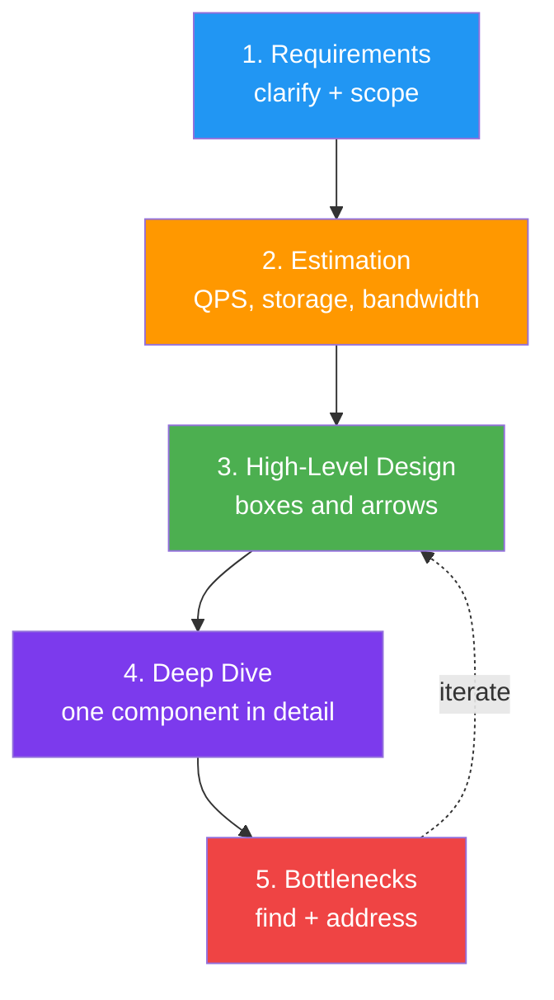
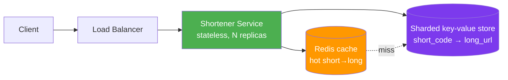

*Architect, this is the proving ground. You have mastered patterns, domains, services, events, gateways, and scale - and now you must wield them all *at once*, on a whiteboard, under a clock, while a stranger watches and asks "what happens when this fails?" The **System Design Interview** is the capstone of the Citadel: not a test of trivia, but of whether you can take a vague prompt and reason your way to a credible, defensible architecture out loud.*

*Whether you are preparing for a senior or staff interview, or you simply want a repeatable way to approach any "design X" problem, this quest forges the one thing that separates those who freeze from those who flow: a framework. With it, "Design a URL shortener" stops being a panic and becomes a checklist.*

## 📖 The Legend Behind This Quest

*The open-ended design question terrifies because it has no single right answer. But interviewers are not looking for the answer - they are watching your process. Do you clarify the problem before diving in? Do you estimate scale before choosing technology? Do you name trade-offs without being prompted? Do you find your own design's bottlenecks?*

*A framework turns chaos into a script you can run on any prompt: clarify requirements, estimate the load, sketch the high-level design, deep-dive a component, then identify and address bottlenecks. The estimation - the famous "back-of-the-envelope" math - tells you whether you need one server or a thousand. Master the framework and the math, and the interview becomes a conversation you lead.*

## 🎯 Quest Objectives

By the time you complete this epic journey, you will have mastered:

### Primary Objectives (Required for Quest Completion)
- [ ] **A Repeatable Framework** - Run any design prompt through the same five-step structure
- [ ] **Requirements Gathering** - Separate functional from non-functional requirements and scope down
- [ ] **Back-of-the-Envelope Estimation** - Compute QPS, storage, and bandwidth in your head
- [ ] **Trade-off Articulation** - Name the cost of every choice before you are asked

### Secondary Objectives (Bonus Achievements)
- [ ] **Two Worked Designs** - Design a URL shortener and a news feed end to end
- [ ] **Bottleneck Hunting** - Find and address your own design's weak point
- [ ] **Communication Under Pressure** - Think aloud, draw clearly, and stay calm

### Mastery Indicators
You'll know you've truly mastered this quest when you can:
- [ ] Run a full design from prompt to bottlenecks in 45 minutes
- [ ] Estimate QPS and storage to the right order of magnitude
- [ ] Volunteer a trade-off ("I'd choose AP here because...") unprompted
- [ ] Recover gracefully when the interviewer adds a new constraint

## 🗺️ Quest Prerequisites

### 📋 Knowledge Requirements
- [ ] Comfort with scaling, caching, and databases
- [ ] Completed [Scaling Strategies](/quests/1110/scaling-strategies/) (required)
- [ ] Completed [Microservices Architecture](/quests/1110/microservices-architecture/) (recommended)

### 🛠️ System Requirements
- [ ] Modern operating system (Windows 10+, macOS 10.14+, or Linux)
- [ ] A whiteboard or a diagramming tool (Excalidraw, draw.io)
- [ ] A timer to practice under interview conditions

### 🧠 Skill Level Indicators
This **⚔️ Epic** quest expects:
- [ ] You have built or operated a real multi-component system
- [ ] You can estimate orders of magnitude quickly
- [ ] Ready for 5-6 hours of focused practice

## 🌍 Choose Your Adventure Platform

*This quest is about thinking and communicating, so the "platform" is your diagramming surface. Pick whatever lets you sketch boxes and arrows fast.*

### 🍎 macOS Kingdom Path

<details>
<summary>Click to expand macOS instructions</summary>

```bash
# Excalidraw runs in the browser; or install draw.io desktop
brew install --cask drawio
# A simple QPS/storage estimator you can extend (see Chapter 2)
python3 -c "print('Ready to estimate at scale')"
```

</details>

### 🪟 Windows Empire Path

<details>
<summary>Click to expand Windows instructions</summary>

```powershell
winget install JGraph.Draw
python -c "print('Ready to estimate at scale')"
```

</details>

### 🐧 Linux Territory Path

<details>
<summary>Click to expand Linux instructions</summary>

```bash
sudo apt update && sudo apt install -y python3
# Or use Excalidraw in any browser — no install needed
python3 -c "print('Ready to estimate at scale')"
```

</details>

### ☁️ Cloud Realms Path

<details>
<summary>Click to expand Cloud/Container instructions</summary>

```bash
# Excalidraw.com and draw.io are fully browser-based — ideal for a remote
# interview where you share a virtual whiteboard.
echo "Open https://excalidraw.com in your browser"
```

</details>

## 🧙‍♂️ Chapter 1: The Framework - A Script for Any Prompt

*The single most valuable interview asset is a structure you run every time, so you never stare at a blank board.*

### ⚔️ Skills You'll Forge in This Chapter
- The five-step design framework
- Clarifying scope before designing
- Functional vs. non-functional requirements

### 🏗️ The Five Steps



1. **Requirements** - Ask questions. *Who uses this? How many? What must it do (functional) and how well - latency, availability, consistency (non-functional)?* Scope ruthlessly; a 45-minute interview cannot design everything.
2. **Estimation** - Compute the scale so your design is grounded, not hand-wavy (Chapter 2).
3. **High-Level Design** - Draw clients, a gateway/load balancer, services, databases, and caches. Keep it simple first.
4. **Deep Dive** - The interviewer picks (or you offer) one component to detail: the data model, the sharding scheme, the cache strategy.
5. **Bottlenecks** - Critique your own design. *Where does it fall over at 10x? What is the single point of failure?* This step impresses most.

### 🏗️ Functional vs. Non-Functional

```text
Functional ("what it does"):
  - Shorten a long URL to a short code
  - Redirect a short code to the original
Non-functional ("how well"):
  - Read-heavy (100:1 reads to writes)
  - < 100ms redirect latency
  - High availability (a dead shortener breaks every link)
  - Short codes must not collide
```

### 🔍 Knowledge Check: The Framework
- [ ] Why clarify requirements before drawing anything?
- [ ] What is the difference between a functional and a non-functional requirement?
- [ ] Why is the bottleneck step the one that most impresses interviewers?

## 🧙‍♂️ Chapter 2: Estimation - Back-of-the-Envelope Math

*Numbers turn a vague design into a grounded one. You do not need precision - you need the right order of magnitude, computed in seconds.*

### ⚔️ Skills You'll Forge in This Chapter
- Powers-of-two and powers-of-ten cheat sheet
- QPS, storage, and bandwidth estimates
- Letting numbers drive design choices

### 🏗️ The Cheat Sheet

```text
Time:    1 day ≈ 86,400 s ≈ 10^5 s     |  1 month ≈ 2.5 × 10^6 s
Data:    1 KB = 10^3 B, 1 MB = 10^6 B, 1 GB = 10^9 B, 1 TB = 10^12 B
Latency: memory ~100 ns | SSD ~100 µs | network round trip (same DC) ~0.5 ms
         disk seek ~10 ms | cross-continent round trip ~150 ms
```

### 🏗️ Worked Example: A URL Shortener

```python
# Estimation for a URL shortener — the kind of math you do out loud.
WRITES_PER_MONTH = 100_000_000          # 100M new URLs/month (given/assumed)
SECONDS_PER_MONTH = 2_500_000           # ~2.5M s/month

write_qps = WRITES_PER_MONTH / SECONDS_PER_MONTH      # ≈ 40 writes/sec
read_qps  = write_qps * 100                           # 100:1 read ratio → ≈ 4,000 reads/sec

BYTES_PER_URL = 500                      # short code + long URL + metadata
storage_per_month = WRITES_PER_MONTH * BYTES_PER_URL  # = 5 × 10^10 B = 50 GB/month
storage_5yr = storage_per_month * 12 * 5              # = 3 TB over 5 years

print(f"Writes: ~{write_qps:.0f}/s | Reads: ~{read_qps:.0f}/s")
print(f"Storage: ~{storage_per_month/1e9:.0f} GB/month, ~{storage_5yr/1e12:.0f} TB / 5yr")
```

These numbers *drive* the design: 4,000 read QPS and a 100:1 ratio scream "cache aggressively." 3 TB over five years fits comfortably on a single sharded database - you do not need exotic storage. Stating this reasoning aloud is exactly what interviewers reward.

### 🔍 Knowledge Check: Estimation
- [ ] Roughly how many seconds are in a day? A month?
- [ ] Given 100:1 reads-to-writes, what does that imply for your design?
- [ ] Why do interviewers care about estimates more than exact numbers?

## 🧙‍♂️ Chapter 3: A Full Walkthrough and Articulating Trade-offs

*Tie it together with one complete design, narrating trade-offs the whole way - the skill that distinguishes a senior candidate.*

### ⚔️ Skills You'll Forge in This Chapter
- A complete URL-shortener design
- Naming trade-offs unprompted
- Handling a curveball constraint

### 🏗️ Designing the URL Shortener

**High-level design** (after the estimation above):



**Deep dive - generating short codes.** Two options, and naming the trade-off is the point:

```python
import hashlib, string

ALPHABET = string.ascii_letters + string.digits   # 62 chars → 62^7 ≈ 3.5 trillion codes

# Option A — hash the URL, take 7 chars. Risk: collisions need handling.
def code_by_hash(url: str) -> str:
    digest = hashlib.sha256(url.encode()).hexdigest()
    n = int(digest, 16)
    out = []
    for _ in range(7):
        n, rem = divmod(n, 62)
        out.append(ALPHABET[rem])
    return "".join(out)

# Option B — a global counter, base62-encoded. No collisions, but needs a
# distributed id generator (e.g. a range-allocator or Snowflake-style ids).
def code_by_counter(counter_id: int) -> str:
    if counter_id == 0:
        return ALPHABET[0]
    out = []
    while counter_id:
        counter_id, rem = divmod(counter_id, 62)
        out.append(ALPHABET[rem])
    return "".join(reversed(out))
```

> "I'd lean toward the counter approach: it guarantees uniqueness without collision-retry logic, at the cost of needing a distributed ID generator. The hash approach is simpler but I'd have to handle collisions, which complicates the write path." — *that sentence is what earns the offer.*

**Bottlenecks.** The database write path and the single-region cache. Mitigations: shard by short code, add read replicas, and use a CDN/edge cache for the hottest links.

### 🏗️ Articulating Trade-offs

For every decision, say the alternative and its cost: SQL vs. NoSQL (consistency vs. scale), sync vs. async (simplicity vs. coupling), CP vs. AP (correctness vs. availability). When the interviewer adds a constraint ("now make it analytics-friendly"), fold it into the framework instead of panicking - add an event stream feeding a data warehouse.

### 🔍 Knowledge Check: Walkthrough
- [ ] What trade-off separates hash-based from counter-based code generation?
- [ ] Why does a 100:1 read ratio justify a CDN/edge cache for hot links?
- [ ] How should you respond when the interviewer adds a new requirement mid-design?

## 🎮 Mastery Challenges

### 🟢 Novice Challenge: Run the Framework
**Objective**: Take a fresh prompt ("design a pastebin") and write the five steps as bullet points in 15 minutes.

**Requirements**:
- [ ] Functional and non-functional requirements listed
- [ ] One estimation (QPS or storage)
- [ ] A high-level box-and-arrow sketch

**Validation**: A peer can follow your reasoning from prompt to sketch.

### 🟡 Intermediate Challenge: Estimate Under Time
**Objective**: For "design a news feed," compute write QPS, read QPS, and 5-year storage in under 5 minutes.

**Requirements**:
- [ ] State your assumptions (users, posts/day, fanout)
- [ ] Reach the right order of magnitude
- [ ] Name one design choice the numbers force

**Validation**: Your estimate is within 10x of a worked reference and the design choice follows from it.

### 🔴 Advanced Challenge: Full Mock Design
**Objective**: Run a complete 45-minute mock for a prompt of your choice and write it up.

**Requirements**:
- [ ] All five framework steps, on a clock
- [ ] At least three trade-offs articulated unprompted
- [ ] Your own bottleneck analysis with mitigations

**Validation**: The write-up reads like a design a staff engineer would approve.

## 🏆 Quest Rewards & Achievements

**🎖️ Badges Earned**:
- 🏆 **Whiteboard Warlord** - You run a design interview with calm, repeatable structure
- 🧭 **Master of Trade-offs** - You name the cost of every choice before being asked

**🛠️ Skills Unlocked**:
- **Capacity Estimation** - Back-of-the-envelope QPS, storage, and bandwidth
- **Structured System Design** - The five-step framework for any prompt

**🔓 Unlocked Quests**:
- Technical Leadership - Lead the teams that build these systems

**📊 Progression Points**: +110 XP

## 🗺️ Next Steps in Your Journey

**Continue the Main Story**:
- 🎯 [Technical Leadership](/quests/1111/technical-leadership/) - From designing systems to leading those who build them

**Explore Side Adventures**:
- ⚔️ [Scaling Strategies](/quests/1110/scaling-strategies/) - Sharpen the scaling tools you used here
- ⚔️ [Microservices Architecture](/quests/1110/microservices-architecture/) - Revisit decomposition with interview eyes

### Character Class Recommendations

**💻 Software Developer**: Continue to [Technical Leadership](/quests/1111/technical-leadership/)  
**🏗️ System Engineer**: Practice more prompts from the System Design Primer  
**📊 Data Scientist**: Apply the framework to data-pipeline design prompts

## 📚 Resources

### Official Documentation
- [The System Design Primer](https://github.com/donnemartin/system-design-primer) - The most-starred free study guide
- [Excalidraw](https://excalidraw.com/) - The whiteboard tool used above
- [Python `hashlib`](https://docs.python.org/3/library/hashlib.html) - Used in the code generator

### Community Resources
- [System Design Interview, Vol. 1 & 2 (Alex Xu)](https://www.amazon.com/System-Design-Interview-insiders-Second/dp/B08CMF2CQF) - The standard prep books
- [Grokking the System Design Interview](https://www.designgurus.io/course/grokking-the-system-design-interview) - Structured practice problems
- [ByteByteGo](https://bytebytego.com/) - Alex Xu's diagrams and newsletter

### Learning Materials
- [Designing Data-Intensive Applications (Kleppmann)](https://dataintensive.net/) - The theory behind every answer
- [Latency Numbers Every Programmer Should Know](https://gist.github.com/jboner/2841832) - The estimation cheat sheet

## 🤝 Quest Completion Checklist

- [ ] ✅ Completed all primary objectives
- [ ] ✅ Ran a full mock design under a 45-minute clock
- [ ] ✅ Answered all knowledge check questions
- [ ] ✅ Completed at least one mastery challenge
- [ ] ✅ Explored the resource library
- [ ] ✅ Identified your next quest in the journey

## 🕸️ Knowledge Graph

*Structured wiki-links connect this quest to the IT-Journey knowledge graph. Open the [Obsidian Graph View](/docs/obsidian/graph/) to explore connections.*

**Level hub:** [[Level 1110 - Architecture & Design Patterns]]
**Overworld:** [[🏰 Overworld - Master Quest Map]]
**Prerequisites:** [[Scaling Strategies: Horizontal Growth, Caching, and CAP]] · [[Microservices Architecture: Decomposing the Monolith]]
**Unlocks:** [[Technical Leadership]]
**Obsidian docs:** [[Obsidian Knowledge Graph and Wiki Links]]
