---

title: "Level 1111: Leadership & Innovation"
description: Achieve mastery in technical leadership, community building, and driving innovation to shape the future of technology
level: "1111"
level_decimal: 15
tier: Legend
tier_emoji: 👑
theme: Realm Shaper
xp_range: 10000+
permalink: /quests/1111/
date: 2025-11-30
lastmod: 2025-12-01T04:36:39.408Z
categories:
  - quests
  - level-1111
  - legend-tier
  - leadership
  - innovation
tags:
  - leadership
  - innovation
  - mentorship
  - open-source
  - community
  - architecture
  - career
toc: true
toc_sticky: true
sidebar:
  nav: quests

layout: quest-collection
---

# 👑 Level 1111: Leadership & Innovation

*Congratulations, legendary hero! You have ascended to the highest realm—the domain of Realm Shapers. Here, you will transcend individual mastery to lead teams, build communities, drive innovation, and leave a lasting impact on the technology landscape.*

## 🎯 Level Overview

| Attribute | Value |
|-----------|-------|
| **Level** | 1111 (Decimal: 15) |
| **Tier** | 👑 Legend Tier |
| **Theme** | Realm Shaper |
| **XP Range** | 10000+ |
| **Prerequisites** | Level 1110 (Architecture & Design) |
| **Unlocks** | Legendary Status, Community Leader Badge |

## 📚 Learning Objectives

By completing this level, you will:

- [ ] Develop technical leadership skills for guiding teams and projects
- [ ] Contribute meaningfully to open source projects and communities
- [ ] Master the art of technical communication through speaking and writing
- [ ] Build and run effective mentorship programs
- [ ] Drive innovation and research & development initiatives
- [ ] Conduct architecture reviews that improve system quality
- [ ] Build thriving technical communities
- [ ] Navigate career advancement strategically

## 🗺️ Quest Map

```mermaid
graph TB
    subgraph "Level 1111: Leadership & Innovation"
        TL[Technical Leadership]
        OSS[Open Source Contribution]
        TSW[Tech Speaking & Writing]
        MENT[Mentorship Programs]
        INN[Innovation & R&D]
        AR[Architecture Reviews]
        BTC[Building Communities]
        CA[Career Advancement]
    end
    
    subgraph "Prerequisites (Level 1110)"
        ARCH[Architecture & Design]
    end
    
    subgraph "Achievements"
        LEGEND[🏆 Legendary Status]
        LEADER[👑 Community Leader]
        MENTOR[🎓 Master Mentor]
    end
    
    ARCH --> TL
    ARCH --> OSS
    TL --> TSW
    TL --> MENT
    OSS --> BTC
    MENT --> INN
    AR --> INN
    TSW --> BTC
    BTC --> LEGEND
    INN --> LEADER
    MENT --> MENTOR
    CA --> LEGEND
```



## 📋 Available Quests

| Quest | Difficulty | Time | XP | Status | Focus |
|-------|------------|------|-----|--------|-------|
| [Technical Leadership](technical-leadership.md) | ⚔️ Epic | 6-8 hours | 300 | 🔮 | Leadership |
| [Open Source Contribution](open-source-contribution.md) | 🔴 Hard | 5-6 hours | 200 | 🔮 | Community |
| [Tech Speaking and Writing](tech-speaking-writing.md) | 🔴 Hard | 4-5 hours | 150 | 🔮 | Communication |
| [Mentorship Programs](mentorship-programs.md) | 🔴 Hard | 4-5 hours | 150 | 🔮 | Leadership |
| [Innovation and R&D](innovation-rnd.md) | ⚔️ Epic | 6-8 hours | 300 | 🔮 | Innovation |
| [Architecture Reviews](architecture-reviews.md) | 🔴 Hard | 4-5 hours | 150 | 🔮 | Architecture |
| [Building Technical Communities](building-technical-communities.md) | 🔴 Hard | 5-6 hours | 200 | 🔮 | Community |
| [Career Advancement Strategies](career-advancement.md) | 🔴 Hard | 4-5 hours | 150 | 🔮 | Career |

**Legend:** ✅ Complete | 🔮 Placeholder | 📝 In Progress

## 🎮 Recommended Quest Order

1. **Leadership Foundation**
   - Technical Leadership → Mentorship Programs → Architecture Reviews

2. **Community Impact**
   - Open Source Contribution → Building Technical Communities

3. **Visibility & Influence**
   - Tech Speaking and Writing → Innovation and R&D

4. **Career Mastery**
   - Career Advancement Strategies

## 🛠️ Skills & Competencies

Unlike previous levels focused on technical tools, this level emphasizes soft skills and leadership competencies:

- **Leadership:** Team management, decision making, strategic thinking
- **Communication:** Public speaking, technical writing, documentation
- **Community:** Open source contribution, community building, networking
- **Innovation:** Research, experimentation, product development
- **Mentorship:** Teaching, coaching, knowledge transfer
- **Career:** Personal branding, networking, negotiation

## 📈 Leadership Progression

```
Individual Contributor → Tech Lead → Staff Engineer → Principal Engineer
                              │                            │
                              ├── Engineering Manager ─────┤
                              │                            │
                              └── Distinguished Engineer ──┘
                                         │
                                         ↓
                              VP Engineering / CTO / Founder
```

## 🏆 Legendary Achievements

Complete these milestones to earn your legendary status:

| Achievement | Criteria | Badge |
|-------------|----------|-------|
| **Open Source Hero** | Merge 10+ PRs to major projects | 🌟 |
| **Conference Speaker** | Deliver talk at tech conference | 🎤 |
| **Published Author** | Write technical book or blog series | 📚 |
| **Master Mentor** | Mentor 5+ developers to promotion | 🎓 |
| **Community Builder** | Grow community to 1000+ members | 👥 |
| **Patent Holder** | File technology patent | 💡 |
| **Startup Founder** | Launch technology company | 🚀 |

## 🎯 Level Completion Criteria

To achieve Legendary Status, you must:

- [ ] Complete at least 6 quests in this level
- [ ] Demonstrate measurable community impact
- [ ] Mentor at least one junior developer
- [ ] Contribute to open source projects
- [ ] Share knowledge through speaking or writing
- [ ] Earn minimum 1,500 XP in this level

## 🔗 Related Resources

- [Level 1110: Architecture & Design](../1110/)
- [System Engineer Path](/quests/home/#-system-engineer-path)
- [Contributing to IT-Journey](/contributing/)

## 💭 Wisdom from the Legends

> "The best technical leaders I know aren't the smartest people in the room. They're the ones who make everyone else in the room smarter." — Unknown

> "If you want to go fast, go alone. If you want to go far, go together." — African Proverb

> "A good leader takes a little more than his share of the blame, a little less than his share of the credit." — Arnold H. Glasow

---

*"Leadership is not about being in charge. It is about taking care of those in your charge." — Simon Sinek*

**Ready to shape the future? Your legend begins here! 👑✨**
