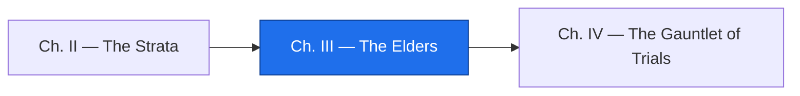

*The artifact records what was done. The reason went home with whoever did it. Somewhere there is a person who knows why the pivot is 50, what status `7` meant to Accounting in 2006, and which report the aging feeds on the first of the month — and that person is retiring, or retired, or answering email out of courtesy. This chapter is the leadership work of archaeology: find the Elders, ask for the why, and write it down where the next raiser will dig.*

*The real-world skill: knowledge capture before a system's builders leave, and decision records that carry their evidence.*

## 📖 The Legend Behind This Quest

*When a NASA probe launched in 1977 fell silent in 2023, the engineers who fixed it reported that solving its problems "often entails consulting original, decades-old documents written by engineers who didn't anticipate the issues that are arising today." That is the Elders' gift and the Elders' limit in one sentence: they left documents, and the documents did not foresee you. A relic is worse off than a probe — its builders rarely wrote anything down at all. The guild's rule is that the reasons are recovered from people while people still answer, and recorded with the evidence that lets a stranger trust them. This chapter sits at Level 1111 because recovering reasons from people is leadership work; the campaign uses the level for progression, not for a change of tools.*

## 🎯 Quest Objectives

### Primary Objectives

- [ ] **Find the Elders** — list every person and document that could hold a reason, from the code's comments, the Chronicle, and the sibling programs
- [ ] **Run the interview** — ask for the why, not the how, with a script that surfaces what would break
- [ ] **Forge the Lore** — turn notes into decision records with a familiar, one decision per record, each with its evidence
- [ ] **Gate the Lore** — run a script that refuses any record whose Evidence section is empty

### Mastery Indicators

- [ ] You can explain why "what would break if this ran an hour later?" beats "how does this work?"
- [ ] Every ADR you wrote cites a comment, an interview line, or a run — never only a hunch
- [ ] You treated the interview as a courtesy to the Elder, not an extraction, and the notes say so

## 🗺️ Quest Prerequisites

- **Chapters I and II** — your `EXPEDITION.md` Unknowns and the two HYPOTHESIS rows in the dictionary are the interview guide.
- **An Elder, or their stand-in** — in a real engagement, the controller who ran the report or the consultant who patched it. In this lab, the relic's own header comments play the Elder, and you will write the interview notes from them so the rest of the pipeline is real.
- **Consent** — never record a person without asking. Write in the notes that you asked.

## 🧙‍♂️ Chapter 1: Find the Elders

### ⚔️ Skills You'll Forge

- Reading people out of comments and history
- Following the copybook to the systems it couples

A relic names its Elders if you know where to look. Three places, in order:

- **The comments.** `ARAGE01` names two: `D.M.`, who wrote it in March 1997 and converted it from RPG II, and `J.R./ACCTG`, on whose word status `7` was excluded in June 2006. Initials are enough to ask a long-tenured colleague "who was D.M. in 1997?"
- **The Chronicle.** Where a real relic has git history, this spell lists every hand that touched it, most active first. Even one commit from 2011 carries an author's name and an email domain.

```bash
git shortlog -sne -- ARAGE01.cob
```

- **The siblings.** The copybook's header says its layout is shared with `ARINV05` and `ARSTM02`. Whoever maintains those programs reads this record too, and may remember why `FILLER` is thirty bytes wide.

Write the roster into `lore/ELDERS.md`: name or initials, what they touched, when, and how to reach them — or "retired 2019, email known to the controller". A roster with three names and one live email is a normal outcome.

### 🔍 Knowledge Check

- [ ] Which of the relic's two named Elders could answer the status `7` question, and which could answer the pivot question?
- [ ] What would `git shortlog -sne` tell you that the comments do not?
- [ ] Why are the sibling programs' maintainers Elders of this relic too?

## 🧙‍♂️ Chapter 2: The Interview — Ask for the Why

### ⚔️ Skills You'll Forge

- A question script that surfaces reasons and breakage
- Note-taking that keeps the Elder's words separate from your reading of them

The how is in the artifact; you can read it, and the familiar already did. Only the Elder has the why, and the why comes out sideways — through what would break, what was decided against, and who complained. Take this script into the room, and let the Elder wander; the wandering is where the lore is.

1. What would break if this ran an hour later? A day later? Not at all?
2. Which fields are lies — values that mean something other than what their name says?
3. What does each status code mean, who decided, and is that still true?
4. Why is the pivot 50? What is the oldest date that ever appeared in real data?
5. What did you decide *not* to build, and why?
6. Who reads this report, and what do they do with it on the day it is wrong?
7. What would you tell the next person before they change a single line?

Record the answers in `lore/interviews/`, one file per conversation, with the Elder's words quoted and your interpretations marked. For the lab, the header comments are your Elder; the notes below are written from them and from Chapter I's reruns, and they are the honest shape of a first interview: short, partial, and specific.

```markdown
# Interview: the relic's header comments, standing in for J.R. (Accounting) — 2026-09-14

Consent: the relic is a lab artifact; in a real engagement, record that the Elder agreed to notes being kept.

Q3. Status codes.
> "STATUS 7 = SHIPPED BUT DISPUTED. EXCLUDE FROM AGING BUCKETS, REPORT SEPARATELY (PER J.R./ACCTG)" — header, MOD 06/06
Interpretation: a disputed invoice must not inflate a customer's past-due balance while the dispute is open. Confirmed by INV10004 in the report: 105 days past due, bucket DISPUTED, not counted in OVER 90.
Still unknown: what "O" means; whether any other codes exist in production data.

Q4. Pivot.
> "MOD 11/99 Y2K WINDOW ADDED - PIVOT 50 (00-49=20XX 50-99=19XX)" — header
Interpretation: chosen in 1999 so that the oldest open invoices (1950s or later) and the newest (through 2049) both window correctly. Confirmed by INV10006 printing 1999/12/31.
Still unknown: whether any due date before 1950 ever existed; what happens in 2050.

Q1. What would break.
Interpretation only (no Elder statement): the as-of date drives every bucket; a stale ASOF.PRM ages nothing correctly. Confirmed by the rerun with 270101 in Chapter I.
```

An interview with a living Elder yields more; this one yields exactly what the artifact can testify to, which is the point of marking every interpretation as yours.

### 🔍 Knowledge Check

- [ ] Which question in the script would surface a rule that exists only in a person's habit, never in code?
- [ ] Why are the Elder's words quoted and your readings marked separately?
- [ ] What question would you add for a relic that writes a file another program reads?

## 🧙‍♂️ Chapter 3: Forge the Lore — Decision Records with Evidence

### ⚔️ Skills You'll Forge

- The five-section decision record
- Prompting a familiar to write one decision per record and stop when evidence runs out
- Gating the Lore with a script

A decision record (an ADR — an architecture decision record) is the smallest scroll that carries a reason forward. The guild's template has five sections, and the fourth is the one that separates lore from folklore:

```markdown
# ADR-NNNN: <the decision, as a sentence>

## Status
## Context
## Decision
## Evidence
## Consequences
```

Let the familiar do the drafting — it is good at shape — but bind it to the evidence you gathered, and tell it what to do when there is none.

```bash
mkdir -p lore
cat lore/interviews/*.md ARAGE01.cob | claude -p "Write ADR-0001 for the decision that invoice status 7 is excluded from aging and reported separately, using exactly these sections: Status, Context, Decision, Evidence, Consequences. Under Evidence, list the interview line, the code comment, or the run that supports the decision as bullet points. If you cannot cite any evidence, write NO EVIDENCE under that heading and do not invent any." > lore/ADR-0001-status-7-means-disputed.md
```

One decision per cast, one file per decision; repeat for the pivot as `ADR-0002`. Print mode answers on standard output, so the redirect is what puts the record on disk — nothing lands in `lore/` that you did not point there.

Audit each draft the way you audited the dictionary. Here is the first record as it survives the audit — it carries three pieces of evidence, and it is the rule the port in Chapter V will be held to:

```markdown
# ADR-0001: Invoice status "7" means shipped-but-disputed and is excluded from aging

## Status

Accepted (recovered from the relic, 2026-09-14)

## Context

`ARAGE01` treats `INV-STATUS = "7"` as a separate class of invoice. The only record of why is a modification comment in the program header: `MOD 06/06 STATUS 7 = SHIPPED BUT DISPUTED. EXCLUDE FROM AGING BUCKETS, REPORT SEPARATELY (PER J.R./ACCTG)`. Accounting confirmed the rule still stands: a disputed invoice must not inflate the customer's past-due balance while the dispute is open.

## Decision

Any replacement of `ARAGE01` keeps status `7` out of the five aging buckets and reports it on its own line, exactly as the relic does.

## Evidence

- `ARAGE01.cob`, header comment `MOD 06/06`, and the `EVALUATE` branch `WHEN INV-STATUS = "7"`.
- `profile_relic.py` on `INVOICES.DAT`: status distribution shows the code in live data.
- Elder interview, accounting lead, 2026-09-14: "we never age a disputed invoice."

## Consequences

The port carries a `DISPUTED` bucket; the reconciliation ledger checks it; a new status code must get its own ADR before the code changes.
```

Now the gate. Save this as `lore_check.py`; it walks every `lore/ADR-*.md`, demands the five sections, and refuses any record whose Evidence lists nothing.

```python
#!/usr/bin/env python3
"""lore_check.py — every decision record must carry its evidence.

Checks each lore/ADR-*.md for the five required sections. Exit 1 on any gap.
"""
import glob
import re
import sys

REQUIRED = ("Status", "Context", "Decision", "Evidence", "Consequences")

def main():
    problems = 0
    files = sorted(glob.glob("lore/ADR-*.md"))
    if not files:
        print("no ADRs found under lore/ — the Lore is empty")
        return 1
    for path in files:
        text = open(path).read()
        headings = set(re.findall(r"^## (\w+)", text, re.M))
        missing = [s for s in REQUIRED if s not in headings]
        cites = len(re.findall(r"^- ", text.split("## Evidence")[1].split("## ")[0], re.M)) if "## Evidence" in text else 0
        status = "ok" if not missing and cites else "INCOMPLETE"
        problems += status != "ok"
        print(f"{path}: {status}" + (f" — missing {missing}" if missing else "") + (" — Evidence lists nothing" if not cites else f" — {cites} evidence item(s)"))
    return 1 if problems else 0

if __name__ == "__main__":
    sys.exit(main())
```

Run it with the first record in place:

```bash
python3 lore_check.py
# lore/ADR-0001-status-7-means-disputed.md: ok — 3 evidence item(s)
```

Then prove the gate has teeth. Write a second record for the pivot but leave its Evidence as prose with no bullet — the way a hurried raiser would — and run the gate again:

```text
lore/ADR-0001-status-7-means-disputed.md: ok — 3 evidence item(s)
lore/ADR-0002-pivot-year-is-50.md: INCOMPLETE — Evidence lists nothing
```

The exit code is 1, and that is the whole design: a decision without evidence cannot pass, whether a person or a familiar wrote it. Fix `ADR-0002` by citing the `MOD 11/99` comment and the `INV10006` rerun, watch it turn green, and commit the Lore.

```bash
git add lore lore_check.py && git commit -q -m "lore: elders roster, interview notes, ADR-0001 and ADR-0002 with evidence, lore gate"
```

### 🔍 Knowledge Check

- [ ] Why does the gate count bullet points under Evidence rather than checking that the heading exists?
- [ ] What should the familiar write when the notes support a decision but no source does?
- [ ] Which of the two HYPOTHESIS rows from Chapter II could become an ADR today, and which still cannot?

## 🎮 Mastery Challenge

**Objective:** a Lore the next raiser can trust without meeting the Elders.

- [ ] `lore/ELDERS.md` names every person and document that could hold a reason, with a way to reach each
- [ ] At least one interview file, with consent recorded and the Elder's words kept apart from yours
- [ ] `ADR-0001` (status `7`) and `ADR-0002` (the pivot) pass `lore_check.py`; you showed a record failing it first
- [ ] `EXPEDITION.md`'s Unknowns list is shorter than it was, and each removed item points at an ADR

## 🎁 Rewards & Progression

- 🧓 **Keeper of the Lore** — you recorded the Elders' reasons with their evidence
- 🎙️ **Skill unlocked:** knowledge-capture interviewing for the why
- 📜 **Skill unlocked:** decision records that cannot ship without evidence
- **+75 XP**

## 🔁 Reproduce It

`lore_check.py` and both of its outputs above — the passing run and the run that refuses an evidence-less record — were executed on 2026-09-14 with Python 3.11 (any 3.10+ works; stock Ubuntu 24.04 ships 3.12) against the exact ADR text shown. The interview notes are written from the relic's header comments and Chapter I's reruns, and every interpretation in them is marked as the raiser's own.

## 🗺️ Quest Network



*Chapters sit at different levels by design: the campaign runs through the levels, and each chapter also appears on its own level hub.*

## 🔮 Next Adventures

You know what the relic does and, for two of its rules, why. Before you change a line, pin what it does so the Hydra cannot grow a head unnoticed.

- ➡️ **Next chapter:** [Chapter IV — The Gauntlet of Trials](/quests/0101/relic-raisers-04-the-gauntlet-of-trials/)
- 🏺 **Campaign hub:** [Epic Quest: The Relic Raisers](/quests/codex/relic-raisers/)
- 👥 **A related craft:** [Mentorship Programs](/quests/1111/mentorship-programs/)

## 📚 Resource Codex

- [Architecture decision records (ADR) on GitHub](https://adr.github.io/) — the format's home, with templates the five-section record descends from
- [NASA: Engineers Working to Resolve Issue With Voyager 1 Computer](https://science.nasa.gov/blogs/voyager/2023/12/12/engineers-working-to-resolve-issue-with-voyager-1-computer-2/) — the Elders' documents, forty-six years on
- [Python `glob`](https://docs.python.org/3/library/glob.html) and [`re`](https://docs.python.org/3/library/re.html) — the two standard-library spells the gate is built from

## 🕸️ Knowledge Graph

*Structured wiki-links connect this quest to the IT-Journey knowledge graph. Open the [Obsidian Graph View](/notes/obsidian/graph/) to explore connections.*

**Campaign hub:** [[Epic Quest: The Relic Raisers]] **Level hub:** [[Level 1111: Leadership & Innovation]] **Previous:** [[The Strata: Read the Copybook, Then Let the Data Testify]] **Next:** [[The Gauntlet of Trials: Pin the Relic Before You Touch It]] **Obsidian docs:** [[Obsidian Knowledge Graph and Wiki Links]]
