*Greetings, brave Scribe of the Digital Realm! You stand at the threshold of an ancient art—the distillation of scattered signals into crystalline Product Requirements. In ages past, Product Managers toiled endlessly, their PRDs growing stale mere moments after quill touched parchment. But you shall learn the secrets of the PRD MACHINE—an autonomous oracle that writes, maintains, and evolves perfect PRDs faster than any mortal hand.*

*This quest will transform you from a weary documentarian into a master of living documentation, wielding automated tools that ensure your requirements never decay, your conflicts are always surfaced, and your product vision remains forever clear.*

### 🌟 The Legend Behind This Quest

*In the early days of software development, requirements lived in dusty scrolls—Word documents buried in SharePoint crypts, Confluence pages forgotten by time, and email chains lost to the void. Product teams would spend countless hours writing PRDs that became obsolete before the ink dried.*

*Then came the prophecy of Signal-Driven Documentation: "Let the code speak. Let the commits testify. Let the machine distill reality into requirements."*

*The PRD MACHINE was forged in this vision—a tool that transforms repository signals (commits, markdown files, feature definitions) into a living PRD that stays fresh, detects conflicts automatically, and integrates seamlessly with CI/CD pipelines.*

*Today, you shall master this ancient artifact.*

---

## 🎯 Quest Objectives

By the time you complete this epic journey, you will have mastered:

### Primary Objectives (Required for Quest Completion)
- [ ] **Understand the 10-Section PRD Architecture** - Master WHY, MVP, UX, API, NFR, EDGE, OOS, ROAD, RISK, DONE
- [ ] **Execute PRD Machine Commands** - Run `sync`, `status`, and `conflicts` with confidence
- [ ] **Generate a Living PRD** - Transform repository signals into a complete PRD.md
- [ ] **Interpret Conflict Detection** - Understand what conflicts mean and how to resolve them

### Secondary Objectives (Bonus Achievements)
- [ ] **Configure CI/CD Integration** - Set up GitHub Actions for automated PRD freshness
- [ ] **Customize Signal Sources** - Understand how to extend PRD Machine with new inputs
- [ ] **Document Your Journey** - Create a blog post about your PRD automation experience

### Mastery Indicators
You'll know you've truly mastered this quest when you can:
- [ ] Explain the PRD Machine architecture to another developer
- [ ] Generate PRDs for different projects using the same tool
- [ ] Diagnose and resolve PRD freshness issues
- [ ] Extend the tool with custom signal sources

---

## 🗺️ Quest Prerequisites

### 📋 Knowledge Requirements
- [ ] Basic understanding of command-line interfaces
- [ ] Familiarity with Git commits and version control
- [ ] Completion of foundational documentation setup (recommended: "Docs in a Row" quest)

### 🛠️ System Requirements
- [ ] Modern operating system (Windows 10+, macOS 10.14+, or Linux)
- [ ] Docker installed and running
- [ ] Git repository with at least 7 days of commit history
- [ ] Text editor or IDE of your choice
- [ ] Internet connection for pulling Docker images

### 🧠 Skill Level Indicators
This 🟡 Medium quest expects:
- [ ] Comfort with terminal commands and navigation
- [ ] Ability to read and understand YAML/Markdown
- [ ] Basic understanding of CI/CD concepts
- [ ] Ready for 45-60 minutes of focused learning

---

## 🌍 Choose Your Adventure Platform

*The PRD MACHINE operates through Docker containers, ensuring consistent behavior across all realms. Choose your platform path below.*

### 🍎 macOS Kingdom Path

```bash
# Verify Docker is installed and running
docker --version
docker info

# Navigate to your repository
cd /path/to/your/repository

# If using IT-Journey repository
cd ~/github/it-journey

# Build the PRD Machine container
docker compose build prd-machine

# Run your first PRD sync
docker compose run --rm prd-machine ./scripts/prd-machine/prd-machine sync

# Check PRD health
docker compose run --rm prd-machine ./scripts/prd-machine/prd-machine status
```

*macOS users with Homebrew can ensure Docker Desktop is installed:*
```bash
brew install --cask docker
open /Applications/Docker.app
```

### 🪟 Windows Empire Path

```powershell
# Verify Docker Desktop is running
docker --version
docker info

# Navigate to your repository (PowerShell)
cd C:\Users\YourName\github\it-journey

# Build the PRD Machine container
docker compose build prd-machine

# Run your first PRD sync
docker compose run --rm prd-machine ./scripts/prd-machine/prd-machine sync

# Check PRD health
docker compose run --rm prd-machine ./scripts/prd-machine/prd-machine status
```

*Windows users should ensure WSL2 backend is enabled in Docker Desktop settings.*

### 🐧 Linux Territory Path

```bash
# Verify Docker is installed
docker --version
docker compose version

# Ensure your user is in the docker group
sudo usermod -aG docker $USER
# (Log out and back in if needed)

# Navigate to repository
cd ~/github/it-journey

# Build and run PRD Machine
docker compose build prd-machine
docker compose run --rm prd-machine ./scripts/prd-machine/prd-machine sync
docker compose run --rm prd-machine ./scripts/prd-machine/prd-machine status
```

### ☁️ Cloud Realms Path (GitHub Codespaces / Gitpod)

```bash
# Cloud environments typically have Docker pre-installed
# Open terminal in your cloud IDE

# Navigate to repository root
cd /workspaces/it-journey  # Codespaces path

# Build and run PRD Machine
docker compose build prd-machine
docker compose run --rm prd-machine ./scripts/prd-machine/prd-machine sync
```

*Cloud environments provide zero-setup Docker access, ideal for quick experimentation.*

---

## 🧙‍♂️ Chapter 1: The Architecture of Living Documentation

*Before wielding the PRD MACHINE, you must understand its structure—the ten sacred sections that form the backbone of every perfect PRD.*

### ⚔️ Skills You'll Forge in This Chapter
- Understanding the 10-section PRD framework
- Recognizing signal-driven documentation principles
- Grasping the "living document" philosophy

### 🏗️ The Ten Sacred Sections

Every PRD generated by the machine contains these sections, each serving a distinct purpose:

| Section | Name | Purpose |
|---------|------|---------|
| **0** | WHY | Mission statement and Key Feature Indicator (KFI) |
| **1** | MVP | Minimum Viable Promise with signal status |
| **2** | UX | User experience flow with diagrams |
| **3** | API | CLI commands and interface documentation |
| **4** | NFR | Non-functional requirements with metrics |
| **5** | EDGE | Edge cases, dependencies, gotchas |
| **6** | OOS | Out of scope - what we explicitly DON'T do |
| **7** | ROAD | Roadmap with milestones and status |
| **8** | RISK | Top risks with mitigation strategies |
| **9** | DONE | Definition of done and success criteria |

### 📜 The Signal-Driven Philosophy

Traditional PRDs are written once and decay over time. Signal-driven PRDs are different:

```
┌─────────────────────────────────────────────────────────────────┐
│                    SIGNAL-DRIVEN PRD                             │
├─────────────────────────────────────────────────────────────────┤
│                                                                  │
│  📝 Git Commits ──┐                                              │
│                   │                                              │
│  📄 Markdown ─────┼──► PRD MACHINE ──► Living PRD.md            │
│                   │                                              │
│  ⚙️ Features ─────┘                                              │
│                                                                  │
│  Key Principle: The machine reads reality, not opinions          │
│                                                                  │
└─────────────────────────────────────────────────────────────────┘
```

**Why Signal-Driven?**
- **Commits reveal what actually shipped** - Not what was planned
- **Markdown captures documentation** - Already-written knowledge
- **Features track implementation** - Ground truth about capabilities
- **Conflicts surface contradictions** - Before they become bugs

### 🔍 Knowledge Check: Architecture
- [ ] Can you name all 10 PRD sections?
- [ ] What's the difference between MVP and OOS?
- [ ] Why do we use signals instead of manual writing?

---

## 🧙‍♂️ Chapter 2: Wielding the PRD Machine CLI

*Now you shall learn the three sacred commands that control the PRD MACHINE.*

### ⚔️ Skills You'll Forge in This Chapter
- Executing PRD Machine commands
- Interpreting command outputs
- Understanding signal ingestion

### 🏗️ The Three Commands

#### Command 1: `sync` - Generate or Update PRD

The `sync` command is the heart of PRD Machine. It:
1. Ingests git commits from repository history
2. Scans all markdown files for signals
3. Parses feature definitions
4. Detects conflicts
5. Generates complete PRD.md

```bash
# Basic sync (uses last 30 days of commits)
docker compose run --rm prd-machine ./scripts/prd-machine/prd-machine sync

# Sync with custom history window
docker compose run --rm prd-machine ./scripts/prd-machine/prd-machine sync --days 7

# Sync to custom output path
docker compose run --rm prd-machine ./scripts/prd-machine/prd-machine sync --output /tmp/custom-prd.md
```

**Expected Output:**
```
[HH:MM:SS] [HEADER] ══════════════════════════════════════════════════
[HH:MM:SS] [HEADER]    PRD MACHINE - Generating PRD.md
[HH:MM:SS] [HEADER] ══════════════════════════════════════════════════
[HH:MM:SS] [INFO] Ingesting git commits from last 30 days...
[HH:MM:SS] [SUCCESS] Ingested 60 commits
[HH:MM:SS] [INFO] Ingesting markdown files...
[HH:MM:SS] [SUCCESS] Ingested 81 markdown files
[HH:MM:SS] [INFO] Ingesting feature definitions...
[HH:MM:SS] [SUCCESS] Ingested 1 features
[HH:MM:SS] [INFO] Detecting conflicts in requirements...
[HH:MM:SS] [WARNING] Detected 4 potential conflicts
[HH:MM:SS] [SUCCESS] PRD generated successfully: /app/PRD.md
[HH:MM:SS] [INFO] Total signals processed: 146
```

#### Command 2: `status` - Check PRD Health

The `status` command monitors PRD freshness:

```bash
docker compose run --rm prd-machine ./scripts/prd-machine/prd-machine status
```

**Expected Output:**
```
[HH:MM:SS] [HEADER] ══════════════════════════════════════════════════
[HH:MM:SS] [HEADER]    PRD MACHINE - Status
[HH:MM:SS] [HEADER] ══════════════════════════════════════════════════
[HH:MM:SS] [INFO] PRD Path: /app/PRD.md
[HH:MM:SS] [INFO] Last Modified: 2025-11-29T06:40:21.138097+00:00
[HH:MM:SS] [INFO] Age: 0.0 hours
[HH:MM:SS] [SUCCESS] Health: HEALTHY
```

**Health Status Levels:**

| Status | Age | Indicator | Action |
|--------|-----|-----------|--------|
| HEALTHY | < 6 hours | ✅ | None needed |
| STALE | 6-24 hours | ⚠️ | Run `sync` soon |
| OUTDATED | > 24 hours | ❌ | Run `sync` immediately |

#### Command 3: `conflicts` - Detect Requirement Conflicts

The `conflicts` command analyzes signals for contradictions:

```bash
docker compose run --rm prd-machine ./scripts/prd-machine/prd-machine conflicts
```

**Expected Output:**
```
[HH:MM:SS] [INFO] Ingesting git commits from last 30 days...
[HH:MM:SS] [SUCCESS] Ingested 60 commits
[HH:MM:SS] [INFO] Detecting conflicts in requirements...
[HH:MM:SS] [WARNING] Detected 4 potential conflicts
[HH:MM:SS] [WARNING] Found 4 conflicts:
  - [fix] Bug fix suggests incomplete requirement: fix(quest): correct invalid...
    Resolution: Consider if original requirement needs clarification
  - [fix] Bug fix suggests incomplete requirement: fix: replace invalid...
    Resolution: Consider if original requirement needs clarification
```

**Conflict Types:**

| Type | Description | Resolution Strategy |
|------|-------------|---------------------|
| `revert` | A change was undone | Review original intent |
| `fix` | Bug fix indicates gaps | Update requirements |
| `contradiction` | Conflicting signals | Human arbitration needed |

### 🔍 Knowledge Check: CLI Mastery
- [ ] What does `--days 7` do in the sync command?
- [ ] What health status should you aim for?
- [ ] What does a `fix` conflict type indicate?

### ⚡ Quick Win Checkpoint
Run all three commands in sequence and verify outputs:
```bash
docker compose run --rm prd-machine ./scripts/prd-machine/prd-machine sync
docker compose run --rm prd-machine ./scripts/prd-machine/prd-machine status
docker compose run --rm prd-machine ./scripts/prd-machine/prd-machine conflicts
```

---

## 🧙‍♂️ Chapter 3: Signal Ingestion Deep Dive

*Understanding where signals come from unlocks the true power of automated documentation.*

### ⚔️ Skills You'll Forge in This Chapter
- Tracing signals from source to PRD
- Understanding frontmatter parsing
- Recognizing valuable commit patterns

### 🏗️ Signal Source Architecture

```mermaid
flowchart TD
    subgraph "Signal Sources"
        GIT[📝 Git Commits]
        MD[📄 Markdown Files]
        FEAT[⚙️ features.yml]
    end
    
    subgraph "PRD Machine Processing"
        INGEST[Signal Ingestion]
        PARSE[Frontmatter Parsing]
        CONFLICT[Conflict Detection]
        GEN[PRD Generation]
    end
    
    subgraph "Output"
        PRD[📜 PRD.md]
    end
    
    GIT --> INGEST
    MD --> INGEST
    FEAT --> INGEST
    INGEST --> PARSE
    PARSE --> CONFLICT
    CONFLICT --> GEN
    GEN --> PRD
```



### 📝 Git Commit Signals

The machine analyzes commit messages for:
- **Subject line** - What changed
- **Body** - Why it changed
- **Author** - Who made the change
- **Date** - When it happened
- **Conventional prefixes** - `feat:`, `fix:`, `docs:`, etc.

**Best Practices for Commit Signals:**
```bash
# Good - provides clear signal
feat(auth): add two-factor authentication

Implements TOTP-based 2FA with SMS fallback for enhanced security.

Closes #123

# Also good - indicates potential requirement gap
fix(login): prevent crash on empty input

Fixed null pointer exception when email field is empty.
Added input validation before API call.

Closes #456
```

### 📄 Markdown File Signals

The machine scans for:
- **Frontmatter** - YAML metadata (title, description, tags)
- **File paths** - Categorization (`_quests/`, `_posts/`, `docs/`)
- **Content patterns** - Learning objectives, technical specifications

**Signal-Rich Frontmatter Example:**
```yaml
---
title: "Docker Mastery Quest"
description: "Complete guide to containerization"
tags:
    - docker
    - devops
    - containers
categories:
    - Quests
    - Infrastructure
difficulty: "🟡 Medium"
---
```

### ⚙️ Feature Definition Signals

Located at `features/features.yml`:
```yaml
features:
  - name: "PRD Machine"
    status: "implemented"
    description: "Autonomous PRD generation"
    category: "automation"
```

### 🔍 Knowledge Check: Signals
- [ ] What commit prefix indicates a bug fix?
- [ ] Where does PRD Machine look for feature definitions?
- [ ] What YAML block provides metadata signals?

---

## 🎮 Quest Implementation Challenges

*Apply your knowledge through these hands-on challenges.*

### Challenge 1: First PRD Generation (🕐 10 minutes)
**Objective**: Generate your first complete PRD

**Requirements**:
- [ ] Run `prd-machine sync` successfully
- [ ] Verify PRD.md contains all 10 sections
- [ ] Check signal counts in output

**Success Criteria**:
- [ ] PRD.md exists with valid frontmatter
- [ ] All section headers present (## 0 through ## 9)
- [ ] Signal status table shows ingested counts

**Bonus Points**:
- [ ] Compare with `--days 7` vs default 30 days
- [ ] Document signal count differences

### Challenge 2: Health Monitoring (🕐 5 minutes)
**Objective**: Understand PRD freshness monitoring

**Requirements**:
- [ ] Run `prd-machine status` immediately after sync
- [ ] Wait 10 minutes and check status again
- [ ] Understand the health calculation

**Success Criteria**:
- [ ] Status shows HEALTHY immediately after sync
- [ ] Can explain the 6-hour freshness threshold
- [ ] Understand when to run sync

### Challenge 3: Conflict Analysis (🕐 15 minutes)
**Objective**: Interpret and act on detected conflicts

**Requirements**:
- [ ] Run `prd-machine conflicts`
- [ ] Categorize each conflict by type
- [ ] Propose resolution for one conflict

**Success Criteria**:
- [ ] Listed all conflicts with types
- [ ] Explained what each conflict indicates
- [ ] Wrote resolution proposal for one conflict

**Bonus Points**:
- [ ] Create a GitHub issue for a real conflict
- [ ] Document the resolution in a commit

### Challenge 4: CI/CD Integration (🕐 15 minutes)
**Objective**: Set up automated PRD freshness

**Requirements**:
- [ ] Review `.github/workflows/prd-sync.yml`
- [ ] Understand the 6-hour cron schedule
- [ ] Identify trigger conditions

**Success Criteria**:
- [ ] Can explain when the workflow runs
- [ ] Understand the commit automation
- [ ] Know how conflict issues are created

---

## 🗺️ Quest Network Position

*See where this quest fits in your learning journey.*


---

## ⚙️ Implementation Flow Diagram

*The complete PRD Machine processing pipeline.*


---

## ✅ Validation & Knowledge Checks

### Final Quest Validation Checklist

Before claiming victory, verify:

- [ ] **PRD Generated**: `PRD.md` exists with all 10 sections
- [ ] **Commands Work**: All three commands execute without errors
- [ ] **Signals Counted**: Output shows commit, markdown, feature counts
- [ ] **Health Monitored**: Status command shows HEALTHY
- [ ] **Conflicts Understood**: Can explain what detected conflicts mean

### Knowledge Assessment

Answer these questions to confirm mastery:

1. **What is the KFI for PRD Machine?**
   - Answer: 100% of shipped features trace to a machine-maintained PRD never >6 hours stale

2. **What does OOS stand for and why is it important?**
   - Answer: Out Of Scope - explicitly defines what we DON'T do to prevent scope creep

3. **How often should a PRD be synced to stay HEALTHY?**
   - Answer: Every 6 hours or less

4. **What does a `fix:` commit indicate as a signal?**
   - Answer: Potential incomplete or unclear requirement that needed correction

### Troubleshooting Guide

| Issue | Cause | Solution |
|-------|-------|----------|
| "Permission denied" | Script not executable | `chmod +x scripts/prd-machine/prd-machine` |
| "No commits found" | Empty git history | Ensure repo has commits in date range |
| "PRD not found" | First run | Run `sync` before `status` |
| Docker errors | Container not built | Run `docker compose build prd-machine` |

---

## 🎁 Rewards & Progression

### Achievement Unlocked! 🏆

Upon completing this quest, you've earned:

| Reward | Description |
|--------|-------------|
| 🏆 **PRD Codex Master** | Mastered the 10-section PRD architecture |
| ⚡ **Signal Distiller** | Can transform repo signals into documentation |
| 📜 **Requirements Architect** | Understands living documentation principles |
| 🔍 **Conflict Detective** | Can identify and resolve requirement conflicts |

### Skills Unlocked
- ✅ PRD Machine CLI proficiency
- ✅ Signal-driven documentation understanding
- ✅ Conflict detection and resolution
- ✅ CI/CD integration for documentation

### Progression Points: **+150 XP**

### Next Quest Recommendations

Based on your new skills, consider:
1. **Advanced Automation** (lvl-0100) - Extend PRD Machine with new signal sources
2. **CI/CD Mastery** (lvl-0101) - Deep dive into GitHub Actions workflows
3. **AI Documentation** - Use AI to enhance PRD content generation

---

## 📚 Resource Codex

### Official Documentation

| Resource | Link | Purpose |
|----------|------|---------|
| PRD Machine README | `scripts/prd-machine/README.md` | Quick reference |
| PRD Machine Docs | `docs/scripts/PRD_MACHINE.md` | Full documentation |
| IT-Journey PRD | `PRD.md` | Live example |

### Related Learning Materials

| Resource | Type | Value |
|----------|------|-------|
| [Conventional Commits](https://www.conventionalcommits.org/) | Spec | Signal-rich commit messages |
| [Living Documentation](https://leanpub.com/livingdocumentation) | Book | Philosophy reference |
| [GitHub Actions](https://docs.github.com/en/actions) | Docs | CI/CD integration |

### Community Resources

| Resource | Type | Purpose |
|----------|------|---------|
| IT-Journey Discord | Community | Get help and share progress |
| GitHub Discussions | Forum | Technical questions |
| r/ProductManagement | Reddit | Industry perspectives |

---

## 📓 AI Collaboration Log

*This quest was developed with AI assistance. Here's how:*

### AI Contributions
- Generated initial quest structure from Write-Quest protocol
- Created Mermaid diagrams for visual learning
- Drafted multi-platform command examples
- Suggested challenge structures and validation criteria

### Human Validation
- Verified all commands execute correctly in Docker
- Tested PRD Machine output accuracy
- Reviewed educational progression and difficulty
- Ensured fantasy theme consistency

### Collaboration Notes
- AI excelled at structure generation and documentation
- Human expertise needed for technical accuracy verification
- Iterative refinement improved educational flow
- Fantasy theming balanced with practical instruction

---

## 🧠 Lessons & Next Steps

### Key Takeaways

1. **PRDs should be living documents** - Automated sync beats manual updates
2. **Signals reveal reality** - Commits, docs, and features tell the truth
3. **Conflicts are features** - Early detection prevents implementation bugs
4. **6-hour freshness matters** - Stale documentation leads to drift

### Future Quest Ideas

- Extend PRD Machine with GitHub Issues integration
- Add Slack/Discord signal ingestion
- Create custom PRD templates for different project types
- Build dashboards for PRD health monitoring

### README-Last Reminder

After completing this quest, remember to:
- [ ] Update `pages/_quests/README.md` with this quest entry
- [ ] Add cross-references to related quests
- [ ] Share your PRD generation experience in discussions

---

## ✅ Quest Validation Checklist

Before marking this quest complete:

- [ ] Front matter populated with all required fields
- [ ] Mermaid diagrams render correctly (test in preview)
- [ ] All Docker commands tested and working
- [ ] README update reminder acknowledged
- [ ] Link integrity verified

---

## 🔄 Kaizen Hooks

### Suggested Improvements for Future Revisions

1. **Add video walkthrough** - Screen recording of PRD generation
2. **Create interactive quiz** - Self-assessment for knowledge checks
3. **Build practice repository** - Sandbox for safe experimentation
4. **Add advanced challenges** - Custom signal source implementation

### Metrics to Monitor

| Metric | Target | Purpose |
|--------|--------|---------|
| Quest completion rate | >70% | Measure accessibility |
| Average completion time | 45-60 min | Validate estimate |
| Conflict resolution rate | >50% | Track actionable learning |
| Follow-up quest starts | >30% | Measure engagement |

### Derivative Quest Ideas

- **Side Quest**: PRD Machine Customization
- **Bonus Quest**: Multi-Repository PRD Aggregation
- **Epic Quest**: Enterprise PRD Governance System

---

*Congratulations, brave Scribe! You have mastered the PRD Codex and unlocked the power of living documentation. Your PRDs shall never again grow stale, your conflicts shall always surface, and your product vision shall remain forever clear.*

*Reality fully armed. The distillery now distills distilleries.* 🚀

---

**Quest Complete?** Mark your progress and share your PRD generation story in the IT-Journey community!
