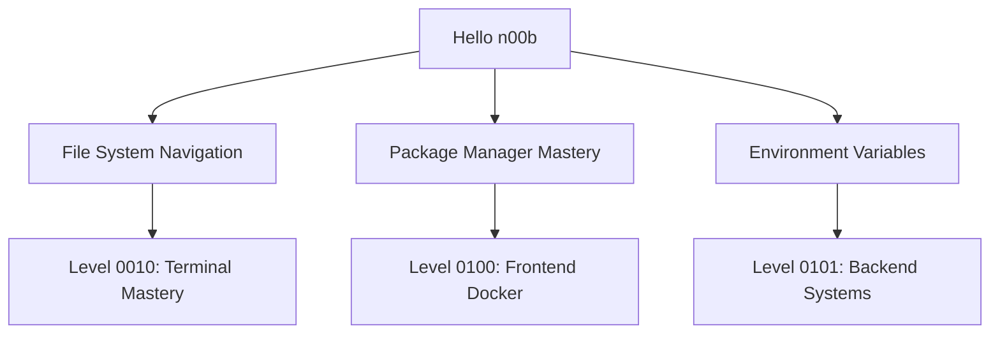
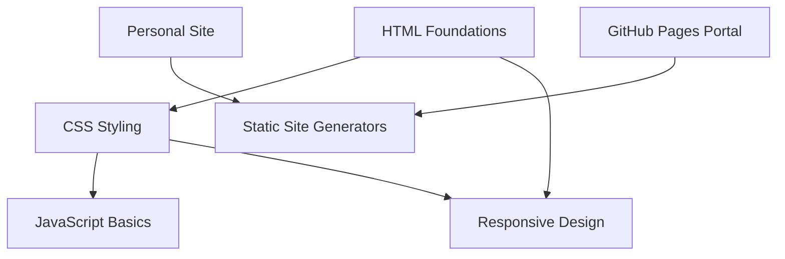
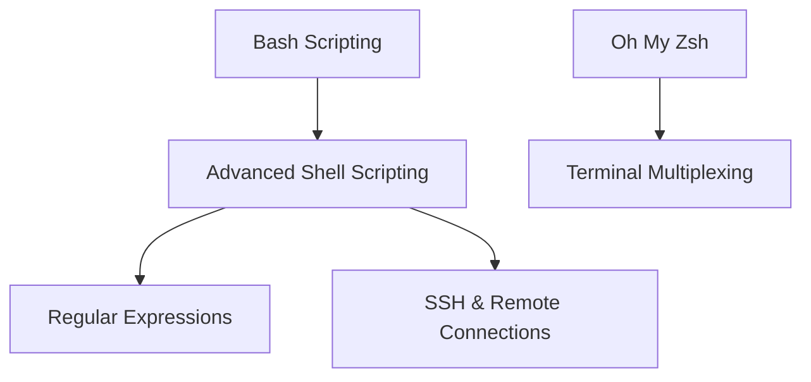
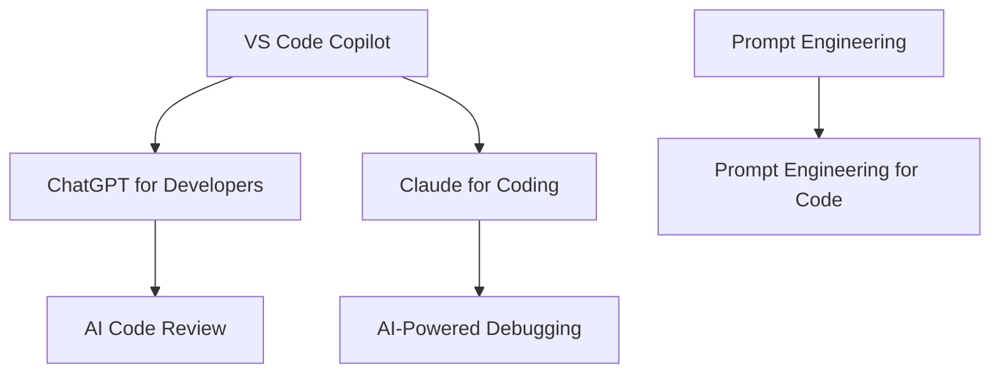

# Quest Build Plan: Complete Placeholder Quest System

## Executive Summary

This plan outlines the systematic creation of **all placeholder quests** across the IT-Journey quest system (Levels 0000-1111). The goal is to establish a complete, interconnected quest network with:

- ✅ All quest files created with proper frontmatter
- ✅ Complete quest hierarchy and relationships defined
- ✅ All internal links and paths mapped
- ✅ Quest network visualizations in place
- ✅ Level README files updated and complete
- ✅ Home.md and main README.md fully integrated

## Current State Analysis

### Completed Quests (✅)

**Level 0000 (Foundation)**: 9 quests
- VS Code Mastery Quest
- Bash Fundamentals
- Bashcrawl Adventure
- Begin Your IT Journey
- Character Building
- IT Fundamentals
- Hello n00b
- Platform-specific quests (Windows, macOS, Linux, Cloud)

**Level 0001 (Web Fundamentals)**: 4 quests
- GitHub Pages Portal
- Personal Site Creation
- Docs in a Row
- Stack Attack

**Level 0010 (Terminal Mastery)**: 5 quests
- Bash Scripting Mastery
- Oh My Zsh Enchantment
- Nerd Font Enchantment
- Prompt Engineering
- Jekyll Mermaid Integration

**Level 0011 (AI-Assisted Dev)**: 2 quests
- GitHub Code Search Quest
- VS Code Copilot Mastery

**Level 0100 (Frontend & Containers)**: 4 quests
- Frontend Fundamentals
- Frontend Docker
- Frontend Levels
- Sourcery Code Methods

**Level 0101 (Backend Systems)**: 2 quests
- Docker Mastery Example
- LazyTeX CV Building

**Level 1010 (Automation & Testing)**: 1 quest
- Link to the Future (Automated Hyperlink Checking)

**Level 1011 (DevOps & Infrastructure)**: 1 quest
- Feature Re-Quest

**Level 1100 (Data Engineering)**: 3 quests
- EDGAR API Integration
- SEC EDGAR Deep Dive
- Temple of Templates

**Level 1110 (Architecture)**: 1 quest
- 404 Hunting Quest

**Total Completed**: 32 quests

### Missing Placeholder Quests (🔮)

Based on home.md and README.md analysis:

**Level 0000**: 3 additional quests needed
**Level 0001**: 5 additional quests needed
**Level 0010**: 4 additional quests needed
**Level 0011**: 5 additional quests needed
**Level 0100**: 5 additional quests needed
**Level 0101**: 6 additional quests needed
**Level 0110**: 8 quests needed (entire level)
**Level 0111**: 8 quests needed (entire level)
**Level 1000**: 8 quests needed (entire level)
**Level 1001**: 8 quests needed (entire level)
**Level 1010**: 7 additional quests needed
**Level 1011**: 7 additional quests needed
**Level 1100**: 5 additional quests needed
**Level 1101**: 8 quests needed (entire level)
**Level 1110**: 7 additional quests needed
**Level 1111**: 8+ quests needed (entire level)

**Total Missing**: ~97 placeholder quests

## Quest Build Strategy

### Phase 1: Infrastructure Preparation (Week 1)

**Objective**: Set up templates, tools, and documentation

#### Tasks:
1. **Create Quest Template Files**
   - [ ] Main quest template (main-quest-template.md)
   - [ ] Side quest template (side-quest-template.md)
   - [ ] Bonus quest template (bonus-quest-template.md)
   - [ ] Epic quest template (epic-quest-template.md)

2. **Create Level README Template**
   - [ ] Standard structure for all level README files
   - [ ] Quest listing format
   - [ ] Learning path integration
   - [ ] Prerequisites and unlocks sections

3. **Set Up Quest Generation Scripts**
   - [ ] Script to create placeholder quest from template
   - [ ] Frontmatter validation script
   - [ ] Quest network relationship validator
   - [ ] Automated link checker for quest paths

4. **Create Quest Hierarchy Documentation**
   - [ ] Complete quest dependency map
   - [ ] Character class progression paths
   - [ ] Skill tree visualizations
   - [ ] Quest type classification guide

### Phase 2: Apprentice Tier Completion (Weeks 2-3)

**Objective**: Complete all quests for Levels 0000-0011

#### Level 0000 - Foundation & Init World
**Status**: 9/12 quests complete

Missing Quests:
- [ ] File System Navigation (file-system-navigation.md)
- [ ] Package Manager Mastery (package-manager-mastery.md)
- [ ] Environment Variables (environment-variables.md)

**Quest Relationships**:


#### Level 0001 - Web Fundamentals
**Status**: 4/9 quests complete

Missing Quests:
- [ ] HTML Foundations (html-foundations.md)
- [ ] CSS Styling (css-styling.md)
- [ ] JavaScript Basics (javascript-basics.md)
- [ ] Responsive Design (responsive-design.md)
- [ ] Static Site Generators (static-site-generators.md)

**Quest Relationships**:


#### Level 0010 - Terminal Mastery
**Status**: 5/9 quests complete

Missing Quests:
- [ ] Advanced Shell Scripting (advanced-shell-scripting.md)
- [ ] Regular Expressions (regular-expressions.md)
- [ ] Terminal Multiplexing (terminal-multiplexing.md)
- [ ] SSH & Remote Connections (ssh-remote-connections.md)

**Quest Relationships**:


#### Level 0011 - AI-Assisted Development
**Status**: 2/7 quests complete

Missing Quests:
- [ ] ChatGPT for Developers (chatgpt-developers.md)
- [ ] Claude for Coding (claude-coding.md)
- [ ] AI Code Review (ai-code-review.md)
- [ ] Prompt Engineering for Code (prompt-engineering-code.md)
- [ ] AI-Powered Debugging (ai-powered-debugging.md)

**Quest Relationships**:


### Phase 3: Adventurer Tier Completion (Weeks 4-6)

**Objective**: Complete all quests for Levels 0100-0111

#### Level 0100 - Frontend & Containers
**Status**: 4/9 quests complete

Missing Quests:
- [ ] React Foundations (react-foundations.md)
- [ ] Vue.js Adventures (vuejs-adventures.md)
- [ ] Docker Fundamentals (docker-fundamentals.md)
- [ ] CSS Frameworks (css-frameworks.md)
- [ ] Build Tools (build-tools.md)

#### Level 0101 - Backend Systems
**Status**: 2/8 quests complete

Missing Quests:
- [ ] Node.js Fundamentals (nodejs-fundamentals.md)
- [ ] Python Flask/Django (python-flask-django.md)
- [ ] RESTful API Design (restful-api-design.md)
- [ ] GraphQL Introduction (graphql-introduction.md)
- [ ] Server Configuration (server-configuration.md)
- [ ] Process Management (process-management.md)

#### Level 0110 - Database Mastery
**Status**: 0/8 quests complete (NEW LEVEL)

Required Quests:
- [ ] Database Design Fundamentals (database-design-fundamentals.md)
- [ ] SQL Sorcery (sql-sorcery.md)
- [ ] NoSQL Adventures (nosql-adventures.md)
- [ ] PostgreSQL Deep Dive (postgresql-deep-dive.md)
- [ ] MongoDB Mastery (mongodb-mastery.md)
- [ ] Redis Caching (redis-caching.md)
- [ ] Query Optimization (query-optimization.md)
- [ ] Database Security (database-security.md)

#### Level 0111 - Full-Stack Integration
**Status**: 0/8 quests complete (NEW LEVEL)

Required Quests:
- [ ] API Design Patterns (api-design-patterns.md)
- [ ] JWT & OAuth (jwt-oauth.md)
- [ ] State Management (state-management.md)
- [ ] WebSockets (websockets.md)
- [ ] Full-Stack Project (full-stack-project.md)
- [ ] Performance Optimization (performance-optimization.md)
- [ ] Error Handling (error-handling.md)
- [ ] Deployment Strategies (deployment-strategies.md)

### Phase 4: Warrior Tier Completion (Weeks 7-9)

**Objective**: Complete all quests for Levels 1000-1011

#### Level 1000 - Security Fundamentals
**Status**: 0/8 quests complete (NEW LEVEL)

Required Quests:
- [ ] Security Mindset (security-mindset.md)
- [ ] OWASP Top 10 (owasp-top-10.md)
- [ ] Secure Coding Practices (secure-coding-practices.md)
- [ ] Penetration Testing Basics (penetration-testing-basics.md)
- [ ] Cryptography Fundamentals (cryptography-fundamentals.md)
- [ ] Security Auditing (security-auditing.md)
- [ ] Incident Response (incident-response.md)
- [ ] Security Tools (security-tools.md)

#### Level 1001 - Cloud Architecture
**Status**: 0/8 quests complete (NEW LEVEL)

Required Quests:
- [ ] Cloud Fundamentals (cloud-fundamentals.md)
- [ ] AWS Quest Line (aws-quest-line.md)
- [ ] Azure Adventures (azure-adventures.md)
- [ ] GCP Expeditions (gcp-expeditions.md)
- [ ] Multi-Cloud Strategy (multi-cloud-strategy.md)
- [ ] Serverless Architecture (serverless-architecture.md)
- [ ] Cloud Security (cloud-security.md)
- [ ] Cost Optimization (cost-optimization.md)

#### Level 1010 - Automation & Testing
**Status**: 1/8 quests complete

Missing Quests:
- [ ] Unit Testing Mastery (unit-testing-mastery.md)
- [ ] Integration Testing (integration-testing.md)
- [ ] E2E Testing Adventures (e2e-testing-adventures.md)
- [ ] Test-Driven Development (test-driven-development.md)
- [ ] CI/CD Pipeline Construction (cicd-pipeline-construction.md)
- [ ] GitHub Actions Mastery (github-actions-mastery.md)
- [ ] Code Quality Gates (code-quality-gates.md)

#### Level 1011 - DevOps & Infrastructure
**Status**: 1/8 quests complete

Missing Quests:
- [ ] Infrastructure as Code (infrastructure-as-code.md)
- [ ] Kubernetes Mastery (kubernetes-mastery.md)
- [ ] Monitoring & Observability (monitoring-observability.md)
- [ ] Log Management (log-management.md)
- [ ] Helm Charts (helm-charts.md)
- [ ] Service Mesh (service-mesh.md)
- [ ] Disaster Recovery (disaster-recovery.md)

### Phase 5: Master Tier Completion (Weeks 10-12)

**Objective**: Complete all quests for Levels 1100-1110

#### Level 1100 - Data Engineering
**Status**: 3/8 quests complete

Missing Quests:
- [ ] ETL Pipeline Design (etl-pipeline-design.md)
- [ ] Data Warehousing (data-warehousing.md)
- [ ] Stream Processing (stream-processing.md)
- [ ] Apache Spark (apache-spark.md)
- [ ] Data Quality (data-quality.md)

#### Level 1101 - Machine Learning & AI
**Status**: 0/8 quests complete (NEW LEVEL)

Required Quests:
- [ ] ML Fundamentals (ml-fundamentals.md)
- [ ] Python for Data Science (python-data-science.md)
- [ ] Neural Networks (neural-networks.md)
- [ ] Deep Learning Frameworks (deep-learning-frameworks.md)
- [ ] Natural Language Processing (natural-language-processing.md)
- [ ] Computer Vision (computer-vision.md)
- [ ] MLOps (mlops.md)
- [ ] AI Ethics (ai-ethics.md)

#### Level 1110 - Architecture & Design
**Status**: 1/8 quests complete

Missing Quests:
- [ ] Design Patterns (design-patterns.md)
- [ ] Microservices Architecture (microservices-architecture.md)
- [ ] Event-Driven Design (event-driven-design.md)
- [ ] Domain-Driven Design (domain-driven-design.md)
- [ ] System Design Interviews (system-design-interviews.md)
- [ ] API Gateway Patterns (api-gateway-patterns.md)
- [ ] Scaling Strategies (scaling-strategies.md)

### Phase 6: Legend Tier Foundation (Weeks 13-14)

**Objective**: Establish Level 1111 structure

#### Level 1111 - Leadership & Innovation
**Status**: 0/8+ quests complete (NEW LEVEL)

Required Quests:
- [ ] Technical Leadership (technical-leadership.md)
- [ ] Open Source Contribution (open-source-contribution.md)
- [ ] Tech Speaking & Writing (tech-speaking-writing.md)
- [ ] Mentorship Programs (mentorship-programs.md)
- [ ] Innovation & R&D (innovation-rnd.md)
- [ ] Architecture Reviews (architecture-reviews.md)
- [ ] Building Technical Communities (building-technical-communities.md)
- [ ] Career Advancement (career-advancement.md)

## Implementation Details

### Quest File Naming Convention

```
pages/_quests/[LEVEL]/[quest-slug].md
```

Examples:
- `pages/_quests/0000/file-system-navigation.md`
- `pages/_quests/0110/database-design-fundamentals.md`
- `pages/_quests/1101/ml-fundamentals.md`

### Standard Frontmatter Template

```yaml
---
title: "[Quest Title]: [Descriptive Subtitle]"
description: "Complete description of what the quest teaches (150-300 characters)"
date: YYYY-MM-DDTHH:MM:SS.000Z
preview: "/images/quest-preview-[slug].png"
tags:
    - lvl-[BINARY]
    - [primary-technology]
    - [quest-type]
    - [skill-focus]
categories:
    - Quests
    - [Technology-Category]
    - [Skill-Category]
sub-title: "Level [BINARY] ([DECIMAL]) Quest: [Classification]"
excerpt: "One-sentence summary of the quest's core learning objective"
author: "IT-Journey Team"
layout: journals
keywords:
    primary:
        - [main-technology-skill]
        - [core-learning-objective]
    secondary:
        - [supporting-technologies]
        - [related-concepts]
lastmod: YYYY-MM-DDTHH:MM:SS.000Z
permalink: /quests/level-[LEVEL]-[slug]/
difficulty: "🟢 Easy | 🟡 Medium | 🔴 Hard | ⚔️ Epic"
estimated_time: "XX-XX minutes"
quest_type: "main_quest | side_quest | bonus_quest | epic_quest"
quest_line: "[Campaign/storyline name]"
quest_series: "[Specific series within the quest line]"
quest_arc: "[Story arc or thematic grouping]"

prerequisites:
    knowledge_requirements:
        - "[Specific prior knowledge or completed quests]"
    system_requirements:
        - "[Required system setup or tools]"
    skill_level_indicators:
        - "[Recommended skill level]"

quest_dependencies:
    required_quests:
        - "[quest-id-or-permalink]"
    recommended_quests:
        - "[quest-id-that-helps]"
    unlocks_quests:
        - "[quest-unlocked-after-completion]"

quest_relationships:
    parent_quest: "[main-quest-id-if-side-quest]"
    child_quests:
        - "[side-quest-id]"
    parallel_quests:
        - "[alternative-path-quest]"
    sequel_quests:
        - "[natural-next-step-quest]"

learning_paths:
    primary_paths:
        - "[Software Development]"
    character_classes:
        - "💻 Software Developer"
    skill_trees:
        - "[Skill Tree Name]"

rewards:
    badges:
        - "🏆 [Achievement Badge Name]"
    skills_unlocked:
        - "🛠️ [Tool or Technology Mastery]"
    progression_points: [XP value]
    unlocks_features:
        - "[Feature unlocked]"

validation_criteria:
    completion_requirements:
        - "[Specific requirement]"
    skill_demonstrations:
        - "[Skill to demonstrate]"
    knowledge_checks:
        - "[Conceptual understanding]"

quest_mapping:
    coordinates: "[x, y]"
    region: "Init World | Foundation | Intermediate | Advanced | Expert"
    realm: "Development | Infrastructure | Security | Data | Creative"
    biome: "Terminal | Web | Cloud | Mobile | AI"

draft: true  # Remove when quest is complete
---
```

### Standard Quest Content Structure

Each placeholder quest should include:

1. **Epic Introduction** (Fantasy-themed opening)
2. **Quest Network Position** (Mermaid diagram showing relationships)
3. **Quest Objectives** (Primary, Secondary, Mastery)
4. **Multi-Platform Paths** (macOS, Windows, Linux, Cloud)
5. **Progressive Learning Chapters** (3-5 chapters minimum)
6. **Hands-On Challenges** (At least 2 challenges)
7. **Rewards & Achievements**
8. **Next Steps & Quest Network** (Related quests)
9. **Resource Library** (Documentation, tools, community)

### Level README Template

Each level directory needs a comprehensive README.md:

```markdown
---
title: Level [BINARY] ([DECIMAL]) - [Level Name]
description: [Level theme and focus]
permalink: /quests/[LEVEL]/
categories:
    - Quests
    - Level-[LEVEL]
tags:
    - lvl-[BINARY]
    - [theme]
lastmod: YYYY-MM-DDTHH:MM:SS.000Z
---

# Level [BINARY] ([DECIMAL]) - [Level Name]

*[Fantasy-themed introduction to the level]*

## Level Overview

**Theme**: [Theme Name] | **XP Range**: [MIN-MAX]

[Description of what this level covers]

## Core Objectives

- [ ] [Objective 1]
- [ ] [Objective 2]
- [ ] [Objective 3]

## Available Quests

### Main Quests
[Table of main quests with difficulty, time, XP]

### Side Quests
[Table of side quests]

### Bonus Quests
[Table of bonus quests]

## Quest Network

```mermaid
[Level-specific quest relationships]
```

## Prerequisites

**From Previous Levels**:
- [Level XXXX]: [Required quests]

**Knowledge Requirements**:
- [Skill 1]
- [Skill 2]

## Unlocks

**Next Level Quests**:
- [Level XXXX]: [Unlocked quests]

**Skills Gained**:
- [Skill 1]
- [Skill 2]

## Character Class Paths

### 💻 Software Developer
[Recommended quest order for this class]

### 🏗️ System Engineer
[Recommended quest order for this class]

[etc. for all character classes]

## Resources

[Level-specific resources, documentation, tools]
```

## Automation and Tooling

### Quest Generation Script

Create `scripts/generate-placeholder-quest.sh`:

```bash
#!/usr/bin/env bash
# Generate a placeholder quest file with proper structure

LEVEL=$1
QUEST_SLUG=$2
QUEST_TITLE=$3

# Validate inputs
# Generate quest file from template
# Update level README
# Update home.md and main README.md
# Validate frontmatter
# Create git commit
```

### Quest Validation Script

Create `scripts/validate-quest-network.py`:

```python
#!/usr/bin/env python3
# Validate quest network integrity

# Check all quest files have required frontmatter
# Validate quest dependencies exist
# Check for circular dependencies
# Verify quest progression paths
# Generate network visualization
# Report orphaned quests
```

### Link Update Script

Create `scripts/update-quest-links.py`:

```python
#!/usr/bin/env python3
# Update all quest links across documentation

# Parse all quest files
# Extract permalinks and relationships
# Update home.md
# Update README.md
# Update level README files
# Validate all links work
```

## Quality Assurance Checklist

For each placeholder quest:

- [ ] Frontmatter complete with all required fields
- [ ] Quest network position diagram present
- [ ] All prerequisites listed and linked
- [ ] All unlocked quests listed and linked
- [ ] Multi-platform instructions (or placeholder)
- [ ] At least 2 hands-on challenges defined
- [ ] Learning objectives clearly stated
- [ ] Validation criteria specified
- [ ] Fantasy theme integrated throughout
- [ ] Resources section populated
- [ ] Level README updated
- [ ] home.md updated
- [ ] Main README.md updated
- [ ] All internal links validated
- [ ] Draft status set appropriately

## Success Metrics

### Completion Criteria

- ✅ All 97+ placeholder quests created
- ✅ All level README files complete
- ✅ home.md fully updated with all quests
- ✅ Main README.md fully updated
- ✅ 100% of internal quest links validated
- ✅ Complete quest network visualizations
- ✅ All character class paths documented
- ✅ Quest dependency chains validated

### Quality Metrics

- ✅ 0 broken internal links
- ✅ 100% frontmatter completeness
- ✅ All quests have clear learning objectives
- ✅ Fantasy theme consistent across all quests
- ✅ Multi-platform support noted (even if placeholder)
- ✅ Character class alignment specified
- ✅ Skill trees and progression paths mapped

## Timeline and Milestones

### Week 1: Infrastructure
- Day 1-2: Create templates
- Day 3-4: Build automation scripts
- Day 5-7: Documentation and validation

### Weeks 2-3: Apprentice Tier (Levels 0000-0011)
- 18 placeholder quests
- 4 level READMEs updated

### Weeks 4-6: Adventurer Tier (Levels 0100-0111)
- 32 placeholder quests
- 4 level READMEs created/updated

### Weeks 7-9: Warrior Tier (Levels 1000-1011)
- 31 placeholder quests
- 4 level READMEs created

### Weeks 10-12: Master Tier (Levels 1100-1110)
- 24 placeholder quests
- 3 level READMEs updated

### Weeks 13-14: Legend Tier & Final Integration
- 8 placeholder quests (Level 1111)
- 1 level README created
- Final link validation
- Complete home.md and README.md integration
- Network visualization generation

## Next Steps

1. **Review and Approve Plan**
   - Validate quest list completeness
   - Confirm level structure
   - Approve naming conventions

2. **Set Up Infrastructure**
   - Create templates
   - Build automation scripts
   - Establish validation tools

3. **Begin Phase 1 Execution**
   - Start with Apprentice Tier completion
   - Focus on one level at a time
   - Validate links as you go

4. **Iterate and Improve**
   - Gather feedback on placeholder structure
   - Refine templates based on learnings
   - Optimize automation scripts

---

**Plan Version**: 1.0.0  
**Created**: 2025-11-29  
**Last Updated**: 2025-11-29  
**Status**: Ready for Review  
**Estimated Completion**: 14 weeks from start date
