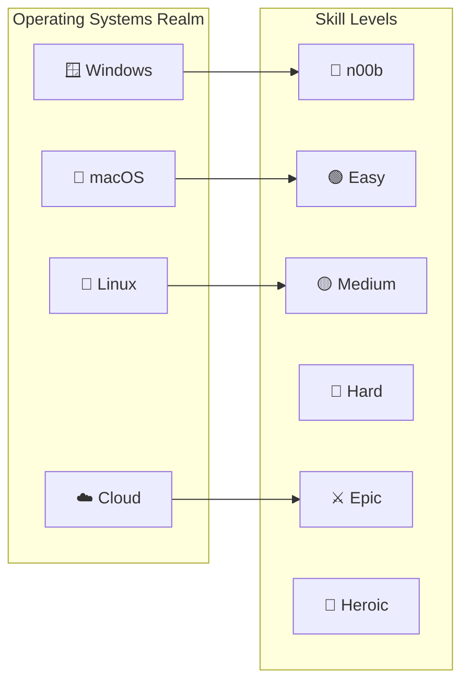
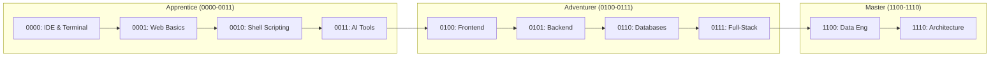
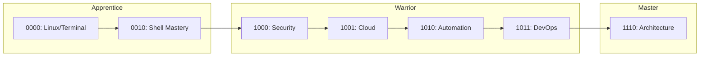
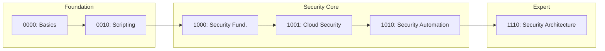
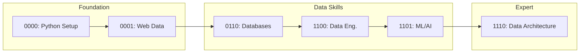
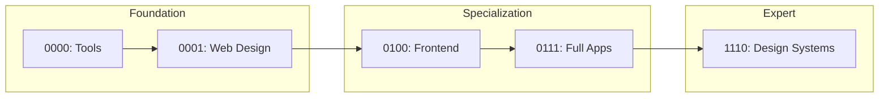
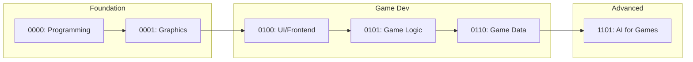

*Ah, brave adventurer! You've entered the mystical realm of IT knowledge, where code flows like magic, systems rise like castles, and every bug is but a dragon to be slain.*

This is your comprehensive quest index—a living map of learning adventures designed to transform you from a humble n00b into a legendary IT wizard. Whether you seek the path of the Code Sorcerer, the System Architect, or the Cloud Wanderer, your journey begins here.

## World Overview




## Character Creation & Path Selection

### Choose Your Difficulty Level

- **🌱 What is OS?** - [n00b Quest](/quests/0000/hello-noob/)
- **🌐 I has Internet!?** - Easy Mode
- **🍎 Big Macintosh** - Medium Challenge
- **🪟 Damn Windows Update** - Hard Mode
- **🐧 A Linux to the Past** - Epic Adventure
- **☁️ Cloud Atlas** - Heroic Journey

### Available Character Classes

- **💻 Software Developer** - *Master of Code and Creation*
- **🏗️ System Engineer** - *Architect of Digital Fortresses*
- **🛡️ Security Specialist** - *Guardian Against Digital Dragons*
- **📊 Data Scientist** - *Diviner of Digital Prophecies*
- **🎨 Digital Artist** - *Crafter of Beautiful Interfaces*
- **🎮 Game Developer** - *Builder of Interactive Worlds*

---

## Character Class Specialization Paths

*Choose your destiny and follow the path that calls to you. Each class has a recommended quest progression through the level system.*

### 💻 Software Developer Path

*Master the art of code creation, from web apps to enterprise systems*



**Recommended Quest Sequence:**

| Level | Focus | Key Skills |
|-------|-------|------------|
| 0000 | Foundation | VS Code, Git basics, terminal navigation |
| 0001 | Web Fundamentals | HTML, CSS, JavaScript, static sites |
| 0010 | Terminal Mastery | Bash scripting, automation |
| 0011 | AI Tools | GitHub Copilot, AI-assisted development |
| 0100 | Frontend | React/Vue, CSS frameworks, build tools |
| 0101 | Backend | Node.js/Python, APIs, server management |
| 0110 | Databases | SQL, NoSQL, data modeling |
| 0111 | Full-Stack | Integration, authentication, state management |
| 1100 | Data Engineering | ETL, data pipelines |
| 1110 | Architecture | Design patterns, system design |

### 🏗️ System Engineer Path

*Build and maintain the infrastructure that powers the digital world*



**Recommended Quest Sequence:**

| Level | Focus | Key Skills |
|-------|-------|------------|
| 0000 | Foundation | Linux basics, terminal, file systems |
| 0010 | Terminal Mastery | Advanced bash, SSH, system administration |
| 1000 | Security | System hardening, access control |
| 1001 | Cloud | AWS/Azure/GCP, IaaS fundamentals |
| 1010 | Automation | CI/CD, testing pipelines |
| 1011 | DevOps | Kubernetes, Terraform, monitoring |
| 1110 | Architecture | Infrastructure design, scaling |

### 🛡️ Security Specialist Path

*Protect digital realms from threats and vulnerabilities*



**Recommended Quest Sequence:**

| Level | Focus | Key Skills |
|-------|-------|------------|
| 0000 | Foundation | System basics, terminal, networking |
| 0010 | Scripting | Automation for security tasks |
| 1000 | Security Fundamentals | OWASP, pen testing, cryptography |
| 1001 | Cloud Security | IAM, network security, compliance |
| 1010 | Security Automation | SIEM, automated scanning |
| 1110 | Security Architecture | Threat modeling, security design |

### 📊 Data Scientist Path

*Divine insights from the rivers of data*



**Recommended Quest Sequence:**

| Level | Focus | Key Skills |
|-------|-------|------------|
| 0000 | Foundation | Python setup, Jupyter notebooks |
| 0001 | Web Data | APIs, data scraping, JSON |
| 0110 | Databases | SQL, data modeling, queries |
| 1100 | Data Engineering | ETL, data pipelines, warehousing |
| 1101 | ML/AI | Machine learning, neural networks |
| 1110 | Data Architecture | Big data systems, streaming |

### 🎨 Digital Artist (UI/UX) Path

*Create beautiful and intuitive digital experiences*



**Recommended Quest Sequence:**

| Level | Focus | Key Skills |
|-------|-------|------------|
| 0000 | Foundation | Design tools, version control |
| 0001 | Web Design | HTML/CSS, responsive design |
| 0100 | Frontend | Component libraries, animations |
| 0111 | Full Apps | User flows, prototyping |
| 1110 | Design Systems | Style guides, component architecture |

### 🎮 Game Developer Path

*Build interactive worlds and engaging experiences*



**Recommended Quest Sequence:**

| Level | Focus | Key Skills |
|-------|-------|------------|
| 0000 | Foundation | Programming basics, tools setup |
| 0001 | Graphics | Canvas, WebGL basics |
| 0100 | Game UI | Interface design, menus |
| 0101 | Game Logic | Physics, game loops, state |
| 0110 | Game Data | Save systems, leaderboards |
| 1101 | Game AI | NPC behavior, pathfinding |

## Quest Categories

### Init World - Character Creation & Foundation

Begin your journey and establish your digital identity

**Featured Quests:**

- [Begin Your IT Journey](0000/begin-your-it-journey.md) - *The Hero's Call*
- [Character Building](0000/character-building.md) - *Forge Your Identity*
- [IT Fundamentals](0000/it-fundamentals.md) - *Learn the Ancient Arts*
- [Character Selection](0000/character-selection.md) - *Choose Your Destiny*
- [OS Selection](0000/os-selection.md) - *Pick Your Realm*

**Platform-Specific Starting Quests:**

- [Hello n00b](0000/hello-noob.md) - *Your First Steps into the Digital Realm*
- [Hello Windows](0000/hello-win/) - *Mastering the Microsoft Kingdom*
- [Hello macOS](0000/hello-mac/) - *Conquering the Apple Empire*
- [Hello Linux](0000/hello-linux/) - *Taming the Penguin's Domain*
- [Hello Cloud](0000/hello-cloud/) - *Ascending to the Digital Heavens*

📁 **[Level 0000 Directory Guide](0000/README.md)** - Complete quest listing for this level

### Level Progression System

#### 🌱 Apprentice Tier (Levels 0000-0011)

*Master the fundamentals and awaken your digital potential*

#### Level 0000 - Foundation & Init World

Basic scripting, terminal navigation, and environment setup

**Available Quests:**

- [x] [Hello n00b](0000/hello-noob.md) - *Your First Steps into the Digital Realm*
- [x] [VS Code Mastery Quest](0000/vscode-mastery-quest.md) - *Master Your Primary IDE*
- [x] [Bash Fundamentals](0000/bash-run.md) - *Learn the Terminal Incantations*
- [x] [Bashcrawl Adventure](0000/bashcrawl/) - *Your First Automation Spell*
- [x] [Begin Your IT Journey](0000/begin-your-it-journey.md) - *The Hero's Call*
- [x] [Character Building](0000/character-building.md) - *Forge Your Identity*
- [x] [IT Fundamentals](0000/it-fundamentals.md) - *Learn the Ancient Arts*
- [ ] File System Navigation - *Mapping the Digital Terrain*
- [ ] Package Manager Mastery - *Homebrew, apt, Chocolatey*
- [ ] Environment Variables - *Configuring Your World*

**Platform-Specific Quests:**
- [Hello Windows](0000/hello-win/) | [Hello macOS](0000/hello-mac/) | [Hello Linux](0000/hello-linux/) | [Hello Cloud](0000/hello-cloud/)

📁 **[Level 0000 Directory Guide](0000/README.md)** - Complete quest listing for this level

#### Level 0001 - Web Fundamentals

Web technologies, HTML/CSS/JS basics, and static sites

**Available Adventures:**

- [x] [The GitHub Pages Portal](0001/github-pages-portal.md) - *Deploy Your First Website*
- [x] [Personal Site Creation](0001/personal-site.md) - *Build Your Digital Castle*
- [x] [Docs in a Row](0001/docs-in-a-row.md) - *Documentation Basics*
- [x] [Stack Attack](0001/stackattack.md) - *Understanding Tech Stacks*
- [ ] HTML Foundations - *The Structure of the Web*
- [ ] CSS Styling - *Visual Magic & Design*
- [ ] JavaScript Basics - *Adding Interactivity*
- [ ] Responsive Design - *Mobile-First Thinking*
- [ ] Static Site Generators - *Jekyll & Hugo Basics*

📁 **[Level 0001 Directory Guide](0001/README.md)** - Complete quest listing and learning paths

#### Level 0010 - Terminal Mastery

Advanced terminal customization and shell scripting

**Epic Challenges:**

- [x] [Bash Scripting Mastery](0010/bash-scripting.md) - *Master the Ancient Bash Incantations*
- [x] [Oh My Zsh Terminal Enchantment](0010/oh-my-zsh-terminal-enchantment.md) - *Transform Your Terminal*
- [x] [Nerd Font Enchantment](0010/nerd-font-enchantment-side-quest.md) - *Visual Terminal Magic*
- [x] [Prompt Engineering](0010/prompt-engineering.md) - *Forge the Prompt Crystal*
- [x] [Jekyll Mermaid Integration](0010/jekyll-mermaid-integration-quest.md) - *Diagram Magic*
- [ ] Advanced Shell Scripting - *Complex Automation Spells*
- [ ] Regular Expressions - *Pattern Matching Sorcery*
- [ ] Terminal Multiplexing - *tmux & screen Mastery*
- [ ] SSH & Remote Connections - *Portal Magic*

📁 **[Level 0010 Directory Guide](0010/README.md)** - Complete quest listing and learning paths

#### Level 0011 - AI-Assisted Development

Development tools, AI copilots, and productivity workflows

**Available Quests:**

- [x] [GitHub Code Search Quest](0011/github-hidden-gem-code-search-quest.md) - *Master Code Discovery*
- [x] [Prompt Crystal Mastery: VS Code Copilot](0011/prompt-crystal-mastery-vscode-copilot-quest.md) - *AI Pair Programming*
- [ ] ChatGPT for Developers - *Conversational AI Tools*
- [ ] Claude for Coding - *Advanced AI Assistance*
- [ ] AI Code Review - *Automated Quality Checks*
- [ ] Prompt Engineering for Code - *Crafting Perfect Prompts*
- [ ] AI-Powered Debugging - *Smart Error Resolution*

📁 **[Level 0011 Directory Guide](0011/README.md)** - Complete quest listing and learning paths

---

#### ⚔️ Adventurer Tier (Levels 0100-0111)

*Specialize your skills and build real-world applications*

#### Level 0100 - Frontend & Containers

User interface development and Docker containerization

**Quest Series:**

- [x] [Frontend Fundamentals](0100/frontend.md) - *The Art of Digital Presentation*
- [x] [Frontend Docker Adventures](0100/frontend-docker.md) - *Containerized UI Magic*
- [x] [Frontend Level Progression](0100/frontend-levels.md) - *Structured Learning Path*
- [x] [Sourcery Code Methods](0100/sourcery-code-methods.md) - *Advanced Coding Arts*
- [ ] React Foundations - *Component-Based Magic*
- [ ] Vue.js Adventures - *Progressive Framework*
- [ ] Docker Fundamentals - *Container Basics*
- [ ] CSS Frameworks - *Bootstrap & Tailwind*
- [ ] Build Tools - *Webpack, Vite, Parcel*

📁 **[Level 0100 Directory Guide](0100/README.md)** - Complete quest listing and learning paths

#### Level 0101 - Backend Systems

Server-side development and API creation

**Quest Series:**

- [x] [Docker Mastery Example](0101/docker-mastery-example.md) - *Advanced Container Patterns*
- [x] [LazyTeX CV Building](0101/the-lazytex-of-building-a-curriculum-vitae.md) - *Professional Document Automation*
- [ ] Node.js Fundamentals - *JavaScript on the Server*
- [ ] Python Flask/Django - *Pythonic Web Services*
- [ ] RESTful API Design - *Building Service Endpoints*
- [ ] GraphQL Introduction - *Modern Query Languages*
- [ ] Server Configuration - *Nginx & Apache*
- [ ] Process Management - *PM2 & Supervisor*

📁 **[Level 0101 Directory Guide](0101/README.md)** - Complete quest listing and learning paths

### Specialized Quest Lines

#### Level 0110 - Database Mastery (🔮 Coming Soon)

*Master the arcane arts of data storage and retrieval*

**Quest Series:**

- [ ] Database Design Fundamentals - *Structuring the Data Vaults*
- [ ] SQL Sorcery - *Query Language Mastery*
- [ ] NoSQL Adventures - *Document & Key-Value Stores*
- [ ] Database Administration - *Vault Keeper Training*
- [ ] Query Optimization - *Speed of Lightning*
- [ ] Database Security - *Protecting the Treasure*

📁 **[Level 0110 Directory Guide](0110/README.md)** - *Coming Soon*

#### Level 0111 - Full-Stack Integration (🔮 Coming Soon)

*Bridge frontend and backend into unified applications*

**Quest Series:**

- [ ] API Design Patterns - *The Communication Protocols*
- [ ] Authentication & Authorization - *Keys to the Kingdom*
- [ ] State Management - *Maintaining the Balance*
- [ ] Real-time Applications - *Living Connections*
- [ ] Full-Stack Project - *Build Your First Castle*
- [ ] Performance Optimization - *Speed Enhancement Spells*

📁 **[Level 0111 Directory Guide](0111/README.md)** - *Coming Soon*

#### Level 1000 - Security Fundamentals (🔮 Coming Soon)

*Learn the defensive arts to protect digital realms*

**Quest Series:**

- [ ] Security Mindset - *Think Like a Guardian*
- [ ] OWASP Top 10 - *Know Your Enemies*
- [ ] Secure Coding Practices - *Fortified Construction*
- [ ] Penetration Testing Basics - *Ethical Dragon Slaying*
- [ ] Cryptography Fundamentals - *The Art of Secrets*
- [ ] Security Auditing - *Fortress Inspection*

📁 **[Level 1000 Directory Guide](1000/README.md)** - *Coming Soon*

#### Level 1001 - Cloud Architecture (🔮 Coming Soon)

*Ascend to the cloud realms and build sky fortresses*

**Quest Series:**

- [ ] Cloud Fundamentals - *Understanding the Heavens*
- [ ] AWS Quest Line - *Amazon's Digital Empire*
- [ ] Azure Adventures - *Microsoft's Cloud Kingdom*
- [ ] GCP Expeditions - *Google's Sky Territory*
- [ ] Multi-Cloud Strategy - *Realm Diplomacy*
- [ ] Serverless Architecture - *Magic Without Servers*
- [ ] Cloud Security - *Protecting Sky Fortresses*

📁 **[Level 1001 Directory Guide](1001/README.md)** - *Coming Soon*

#### Level 1010 - Automation & Testing

Build automated validation and CI/CD pipelines

**Quest Series:**

- [x] [Link to the Future: Automated Hyperlink Checking](1010/link-to-the-future-automated-hyperlink-checking-and-error-reporting.md) - *Automated Validation*
- [ ] Unit Testing Mastery - *Spell Verification*
- [ ] Integration Testing - *System Harmony Checks*
- [ ] E2E Testing Adventures - *Full Journey Testing*
- [ ] Test-Driven Development - *Write Tests First*
- [ ] CI/CD Pipeline Construction - *Automation Assembly Line*

📁 **[Level 1010 Directory Guide](1010/README.md)** - Complete quest listing and learning paths

#### Level 1011 - DevOps & Infrastructure

Infrastructure as Code and system operations

**Quest Series:**

- [x] [Feature Re-Quest](1011/feature-re-quest-.md) - *Feature Development Workflows*
- [ ] Infrastructure as Code - *Terraform & Pulumi*
- [ ] Container Orchestration - *Kubernetes Mastery*
- [ ] Monitoring & Observability - *All-Seeing Eye*
- [ ] Log Management - *Chronicle Keeping*
- [ ] Incident Response - *Emergency Protocols*

📁 **[Level 1011 Directory Guide](1011/README.md)** - Complete quest listing and learning paths

#### Level 1100 - Data Engineering

Financial data integration and data pipeline mastery

**Quest Series:**

- [x] [EDGAR API Integration](1100/edgar.md) - *Financial Data Access*
- [x] [SEC EDGAR Deep Dive](1100/sec-edgar.md) - *Advanced Financial Analysis*
- [x] [Temple of Templates](1100/the-temple-of-templates.md) - *Reusable Template Systems*
- [ ] ETL Pipeline Design - *Data Transformation Arts*
- [ ] Data Warehousing - *The Grand Data Library*
- [ ] Stream Processing - *Real-time Data Rivers*

📁 **[Level 1100 Directory Guide](1100/README.md)** - Complete quest listing and learning paths

#### Level 1101 - Machine Learning & AI (🔮 Coming Soon)

*Harness the power of digital intelligence*

**Quest Series:**

- [ ] ML Fundamentals - *Teaching Machines to Learn*
- [ ] Python for Data Science - *Pythonic Prophecies*
- [ ] Neural Networks - *Digital Brain Construction*
- [ ] Natural Language Processing - *Understanding Digital Speech*
- [ ] Computer Vision - *Machine Sight*
- [ ] MLOps - *Deploying Intelligence*
- [ ] AI Ethics - *Responsible Creation*

📁 **[Level 1101 Directory Guide](1101/README.md)** - *Coming Soon*

#### Level 1110 - Architecture & Design

System architecture and quality assurance mastery

**Quest Series:**

- [x] [404 Hunting Quest](1110/404-hunting.md) - *Error Handling Mastery*
- [ ] Design Patterns - *Architectural Blueprints*
- [ ] Microservices Architecture - *Distributed Kingdoms*
- [ ] Event-Driven Design - *Reactive Systems*
- [ ] Domain-Driven Design - *Business Logic Mastery*
- [ ] System Design Interviews - *Architect Certification*

📁 **[Level 1110 Directory Guide](1110/README.md)** - Complete quest listing and learning paths

#### Level 1111 - Leadership & Innovation (🔮 Coming Soon)

*Become a legend and shape the future of technology*

**Quest Series:**

- [ ] Technical Leadership - *Leading the Guild*
- [ ] Open Source Contribution - *Community Building*
- [ ] Tech Blogging & Speaking - *Spreading Knowledge*
- [ ] Mentorship - *Training the Next Generation*
- [ ] Innovation & R&D - *Pushing Boundaries*
- [ ] Career Advancement - *The Hero's Journey Complete*
- [ ] Building Your Legacy - *Creating Lasting Impact*

📁 **[Level 1111 Directory Guide](1111/README.md)** - *Coming Soon*

### Tools Collection

Cross-level tools, version control mastery, and professional development workflows

**Core Tool Quests:**

- [x] [Django & Git Mastery](tools/django-and-git.md) - *Web Framework Sorcery*
- [x] [Action Triggers](tools/action-triggers.md) - *Automation Spell Casting*
- [x] [Branches & Pull Requests](tools/branches-and-pull-requests.md) - *Version Control Mastery*
- [x] [Change Log Chronicles](tools/change-logs.md) - *Document Your Journey*
- [x] [Clean Commit Commitments](tools/commitments-to-clean-commits.md) - *Perfect Your Git Ritual*
- [x] [AI Automation Revolution](tools/revolutionizing-work-with-ai-automation.md) - *Summon AI Familiars*
- [x] [Planting Seeds](tools/planting-seeds.md) - *Software Evolution Principles*
- [x] [Zer0 to Her0 Epic](tools/epic-quest-zer0-to-her0-cmstyle.md) - *Complete Journey from Beginner to Hero*

**Planned Tool Quests:**

- [ ] Git Advanced Techniques - *Time Travel & Branch Magic*
- [ ] GitHub Actions Mastery - *Workflow Automation*
- [ ] Package Management - *npm, pip, cargo, gems*
- [ ] Code Linting & Formatting - *Quality Standards*
- [ ] IDE Extensions & Plugins - *Power-Up Your Editor*
- [ ] Documentation Tools - *MkDocs, Docusaurus, Sphinx*
- [ ] API Testing Tools - *Postman, Insomnia, curl*
- [ ] Database Tools - *DBeaver, pgAdmin, MongoDB Compass*

📁 **[Tools Collection Guide](tools/README.md)** - Complete tools quest listing

---

## Skill Tree System

*Every quest contributes to your skill tree. Here's an overview of all skills you can master:*

### Core Skills (All Classes)

| Skill | Description | Unlocked At |
|-------|-------------|-------------|
| 🖥️ Terminal Navigation | Command line basics | Level 0000 |
| 📝 Text Editing | IDE and editor mastery | Level 0000 |
| 🔄 Version Control | Git fundamentals | Level 0000 |
| 🌐 Web Basics | HTML/CSS/JS foundations | Level 0001 |
| 🐚 Shell Scripting | Bash/PowerShell automation | Level 0010 |
| 🤖 AI Assistance | AI-powered development | Level 0011 |

### Frontend Skills

| Skill | Description | Unlocked At |
|-------|-------------|-------------|
| 🎨 CSS Mastery | Advanced styling | Level 0100 |
| ⚛️ React/Vue | Component frameworks | Level 0100 |
| 📱 Responsive Design | Mobile-first development | Level 0100 |
| 🎭 State Management | Redux, Vuex, Zustand | Level 0111 |
| ✨ Animations | CSS & JS animations | Level 0100 |

### Backend Skills

| Skill | Description | Unlocked At |
|-------|-------------|-------------|
| 🔧 Server Setup | Node.js/Python servers | Level 0101 |
| 🔌 API Design | REST & GraphQL | Level 0101 |
| 🔐 Authentication | JWT, OAuth, sessions | Level 0111 |
| 📦 Containerization | Docker fundamentals | Level 0100 |
| ⚙️ Microservices | Distributed systems | Level 1110 |

### Database Skills

| Skill | Description | Unlocked At |
|-------|-------------|-------------|
| 📊 SQL Basics | Queries and joins | Level 0110 |
| 🗄️ NoSQL | MongoDB, Redis | Level 0110 |
| 📐 Data Modeling | Schema design | Level 0110 |
| ⚡ Query Optimization | Performance tuning | Level 1100 |
| 🔄 Replication | High availability | Level 1100 |

### DevOps Skills

| Skill | Description | Unlocked At |
|-------|-------------|-------------|
| 🔄 CI/CD | Pipeline creation | Level 1010 |
| ☸️ Kubernetes | Container orchestration | Level 1011 |
| 📊 Monitoring | Observability setup | Level 1011 |
| 🏗️ IaC | Terraform, Pulumi | Level 1011 |
| ☁️ Cloud Platforms | AWS/Azure/GCP | Level 1001 |

### Security Skills

| Skill | Description | Unlocked At |
|-------|-------------|-------------|
| 🔒 Secure Coding | Best practices | Level 1000 |
| 🔍 Pen Testing | Vulnerability assessment | Level 1000 |
| 🔐 Cryptography | Encryption basics | Level 1000 |
| 🛡️ Security Auditing | Compliance checks | Level 1000 |
| 🚨 Incident Response | Breach handling | Level 1000 |

### Data & ML Skills

| Skill | Description | Unlocked At |
|-------|-------------|-------------|
| 📈 Data Analysis | Pandas, NumPy | Level 1100 |
| 🔄 ETL Pipelines | Data transformation | Level 1100 |
| 🧠 Machine Learning | sklearn, TensorFlow | Level 1101 |
| 💬 NLP | Text processing | Level 1101 |
| 👁️ Computer Vision | Image analysis | Level 1101 |

### Leadership Skills

| Skill | Description | Unlocked At |
|-------|-------------|-------------|
| 👥 Mentoring | Teaching others | Level 1111 |
| 📢 Tech Speaking | Presentations | Level 1111 |
| 📝 Tech Writing | Blogs & docs | Level 1111 |
| 🤝 Open Source | Community contribution | Level 1111 |
| 🎯 Tech Strategy | Planning & vision | Level 1111 |

## Codex & Reference Materials

### Navigation & World Building

- [World Map](codex/world_map.md) - *Navigate the Digital Realms*
- [Glossary](codex/glossary.md) - *Dictionary of Digital Spells and Terms*

### Home Base Operations

- [Overworld Hub](home.md) - *Your Central Command Center*

### Quest Collection Resources

- [Inventory System](inventory/README.md) - *Learner Progress Tracking (Coming Soon)*

## Directory Structure & Organization

The quests directory follows a binary-coded level system representing skill progression:

```
_quests/
├── README.md              # This file - main quest index
├── home.md                # Overworld hub and navigation
│
├── 0000/                  # Level 0 - Foundation & Init World
│   ├── README.md          # Level guide with quest listings
│   ├── scripts/           # Script examples (calculator.sh, profile.sh)
│   ├── hello-*/           # Platform-specific onboarding quests
│   └── *.md               # Individual quest files
│
├── 0001/                  # Level 1 - Journeyman Challenges
│   ├── README.md          # Level guide
│   └── examples/          # Code examples (js, python)
│
├── 0010/                  # Level 2 - Terminal Enhancement
├── 0011/                  # Level 3 - AI Integration
├── 0100/                  # Level 4 - Frontend & Docker
├── 0101/                  # Level 5 - Advanced Docker
├── 1010/                  # Level 10 - Automation & Testing
├── 1011/                  # Level 11 - Feature Development
├── 1100/                  # Level 12 - Data & Templates
├── 1110/                  # Level 14 - Quality Assurance
│
├── tools/                 # Cross-level tool quests
│   └── README.md          # Tools collection guide
│
├── codex/                 # Reference materials
│   ├── glossary.md        # Term definitions
│   └── world_map.md       # Navigation guide
│
└── inventory/             # Learner tracking (future feature)
    └── README.md          # Feature documentation
```

### Binary Level System

Each level directory uses binary notation for technical authenticity. The 16-level system (0000-1111) creates a comprehensive IT mastery progression:

| Binary | Decimal | Tier | Level Name | Theme | Status |
|--------|---------|------|------------|-------|--------|
| 0000   | 0       | 🌱 Apprentice | Foundation & Init World | Digital Awakening | ✅ Active |
| 0001   | 1       | 🌱 Apprentice | Web Fundamentals | Building Blocks | ✅ Active |
| 0010   | 2       | 🌱 Apprentice | Terminal Mastery | Command Line Arts | ✅ Active |
| 0011   | 3       | 🌱 Apprentice | AI-Assisted Development | Digital Familiars | ✅ Active |
| 0100   | 4       | ⚔️ Adventurer | Frontend & Containers | Interface Magic | ✅ Active |
| 0101   | 5       | ⚔️ Adventurer | Backend Systems | Server Sorcery | ✅ Active |
| 0110   | 6       | ⚔️ Adventurer | Database Mastery | Data Vaults | 🔮 Planned |
| 0111   | 7       | ⚔️ Adventurer | Full-Stack Integration | Bridge Building | 🔮 Planned |
| 1000   | 8       | 🔥 Warrior | Security Fundamentals | Digital Defense | 🔮 Planned |
| 1001   | 9       | 🔥 Warrior | Cloud Architecture | Sky Fortresses | 🔮 Planned |
| 1010   | 10      | 🔥 Warrior | Automation & CI/CD | Spell Automation | ✅ Active |
| 1011   | 11      | 🔥 Warrior | DevOps & Infrastructure | System Forging | ✅ Active |
| 1100   | 12      | ⚡ Master | Data Engineering | Information Alchemy | ✅ Active |
| 1101   | 13      | ⚡ Master | Machine Learning & AI | Digital Intelligence | 🔮 Planned |
| 1110   | 14      | ⚡ Master | Architecture & Design | Master Builder | ✅ Active |
| 1111   | 15      | 👑 Legend | Leadership & Innovation | Realm Shaper | 🔮 Planned |

#### Tier Progression System

| Tier | Levels | Focus | Experience Range |
|------|--------|-------|------------------|
| 🌱 **Apprentice** | 0000-0011 | Foundation skills, basic tools, first programs | 0-1000 XP |
| ⚔️ **Adventurer** | 0100-0111 | Specialization begins, project building, integration | 1000-3000 XP |
| 🔥 **Warrior** | 1000-1011 | Advanced skills, production systems, team collaboration | 3000-6000 XP |
| ⚡ **Master** | 1100-1110 | Expert knowledge, architecture, mentoring | 6000-10000 XP |
| 👑 **Legend** | 1111 | Industry leadership, innovation, legacy creation | 10000+ XP |

### Quest File Organization Rules

1. **Quest files**: Use kebab-case naming without date prefixes (e.g., `bash-run.md`, not `2024-05-28-bash-run.md`)
2. **Code examples**: Place in subdirectories (`scripts/`, `examples/`)
3. **README files**: Each level directory must have a `README.md` documenting its quests
4. **Cross-references**: Link to related quests using relative paths

## Essential Equipment & Tools

### Development Arsenal

#### Cross-Platform Essentials

- **VS Code** - *Your Primary Spellcasting IDE*
- **Git** - *Version Control Time Magic*
- **Docker** - *Container Summoning Tools*
- **Terminal/PowerShell** - *Command Line Incantations*

#### Windows-Specific Gear

```powershell
# Chocolatey Package Manager Installation Spell
@"%SystemRoot%\System32\WindowsPowerShell\v1.0\powershell.exe" -NoProfile -InputFormat None -ExecutionPolicy Bypass -Command " [System.Net.ServicePointManager]::SecurityProtocol = 3072; iex ((New-Object System.Net.WebClient).DownloadString('https://chocolatey.org/install.ps1'))" && SET "PATH=%PATH%;%ALLUSERSPROFILE%\chocolatey\bin"
```

**Windows Development Stack:**

- Visual Studio 2019/2022
- Python Development Environment
- [Winget](https://github.com/microsoft/winget-cli) - *Windows Package Manager*
- [Chocolatey](https://chocolatey.org/docs/installation) - *Third-Party Package Magic*

#### macOS Magical Tools

- **iTerm2** - *Enhanced Terminal Experience*
- **Oh My Zsh** - *Shell Customization Sorcery*
- **Python SDK** - *Serpentine Programming Powers*
- **Homebrew** - *Package Management Magic*

*Reference Guide: [5 Ways to Upgrade Your Terminal](https://medium.com/@sahanarajasekar/5-ways-to-upgrade-your-terminal-2fb8ab447949)*

#### Linux Command Center

- **Bash/Zsh** - *Native Shell Powers*
- **Package Managers** - *apt, yum, pacman Distribution Magic*
- **System Navigation** - *File System Mastery*
- **Profile Customization** - *Environment Personalization*

## Digital Identity & Accounts Setup

### Essential Platform Accounts

Establish your presence across the digital multiverse

- [📧 Gmail](https://www.google.com/gmail/) - *Your Digital Messenger Service*
- [🐙 GitHub](https://github.com) - *Code Repository & Collaboration Hub*
- [🐦 Twitter](https://twitter.com) - *Tech Community Engagement*
- [💼 LinkedIn](https://linkedin.com) - *Professional Networking Realm*
- [📷 Instagram](https://instagram.com) - *Visual Portfolio Showcase*
- [❓ StackOverflow](https://stackoverflow.com) - *The Great Library of Solutions*
- [✏️ CodePen](https://codepen.io) - *Frontend Experimentation Lab*

## Main Quest Lines

### Primary Adventures

1. **🏗️ Build Your Digital Castle** - *Establish your development environment*
2. **📝 Git Your Shit Together** - *Master version control and collaboration*
3. **🤖 Summon AI Familiars** - *Integrate AI tools into your workflow*
4. **☁️ Ascend to the Cloud** - *Deploy and scale your creations*
5. **🛡️ Secure Your Realm** - *Implement security best practices*

### Community Features

- [Create a Giscus App](https://github.com/giscus/giscus/blob/main/SELF-HOSTING.md) - *Enable Community Discussions*

## Side Quests & Achievements

### Security Achievements

- [Vigilant Mode](https://docs.github.com/en/authentication/managing-commit-signature-verification/displaying-verification-statuses-for-all-of-your-commits) - *Enable commit signature verification*

### Skill Badges

- **First Pull Request** - *Make your first contribution*
- **Bug Slayer** - *Fix your first critical issue*
- **Documentation Sage** - *Write comprehensive documentation*
- **Test Conjurer** - *Achieve 100% test coverage*
- **Performance Optimizer** - *Improve application speed significantly*
- **Security Guardian** - *Implement robust security measures*

## Getting Started

### For Complete Beginners (n00bs)

1. **📋 Prerequisites Check:** Do you have a GitHub account?
   - **Yes** → [Log in to GitHub](https://github.com/login)
   - **No** → [Sign up for GitHub](https://github.com/signup)

2. **🍴 Fork This Repository:** [Fork it-journey](https://github.com/bamr87/it-journey/fork)

3. **🎯 Choose Your First Quest:** Start with [hello-noob](0000/hello-noob.md)

### For Experienced Adventurers

1. **🗺️ Explore the World Map:** Navigate to [World Map](codex/world_map.md)
2. **📊 Assess Your Level:** Jump to appropriate level quests
3. **🎯 Pick a Specialization:** Choose frontend, backend, or system administration path
4. **⚔️ Start Epic Quests:** Begin with Level 010+ challenges

## Contributing to the Quest Realm

*Every great wizard started as an apprentice, and every master was once a beginner.*

This quest collection grows through community contributions. Whether you're fixing typos, adding new quests, or sharing your learning journey:

1. **🍴 Fork** the repository
2. **🌿 Branch** your changes (`feature/new-quest` or `fix/typo-correction`)
3. **✨ Create** your content following our quest template
4. **📋 Document** your changes in appropriate quest files
5. **🚀 Submit** a pull request with detailed description

### Quest Writing Guidelines

- **🎭 Maintain the Fantasy Theme** - Use gaming/magical metaphors
- **📚 Include Learning Objectives** - Clear goals for each quest
- **🛠️ Provide Practical Examples** - Real code, commands, and configurations
- **🔗 Cross-Reference Related Quests** - Build learning path connections
- **✅ Test Your Instructions** - Ensure all steps work as described

## Support & Community

**Stuck on a Quest?**

- 📖 Check the [Glossary](codex/glossary.md) for term definitions
- 🗺️ Consult the [World Map](codex/world_map.md) for navigation
- 💬 Join community discussions via Giscus comments
- 🐛 Report issues or suggest improvements via GitHub Issues

---

*Remember, brave adventurer: Every great wizard started as an apprentice. Mistakes are like misfired spells—you learn from them. Most importantly, have fun on your quest. The IT world is vast and full of wonders. Ready your wand (keyboard), and off you go!* 🌟💻📚

May your code compile and your deployments be ever successful! ⚡✨
