*Ah, brave adventurer! You've entered the mystical realm of IT knowledge, where code flows like magic, systems rise like castles, and every bug is but a dragon to be slain.*

This is your comprehensive quest index—a living map of learning adventures designed to transform you from a humble n00b into a legendary IT wizard. Whether you seek the path of the Code Sorcerer, the System Architect, or the Cloud Wanderer, your journey begins here.

## World Overview

```mermaid
graph LR;
    subgraph "Operating Systems Realm"
        Win[🪟 Windows]
        Mac[🍎 macOS]
        Linux[🐧 Linux]
        Cloud[☁️ Cloud]
    end
    
    subgraph "Skill Levels"
        N00b[🌱 n00b]
        Easy[🟢 Easy]
        Medium[🟡 Medium]
        Hard[🔴 Hard]
        Epic[⚔️ Epic]
        Heroic[👑 Heroic]
    end
    
    Win --> N00b
    Mac --> Easy
    Linux --> Medium
    Cloud --> Epic
```




## Character Creation & Path Selection

### Choose Your Difficulty Level

- **🌱 What is OS?** - [n00b Quest](/quests/0000/hello-noob/)
- **🌐 I has Internet!?** - Easy Mode
- **🍎 Big Macintosh** - Medium Challenge
- **🪟 Damn Windows Update** - Hard Mode
- **🐧 A Linux to the Past** - Epic Adventure
- **☁️ Cloud Atlas** - Heroic Journey

### Available Character Classes

- **💻 Software Developer** - *Master of Code and Creation*
- **🏗️ System Engineer** - *Architect of Digital Fortresses*
- **🛡️ Security Specialist** - *Guardian Against Digital Dragons*
- **📊 Data Scientist** - *Diviner of Digital Prophecies*
- **🎨 Digital Artist** - *Crafter of Beautiful Interfaces*
- **🎮 Gamer-Dev** - *Builder of Interactive Worlds*

## Quest Categories

### Init World - Character Creation & Foundation

Begin your journey and establish your digital identity

**Featured Quests:**

- [Begin Your IT Journey](0000/begin-your-it-journey.md) - *The Hero's Call*
- [Character Building](0000/character-building.md) - *Forge Your Identity*
- [IT Fundamentals](0000/it-fundamentals.md) - *Learn the Ancient Arts*
- [Character Selection](0000/character-selection.md) - *Choose Your Destiny*
- [OS Selection](0000/os-selection.md) - *Pick Your Realm*

**Platform-Specific Starting Quests:**

- [Hello n00b](0000/hello-noob.md) - *Your First Steps into the Digital Realm*
- [Hello Windows](0000/hello-win/) - *Mastering the Microsoft Kingdom*
- [Hello macOS](0000/hello-mac/) - *Conquering the Apple Empire*
- [Hello Linux](0000/hello-linux/) - *Taming the Penguin's Domain*
- [Hello Cloud](0000/hello-cloud/) - *Ascending to the Digital Heavens*

📁 **[Level 0000 Directory Guide](0000/README.md)** - Complete quest listing for this level

### Level Progression System

#### Level 0000 - Apprentice Trials

Basic scripting and automation magic

**Available Quests:**

- [Bash Fundamentals](0000/bash-run.md) - *Learn the Terminal Incantations*
- [VS Code Mastery Quest](0000/vscode-mastery-quest.md) - *Master Your Primary IDE*
- [Bashcrawl Adventure](0000/bashcrawl/) - *Your First Automation Spell*

📁 **[Level 0000 Directory Guide](0000/README.md)** - Complete quest listing and learning paths

#### Level 0001 - Journeyman Challenges

Web technologies and advanced scripting

**Available Adventures:**

- [The GitHub Pages Portal: Forging Your Digital Realm](0001/github-pages-portal.md) - *Deploy Your First Website*
- [Personal Site Creation](0001/personal-site.md) - *Build Your Digital Castle*

📁 **[Level 0001 Directory Guide](0001/README.md)** - Complete quest listing and learning paths

#### Level 0010 - Master Tier Quests

Terminal enhancement and shell mastery

**Epic Challenges:**

- [Bash Scripting Mastery](0010/bash-scripting.md) - *Master the Ancient Bash Incantations*
- [Oh My Zsh Terminal Enchantment](0010/oh-my-zsh-terminal-enchantment.md) - *Transform Your Terminal*
- [Nerd Font Enchantment](0010/nerd-font-enchantment-side-quest.md) - *Visual Terminal Magic*
- [Prompt Engineering](0010/prompt-engineering.md) - *Forge the Prompt Crystal*
- [Jekyll Mermaid Integration](0010/jekyll-mermaid-integration-quest.md) - *Diagram Magic*

📁 **[Level 0010 Directory Guide](0010/README.md)** - Complete quest listing and learning paths

#### Level 0011 - AI Integration Tier

Development tools and AI-powered workflows

**Available Quests:**

- [GitHub Code Search Quest](0011/github-hidden-gem-code-search-quest.md) - *Master Code Discovery*
- [Prompt Crystal Mastery: VS Code Copilot](0011/prompt-crystal-mastery-vscode-copilot-quest.md) - *AI Pair Programming*

📁 **[Level 0011 Directory Guide](0011/README.md)** - Complete quest listing and learning paths

### Specialized Quest Lines

#### Level 0100 - Frontend Mastery Path

Become a master of user interfaces and Docker containerization

**Quest Series:**

- [Frontend Fundamentals](0100/frontend.md) - *The Art of Digital Presentation*
- [Frontend Docker Adventures](0100/frontend-docker.md) - *Containerized UI Magic*
- [Frontend Level Progression](0100/frontend-levels.md) - *Structured Learning Path*
- [Level 000 Frontend](0100/lvl-000-frontend-docker.md) - *Beginner Container Magic*
- [Level 001 Frontend](0100/lvl-001-frontend-docker.md) - *Intermediate UI Sorcery*
- [Level 010 Frontend](0100/lvl-010-frontend-docker.md) - *Advanced Interface Wizardry*

📁 **[Level 0100 Directory Guide](0100/README.md)** - Complete quest listing and learning paths

#### Level 0101 - Advanced Docker & DevOps

Advanced containerization and document automation

**Quest Series:**

- [Docker Mastery Example](0101/docker-mastery-example.md) - *Advanced Container Patterns*
- [LazyTeX CV Building](0101/the-lazytex-of-building-a-curriculum-vitae.md) - *Professional Document Automation*

📁 **[Level 0101 Directory Guide](0101/README.md)** - Complete quest listing and learning paths

#### Level 1010 - Automation & Testing

Build automated validation and CI/CD pipelines

**Quest Series:**

- [Link to the Future: Automated Hyperlink Checking](1010/link-to-the-future-automated-hyperlink-checking-and-error-reporting.md) - *Automated Validation*

📁 **[Level 1010 Directory Guide](1010/README.md)** - Complete quest listing and learning paths

#### Level 1011 - Feature Development

Structured feature development and project management

**Quest Series:**

- [Feature Re-Quest](1011/feature-re-quest-.md) - *Feature Development Workflows*

📁 **[Level 1011 Directory Guide](1011/README.md)** - Complete quest listing and learning paths

#### Level 1100 - Data & Templates

Financial data integration and template systems

**Quest Series:**

- [EDGAR API Integration](1100/edgar.md) - *Financial Data Access*
- [SEC EDGAR Deep Dive](1100/sec-edgar.md) - *Advanced Financial Analysis*
- [Temple of Templates](1100/the-temple-of-templates.md) - *Reusable Template Systems*

📁 **[Level 1100 Directory Guide](1100/README.md)** - Complete quest listing and learning paths

#### Level 1110 - Quality Assurance

Error handling and robust application development

**Quest Series:**

- [404 Hunting Quest](1110/404-hunting.md) - *Error Handling Mastery*

📁 **[Level 1110 Directory Guide](1110/README.md)** - Complete quest listing and learning paths

### Tools Collection

Development tools, version control, and professional workflows

**Featured Quests:**

- [Django & Git Mastery](tools/django-and-git.md) - *Web Framework Sorcery*
- [Action Triggers](tools/action-triggers.md) - *Automation Spell Casting*
- [Branches & Pull Requests](tools/branches-and-pull-requests.md) - *Version Control Mastery*
- [Change Log Chronicles](tools/change-logs.md) - *Document Your Journey*
- [Clean Commit Commitments](tools/commitments-to-clean-commits.md) - *Perfect Your Git Ritual*
- [AI Automation Revolution](tools/revolutionizing-work-with-ai-automation.md) - *Summon AI Familiars*
- [Planting Seeds](tools/planting-seeds.md) - *Software Evolution Principles*
- [Zer0 to Her0 Epic](tools/epic-quest-zer0-to-her0-cmstyle.md) - *Complete Journey from Beginner to Hero*

📁 **[Tools Collection Guide](tools/README.md)** - Complete tools quest listing

## Codex & Reference Materials

### Navigation & World Building

- [World Map](codex/world_map.md) - *Navigate the Digital Realms*
- [Glossary](codex/glossary.md) - *Dictionary of Digital Spells and Terms*

### Home Base Operations

- [Overworld Hub](home.md) - *Your Central Command Center*

### Quest Collection Resources

- [Inventory System](inventory/README.md) - *Learner Progress Tracking (Coming Soon)*

## Directory Structure & Organization

The quests directory follows a binary-coded level system representing skill progression:

```
_quests/
├── README.md              # This file - main quest index
├── home.md                # Overworld hub and navigation
│
├── 0000/                  # Level 0 - Foundation & Init World
│   ├── README.md          # Level guide with quest listings
│   ├── scripts/           # Script examples (calculator.sh, profile.sh)
│   ├── hello-*/           # Platform-specific onboarding quests
│   └── *.md               # Individual quest files
│
├── 0001/                  # Level 1 - Journeyman Challenges
│   ├── README.md          # Level guide
│   └── examples/          # Code examples (js, python)
│
├── 0010/                  # Level 2 - Terminal Enhancement
├── 0011/                  # Level 3 - AI Integration
├── 0100/                  # Level 4 - Frontend & Docker
├── 0101/                  # Level 5 - Advanced Docker
├── 1010/                  # Level 10 - Automation & Testing
├── 1011/                  # Level 11 - Feature Development
├── 1100/                  # Level 12 - Data & Templates
├── 1110/                  # Level 14 - Quality Assurance
│
├── tools/                 # Cross-level tool quests
│   └── README.md          # Tools collection guide
│
├── codex/                 # Reference materials
│   ├── glossary.md        # Term definitions
│   └── world_map.md       # Navigation guide
│
└── inventory/             # Learner tracking (future feature)
    └── README.md          # Feature documentation
```

### Binary Level System

Each level directory uses binary notation for technical authenticity:

| Binary | Decimal | Level Name | Status |
|--------|---------|------------|--------|
| 0000   | 0       | Foundation & Init World | ✅ Active |
| 0001   | 1       | Journeyman Challenges | ✅ Active |
| 0010   | 2       | Terminal Enhancement | ✅ Active |
| 0011   | 3       | AI Integration | ✅ Active |
| 0100   | 4       | Frontend & Docker | ✅ Active |
| 0101   | 5       | Advanced Docker | ✅ Active |
| 0110   | 6       | *Reserved* | 🔮 Future |
| 0111   | 7       | *Reserved* | 🔮 Future |
| 1000   | 8       | *Reserved* | 🔮 Future |
| 1001   | 9       | *Reserved* | 🔮 Future |
| 1010   | 10      | Automation & Testing | ✅ Active |
| 1011   | 11      | Feature Development | ✅ Active |
| 1100   | 12      | Data & Templates | ✅ Active |
| 1101   | 13      | *Reserved* | 🔮 Future |
| 1110   | 14      | Quality Assurance | ✅ Active |
| 1111   | 15      | *Reserved* | 🔮 Future |

> **Note:** Levels 6-9, 13, and 15 are reserved for future quest lines. The non-sequential numbering reflects organic growth of the quest collection.

### Quest File Organization Rules

1. **Quest files**: Use kebab-case naming without date prefixes (e.g., `bash-run.md`, not `2024-05-28-bash-run.md`)
2. **Code examples**: Place in subdirectories (`scripts/`, `examples/`)
3. **README files**: Each level directory must have a `README.md` documenting its quests
4. **Cross-references**: Link to related quests using relative paths

## Essential Equipment & Tools

### Development Arsenal

#### Cross-Platform Essentials

- **VS Code** - *Your Primary Spellcasting IDE*
- **Git** - *Version Control Time Magic*
- **Docker** - *Container Summoning Tools*
- **Terminal/PowerShell** - *Command Line Incantations*

#### Windows-Specific Gear

```powershell
# Chocolatey Package Manager Installation Spell
@"%SystemRoot%\System32\WindowsPowerShell\v1.0\powershell.exe" -NoProfile -InputFormat None -ExecutionPolicy Bypass -Command " [System.Net.ServicePointManager]::SecurityProtocol = 3072; iex ((New-Object System.Net.WebClient).DownloadString('https://chocolatey.org/install.ps1'))" && SET "PATH=%PATH%;%ALLUSERSPROFILE%\chocolatey\bin"
```

**Windows Development Stack:**

- Visual Studio 2019/2022
- Python Development Environment
- [Winget](https://github.com/microsoft/winget-cli) - *Windows Package Manager*
- [Chocolatey](https://chocolatey.org/docs/installation) - *Third-Party Package Magic*

#### macOS Magical Tools

- **iTerm2** - *Enhanced Terminal Experience*
- **Oh My Zsh** - *Shell Customization Sorcery*
- **Python SDK** - *Serpentine Programming Powers*
- **Homebrew** - *Package Management Magic*

*Reference Guide: [5 Ways to Upgrade Your Terminal](https://medium.com/@sahanarajasekar/5-ways-to-upgrade-your-terminal-2fb8ab447949)*

#### Linux Command Center

- **Bash/Zsh** - *Native Shell Powers*
- **Package Managers** - *apt, yum, pacman Distribution Magic*
- **System Navigation** - *File System Mastery*
- **Profile Customization** - *Environment Personalization*

## Digital Identity & Accounts Setup

### Essential Platform Accounts

Establish your presence across the digital multiverse

- [📧 Gmail](https://www.google.com/gmail/) - *Your Digital Messenger Service*
- [🐙 GitHub](https://github.com) - *Code Repository & Collaboration Hub*
- [🐦 Twitter](https://twitter.com) - *Tech Community Engagement*
- [💼 LinkedIn](https://linkedin.com) - *Professional Networking Realm*
- [📷 Instagram](https://instagram.com) - *Visual Portfolio Showcase*
- [❓ StackOverflow](https://stackoverflow.com) - *The Great Library of Solutions*
- [✏️ CodePen](https://codepen.io) - *Frontend Experimentation Lab*

## Main Quest Lines

### Primary Adventures

1. **🏗️ Build Your Digital Castle** - *Establish your development environment*
2. **📝 Git Your Shit Together** - *Master version control and collaboration*
3. **🤖 Summon AI Familiars** - *Integrate AI tools into your workflow*
4. **☁️ Ascend to the Cloud** - *Deploy and scale your creations*
5. **🛡️ Secure Your Realm** - *Implement security best practices*

### Community Features

- [Create a Giscus App](https://github.com/giscus/giscus/blob/main/SELF-HOSTING.md) - *Enable Community Discussions*

## Side Quests & Achievements

### Security Achievements

- [Vigilant Mode](https://docs.github.com/en/authentication/managing-commit-signature-verification/displaying-verification-statuses-for-all-of-your-commits) - *Enable commit signature verification*

### Skill Badges

- **First Pull Request** - *Make your first contribution*
- **Bug Slayer** - *Fix your first critical issue*
- **Documentation Sage** - *Write comprehensive documentation*
- **Test Conjurer** - *Achieve 100% test coverage*
- **Performance Optimizer** - *Improve application speed significantly*
- **Security Guardian** - *Implement robust security measures*

## Getting Started

### For Complete Beginners (n00bs)

1. **📋 Prerequisites Check:** Do you have a GitHub account?
   - **Yes** → [Log in to GitHub](https://github.com/login)
   - **No** → [Sign up for GitHub](https://github.com/signup)

2. **🍴 Fork This Repository:** [Fork it-journey](https://github.com/bamr87/it-journey/fork)

3. **🎯 Choose Your First Quest:** Start with [hello-noob](0000/hello-noob.md)

### For Experienced Adventurers

1. **🗺️ Explore the World Map:** Navigate to [World Map](codex/world_map.md)
2. **📊 Assess Your Level:** Jump to appropriate level quests
3. **🎯 Pick a Specialization:** Choose frontend, backend, or system administration path
4. **⚔️ Start Epic Quests:** Begin with Level 010+ challenges

## Contributing to the Quest Realm

*Every great wizard started as an apprentice, and every master was once a beginner.*

This quest collection grows through community contributions. Whether you're fixing typos, adding new quests, or sharing your learning journey:

1. **🍴 Fork** the repository
2. **🌿 Branch** your changes (`feature/new-quest` or `fix/typo-correction`)
3. **✨ Create** your content following our quest template
4. **📋 Document** your changes in appropriate quest files
5. **🚀 Submit** a pull request with detailed description

### Quest Writing Guidelines

- **🎭 Maintain the Fantasy Theme** - Use gaming/magical metaphors
- **📚 Include Learning Objectives** - Clear goals for each quest
- **🛠️ Provide Practical Examples** - Real code, commands, and configurations
- **🔗 Cross-Reference Related Quests** - Build learning path connections
- **✅ Test Your Instructions** - Ensure all steps work as described

## Support & Community

**Stuck on a Quest?**

- 📖 Check the [Glossary](codex/glossary.md) for term definitions
- 🗺️ Consult the [World Map](codex/world_map.md) for navigation
- 💬 Join community discussions via Giscus comments
- 🐛 Report issues or suggest improvements via GitHub Issues

---

*Remember, brave adventurer: Every great wizard started as an apprentice. Mistakes are like misfired spells—you learn from them. Most importantly, have fun on your quest. The IT world is vast and full of wonders. Ready your wand (keyboard), and off you go!* 🌟💻📚

May your code compile and your deployments be ever successful! ⚡✨
