*Ah, brave adventurer! You've entered the mystical realm of IT knowledge, where code flows like magic, systems rise like castles, and every bug is but a dragon to be slain.*

This is your comprehensive quest index—a living map of learning adventures designed to transform you from a humble n00b into a legendary IT wizard. Whether you seek the path of the Code Sorcerer, the System Architect, or the Cloud Wanderer, your journey begins here.

## World Overview

```mermaid
graph TD;
    Start([🌟 Begin Journey]) --> CharSelect{Choose Your Character}
    CharSelect --> DevPath[💻 Software Developer]
    CharSelect --> SysPath[🏗️ System Engineer]  
    CharSelect --> SecPath[🛡️ Security Specialist]
    CharSelect --> DataPath[📊 Data Scientist]
    CharSelect --> CloudPath[☁️ Cloud Architect]
    
    DevPath --> Frontend[Frontend Quests]
    DevPath --> Backend[Backend Dungeons]
    DevPath --> FullStack[Full-Stack Adventures]
    
    SysPath --> Linux[Linux Mastery]
    SysPath --> Docker[Container Magic]
    SysPath --> Automation[Automation Spells]
    
    CloudPath --> AWS[AWS Realm]
    CloudPath --> Azure[Azure Kingdom]
    CloudPath --> GCP[GCP Territory]
```

```mermaid
graph LR;
    subgraph "Operating Systems Realm"
        Win[🪟 Windows]
        Mac[🍎 macOS]
        Linux[🐧 Linux]
        Cloud[☁️ Cloud]
    end
    
    subgraph "Skill Levels"
        N00b[🌱 n00b]
        Easy[🟢 Easy]
        Medium[🟡 Medium]
        Hard[🔴 Hard]
        Epic[⚔️ Epic]
        Heroic[👑 Heroic]
    end
    
    Win --> N00b
    Mac --> Easy
    Linux --> Medium
    Cloud --> Epic
```





## Character Creation & Path Selection

### Choose Your Difficulty Level

- **🌱 What is OS?** - [n00b Quest](/quests/init_world/hello-noob/)
- **🌐 I has Internet!?** - Easy Mode
- **🍎 Big Macintosh** - Medium Challenge
- **🪟 Damn Windows Update** - Hard Mode
- **🐧 A Linux to the Past** - Epic Adventure
- **☁️ Cloud Atlas** - Heroic Journey

### Available Character Classes

- **💻 Software Developer** - *Master of Code and Creation*
- **🏗️ System Engineer** - *Architect of Digital Fortresses*
- **🛡️ Security Specialist** - *Guardian Against Digital Dragons*
- **📊 Data Scientist** - *Diviner of Digital Prophecies*
- **🎨 Digital Artist** - *Crafter of Beautiful Interfaces*
- **🎮 Gamer-Dev** - *Builder of Interactive Worlds*

## Quest Categories

### Init World - Character Creation & Foundation

Begin your journey and establish your digital identity

**Featured Quests:**

- [Begin Your IT Journey](init_world/2023-11-23-begin-your-it-journey.md) - *The Hero's Call*
- [Character Building](init_world/2023-11-23-character-building.md) - *Forge Your Identity*
- [IT Fundamentals](init_world/2023-11-23-it-fundamentals.md) - *Learn the Ancient Arts*
- [Character Selection](init_world/2023-11-24-character-selection.md) - *Choose Your Destiny*
- [OS Selection](init_world/2023-11-24-os-selection.md) - *Pick Your Realm*

**Platform-Specific Starting Quests:**

- [Hello n00b](init_world/hello-noob.md) - *Your First Steps into the Digital Realm*
- [Hello Windows](init_world/hello-win/) - *Mastering the Microsoft Kingdom*
- [Hello macOS](init_world/hello-mac/) - *Conquering the Apple Empire*
- [Hello Linux](init_world/hello-linux/) - *Taming the Penguin's Domain*
- [Hello Cloud](init_world/hello-cloud/) - *Ascending to the Digital Heavens*

### Level Progression System

#### Level 000 - Apprentice Trials

Basic scripting and automation magic

**Available Quests:**

- [Bash Fundamentals](lvl_000/2024-05-28-bash-run.md) - *Learn the Terminal Incantations*
- `bash_crawl.sh` - *Your First Automation Spell*
- `calculator.sh` - *Mathematical Magic Basics*
- `profile.sh` - *Customize Your Digital Presence*

#### Level 001 - Journeyman Challenges

Web technologies and advanced scripting

**Available Adventures:**

- [The GitHub Pages Portal: Forging Your Digital Realm](lvl_001/github-pages-portal.md) - *Deploy Your First Website*
- [Personal Site Creation](lvl_001/personal-site.md) - *Build Your Digital Castle*
- `js-examples.js` - *JavaScript Spell Components*
- `js_testing.js` - *Test Your Magical Constructs*
- `python.py` - *Pythonic Sorcery Basics*

#### Level 010 - Master Tier Quests

Complex application development

**Epic Challenges:**

- [Bookstore Application](lvl_0010/bookstore/) - *Craft a Complete Magical Marketplace*

### Specialized Quest Lines

#### Frontend Mastery Path

Become a master of user interfaces and digital aesthetics

**Quest Series:**

- [Frontend Fundamentals](frontend/frontend.md) - *The Art of Digital Presentation*
- [Frontend Docker Adventures](frontend/frontend-docker.md) - *Containerized UI Magic*
- [Frontend Level Progression](frontend/frontend-levels.md) - *Structured Learning Path*
- [Level 000 Frontend](frontend/lvl-000-frontend-docker.md) - *Beginner Container Magic*
- [Level 001 Frontend](frontend/lvl-001-frontend-docker.md) - *Intermediate UI Sorcery*
- [Level 010 Frontend](frontend/lvl-010-frontend-docker.md) - *Advanced Interface Wizardry*

### Recent Chronicle Entries

Latest adventures and discoveries from fellow travelers

**2025 Quest Updates:**

- [Django & Git Mastery](2025-03-08-django-and-git.md) - *Web Framework Sorcery*

**April 2025 AI-Enhanced Adventures:**

- [Action Triggers](2025-04-18-action-triggers.md) - *Automation Spell Casting*
- [Branches & Pull Requests](2025-04-18-branches-and-pull-requests.md) - *Version Control Mastery*
- [Change Log Chronicles](2025-04-18-change-logs.md) - *Document Your Journey*
- [Clean Commit Commitments](2025-04-18-commitments-to-clean-commits.md) - *Perfect Your Git Ritual*
- [AI Automation Revolution](2025-04-18-revolutionizing-work-with-ai-automation.md) - *Summon AI Familiars*
- [Sourcery Code Methods](2025-04-18-sourcery-code-methods.md) - *Advanced Coding Incantations*

**November 2025 Quest Chronicles:**

- [GitHub Code Search: Your Secret Weapon for Code Navigation](2025-11-14-github-hidden-gem-code-search-quest.md) - *Your Secret Weapon for Code Navigation*
- [Azure Ascension: Deploying the Crystal Citadel to the Cloud Kingdom](2025-11-17-azure-ascension-jekyll-deployment-quest.md) - *Master Azure Static Web Apps deployment*
- [Terminal Artificer: Forging the Glass Interface](lvl_0010/2025-11-19-terminal-artificer-frontend-building.md) - *Craft beautiful, interactive frontends for your shell scripts*

## Codex & Reference Materials

### Navigation & World Building

- [World Map](codex/world_map.md) - *Navigate the Digital Realms*
- [Glossary](codex/glossary.md) - *Dictionary of Digital Spells and Terms*

### Home Base Operations

- [Overworld Hub](home.md) - *Your Central Command Center*

## Essential Equipment & Tools

### Development Arsenal

#### Cross-Platform Essentials

- **VS Code** - *Your Primary Spellcasting IDE*
- **Git** - *Version Control Time Magic*
- **Docker** - *Container Summoning Tools*
- **Terminal/PowerShell** - *Command Line Incantations*

#### Windows-Specific Gear

```powershell
# Chocolatey Package Manager Installation Spell
@"%SystemRoot%\System32\WindowsPowerShell\v1.0\powershell.exe" -NoProfile -InputFormat None -ExecutionPolicy Bypass -Command " [System.Net.ServicePointManager]::SecurityProtocol = 3072; iex ((New-Object System.Net.WebClient).DownloadString('https://chocolatey.org/install.ps1'))" && SET "PATH=%PATH%;%ALLUSERSPROFILE%\chocolatey\bin"
```

**Windows Development Stack:**

- Visual Studio 2019/2022
- Python Development Environment
- [Winget](https://github.com/microsoft/winget-cli) - *Windows Package Manager*
- [Chocolatey](https://chocolatey.org/docs/installation) - *Third-Party Package Magic*

#### macOS Magical Tools

- **iTerm2** - *Enhanced Terminal Experience*
- **Oh My Zsh** - *Shell Customization Sorcery*
- **Python SDK** - *Serpentine Programming Powers*
- **Homebrew** - *Package Management Magic*

*Reference Guide: [5 Ways to Upgrade Your Terminal](https://medium.com/@sahanarajasekar/5-ways-to-upgrade-your-terminal-2fb8ab447949)*

#### Linux Command Center

- **Bash/Zsh** - *Native Shell Powers*
- **Package Managers** - *apt, yum, pacman Distribution Magic*
- **System Navigation** - *File System Mastery*
- **Profile Customization** - *Environment Personalization*

## Digital Identity & Accounts Setup

### Essential Platform Accounts

Establish your presence across the digital multiverse

- [📧 Gmail](https://www.google.com/gmail/) - *Your Digital Messenger Service*
- [🐙 GitHub](https://github.com) - *Code Repository & Collaboration Hub*
- [🐦 Twitter](https://twitter.com) - *Tech Community Engagement*
- [💼 LinkedIn](https://linkedin.com) - *Professional Networking Realm*
- [📷 Instagram](https://instagram.com) - *Visual Portfolio Showcase*
- [❓ StackOverflow](https://stackoverflow.com) - *The Great Library of Solutions*
- [✏️ CodePen](https://codepen.io) - *Frontend Experimentation Lab*

## Main Quest Lines

### Primary Adventures

1. **🏗️ Build Your Digital Castle** - *Establish your development environment*
2. **📝 Git Your Shit Together** - *Master version control and collaboration*
3. **🤖 Summon AI Familiars** - *Integrate AI tools into your workflow*
4. **☁️ Ascend to the Cloud** - *Deploy and scale your creations*
5. **🛡️ Secure Your Realm** - *Implement security best practices*

### Community Features

- [Create a Giscus App](https://github.com/giscus/giscus/blob/main/SELF-HOSTING.md) - *Enable Community Discussions*

## Side Quests & Achievements

### Security Achievements

- [Vigilant Mode](https://docs.github.com/en/authentication/managing-commit-signature-verification/displaying-verification-statuses-for-all-of-your-commits) - *Enable commit signature verification*

### Skill Badges

- **First Pull Request** - *Make your first contribution*
- **Bug Slayer** - *Fix your first critical issue*
- **Documentation Sage** - *Write comprehensive documentation*
- **Test Conjurer** - *Achieve 100% test coverage*
- **Performance Optimizer** - *Improve application speed significantly*
- **Security Guardian** - *Implement robust security measures*

## Getting Started

### For Complete Beginners (n00bs)

1. **📋 Prerequisites Check:** Do you have a GitHub account?
   - **Yes** → [Log in to GitHub](https://github.com/login)
   - **No** → [Sign up for GitHub](https://github.com/signup)

2. **🍴 Fork This Repository:** [Fork it-journey](https://github.com/bamr87/it-journey/fork)

3. **🎯 Choose Your First Quest:** Start with [hello-noob](init_world/hello-noob.md)

### For Experienced Adventurers

1. **🗺️ Explore the World Map:** Navigate to [World Map](codex/world_map.md)
2. **📊 Assess Your Level:** Jump to appropriate level quests
3. **🎯 Pick a Specialization:** Choose frontend, backend, or system administration path
4. **⚔️ Start Epic Quests:** Begin with Level 010+ challenges

## Contributing to the Quest Realm

*Every great wizard started as an apprentice, and every master was once a beginner.*

This quest collection grows through community contributions. Whether you're fixing typos, adding new quests, or sharing your learning journey:

1. **🍴 Fork** the repository
2. **🌿 Branch** your changes (`feature/new-quest` or `fix/typo-correction`)
3. **✨ Create** your content following our quest template
4. **📋 Document** your changes in appropriate quest files
5. **🚀 Submit** a pull request with detailed description

### Quest Writing Guidelines

- **🎭 Maintain the Fantasy Theme** - Use gaming/magical metaphors
- **📚 Include Learning Objectives** - Clear goals for each quest
- **🛠️ Provide Practical Examples** - Real code, commands, and configurations
- **🔗 Cross-Reference Related Quests** - Build learning path connections
- **✅ Test Your Instructions** - Ensure all steps work as described

## Support & Community

**Stuck on a Quest?**

- 📖 Check the [Glossary](codex/glossary.md) for term definitions
- 🗺️ Consult the [World Map](codex/world_map.md) for navigation
- 💬 Join community discussions via Giscus comments
- 🐛 Report issues or suggest improvements via GitHub Issues

---

*Remember, brave adventurer: Every great wizard started as an apprentice. Mistakes are like misfired spells—you learn from them. Most importantly, have fun on your quest. The IT world is vast and full of wonders. Ready your wand (keyboard), and off you go!* 🌟💻📚

May your code compile and your deployments be ever successful! ⚡✨
