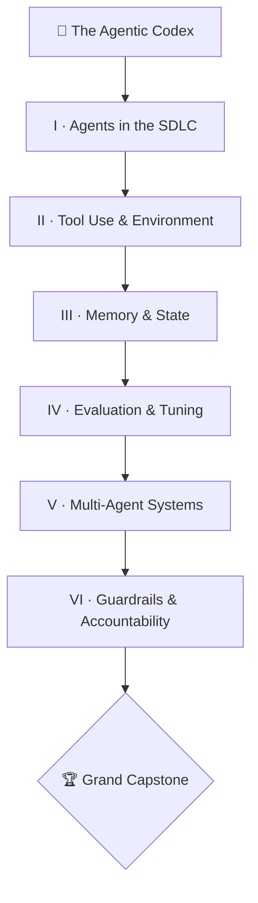

*Deep within the GitHub Citadel, an ancient order guards the **Agentic Codex** — a tome describing how autonomous agents are summoned, armed, remembered, judged, marshaled, and bound within the Software Development Life Cycle. Most who open it see only spells. You will see the discipline underneath: an agent is not a wish granted, it is a system designed — with inputs, outputs, tools, memory, evaluation, and a human who holds the final seal.*

*This campaign is the GitHub-native road to the **[GH-600 certification](https://learn.microsoft.com/en-us/credentials/certifications/resources/study-guides/gh-600)** — *Developing in Agentic AI Systems*. Six chapters map one-to-one to the six exam domains. Every concept is forged with tools you can actually run: the **Copilot coding agent**, **MCP servers**, **GitHub Actions**, **GitHub Environments**, and the **GitHub Models API**. You do not memorize the Codex. You build it, page by page, and the title of **Agentic Architect** is earned in the forge — not given.*

## 📖 The Legend Behind This Quest

*An autonomous agent is a familiar you send into the world to act on your behalf. Summon one carelessly and it wanders — calling the same tool forever, forgetting yesterday's decision, deleting what it should have spared. Summon one with discipline and it plans before it acts, reaches only for the tools you sanctioned, remembers exactly what it must, proves its own work, coordinates with its kin, and brings every irreversible choice back to you for the final seal.*

The GH-600 exam tests precisely that discipline across six domains. The Agentic Codex is the order's curriculum: not a survey of buzzwords, but a build-it path where each chapter leaves you with a working artifact and a verifiable skill. The deepest lesson of the whole campaign is the one the **Warden Pact** (Chapter VI) makes explicit — **autonomy that proposes, a human that disposes**. Master that and you have mastered the Codex.

## 🎯 Quest Objectives

By the end of this campaign you will have built, evaluated, and governed real agents covering all six GH-600 domains:

### Primary Objectives (Required for Campaign Completion)
- [ ] **D1 — Agents in the SDLC** — embed an agent in the lifecycle with defined inputs, outputs, and success criteria, and separate planning from execution
- [ ] **D2 — Tool Use & Environment** — select and scope tools, configure an MCP server, and operate the agent with safe execution and error handling
- [ ] **D3 — Memory, State & Execution** — choose between short-term, long-term, and external memory, persist state as durable artifacts, and detect context drift
- [ ] **D4 — Evaluation & Tuning** — define machine-verifiable success signals, run root-cause analysis on failures, and tune behavior from the evidence
- [ ] **D5 — Multi-Agent Coordination** — apply an orchestration pattern, make multi-agent runs observable, and recover from partial or stalled failures
- [ ] **D6 — Guardrails & Accountability** — classify actions by risk, assign autonomy levels, and enforce least-privilege human-in-the-loop gates

### Mastery Indicators
You will know you have mastered the Codex when you can:
- [ ] Map any agentic task to the six domains and name the GH-600 sub-skill it exercises
- [ ] Write a least-privilege `permissions:` block and an MCP allow-list from memory
- [ ] Diagnose a failing agent from logs/traces and classify the root cause (reasoning vs tool vs environment)
- [ ] Defend the Warden Pact: an irreversible or compliance-sensitive action never ships without explicit authorization

## 🗺️ Quest Metadata

| Field | Value |
|---|---|
| **Type** | `epic_quest` — a multi-session GH-600 campaign |
| **Tier** | ⚡ Master `1100` capstone — chapters span ⚔️ Adventurer → ⚡ Master |
| **Total XP** | +200 for the hub, ~600 XP across the six chapters and the Grand Capstone |
| **Primary classes** | 🤖 AI Engineer · 💻 Software Developer · 🛡️ Security Specialist |
| **Exam** | [GH-600: Developing in Agentic AI Systems](https://learn.microsoft.com/en-us/credentials/certifications/resources/study-guides/gh-600) — **6 domains**, **70% passing** (700/1000), annual free renewal |
| **Stack** | GitHub Copilot coding agent · MCP · GitHub Actions · GitHub Environments · GitHub Models API |
| **Capstone** | [Trial of the Agentic Codex: The Grand Capstone](/quests/1100/agentic-codex-capstone-exam-trial/) — all six domains in one system |

## 📜 The Campaign — Six Chapters

The six chapters map one-to-one to the six GH-600 exam domains, with the same weights the exam uses. Play them in order; each unlocks the next, and the Grand Capstone gates behind all six.

| # | Chapter | Level | Domain (weight) | Difficulty |
|---|---|---|---|---|
| I | [Initiation Rites: Agents in the SDLC](/quests/0111/agentic-codex-01-agents-in-the-sdlc/) | `0111` | D1 · Agentic AI in the SDLC (18%) | 🟡 Medium |
| II | [Forging the Arsenal: Tool Use & Environment](/quests/1000/agentic-codex-02-tool-use-and-environment/) | `1000` | D2 · Tools & Environment (18%) | 🔴 Hard |
| III | [Vaults of Recollection: Memory & State](/quests/1001/agentic-codex-03-memory-state-and-execution/) | `1001` | D3 · Memory, State & Execution (19%) | 🔴 Hard |
| IV | [The Oracle Rubric: Evaluation & Tuning](/quests/1010/agentic-codex-04-evaluation-and-tuning/) | `1010` | D4 · Evaluation & Tuning (19%) | 🔴 Hard |
| V | [The Council of Many: Multi-Agent Systems](/quests/1011/agentic-codex-05-multi-agent-coordination/) | `1011` | D5 · Multi-Agent Coordination (17%) | 🔴 Hard |
| VI | [The Warden Pact: Guardrails & Accountability](/quests/1100/agentic-codex-06-guardrails-and-accountability/) | `1100` | D6 · Guardrails & Accountability (9%) | 🔴 Hard |

> 🏆 **Capstone gate.** The [Grand Capstone](/quests/1100/agentic-codex-capstone-exam-trial/) stands beyond Chapter VI. You cannot face the Trial of the Agentic Codex until all six domain seals are broken — it integrates every domain into a single working multi-agent system with observability, evaluation, and governance in place.

## 🌍 Choose Your Adventure Platform

*This campaign builds GitHub-hosted agents, so your battleground is a GitHub repository plus an editor running Copilot. The agents stay gated behind the same least-privilege discipline the exam tests: scoped tokens, allow-lists, and `*_ENABLED` switches that you opt into deliberately.*

### 🛠️ Arm the forge (any OS)

```bash
# 1. Authenticate the GitHub CLI and confirm Copilot is available to you
gh auth login
gh copilot --version   # Copilot CLI; the coding agent runs in Actions and the web UI

# 2. Create the working repo for the campaign and scope a least-privilege token
gh repo create agentic-codex --private --clone
gh secret set MODELS_TOKEN --repo <you>/agentic-codex   # for the GitHub Models API

# 3. Flip a kill switch only when you want an autonomous workflow to run
gh variable set AGENT_ENABLED --body true --repo <you>/agentic-codex
```

Each chapter adds its own apparatus — an MCP server config, a `permissions:` block, an Environment with a required reviewer. The rule never changes: **an agent reaches only for tools you sanctioned, and the most dangerous actions wait for a human.**

## 🧙‍♂️ Domain Primer: The Six Disciplines of the Codex

### ⚔️ Skills You'll Forge

- Naming what each GH-600 domain actually tests, and the GitHub-native tool that proves it
- Recognizing the three exam question archetypes so the content maps to how you'll be tested
- Reading the domain weights so you spend study time where the points are

The GH-600 is not a trivia exam — it tests whether you can *design* an agentic system end to end. Six domains carve that ability into testable pieces. Here is the whole Codex in one breath, with the tool you'll wield in each chapter:

| Domain | What it tests | Forged with |
|---|---|---|
| **D1 · SDLC** | Where agents fit the lifecycle; plan-vs-act boundaries; observability | Copilot coding agent, structured plan artifacts |
| **D2 · Tools & Env** | Tool selection and scoping; MCP servers; safe execution and retries | MCP, scoped `permissions:`, GitHub Actions |
| **D3 · Memory & State** | Short/long/external memory; durable state; drift detection | Repo artifacts, issue/PR state, external stores |
| **D4 · Evaluation** | Machine-verifiable success signals; root-cause analysis; tuning | GitHub Models API, CI checks, logs and traces |
| **D5 · Multi-Agent** | Orchestration patterns; observability; failure recovery | Actions matrix/fan-out, correlation IDs |
| **D6 · Guardrails** | Autonomy levels; least-privilege; human-in-the-loop | Environments, required reviewers, audit trails |

Three question archetypes recur across all six domains — keep them in view as you study each chapter:

- **Scenario → Diagnosis** — a misbehaving agent is described; you identify the root cause ("an agent repeatedly requests the same endpoint — why?").
- **Config Selection** — choose the YAML/config that satisfies a stated constraint ("which `permissions:` block grants least privilege to open a PR?").
- **Best Practice** — pick the most appropriate design decision from four plausible options ("which guardrail preserves velocity while preventing irreversible deletes?").

The very first thing every chapter does is give the agent a contract — inputs, outputs, and success criteria — before it is allowed to act. Here is that contract as the kind of structured plan artifact Domain 1 expects an agent to emit *before* execution:

```json
{
  "task": "Add a failing-test reproduction for issue #42",
  "inputs": ["issue #42 body", "repository at HEAD"],
  "tools_allowed": ["read_files", "run_tests", "open_pull_request"],
  "success_criteria": [
    "A new test reproduces the bug and fails on main",
    "No existing test is modified",
    "A PR is opened, not merged"
  ],
  "stop_conditions": ["plan rejected by reviewer", "more than 3 tool errors"]
}
```

That JSON is the seed of the whole Codex: a plan the agent (and a human) can inspect *before* anything irreversible happens. Domain by domain, the campaign teaches you to arm, remember, judge, coordinate, and govern around exactly this contract.

### 🔍 Knowledge Check

- [ ] Which two domains carry the most weight, and what does each one test?
- [ ] What distinguishes a "structured plan artifact" from the agent's execution?
- [ ] Match each question archetype to the kind of answer it expects (a diagnosis, a config, or a design choice).

## 🧙‍♂️ The GitHub-Native Toolchain You'll Master

### ⚔️ Skills You'll Forge

- Invoking the **Copilot coding agent** to act autonomously on an issue and open a PR
- Wiring an **MCP server** so the agent gains a scoped, declared tool surface
- Running an agent step inside **GitHub Actions** behind a least-privilege token and an **Environment** gate
- Calling the **GitHub Models API** to generate the evaluation signals Domain 4 needs

Every chapter draws from the same GitHub-native toolchain. The **Copilot coding agent** is the familiar itself: assign it an issue and it plans, edits in a branch, and opens a pull request you review — it never merges its own work. The **Model Context Protocol (MCP)** is how you *arm* that familiar: an MCP server declares a typed set of tools (read a file, query an API, search a registry), and an allow-list controls exactly which the agent may call. **GitHub Actions** is the arena where agents run on a schedule or trigger, and **Environments** add the human seal — a required reviewer who must approve before a deploy-class action proceeds.

Here is the shape of an Actions workflow that runs an agent step under least privilege and pauses for a human at an Environment gate. (Wrap any Actions YAML containing `${{ }}` in this site's `raw` escapes — omit them when you copy into your own `.github/workflows/`.)


```yaml
# .github/workflows/agent.yml — a gated, least-privilege agent run
name: Codex Agent
on:
  workflow_dispatch:
permissions:
  contents: write        # branch + commit
  pull-requests: write   # open a PR — but never merge
  # no admin, no deployments, no secrets scope: least privilege by omission
jobs:
  run-agent:
    if: ${{ vars.AGENT_ENABLED == 'true' }}   # the kill switch
    runs-on: ubuntu-latest
    environment: agent-review                  # required reviewer gates this job
    steps:
      - uses: actions/checkout@v4
      - name: Generate an evaluation signal via the Models API
        env:
          GITHUB_TOKEN: ${{ secrets.MODELS_TOKEN }}
        run: |
          curl -sS https://models.github.ai/inference/chat/completions \
            -H "Authorization: Bearer $GITHUB_TOKEN" \
            -H "Content-Type: application/json" \
            -d '{"model":"openai/gpt-4o-mini","messages":[
                 {"role":"user","content":"Rate this diff 1-5 for clarity."}]}'
```


Two disciplines in that file are tested on the exam directly: the `permissions:` block grants only `contents` and `pull-requests` write — least privilege by *omission* — and the `environment:` key forces a required reviewer to approve before the job runs. The `if: vars.AGENT_ENABLED` line is the kill switch: until you flip the variable, the agent idles. This is the Warden Pact in miniature, and you will deepen it in Chapter VI.

The MCP side of the toolchain looks like this — a declared server plus an allow-list so the agent's reach is auditable, not implicit:

```json
{
  "mcpServers": {
    "github": {
      "type": "http",
      "url": "https://api.githubcopilot.com/mcp/",
      "tools": ["get_issue", "list_pull_requests", "create_pull_request"]
    }
  }
}
```

The `tools` array *is* the allow-list: the agent can call `get_issue` and open a PR, but nothing else on that server. Scope it tighter than you think you need — Chapter II turns this into a habit.

### 🔍 Knowledge Check

- [ ] Why does the Copilot coding agent open a PR instead of committing to `main`?
- [ ] In the workflow above, which two lines enforce the human-in-the-loop gate and the kill switch?
- [ ] What is the purpose of the `tools` array in an MCP server config?

## ⚔️ The Quests of This Domain

The campaign is six chapters, each a playable quest that breaks one domain seal. Play them in order — every chapter unlocks the next, and the Capstone gates behind all six.

- **[Chapter I — Initiation Rites: Agents in the SDLC](/quests/0111/agentic-codex-01-agents-in-the-sdlc/)** — embed an agent in the lifecycle with defined inputs, outputs, and success criteria, and split planning from action (D1, 18%).
- **[Chapter II — Forging the Arsenal: Tool Use & Environment](/quests/1000/agentic-codex-02-tool-use-and-environment/)** — select and scope tools, stand up an MCP server, and operate the agent with safe execution and error handling (D2, 18%).
- **[Chapter III — Vaults of Recollection: Memory & State](/quests/1001/agentic-codex-03-memory-state-and-execution/)** — choose between the three memory tiers, persist state as durable artifacts, and detect context drift (D3, 19%).
- **[Chapter IV — The Oracle Rubric: Evaluation & Tuning](/quests/1010/agentic-codex-04-evaluation-and-tuning/)** — define machine-verifiable success signals, run root-cause analysis, and tune behavior from the evidence (D4, 19%).
- **[Chapter V — The Council of Many: Multi-Agent Systems](/quests/1011/agentic-codex-05-multi-agent-coordination/)** — apply an orchestration pattern, make multi-agent runs observable, and recover from partial failures (D5, 17%).
- **[Chapter VI — The Warden Pact: Guardrails & Accountability](/quests/1100/agentic-codex-06-guardrails-and-accountability/)** — classify actions by risk, assign autonomy levels, and enforce least-privilege human-in-the-loop gates (D6, 9%).
- **[🏆 The Grand Capstone — Trial of the Agentic Codex](/quests/1100/agentic-codex-capstone-exam-trial/)** — integrate all six domains into one working multi-agent system with observability, evaluation, and governance.

## 🎮 Mastery Challenge

**Objective:** Prove the Codex is yours — not as memorized lore, but as a working, governed system.

- [ ] You completed all six chapters in order and broke each domain seal
- [ ] You can produce, from a blank file, an MCP server config with a tools allow-list and a least-privilege `permissions:` block
- [ ] You passed the [Grand Capstone](/quests/1100/agentic-codex-capstone-exam-trial/) by deploying a multi-agent system with observability, evaluation, and a human-in-the-loop gate
- [ ] You can take the GH-600 [Skills Checklist](/notes/gh-600/skills-checklist/) and rate every one of the 19 sub-skills at confidence 4 or higher

## 🎁 Rewards & Progression

**🎖️ Capstone Badges**
- 👑 **GH-600 Agentic Architect** — you built and governed agents across all six domains
- 🏛️ **Codex Master** — you survived the Grand Capstone trial
- 🛡️ **Warden of Autonomy** — you enforced least-privilege human-in-the-loop on the most dangerous actions

**🛠️ Skills Unlocked**
- Designing bounded, observable agents in the SDLC · Tooling agents with MCP and scoped permissions · Orchestrating and governing multi-agent systems on GitHub

**📊 Progression Points**: +200 XP for the hub, ~600 XP across the six chapters and the Capstone

## 🗺️ Quest Network



## 📚 Study Apparatus

The conceptual companion to the chapters lives in the **GH-600 reference notes**. Read the note to understand *why*, then play the chapter to practice *how*.

**Core reference (in notes):**
- [GH-600 Study Hub](/notes/gh-600/) — the map: domains, weights, and the full quest line
- [Skills Checklist (printable)](/notes/gh-600/skills-checklist/) — all 19 sub-skills as checkboxes
- [Exam Overview & Logistics](/notes/gh-600/exam-overview/) — scoring, scheduling, renewal
- [Glossary](/notes/gh-600/glossary/) — agent, MCP, HITL, drift, autonomy, and more
- [MCP Quick Reference](/notes/gh-600/mcp-quickref/) — server config, registries, allow-list syntax

**Deeper study (in notes):**
- [Skills Measured — Full Breakdown](/notes/gh-600/skills-measured/) — every sub-skill, domain by domain
- [Week-by-Week Learning Path](/notes/gh-600/learning-path/) — a structured study schedule
- [Recommended Resources](/notes/gh-600/recommended-resources/) — Microsoft Learn paths and GitHub docs

## 🔮 Next Adventures

- 🎯 Begin the campaign: [Chapter I — Initiation Rites: Agents in the SDLC](/quests/0111/agentic-codex-01-agents-in-the-sdlc/)
- 🏆 Face the trial: [Trial of the Agentic Codex: The Grand Capstone](/quests/1100/agentic-codex-capstone-exam-trial/)
- 📜 Study the map: [GH-600 Study Hub](/notes/gh-600/)
- 🏰 Sibling campaign: [Epic Quest: The Self-Operating Website](/quests/codex/self-operating-website/) — apply the same governance discipline to a site that runs itself

## 📚 Resource Codex

- [GH-600 Study Guide (Microsoft Learn)](https://learn.microsoft.com/en-us/credentials/certifications/resources/study-guides/gh-600) — the official skills-measured source of truth
- [GitHub Copilot coding agent docs](https://docs.github.com/en/copilot/using-github-copilot/coding-agent) — invoking the agent, scopes, and the autonomous-PR pattern
- [Model Context Protocol specification](https://modelcontextprotocol.io/) — the MCP standard the exam tests
- [Extending Copilot with MCP (GitHub docs)](https://docs.github.com/en/copilot/customizing-copilot/extending-copilot-chat-with-mcp) — adding and allow-listing MCP servers
- [GitHub Actions documentation](https://docs.github.com/en/actions) — the engine every agent runs on
- [GitHub Models API](https://docs.github.com/en/github-models) — generating evaluation signals for Domain 4

## 🤝 Campaign Completion Checklist

- [ ] ✅ Completed all six chapters in order
- [ ] ✅ Broke every domain seal (D1 through D6)
- [ ] ✅ Earned the Warden of Autonomy and Codex Master badges
- [ ] ✅ Passed the Grand Capstone with a governed multi-agent system

## 🕸️ Knowledge Graph

*Structured wiki-links connect this quest to the IT-Journey knowledge graph. Open the [Obsidian Graph View](/notes/obsidian/graph/) to explore connections.*

**Overworld:** [[🏰 Overworld - Master Quest Map]]
**Study hub:** [[The Agentic Codex: GH-600 Study Hub]]
**Chapters:** [[Initiation Rites: Agents in the SDLC]] · [[Forging the Arsenal: Tool Use & Environment]] · [[Vaults of Recollection: Memory & State]] · [[The Oracle Rubric: Evaluation & Tuning]] · [[The Council of Many: Multi-Agent Systems]] · [[The Warden Pact: Guardrails & Accountability]]
**Capstone:** [[Trial of the Agentic Codex: The Grand Capstone]]
**Obsidian docs:** [[Obsidian Knowledge Graph and Wiki Links]]
