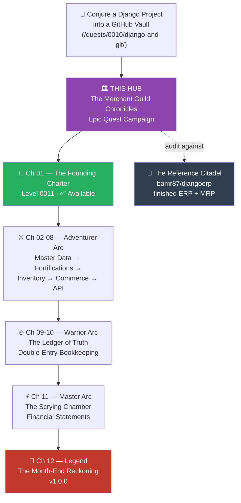
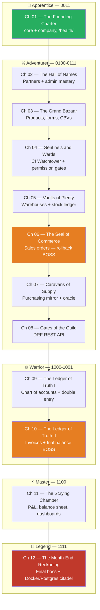
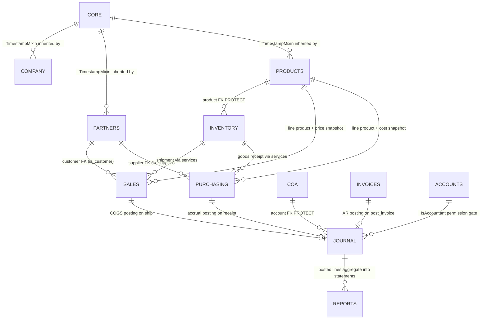

*The old Guildmaster is gone, and the ledgers died with him. You have inherited a merchant guild whose entire memory lives on scattered parchment — no roster of trading partners, no tally of the vaults, no book of accounts anyone dares trust. In the real world this is every small business drowning in spreadsheets, and the cure has a name: an ERP — an Enterprise Resource Planning system, one database of record for people, products, stock, orders, and money. As the guild's newly appointed Systems Archmage, you will forge that citadel yourself, in Django 6.1, one tested and git-tagged increment at a time — and when you falter, a finished citadel stands across the valley for you to study.*

## 📖 The Legend Behind This Quest

The Merchant Guild Chronicles is an **epic quest campaign**: twelve main quests that build one continuously working ERP system in Django. This hub page is your campaign codex — the world map, the chapter index, the architecture scrolls, and the boss-fight roster all live here.

**You build your own guild.** Every chapter is written for the repository *you* forged in the prerequisite quest. You write the models, you run the tests, you mint the tags. Nothing here is a clone-and-run tutorial.

**And a finished citadel stands as your reference.** [github.com/bamr87/djangoerp](https://github.com/bamr87/djangoerp) is a complete, working Django 6.1 ERP — the same domain, the same app names, the same architectural laws, carried further than the campaign goes. When a chapter's design decision seems arbitrary, you can open the reference and see how it was actually resolved in production-grade code. Think of it as the answer key you are *encouraged* to read, because reading real code is the skill this campaign is secretly training.

The story of the campaign is the story of every real ERP:

1. **First, the charter** — configuration hygiene, the shared platform (`core`), and the guild's identity record (`company`), because a citadel built on hardcoded secrets falls to the first siege.
2. **Then, the master data** — the hall of names (`partners`) and the grand bazaar catalog (`products`): who you trade with and what you trade.
3. **Then, the fortifications** — CI pipelines that test every push (the Watchtower) and role-based permission gates (the Wards, `accounts`), raised *before* the valuables arrive, so every later chapter is born guarded.
4. **Then, the flow of goods** — vaults and an append-only stock ledger (`inventory`), sales orders (`sales`), and their procurement mirror (`purchasing`), joined by atomic service transactions.
5. **Then, the gatehouse** — a REST API proving the architecture's seams are clean enough for allied guilds to trade through.
6. **Finally, the money** — the campaign's gravest arc: a chart of accounts (`coa`), a genuine **double-entry ledger** (`journal`) where every debit must meet its credit or the entry shall not pass, billing (`invoices`), financial statements conjured from the books (`reports`), and a month-end-close final boss followed by raising the citadel into production.

Every chapter ends the same ritual: **tests green, commit, git tag**. Your tag list — from `v0.1.0-founding-charter` to `v1.0.0` — *is* your adventure log, and it lives in your repository, not anyone else's.

This campaign begins exactly where the prerequisite quest — [Conjure a Django Project into a GitHub Vault](/quests/0010/django-and-git/) — ends: a scaffolded Django project in a GitHub repository. Nothing from that quest is repeated here.

## 🗺️ Your Quest Network Position



You stand at the campaign gate. The prerequisite quest forged your scaffold; this hub unlocks all twelve chapters; the chapters must be walked in order, for each builds — without rewrites — upon the tagged milestone of the last.

## 🎯 Quest Objectives

By the end of this hub quest you will hold the campaign's whole shape in your head, and you will have booted the reference citadel on your own machine.

### Primary Objectives

- [ ] **Read the world map** — know the five tiers, the twelve chapters, and why the arc is ordered the way it is
- [ ] **Read the chapter index** — know each chapter's level, difficulty, XP, badge, and git tag, and which milestone it delivers
- [ ] **Learn the architecture** — name every app in the citadel and the direction its dependencies point
- [ ] **Boot the reference citadel** — clone `djangoerp`, run its test suite, and watch `demo_erp` close the books to the cent

### Secondary Objectives

- [ ] **Memorize the three boss fights** — the integration seams where the campaign's difficulty actually lives
- [ ] **Understand the no-rewrite guarantee** — the four design laws that let chapter 12 build on chapter 01 without ever going back
- [ ] **Set up your own chronicle** — confirm your repository from the prerequisite quest is ready to receive Chapter 01

### Mastery Objectives

- [ ] You can explain the difference between master data, documents, and derived values — and give an example of each from the citadel
- [ ] You can argue *for* the reference's choice to cache stock levels while keeping the move ledger authoritative
- [ ] You can locate any concept in the reference codebase from its name alone

## 🗺️ Quest Prerequisites

Before entering the campaign, confirm:

- [ ] Completed [Conjure a Django Project into a GitHub Vault](/quests/0010/django-and-git/) — you own a scaffolded Django repository with a virtual environment and a GitHub remote
- [ ] Python 3.12 or newer on your PATH — Django 6 dropped support for 3.11
- [ ] Git configured with your name and email, and you can push to your own repository
- [ ] You can read Python classes and functions without a reference open

## 🌍 Choose Your Adventure Platform

### 🍎 macOS

```bash
# Awaken the environment (zsh/bash)
python3.12 -m venv .venv
source .venv/bin/activate
python --version    # expect 3.12 or newer
```

### 🪟 Windows

```powershell
# Awaken the environment (PowerShell)
py -3.12 -m venv .venv
.venv\Scripts\Activate.ps1
python --version    # expect 3.12 or newer
```

### 🐧 Linux

```bash
# Awaken the environment
python3.12 -m venv .venv
source .venv/bin/activate
python --version    # expect 3.12 or newer
```

Debian/Ubuntu realms may need `sudo apt install python3-venv python3-pip` first. Everything else in the campaign — `manage.py` commands, tests, git tags — is identical across platforms.

## 🧙‍♂️ Chapter 1: The World Map — Twelve Chapters, Five Tiers

The campaign ascends five tiers, and the binary levels climb steadily with it — never descending, holding a level across sibling chapters where the theme demands it: `0011 → 0100 → 0100 → 0101 → 0110 → 0110 → 0110 → 0111 → 1000 → 1001 → 1100 → 1111`. In it-journey terms, each level is a 4-bit rank — the campaign carries you from early Apprentice work to the `1111` Legend capstone.



**How to read the map** — the arc is deliberate:

- **Chapters 01-02 are easy quick wins**: a landing page with a JSON heartbeat, then a full CRUD registry powered almost entirely by the Django admin. You taste victory fast.
- **Chapter 04 is the structural bet**: the CI Watchtower (GitHub Actions + coverage) and the Wards (roles + permission classes) rise *before* the vaults open, so chapters 05-12 write permission-aware, CI-verified code from birth — no late security retrofit.
- **Chapter 07 is a deliberate breather**: purchasing mirrors sales at lower cost, consolidating the document pattern right after the first boss.
- **Chapters 09-10 are the intellectual core**: a genuine double-entry bookkeeping engine, where "debits equal credits" is enforced in code and then automated.
- **Deployment waits until Chapter 12 by design**: you deploy a system worth deploying, with no mid-campaign hosting friction — CI has guarded you since Chapter 04.

### 🔍 Knowledge Check

- [ ] Which chapter fuses CI and permissions into one fortification, and why does it come before inventory?
- [ ] Which two chapters form the double-entry accounting arc?
- [ ] Why is Chapter 07 intentionally easier than Chapter 06?
- [ ] What binary level does the capstone land on, and what tier is that?

**⚡ Quick Win**: Sketch the five tiers on paper and write each chapter number under its tier from memory. If you can do it after one read, the map is yours.

## 🧙‍♂️ Chapter 2: The Chapter Index — Your Campaign Ledger

Every row below is one main quest. XP across the twelve chapters totals **690**, and this hub grants **200**, for a campaign total of **890 progression points**. The git tag column is the tag *you* mint in *your* repository when the chapter's tests go green.

| NN | Title | Level | Difficulty | Time | XP | Badge | Your Git Tag | Builds |
|----|-------|-------|------------|------|----|-------|--------------|--------|
| 01 | The Founding Charter — Settings Hygiene, the Core App & the Guild's First Seal | 0011 | 🟢 Easy | 45-60 min | 50 | 📜 Charter Bearer | `v0.1.0-founding-charter` | `core` + `company` |
| 02 | The Hall of Names — Partner Master Data & Admin Mastery | 0100 | 🟢 Easy | 40-45 min | 50 | 🤝 Keeper of Names | `v0.2.0-hall-of-names` | `partners` |
| 03 | The Grand Bazaar — Product Catalog, Forms & Protected Relations | 0100 | 🟡 Medium | 90-120 min | 55 | 🏺 Catalog Curator | `v0.3.0-grand-bazaar` | `products` |
| 04 | Sentinels and Wards — The CI Watchtower, Test Forges & the Gates of Permission | 0101 | 🔴 Hard | 2-3 hours | 60 | 🛡️ Warden of Gates and Watchtowers | `v0.4.0-sentinels-and-wards` | `accounts` + CI |
| 05 | Vaults of Plenty — Warehouses & the River of Stock Moves | 0110 | 🔴 Hard | 2-3 hours | 60 | 🏰 Vault Warden | `v0.5.0-vaults` | `inventory` |
| 06 | The Seal of Commerce — Sales Orders & the Order-to-Stock Boss Fight | 0110 | 🔴 Hard | 2-4 hours | 60 | ⚖️ Bearer of the Seal | `v0.6.0-seal-of-commerce` | `sales` |
| 07 | Caravans of Supply — Purchase Orders, Goods Receipt & the Replenishment Oracle | 0110 | 🟡 Medium | 90-120 min | 55 | 🐫 Caravan Master | `v0.7.0-caravans` | `purchasing` |
| 08 | Gates of the Guild — The REST API Gatehouse (Django REST Framework) | 0111 | 🔴 Hard | 2-3 hours | 60 | 🗝️ Gatekeeper of the API | `v0.8.0-gatehouse` | DRF across apps |
| 09 | The Ledger of Truth I — Chart of Accounts & the Law of Double-Entry | 1000 | 🔴 Hard | 2-4 hours | 60 | 📖 Initiate of the Ledger | `v0.9.0-ledger` | `coa` + `journal` |
| 10 | The Ledger of Truth II — Invoices, Auto-Posting & the Trial Balance Boss | 1001 | 🔴 Hard | 2-4 hours | 60 | ⚗️ Master of Balances | `v0.10.0-trial-balance` | `invoices` |
| 11 | The Scrying Chamber — P&L, Balance Sheet & the Mirrors of Aggregation | 1100 | 🔴 Hard | 2-3 hours | 60 | 🔮 Scrymaster of Reports | `v0.11.0-scrying` | `reports` |
| 12 | The Month-End Reckoning — Full-Cycle Boss Fight & Raising the Citadel | 1111 | ⚔️ Epic | 4-6 hours | 60 | 👑 Guildmaster of the Eternal Ledger | `v1.0.0` | the whole cycle |

Chapter permalinks follow one pattern — level then slug:

```text
/quests/0011/django-merchant-guild-01-founding-charter/
/quests/0100/django-merchant-guild-02-hall-of-names/
/quests/0100/django-merchant-guild-03-grand-bazaar/
/quests/0101/django-merchant-guild-04-sentinels-and-wards/
/quests/0110/django-merchant-guild-05-vaults-of-plenty/
/quests/0110/django-merchant-guild-06-seal-of-commerce/
/quests/0110/django-merchant-guild-07-caravans-of-supply/
/quests/0111/django-merchant-guild-08-gates-of-the-guild/
/quests/1000/django-merchant-guild-09-ledger-of-truth/
/quests/1001/django-merchant-guild-10-trial-balance/
/quests/1100/django-merchant-guild-11-scrying-chamber/
/quests/1111/django-merchant-guild-12-month-end-reckoning/
```

Chapter 01 is published and ready. Chapters 02-12 are in the forge — their permalinks above are reserved, and the reference citadel already contains a working implementation of every one of them, so you are never blocked waiting for prose.

### 🔍 Knowledge Check

- [ ] How many total progression points does the full campaign award, hub included?
- [ ] Which chapter carries the `⚔️ Epic` difficulty, and what version does its tag mint?
- [ ] Which two chapters are rated 🟢 Easy, and why does the campaign open with them?

**⚡ Quick Win**: Add the twelve chapter titles to your personal quest log (a `CAMPAIGN.md`, a notes app, anything) with checkboxes. Ticking Chapter 01 is your first streak.

## 🧙‍♂️ Chapter 3: Architecture of the Citadel

The campaign builds **twelve Django apps**. The reference citadel carries two more — `manufacturing` and `mrp` — past where the campaign ends, so you can see where the road leads.



The blueprint, app by app (chapter of introduction in parentheses):

- **core (01)** — The shared platform, deliberately infrastructure-only: the abstract `TimestampMixin` every later model inherits, `DocumentSequence` for atomic document numbering (`SO-00001`, `JE-00001`), the audit-trail writer, and the demo builder. No business models live here.
- **company (01)** — The guild's identity: the `Company` record (name, legal name, base currency), the landing page, and the `/health/` JSON endpoint that CI smoke tests (ch04) and the Docker healthcheck (ch12) reuse.
- **partners (02)** — The hall of names: one `BusinessPartner` table with `is_customer`/`is_supplier` role flags (the Odoo `res.partner` pattern), so sales and purchasing later point at the *same* table — no Customer/Vendor split to painfully merge later. Each partner carries its own AR and AP control accounts.
- **products (03)** — The grand bazaar: `UnitOfMeasure`, `ProductCategory` (which maps inventory, revenue, and COGS accounts), and `Product` with cost and price fields that order lines snapshot from, plus reorder parameters present from day one so chapters 07 and 11 need no schema change.
- **accounts (04)** — The wards: `UserRole` (admin/accountant/viewer/auditor), an `AuditLog`, JWT login, and the shared permission classes every later viewset reuses.
- **inventory (05)** — Vaults of plenty: `Warehouse` and an append-only `StockMove` ledger. Only `done` moves count. `StockLevel` caches on-hand and moving-average cost, maintained under row locks and fully reconstructible from the ledger — the ledger is the truth, the cache is an optimization.
- **sales (06)** — Order-to-cash: `SalesOrder` + `SalesOrderLine`, a status state machine, and `ship_sales_order()` issuing stock inside one transaction. Line prices snapshot the catalog: *documents are history, master data is now.*
- **purchasing (07)** — Procure-to-pay mirror: `PurchaseOrder` + lines, goods receipt posting Dr Inventory / Cr supplier payable, and the replenishment oracle.
- **The gatehouse (08)** — Not an app of its own: every app exposes its own DRF `DefaultRouter` from its own `urls.py`, mounted under `/api/<area>/`. Serializers hold the business validation; state transitions are `@action` endpoints delegating to `services.py`. Proving each app can stand behind its own router is the real lesson.
- **coa (09)** — The chart of accounts: `AccountType` and a self-referencing `Account` tree whose ancestors are cycle-checked on save.
- **journal (09-10)** — The Ledger of Truth: `JournalEntry` + `JournalLine`. Balance is enforced by the serializer and by `post_entry()`, the single programmatic write path — it quantizes to the cent, claims a number from the sequence, and is idempotent per source event. Posted entries are immutable; corrections are reversing entries, never edits.
- **invoices (10)** — Billing: `Invoice`, `InvoiceLineItem`, and `Payment`, each with a posting service that turns a business document into a balanced journal entry.
- **reports (11)** — The scrying chamber: `ReportTemplate` + `SavedReport` and the report math — trial balance, balance sheet, income statement — all filtering on posted entries only, and all generated asynchronously.

Beyond the campaign, the reference citadel also carries **manufacturing** (bills of materials and work orders that backflush components at rolled-up cost) and **mrp** (a planning engine that nets demand against supply and emits pegged planned orders). They are yours to read when the twelve chapters are behind you.

Four architectural laws hold the citadel together — and constitute the **no-rewrite guarantee**:

```python
# Law 1 — Cross-app calls go through service functions, never direct model surgery.
#   sales.services.ship_sales_order() -> inventory.services.complete_move()
#   invoices.services.post_invoice()  -> journal.services.post_entry()
# Law 2 — The ledger is authoritative; caches are derived and rebuildable.
#   StockLevel is a cache of done StockMove rows -> rebuild_stock_levels()
#   account balances aggregate posted JournalLine rows, never a stored total
# Law 3 — Documents snapshot master data at write time.
#   SalesOrderLine.unit_price copies the product's price when the line is added
# Law 4 — Account mappings are explicit, never guessed.
#   posting resolves accounts from ProductCategory / BusinessPartner / Payment
#   and raises a configuration error when one is missing
```

### 🔍 Knowledge Check

- [ ] Why does the REST API get a chapter but not an app of its own?
- [ ] Why does a single `BusinessPartner` table with role flags prevent a future rewrite?
- [ ] What invariant does `post_entry()` enforce, and what makes it safe to call twice for one business event?
- [ ] If `StockLevel` is a cache, what is the authoritative source of on-hand quantity?

**⚡ Quick Win**: Open `core/models.py` in the reference citadel and find `TimestampMixin`. That one abstract class silently timestamps every model in the entire system.

## 🧙‍♂️ Chapter 4: The Boss-Fight Roster

Bosses guard the campaign's **integration seams** — the places where two subsystems must agree or the whole guild's truth collapses. Each boss is defeated not by vibes but by a specific automated test turning green.

### 🐉 Boss 1 — The Order-to-Stock Wyrm (Chapter 06)

**Lair**: the seam between sales and inventory. **Mechanic**: shipping an order must issue stock for *every* line inside one `transaction.atomic` block — and if any single line lacks stock, *nothing* may change: no moves completed, status untouched.

```python
# The killing blow — a rollback test (concept sketch from Chapter 06):
# stock only 1 of the order's 2 lines, then attempt to ship
with self.assertRaises(InsufficientStockError):
    ship_sales_order(order)
self.assertEqual(StockMove.objects.filter(status='done').count(), moves_before)
order.refresh_from_db()
self.assertEqual(order.status, "confirmed")  # status unchanged — rollback proven
```

Victory teaches the single most important lesson in transactional systems: **partial success is worse than clean failure**.

### 🐉 Boss 2 — The Unbalanced Specter (Chapter 10)

**Lair**: the seam between commerce and accounting. **Mechanic**: shipping and invoicing a sale, or receiving and paying a bill, must auto-post balanced journal entries — and after full buy *and* sell cycles, the trial balance's grand debit/credit difference must equal exactly `Decimal('0.00')`.

```python
# The killing blow — the trial balance nets to zero after full cycles:
# PO -> receive -> bill -> pay, then SO -> ship -> invoice -> pay
report = generate_trial_balance(as_of=today)
self.assertTrue(report['balanced'])
self.assertEqual(report['total_debits'] - report['total_credits'], Decimal("0.00"))
```

Victory means the guild's books are mathematically incapable of lying — the heart of double-entry bookkeeping, enforced by your own code.

### 🐲 Final Boss — The Month-End Reckoning (Chapter 12)

**Lair**: every app at once. **Mechanic**: a story-driven epic test suite marches three role personas through a simulated trading month — the Clerk trades, the Steward moves stock, the Accountant posts — receiving purchase orders, paying bills, shipping and invoicing sales orders, collecting payments. Then the suite asserts, in one breath: trial balance balanced, balance sheet footing, P&L net profit equal to a hand-computed figure, stock on hand matching the move ledger — with each persona *blocked* from the others' rites by the chapter-04 wards.

The reference citadel ships exactly this fight, already won, as `core/tests.py::EndToEndERPFlowTests` and the `demo_erp` management command. When your own version goes green, compare the two.

Phase two is the victory lap: raise the citadel with Docker, Postgres, gunicorn, and WhiteNoise, pass `manage.py check --deploy` clean, and mint the `v1.0.0` tag. The crown of **Guildmaster of the Eternal Ledger** awaits.

### 🔍 Knowledge Check

- [ ] What must be true about `StockMove` rows after a failed shipment for Boss 1 to fall?
- [ ] What exact `Decimal` value defeats Boss 2, and which report produces it?
- [ ] Name the three personas of the final boss and each one's domain.

**⚡ Quick Win**: Write the three boss conditions as one-line assertions in your quest log. If you can state a boss's win condition as an assertion, you already half-understand the chapter that builds it.

## 🧙‍♂️ Chapter 5: The Reference Citadel — How to Use the Finished ERP

Across the valley from your construction site stands [github.com/bamr87/djangoerp](https://github.com/bamr87/djangoerp): a complete, tested Django 6.1 ERP with a double-entry core, a stock ledger, order-to-cash and procure-to-pay flows, manufacturing, and an MRP planner. It is not the repository you build in — it is the one you *consult*.

```bash
# Raise the reference citadel beside your own work
git clone https://github.com/bamr87/djangoerp.git
cd djangoerp

python3.12 -m venv .venv && source .venv/bin/activate
pip install -r requirements.txt
cp .env.example .env

python manage.py migrate     # migrations are committed; the chart of accounts seeds itself
python manage.py test        # the whole citadel, green
```

Then watch the entire ERP loop run in one command:

```bash
python manage.py demo_erp
```

It builds a demo company, then drives a sales order through MRP planning, purchasing, manufacturing, shipping, invoicing, and collection — printing the stock position and the three financial statements at the end, and **exiting non-zero if the books do not balance**. Reading its output is the fastest way to understand what you are about to spend twelve chapters building.

**How to consult it well**, chapter by chapter:

- **Before a chapter** — skim the corresponding app in the reference to see the shape of the destination. Don't copy; just look at the map.
- **When stuck** — open the app's `models.py`, then its `services.py`. The reference keeps every state transition in `services.py`, so the answer to "where does this actually happen?" is almost always there.
- **After a chapter** — diff your design against the reference's and write down one thing it does that you didn't, and one thing you'd defend doing differently. That second list is where you stop being a student.
- **Two files worth reading early** — `docs/ARCHITECTURE.md` (module map, invariants, GL posting matrix, MRP algorithm) and `CLAUDE.md` (the domain rules that must not be broken, written as hard constraints).

**Your own chronicle** is a different repository — the one from the prerequisite quest. Every chapter ends with the same sealing ritual:

```bash
# Sealing your own chapter, every time, the same ritual:
python manage.py test                         # all green, or the seal is refused
git add -A && git commit -m "ch02: hall of names — partner registry"
git tag v0.2.0-hall-of-names                  # mint the save point
git push origin HEAD --tags                   # the chronicle ascends to the vault
```

Two practical decrees:

- **Secrets never enter the chronicle.** Your `.env` (holding `SECRET_KEY`, `DEBUG`, `ALLOWED_HOSTS`) is git-ignored; `.env.example` documents the shape. Verify with `git check-ignore .env` — Chapter 01 drills this.
- **The tag is the truth.** If your build drifts or breaks mid-chapter, `git checkout <previous-tag>` restores a known-good world in seconds. This is why every chapter's definition of done includes the tag.

### 🔍 Knowledge Check

- [ ] What single command proves the reference citadel's books balance end to end?
- [ ] Which file in the reference holds the domain rules stated as hard constraints?
- [ ] Why is `.env` absent from both repositories while `.env.example` is committed?
- [ ] Where in a reference app would you look first to find where a status change happens?

**⚡ Quick Win**: Clone the reference, run `python manage.py demo_erp`, and read the last five lines. You have just watched a trial balance, a balance sheet, and an income statement agree with each other — the campaign's whole destination in one screen.

## 🎮 Mastery Challenges

### 🟢 Novice Challenge — The Cartographer

Without rereading this page, draw the campaign from memory: five tiers, twelve chapter titles (paraphrased is fine), and arrows marking the three boss chapters. Then check your map against the world map above and note what you missed.

### 🟡 Intermediate Challenge — The Guild Auditor

Boot the reference citadel and audit it against its own claims: run the test suite, run `demo_erp` and confirm it reports `balanced=True`, hit `/health/` with `curl` and verify the JSON contract (`status`, `app`, `version`, `debug`), confirm `git check-ignore .env` succeeds, and inspect `core/models.py` to confirm `TimestampMixin` is abstract. Write a three-sentence audit verdict in your quest log.

### 🔴 Advanced Challenge — The Rival Architect

Argue *against* the campaign's architecture, then defeat your own argument: pick one design law (cached-but-rebuildable stock, single partner table, services-not-signals, deployment-last) and write a paragraph for the opposing design, then a paragraph explaining what rewrite the opposing design forces by Chapter 10. This is the systems-thinking muscle the whole campaign exists to build.

## 🏆 Quest Rewards & Achievements

Completing this hub quest — objectives checked, reference booted, challenges attempted — earns:

- **🏛️ Founder of the Guild** badge
- **200 progression points** (of the campaign's 890 total: 690 across the twelve chapters + 200 here)
- **🗺️ Campaign navigation** — you can read a multi-quest learning arc and locate yourself in it
- **🏗️ ERP systems thinking** — master data vs documents vs derived values vs books, and the seams between them
- **🔍 Reference reading** — the skill of learning from a finished codebase instead of only from prose
- **📜 Chronicle discipline** — the tests-commit-tag ritual that makes every milestone reproducible
- **Unlocked**: all twelve chapters of The Merchant Guild Chronicles

And upon finishing the entire campaign, the final chapter crowns you **👑 Guildmaster of the Eternal Ledger** — with a `v1.0.0`-tagged, Dockerized, Postgres-backed ERP whose books close to zero as your regalia.

## 🔮 Next Adventures

- **Begin the campaign now**: [Chapter 01 — The Founding Charter](/quests/0011/django-merchant-guild-01-founding-charter/) (✅ available, 45-60 minutes, 🟢 Easy)
- **Missing the prerequisite?** [Conjure a Django Project into a GitHub Vault](/quests/0010/django-and-git/) forges the scaffold this campaign builds upon
- **Chapters 02-12** unlock in sequence as they are published — their permalinks are listed in the Chapter Index above, and the reference citadel already implements every one of them
- **Beyond the campaign**: read `manufacturing/` and `mrp/` in the reference — bills of materials, work orders that backflush at rolled-up cost, and a planning engine that pegs supply to demand

## 📚 Resource Codex

Scrolls of official lore, for study between chapters:

- [Django documentation](https://docs.djangoproject.com/en/stable/) — the master grimoire for the entire campaign
- [Django models](https://docs.djangoproject.com/en/stable/topics/db/models/) and [database transactions](https://docs.djangoproject.com/en/stable/topics/db/transactions/) — the foundations of chapters 01-07
- [Django aggregation](https://docs.djangoproject.com/en/stable/topics/db/aggregation/) — the magic behind stock positions and account balances
- [Django testing](https://docs.djangoproject.com/en/stable/topics/testing/overview/) — every chapter's sealing ritual
- [Django auth: permissions and groups](https://docs.djangoproject.com/en/stable/topics/auth/default/) — the Wards of Chapter 04
- [Django deployment checklist](https://docs.djangoproject.com/en/stable/howto/deployment/checklist/) — raising the citadel in Chapter 12
- [Django REST Framework](https://www.django-rest-framework.org/) — the gatehouse of Chapter 08
- [django-environ](https://django-environ.readthedocs.io/en/latest/) and [The Twelve-Factor App](https://12factor.net/config) — settings hygiene from Chapter 01 onward
- [GitHub Actions documentation](https://docs.github.com/en/actions) — the CI Watchtower of Chapter 04
- [Git tagging](https://git-scm.com/book/en/v2/Git-Basics-Tagging) — the chronicle's save-point mechanism
- [Double-entry bookkeeping](https://en.wikipedia.org/wiki/Double-entry_bookkeeping) — the Law enforced by the Ledger of Truth
- [Reference citadel: github.com/bamr87/djangoerp](https://github.com/bamr87/djangoerp) — the finished ERP you audit your work against

## ✅ Quest Completion Checklist

- [ ] I can name the five tiers and place all twelve chapters within them
- [ ] I know each chapter's level, difficulty, XP, badge, and git tag from the Chapter Index
- [ ] I can explain each app's responsibility and the direction the dependencies point
- [ ] I can state all three boss-fight win conditions as testable assertions
- [ ] I can explain the no-rewrite guarantee: rebuildable caches, role-flag partners, price snapshots, service-layer seams, explicit account mappings
- [ ] I have cloned the reference citadel, run its tests, and watched `demo_erp` balance the books
- [ ] I have confirmed my own repository from the prerequisite quest is ready to receive Chapter 01
- [ ] I have verified `.env` is git-ignored and understand why secrets never enter the chronicle
- [ ] I have attempted at least one Mastery Challenge
- [ ] I am ready to march into [Chapter 01 — The Founding Charter](/quests/0011/django-merchant-guild-01-founding-charter/)

*The charter awaits your seal, Archmage. The guild remembers those who build.*
