*Welcome, ambitious architect, to the Digital Portfolio Fortress Epic Quest! This comprehensive adventure represents the culmination of your foundation and intermediate learning, challenging you to integrate multiple technologies and best practices into a single, professional-quality project.*

*Unlike shorter quests that focus on specific skills, this epic quest requires you to think like a professional developer, making architectural decisions, managing project complexity, and delivering a production-ready application that showcases your growing expertise.*

### 🗺️ Quest Network Position

```mermaid
graph TB
    subgraph "Required Foundation"
        HTML[🏰 HTML/CSS Fundamentals]
        JS[🏰 JavaScript Mastery]
        Backend[🏰 Backend Development]
        Database[🏰 Database Design]
        Git[🏰 Version Control]
    end
    
    subgraph "Epic Quest Journey"
        Design[⚔️ Portfolio Design]
        Responsive[⚔️ Responsive Design]
        API[⚔️ API Documentation]
        Epic[👑 Portfolio Fortress Epic]
        Perf[🎁 Performance Monitoring]
        SEO[🎁 SEO Optimization]
    end
    
    subgraph "Mastery Unlocked"
        Architecture[🏰 Advanced Architecture]
        Leadership[👑 Technical Leadership]
        Microservices[🏰 Microservices Design]
    end
    
    HTML --> Epic
    JS --> Epic
    Backend --> Epic
    Database --> Epic
    Git --> Epic
    Epic --> Design
    Epic --> Responsive
    Epic --> API
    Epic --> Perf
    Epic --> SEO
    Epic --> Architecture
    Epic --> Leadership
    Perf --> Leadership
    SEO --> Microservices
    
    style Epic fill:#9370db
    style Design fill:#ffd700
    style Responsive fill:#ffd700
    style API fill:#ffd700
    style Perf fill:#ff69b4
    style SEO fill:#ff69b4
```

**Epic Quest Scope Visualization**:

## 🎯 Epic Construction Objectives

### Phase 1: Architectural Vision and Planning (🕐 90-120 minutes)
- [ ] **Requirements Analysis** - Define portfolio goals and target audience
- [ ] **Technology Stack Selection** - Choose optimal technologies for your needs
- [ ] **System Architecture Design** - Plan component relationships and data flow
- [ ] **UI/UX Wireframing** - Design user experience and interface layouts

### Phase 2: Foundation Construction (🕐 120-180 minutes)
- [ ] **Frontend Framework Setup** - Implement responsive, accessible user interface
- [ ] **Backend API Development** - Create RESTful services for content management
- [ ] **Database Integration** - Design and implement data persistence layer
- [ ] **Authentication System** - Secure admin access and user management

### Phase 3: Feature Implementation (🕐 120-180 minutes)
- [ ] **Portfolio Content Management** - Dynamic content creation and editing
- [ ] **Project Showcase System** - Interactive project galleries and case studies
- [ ] **Contact and Communication** - Professional contact forms and social integration
- [ ] **Admin Dashboard** - Content management and analytics interface

### Phase 4: Quality Assurance and Security (🕐 90-120 minutes)
- [ ] **Comprehensive Testing** - Unit, integration, and end-to-end test coverage
- [ ] **Security Implementation** - Input validation, authentication, and data protection
- [ ] **Performance Optimization** - Load times, caching, and resource optimization
- [ ] **Accessibility Compliance** - WCAG guidelines and inclusive design

### Phase 5: Deployment and Production (🕐 60-90 minutes)
- [ ] **CI/CD Pipeline** - Automated testing and deployment workflows
- [ ] **Production Environment** - Scalable hosting with monitoring and backups
- [ ] **Domain and SSL** - Professional domain with secure connections
- [ ] **Analytics and Monitoring** - Performance tracking and error reporting

## 🎮 Epic Achievement Validation

### Portfolio-Worthy Deliverables
- [ ] **Live Production Website** - Fully functional portfolio accessible via custom domain
- [ ] **Source Code Repository** - Well-organized, documented codebase with clear README
- [ ] **Architecture Documentation** - Detailed explanation of design decisions and implementation
- [ ] **Deployment Guide** - Complete instructions for reproducing the deployment

### Professional Quality Standards
- [ ] **Code Organization** - Clean, maintainable code following industry best practices
- [ ] **Test Coverage** - Comprehensive testing with >80% code coverage
- [ ] **Security Implementation** - Production-ready security measures and best practices
- [ ] **Performance Metrics** - Fast loading times and optimized user experience
- [ ] **Accessibility Compliance** - Inclusive design meeting WCAG 2.1 AA standards

### Technical Mastery Demonstration
- [ ] **Full-Stack Integration** - Seamless frontend-backend communication
- [ ] **Database Design** - Efficient, scalable data architecture
- [ ] **API Development** - RESTful services with proper documentation
- [ ] **DevOps Practices** - Automated deployment and monitoring
- [ ] **Project Management** - Organized development process with clear milestones

## 🎁 Epic Quest Rewards and Achievements

### 🏆 Legendary Achievement Badges Earned
- **👑 Master Builder** - Epic project completion with professional quality
- **🏆 Full-Stack Architect** - Comprehensive development mastery demonstration
- **🌟 Portfolio Artisan** - Professional showcase creation and presentation
- **🚀 Production Engineer** - Live deployment and maintenance capabilities

### ⚡ Mastery-Level Skills Unlocked
- **🛠️ Advanced System Architecture** - Design and implement complex, scalable systems
- **🎯 Professional Project Delivery** - Complete project lifecycle management
- **🚀 Production Deployment Mastery** - Live system deployment and maintenance
- **💼 Career Advancement Tools** - Professional portfolio for job applications

### 📈 Epic Quest Impact on Your Journey
- **Foundation Skills**: Integrated all basic development concepts into cohesive project
- **Professional Readiness**: Created portfolio-quality work suitable for job applications
- **Advanced Capabilities**: Unlocked access to leadership and architecture quests
- **Community Recognition**: Demonstrated mastery-level competency to peers and mentors

## 🔮 Your Next Legendary Adventures

### 🎯 Epic Quest Sequels
- **Microservices Architecture Epic** - Break monolith into scalable services
- **Mobile Application Epic** - Extend portfolio with mobile app development
- **AI Integration Epic** - Enhance portfolio with machine learning features

### 🌐 Career Advancement Opportunities
- **Technical Leadership Quests** - Mentor other developers and lead projects
- **Open Source Contribution Epics** - Contribute to major open source projects
- **Industry Specialization Paths** - Deep dive into specific technology domains

## 📚 Epic Quest Resource Codex

### 📖 Comprehensive Documentation
- [Full-Stack Development Guide](https://fullstackopen.com/) - Complete learning resource
- [React Documentation](https://react.dev/) - Frontend framework mastery
- [Node.js Best Practices](https://github.com/goldbergyoni/nodebestpractices) - Backend excellence
- [Database Design Patterns](https://www.postgresql.org/docs/) - Data architecture guidance

### 🎥 Epic-Scale Learning Resources
- [Full-Stack Project Tutorials](https://www.youtube.com/playlist?list=epic-project-examples) - Complete project walkthroughs
- [Professional Portfolio Examples](https://www.awwwards.com/websites/portfolio/) - Design inspiration
- [Deployment and DevOps](https://www.youtube.com/channel/devops-tutorials) - Production deployment guides

### 💬 Professional Community and Mentorship
- [Full-Stack Developer Communities](https://reddit.com/r/webdev) - Professional development discussions
- [Portfolio Review Communities](https://dribbble.com/) - Design feedback and inspiration
- [Professional Networking](https://linkedin.com/groups/web-developers) - Career advancement opportunities

---

*Congratulations, legendary architect! You have undertaken one of the most challenging and rewarding adventures in the IT-Journey quest system. This epic quest represents not just technical mastery, but the integration of multiple skills into a cohesive, professional-quality deliverable.*

*Your Digital Portfolio Fortress stands as testament to your growth from novice to professional developer. This epic achievement unlocks the highest tier of IT-Journey quests and establishes your readiness for technical leadership, advanced specialization, and career advancement.*

*The knowledge, skills, and confidence gained through this epic quest will serve you throughout your entire IT career. You have proven your ability to manage complex projects, integrate multiple technologies, and deliver production-ready solutions.*

**Epic Quest Mastered: Digital Portfolio Fortress** 👑🏰 
*Your legend begins here - continue to even greater adventures!*
