*Welcome, terminal navigator, to the Oh-My-Zsh Terminal Enchantment side quest! Having mastered the fundamental arts of command-line navigation, you're now ready to transform your terminal from a simple tool into a powerful, visually enhanced development weapon.*

*This side quest builds directly upon your Terminal Navigation Mastery, adding themes, plugins, and productivity enhancements that will accelerate your development workflow and make your terminal experience both more efficient and more enjoyable.*

### 🗺️ Quest Network Position

```mermaid
graph LR
    Parent[🏰 Terminal Navigation Mastery] --> Current[⚔️ Oh-My-Zsh Enchantment]
    Fonts[⚔️ Nerd Font Enchantment] --> Current
    Current --> Advanced[🏰 Advanced Shell Scripting]
    Current --> Automation[🏰 Terminal Automation]
    
    style Current fill:#ffd700
    style Parent fill:#87ceeb
    style Fonts fill:#ffd700
    style Advanced fill:#98fb98
```



**Relationship to Parent Quest**:
This side quest enhances the Terminal Navigation Mastery main quest by adding:
- Visual improvements through themes and customization
- Productivity enhancements via intelligent plugins
- Workflow optimization for development tasks
- Foundation for advanced terminal automation

## 🎯 Quest Objectives

### Primary Objectives (Required for Side Quest Completion)
- [ ] **Framework Installation** - Install Oh-My-Zsh using secure methods
- [ ] **Theme Configuration** - Apply and customize visual themes
- [ ] **Plugin Integration** - Install essential productivity plugins
- [ ] **Workflow Enhancement** - Demonstrate improved development efficiency

### Secondary Objectives (Bonus Achievements)
- [ ] **Custom Configuration** - Create personalized .zshrc settings
- [ ] **Plugin Development** - Create or modify a custom plugin
- [ ] **Theme Customization** - Design personal theme variations

## 🧙‍♂️ Chapter 1: Framework Installation and Setup

*Begin your terminal transformation by installing the Oh-My-Zsh framework safely and securely.*

### 🏗️ Secure Installation Process

```bash
# Download and examine the installation script
wget https://raw.githubusercontent.com/ohmyzsh/ohmyzsh/master/tools/install.sh

# Review the script before execution (security best practice)
less install.sh

# Execute the installation
sh install.sh

# Verify successful installation
echo $ZSH
ls ~/.oh-my-zsh/
```

## 🧙‍♂️ Chapter 2: Theme Mastery and Visual Enhancement

*Transform your terminal's appearance with beautiful, functional themes.*

### 🏗️ Theme Configuration

```bash
# Explore available themes
ls ~/.oh-my-zsh/themes/

# Popular theme recommendations
ZSH_THEME="agnoster"        # Clean, informative
ZSH_THEME="powerlevel10k"   # Highly customizable
ZSH_THEME="spaceship"       # Minimal and fast

# Apply theme by editing .zshrc
code ~/.zshrc  # Or use nano/vim
source ~/.zshrc  # Reload configuration
```

## 🧙‍♂️ Chapter 3: Plugin Integration and Productivity Enhancement

*Unlock powerful terminal capabilities through strategic plugin integration.*

### 🏗️ Essential Plugin Setup

```bash
# Edit .zshrc to add plugins
plugins=(
    git
    docker
    kubectl
    vscode
    web-search
    jsontools
    colored-man-pages
    zsh-autosuggestions
    zsh-syntax-highlighting
)

# Install external plugins
git clone https://github.com/zsh-users/zsh-autosuggestions ~/.oh-my-zsh/custom/plugins/zsh-autosuggestions
git clone https://github.com/zsh-users/zsh-syntax-highlighting ~/.oh-my-zsh/custom/plugins/zsh-syntax-highlighting

# Reload configuration
source ~/.zshrc
```

## 🎮 Side Quest Challenges

### Challenge 1: Complete Enhancement Setup (🕐 25 minutes)
**Objective**: Transform your terminal with themes and plugins

**Requirements**:
- [ ] Install Oh-My-Zsh framework securely
- [ ] Configure a theme that enhances productivity
- [ ] Install at least 5 useful plugins
- [ ] Demonstrate improved workflow efficiency

### Challenge 2: Custom Configuration Creation (🕐 20 minutes)
**Objective**: Create personalized terminal configuration

**Requirements**:
- [ ] Design custom aliases for common development tasks
- [ ] Configure environment variables for your workflow
- [ ] Create custom functions for repetitive operations
- [ ] Document your configuration for future reference

## 🎁 Quest Rewards and Achievements

### 🏆 Achievement Badges Earned
- **Terminal Enchanter** - Master of shell enhancement and customization
- **Interface Artisan** - Creator of beautiful, functional terminal environments

### ⚡ Skills and Abilities Unlocked
- **Advanced Terminal Customization** - Ability to optimize terminal for specific workflows
- **Enhanced Development Productivity** - Improved efficiency through intelligent automation

### 📈 Side Quest Impact on Main Quest
This side quest enhances your Terminal Navigation Mastery by:
- Adding visual feedback that makes navigation more intuitive
- Providing productivity shortcuts that accelerate common operations
- Creating a more enjoyable development environment
- Establishing foundation for advanced automation workflows

## 🔮 Integration with Quest Network

### Parent Quest Enhancement
Completing this side quest adds significant value to your Terminal Navigation Mastery:
- **Visual Enhancement**: Icons and colors provide immediate feedback
- **Productivity Boost**: Plugins automate common terminal tasks
- **Workflow Integration**: Better integration with development tools
- **Customization Foundation**: Basis for further terminal optimization

### Unlocked Opportunities
Success in this side quest unlocks:
- **Advanced Shell Scripting**: Enhanced scripting capabilities with Oh-My-Zsh features
- **Terminal Automation**: Workflow automation using enhanced terminal features
- **Custom Plugin Development**: Create specialized tools for your development needs

---

*Excellent work, terminal enchanter! You have successfully enhanced your command-line mastery with the power of Oh-My-Zsh. Your terminal is now not just a tool, but a personalized development weapon that reflects your style and accelerates your productivity.*

*This side quest has transformed your basic terminal navigation skills into an enhanced development environment. You're now ready to tackle advanced terminal challenges or continue with other foundational quests in your chosen learning path.*

**Side Quest Completed: Oh-My-Zsh Terminal Enchantment** ⚔️✨  
*Your enhanced terminal powers await your next adventure!*
