# Quest Network Mapping Examples

This document demonstrates the comprehensive quest hierarchy system with practical examples of how main quests, side quests, bonus quests, and epic quests interconnect to create cohesive learning experiences.

## Complete Quest Line Example: Foundation Path

### Terminal Mastery Path Series

```mermaid
graph TB
    subgraph "Prerequisites"
        HelloNoob[🌱 Hello n00b<br/>Entry Point]
        ComputerLit[🏰 Computer Literacy<br/>Main Quest]
    end
    
    subgraph "Terminal Mastery Path"
        TerminalNav[🏰 Terminal Navigation<br/>Main Quest]
        OhMyZsh[⚔️ Oh-My-Zsh Setup<br/>Side Quest]
        NerdFonts[⚔️ Nerd Font Enchantment<br/>Side Quest]
        ProductivityHacks[🎁 Terminal Productivity<br/>Bonus Quest]
        ShellScript[🏰 Shell Scripting<br/>Main Quest]
        TerminalEpic[👑 Terminal Automation<br/>Epic Quest]
    end
    
    subgraph "Unlocked Adventures"
        GitMastery[🏰 Git Version Control<br/>Main Quest]
        VSCodeMastery[🏰 VS Code Mastery<br/>Main Quest]
        DevEnv[🏰 Dev Environment<br/>Main Quest]
    end
    
    HelloNoob --> ComputerLit
    ComputerLit --> TerminalNav
    TerminalNav --> OhMyZsh
    TerminalNav --> NerdFonts
    TerminalNav --> ProductivityHacks
    OhMyZsh --> ShellScript
    NerdFonts --> ShellScript
    ShellScript --> TerminalEpic
    TerminalNav --> GitMastery
    TerminalNav --> VSCodeMastery
    TerminalNav --> DevEnv
    
    style TerminalNav fill:#87ceeb
    style ShellScript fill:#87ceeb
    style OhMyZsh fill:#ffd700
    style NerdFonts fill:#ffd700
    style ProductivityHacks fill:#ff69b4
    style TerminalEpic fill:#9370db
```



## Multi-Path Learning Network

### Character Class Integration

```mermaid
graph TD
    subgraph "Character Classes"
        SoftwareDev[💻 Software Developer]
        SystemEng[🏗️ System Engineer]
        DataSci[📊 Data Scientist]
        Security[🛡️ Security Specialist]
    end
    
    subgraph "Foundation Skills"
        Terminal[🏰 Terminal Mastery]
        Git[🏰 Version Control]
        Editor[🏰 Text Editor Mastery]
    end
    
    subgraph "Specialization Paths"
        Frontend[🎨 Frontend Development]
        Backend[⚙️ Backend Systems]
        DevOps[🔧 DevOps Automation]
        SecOps[🛡️ Security Operations]
        DataPipe[📊 Data Pipelines]
    end
    
    subgraph "Advanced Integration"
        FullStack[👑 Full-Stack Epic]
        CloudArch[👑 Cloud Architecture Epic]
        AIIntegration[👑 AI Development Epic]
    end
    
    SoftwareDev --> Terminal
    SystemEng --> Terminal
    DataSci --> Terminal
    Security --> Terminal
    
    Terminal --> Git
    Terminal --> Editor
    
    Git --> Frontend
    Git --> Backend
    Editor --> Frontend
    Editor --> Backend
    Terminal --> DevOps
    Terminal --> SecOps
    Terminal --> DataPipe
    
    Frontend --> FullStack
    Backend --> FullStack
    DevOps --> CloudArch
    SecOps --> CloudArch
    DataPipe --> AIIntegration
```



## Quest Type Integration Example

### Complete Learning Campaign: Web Development Mastery

```mermaid
timeline
    title Web Development Mastery Campaign
    
    section Foundation (Levels 0000-0111)
        Init World : 🌱 Hello n00b (Entry)
                   : 🏰 Computer Literacy (Main)
                   : 🏰 Terminal Navigation (Main)
                   : ⚔️ Oh-My-Zsh Setup (Side)
                   : ⚔️ Nerd Fonts (Side)
        
        Development : 🏰 HTML/CSS Fundamentals (Main)
                    : ⚔️ Bootstrap Integration (Side)
                    : 🏰 JavaScript Basics (Main)
                    : 🎁 ES6+ Features (Bonus)
    
    section Intermediate (Levels 1000-1111)
        Frontend : 🏰 React Fundamentals (Main)
                 : ⚔️ Component Libraries (Side)
                 : 🏰 State Management (Main)
                 : 🎁 Performance Optimization (Bonus)
        
        Backend : 🏰 Node.js & Express (Main)
                : ⚔️ API Documentation (Side)
                : 🏰 Database Integration (Main)
                : 🎁 Caching Strategies (Bonus)
    
    section Advanced (Levels 10000+)
        Integration : 🏰 Full-Stack Architecture (Main)
                    : ⚔️ Testing Strategies (Side)
                    : 👑 Portfolio Website Epic (Epic)
                    : 🎁 AI Integration (Bonus)
        
        Production : 🏰 Deployment Automation (Main)
                   : ⚔️ Monitoring Setup (Side)
                   : 👑 E-commerce Platform Epic (Epic)
                   : 🎁 Microservices Migration (Bonus)
```



## Dependency Chain Visualization

### Complex Prerequisite Network

```mermaid
graph TB
    subgraph "Entry Level"
        A[🌱 Hello n00b]
    end
    
    subgraph "Foundation Layer"
        B[🏰 Computer Literacy]
        C[🏰 Terminal Navigation]
        D[🏰 Text Editor Mastery]
    end
    
    subgraph "Development Fundamentals"
        E[🏰 HTML/CSS Fundamentals]
        F[🏰 JavaScript Basics]
        G[🏰 Version Control with Git]
    end
    
    subgraph "Enhancement Layer"
        H[⚔️ Oh-My-Zsh Setup]
        I[⚔️ Bootstrap Integration]
        J[⚔️ Git Workflow Optimization]
        K[🎁 Advanced CSS Techniques]
        L[🎁 JavaScript ES6+ Features]
    end
    
    subgraph "Intermediate Skills"
        M[🏰 Frontend Framework Mastery]
        N[🏰 Backend Development]
        O[🏰 Database Design]
    end
    
    subgraph "Advanced Integration"
        P[👑 Full-Stack Portfolio Epic]
        Q[👑 E-commerce Platform Epic]
    end
    
    A --> B
    B --> C
    B --> D
    C --> E
    C --> F
    C --> G
    D --> E
    D --> F
    
    C --> H
    E --> I
    G --> J
    E --> K
    F --> L
    
    E --> M
    F --> M
    F --> N
    G --> N
    M --> O
    N --> O
    
    M --> P
    N --> P
    O --> P
    
    P --> Q
    
    style A fill:#90EE90
    style B fill:#87ceeb
    style C fill:#87ceeb
    style D fill:#87ceeb
    style E fill:#87ceeb
    style F fill:#87ceeb
    style G fill:#87ceeb
    style H fill:#ffd700
    style I fill:#ffd700
    style J fill:#ffd700
    style K fill:#ff69b4
    style L fill:#ff69b4
    style M fill:#87ceeb
    style N fill:#87ceeb
    style O fill:#87ceeb
    style P fill:#9370db
    style Q fill:#9370db
```



## Learning Path Customization

### Different Character Class Journeys

```mermaid
graph TD
    subgraph "Common Foundation"
        Start[🌱 Hello n00b]
        Terminal[🏰 Terminal Navigation]
        Git[🏰 Version Control]
    end
    
    subgraph "Software Developer Path"
        DevHTML[🏰 HTML/CSS Fundamentals]
        DevJS[🏰 JavaScript Mastery]
        DevFramework[🏰 Frontend Framework]
        DevBackend[🏰 Backend Development]
        DevEpic[👑 Full-Stack Portfolio Epic]
    end
    
    subgraph "System Engineer Path"
        SysLinux[🏰 Linux Administration]
        SysNetwork[🏰 Network Configuration]
        SysDocker[🏰 Container Management]
        SysCloud[🏰 Cloud Platform Mastery]
        SysEpic[👑 Infrastructure Automation Epic]
    end
    
    subgraph "Data Scientist Path"
        DataPython[🏰 Python Programming]
        DataAnalysis[🏰 Data Analysis]
        DataML[🏰 Machine Learning]
        DataViz[🏰 Data Visualization]
        DataEpic[👑 ML Pipeline Epic]
    end
    
    Start --> Terminal
    Terminal --> Git
    
    Git --> DevHTML
    DevHTML --> DevJS
    DevJS --> DevFramework
    DevFramework --> DevBackend
    DevBackend --> DevEpic
    
    Git --> SysLinux
    SysLinux --> SysNetwork
    SysNetwork --> SysDocker
    SysDocker --> SysCloud
    SysCloud --> SysEpic
    
    Git --> DataPython
    DataPython --> DataAnalysis
    DataAnalysis --> DataML
    DataML --> DataViz
    DataViz --> DataEpic
    
    style Start fill:#90EE90
    style Terminal fill:#87ceeb
    style Git fill:#87ceeb
    style DevEpic fill:#9370db
    style SysEpic fill:#9370db
    style DataEpic fill:#9370db
```



## Quest Progress Tracking System

### Individual Quest Progress

```mermaid
graph LR
    subgraph "Quest Status Indicators"
        NotStarted[⚪ Not Started]
        InProgress[🟡 In Progress]
        Completed[✅ Completed]
        Mastered[🏆 Mastered]
    end
    
    subgraph "Quest Dependencies"
        Locked[🔒 Locked]
        Available[🟢 Available]
        Recommended[🔵 Recommended]
    end
    
    subgraph "Quest Types"
        Main[🏰 Main Quest]
        Side[⚔️ Side Quest]
        Bonus[🎁 Bonus Quest]
        Epic[👑 Epic Quest]
    end
```



### Learning Path Progress Dashboard

```mermaid
graph TD
    subgraph "Foundation Path Progress"
        F1[✅ Hello n00b - Completed]
        F2[✅ Terminal Navigation - Completed]
        F3[🟡 Shell Scripting - In Progress]
        F4[⚪ Version Control - Not Started]
        F5[🔒 Advanced Automation - Locked]
    end
    
    subgraph "Side Quest Completion"
        S1[✅ Oh-My-Zsh Setup - Completed]
        S2[✅ Nerd Fonts - Completed]
        S3[🟡 Productivity Hacks - In Progress]
    end
    
    subgraph "Available Next Steps"
        N1[🟢 Git Fundamentals - Available]
        N2[🟢 VS Code Mastery - Available]
        N3[🔵 Development Environment - Recommended]
    end
    
    F2 --> S1
    F2 --> S2
    F3 --> N1
    S1 --> N2
    S2 --> N2
```



## Implementation Guidelines

### Quest Creator Workflow

```mermaid
graph TD
    Idea[💡 Quest Idea] --> Analysis{Analyze Scope}
    Analysis -->|60+ min, Multi-skill| EpicPath[👑 Epic Quest]
    Analysis -->|60+ min, Single-skill| MainPath[🏰 Main Quest]
    Analysis -->|15-60 min, Enhancement| SidePath[⚔️ Side Quest]
    Analysis -->|Variable, Experimental| BonusPath[🎁 Bonus Quest]
    
    EpicPath --> EpicTemplate[Use Epic Template]
    MainPath --> MainTemplate[Use Main Template]
    SidePath --> SideTemplate[Use Side Template]
    BonusPath --> BonusTemplate[Use Bonus Template]
    
    EpicTemplate --> Dependencies{Map Dependencies}
    MainTemplate --> Dependencies
    SideTemplate --> Dependencies
    BonusTemplate --> Dependencies
    
    Dependencies --> Network[Create Network Diagram]
    Network --> Validate[Validate Quest Network]
    Validate --> Publish[Publish Quest]
```



### Automated Quest Map Generation

```mermaid
graph TB
    subgraph "Data Sources"
        Frontmatter[📄 Quest Frontmatter]
        Registry[💾 Quest Registry]
        UserProgress[📊 User Progress Data]
    end
    
    subgraph "Processing Engine"
        Parser[🔍 YAML Parser]
        Validator[✅ Dependency Validator]
        MapGenerator[🗺️ Map Generator]
    end
    
    subgraph "Output Formats"
        StaticMap[📄 Static Mermaid Diagrams]
        InteractiveMap[🎮 Interactive Web Map]
        ProgressDash[📊 Progress Dashboard]
        RecommendEngine[🤖 Recommendation Engine]
    end
    
    Frontmatter --> Parser
    Registry --> Parser
    UserProgress --> Parser
    
    Parser --> Validator
    Validator --> MapGenerator
    
    MapGenerator --> StaticMap
    MapGenerator --> InteractiveMap
    MapGenerator --> ProgressDash
    MapGenerator --> RecommendEngine
```



## Practical Implementation Examples

### Jekyll Collection Integration

```liquid
<!-- _layouts/quest.html - Enhanced quest layout -->
<article class="quest {{ page.quest_type }}">
  <header class="quest-header">
    <h1>{{ page.title }}</h1>
    <div class="quest-metadata">
      <span class="quest-type {{ page.quest_type }}">
        
          🰠Main Quest
          ⚔️ Side Quest
          🎁 Bonus Quest
          👑 Epic Quest
        
      </span>
      <span class="difficulty">{{ page.difficulty }}</span>
      <span class="time">{{ page.estimated_time }}</span>
    </div>
  </header>

  <!-- Quest Network Visualization -->
  
  <section class="quest-network">
    <h2>🗺️ Quest Network Position</h2>
    
    
    <div class="parent-quest">
      <h3>Parent Quest</h3>
      
      <a href="{{ parent.url }}">{{ parent.title }}</a>
    </div>
    
    
    
    <div class="child-quests">
      <h3>Related Side Quests</h3>
      <ul>
        
          
          <li><a href="{{ child.url }}">{{ child.title }}</a></li>
        
      </ul>
    </div>
    
    
    
    <div class="unlocked-quests">
      <h3>🔮 Unlocked Adventures</h3>
      <ul>
        
          
          <li><a href="{{ unlock.url }}">{{ unlock.title }}</a></li>
        
      </ul>
    </div>
    
  </section>
  

  <!-- Main quest content -->
  <main class="quest-content">
    {{ content }}
  </main>
</article>
```

### Quest Discovery and Recommendation System

```javascript
// quest-engine.js - Quest recommendation and mapping system
class QuestEngine {
  constructor(questData) {
    this.quests = questData;
    this.questMap = this.buildQuestMap();
  }
  
  buildQuestMap() {
    const map = new Map();
    this.quests.forEach(quest => {
      map.set(quest.permalink, {
        ...quest,
        prerequisites: this.resolveQuestReferences(quest.quest_dependencies?.required_quests || []),
        unlocks: this.resolveQuestReferences(quest.quest_dependencies?.unlocks_quests || []),
        children: this.resolveQuestReferences(quest.quest_relationships?.child_quests || []),
        parent: quest.quest_relationships?.parent_quest || null
      });
    });
    return map;
  }
  
  getAvailableQuests(completedQuests) {
    return Array.from(this.questMap.values()).filter(quest => {
      // Check if all prerequisites are completed
      const prerequisitesMet = quest.prerequisites.every(prereq => 
        completedQuests.includes(prereq.permalink)
      );
      
      // Not already completed
      const notCompleted = !completedQuests.includes(quest.permalink);
      
      return prerequisitesMet && notCompleted;
    });
  }
  
  getRecommendedNextQuests(currentQuest, completedQuests) {
    const quest = this.questMap.get(currentQuest);
    if (!quest) return [];
    
    // Get unlocked quests that are available
    return quest.unlocks.filter(unlock => {
      const unlockQuest = this.questMap.get(unlock.permalink);
      return this.isQuestAvailable(unlockQuest, completedQuests);
    });
  }
  
  generateQuestPath(startQuest, targetQuest) {
    // Implement pathfinding algorithm to find learning path
    // between any two quests in the network
  }
  
  validateQuestNetwork() {
    // Check for circular dependencies, orphaned quests, etc.
    const issues = [];
    
    this.questMap.forEach((quest, permalink) => {
      // Check for circular dependencies
      if (this.hasCircularDependency(permalink)) {
        issues.push(`Circular dependency detected for ${permalink}`);
      }
      
      // Check for broken references
      quest.prerequisites.forEach(prereq => {
        if (!this.questMap.has(prereq.permalink)) {
          issues.push(`Broken prerequisite reference: ${prereq.permalink} in ${permalink}`);
        }
      });
    });
    
    return issues;
  }
}

// Usage example
const questEngine = new QuestEngine(questData);
const availableQuests = questEngine.getAvailableQuests(userCompletedQuests);
const recommendations = questEngine.getRecommendedNextQuests(currentQuest, userCompletedQuests);
const networkIssues = questEngine.validateQuestNetwork();
```

### CSS Styling for Quest Types

```css
/* quest-styles.css - Visual styling for different quest types */

.quest {
  border-radius: 8px;
  padding: 1.5rem;
  margin: 1rem 0;
  border-left: 4px solid;
}

.quest.main_quest {
  border-left-color: #87ceeb;
  background: linear-gradient(135deg, #f0f8ff 0%, #e6f3ff 100%);
}

.quest.side_quest {
  border-left-color: #ffd700;
  background: linear-gradient(135deg, #fffacd 0%, #fff8dc 100%);
}

.quest.bonus_quest {
  border-left-color: #ff69b4;
  background: linear-gradient(135deg, #ffe4e1 0%, #ffc0cb 100%);
}

.quest.epic_quest {
  border-left-color: #9370db;
  background: linear-gradient(135deg, #f8f8ff 0%, #e6e6fa 100%);
  box-shadow: 0 4px 8px rgba(147, 112, 219, 0.3);
}

.quest-network {
  background: #f9f9f9;
  padding: 1rem;
  border-radius: 6px;
  margin: 1rem 0;
}

.quest-metadata {
  display: flex;
  gap: 1rem;
  align-items: center;
  margin: 0.5rem 0;
}

.quest-type {
  padding: 0.25rem 0.5rem;
  border-radius: 4px;
  font-weight: bold;
  font-size: 0.9rem;
}

.quest-type.main_quest {
  background: #87ceeb;
  color: white;
}

.quest-type.side_quest {
  background: #ffd700;
  color: #333;
}

.quest-type.bonus_quest {
  background: #ff69b4;
  color: white;
}

.quest-type.epic_quest {
  background: #9370db;
  color: white;
}
```

---

This comprehensive example demonstrates how the enhanced quest hierarchy system creates a sophisticated, interconnected learning ecosystem that guides learners through structured progression while maintaining flexibility for different learning styles and goals. The combination of clear quest types, dependency mapping, and visual network diagrams transforms the IT-Journey platform into a truly gamified educational adventure.
