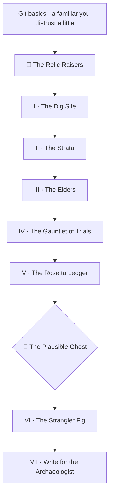

*Somewhere under the Empire, in a room nobody visits, a relic hums. It posts the invoices. It ages the receivables. It has done so every night since a year that begins with 19, and the people who built it have retired, moved on, or died. Nobody living can say why it treats status 7 the way it does. And this year the Council wants it in the Digital Heavens, behind an API, with a familiar answering questions about its data.*

*This campaign is the craft of archaeology for the working traveler: how to use the AI familiars of this age to read the ancient systems of the last one, prove you understood them, and raise them into living systems without losing what they know. You will dig a real site — a COBOL batch program and its fixed-width data — with a familiar at your side, and you will learn the one discipline that separates archaeology from guessing: **every reading is a hypothesis until the relic itself testifies.***

## 📖 The Legend Behind This Quest

*Two thousand years ago a bronze box of gears sank with a ship. When it surfaced, no one alive could say how it was made; the object had survived, but the understanding had not. Most relics in the realm are like that: fully legible as objects, illegible as intentions. The code runs. The reason went home with whoever wrote it. The Oracle of this age reads such code fluently and confidently, and that is exactly the danger — it produces the 🐉 **Plausible Ghost**, a guess with good grammar, and a raiser who trusts it builds the guess into the replacement. The Relic Raisers are the guild that learned to make the relic testify: run it, pin it, translate it, and never call the translation done until the Rosetta Ledger ties out.*

## 🎯 Quest Objectives

By the end of this campaign you will have built and verified:

### Primary Objectives (Required for Campaign Completion)

- [ ] **A dig site** — a legacy COBOL program compiled and running on your own machine, with field notes that separate evidence from hypothesis
- [ ] **A data dictionary and strata map** — every field of the relic's record layout decoded, every layer of its history dated
- [ ] **The Lore** — decision records that carry the reasons the relic's Elders remembered, each with its evidence
- [ ] **A Gauntlet of Trials** — characterization tests that pin the relic's true behavior, running in a summoning circle and a Factory
- [ ] **A Rosetta Ledger** — a port of the relic in a modern tongue, proven equal by a reconciliation that ties out line for line
- [ ] **A strangler fig** — a modern gate in front of the relic that routes requests to old or new, with shadow mode and rollback
- [ ] **A codex for the next archaeologist** — a map, a runbook, and a roadmap that say what stays and what changes

### Mastery Indicators

You will know you have mastered this campaign when you can:

- [ ] Take a familiar's explanation of unknown code and turn every sentence into a claim with a line number or a test behind it
- [ ] Name the three ghosts that haunted the first port (the century pivot, the disputed status, the floating point) and show the ledger that caught them
- [ ] Cut over one request at a time and roll back with a flag, not a rewrite
- [ ] Explain to a n00b why "old" is not the problem with a relic, and "unread" is

## 🗺️ Quest Metadata

| Field | Value |
|---|---|
| **Type** | `epic_quest` — a multi-session campaign |
| **Tier** | ⚡ Master `1110` capstone — chapters span 🌱 Apprentice → ⚡ Master |
| **Total XP** | 690 XP across 7 chapters, plus 200 XP for the campaign |
| **Primary classes** | 🧙 Wizard · 📚 Librarian · 📜 Sage · ⚙️ Artificer · 🛡️ Paladin |
| **Prerequisites** | Terminal and Git basics, a little Python, an AI familiar you already distrust a little |
| **Boss** | 🐉 The Plausible Ghost — a confident, wrong reading of the relic, ported into its replacement |
| **The relic** | `ARAGE01`, an accounts-receivable aging program: 150 lines of COBOL, a copybook, an 80-byte fixed-width file, a Y2K pivot, and one undocumented status code |

## 📜 The Campaign — Seven Chapters

Play them in order; each unlocks the next, and the whole campaign runs through the levels so every chapter also appears on its level hub.

| # | Chapter | Level | Difficulty | XP | Class | What you make |
|---|---|---|---|---|---|---|
| I | [The Dig Site](/quests/0011/relic-raisers-01-the-dig-site/) | `0011` | 🟢 Easy | 50 | 🧙 Wizard | The relic compiled and running, plus your first field notes |
| II | [The Strata](/quests/0110/relic-raisers-02-the-strata/) | `0110` | 🟡 Medium | 75 | 📚 Librarian | A data dictionary the data itself confirmed, and a dated strata map |
| III | [The Elders](/quests/1111/relic-raisers-03-the-elders/) | `1111` | 🟡 Medium | 75 | 📜 Sage | Decision records with evidence, recovered from people and comments |
| IV | [The Gauntlet of Trials](/quests/0101/relic-raisers-04-the-gauntlet-of-trials/) | `0101` | 🔴 Hard | 100 | ⚙️ Artificer | Golden-master trials, a summoning circle, and a Factory run |
| V | [The Rosetta Ledger](/quests/1100/relic-raisers-05-the-rosetta-ledger/) | `1100` | 🔴 Hard | 120 | 🧙 Wizard | A Python port and the reconciliation that proves it — 🐉 boss |
| VI | [The Strangler Fig](/quests/0111/relic-raisers-06-the-strangler-fig/) | `0111` | 🔴 Hard | 120 | 🧙 Wizard | An HTTP gate with relic, shadow, and port routing |
| VII | [Write for the Archaeologist](/quests/1110/relic-raisers-07-write-for-the-archaeologist/) | `1110` | ⚔️ Epic | 150 | 🛡️ Paladin | The map, the runbook, the roadmap, and the verify script |

> 🐉 **Boss gate.** The Plausible Ghost haunts Chapter V. You cannot pass to the Strangler Fig until your port's ledger ties out against the relic on every line — the familiar's first translation will not, and finding out why is the fight.

## 🌍 Choose Your Adventure Platform

*The relic is the same three files on every world. What differs is how you summon the compiler. Chapter I walks each path in full; here is the shape of it.*

### 🐧 Linux

```bash
sudo apt-get update && sudo apt-get install -y gnucobol3
cobc --version | head -1
# cobc (GnuCOBOL) 3.1.2.0
```

### 🍎 macOS

```bash
brew install gnucobol
cobc --version | head -1
```

### 🪟 Windows

```powershell
# Use the Penguin's Domain inside the Kingdom: install WSL, then follow the Linux path.
wsl --install -d Ubuntu
```

### ☁️ Cloud / Container

```bash
# The summoning circle from Chapter IV runs the relic anywhere Docker runs:
docker build -t arage01 . && docker run --rm arage01
```

## 🏅 Badges This Campaign Awards

- 🏺 **First Shard** — Chapter I: ran the relic and wrote field notes that separate evidence from hypothesis
- 📜 **Copybook Reader** — Chapter II: decoded every field and dated every stratum
- 🧓 **Keeper of the Lore** — Chapter III: recorded the Elders' reasons with their evidence
- 🛡️ **Golden Master** — Chapter IV: pinned the relic with trials that run in a circle and a Factory
- 🐉 **Ghost Breaker** — Chapter V: the ledger ties out on every line
- 🌳 **Gatekeeper of the Fig** — Chapter VI: routed one request at a time with shadow mode and rollback
- 🗺️ **Cartographer of the Lore** — Chapter VII: left the map, the runbook, and the roadmap where the next raiser digs
- 👑 **The Relic Raiser** — complete all seven chapters

## 🧱 Build Plan for IT-Journey Maintainers

This campaign was authored from a working lab, not from a manifest of merged pull requests. Every command and every output shown in the chapters was executed on 2026-09-14 on Ubuntu 24.04 with GnuCOBOL 3.1.2, Python 3.11, and Claude Code 2.1 — the relic, the trials, the ledger, and the gate are reproduced in full inside the chapters, so a learner can rebuild the reference lab from the text alone.

1. The `epic_quest` hub (this file) lives at `pages/_quests/codex/relic-raisers.md`. Each chapter is a `main_quest` in its **binary-level** directory (`pages/_quests/XXXX/relic-raisers-NN-<slug>.md`) with a `/quests/XXXX/<slug>/` permalink, so it also surfaces on that level's hub.
2. Chapters chain via `quest_dependencies.recommended_quests` / `unlocks_quests`; the hub `unlocks_quests` every chapter.
3. The campaign coins eight terms — archaeology, relic-raising, strata, the Elders, the Rosetta Ledger, the Strangler Fig, characterization trials, and the Plausible Ghost — all landed in the [Codex Glossary](/quests/codex/glossary/) in the same change, per the scribes' law.
4. Badges are free-text `rewards.badges`; XP per chapter is `rewards.progression_points`.

## 🗺️ Campaign Map



## 🎁 Rewards & Progression

**🎖️ Capstone Badges**

- 👑 **The Relic Raiser** — you revived a legacy system without losing what it knows
- 🐉 **Ghost Breaker** — you refused a fluent answer until the numbers agreed

**🛠️ Skills Unlocked**

- Digital archaeology with AI familiars · Characterization trials and reconciliation · Strangler-fig modernization with shadow mode

**📊 Progression Points**: +200 XP for the hub, 690 XP across the chapters

## 🔮 Next Adventures

- 🏺 Begin the campaign: [Chapter I — The Dig Site](/quests/0011/relic-raisers-01-the-dig-site/)
- 🤖 Sibling campaign: [Epic Quest: The Agentic Codex](/quests/codex/agentic-codex/) — build and govern the familiars you will command here
- 🏰 Sibling campaign: [Epic Quest: The Self-Operating Website](/quests/codex/self-operating-website/) — the same verify-before-trust discipline, applied to a site that runs itself

## 📚 Resource Codex

- [GnuCOBOL](https://gnucobol.sourceforge.io/) — the free compiler that lets a relic run on a laptop
- [Claude Code documentation](https://docs.claude.com/en/docs/claude-code/overview) — the familiar used in the chapters; any assistant that reads a file and answers will do
- [Strangler Fig Application](https://martinfowler.com/bliki/StranglerFigApplication.html) — Martin Fowler's original description of the pattern Chapter VI builds
- [GAO: Agencies Need to Plan for Modernizing Critical Decades-Old Legacy Systems](https://www.gao.gov/products/gao-25-107795) — eleven federal systems aged 23 to 60 years, eight of them on COBOL and assembly; the realm runs on more relics than anyone admits
- [NASA: Engineers Working to Resolve Issue With Voyager 1 Computer](https://science.nasa.gov/blogs/voyager/2023/12/12/engineers-working-to-resolve-issue-with-voyager-1-computer-2/) — fixing a 46-year-old computer "often entails consulting original, decades-old documents written by engineers who didn't anticipate the issues that are arising today"

## 🤝 Campaign Completion Checklist

- [ ] ✅ Completed all seven chapters in order
- [ ] ✅ Broke the Plausible Ghost: the Rosetta Ledger ties out on every line
- [ ] ✅ Earned the Golden Master and Gatekeeper of the Fig badges
- [ ] ✅ Your repository holds the relic, its trials, a reconciled port, a shadow-mode gate, and the lore — and `verify.sh` passes every gate

## 🕸️ Knowledge Graph

*Structured wiki-links connect this quest to the IT-Journey knowledge graph. Open the [Obsidian Graph View](/notes/obsidian/graph/) to explore connections.*

**Overworld:** [[🏰 Overworld - Master Quest Map]] **Chapters:** [[The Dig Site: Unearth the Relic and Name What You Do Not Know]] · [[The Strata: Read the Copybook, Then Let the Data Testify]] · [[The Elders: Recover the Reasons Before They Retire]] · [[The Gauntlet of Trials: Pin the Relic Before You Touch It]] · [[The Rosetta Ledger: Translate the Relic and Prove It Ties Out]] · [[The Strangler Fig: Put a Modern Gate in Front of the Relic]] · [[Write for the Archaeologist: Leave the Lore Where the Next One Digs]] **Siblings:** [[Epic Quest: The Agentic Codex]] · [[Epic Quest: The Self-Operating Website]] **Obsidian docs:** [[Obsidian Knowledge Graph and Wiki Links]]
