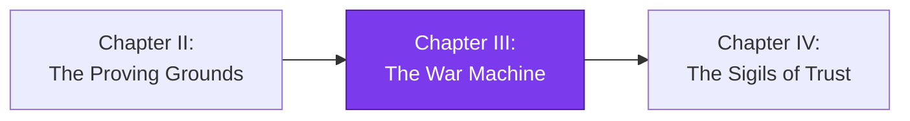

*The scouts have returned. In [Chapter II — The Proving Grounds](/quests/codex/self-operating-website-02-the-proving-grounds/) you taught your realm to look at itself — to survey the terrain, score its own weaknesses, and write an honest ledger of what was broken. But a ledger is not a campaign. A pile of grievances is not an army. Today you build the **War Machine**: the thing that decides what to fight, claims a single battle so no two soldiers swing at the same foe, and rehearses fifty skirmishes in a war-room sandbox before a single real blade is drawn.*

*The real-world skill underneath the fantasy is **autonomous work orchestration**: an OODA dispatch loop, distributed leasing with no database, RICE prioritization, and end-to-end simulation. Master this and you can build any fleet of agents that picks its own work and never trips over itself.*

## 📖 The Legend Behind This Quest

Every great keep eventually outgrows the lone caretaker who walks the halls fixing things by hand. The realm needs a **war machine** — a mechanism that observes the state of the kingdom, orients on what matters most, decides on exactly one quest worth doing, and acts on it without waiting for a human to point. The danger is chaos: a dozen automatons all "fixing" the same crumbling wall, overwriting each other's mortar. The genius of this chapter is that the machine needs **no central overseer and no database** — it uses the kingdom's own chronicle (its git history) as the single source of truth for who claimed what. Git *is* the ledger. The lease *is* a ref. And before any of it touches the living castle, you run a fifty-case dress rehearsal in the war room.

## 🎯 Quest Objectives

### Primary Objectives

- [ ] Implement an **OODA dispatch loop** (Observe → Orient → Decide → Act) that selects exactly one unit of work per run
- [ ] Build **serverless work-leasing** using git refs as a content-addressable store (CAS) so concurrent runners never collide
- [ ] Score a backlog with **RICE triage** (Reach × Impact × Confidence ÷ Effort) and emit a deterministic priority order
- [ ] Author a **fifty-case end-to-end simulation** that exercises the dispatcher offline and asserts no double-leasing

### Mastery Indicators

- [ ] Two parallel dispatch runs claim **different** work items, proven by a failing-then-passing collision test
- [ ] The simulation runs in CI as a **tiered pipeline** (fast lint → unit → full E2E) and gates merges
- [ ] You can explain why a git ref makes a correct distributed lock without Redis, a DB, or a queue

## 🧙‍♂️ Chapter 1: The OODA Dispatcher — Deciding What to Fight

### ⚔️ Skills You'll Forge

- Modeling the OODA loop (Observe, Orient, Decide, Act) as discrete, testable stages
- RICE scoring to turn a messy backlog into a single deterministic choice
- Keeping "decide" pure so the same inputs always produce the same pick

A dispatcher is the brain of the fleet. Given a backlog of candidate tasks — each one a row in the ledger your scouts wrote in Chapter II — it must choose **one** to act on. Resist the urge to make it clever and stateful. The strongest dispatchers are boring: a pure function from `(backlog, snapshot) → one task`. Everything else (claiming, running, reporting) lives outside the decision.

The **OODA loop** gives us four named stages. *Observe* loads the world (the worklist file, open PRs, recent runs). *Orient* filters and enriches — drop anything already in flight, attach a freshness penalty. *Decide* ranks what remains and returns the top item. *Act* hands that item off to be leased and worked.

We rank with **RICE**: `score = (Reach × Impact × Confidence) / Effort`. Reach is how many pages or users a fix touches, Impact is how much it moves the needle, Confidence is how sure we are, and Effort is the cost. Dividing by effort means a cheap, broad, high-confidence win beats a heroic gamble every time.

```python
from dataclasses import dataclass

@dataclass(frozen=True)
class Task:
    id: str
    reach: float       # how many pages/users this touches
    impact: float      # 0.25 .. 3.0 (massive)
    confidence: float  # 0.0 .. 1.0
    effort: float      # person-hours, never zero

def rice_score(t: Task) -> float:
    # Cheap, broad, high-confidence wins float to the top.
    return (t.reach * t.impact * t.confidence) / max(t.effort, 0.5)

def decide(backlog: list[Task], in_flight: set[str]) -> Task | None:
    """The pure heart of OODA: same inputs -> same single pick."""
    candidates = [t for t in backlog if t.id not in in_flight]
    if not candidates:
        return None
    # Sort by score desc, then id for a stable, deterministic tiebreak.
    return sorted(candidates, key=lambda t: (-rice_score(t), t.id))[0]
```

Notice three deliberate choices. The decision is **pure** — no I/O, no clock, no randomness — so it is trivially unit-testable and reproducible. The tiebreak on `t.id` makes the pick **stable**: two runners reading the same backlog will *choose* the same task, which is exactly the property the leasing layer in Chapter 2 turns into a safe race. And `in_flight` is passed in, not fetched, so "observe" stays separate from "decide."

The Act stage is thin — it just announces intent and delegates:

```bash
#!/usr/bin/env bash
# dispatch.sh — Observe -> Orient -> Decide, then hand off to Act (lease).
set -euo pipefail

BACKLOG_JSON="$(python3 scripts/build_backlog.py)"        # Observe
TASK_ID="$(echo "$BACKLOG_JSON" | python3 scripts/decide.py)"  # Orient + Decide

if [[ -z "$TASK_ID" ]]; then
  echo "::notice::Backlog empty after orient — nothing to dispatch."
  exit 0
fi

echo "Dispatcher selected task: $TASK_ID"
exec scripts/lease.sh "$TASK_ID"                          # Act
```

### 🔍 Knowledge Check

- [ ] Why must `decide()` be a pure function for the leasing safety property to hold?
- [ ] In RICE, what happens to the ranking if you forget to divide by Effort — and which kind of task wins instead?
- [ ] Why does the dispatcher select exactly one task per run instead of a batch?

## 🧙‍♂️ Chapter 2: Git-Ref Leasing — The Database You Already Have

### ⚔️ Skills You'll Forge

- Using a git ref as a **content-addressable, atomic compare-and-swap** lock
- Building distributed mutual exclusion with **no server, no DB, no queue**
- Writing a fifty-case simulation that proves no two runners claim the same work

Here is the trick that makes the whole fleet serverless. To claim a task safely, you need an **atomic operation that exactly one racer can win**. Most teams reach for Redis or a database row lock. But you already run a distributed, transactional, atomic store on every push: **git**. Creating a ref (`git push origin refs/leases/<task>`) is atomic on the remote — if the ref already exists, the non-fast-forward push **fails**. That failure *is* your lock contention signal.

A **content-addressable store (CAS)** means the name of the thing is derived from its contents. We name each lease ref after the task id (and a content hash), so two runners that `decide()` the same task try to create the *same* ref — and the remote lets only one succeed.

```bash
#!/usr/bin/env bash
# lease.sh — claim a task by creating a git ref. Atomic on the remote.
set -euo pipefail
TASK_ID="$1"
LEASE_REF="refs/leases/${TASK_ID}"

# Point the lease at the current commit; the *name* is the lock.
git update-ref "$LEASE_REF" HEAD

# The push is the compare-and-swap. --force-with-lease=<ref>: means
# "only create if it does not already exist" -> non-fast-forward fails.
if git push origin "$LEASE_REF" 2>/dev/null; then
  echo "::notice::Leased ${TASK_ID} — this runner owns the work."
  exec scripts/work.sh "$TASK_ID"     # we won the race; do the work
else
  echo "::notice::${TASK_ID} already leased by another runner — standing down."
  git update-ref -d "$LEASE_REF"      # clean up our local ref
  exit 0                              # losing is success, not failure
fi
```

The remote rejects a push that would overwrite an existing ref unless you force it — and we deliberately *don't* force. So when two GitHub Actions runners fire at the same moment, both call `decide()`, both pick the same top task (thanks to the stable tiebreak), both try to push `refs/leases/<id>`, and **exactly one push is accepted**. The loser sees a non-fast-forward rejection, treats it as "someone else has this," and exits cleanly. No coordinator. No polling. No split brain. When the work finishes, `work.sh` deletes the lease ref so the task can be re-attempted later if needed.

Now prove it. A claim like "no double-leasing" is worthless until a test *tries* to break it. The **fifty-case simulation** spins up the dispatcher against a synthetic backlog across many concurrent "runners" and asserts every task is claimed at most once:

```python
import concurrent.futures, hashlib

def simulate_run(seed: int, backlog, claimed: dict, lock):
    """One simulated runner: decide, then attempt an atomic claim."""
    task = decide(backlog, in_flight=set(claimed.keys()))
    if task is None:
        return None
    key = hashlib.sha256(task.id.encode()).hexdigest()  # CAS key = content
    with lock:                                # stands in for the remote's atomicity
        if key in claimed:
            return ("lost", task.id)          # ref already existed
        claimed[key] = seed
        return ("won", task.id)

def test_no_double_lease():
    backlog = [Task(f"t{i}", reach=i+1, impact=1.0, confidence=0.9, effort=2.0)
               for i in range(50)]
    import threading
    claimed, lock = {}, threading.Lock()
    with concurrent.futures.ThreadPoolExecutor(max_workers=50) as pool:
        results = list(pool.map(
            lambda s: simulate_run(s, backlog, claimed, lock), range(50)))
    won = [r[1] for r in results if r and r[0] == "won"]
    # The load-bearing assertion: every claim is unique. No collisions, ever.
    assert len(won) == len(set(won)), f"double-lease detected: {won}"
```

Run this fifty times with fifty runners and the assertion must hold every time. The `threading.Lock()` here stands in for the remote's atomic ref creation; in CI you can run the real thing against a throwaway branch. Wire all of it into a **tiered pipeline** so cheap checks fail fast and the expensive simulation only runs when the cheap ones pass:

```yaml
# .github/workflows/war-machine.yml — fast lint -> unit -> full E2E
name: War Machine
on: [pull_request]
jobs:
  lint:        # tier 1: seconds
    runs-on: ubuntu-latest
    steps:
      - uses: actions/checkout@v4
      - run: python3 -m ruff check scripts/
  unit:        # tier 2: the pure decide()/RICE tests
    needs: lint
    runs-on: ubuntu-latest
    steps:
      - uses: actions/checkout@v4
      - run: python3 -m pytest tests/unit -q
  simulation:  # tier 3: the 50-case end-to-end leasing sim — gates merge
    needs: unit
    runs-on: ubuntu-latest
    steps:
      - uses: actions/checkout@v4
      - run: python3 -m pytest tests/sim/test_dispatch_sim.py -q
```

### 🔍 Knowledge Check

- [ ] Why does *not* forcing the push give you a correct distributed lock for free?
- [ ] What property of `decide()` guarantees two runners race on the *same* ref rather than quietly doubling up?
- [ ] Why does the tiered pipeline put the fifty-case simulation last instead of first?

## 🔁 Reproduce It

This chapter is anchored to real merged work in the `bamr87/lifehacker.dev` fleet — the same War Machine, built for real:

- **[bamr87/lifehacker.dev#7](https://github.com/bamr87/lifehacker.dev/pull/7)** (`bamr87/lifehacker.dev@178756d97`) — stood up the initial OODA dispatch loop and the worklist-driven backlog the dispatcher observes.
- **[bamr87/lifehacker.dev#16](https://github.com/bamr87/lifehacker.dev/pull/16)** (`bamr87/lifehacker.dev@412397b21`) — added serverless git-ref CAS leasing so concurrent runners claim distinct work without a database.
- **[bamr87/lifehacker.dev#21](https://github.com/bamr87/lifehacker.dev/pull/21)** (`bamr87/lifehacker.dev@d93355df6`) — introduced RICE triage and the fifty-case end-to-end simulation wired into the tiered pipeline.

Read the diffs in order and you'll watch the war machine assemble exactly as this chapter teaches it.

## 🎮 Mastery Challenge

**Objective:** Prove your war machine cannot double-lease, under contention, in CI.

- [ ] Two parallel dispatch runs against the same backlog claim **two different** task ids (capture both run logs as proof)
- [ ] The fifty-case simulation passes 50/50 with the no-double-lease assertion enabled, and **fails** when you temporarily remove the atomic check (prove the test has teeth)
- [ ] The tiered pipeline blocks a merge when the simulation tier fails, and allows it when all three tiers are green

## 🎁 Rewards & Progression

- **Badge earned:** 🏗️ Castle Mechanic — the fleet and simulation stand up
- **Skills unlocked:**
  - 🛠️ Serverless work-leasing with git refs (CAS)
  - 🧠 OODA dispatch + RICE triage
- **+150 XP**

## 🗺️ Quest Network



## 🔮 Next Adventures

The machine now picks its battles and claims them safely — but who *signs off* on the work it ships? Next you'll forge the trust layer: gated permissions, smuggle-guards, and the sigils that let agents merge without a human on the keyboard.

- **Next chapter:** [The Sigils of Trust](/quests/codex/self-operating-website-04-the-sigils-of-trust/)
- **Campaign hub:** [The Self-Operating Website](/quests/codex/self-operating-website/)

## 📚 Resource Codex

- [GitHub Actions documentation](https://docs.github.com/en/actions) — workflows, jobs, and `needs` dependencies for tiered pipelines
- [git update-ref documentation](https://git-scm.com/docs/git-update-ref) — the low-level ref plumbing behind the lease
- [git push `--force-with-lease`](https://git-scm.com/docs/git-push#Documentation/git-push.txt---no-force-with-lease) — safe compare-and-swap semantics for refs
- [Claude Code documentation](https://docs.anthropic.com/en/docs/claude-code/overview) — driving the agent steps that perform the leased work

## 🕸️ Knowledge Graph

*Structured wiki-links connect this quest to the IT-Journey knowledge graph. Open the [Obsidian Graph View](/docs/obsidian/graph/) to explore connections.*

**Campaign hub:** [[Epic Quest: The Self-Operating Website]]
**Previous:** [[The Proving Grounds: Teaching the Realm to See Itself]]
**Next:** [[The Sigils of Trust]]
**Obsidian docs:** [[Obsidian Knowledge Graph and Wiki Links]]
