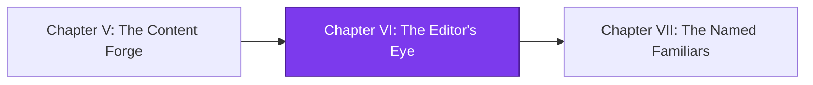

*The Forge in the last chapter gave your realm a tireless smith — drafts now appear in the night, born of stardust and templates. But raw drafts are not yet treasure. They need an editor: a quiet figure with a sharp eye who reads each manuscript, smooths its prose, and presses it back into the same pull request, better than before. You summon that editor now.*

*And here is the trap the old guild warns of in hushed tones: an editor who reviews, then edits, then is woken by its own edit — and reviews again, forever. The real-world skill you forge in this chapter is **event-safe automation**: writing CI jobs that act on pull requests without accidentally triggering themselves into an infinite loop. Master it, and your automation works for you. Fail, and a dragon made of your own commits will burn through your Actions minutes until dawn.*

## 📖 The Legend Behind This Quest

In the old kingdoms, every scriptorium kept a reviewer who annotated the margins. The IT-Journey way goes one step further: the reviewer doesn't just comment — it **rewrites the draft in place** on the PR branch, so the next human to look at the pull request sees an already-improved manuscript. This is an agentic editorial pass: a Claude Code step reads the changed files, applies brand-voice and clarity fixes, and pushes a commit back to the branch. It can clear a whole class of editorial nits before a human ever opens the PR — and is exactly the kind of automation that, done naively, becomes the dragon. Push a commit to a PR and GitHub fires a `synchronize` event; if your reviewer runs on `synchronize`, it wakes itself. Today you build the editor *and* the wards that keep it from devouring its own tail.

## 🎯 Quest Objectives

### Primary Objectives

- [ ] Add a `content-review` job that runs on pull requests and improves changed Markdown **in place**, pushing a commit back to the PR branch
- [ ] Gate the editorial step behind an `action_required` permission/condition so it only runs when it is allowed to push
- [ ] Add a `synchronize` loop-breaker guard so the reviewer never re-reviews its own bot commit
- [ ] Add a smuggle guard that blocks a "content" PR from carrying workflow or infrastructure changes

### Mastery Indicators

- [ ] You can explain, from memory, why a `synchronize`-triggered self-pushing job loops, and exactly which condition stops it
- [ ] You can diff a "good" reviewer run (one bot commit, then quiet) from a "dragon" run (commit → trigger → commit → …) by reading the Actions run list
- [ ] You can describe what your smuggle guard inspects and why a content workflow must refuse infra paths

## 🧙‍♂️ Chapter 1: Summoning the Editor (the action_required gate)

### ⚔️ Skills You'll Forge

- Writing a PR-triggered job that edits files **in place** and pushes back to the head branch
- Using an `action_required` gate so the editorial step only runs when permitted
- Committing and pushing from inside a GitHub Actions job with the right token and identity

The editor is a job on `pull_request`. When a content PR opens or updates, it checks out the **head** branch (not a detached merge ref), lets an agent improve the changed files, and commits any changes straight back. The crucial design choice: the agent's output lands on the same branch, so reviewers and humans see the improved draft, not a separate suggestion thread.

Two things make this safe to *start*. First, you check out the PR's actual head branch so a push goes somewhere meaningful. Second, you gate the push behind an `action_required` condition — the step that mutates the branch runs only when the workflow has permission and the event is one you intend to act on. Think of it as the editor only picking up the quill when the manuscript is genuinely theirs to edit.


```yaml
name: content-review
on:
  pull_request:
    types: [opened, synchronize, reopened]
    paths:
      - '_posts/**'
      - 'pages/**'

permissions:
  contents: write          # required to push the editorial commit
  pull-requests: write

jobs:
  review:
    runs-on: ubuntu-latest
    steps:
      - uses: actions/checkout@v4
        with:
          ref: ${{ github.head_ref }}   # check out the PR's head branch, not the merge ref
          fetch-depth: 0

      # The action_required gate: only run the editor when we are allowed to push.
      - name: Should the editor act?
        id: gate
        run: |
          if [ "${{ github.event.pull_request.head.repo.full_name }}" = "${{ github.repository }}" ]; then
            echo "act=true" >> "$GITHUB_OUTPUT"
          else
            echo "act=false" >> "$GITHUB_OUTPUT"   # forks can't receive a write token
          fi

      - name: Editorial pass (in place)
        if: steps.gate.outputs.act == 'true'
        run: |
          # Drive the Claude Code agent to improve changed Markdown in place.
          ./scripts/ai/run.sh content-reviewer
          git config user.name  "content-review[bot]"
          git config user.email "content-review[bot]@users.noreply.github.com"
          git add -A
          if ! git diff --cached --quiet; then
            git commit -m "chore(content): editorial pass [bot]"
            git push origin HEAD:${{ github.head_ref }}
          fi
```


Notice the `git push origin HEAD:${{ github.head_ref }}` — that push is exactly what fires the next `synchronize` event. Hold that thought; it is the seed of the boss.

### 🔍 Knowledge Check

- [ ] Why does the editor check out `github.head_ref` instead of the default detached merge ref?
- [ ] What does the `action_required`-style gate protect against when the PR comes from a fork?
- [ ] Which permission must be set to `write` for the editorial commit to push successfully?

## 🧙‍♂️ Chapter 2: The Smuggle Guard (content PRs stay content)

### ⚔️ Skills You'll Forge

- Inspecting a PR's changed file list inside a job
- Failing fast when a "content" PR touches infrastructure (`.github/workflows/**`, scripts, configs)
- Reasoning about least-privilege: a content workflow with `contents: write` must not rubber-stamp infra

An editor with `contents: write` is a trusted office. If a pull request labeled "content" can also slip in a change to `.github/workflows/**`, then an attacker (or a confused agent) could ride the content lane to alter the automation itself. The **smuggle guard** is the bouncer: before the editor lifts a quill, it lists the changed paths and refuses to proceed if anything outside the allowed content globs appears.

```bash
# smuggle-guard: a content PR must touch ONLY content paths.
ALLOWED='^(_posts/|pages/|assets/images/)'
INFRA='^(\.github/|scripts/|Gemfile|_config\.yml|frontmatter\.json)'

changed=$(git diff --name-only "origin/${BASE}...HEAD")
smuggled=$(echo "$changed" | grep -E "$INFRA" || true)

if [ -n "$smuggled" ]; then
  echo "::error::Content PR is smuggling infrastructure changes:"
  echo "$smuggled"
  exit 1
fi

# Belt-and-suspenders: anything not in ALLOWED is also rejected.
echo "$changed" | grep -vE "$ALLOWED" && {
  echo "::error::Non-content paths present; refusing editorial run."
  exit 1
} || echo "Smuggle guard passed: content-only."
```

The guard runs **before** the editorial step, so a smuggled infra change stops the run cold instead of getting an automated, trusted commit on top of it. This is the same instinct as a code reviewer who says "this is supposed to be a typo fix — why is it editing the deploy pipeline?"

### 🔍 Knowledge Check

- [ ] What set of paths does the smuggle guard treat as infrastructure, and why is `.github/workflows/**` the most dangerous?
- [ ] Why must the smuggle guard run *before* the editor's commit-and-push step?
- [ ] How does this guard reinforce least-privilege for a job that holds `contents: write`?

## 🐉 Boss Fight: The Self-Retrigger Loop

> **🐉 The Self-Retrigger Loop** — the dragon born of your own editor.

Here is how the dragon hatches. Your `content-review` job runs on `pull_request` with `synchronize` in its `types`. The editor improves the draft and **pushes a commit** to the PR branch. That push *is* a `synchronize` event. GitHub dutifully starts `content-review` again. The editor reads the (already-improved) files, finds another tiny thing to tweak — or finds nothing but still commits whitespace — pushes again, fires `synchronize` again… and the realm burns Actions minutes until you notice the run list scrolling forever.

This actually happened in the reference build: **bamr87/lifehacker.dev#49** (`bamr87/lifehacker.dev@b20fa3fdc`) is the loop and its cure.

The broken pattern — a job that runs on `synchronize`, pushes a commit, and thereby re-triggers itself:


```yaml
# 🐉 BROKEN: this reviews its own edit forever
on:
  pull_request:
    types: [opened, synchronize]   # synchronize fires on every push to the PR

jobs:
  review:
    runs-on: ubuntu-latest
    steps:
      - uses: actions/checkout@v4
        with: { ref: ${{ github.head_ref }} }
      - run: ./scripts/ai/run.sh content-reviewer
      - run: |
          git add -A && git commit -m "editorial pass" || exit 0
          git push                                # ← this push = a new synchronize = run again
```


The fix is a **loop-breaker guard**: before doing any work on a `synchronize` event, check whether the head commit was authored by the editor bot itself. If it was, the editor is looking at its own previous edit — so it stops. Slaying the dragon is one `if` condition.


```yaml
# 🐉 SLAIN: skip the run when the head commit is the bot's own
jobs:
  review:
    runs-on: ubuntu-latest
    steps:
      - uses: actions/checkout@v4
        with:
          ref: ${{ github.head_ref }}
          fetch-depth: 2

      - name: Loop-breaker — is the head commit ours?
        id: loop
        run: |
          author=$(git log -1 --format='%an')
          if [ "$author" = "content-review[bot]" ]; then
            echo "Head commit is the editor's own — breaking the loop."
            echo "skip=true" >> "$GITHUB_OUTPUT"
          else
            echo "skip=false" >> "$GITHUB_OUTPUT"
          fi

      - name: Editorial pass
        if: steps.loop.outputs.skip != 'true'
        run: |
          ./scripts/ai/run.sh content-reviewer
          git config user.name  "content-review[bot]"
          git config user.email "content-review[bot]@users.noreply.github.com"
          git add -A
          if ! git diff --cached --quiet; then
            git commit -m "chore(content): editorial pass [bot]"
            git push origin HEAD:${{ github.head_ref }}
          fi
```


Now the cycle terminates: a human (or the forge) pushes → editor reviews → editor pushes **one** bot commit → `synchronize` fires → loop-breaker sees the bot as the head author → the run exits without working. One edit, then quiet. The dragon is a corpse. (You can also implement the same break with a `[skip ci]` marker or `github.actor` check; the guiding principle is identical — *never let a job act on its own output*.)

**How to tell you won:** open the Actions run list for the PR. A defeated dragon looks like exactly two `content-review` runs — one that committed, one that immediately skipped. A live dragon looks like an ever-growing column of runs, each one a fresh `synchronize`.

## 🔁 Reproduce It

Every chapter of this campaign is anchored to a real merged branch in the reference build (`bamr87/lifehacker.dev`). Here is the editor's lineage:

- **bamr87/lifehacker.dev#25** (`bamr87/lifehacker.dev@ee97a1d55`) — introduced the in-place content reviewer that improves changed Markdown and pushes the editorial commit back to the PR branch.
- **bamr87/lifehacker.dev#35** (`bamr87/lifehacker.dev@161a3a6bc`) — added the `action_required` gating so the editorial push only runs when the workflow is permitted to write to the branch.
- **bamr87/lifehacker.dev#36** (`bamr87/lifehacker.dev@e4c7917a9`) — added the smuggle guard so a content PR cannot carry workflow/infrastructure changes through the trusted content lane.
- **bamr87/lifehacker.dev#49** (`bamr87/lifehacker.dev@b20fa3fdc`) — the boss: fixed the `synchronize` self-retrigger loop with a loop-breaker guard so the editor never re-reviews its own bot commit.

## 🎮 Mastery Challenge

**Objective:** Stand up a working in-place content reviewer in your own repo and prove the dragon cannot hatch.

- [ ] Open a content PR; confirm the editor produces **exactly one** bot commit and the Actions run list shows the next run *skipping* via the loop-breaker
- [ ] Push a PR that smuggles a `.github/workflows/**` change and confirm the smuggle guard **fails the run** before any editorial commit
- [ ] Temporarily remove the loop-breaker, watch (briefly!) the run list grow on `synchronize`, then restore it and confirm the loop stops — and cancel the runaway runs so you don't burn minutes

## 🎁 Rewards & Progression

- **Badge earned:** 🐉 Loop Breaker — broke the self-retrigger loop
- **Skills unlocked:**
  - 🛠️ In-place agentic editorial review
  - 🐉 Breaking the self-retrigger loop
- **+110 XP**

You now command an editor that improves drafts in place — and you've slain the most common dragon in self-operating automation: the job that triggers itself. That instinct (*never let a job act on its own output*) will protect every workflow you write from here on.

## 🗺️ Quest Network



## 🔮 Next Adventures

- ➡️ **Next chapter:** [The Named Familiars](/quests/codex/self-operating-website-07-the-named-familiars/) — give each agent a name, a role file, and least-privilege scope.
- 🏰 **Campaign hub:** [The Self-Operating Website](/quests/codex/self-operating-website/) — return to the epic's table of contents.
- ⬅️ **Previous chapter:** [The Content Forge](/quests/codex/self-operating-website-05-the-content-forge/) — where the drafts your editor reviews are born.

## 📚 Resource Codex

- [GitHub Actions: Events that trigger workflows (`pull_request`, `synchronize`)](https://docs.github.com/en/actions/using-workflows/events-that-trigger-workflows#pull_request)
- [GitHub Actions: Assigning permissions to jobs (`GITHUB_TOKEN`)](https://docs.github.com/en/actions/security-guides/automatic-token-authentication)
- [Claude Code documentation](https://docs.anthropic.com/en/docs/claude-code/overview)
- [Pro Git — Git Branching and the Tools of the Trade](https://git-scm.com/book/en/v2)

## 🕸️ Knowledge Graph

*Structured wiki-links connect this quest to the IT-Journey knowledge graph. Open the [Obsidian Graph View](/docs/obsidian/graph/) to explore connections.*

**Campaign hub:** [[Epic Quest: The Self-Operating Website]]
**Previous:** [[The Content Forge]]
**Next:** [[The Named Familiars]]
**Obsidian docs:** [[Obsidian Knowledge Graph and Wiki Links]]
