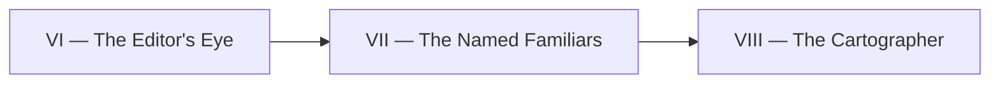

*The keep had grown loud. A dozen spells now fired on their own — some at dawn, some on every pull request — yet none of them had a face. When a workflow misbehaved you could only point at "the YAML" and shrug. The realm needed **familiars**: named spirits, each bound to one duty, each carrying its own temperament, its own permitted tools, and its own list of forbidden acts. Only then could you say "the Reviewer overstepped" instead of "something somewhere went wrong."*

*Today you learn to summon and name those familiars — and, because even a well-named spirit can drift, to teach one of them to audit the others. The real-world skill: separating an **agent** (who acts, with what tools, under what rules) from a **skill** (the procedure it follows), and building a self-review loop that keeps your automation fleet honest.*

## 📖 The Legend Behind This Quest

In the old grimoires every incantation was a tangled scroll: persona, tools, and step-by-step ritual all knotted together, copied and re-copied until no two matched. The Named Familiars reform splits that scroll in two. A **familiar** (agent) is a short character sheet — who it is, which tools it may touch, what it must never do. A **rite** (skill) is the reusable procedure, summoned by whichever familiar needs it. Because the procedure lives in one place, every familiar that performs it stays consistent; because the persona lives separately, you can grant or revoke a familiar's powers without rewriting the rite. The final flourish is a familiar whose only job is to read the others and report when one has grown stale, over-powered, or off-character.

## 🎯 Quest Objectives

### Primary Objectives

- [ ] Define a named **agent** as persona + allowed tools + hard rules, stored as a versioned Markdown file in `.claude/agents/`
- [ ] Define a reusable **skill** (procedure only) in `.claude/skills/<name>/SKILL.md` and call it from more than one agent
- [ ] Wire at least one automation role (e.g. a content reviewer) to a named agent in a GitHub Actions workflow
- [ ] Build a meta self-review routine that audits the agents and skills themselves

### Mastery Indicators

- [ ] You can explain, in one sentence each, the difference between an agent and a skill
- [ ] Two different agents reuse the same skill without duplicating its steps
- [ ] The fleet-audit run opens a PR or issue when an agent drifts out of spec

## 🧙‍♂️ Chapter 1: Naming the Familiars — Agents vs Skills

### ⚔️ Skills You'll Forge

- Authoring an agent character sheet (persona, tools, hard rules)
- Extracting a procedure into a standalone, reusable skill
- Understanding *least privilege*: an agent should hold only the tools its duty demands

The mistake almost everyone makes first is to write one giant prompt that mixes *who is acting* with *what they should do*. It works once. Then you need a second role that follows the same checklist, and you copy the checklist — and now the two drift apart the moment one is edited.

The fix is a clean seam. An **agent** answers three questions: **Who am I? Which tools may I use? What must I never do?** A **skill** answers one: **What are the steps?** Keep them in separate files and the steps become shared property.

Here is a minimal agent character sheet. Note that the persona and the *hard rules* are the load-bearing parts — the rules are what stop an over-eager familiar from running `git push --force` on `main`.

```yaml
# .claude/agents/content-reviewer.md  (frontmatter shown)
name: content-reviewer
description: Editorial pass over content-only pull requests. Suggests, never rewrites.
tools:
  - Read
  - Grep
  - Glob
# Hard rules (enforced in the body, not just hoped for):
#   1. NEVER edit files outside pages/ — refuse and explain.
#   2. NEVER use Bash, git, or gh — review only, no side effects.
#   3. Output a single review comment; do not push commits.
```

The body of that same file (below the frontmatter) is plain prose: the persona ("You are a careful copy editor for a gamified learning site…") and the rules spelled out so a reviewer can read them.

Now the **skill** — the procedure, with no persona attached, callable by any familiar:

```bash
# .claude/skills/brand-voice/SKILL.md exists; an agent invokes it like so.
# A skill is just a folder with a SKILL.md describing reusable steps.
ls .claude/skills/brand-voice/
# SKILL.md   examples/   checklist.md
```

The same `brand-voice` skill can be summoned by the `content-reviewer` familiar *and* by a `content-curator` familiar that actually writes. One procedure, two personas. When you tighten the brand checklist, both improve at once — that is the whole point of the seam.

### 🔍 Knowledge Check

- [ ] In your own words, which file holds "you may only use Read and Grep" — the agent or the skill?
- [ ] If two agents need the identical 5-step checklist, where should those steps live so they never drift?
- [ ] Why is listing a tool an agent doesn't need (e.g. `Bash` on a review-only role) a security smell?

## 🧙‍♂️ Chapter 2: Wiring a Familiar to a Workflow, Then Auditing the Fleet

### ⚔️ Skills You'll Forge

- Binding a named agent to a GitHub Actions trigger
- Passing the agent's identity through a single shared runner step
- Writing a *meta* agent whose subject is the other agents

A familiar that lives only in a file does nothing. To put it to work you bind it to an event — here, every pull request labeled `content` — and hand its name to a single runner step. Keeping one runner (rather than re-authoring the Claude invocation in every workflow) means tokens, model, and timeout are configured once.


```yaml
# .github/workflows/content-review.yml
name: content-review
on:
  pull_request:
    types: [opened, synchronize, labeled]
jobs:
  review:
    if: contains(github.event.pull_request.labels.*.name, 'content')
    runs-on: ubuntu-latest
    steps:
      - uses: actions/checkout@v4
      - name: Run the content-reviewer familiar
        uses: ./.github/actions/claude-run
        with:
          agent: content-reviewer        # the named familiar from Chapter 1
          oauth_token: ${{ secrets.CLAUDE_CODE_OAUTH_TOKEN }}
```


The workflow names *which* familiar acts; the shared `claude-run` action knows *how* to summon any of them. Swap `agent: content-reviewer` for `agent: content-curator` and the same plumbing drives a different persona.

Now the signature move of this chapter: a familiar that reads the others. Over months, agents accrete stale tools, rules drift from reality, and a skill gets renamed but an agent still references the old name. The **fleet auditor** is a scheduled agent whose subject is `.claude/agents/*.md` and `.claude/skills/*/SKILL.md`. It checks each one against a small rubric and opens a PR (or issue) when something is off.


```yaml
# .github/workflows/agent-audit.yml
name: agent-audit
on:
  schedule:
    - cron: '0 9 * * 1'   # weekly, Monday 09:00 UTC
  workflow_dispatch: {}
jobs:
  audit:
    runs-on: ubuntu-latest
    steps:
      - uses: actions/checkout@v4
      - name: Run the agent-auditor familiar
        uses: ./.github/actions/claude-run
        with:
          agent: agent-auditor
          oauth_token: ${{ secrets.CLAUDE_CODE_OAUTH_TOKEN }}
```


What does the auditor actually look for? A concrete, checkable rubric — least privilege, dead references, and persona-vs-rule integrity:

```python
# Sketch of the auditor's rubric (illustrative — describes intent, not exact output).
checks = [
    "every tool listed is actually used in the agent's body",   # no over-privilege
    "every skill referenced by name still exists on disk",      # no dead references
    "each agent states at least one explicit hard rule",        # no rule-less familiars
    "no two agents duplicate a procedure that should be a skill" # enforce the seam
]
# For each finding, the auditor proposes a minimal diff and opens one PR.
# It does NOT silently rewrite agents — a human reviews the proposed change.
```

Because the auditor proposes diffs rather than forcing them, the loop stays honest in both directions: the fleet keeps the site honest, and the auditor keeps the fleet honest — with a human still holding the merge button.

### 🔍 Knowledge Check

- [ ] In `content-review.yml`, which single line decides *which* familiar runs?
- [ ] Why route every agent through one shared `claude-run` action instead of re-writing the invocation per workflow?
- [ ] Name one thing the fleet auditor should flag that a normal CI lint would miss.

## 🔁 Reproduce It

This chapter mirrors a real, merged build on `bamr87/lifehacker.dev`. Study these two squash-merges to see the seam and the self-review land in production:

- **bamr87/lifehacker.dev#45** (`bamr87/lifehacker.dev@1c1eb0503`) — introduced the named-agent set and the agent-vs-skill separation, giving each automation role its own persona, tool allowlist, and hard rules distinct from the reusable skills.
- **bamr87/lifehacker.dev#46** (`bamr87/lifehacker.dev@193c6bd31`) — added the meta self-review routine that audits the agents and skills themselves, opening a PR when a familiar drifts out of spec.

Read the diffs in that order: #45 establishes the familiars, #46 teaches one of them to watch the rest.

## 🎮 Mastery Challenge

**Objective:** Stand up two named familiars that share one skill, then prove the fleet auditor can catch a drift you introduce on purpose.

- [ ] Create two agent files in `.claude/agents/` (e.g. a reviewer and a curator) that both reference the same skill in `.claude/skills/`
- [ ] Deliberately add an unused tool (e.g. `Bash`) to the review-only agent, run the auditor, and confirm it flags the over-privilege
- [ ] Remove the offending tool, re-run, and confirm the auditor reports a clean fleet (no findings)

## 🎁 Rewards & Progression

- **Badge earned:** 🤖 Familiar Master — the agent set and its self-review
- **Skills unlocked:** 🤖 Agent vs skill separation · 🧠 A meta fleet-audit routine
- **+80 XP**

## 🗺️ Quest Network



## 🔮 Next Adventures

- **Next chapter:** [VIII — The Cartographer](/quests/codex/self-operating-website-08-the-cartographer/) — teach the realm to map itself.
- **Campaign hub:** [The Self-Operating Website](/quests/codex/self-operating-website/) — return to the full epic to track your progress.

## 📚 Resource Codex

- [GitHub Actions documentation](https://docs.github.com/en/actions) — triggers, jobs, and scheduling for binding familiars to events.
- [Claude Code documentation](https://docs.anthropic.com/en/docs/claude-code) — agents, skills, and the tooling model behind the familiars.
- [Git documentation](https://git-scm.com/doc) — branches and pull requests the auditor proposes its diffs through.

## 🕸️ Knowledge Graph

*Structured wiki-links connect this quest to the IT-Journey knowledge graph. Open the [Obsidian Graph View](/docs/obsidian/graph/) to explore connections.*

**Campaign hub:** [[Epic Quest: The Self-Operating Website]]
**Previous:** [[The Editor's Eye]]
**Next:** [[The Cartographer]]
**Obsidian docs:** [[Obsidian Knowledge Graph and Wiki Links]]
