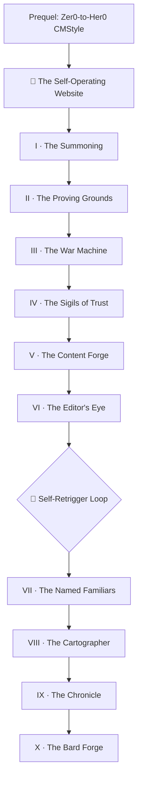

*You raised your castle from the `zer0-mistakes` stones. Now you will teach it to run itself — to write its own scrolls, mend its own walls, and keep a diary of every battle — without ever handing a stranger the keys to the gate.*

*This is a direct sequel to **[Epic Quest: Zer0-to-Her0 CMStyle](/quests/0010/epic-quest-zer0-to-her0-cmstyle/)**. There you built a living site. Here you teach it autonomy: a robot drafts content, screenshots it, files its own bugs, opens pull requests, reviews and improves them, contributes fixes upstream, and writes a retrospective of every working session — while a **human still holds the merge button.** This campaign is reverse-engineered from a real 40-branch build, so every chapter is a milestone you can actually complete and verify.*

## 📖 The Legend Behind This Quest

*Most castles need a keeper awake at every hour — patching walls, copying scrolls, watching the gate. The Self-Operating Castle is different. Its keeper sleeps. While they rest, tireless familiars draft the next scroll, test every bridge before a traveler crosses, and hunt the bugs that crept in at dusk. But the familiars never open the final gate themselves — they bring the key to the keeper and wait. That single discipline — **autonomy that proposes, a human that disposes** — is what separates a self-operating castle from a runaway machine.*

*The dragon at the heart of this campaign is not a monster of fire. It is 🐉 **The Self-Retrigger Loop**: a CI job that, on finishing its own work, wakes itself to do it again — forever. Learn to break that loop and you have learned the deepest lesson of autonomy.*

## 🎯 Quest Objectives

By the end of this campaign you will have built and verified:

### Primary Objectives (Required for Campaign Completion)
- [ ] **A verification harness** — a deterministic CI gate that turns "is it broken?" into a required check
- [ ] **An autonomous content factory** — generation from a backlog that refuses to publish what it cannot verify
- [ ] **An editorial reviewer** — an agent that improves each draft in place, and the loop-breaker that stops it reviewing itself forever
- [ ] **A least-privilege trust layer** — OAuth, a bot PAT with no admin scope, and a `*_ENABLED` kill switch on every automation
- [ ] **A named agent + skill fleet** — every role a persona with hard rules, plus a routine that audits the fleet itself
- [ ] **A session chronicle** — a hook that, at the end of every working session, records what the session cost

### Mastery Indicators
You will know you have mastered this campaign when you can:
- [ ] Explain OODA dispatch and **git-ref CAS leasing** (no server — git *is* the database)
- [ ] Diagnose and break a `synchronize` self-retrigger loop
- [ ] Separate a product bug from a platform bug and file the platform one upstream
- [ ] Defend the Prime Directive: an unverifiable command never ships

## 🗺️ Quest Metadata

| Field | Value |
|---|---|
| **Type** | `epic_quest` — a multi-session campaign |
| **Tier** | ⚡ Master `1111` capstone — chapters span 🌱 Apprentice → ⚡ Master |
| **Total XP** | ~955 XP across 10 chapters, plus two side-quest lines |
| **Primary classes** | 🏗️ System Engineer · 💻 Software Developer · 🛡️ Security Specialist |
| **Prerequisites** | [Zer0-to-Her0 CMStyle](/quests/0010/epic-quest-zer0-to-her0-cmstyle/), basic Git, a GitHub account |
| **Boss** | 🐉 The Self-Retrigger Loop (a CI job that re-triggers itself forever) |
| **Source build** | `bamr87/lifehacker.dev` — 40 merged branches, +16,223 / −499 lines (see issue [#365](https://github.com/bamr87/it-journey/issues/365)) |

## 📜 The Campaign — Ten Chapters

Each chapter maps to merged branches from the reference build you can study and reproduce. Play them in order; each unlocks the next.

| # | Chapter | Level | Difficulty | XP | Class | Reference PRs |
|---|---|---|---|---|---|---|
| I | [The Summoning](/quests/0001/self-operating-website-01-the-summoning/) | `0001` | 🟢 Easy | 50 | 💻 Developer | #1 · #2 · #11 |
| II | [The Proving Grounds](/quests/0100/self-operating-website-02-the-proving-grounds/) | `0100` | 🟡 Medium | 75 | 🏗️ System Eng | #3 · #4 |
| III | [The War Machine](/quests/1000/self-operating-website-03-the-war-machine/) | `1000` | ⚔️ Epic | 150 | 🏗️ System Eng | #7 · #16 · #21 |
| IV | [The Sigils of Trust](/quests/1001/self-operating-website-04-the-sigils-of-trust/) | `1001` | 🔴 Hard | 90 | 🛡️ Security | #12 · #13 · #14 · #15 |
| V | [The Content Forge](/quests/1010/self-operating-website-05-the-content-forge/) | `1010` | 🔴 Hard | 120 | 💻 Developer | #9 · #22 · #26 |
| VI | [The Editor's Eye](/quests/1100/self-operating-website-06-the-editors-eye/) | `1100` | 🔴 Hard | 110 | 💻 Developer | #25 · #35 · #36 · 🐉 #49 |
| VII | [The Named Familiars](/quests/1101/self-operating-website-07-the-named-familiars/) | `1101` | 🟡 Medium | 80 | 🏗️ System Eng | #45 · #46 |
| VIII | [The Cartographer](/quests/0101/self-operating-website-08-the-cartographer/) | `0101` | 🟡 Medium | 60 | 💻 Developer | #42 |
| IX | [The Chronicle](/quests/1110/self-operating-website-09-the-chronicle/) | `1110` | 🔴 Hard | 100 | 💻 Developer | #47 · #50 · #51 · #52 |
| X | [The Bard Forge](/quests/1100/self-operating-website-10-the-bard-forge/) | `1100` | 🔴 Hard | 120 | 💻 Developer | #53 |

> 🐉 **Boss gate.** The Self-Retrigger Loop stands between Chapter VI and Chapter VII. You cannot pass to the Named Familiars until you have broken the loop in the Editor's Eye (reference PR #49).

## 🌍 Choose Your Adventure Platform

*This campaign builds GitHub-hosted automation, so your battleground is a GitHub repository plus a local clone. The familiars are gated OFF until you both add auth and flip a switch — exactly the discipline you will teach your own site.*

### 🛠️ Arm the gate (any OS)

```bash
# 1. On a machine logged into Claude, mint a Code OAuth token:
claude setup-token

# 2. Store it as a repo secret and flip the kill switch you want on:
gh secret set CLAUDE_CODE_OAUTH_TOKEN --repo <you>/<your-site>
gh variable set CONTENT_FACTORY_ENABLED --body true --repo <you>/<your-site>

# Until BOTH the secret and the *_ENABLED variable exist, every familiar idles.
```

Each chapter adds its own platform notes (a CI runner, a bot PAT, a session hook). The rule never changes: **nothing autonomous runs until you opt in, and it stops the instant you unset the variable.**

## 🏅 Badges This Campaign Awards

- 🥇 **First Pull Request** — Chapter I (PR #1)
- 🏗️ **Castle Mechanic** — Chapter III (the fleet + simulation stand up)
- 🛡️ **Security Guardian** — Chapter IV (OAuth everywhere, least-privilege PAT, no admin scope)
- 🐉 **Loop Breaker** — Chapter VI (break the self-retrigger loop)
- 🤖 **Familiar Master** — Chapter VII (the agent set + its self-review)
- 📜 **Chronicler** — Chapter IX (the retrospective hook)
- 🪄 **Loop Closer** — Chapter X (turn project history into a learnable quest without mutating the project)
- 🐛 **Bug Slayer** — Side-quest Line A (re-land an orphan, break the loop, stop the header-shredder twice)
- 👑 **The Self-Operating Architect** — complete all ten chapters

## ⨯ Side-Quest Lines

Two optional lines run alongside the main campaign. Their content is authored in the reference build (`bamr87/lifehacker.dev`) and is being lifted into IT-Journey as standalone Apprentice side-quests.

- **🐛 Line A — The Bug Slayer's Gauntlet** — the boss fights *between* chapters: the orphan-commit trap (#8, #10), transient-vs-real failures (#32, #39), fail-safe builds (#43).
- **📚 Line B — The Lore Library** — real terminal skills the forge produced: fzf (#17, #31, #44), tmux survival (#20, #38, #40), and the point-the-robot / guardrails / fleet-spawn docs (#18, #33, #41). *(Tracked as planned side-quests — lifted from the verified source, not re-invented.)*

## 🧱 Build Plan for IT-Journey Maintainers

This campaign was forged automatically from issue #365 by the **quest-forge** fleet. To reproduce or extend it:

1. The `epic_quest` hub (this file) lives at `pages/_quests/codex/self-operating-website.md` (epic quests use the `/quests/codex/` URL namespace). Each chapter is a `main_quest` in its **binary-level** directory (`pages/_quests/XXXX/`) with a `/quests/XXXX/<slug>/` permalink, so it also surfaces on that level's hub; the campaign is held together by `quest_dependencies` and this hub's chapter index.
2. Chapters chain via `quest_dependencies.recommended_quests` / `unlocks_quests`; the hub `unlocks_quests` every chapter.
3. Badges are free-text `rewards.badges` — no central registry to update.
4. Re-run is automatic: label any future quest-forge proposal issue `epic-quest` (or comment `/forge-quest`) and the `quest-forge.yml` workflow opens a fresh campaign PR.

## 🗺️ Campaign Map



## 🧾 The Canonical Build Ledger

<details>
<summary>All 40 merged branches of the reference build (PR numbers + squash-merge SHAs are quoted from issue #365's deterministic collector — not re-derived here)</summary>

The full ledger of 40 merged branches (+16,223 / −499 lines), with PR numbers, squash-merge SHAs, dates, diffstats, branch names, and titles, lives in the source issue. Each is in the `bamr87/lifehacker.dev` repo.

➡️ **Read the full ledger:** [issue #365](https://github.com/bamr87/it-journey/issues/365) · source repo [`bamr87/lifehacker.dev`](https://github.com/bamr87/lifehacker.dev)

Each chapter's **🔁 Reproduce it** section cites the specific PRs and commits it maps to, so you can study the real diff that taught the lesson.

</details>

## 🎁 Rewards & Progression

**🎖️ Capstone Badges**
- 👑 **The Self-Operating Architect** — you built a site that proposes its own changes behind a human gate
- 🐉 **Loop Breaker** — you tamed the dragon that wakes itself forever

**🛠️ Skills Unlocked**
- Autonomous CI/CD pipeline design · AI agent + skill fleet authoring · Least-privilege automation with a human gate

**📊 Progression Points**: +200 XP for the hub, ~955 XP across the chapters

## 🔮 Next Adventures

- 🎯 Begin the campaign: [Chapter I — The Summoning](/quests/0001/self-operating-website-01-the-summoning/)
- 👑 Revisit the prequel: [Epic Quest: Zer0-to-Her0 CMStyle](/quests/0010/epic-quest-zer0-to-her0-cmstyle/)
- 🪄 The closing twist: [Chapter X — The Bard Forge](/quests/1100/self-operating-website-10-the-bard-forge/)

## 📚 Resource Codex

- [GitHub Actions documentation](https://docs.github.com/actions) — the engine every familiar runs on
- [Claude Code](https://docs.claude.com/en/docs/claude-code/overview) — the agent that drives the fleet
- [Jekyll documentation](https://jekyllrb.com/docs/) — the static castle
- [Source build: `bamr87/lifehacker.dev`](https://github.com/bamr87/lifehacker.dev) — the real 40-branch reference

## 🤝 Campaign Completion Checklist

- [ ] ✅ Completed all ten chapters in order
- [ ] ✅ Broke the Self-Retrigger Loop boss
- [ ] ✅ Earned the Security Guardian and Familiar Master badges
- [ ] ✅ Your site proposes its own changes behind a human merge button

## 🕸️ Knowledge Graph

*Structured wiki-links connect this quest to the IT-Journey knowledge graph. Open the [Obsidian Graph View](/docs/obsidian/graph/) to explore connections.*

**Overworld:** [[🏰 Overworld - Master Quest Map]]
**Prequel:** [[Epic Quest: Zer0-to-Her0 CMStyle]]
**Chapters:** [[The Summoning]] · [[The Proving Grounds]] · [[The War Machine]] · [[The Sigils of Trust]] · [[The Content Forge]] · [[The Editor's Eye]] · [[The Named Familiars]] · [[The Cartographer]] · [[The Chronicle]] · [[The Bard Forge]]
**Obsidian docs:** [[Obsidian Knowledge Graph and Wiki Links]]
