*Greetings, brave digital explorer! Welcome to the Terminal Navigation Mastery Quest - the foundational adventure that transforms you from a point-and-click apprentice into a command-line champion. This main quest forms the cornerstone of your IT journey, providing essential skills that every developer, system administrator, and digital craftsperson must master.*

*Whether you're taking your first steps into the world of development or seeking to solidify your command-line foundations, this comprehensive adventure will guide you through the essential arts of terminal navigation, file manipulation, and system exploration.*

### 🗺️ Quest Network Position

```mermaid
graph TB
    subgraph "Prerequisites"
        Hello[🌱 Hello n00b]
        Computer[🏰 Computer Literacy]
    end
    
    subgraph "Terminal Mastery Main Quest"
        Main[🏰 Terminal Navigation Mastery]
        Side1[⚔️ Oh-My-Zsh Setup]
        Side2[⚔️ Nerd Font Enchantment]
        Bonus[🎁 Productivity Hacks]
    end
    
    subgraph "Unlocked Adventures"
        Shell[🏰 Advanced Shell Scripting]
        Git[🏰 Version Control Fundamentals]
        SysAdmin[🏰 System Administration]
        Editor[🏰 Text Editor Mastery]
    end
    
    Hello --> Main
    Computer --> Main
    Main --> Side1
    Main --> Side2
    Main --> Bonus
    Main --> Shell
    Main --> Git
    Main --> SysAdmin
    Side1 --> Shell
    Side2 --> Editor
    
    style Main fill:#87ceeb
    style Side1 fill:#ffd700
    style Side2 fill:#ffd700
    style Bonus fill:#ff69b4
```



**Quest Series Progression**:

```mermaid
graph LR
    subgraph "Terminal Mastery Path"
        A[🌱 Computer Literacy] --> B[🏰 Terminal Navigation]
        B --> C[⚔️ Oh-My-Zsh Setup]
        B --> D[⚔️ Nerd Fonts]
        C --> E[🏰 Shell Scripting]
        D --> E
        E --> F[👑 Terminal Automation Epic]
    end
    
    style B fill:#87ceeb
    style C fill:#ffd700
    style D fill:#ffd700
    style E fill:#87ceeb
    style F fill:#9370db
```


## 🎯 Quest Objectives

By the time you complete this foundational adventure, you will have mastered:

### Primary Objectives (Required for Quest Completion)
- [ ] **Terminal Navigation Excellence** - Navigate any directory structure with speed and confidence
- [ ] **File System Manipulation** - Create, copy, move, and delete files/directories using commands
- [ ] **Text Processing Fundamentals** - Search, filter, and manipulate text content efficiently
- [ ] **Command Integration** - Chain commands together for complex workflow automation

### Secondary Objectives (Bonus Achievements)
- [ ] **Environment Customization** - Personalize terminal for optimal productivity
- [ ] **Process Management** - Monitor and control system processes effectively
- [ ] **Automation Foundation** - Create basic scripts for repetitive tasks

### Mastery Indicators
You'll know you've truly mastered this quest when you can:
- [ ] Navigate to any location without using graphical interfaces
- [ ] Quickly find and manipulate files using command-line tools
- [ ] Feel confident troubleshooting issues using terminal-based tools
- [ ] Teach terminal basics to other aspiring developers

## 🌍 Choose Your Adventure Platform

*Different platforms offer unique advantages for terminal mastery. Choose your realm:*

### 🍎 macOS Kingdom Path
```bash
# macOS comes with excellent terminal support
echo $SHELL  # Should show /bin/zsh
# Install enhanced tools via Homebrew
brew install tree htop fzf
```

### 🐧 Linux Territory Path  
```bash
# Native terminal environment with full command support
sudo apt update && sudo apt install -y tree htop
# Or for other distributions: dnf, pacman, etc.
```

### 🪟 Windows Empire Path
```powershell
# Enable Windows Subsystem for Linux (WSL)
wsl --install
# Launch Ubuntu or preferred Linux distribution
```

### ☁️ Cloud Realms Path
```bash
# Use GitHub Codespaces, AWS Cloud9, or Google Cloud Shell
# Full terminal access without local installation required
```

## 🧙‍♂️ Chapter 1: Terminal Awakening - Your First Commands

*Every master wizard began with their first incantation. Learn the foundational spells that open the gateway to terminal mastery.*

### ⚔️ Skills You'll Forge in This Chapter
- Terminal application navigation and interface understanding
- Essential orientation commands to understand your environment
- Basic file and directory listing capabilities
- Command structure and syntax fundamentals

### 🏗️ Building Your Knowledge Foundation

**Step 1: Opening Your Portal to Digital Power**

```bash
# Open your terminal application
# You'll see a prompt showing your location in the system

# Your first spell - identify yourself to the system
whoami
# Expected output: your-username

# Discover your current location in the file system
pwd
# Expected output: /home/username (Linux) or /Users/username (macOS)

# Survey your digital realm
ls
# Shows files and folders in current location

# Detailed view with permissions and sizes
ls -la
# -l = long format, -a = all files including hidden
```

### 🔍 Knowledge Check: Foundation Commands
- [ ] Can you explain what the `pwd` command reveals?
- [ ] What's the difference between `ls` and `ls -la`?
- [ ] How do you identify your current user and location?

## 🧙‍♂️ Chapter 2: Navigation Sorcery - Mastering Movement

*True terminal warriors never get lost in the digital wilderness. Master the art of movement through directory structures.*

### ⚔️ Skills You'll Forge in This Chapter
- Directory navigation using cd command variations
- Absolute vs. relative path understanding
- Shortcut techniques for rapid movement
- Directory creation and organization

### 🏗️ Advanced Navigation Techniques

```bash
# Change directory spells
cd              # Return to home directory
cd ~            # Tilde shortcut for home
cd Documents    # Move to Documents folder
cd ..           # Go up one level
cd -            # Return to previous directory

# Path understanding
cd /usr/local/bin           # Absolute path (starts with /)
cd ../Projects/web-dev      # Relative path navigation
cd ~/Documents/Code         # Home-relative path

# Directory creation
mkdir new-project
mkdir -p projects/web-dev/my-site  # Create nested directories
```

### 🔍 Knowledge Check: Navigation Mastery
- [ ] What's the difference between absolute and relative paths?
- [ ] How do you quickly return to your previous directory?
- [ ] What does `mkdir -p` accomplish?

## 🧙‍♂️ Chapter 3: File Manipulation Mastery - Creating and Controlling

*Learn to create, copy, move, and manage files with surgical precision.*

### ⚔️ Skills You'll Forge in This Chapter
- File creation using multiple methods
- Safe copying and moving operations
- Strategic file deletion with safety measures
- File permissions and ownership concepts

### 🏗️ File Operation Mastery

```bash
# File creation methods
touch README.md                    # Create empty file
echo "Hello World" > hello.txt     # Create file with content
cat > notes.txt << EOF              # Multi-line content creation
These are my terminal learning notes:
- pwd shows current directory
- ls lists directory contents
- cd changes directories
EOF

# File operations
cp hello.txt backup-hello.txt      # Copy file
mv notes.txt terminal-notes.txt    # Rename/move file
rm backup-hello.txt                # Delete file (careful!)

# Safe deletion practices
rm -i important-file.txt           # Prompt before deletion
ls *.tmp | xargs rm                # Remove multiple files safely
```

### 🔍 Knowledge Check: File Operations
- [ ] What's the safest way to delete files?
- [ ] How do you create files with initial content?
- [ ] What's the difference between `cp` and `mv`?

## 🎮 Quest Implementation Challenges

### Challenge 1: Terminal Scavenger Hunt (🕐 20 minutes)
**Objective**: Navigate a complex directory structure and find hidden treasures

**Requirements**:
- [ ] Create a multi-level directory structure
- [ ] Hide "treasure" files in various locations  
- [ ] Use only terminal commands to explore and find treasures
- [ ] Document your discoveries in a treasure map file

### Challenge 2: Development Workspace Setup (🕐 30 minutes)  
**Objective**: Create an organized development workspace using terminal commands

**Requirements**:
- [ ] Create directory structure for multiple projects
- [ ] Set up template files for common development tasks
- [ ] Organize resources and documentation folders
- [ ] Create a setup script that can recreate the workspace

### 🏆 Master Challenge: System Information Dashboard (🕐 40 minutes)
**Objective**: Build a terminal-based system monitoring script

**Requirements**:
- [ ] Display current system information (time, uptime, resources)
- [ ] Show directory sizes and file counts
- [ ] Monitor active processes and system resources
- [ ] Create a refreshing dashboard with organized output

## 🎁 Quest Rewards and Achievements

### 🏆 Achievement Badges Earned
- **Terminal Navigator** - Master of command-line navigation and exploration
- **Digital Explorer** - Fearless investigator of system structures and processes

### ⚡ Skills and Abilities Unlocked
- **Advanced Terminal Operations** - Confidence with all basic terminal commands
- **Development Workflow Foundation** - Essential skills for all programming activities

### 🛠️ Tools Added to Your Arsenal
- **Command-Line Mastery** - Fluency with essential Unix/Linux commands
- **File System Understanding** - Deep comprehension of directory structures

### 📈 Your Journey Progress
- **Previous Skills**: Basic computer literacy and GUI navigation
- **Current Mastery**: Command-line navigation and file operation expertise
- **Next Adventures**: Terminal customization, shell scripting, and development tool integration

## 🔮 Your Next Epic Adventures

### 🎯 Recommended Follow-Up Quests
- **Oh-My-Zsh Setup (Side Quest)** - Enhance your terminal with themes and plugins
- **Nerd Font Enchantment (Side Quest)** - Add visual icons and symbols to your terminal
- **Advanced Shell Scripting (Main Quest)** - Automate tasks with powerful scripts
- **Version Control Fundamentals (Main Quest)** - Master Git for code collaboration

### 🌐 Quest Network Connections
This foundational quest connects to multiple learning paths:
- **Software Development**: Essential for all coding activities
- **System Administration**: Foundation for server and infrastructure management  
- **DevOps Engineering**: Required for deployment and automation workflows
- **Security Operations**: Necessary for system analysis and protection

## 📚 Quest Resource Codex

### 📖 Essential Documentation
- [GNU Coreutils Manual](https://www.gnu.org/software/coreutils/manual/) - Complete command reference
- [Bash Manual](https://www.gnu.org/software/bash/manual/) - Shell scripting foundation
- [Linux Command Line Guide](http://linuxcommand.org/) - Comprehensive tutorial resource

### 🎥 Visual Learning Resources
- [Command Line Crash Course](https://www.youtube.com/playlist?list=PLT98CRl2KxKHaKA9-4_I38sLzK134p7_P) - Video tutorial series
- [Terminal Basics for Developers](https://www.youtube.com/watch?v=example) - Developer-focused training

### 💬 Community and Support
- [r/commandline](https://reddit.com/r/commandline) - Command-line community discussions
- [Unix & Linux Stack Exchange](https://unix.stackexchange.com/) - Q&A for terminal questions

### 🔧 Tools and Extensions
- [fzf](https://github.com/junegunn/fzf) - Fuzzy file finder for enhanced navigation
- [htop](https://htop.dev/) - Interactive process viewer
- [tree](http://mama.indstate.edu/users/ice/tree/) - Directory structure visualization

---

*Congratulations, brave terminal navigator! You have successfully completed the Terminal Navigation Mastery main quest. Your journey through the command-line realm has equipped you with essential skills that form the foundation of all advanced IT adventures. You now possess the power to navigate any Unix-like system with confidence and efficiency.*

*This main quest unlocks multiple side quests that will enhance your terminal experience and several advanced main quests that build upon these foundational skills. Choose your next adventure based on your interests and career goals - the digital realm awaits your exploration!*

**Achievement Unlocked: Terminal Navigation Master** 🏆 
*Continue your adventure with related side quests or advance to the next main quest in your chosen learning path!*
