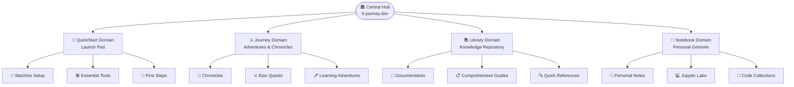
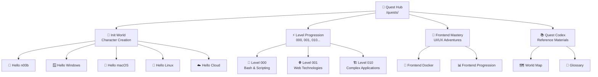

*Welcome, brave traveler, to the complete cartographical guide of the IT-Journey realm! This mystical map reveals every secret path, hidden treasure, and learning adventure across our digital kingdom.*

## 🌟 Realm Overview: The Four Sacred Domains

The IT-Journey realm is divided into four interconnected domains, each serving a unique purpose in your quest for IT mastery:



## 🚀 QuickStart Domain - Your Launch Pad to Digital Mastery

*The realm where every hero begins their journey - quick tutorials and essential setups to get you moving fast.*

**Location:** `/quickstart/`  
**Purpose:** Rapid deployment and essential environment setup

### 🏗️ Core Territories

| Territory | Path | Description |
|-----------|------|-------------|
| **🔧 Master Setup** | `/quickstart/machine-setup/` | Essential development environment configuration |
| **🛠️ Zer0-Mistakes Foundation** | `/quests/level-0010-epic-quest-zer0-to-her0-cmstyle/` | Core setup and fundamental tools |
| **⚡ Essential Tools Arsenal** | `/quickstart/` | Critical software and utilities |
| **👣 First Steps Ceremony** | `/quickstart/first-steps/` | Gentle introductions for newcomers |

### 🎯 Quick Navigation Links

- [Machine Setup Guide](/quickstart/machine-setup/) - Configure your development fortress
- [Essential Tools](/quickstart/) - Arm yourself with the right weapons
- [Zer0-Mistakes Starter](/quests/level-0010-epic-quest-zer0-to-her0-cmstyle/) - Foundation principles and practices

## ⚔️ Journey Domain - The Epic Quest Realm

*Your adventure unfolds through two interconnected paths: battle-tested wisdom and gamified learning experiences.*

**Location:** `/posts/` and `/quests/`  
**Purpose:** Learning through experience, challenges, and real-world adventures

### 📜 Chronicles Territory (`/posts/`)

Battle-tested wisdom and real-world experiences from fellow code warriors who've survived production deployments.

#### 🏛️ Chronicle Categories

| Category | Path | Quest Count | Latest Adventures |
|----------|------|-------------|-------------------|
| **🤖 AI Development** | `/posts/tags/ai/` | 15+ | GPT Integration, AI Automation |
| **🐳 Containerization** | `/posts/tags/docker/` | 8+ | Docker Setups, Container Magic |
| **⚙️ Development Tools** | `/posts/tags/tools/` | 12+ | VS Code, Git, Automation |
| **🎨 Frontend Mastery** | `/posts/tags/frontend/` | 10+ | JavaScript, CSS, Frameworks |
| **🏗️ System Architecture** | `/posts/tags/architecture/` | 6+ | Design Patterns, Infrastructure |
| **📊 Data & Analytics** | `/posts/tags/data/` | 8+ | Python, Databases, Visualization |

#### 📅 Recent Chronicles (2024-2025)

- [AI-Powered Development Workflows](/advanced-version-management-ai-implementation/) - Advanced automation techniques
- [GitHub Actions Mastery](/debugging-github-actions-workflows-ai-assisted/) - CI/CD optimization
- [Docker for IT-Journey](/posts/dockering-your-it-journey/) - Containerization strategies
- Jekyll Theming & Bootstrap (planned) - Site customization

### ⚔️ Quests Territory (`/quests/`)

Interactive challenges and adventures that transform learning into an epic RPG experience.

#### 🗺️ Quest Realm Structure



#### 🏰 Init World - Character Creation & Foundation

**Location:** `/quests/init_world/`  
**Purpose:** Begin your journey and establish your digital identity

| Quest | Difficulty | Description |
|-------|------------|-------------|
| [Begin Your IT Journey](/quests/lvl_000/begin-your-it-journey/) | 🌱 n00b | The Hero's Call |
| [Character Building](/quests/character-building/) | 🌱 n00b | Forge Your Identity |
| [IT Fundamentals](/quests/lvl_000/it-fundamentals/) | 🌱 n00b | Learn the Ancient Arts |
| [Character Selection](/quests/lvl_000/character-selection/) | 🟢 Easy | Choose Your Destiny |
| [OS Selection](/quests/lvl_000/os-selection/) | 🟢 Easy | Pick Your Realm |

**Platform-Specific Quests:**

- [Hello n00b](/quests/init_world/hello-noob/) - Your first steps into the digital realm
- [Hello Windows](/quests/hello-windows/) - Mastering the Microsoft Kingdom
- [Hello macOS](/quests/hello-macos/) - Conquering the Apple Empire
- [Hello Linux](/quests/hello-linux/linux-fundamentals/) - Taming the Penguin's Domain
- [Hello Cloud](/quests/hello-cloud/) - Ascending to the Digital Heavens

#### ⚡ Level Progression System

**Level 000 - Apprentice Trials** (`/quests/lvl_000/`)  
Basic scripting and automation magic

- [Bash Fundamentals](/quests/lvl_000/bash-run/) - Learn the Terminal Incantations
- `bash_crawl.sh` - Your First Automation Spell
- `calculator.sh` - Mathematical Magic Basics
- `profile.sh` - Customize Your Digital Presence

**Level 001 - Journeyman Challenges** (`/quests/lvl_001/`)  
Web technologies and advanced scripting

- [Personal Site Creation](/quests/level-0001/personal-site/) - Build Your Digital Castle
- `js-examples.js` - JavaScript Spell Components
- `js_testing.js` - Test Your Magical Constructs
- `python.py` - Pythonic Sorcery Basics

**Level 010 - Master Tier Quests** (`/quests/lvl_0010/`)  
Complex application development

- Bookstore Application (planned) - Craft a Complete Magical Marketplace

#### 🎨 Frontend Mastery Path (`/quests/frontend/`)

Become a master of user interfaces and digital aesthetics

- [Frontend Fundamentals](/quests/frontend/) - The Art of Digital Presentation
- [Frontend Docker Adventures](/quests/frontend-docker/) - Containerized UI Magic
- [Frontend Level Progression](/quests/level-0100-frontend-levels/) - Structured Learning Path
- [Level 000 Frontend](/quests/level-0100/frontend-docker-level-000/) - Beginner Container Magic
- [Level 001 Frontend](/quests/level-0100/frontend-docker-level-001/) - Intermediate UI Sorcery
- [Level 010 Frontend](/quests/level-0100/frontend-docker-level-010/) - Advanced Interface Wizardry

#### 📚 Quest Codex (`/quests/codex/`)

Reference materials and navigation aids

- [🗺️ World Map](/quests/codex/world-map/) - This comprehensive navigation guide
- [📖 Glossary](/quests/codex/glossary/) - Dictionary of Digital Spells and Terms

#### 🕰️ Recent Quest Chronicles (2025)

- [Django & Git Mastery](/quests/level-0010-django-and-git/) - Web Framework Sorcery
- [Action Triggers](/quests/level-0010-action-triggers/) - Automation Spell Casting
- [Branches & Pull Requests](/quests/level-0010-branches-and-pull-requests/) - Version Control Mastery
- [Change Log Chronicles](/quests/level-0010-change-logs/) - Document Your Journey
- [Clean Commit Commitments](/quests/level-0010-commitments-to-clean-commits/) - Perfect Your Git Ritual
- [AI Automation Revolution](/quests/level-0010-revolutionizing-work-with-ai-automation/) - Summon AI Familiars
- [Sourcery Code Methods](/quests/level-0100-source-control-sorcery/) - Advanced Coding Incantations

## 📚 Library Domain - The Sacred Repository of Knowledge

*Deep knowledge repositories and comprehensive documentation for when you need to go deeper.*

**Location:** `/docs/`  
**Purpose:** Comprehensive guides, references, and architectural blueprints

### 🏛️ Library Collections

| Collection | Path | Content Type | Purpose |
|------------|------|--------------|---------|
| **🔧 Jekyll Mastery** | `/docs/jekyll/` | Site Framework | Building and customizing IT-Journey |
| **🏗️ Architecture Guides** | `/docs/architecture/` | System Design | Blueprints and patterns |
| **📋 Configuration Codex** | `/docs/config/` | Setup Guides | System and tool configurations |
| **🔍 Reference Materials** | `/docs/reference/` | Quick Lookup | APIs, syntax, and commands |
| **📖 Comprehensive Guides** | `/docs/guides/` | Deep Dives | Step-by-step tutorials |

### 🗂️ Documentation Categories

Access all categories at `/categories/` to explore content by topic:

- **Development Tools** - IDE setup, Git workflows, automation
- **Programming Languages** - Python, JavaScript, Bash, and more
- **Frameworks** - Jekyll, Django, React, Angular
- **Infrastructure** - Docker, CI/CD, Cloud platforms
- **Security** - Best practices, authentication, encryption

## 📔 Notebook Domain - Your Personal Grimoire

*Your growing collection of interactive code environments, notes, and personal discoveries.*

**Location:** `/notes/`  
**Purpose:** Personal learning space and code experimentation

### 🧪 Laboratory Sections

| Section | Path | Tools | Purpose |
|---------|------|-------|---------|
| **💻 Jupyter Labs** | `/notes/jupyter/` | Interactive Notebooks | Code experimentation and analysis |
| **📝 Personal Notes** | `/notes/` | Markdown Notes | Quick captures and reminders |
| **🧩 Code Collections** | `/notes/snippets/` | Reusable Code | Curated examples and patterns |
| **📊 Learning Logs** | `/notes/progress/` | Progress Tracking | Journey documentation |

### 🔬 Interactive Learning Environments

- **Python Environments** - Data analysis and scripting
- **JavaScript Playgrounds** - Frontend experimentation
- **Bash Scripting Labs** - System automation practice
- **Data Science Workbenches** - Analytics and visualization

## 🔧 Configuration & Repository Structure

### 📂 Repository Architecture

```text
it-journey/
├── 🚀 QuickStart Materials
│   ├── _quickstart/          # Quick setup guides
│   └── scripts/              # Automation scripts
├── ⚔️ Journey Content
│   ├── pages/_posts/         # Chronicles (blog posts)
│   ├── pages/_quests/        # Epic quests and challenges
│   └── pages/_about/         # Platform information
├── 📚 Library Resources
│   ├── pages/_docs/          # Documentation collection
│   └── docs/                 # Additional guides
├── 📔 Notebook Space
│   ├── pages/_notes/         # Personal notes
│   └── pages/_notebooks/     # Jupyter environments
├── ⚙️ Site Configuration
│   ├── _config.yml           # Main Jekyll config
│   ├── _data/navigation/     # Site navigation
│   └── assets/               # Styles and media
└── 🐳 Development Environment
    ├── Dockerfile            # Container configuration
    ├── docker-compose.yml    # Local development
    └── .devcontainer/        # VS Code dev containers
```

### 🗺️ Navigation Configuration

Site navigation is managed through YAML files in `_data/navigation/`:

- `main.yml` - Primary navigation menu
- `quickstart.yml` - QuickStart section navigation  
- `posts.yml` - Journey/Chronicles navigation
- `docs.yml` - Library documentation navigation
- `about.yml` - Platform information navigation

### 🔗 Critical Links & Pathways

#### 🏠 Central Hubs

- [🏛️ Main Portal](/) - Primary entrance to IT-Journey
- [🏰 Quest Central](/quests/) - Complete quest index and navigation
- [📜 Chronicle Archive](/posts/) - All chronicles and blog posts
- [📚 Library Index](/docs/) - Documentation and guides
- [📔 Personal Notebook](/notes/) - Your learning space

#### 🔧 Platform Management

- [⚙️ Site Configuration](/about/config/) - Jekyll and site settings
- [🎨 Theme Customization](/about/theme/) - Visual customization guide
- [🤝 Contributing Guide](/about/contributing/) - How to contribute content
- [🗺️ Complete Sitemap](/about/sitemap/) - Detailed site structure
- [✨ Feature Overview](/about/features/) - Platform capabilities

#### 🔍 Discovery Tools

- [🔎 Site Search](/search/) - Find content across all domains
- [🏷️ All Categories](/categories/) - Browse content by topic
- [📊 Progress Tracking](/progress/) - Monitor your learning journey

### 🛡️ Authentication & Access

- **Public Access** - Most content freely available
- **GitHub Integration** - Authentication for interactive features
- **Personal Spaces** - Private notebook areas (logged-in users)
- **Contribution Access** - GitHub account required for content submission

## 🚀 Quick Start Navigation Commands

### 🎯 For Complete Beginners

1. **Start Here:** [Hello n00b Quest](/quests/init_world/hello-noob/)
2. **Setup Environment:** [Machine Setup Guide](/quickstart/machine-setup/)
3. **Choose Platform:** [OS Selection Quest](/quests/lvl_000/os-selection/)
4. **Begin Journey:** [Character Creation](/quests/character-building/)

### ⚡ For Experienced Developers

1. **Skill Assessment:** [Browse Quest Levels](/quests/#level-progression-system)
2. **Specialization:** [Choose Frontend](/quests/frontend/) or [Backend Path](/quests/lvl_001/)
3. **Advanced Challenges:** [Level 010 Quests](/quests/lvl_0010/)
4. **Contribute Content:** [Contributing Guide](/about/contributing/)

### 🔧 For System Administrators

1. **Platform Setup:** [Configuration Guide](/about/config/)
2. **Docker Environment:** [Container Setup](/posts/dockering-your-it-journey/)
3. **CI/CD Integration:** [GitHub Actions](/debugging-github-actions-workflows-ai-assisted/)
4. **Monitoring:** [Site Analytics](/about/features/)

## 🌟 Hidden Treasures & Advanced Features

### 🔮 Easter Eggs & Special Content

- **Developer Tools** - Hidden productivity enhancements
- **Advanced Configurations** - Power user customizations
- **Experimental Features** - Beta functionality and previews
- **Community Challenges** - Collaborative quests and competitions

### 🎮 Interactive Elements

- **Progress Tracking** - Automated quest completion monitoring
- **Achievement System** - Badges and recognition for milestones
- **Community Features** - Discussion and collaboration tools
- **AI Integration** - Smart content recommendations

---

*This world map is a living document that evolves with the IT-Journey platform. Bookmark this page for quick navigation, and remember: every expert was once a beginner who refused to give up after their first segmentation fault.*

**Legend:**

- 🌱 = n00b (absolute beginner)  
- 🟢 = Easy (basic knowledge required)
- 🟡 = Medium (some experience helpful)  
- 🔴 = Hard (advanced skills needed)
- ⚔️ = Epic (expert-level challenges)

*May your code compile, your deployments succeed, and your documentation actually match your implementation!* ⚡✨
