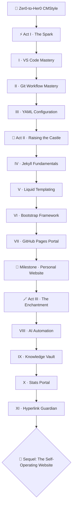

*In the vast digital wilderness, where code reigns supreme and innovation is the ultimate currency, one determined nerd embarked on an epic IT journey — no fancy degrees, no corporate backing, just sheer curiosity and open source grit. What began as late-night tinkering with GitHub, VS Code, and Jekyll became a fully fledged open-source content management system with AI handling the tedious work: automated setups, intelligent error resolution, even content enhancement.*

*This campaign retraces that road so you can walk it yourself. Three acts chain the real quests of the realm into one journey: spark the toolchain, raise your castle, then enchant it with AI. It ends where the sequel begins — with a living site of your own, ready to learn to run itself in **[The Self-Operating Website](/quests/codex/self-operating-website/)**.*

## 📖 The Legend Behind This Quest

*The protagonist's adventure kicked off in the familiar glow of a late-night screen, staring at GitHub's endless sea of repositories. A first repo of personal notes taught commits and pull requests. VS Code — free, extensible, with Git and a terminal built in — became the central hub, and Copilot slashed hours off debugging. Then Jekyll ignited the real magic: plain Markdown and YAML transformed into polished websites, hosted free on GitHub Pages.*

*From those stones rose two real castles you can study today: **[bamr87/zer0-mistakes](https://github.com/bamr87/zer0-mistakes)** — a Docker-optimized, Bootstrap-powered Jekyll theme with self-healing install scripts — and **[bamr87/it-journey](https://github.com/bamr87/it-journey)** — the quest platform you are reading right now, with AI-assisted content, automated statistics, and a link-health guardian. Early mishaps — broken builds, CSS conflicts — were conquered the open-source way: learn by breaking, fix by contributing. The result proves the thesis of this whole campaign: with the right tools, zeros become heroes.*

## 🎯 Quest Objectives

By the end of this campaign you will have built and shipped:

### Primary Objectives (Required for Campaign Completion)

- [ ] **A forged toolchain** — VS Code, Git, and GitHub working as one editor-to-cloud pipeline
- [ ] **A living castle** — a Jekyll site with layouts, Liquid templates, and a responsive Bootstrap theme, deployed to GitHub Pages
- [ ] **A public home** — your own personal site or portal, reachable by anyone on the web
- [ ] **The first enchantments** — AI-assisted automation doing the heavy lifting: documentation hubs, statistics dashboards, and automated link checking

### Mastery Indicators

You will know you have mastered this campaign when you can:

- [ ] Take a site change from idea → edit in VS Code → commit → push → live page without looking anything up
- [ ] Explain how Markdown, YAML frontmatter, Liquid, and layouts combine into a rendered page
- [ ] Fork a theme like zer0-mistakes, customize it, and contribute a fix back upstream
- [ ] Name what AI should automate on your site — and what still deserves a human review

## 🗺️ Quest Metadata

| Field | Value |
|---|---|
| **Type** | `epic_quest` — a multi-session campaign in three acts |
| **Tier** | 🌱 Apprentice entry point — chapters span levels `0000` → `1010` |
| **Total XP** | +200 for the hub, ~700 XP across the twelve chapter quests |
| **Primary classes** | 💻 Software Developer · 🎨 Frontend Developer · 📝 Content Creator |
| **Stack** | VS Code · Git & GitHub · Jekyll · GitHub Pages · Bootstrap · GitHub Copilot |
| **Reference builds** | [`bamr87/zer0-mistakes`](https://github.com/bamr87/zer0-mistakes) · [`bamr87/it-journey`](https://github.com/bamr87/it-journey) |
| **Sequel** | [Epic Quest: The Self-Operating Website](/quests/codex/self-operating-website/) |

## 📜 The Campaign — Three Acts

Each act chains existing quests of the realm into one storyline. Play the chapters in order within an act; the acts build on each other.

### ⚡ Act I — The Spark: Forge the Toolchain

| # | Chapter | Level | Difficulty | Time |
|---|---|---|---|---|
| I | [VS Code Mastery: Forge Your Ultimate Dev Weapon](/quests/0000/vscode-mastery/) | `0000` | 🟢 Easy | 45–60 min |
| II | [Git Workflow Mastery: Branches, Merging & Collaboration](/quests/0001/git-workflow-mastery/) | `0001` | 🟡 Medium | 75–90 min |
| III | [YAML Configuration: Site Settings Mastery](/quests/0001/yaml-configuration/) | `0001` | 🟢 Easy | 45–60 min |

### 🏰 Act II — Raising the Castle: Jekyll & GitHub Pages

| # | Chapter | Level | Difficulty | Time |
|---|---|---|---|---|
| IV | [Jekyll Fundamentals: Build Static Sites with Ruby](/quests/0001/jekyll-fundamentals/) | `0001` | 🟢 Easy | 75–90 min |
| V | [Liquid Templating: Dynamic Content for Jekyll Sites](/quests/0001/liquid-templating/) | `0001` | 🟡 Medium | 75–90 min |
| VI | [Bootstrap Framework: Build Responsive Sites Fast](/quests/0001/bootstrap-framework/) | `0001` | 🟢 Easy | 60–75 min |
| VII | [The GitHub Pages Portal: Forging Your Digital Realm](/quests/0001/github-pages-portal/) | `0001` | 🟢 Easy | 2–4 hours |

> 🏅 **Act II milestone.** Cement the act with the side quest [Build a Personal Website with GitHub Pages](/quests/0001/personal-site/) — your own castle, live on the web, is the proof that Act II is truly complete.

### 🪄 Act III — The Enchantment: AI Does the Heavy Lifting

| # | Chapter | Level | Difficulty | Time |
|---|---|---|---|---|
| VIII | [Revolutionizing Work with AI Automation](/quests/0010/revolutionizing-work-with-ai-automation/) | `0010` | 🟢 Easy | 30–60 min |
| IX | [The Knowledge Vault: Automated Documentation Hub](/quests/0001/docs-in-a-row/) | `0001` | 🟡 Medium | 2–3 hours |
| X | [Forging the Stats Portal: Data Analytics Quest](/quests/0001/stating-the-stats/) | `0001` | 🟢 Easy | 60–90 min |
| XI | [Link to the Future: Automated Hyperlink Guardian](/quests/1010/automated-hyperlink-guardian/) | `1010` | 🟡 Medium | 2–3 hours |

> 🪄 **The Enchanter's rule.** Every automation in Act III follows the same discipline the sequel campaign is built on: the robot does the tedious work — drafting, counting, checking — and a human reviews what ships. Learn that habit here and the Self-Operating Website will feel like a natural next step, not a leap.

## 🌍 Choose Your Adventure Platform

*Your battleground is a GitHub repository plus a local clone in VS Code. Everything in this campaign runs on free tools and free hosting.*

### 🛠️ Arm the forge (any OS)

```bash
# 1. Install the holy trinity: Git, VS Code, and the GitHub CLI
#    macOS:            brew install git gh && brew install --cask visual-studio-code
#    Windows (winget): winget install Git.Git GitHub.cli Microsoft.VisualStudioCode
#    Linux (Debian):   sudo apt install git gh && sudo snap install code --classic

# 2. Authenticate and claim your corner of GitHub
gh auth login
gh repo create my-first-castle --public --clone
cd my-first-castle && code .

# 3. Verify the toolchain speaks to itself
git status && gh repo view --web
```

Chapters add their own apparatus as you go — Ruby and Jekyll in Act II (via Docker or a version manager, so your host OS stays clean), and a GitHub Copilot trial plus GitHub Actions in Act III. Each chapter quest carries its own platform-specific instructions for macOS, Windows, and Linux.

## 🧙‍♂️ Primer: How the Trinity Becomes a CMS

### ⚔️ Skills You'll Forge

- Reading a Jekyll site the way the build does: Markdown + frontmatter in, rendered HTML out
- Using VS Code as the whole cockpit — editor, terminal, Git client, and Markdown preview in one window
- Recognizing where AI plugs into the pipeline: suggestion at the keystroke, automation in CI

A CMS is just three questions answered well: *where does content live?* (Markdown files in a Git repo), *how does it become a site?* (Jekyll builds it on every push), and *who does the tedious parts?* (automation, increasingly AI). The seed of the whole campaign fits in one file — a page is data plus prose:

```yaml
---
title: My First Scroll
description: The page that proves the pipeline works end to end.
date: 2026-07-01T00:00:00.000Z
layout: default
---
Welcome, traveler. This Markdown becomes HTML the moment I `git push`.
```

Commit that file, push it, and GitHub Pages rebuilds your castle — no server, no database, no deploy button. Act I teaches you the tools around that loop, Act II makes the loop produce a real themed site, and Act III hands the repetitive parts (docs indexes, statistics, link checking) to automation you control.

### 🔍 Knowledge Check

- [ ] Which part of the file above is YAML frontmatter, and which is content?
- [ ] What triggers a GitHub Pages rebuild, and where does the built site live?
- [ ] Name one task on a content site that is worth automating with AI — and one that is not.

## 🎮 Mastery Challenge

**Objective:** Prove the campaign is yours — not as a story you read, but as a site you shipped.

- [ ] You completed all three acts and their eleven chapter quests in order
- [ ] Your personal site is live on GitHub Pages with a customized theme
- [ ] At least one automation (docs hub, stats portal, or link guardian) runs on your repository
- [ ] You opened at least one pull request to an open-source repo that is not your own

## 🎁 Rewards & Progression

**🎖️ Campaign Badges**

- 👑 **CMStyle Her0** — you walked the whole road from zer0 to a working, AI-assisted CMS
- 🏰 **Castle Raiser** — your Jekyll site is live on GitHub Pages
- 🪄 **The Enchanter** — automation does your heavy lifting, and you review what ships

**🛠️ Skills Unlocked**

- VS Code + Git + Jekyll as one toolchain · Static-site theming and deployment · AI-assisted content and site automation

**📊 Progression Points**: +200 XP for the hub, ~700 XP across the chapter quests

## 🗺️ Quest Network



## 🔮 Next Adventures

- 🎯 Begin the campaign: [Chapter I — VS Code Mastery](/quests/0000/vscode-mastery/)
- 🏰 The sequel: [Epic Quest: The Self-Operating Website](/quests/codex/self-operating-website/) — teach the castle you just built to run itself
- 🤖 The advanced path: [Epic Quest: The Agentic Codex](/quests/codex/agentic-codex/) — govern autonomous agents on GitHub-native rails

## 📚 Resource Codex

- [VS Code documentation](https://code.visualstudio.com/docs) — the cockpit for the whole campaign
- [Pro Git (free book)](https://git-scm.com/book/en/v2) — version control from first principles
- [Jekyll documentation](https://jekyllrb.com/docs/) — the static castle engine
- [GitHub Pages documentation](https://docs.github.com/en/pages) — free hosting for your realm
- [`bamr87/zer0-mistakes`](https://github.com/bamr87/zer0-mistakes) — the Docker-optimized theme this story built
- [GitHub Copilot documentation](https://docs.github.com/en/copilot) — the AI that does the heavy writing

## 🤝 Campaign Completion Checklist

- [ ] ✅ Completed all three acts and their chapter quests in order
- [ ] ✅ Deployed a themed Jekyll site to GitHub Pages
- [ ] ✅ Earned the Castle Raiser and Enchanter badges
- [ ] ✅ Ready for the sequel — your site is one campaign away from running itself

## 🕸️ Knowledge Graph

*Structured wiki-links connect this quest to the IT-Journey knowledge graph. Open the [Obsidian Graph View](/notes/obsidian/graph/) to explore connections.*

**Overworld:** [[🏰 Overworld - Master Quest Map]] **Sequel:** [[Epic Quest: The Self-Operating Website]] **Chapters:** [[VS Code Mastery: Forge Your Ultimate Dev Weapon]] · [[Git Workflow Mastery: Branches, Merging & Team Collaboration]] · [[Jekyll Fundamentals: Build Static Sites with Ruby]] · [[The GitHub Pages Portal: Forging Your Digital Realm]] · [[Link to the Future: Automated Hyperlink Guardian Quest]] **Obsidian docs:** [[Obsidian Knowledge Graph and Wiki Links]]
