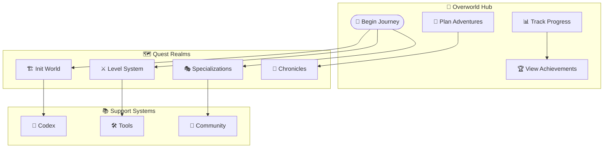
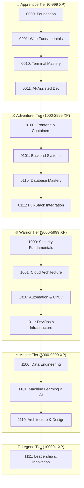
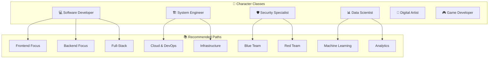

*Behold, brave adventurer! This is your personal overworld map—the mystical realm where all paths converge and all journeys begin. Here you can track your progress, plan your next adventures, and survey the vast landscape of IT mastery that awaits.*

## Quest System Overview

## World Selection & Character Building

### Choose Your Operating System Realm

| 🌍 Realm | 🎯 Difficulty | 📍 Starting Point | 📊 Progress |
|-----------|---------------|-------------------|-------------|
| 🍎 **macOS Kingdom** | 🟢 Easy | [Hello Mac](0000/hello-mac/hello-mac.md) | [ ] |
| 🪟 **Windows Empire** | 🟡 Medium | [Hello Windows](0000/hello-win/hello-win.md) | [ ] |
| 🐧 **Linux Territory** | 🔴 Hard | [Hello Linux](0000/hello-linux/linux-fundamentals.md) | [ ] |
| ☁️ **Cloud Heavens** | ⚔️ Epic | [Hello Cloud](0000/hello-cloud/hello-cloud.md) | [ ] |
| 🌱 **Universal n00b** | 🌟 Beginner | [Hello n00b](0000/hello-noob.md) | [ ] |

### Character Class Selection

| 🎭 Character Class | 🎯 Focus Area | 📍 Specialized Paths | 📊 Mastery |
|-------------------|---------------|---------------------|-------------|
| 💻 **Software Developer** | Code Creation & Architecture | Frontend, Backend, Full-Stack | [ ] |
| 🏗️ **System Engineer** | Infrastructure & Operations | DevOps, Cloud, Automation | [ ] |
| 🛡️ **Security Specialist** | Cybersecurity & Protection | Ethical Hacking, Security Ops | [ ] |
| 📊 **Data Scientist** | Analytics & Intelligence | ML, AI, Big Data | [ ] |
| 🎨 **Digital Artist** | UI/UX & Creative Tech | Design Systems, Frontend | [ ] |
| 🎮 **Game Developer** | Interactive Entertainment | Game Engines, Graphics | [ ] |

## Level Progression System

### Complete Level Map

---

## 🌱 Apprentice Tier (Levels 0000-0011)

*Master the fundamentals and discover your path*

### Level 0000 - Foundation & Init World

**Theme:** Digital Awakening | **XP Range:** 0-250

Terminal Mastery & Basic Setup

**Core Objectives:**

- [ ] Master terminal/command line navigation
- [ ] Set up development environment
- [ ] Learn basic file management
- [ ] Configure package managers
- [ ] Understand version control basics

**Available Quests:**

- [ ] [VS Code Mastery Quest](0000/vscode-mastery.md) - *Forge Your Ultimate Development Weapon* (50 XP)
- [ ] [Bash Fundamentals](0000/bash-run.md) - *Terminal Incantations* (40 XP)
- [ ] [Begin Your IT Journey](0000/begin-your-it-journey.md) - *The Hero's Call* (30 XP)
- [ ] [Hello n00b](0000/hello-noob.md) - *First Steps* (20 XP)
- [ ] [Terminal Fundamentals](0000/terminal-fundamentals.md) - *Command Line Mastery* (40 XP)
- [ ] [Git Basics](0000/git-basics.md) - *Version Control Foundation* (40 XP)
- [ ] [Markdown Mastery](0000/markdown-mastery.md) - *Documentation Magic* (30 XP)
- [ ] [Character Building](0000/character-building.md) - *Forge Your Identity* (30 XP)
- [ ] [Character Selection](0000/character-selection.md) - *Choose Your Path* (20 XP)
- [ ] [OS Selection](0000/os-selection.md) - *Pick Your Realm* (20 XP)
- [ ] [IT Fundamentals](0000/it-fundamentals.md) - *Core Concepts* (40 XP)

**Platform-Specific Tracks:**

| Platform | Quest | Status | XP |
|----------|-------|--------|-----|
| 🪟 Windows | [Hello Windows](0000/hello-win/hello-win.md) | [ ] | 50 |
| 🍎 macOS | Hello macOS (Coming Soon) | 🔮 | 50 |
| 🐧 Linux | [Hello Linux](0000/hello-linux/linux-fundamentals.md) | [ ] | 50 |
| ☁️ Cloud | Hello Cloud (Coming Soon) | 🔮 | 50 |

### Level 0001 - Web Fundamentals

**Theme:** Building Blocks | **XP Range:** 250-500

Web Technologies & Programming Fundamentals

**Core Objectives:**

- [ ] HTML/CSS fundamentals
- [ ] JavaScript basics
- [ ] Python introduction
- [ ] Version control with Git
- [ ] Deploy first website

**Available Quests:**

- [ ] [Personal Site Creation](0001/personal-site.md) - *Build Your Digital Castle* (60 XP)
- [ ] [GitHub Pages Portal](0001/github-pages-portal.md) - *Deploy Your First Website* (50 XP)
- [ ] [GitHub Pages Basics](0001/github-pages-basics.md) - *Static Site Hosting* (40 XP)
- [ ] [Docs in a Row](0001/docs-in-a-row.md) - *Documentation Basics* (40 XP)
- [ ] [Stack Attack](0001/stack-attack.md) - *Understanding Tech Stacks* (30 XP)
- [ ] [Jekyll Fundamentals](0001/jekyll-fundamentals.md) - *Static Site Generation* (50 XP)
- [ ] [Liquid Templating](0001/liquid-templating.md) - *Dynamic Content Magic* (40 XP)
- [ ] [YAML Configuration](0001/yaml-configuration.md) - *Data Structuring* (30 XP)
- [ ] [Git Workflow Mastery](0001/git-workflow-mastery.md) - *Collaboration Patterns* (50 XP)
- [ ] [Kaizen](0001/kaizen.md) - *Continuous Improvement* (40 XP)
- [ ] [Stating the Stats](0001/stating-the-stats.md) - *Data Tracking* (30 XP)
- [ ] [Terminal Mastery](0001/terminal-mastery.md) - *Advanced Terminal Skills* (40 XP)
- [ ] [Building Testing Git Init Script](0001/building-testing-git-init-script.md) - *Automation Testing* (50 XP)

### Level 0010 - Terminal Mastery

**Theme:** Command Line Arts | **XP Range:** 500-750

Advanced Terminal & Shell Scripting

**Core Objectives:**

- [ ] Advanced shell scripting
- [ ] Terminal customization
- [ ] Regular expressions
- [ ] Remote connections (SSH)
- [ ] Process management

**Available Quests:**

- [ ] [Bash Scripting Mastery](0010/bash-scripting.md) - *Ancient Bash Incantations* (70 XP)
- [ ] [Oh My Zsh Enchantment](0010/oh-my-zsh-terminal-enchantment.md) - *Transform Your Terminal* (50 XP)
- [ ] [Nerd Font Enchantment](0010/nerd-font-enchantment.md) - *Visual Terminal Magic* (30 XP)
- [ ] [Prompt Engineering](0010/prompt-engineering.md) - *Forge the Prompt Crystal* (40 XP)
- [ ] [Jekyll Mermaid Integration](0010/jekyll-mermaid-integration.md) - *Diagram Magic* (40 XP)
- [ ] [Advanced Markdown](0010/advanced-markdown.md) - *Documentation Mastery* (40 XP)
- [ ] [JavaScript Fundamentals](0010/javascript-fundamentals.md) - *Interactive Web Programming* (60 XP)
- [ ] [CSS Styling Basics](0010/css-styling-basics.md) - *Visual Design Magic* (50 XP)
- [ ] [Bootstrap Framework](0010/bootstrap-framework.md) - *Rapid UI Development* (40 XP)
- [ ] [Terminal Artificer Frontend Building](0010/terminal-artificer-frontend-building.md) - *Command Line UI* (50 XP)
- [ ] [Testing Quests with Recursive Questing](0010/testing-quests-with-recursive-questing.md) - *Quest Validation* (40 XP)

### Level 0011 - AI-Assisted Development

**Theme:** Digital Familiars | **XP Range:** 750-1000

AI Tools & Productivity Workflows

**Core Objectives:**

- [ ] AI pair programming
- [ ] Prompt engineering for code
- [ ] AI-powered debugging
- [ ] Code generation tools
- [ ] Productivity automation

**Available Quests:**

- [ ] [GitHub Code Search Quest](0011/github-pages-hidden-gem.md) - *Master Code Discovery* (50 XP)
- [ ] [VS Code Copilot Mastery](0011/prompt-crystal-mastery-vscode-copilot.md) - *AI Pair Programming* (70 XP)
- [ ] [Advanced Git Workflows](0011/advanced-git-workflows.md) - *Version Control Mastery* (60 XP)
- [ ] [Custom Domains](0011/custom-domains.md) - *Professional Web Presence* (40 XP)
- [ ] [SEO Optimization](0011/seo-optimization.md) - *Search Engine Magic* (50 XP)
- [ ] [Analytics Integration](0011/analytics-integration.md) - *Data Tracking* (40 XP)
- [ ] [Jekyll Plugins](0011/jekyll-plugins.md) - *Extending Functionality* (50 XP)

---

## ⚔️ Adventurer Tier (Levels 0100-0111)

*Specialize your craft and build real-world applications*

### Level 0100 - Frontend & Containers

**Theme:** Interface Magic | **XP Range:** 1000-1500

User Interface & Docker Fundamentals

**Core Objectives:**

- [ ] Modern framework mastery (React/Vue)
- [ ] CSS frameworks
- [ ] Docker containerization
- [ ] Build tool proficiency
- [ ] Component architecture

**Available Quests:**

- [ ] [Frontend Fundamentals](0100/frontend.md) - *Digital Presentation Arts* (60 XP)
- [ ] [Frontend Docker](0100/frontend-docker.md) - *Containerized UI Magic* (70 XP)
- [ ] [Sourcery Code Methods](0100/sourcery-code-methods.md) - *Advanced Coding Arts* (50 XP)
- [ ] [Container Fundamentals](0100/container-fundamentals.md) - *Docker Basics* (60 XP)
- [ ] [Docker Compose Orchestration](0100/docker-compose-orchestration.md) - *Multi-Container Magic* (70 XP)
- [ ] [Frontend Levels](0100/frontend-levels.md) - *Progressive Learning* (50 XP)
- [ ] [Level 000 Frontend Docker](0100/frontend-docker-level-000.md) - *Beginner Containers* (40 XP)
- [ ] [Level 001 Frontend Docker](0100/frontend-docker-level-001.md) - *Intermediate Containers* (50 XP)
- [ ] [Level 010 Frontend Docker](0100/frontend-docker-level-010.md) - *Advanced Containers* (60 XP)

### Level 0101 - Backend Systems

**Theme:** Server Sorcery | **XP Range:** 1500-2000

Server-Side Development & APIs

**Core Objectives:**

- [ ] Server-side programming
- [ ] RESTful API design
- [ ] Database connectivity
- [ ] Authentication basics
- [ ] API documentation

**Available Quests:**

- [ ] [Docker Mastery Example](0101/docker-mastery-example.md) - *Advanced Container Patterns* (70 XP)
- [ ] [LazyTeX CV Building](0101/the-lazytex-of-building-a-curriculum-vitae.md) - *Document Automation* (50 XP)
- [ ] [CI/CD Fundamentals](0101/cicd-fundamentals.md) - *Continuous Integration Basics* (60 XP)
- [ ] [GitHub Actions Basics](0101/github-actions-basics.md) - *Workflow Automation* (60 XP)
- [ ] [Deployment Pipelines](0101/deployment-pipelines.md) - *Automated Deployments* (70 XP)
- [ ] [Environment Management](0101/environment-management.md) - *Configuration Control* (50 XP)
- [ ] [Secrets Management](0101/secrets-management.md) - *Secure Configuration* (50 XP)
- [ ] [Artifact Management](0101/artifact-management.md) - *Build Outputs* (40 XP)
- [ ] [Testing Integration](0101/testing-integration.md) - *Automated Testing* (60 XP)
- [ ] [Workflow Optimization](0101/workflow-optimization.md) - *Pipeline Efficiency* (50 XP)

### Level 0110 - Database Mastery

**Theme:** Data Vaults | **XP Range:** 2000-2500

Data Storage & Retrieval

**Core Objectives:**

- [ ] SQL fundamentals
- [ ] NoSQL databases
- [ ] Data modeling
- [ ] Query optimization
- [ ] Database administration

**Available Quests:**

- [ ] [Database Fundamentals](0110/database-fundamentals.md) - *Data Storage Basics* (60 XP)
- [ ] [SQL Mastery](0110/sql-mastery.md) - *Query Language Power* (70 XP)
- [ ] [Data Modeling](0110/data-modeling.md) - *Structure Design* (60 XP)
- [ ] [Query Optimization](0110/query-optimization.md) - *Performance Tuning* (70 XP)
- [ ] [Database Migrations](0110/database-migrations.md) - *Schema Evolution* (50 XP)
- [ ] [Database Security](0110/database-security.md) - *Access Control* (60 XP)
- [ ] [Connection Pooling](0110/connection-pooling.md) - *Resource Management* (40 XP)
- [ ] [Backup Recovery](0110/backup-recovery.md) - *Data Protection* (50 XP)

### Level 0111 - Full-Stack Integration

**Theme:** Bridge Building | **XP Range:** 2500-3000

Complete Application Development

**Core Objectives:**

- [ ] Frontend-backend integration
- [ ] Authentication & authorization
- [ ] State management
- [ ] Real-time features
- [ ] Performance optimization

**Available Quests:**

- [ ] [API Fundamentals](0111/api-fundamentals.md) - *Service Communication* (60 XP)
- [ ] [REST Principles](0111/rest-principles.md) - *RESTful Design* (50 XP)
- [ ] [API Authentication](0111/api-authentication.md) - *Security Keys* (70 XP)
- [ ] [API Documentation](0111/api-documentation.md) - *Clear Contracts* (40 XP)
- [ ] [API Versioning](0111/api-versioning.md) - *Evolution Management* (50 XP)
- [ ] [Error Handling](0111/error-handling.md) - *Graceful Failures* (50 XP)
- [ ] [Rate Limiting](0111/rate-limiting.md) - *Traffic Control* (40 XP)

---

## 🔥 Warrior Tier (Levels 1000-1011)

*Master advanced skills and production systems*

### Level 1000 - Cloud Fundamentals

**Theme:** Sky Infrastructure | **XP Range:** 3000-3750

Cloud Computing Basics

**Core Objectives:**

- [ ] Cloud computing concepts
- [ ] Infrastructure as Code
- [ ] Cloud providers basics
- [ ] Serverless computing
- [ ] Cloud security

**Available Quests:**

- [ ] [Cloud Computing Fundamentals](1000/cloud-computing-fundamentals.md) - *Understanding the Cloud* (60 XP)
- [ ] [Infrastructure as Code](1000/infrastructure-as-code.md) - *Code-Based Infrastructure* (70 XP)
- [ ] [AWS Essentials](1000/aws-essentials.md) - *Amazon Web Services* (80 XP)

### Level 1001 - Kubernetes & Orchestration

**Theme:** Container Orchestration | **XP Range:** 3750-4500

Kubernetes & Container Management

**Core Objectives:**

- [ ] Kubernetes fundamentals
- [ ] Pod and workload management
- [ ] Services and networking
- [ ] Configuration and secrets
- [ ] Cluster operations

**Available Quests:**

- [ ] [Kubernetes Fundamentals](1001/kubernetes-fundamentals.md) - *Container Orchestration Basics* (80 XP)
- [ ] [K8s Pods & Workloads](1001/k8s-pods-workloads.md) - *Managing Applications* (70 XP)
- [ ] [K8s Services & Networking](1001/k8s-services-networking.md) - *Cluster Communication* (70 XP)
- [ ] [K8s Config & Secrets](1001/k8s-config-secrets.md) - *Configuration Management* (60 XP)

### Level 1010 - Automation & CI/CD

**Theme:** Spell Automation | **XP Range:** 4500-5250

Testing & Continuous Integration

**Core Objectives:**

- [ ] Unit testing mastery
- [ ] Integration testing
- [ ] CI/CD pipelines
- [ ] Test-driven development
- [ ] Automated deployments

**Available Quests:**

- [ ] [Link to the Future](1010/link-to-the-future-automated-hyperlink-checking-and-error-reporting.md) - *Automated Validation* (70 XP)
- [ ] [Monitoring Fundamentals](1010/monitoring-fundamentals.md) - *System Observability* (60 XP)
- [ ] [Prometheus & Grafana](1010/prometheus-grafana.md) - *Metrics & Dashboards* (80 XP)
- [ ] [ELK Stack](1010/elk-stack.md) - *Elasticsearch, Logstash, Kibana* (90 XP)
- [ ] [Distributed Tracing](1010/distributed-tracing.md) - *Request Tracking* (70 XP)
- [ ] [Alerting Systems](1010/alerting-systems.md) - *Incident Detection* (60 XP)

### Level 1011 - DevOps & Infrastructure

**Theme:** System Forging | **XP Range:** 5250-6000

Infrastructure & Operations

**Core Objectives:**

- [ ] Container orchestration
- [ ] Infrastructure as Code
- [ ] Monitoring & observability
- [ ] Log management
- [ ] Incident response

**Available Quests:**

- [ ] [Feature Re-Quest](1011/ai-feature-pipeline-architect.md) - *Feature Workflows* (60 XP)
- [ ] [Security Fundamentals](1011/security-fundamentals.md) - *Cybersecurity Basics* (70 XP)
- [ ] [Secure Coding](1011/secure-coding.md) - *Defensive Programming* (80 XP)
- [ ] [Threat Modeling](1011/threat-modeling.md) - *Risk Assessment* (70 XP)
- [ ] [Penetration Testing](1011/penetration-testing.md) - *Ethical Hacking* (90 XP)
- [ ] [Compliance Standards](1011/compliance-standards.md) - *Regulatory Requirements* (60 XP)

---

## ⚡ Master Tier (Levels 1100-1110)

*Achieve expertise and design complex systems*

### Level 1100 - Data Engineering

**Theme:** Information Alchemy | **XP Range:** 6000-7000

Data Pipelines & Analytics

**Core Objectives:**

- [ ] ETL pipeline design
- [ ] Data warehousing
- [ ] Stream processing
- [ ] Data quality
- [ ] Analytics infrastructure

**Available Quests:**

- [ ] [EDGAR API Integration](1100/edgar.md) - *Financial Data Access* (70 XP)
- [ ] [SEC EDGAR Deep Dive](1100/sec-edgar.md) - *Advanced Financial Analysis* (80 XP)
- [ ] [Temple of Templates](1100/the-temple-of-templates.md) - *Reusable Systems* (60 XP)
- [ ] [ETL Pipeline Design](1100/etl-pipeline-design.md) - *Data Transformation* (80 XP)
- [ ] [Data Warehousing](1100/data-warehousing.md) - *Grand Data Library* (90 XP)
- [ ] [Stream Processing](1100/stream-processing.md) - *Real-time Data Rivers* (80 XP)
- [ ] [Apache Spark Mastery](1100/apache-spark.md) - *Big Data Processing* (100 XP)
- [ ] [Data Quality Engineering](1100/data-quality.md) - *Information Integrity* (70 XP)

### Level 1101 - Machine Learning & AI

**Theme:** Digital Intelligence | **XP Range:** 7000-8500

AI & Machine Learning

**Core Objectives:**

- [ ] ML fundamentals
- [ ] Neural networks
- [ ] Natural language processing
- [ ] Computer vision
- [ ] MLOps

**Available Quests:**

- [ ] [Machine Learning Fundamentals](1101/ml-fundamentals.md) - *Teaching Machines to Learn* (80 XP)
- [ ] [Python for Data Science](1101/python-data-science.md) - *Pythonic Prophecies* (70 XP)
- [ ] [Neural Networks Deep Dive](1101/neural-networks.md) - *Digital Brain Construction* (100 XP)
- [ ] [Deep Learning Frameworks](1101/deep-learning-frameworks.md) - *TensorFlow & PyTorch* (90 XP)
- [ ] [Natural Language Processing](1101/natural-language-processing.md) - *Understanding Speech* (90 XP)
- [ ] [Computer Vision Mastery](1101/computer-vision.md) - *Machine Sight* (90 XP)
- [ ] [MLOps Engineering](1101/mlops.md) - *Deploying Intelligence* (80 XP)
- [ ] [AI Ethics and Responsible AI](1101/ai-ethics.md) - *Responsible Creation* (50 XP)

### Level 1110 - Architecture & Design

**Theme:** Master Builder | **XP Range:** 8500-10000

System Architecture & Design Patterns

**Core Objectives:**

- [ ] Design patterns
- [ ] Microservices
- [ ] Event-driven architecture
- [ ] Domain-driven design
- [ ] System design

**Available Quests:**

- [ ] [404 Hunting Quest](1110/404-hunting.md) - *Error Handling Mastery* (60 XP)
- [ ] [Software Design Patterns](1110/design-patterns.md) - *Architectural Blueprints* (90 XP)
- [ ] [Microservices Architecture](1110/microservices-architecture.md) - *Distributed Kingdoms* (100 XP)
- [ ] [Event-Driven Architecture](1110/event-driven-design.md) - *Reactive Systems* (80 XP)
- [ ] [Domain-Driven Design](1110/domain-driven-design.md) - *Business Logic Mastery* (90 XP)
- [ ] [System Design Interview Mastery](1110/system-design-interviews.md) - *Architect Certification* (100 XP)
- [ ] [API Gateway Patterns](1110/api-gateway-patterns.md) - *Traffic Control* (70 XP)
- [ ] [Scaling Strategies](1110/scaling-strategies.md) - *Handling Growth* (80 XP)

---

## 👑 Legend Tier (Level 1111)

*Lead, innovate, and create lasting impact*

### Level 1111 - Leadership & Innovation

**Theme:** Realm Shaper | **XP Range:** 10000+

Technical Leadership & Industry Impact

**Core Objectives:**

- [ ] Technical leadership
- [ ] Open source contribution
- [ ] Tech speaking & writing
- [ ] Mentorship
- [ ] Innovation & R&D

**Available Quests:**

- [ ] [Technical Leadership](1111/technical-leadership.md) - *Leading the Guild* (100 XP)
- [ ] [Open Source Contribution](1111/open-source-contribution.md) - *Community Building* (120 XP)
- [ ] [Tech Speaking and Writing](1111/tech-speaking-writing.md) - *Spreading Knowledge* (80 XP)
- [ ] [Mentorship Programs](1111/mentorship-programs.md) - *Training the Next Generation* (100 XP)
- [ ] [Innovation and R&D](1111/innovation-rnd.md) - *Pushing Boundaries* (150 XP)
- [ ] [Architecture Reviews](1111/architecture-reviews.md) - *System Evaluation* (100 XP)
- [ ] [Building Technical Communities](1111/building-technical-communities.md) - *Guild Formation* (100 XP)
- [ ] [Career Advancement Strategies](1111/career-advancement.md) - *Creating Lasting Impact* (100 XP)

## Character Class Paths

### 🎭 Choose Your Specialization

*Select your primary class based on your interests and career goals*

### 💻 Software Developer Path

**Core Levels:** 0000 → 0001 → 0100 → 0101 → 0110 → 0111

**Specialization Options:**
- **Frontend Focus:** React/Vue/Angular mastery
- **Backend Focus:** Node.js/Python/Java expertise
- **Full-Stack:** End-to-end application development

**Recommended Quests by Phase:**
1. **Foundation:** VS Code Mastery, Personal Site, GitHub Pages
2. **Building:** Frontend Fundamentals, Docker, API Design
3. **Integration:** Full-Stack Project, Database Mastery
4. **Mastery:** Architecture & Design, Microservices

### 🏗️ System Engineer Path

**Core Levels:** 0000 → 0010 → 1001 → 1010 → 1011

**Specialization Options:**
- **Cloud Architect:** AWS/Azure/GCP platforms
- **DevOps Engineer:** CI/CD, automation, Kubernetes
- **Infrastructure:** Networking, systems administration

**Recommended Quests by Phase:**
1. **Foundation:** Terminal Mastery, Bash Scripting
2. **Automation:** CI/CD Pipelines, GitHub Actions
3. **Cloud:** Cloud Architecture, IaC with Terraform
4. **Operations:** Kubernetes, Monitoring, Incident Response

### 🛡️ Security Specialist Path

**Core Levels:** 0000 → 0010 → 1000 → 1001 → 1010

**Specialization Options:**
- **Blue Team:** Defense, monitoring, incident response
- **Red Team:** Penetration testing, vulnerability assessment
- **Compliance:** Security auditing, regulatory frameworks

**Recommended Quests by Phase:**
1. **Foundation:** Terminal Mastery, Networking Basics
2. **Security Core:** OWASP Top 10, Secure Coding
3. **Specialization:** Pen Testing or Defense Strategy
4. **Leadership:** Security Architecture, Compliance

### 📊 Data Scientist Path

**Core Levels:** 0000 → 0011 → 0110 → 1100 → 1101

**Specialization Options:**
- **Machine Learning:** Neural networks, deep learning
- **Analytics:** Business intelligence, visualization
- **Data Engineering:** Pipelines, warehousing

**Recommended Quests by Phase:**
1. **Foundation:** Python Basics, Statistics
2. **Data:** SQL Mastery, Database Design
3. **Analysis:** Data Engineering, ETL Pipelines
4. **AI:** Machine Learning, Neural Networks

### 🎨 Digital Artist / Creative Developer Path

**Core Levels:** 0000 → 0001 → 0100 → 0111

**Specialization Options:**
- **UI/UX Design:** User experience, interface design
- **Web Animation:** Motion graphics, interactive media
- **3D Web:** WebGL, Three.js, immersive experiences

### 🎮 Game Developer Path

**Core Levels:** 0000 → 0001 → 0011 → 0100 → 0111

**Specialization Options:**
- **Web Games:** Browser-based game development
- **Game Engine:** Unity, Unreal, Godot integration
- **Multiplayer:** Networking, real-time systems

---

## Init World - Character Creation Hub

### Foundation Quests

Essential Starting Adventures

- [ ] [VS Code Mastery Quest](0000/vscode-mastery.md) - *Forge Your Ultimate Development Weapon*
- [ ] [Begin Your IT Journey](0000/begin-your-it-journey.md) - *The Hero's Call*
- [ ] [Character Building](0000/character-building.md) - *Forge Your Identity*
- [ ] [IT Fundamentals](0000/it-fundamentals.md) - *Ancient Arts Foundation*
- [ ] [Character Selection](0000/character-selection.md) - *Choose Your Destiny*
- [ ] [OS Selection](0000/os-selection.md) - *Pick Your Realm*

### Quick Start Paths by Class

Fast Track Adventures

#### 💻 Developer Quick Start
1. [Hello n00b](0000/hello-noob.md) - First Steps
2. [VS Code Mastery](0000/vscode-mastery.md) - Tool Setup
3. [Personal Site](0001/personal-site.md) - First Project

#### 🏗️ Engineer Quick Start
1. [Bash Fundamentals](0000/bash-run.md) - Terminal Basics
2. [Oh My Zsh](0010/oh-my-zsh-terminal-enchantment.md) - Terminal Enhancement
3. [Bash Scripting](0010/bash-scripting.md) - Automation

#### 🛡️ Security Quick Start
1. [Terminal Mastery](0000/) - Command Line Foundation
2. [GitHub Security](0011/) - AI-Assisted Security
3. Security Fundamentals (Level 1000) - Defense Training

#### 📊 Data Science Quick Start
1. [Python Basics](0001/) - Programming Foundation
2. [AI Tools](0011/prompt-crystal-mastery-vscode-copilot.md) - AI Assistance
3. [EDGAR Quest](1100/edgar.md) - Data Analysis

### Platform-Specific Paths

#### 🪟 Windows Heroes - "pshero"

- [ ] PowerShell mastery
- [ ] WinGet package management
- [ ] Windows Terminal customization
- [ ] Visual Studio integration

#### 🍎 Mac Champions - "machero"

- [ ] iTerm2 enhancement
- [ ] Homebrew package management
- [ ] Xcode command line tools
- [ ] macOS development setup

#### 🐧 Linux Warriors - "bashero"

- [ ] Shell scripting mastery
- [ ] Package manager fluency
- [ ] System administration
- [ ] Open source contribution

#### ☁️ Cloud Wanderers - "chero"

- [ ] Multi-cloud platform basics
- [ ] Infrastructure as Code
- [ ] Container orchestration
- [ ] Serverless computing

## Chronicle System - Recent Adventures

### 2025 AI-Enhanced Quest Series

Latest Magical Discoveries

#### Tools & Workflows Collection

Advanced productivity and workflow mastery quests:

- [ ] [Django & Git Mastery](tools/django-and-git.md) - *Web Framework Sorcery* (70 XP)
- [ ] [Action Triggers](tools/action-triggers.md) - *Automation Spell Casting* (50 XP)
- [ ] [Branches & Pull Requests](tools/branches-and-pull-requests.md) - *Version Control Mastery* (60 XP)
- [ ] [Change Log Chronicles](tools/change-logs.md) - *Document Your Journey* (40 XP)
- [ ] [Clean Commit Commitments](tools/commitments-to-clean-commits.md) - *Perfect Git Rituals* (50 XP)
- [ ] [AI Automation Revolution](tools/revolutionizing-work-with-ai-automation.md) - *Summon AI Familiars* (80 XP)
- [ ] [Planting Seeds](tools/planting-seeds.md) - *Project Initialization* (40 XP)
- [ ] [Epic Quest: Zer0 to Her0 CM Style](tools/epic-quest-zer0-to-her0-cmstyle.md) - *Complete Journey* (200 XP)

#### Featured Chronicles

- [ ] [Sourcery Code Methods](0100/sourcery-code-methods.md) - *Advanced Coding Arts* (50 XP)
- [ ] [Siege of King EDGAR: Storming the SEC Data Castle](1100/sec-edgar.md) - *Data Liberation Trail* (80 XP)

## Essential Equipment & Spell Components

### Core Development Arsenal

Universal Tools for All Classes

#### Cross-Platform Essentials

- [ ] **VS Code** - *Primary IDE Mastery* → [VS Code Mastery Quest](0000/vscode-mastery.md)
- [ ] **Git** - *Version Control Magic*
- [ ] **Docker** - *Container Summoning*
- [ ] **Terminal** - *Command Line Mastery*

#### Technology Stacks

Proven Magical Combinations

- [ ] **LAMP Stack** - *Linux, Apache, MySQL, PHP*
- [ ] **JAM Stack** - *JavaScript, APIs, Markup*
- [ ] **MEAN Stack** - *MongoDB, Express, Angular, Node*
- [ ] **Container Stack** - *Docker, Kubernetes, Microservices*

## Main Quest Lines

### Primary Adventures

Epic Campaign Objectives

1. [ ] **Build Your Digital Castle**
   - [ ] Master your IDE with [VS Code Mastery Quest](0000/vscode-mastery.md)
   - [ ] Set up development environment
   - [ ] Configure essential tools
   - [ ] Establish workflow processes
   - [ ] Create backup & recovery systems

2. [ ] **Git Your Shit Together**
   - [ ] Master version control fundamentals
   - [ ] Learn collaborative development
   - [ ] Implement CI/CD pipelines
   - [ ] Practice code review processes

3. [ ] **Summon AI Familiars**
   - [ ] Integrate AI development tools
   - [ ] Automate repetitive tasks
   - [ ] Enhance productivity workflows
   - [ ] Learn AI-assisted development

4. [ ] **Ascend to the Cloud**
   - [ ] Deploy applications to cloud platforms
   - [ ] Implement scalable architectures
   - [ ] Master container orchestration
   - [ ] Practice cloud security

5. [ ] **Secure Your Realm**
   - [ ] Implement security best practices
   - [ ] Learn threat assessment
   - [ ] Practice incident response
   - [ ] Master compliance requirements

## Achievement System

### Skill Badges & Certifications

Proof of Your Growing Power

#### Development Achievements

- [ ] **First Pull Request** - *Make your inaugural contribution*
- [ ] **Bug Slayer** - *Fix critical system issues*
- [ ] **Test Conjurer** - *Achieve 100% test coverage*
- [ ] **Performance Optimizer** - *Significantly improve application speed*
- [ ] **Documentation Sage** - *Create comprehensive project documentation*

#### Security Achievements

- [ ] **Security Guardian** - *Implement robust security measures*
- [ ] **Ethical Hacker** - *Complete penetration testing challenges*
- [ ] **Compliance Master** - *Achieve industry certification*

#### Leadership Achievements

- [ ] **Mentor** - *Guide fellow adventurers*
- [ ] **Open Source Contributor** - *Make significant project contributions*
- [ ] **Community Builder** - *Foster learning communities*

## Codex & Reference Materials

### Navigation & Knowledge Base

Your Mystical Library

- [ ] [World Map](codex/world_map.md) - *Navigate All Realms*
- [ ] [Glossary](codex/glossary.md) - *Dictionary of Digital Spells*
- [ ] [Quest Index](README.md) - *Complete Adventure Catalog*

### Learning Resources

Wisdom from the Masters

#### Documentation Libraries

- [ ] [PowerShell Docs](https://docs.microsoft.com/en-us/powershell/)
- [ ] [Microsoft Learn](https://docs.microsoft.com/en-us/learn/)
- [ ] [VS Code Documentation](https://code.visualstudio.com/docs)

#### Tutorial Systems

- [ ] [MkDocs](https://www.mkdocs.org/) - *Documentation Generation*
- [ ] [Docusaurus](https://docusaurus.io/) - *Modern Documentation Platform*

## Progress Tracking Dashboard

### Current Adventure Status

Track Your Journey Through All 16 Binary Levels

| Tier | Level Range | Status | Quests | XP Available |
|------|-------------|--------|--------|--------------|
| 🌱 **Apprentice** | 0000-0011 | [ ] Not Started | 42 | 0-1000 |
| ⚔️ **Adventurer** | 0100-0111 | [ ] Locked | 34 | 1000-3000 |
| 🔥 **Warrior** | 1000-1011 | [ ] Locked | 19 | 3000-6000 |
| ⚡ **Master** | 1100-1110 | [ ] Locked | 24 | 6000-10000 |
| 👑 **Legend** | 1111 | [ ] Locked | 8 | 10000+ |
| **Total** | 16 Levels | | 127 Quests | ∞ XP |

### Detailed Level Progress

| Level | Theme | Quests Completed | Available Quests | Status |
|-------|-------|------------------|------------------|--------|
| 0000 | Foundation | 0/11 | 11 | [ ] |
| 0001 | Web Fundamentals | 0/13 | 13 | [ ] |
| 0010 | Terminal Mastery | 0/11 | 11 | [ ] |
| 0011 | AI-Assisted Dev | 0/7 | 7 | [ ] |
| 0100 | Frontend & Containers | 0/9 | 9 | [ ] |
| 0101 | Backend Systems | 0/10 | 10 | [ ] |
| 0110 | Database Mastery | 0/8 | 8 | [ ] |
| 0111 | Full-Stack Integration | 0/7 | 7 | [ ] |
| 1000 | Cloud Fundamentals | 0/3 | 3 | [ ] |
| 1001 | Kubernetes & Orchestration | 0/4 | 4 | [ ] |
| 1010 | Monitoring & Observability | 0/6 | 6 | [ ] |
| 1011 | Security & DevOps | 0/6 | 6 | [ ] |
| 1100 | Data Engineering | 0/8 | 8 | [ ] |
| 1101 | Machine Learning & AI | 0/8 | 8 | [ ] |
| 1110 | Architecture & Design | 0/8 | 8 | [ ] |
| 1111 | Leadership & Innovation | 0/8 | 8 | [ ] |

**Legend:** [ ] Available

### Level Progression Visualization

### Character Progress Summary

| Metric | Value | Target |
|--------|-------|--------|
| 📊 Current Level | 0000 | 1111 |
| ⭐ Total XP | 0 | 10,000+ |
| 🎯 Quests Completed | 0 | 99+ |
| 🏆 Badges Earned | 0 | 50+ |
| 📅 Days Active | 0 | - |
| 🔥 Current Streak | 0 | - |

### Next Recommended Actions

Based on your current progress:

1. **Start Here:** [Hello n00b](0000/hello-noob.md) - Begin your journey
2. **Then:** [VS Code Mastery](0000/vscode-mastery.md) - Set up your tools
3. **Next:** [Bash Fundamentals](0000/bash-run.md) - Learn the terminal
4. **Goal:** Complete Apprentice Tier (Levels 0000-0011)

## Community & Support

### Getting Help

When You're Stuck on a Quest

- 📖 **Research**: Check [Glossary](codex/glossary.md) for term definitions
- 🗺️ **Navigate**: Consult [World Map](codex/world_map.md) for orientation
- 💬 **Discuss**: Join community discussions via Giscus comments
- 🐛 **Report**: Submit issues or suggestions via GitHub Issues
- 🤝 **Collaborate**: Connect with fellow adventurers in the community

### Quest Contribution

Become a Quest Creator

Interested in adding your own adventures to the quest system?
Follow the [contribution guidelines](README.md#contributing-to-the-quest-realm) to:

1. Share your learning journey
2. Create new quest content
3. Improve existing adventures
4. Help fellow adventurers

---

*Remember, noble adventurer: This overworld map grows with your journey.
Check back regularly to track your progress, plan new adventures, and celebrate your achievements.
Every checkbox you mark is a step closer to IT mastery!*

**Ready to begin your next quest? Choose your path and let the adventure continue!** ⚔️✨

## 🧭 Quest Index (Auto-Generated)

<!-- QUEST_INDEX:START -->
_This section is auto-generated. Do not edit manually._
_Last generated: 2026-01-15T20:39:18Z_

**Total quests:** 144

### Level 0000

| Quest | Type | Difficulty | Time | Series | Status |
| --- | --- | --- | --- | --- | --- |
| [bashrun and Beyond: Building an Advanced Terminal Game](/quests/lvl_000/bash-run/) | side_quest | 🟡 Medium | 90-120 minutes | Level 000 - Foundation Skills | ✅ Complete |
| [Begin your IT Journey](/quests/lvl_000/begin-your-it-journey/) | main_quest | 🟢 Easy | 30-45 minutes | Level 0000 Quest Line | 🔮 Draft |
| [Character Building: Forge Your IT Identity and Development Environment](/quests/character-building/) | main_quest | 🟢 Easy | 45-60 minutes | Init World - Character Creation | ✅ Complete |
| [Character Selection](/quests/lvl_000/character-selection/) | main_quest | 🟢 Easy | 20-30 minutes | Level 0000 Quest Line | 🔮 Draft |
| [Git Basics: Version Control Introduction](/quests/level-0000-git-basics/) | main_quest | 🟢 Easy | 60-75 minutes | Version Control Mastery | 🔮 Draft |
| [Hello Cloud: First Steps into the Sky Realm](/quests/hello-cloud/) | main_quest | ⚔️ Epic | 120-180 minutes | Init World - Platform Mastery | ✅ Complete |
| [Hello macOS: Setting Up the Apple Kingdom](/quests/hello-macos/) | main_quest | 🟢 Easy | 60-90 minutes | Init World - Platform Mastery | ✅ Complete |
| [Hello n00b: Your First Steps into the IT Journey](/quests/init_world/hello-noob/) | main_quest | 🟢 Easy | 15-30 minutes | Character Creation Journey | ✅ Complete |
| [Hello Windows: Mastering the Windows Development Environment](/quests/hello-windows/) | main_quest | 🟡 Medium | 90-120 minutes | Init World - Platform Mastery | ✅ Complete |
| [IT Fundamentals](/quests/lvl_000/it-fundamentals/) | main_quest | 🟢 Easy | 60-90 minutes | Level 0000 Quest Line | 🔮 Draft |
| [Linux Fundamentals](/quests/hello-linux/linux-fundamentals/) | main_quest | 🟡 Medium | 60-90 minutes | Level 0000 Quest Line | ✅ Complete |
| [Markdown Mastery: Content Formatting Fundamentals](/quests/level-0000-markdown-mastery/) | main_quest | 🟢 Easy | 30-45 minutes | Content Creation Basics | 🔮 Draft |
| [OS Selection](/quests/lvl_000/os-selection/) | main_quest | 🟢 Easy | 30-45 minutes | Level 0000 Quest Line | 🔮 Draft |
| [Terminal Fundamentals: Command Line Navigation Quest](/quests/level-0000-terminal-fundamentals/) | main_quest | 🟢 Easy | 45-60 minutes | Terminal Arts | 🔮 Draft |
| [VS Code Mastery Quest: Forge Your Ultimate Development Weapon](/quests/vscode-mastery/) | main_quest | 🟢 Easy | 45 minutes | Level 0000 Quest Line | ✅ Complete |

### Level 0001

| Quest | Type | Difficulty | Time | Series | Status |
| --- | --- | --- | --- | --- | --- |
| [Building & Testing the Git Init Script: Headless, Interactive, Scaffolding](/quests/level-0001-git-init-testing/) | main_quest | 🟢 Easy | 45-75 minutes | Level 0001 Quest Line | ✅ Complete |
| [Forging the Stats Portal: Data Analytics Quest](/quests/stating-the-stats/) | main_quest | 🟢 Easy | 60-90 minutes | Jekyll Site Building | ✅ Complete |
| [Git Workflow Mastery: Branches, Merging & Team Collaboration](/quests/level-0001-git-workflow-mastery/) | main_quest | 🟢 Easy | 60-75 minutes | Version Control Mastery | 🔮 Draft |
| [GitHub Pages Basics: Deploy Free Websites in Minutes](/quests/level-0001-github-pages-basics/) | main_quest | 🟢 Easy | 60-75 minutes | Web Hosting Fundamentals | 🔮 Draft |
| [Jekyll Fundamentals: Build Static Sites with Ruby](/quests/level-0001-jekyll-fundamentals/) | main_quest | 🟢 Easy | 75-90 minutes | Static Site Mastery | 🔮 Draft |
| [Kaizen Quest: The Path of Continuous Improvement in Software Alchemy](/quests/level-0001-kaizen-continuous-improvement/) | main_quest | 🟡 Medium | 90-120 minutes | Process Mastery Path | ✅ Complete |
| [Liquid Templating: Dynamic Content for Jekyll Sites](/quests/level-0001-liquid-templating/) | main_quest | 🟢 Easy | 45-60 minutes | Static Site Mastery | 🔮 Draft |
| [Personal Site](/quests/level-0001/personal-site/) | side_quest | 🟢 Easy | 45-60 minutes | Level 0001 Quest Line | ✅ Complete |
| [Stack Attack Analysis: IT-Journey](/quests/level-0001/it-journey-stack-analysis/) | side_quest | 🟢 Easy | 60-90 minutes | Level 0001 Quest Line | ✅ Complete |
| [Stack Attack: Deciphering the Technology Matrix](/quests/level-0001/stack-attack/) | main_quest | 🟡 Medium | 90-120 minutes | Repository Mastery Path | ✅ Complete |
| [Technology Stack Analysis: Barodybroject](/quests/level-0001/barodybroject-stack-analysis/) | side_quest | 🟢 Easy | 60-90 minutes | Level 0001 Quest Line | ✅ Complete |
| [Terminal Mastery: Conquering the Command-Line Realm](/quests/level-0001-terminal-mastery/) | main_quest | 🟢 Easy | 45-90 minutes | Foundation Path: Digital Literacy Mastery | ✅ Complete |
| [The GitHub Pages Portal: Forging Your Digital Realm](/quests/level-001-github-pages-portal/) | main_quest | 🟢 Easy | 2-4 hours | Web Development Fundamentals | ✅ Complete |
| [The Knowledge Vault: Building an Automated Documentation Hub](../README.mdlevel-0001/docs-in-a-row/) | main_quest | 🟡 Medium | 2-3 hours | Automation Mastery | ✅ Complete |
| [YAML Configuration: Site Settings Mastery](/quests/level-0001-yaml-configuration/) | main_quest | 🟢 Easy | 30-45 minutes | Jekyll Foundations | 🔮 Draft |

### Level 0010

| Quest | Type | Difficulty | Time | Series | Status |
| --- | --- | --- | --- | --- | --- |
| [Advanced Markdown: Tables, Footnotes & Extended Syntax](/quests/level-0010-advanced-markdown/) | main_quest | 🟡 Medium | 45-60 minutes | Documentation Mastery | 🔮 Draft |
| [Bootstrap Framework: Build Responsive Sites Fast](/quests/level-0010-bootstrap-framework/) | main_quest | 🟡 Medium | 60-75 minutes | Web Development Fundamentals | 🔮 Draft |
| [Change Logs](/quests/level-0010-change-logs/) | main_quest | 🟢 Easy | 30-60 minutes | Tools Collection | ✅ Complete |
| [Commitments to clean commits](/quests/level-0010-commitments-to-clean-commits/) | main_quest | 🟢 Easy | 30-60 minutes | Tools Collection | ✅ Complete |
| [CSS Styling Basics: Selectors, Layout & Responsive Design](/quests/level-0010-css-styling-basics/) | main_quest | 🟡 Medium | 60-75 minutes | Web Development Fundamentals | 🔮 Draft |
| [Epic Quest: Zer0-to-Her0 CMStyle](/quests/level-0010-epic-quest-zer0-to-her0-cmstyle/) | epic_quest | 🟢 Easy | 30-60 minutes | Tools Collection | 🔮 Draft |
| [Forging the Prompt Crystal: Master AI Communication](/quests/level-0010-prompt-engineering-mastery/) | main_quest | 🟡 Medium | 90-120 minutes | AI Development Mastery | ✅ Complete |
| [JavaScript Fundamentals: DOM Manipulation & Events](/quests/level-0010-javascript-fundamentals/) | main_quest | 🟡 Medium | 75-90 minutes | Web Development Fundamentals | 🔮 Draft |
| [Mastering Branches and Pull Requests for Developers](/quests/level-0010-branches-and-pull-requests/) | main_quest | 🟢 Easy | 30-60 minutes | Tools Collection | ✅ Complete |
| [Mastering the Bash Incantations: Binary Level 0010 (2) Command Line Sorcery Quest](../README.mdlevel-0010-bash-scripting/) | main_quest | 🟡 Medium | 90-120 minutes | Foundation Binary Mastery Path | ✅ Complete |
| [Nerd Font Enchantment: Terminal Icon Mastery](/quests/side-quest-nerd-font-enchantment/) | side_quest | 🟢 Easy | 20-30 minutes | Terminal Mastery Path | ✅ Complete |
| [planting seeds](/quests/level-0010-planting-seeds/) | main_quest | 🟢 Easy | 30-60 minutes | Tools Collection | ✅ Complete |
| [Recursive Realms: Testing Infinite Loops with AI](/quests/level-0010-recursive-realms-testing/) | main_quest | 🟡 Medium | 90-120 minutes | Python Mastery Path | ✅ Complete |
| [Revolutionizing Work with AI Automation](/quests/level-0010-revolutionizing-work-with-ai-automation/) | main_quest | 🟢 Easy | 30-60 minutes | Tools Collection | ✅ Complete |
| [Setting up Django and Git](/quests/level-0010-django-and-git/) | main_quest | 🟢 Easy | 30-60 minutes | Tools Collection | ✅ Complete |
| [Terminal Artificer: Forging the Glass Interface](/quests/level-0010-terminal-artificer/) | side_quest | 🟢 Easy | 30-45 minutes | Terminal Mastery Path | ✅ Complete |
| [Terminal Enchantment: Oh-My-Zsh Mastery related_quests:](../README.mdlevel-0010-oh-my-zsh-mastery/) | main_quest | 🟡 Medium | 45-90 minutes | Terminal Mastery Path | ✅ Complete |
| [The Diagrammatic Enchantment: Jekyll-Mermaid Integration Quest](/quests/level-0010-jekyll-mermaid-integration/) | main_quest | 🟡 Medium | 2-3 hours | Jekyll Mastery | ✅ Complete |
| [Understanding Action Triggers in Depth](/quests/level-0010-action-triggers/) | main_quest | 🟢 Easy | 30-60 minutes | Tools Collection | ✅ Complete |

### Level 0011

| Quest | Type | Difficulty | Time | Series | Status |
| --- | --- | --- | --- | --- | --- |
| [Advanced Git Workflows: Master Rebase, Cherry-pick, and Stash Commands](/quests/level-0011-advanced-git-workflows/) | main_quest | 🟡 Medium | 60-75 minutes | Git Mastery | 🔮 Draft |
| [Custom Domains for GitHub Pages: Professional Website Setup Guide](/quests/level-0011-custom-domains/) | main_quest | 🟡 Medium | 30-45 minutes | GitHub Pages Mastery | 🔮 Draft |
| [Forging the Prompt Crystal: VS Code Copilot Mastery Quest](/quests/level-0011-prompt-crystal-vscode-copilot/) | main_quest | 🟡 Medium | 90-120 minutes | AI Development Mastery | ✅ Complete |
| [Google Analytics for Jekyll: Complete User Tracking Integration Guide](/quests/level-0011-analytics-integration/) | main_quest | 🟡 Medium | 45-60 minutes | Site Analytics Mastery | 🔮 Draft |
| [Jekyll Plugins: Essential Extensions for Powerful Static Sites](/quests/level-0011-jekyll-plugins/) | main_quest | 🟡 Medium | 60-75 minutes | Jekyll Mastery | 🔮 Draft |
| [SEO Optimization: Boost Search Engine Visibility for Jekyll Sites](/quests/level-0011-seo-optimization/) | main_quest | 🟡 Medium | 45-60 minutes | Jekyll Mastery | 🔮 Draft |
| [The Epic Quest for the Hidden Gem: Unleashing GitHub Pages to Capture and Conquer AI Realms](/quests/level-0011-github-pages-hidden-gem/) | main_quest | 🟢 Easy | 60-90 minutes | Web Publishing Mastery | ✅ Complete |
| [The PRD Codex: Mastering the Art of Product Reality Distillation](/quests/level-0011-prd-codex-mastery/) | main_quest | 🟡 Medium | 45-60 minutes | Documentation Mastery Path | ✅ Complete |

### Level 0100

| Quest | Type | Difficulty | Time | Series | Status |
| --- | --- | --- | --- | --- | --- |
| [Docker Compose Orchestration: Build Multi-Container Applications](/quests/level-0100-docker-compose-orchestration/) | main_quest | 🟡 Medium | 75-90 minutes | Docker Mastery | 🔮 Draft |
| [Docker Container Fundamentals: Master Isolation & Portability for DevOps](/quests/level-0100-container-fundamentals/) | main_quest | 🟡 Medium | 60-75 minutes | Docker Mastery | 🔮 Draft |
| [Dockering Jekyll with Bootstrap 5](/quests/frontend-docker/) | main_quest | 🟡 Medium | 90-120 minutes | Level 0100 Quest Line | 🔮 Draft |
| [Frontend Docker - level 000](/quests/level-0100/lvl-000-frontend-docker/) | main_quest | 🟡 Medium | 90-120 minutes | Level 0100 Quest Line | 🔮 Draft |
| [Frontend Docker Level 001: Create Jekyll Site with Docker Container](/quests/level-0100-lvl-001-frontend-docker/) | main_quest | 🟡 Medium | 90-120 minutes | Level 0100 Quest Line | 🔮 Draft |
| [Frontend Docker Level 010: Adding Bootstrap 5 to Jekyll in Docker](/quests/level-0100-lvl-010-frontend-docker/) | main_quest | 🟡 Medium | 90-120 minutes | Level 0100 Quest Line | 🔮 Draft |
| [Frontend Forests Levels](/quests/level-0100-frontend-levels/) | main_quest | 🟡 Medium | 90-120 minutes | Level 0100 Quest Line | 🔮 Draft |
| [Frontend Forests: Building a Jekyll Site with Bootstrap](/quests/frontend/) | main_quest | 🟡 Medium | 90-120 minutes | Level 0100 Quest Line | 🔮 Draft |
| [Quest: Mastering the Ancient Arts of Source Control Sorcery](/quests/level-0100-source-control-sorcery/) | main_quest | 🟡 Medium | 120-180 minutes | Foundation Development Skills | ✅ Complete |

### Level 0101

| Quest | Type | Difficulty | Time | Series | Status |
| --- | --- | --- | --- | --- | --- |
| [Artifact Management: Build Output Storage and Dependency Caching](/quests/level-0101-artifact-management/) | main_quest | 🟡 Medium | 45-60 minutes | DevOps Pipeline Mastery | 🔮 Draft |
| [CI/CD Fundamentals: Continuous Integration and Continuous Deployment Essentials](/quests/level-0101-cicd-fundamentals/) | main_quest | 🟡 Medium | 75-90 minutes | DevOps Pipeline Mastery | 🔮 Draft |
| [Deployment Pipelines: Production Release Automation Strategies](/quests/level-0101-deployment-pipelines/) | main_quest | 🟡 Medium | 90-120 minutes | DevOps Pipeline Mastery | 🔮 Draft |
| [Docker Containerization Mastery: Level 0101 (5) Quest](/quests/level-0101-docker-mastery/) | main_quest | 🟡 Medium | 60-90 minutes | DevOps Fundamentals | ✅ Complete |
| [Environment Management: Dev, Staging, and Production Configuration](/quests/level-0101-environment-management/) | main_quest | 🟡 Medium | 60-75 minutes | DevOps Pipeline Mastery | 🔮 Draft |
| [Forging the La(zy)TeX CV: Binary Level 0101 (5) Quest](/quests/level-0101-latex-cv-forging/) | main_quest | 🟡 Medium | 90-120 minutes | Professional Identity Path | ✅ Complete |
| [GitHub Actions Basics: Workflow Automation for Modern DevOps](/quests/level-0101-github-actions-basics/) | main_quest | 🟡 Medium | 60-75 minutes | DevOps Pipeline Mastery | 🔮 Draft |
| [Jekyll Quest Tracking: Building Dynamic Collection Layouts](/quests/level-0101-jekyll-quest-tracking/) | side_quest | 🔴 Hard | 4-6 hours | Static Site Mastery | ✅ Complete |
| [Secrets Management: Secure Configuration and Credential Handling](/quests/level-0101-secrets-management/) | main_quest | 🟡 Medium | 45-60 minutes | DevOps Pipeline Mastery | 🔮 Draft |
| [Testing Integration: Automated Quality Assurance in CI/CD Pipelines](/quests/level-0101-testing-integration/) | main_quest | 🟡 Medium | 75-90 minutes | DevOps Pipeline Mastery | 🔮 Draft |
| [Workflow Optimization: Caching Strategies and Pipeline Parallelization](/quests/level-0101-workflow-optimization/) | main_quest | 🟡 Medium | 60-75 minutes | DevOps Pipeline Mastery | 🔮 Draft |

### Level 0110

| Quest | Type | Difficulty | Time | Series | Status |
| --- | --- | --- | --- | --- | --- |
| [Backup and Recovery: Data Protection Strategies for Databases](/quests/level-0110-backup-recovery/) | main_quest | 🔴 Hard | 60-75 minutes | Database Mastery | 🔮 Draft |
| [Connection Pooling: Efficient Database Resource Management](/quests/level-0110-connection-pooling/) | main_quest | 🔴 Hard | 45-60 minutes | Database Mastery | 🔮 Draft |
| [Data Modeling: Schema Design and Database Relationships](/quests/level-0110-data-modeling/) | main_quest | 🔴 Hard | 75-90 minutes | Database Mastery | 🔮 Draft |
| [Database Fundamentals: Data Storage and Retrieval](/quests/level-0110-database-fundamentals/) | main_quest | 🔴 Hard | 90-120 minutes | Database Mastery | 🔮 Draft |
| [Database Migrations: Schema Evolution and Version Control](/quests/level-0110-database-migrations/) | main_quest | 🔴 Hard | 60-75 minutes | Database Mastery | 🔮 Draft |
| [Database Security: Access Control and Data Encryption](/quests/level-0110-database-security/) | main_quest | 🔴 Hard | 75-90 minutes | Database Mastery | 🔮 Draft |
| [Query Optimization: Performance Tuning for Fast Database Queries](/quests/level-0110-query-optimization/) | main_quest | 🔴 Hard | 75-90 minutes | Database Mastery | 🔮 Draft |
| [SQL Mastery: Query Language Proficiency for Data Professionals](/quests/level-0110-sql-mastery/) | main_quest | 🔴 Hard | 90-120 minutes | Database Mastery | 🔮 Draft |

### Level 0111

| Quest | Type | Difficulty | Time | Series | Status |
| --- | --- | --- | --- | --- | --- |
| [API Authentication: OAuth, JWT, and API Keys Implementation](/quests/level-0111-api-authentication/) | main_quest | 🔴 Hard | 90-120 minutes | API Design Mastery | 🔮 Draft |
| [API Documentation: OpenAPI Specification and Developer Experience](/quests/level-0111-api-documentation/) | main_quest | 🔴 Hard | 60-75 minutes | API Design Mastery | 🔮 Draft |
| [API Fundamentals: Building Web Services and HTTP APIs](/quests/level-0111-api-fundamentals/) | main_quest | 🔴 Hard | 90-120 minutes | API Design Mastery | 🔮 Draft |
| [API Versioning: Managing API Evolution and Backwards Compatibility](/quests/level-0111-api-versioning/) | main_quest | 🔴 Hard | 60-75 minutes | API Design Mastery | 🔮 Draft |
| [Error Handling: API Response Patterns and HTTP Status Codes](/quests/level-0111-error-handling/) | main_quest | 🔴 Hard | 45-60 minutes | API Design Mastery | 🔮 Draft |
| [Rate Limiting: API Traffic Control and Throttling Strategies](/quests/level-0111-rate-limiting/) | main_quest | 🔴 Hard | 60-75 minutes | API Design Mastery | 🔮 Draft |
| [REST Principles: RESTful API Design Best Practices](/quests/level-0111-rest-principles/) | main_quest | 🔴 Hard | 75-90 minutes | API Design Mastery | 🔮 Draft |

### Level 1000

| Quest | Type | Difficulty | Time | Series | Status |
| --- | --- | --- | --- | --- | --- |
| [AWS Essentials: Core Services and Cloud Architecture Patterns](/quests/level-1000-aws-essentials/) | main_quest | 🔴 Hard | 120-150 minutes | Cloud Journey | 🔮 Draft |
| [Cloud Computing Fundamentals: IaaS, PaaS, and SaaS Explained](/quests/level-1000-cloud-computing-fundamentals/) | main_quest | 🔴 Hard | 90-120 minutes | Cloud Journey | 🔮 Draft |
| [Infrastructure as Code: Terraform and CloudFormation Fundamentals](/quests/level-1000-infrastructure-as-code/) | main_quest | 🔴 Hard | 120-150 minutes | Cloud Journey | 🔮 Draft |

### Level 1001

| Quest | Type | Difficulty | Time | Series | Status |
| --- | --- | --- | --- | --- | --- |
| [Azure Ascension: Deploying Jekyll to the Cloud Kingdom](/quests/azure-ascension-jekyll-deployment/) | main_quest | 🔴 Hard | 90-120 minutes | Cloud Deployment Quests | ✅ Complete |
| [Kubernetes ConfigMaps and Secrets: Configuration Management Best Practices](/quests/level-1001-k8s-config-secrets/) | main_quest | 🔴 Hard | 75-90 minutes | Kubernetes Mastery | 🔮 Draft |
| [Kubernetes Fundamentals: Container Orchestration Essentials](/quests/level-1001-kubernetes-fundamentals/) | main_quest | 🔴 Hard | 120-150 minutes | Kubernetes Mastery | 🔮 Draft |
| [Kubernetes Pods and Workloads: Deployments and StatefulSets](/quests/level-1001-k8s-pods-workloads/) | main_quest | 🔴 Hard | 90-120 minutes | Kubernetes Mastery | 🔮 Draft |
| [Kubernetes Services and Networking: Ingress and DNS Configuration](/quests/level-1001-k8s-services-networking/) | main_quest | 🔴 Hard | 90-120 minutes | Kubernetes Mastery | 🔮 Draft |

### Level 1010

| Quest | Type | Difficulty | Time | Series | Status |
| --- | --- | --- | --- | --- | --- |
| [Alerting Systems: PagerDuty Integration & Incident Management Guide](/quests/level-1010-alerting-systems/) | main_quest | 🔴 Hard | 75-90 minutes | Observability Mastery | 🔮 Draft |
| [Distributed Tracing: Jaeger & OpenTelemetry Implementation Guide](/quests/level-1010-distributed-tracing/) | main_quest | 🔴 Hard | 90-120 minutes | Observability Mastery | 🔮 Draft |
| [ELK Stack Tutorial: Elasticsearch, Logstash & Kibana for Log Analysis](/quests/level-1010-elk-stack/) | main_quest | 🔴 Hard | 120-150 minutes | Observability Mastery | 🔮 Draft |
| [Link to the Future: Automated Hyperlink Guardian Quest](/quests/level-1010-automated-hyperlink-guardian/) | main_quest | 🟡 Medium | 120-180 minutes | DevOps Automation Mastery Path | ✅ Complete |
| [Monitoring Fundamentals: Master Metrics, Logs & Traces for Observability](/quests/level-1010-monitoring-fundamentals/) | main_quest | 🔴 Hard | 90-120 minutes | Observability Mastery | 🔮 Draft |
| [Prometheus & Grafana: Complete Metrics Collection & Visualization Tutorial](/quests/level-1010-prometheus-grafana/) | main_quest | 🔴 Hard | 90-120 minutes | Observability Mastery | 🔮 Draft |

### Level 1011

| Quest | Type | Difficulty | Time | Series | Status |
| --- | --- | --- | --- | --- | --- |
| [AI Feature Pipeline Architect: DevSecOps Mastery Quest](/quests/level-1011-ai-feature-pipeline-architect/) | main_quest | 🔴 Hard | 240-360 minutes | AI-Enhanced Development Mastery Path | 🔮 Draft |
| [Compliance Standards: SOC 2, GDPR, and HIPAA Requirements](/quests/level-1011-compliance-standards/) | main_quest | 🔴 Hard | 90-120 minutes | Security Mastery | 🔮 Draft |
| [Penetration Testing: Tools and Ethical Hacking Methodologies](/quests/level-1011-penetration-testing/) | main_quest | 🔴 Hard | 120-150 minutes | Security Mastery | 🔮 Draft |
| [Secure Coding Practices: OWASP Top 10 Vulnerability Prevention](/quests/level-1011-secure-coding/) | main_quest | 🔴 Hard | 120-150 minutes | Security Mastery | 🔮 Draft |
| [Security Fundamentals: CIA Triad and Defense in Depth Strategies](/quests/level-1011-security-fundamentals/) | main_quest | 🔴 Hard | 90-120 minutes | Security Mastery | 🔮 Draft |
| [Threat Modeling: STRIDE Framework and Attack Trees Analysis](/quests/level-1011-threat-modeling/) | main_quest | 🔴 Hard | 90-120 minutes | Security Mastery | 🔮 Draft |

### Level 1100

| Quest | Type | Difficulty | Time | Series | Status |
| --- | --- | --- | --- | --- | --- |
| [Apache Spark Mastery: Big Data Processing with PySpark & Scala](/quests/level-1100-apache-spark/) | main_quest | ⚔️ Epic | 6-8 hours | Data Engineering Mastery | 🔮 Draft |
| [Data Quality Engineering: Testing, Validation & Monitoring Frameworks](/quests/level-1100-data-quality/) | main_quest | 🔴 Hard | 3-4 hours | Data Engineering Mastery | 🔮 Draft |
| [Data Warehousing: Design Star Schema & Build Modern Analytics Architecture](/quests/level-1100-data-warehousing/) | main_quest | 🔴 Hard | 5-6 hours | Data Engineering Mastery | 🔮 Draft |
| [ETL Pipeline Design: Build Scalable Data Pipelines with Python](/quests/level-1100-etl-pipeline-design/) | main_quest | 🔴 Hard | 4-5 hours | Data Engineering Mastery | 🔮 Draft |
| [Quest to Conquer King EDGAR: The Epic Siege of the SEC Data Castle](/quests/level-1100-conquer-king-edgar/) | main_quest | 🟡 Medium | 60-180 minutes | Data Realm Conquests | ✅ Complete |
| [Stream Processing: Real-Time Data with Apache Kafka & Flink](/quests/level-1100-stream-processing/) | main_quest | 🔴 Hard | 4-5 hours | Data Engineering Mastery | 🔮 Draft |
| [The Siege of King EDGAR: Storming the SEC Data Castle](/quests/level-1100-sec-edgar-siege/) | main_quest | 🟡 Medium | 90-150 minutes | Data Liberation Trail | ✅ Complete |
| [The Temple of Templates: Binary Abstractions and Reusable Realms](/quests/level-1100-temple-of-templates/) | main_quest | 🟡 Medium | 60-90 minutes | Binary Function Crafting | ✅ Complete |

### Level 1101

| Quest | Type | Difficulty | Time | Series | Status |
| --- | --- | --- | --- | --- | --- |
| [AI Ethics and Responsible AI: Bias Detection, Fairness & Governance](/quests/level-1101-ai-ethics/) | side_quest | 🟡 Medium | 2-3 hours | AI/ML Mastery | 🔮 Draft |
| [Computer Vision Mastery: Image Classification, Object Detection & Segmentation](/quests/level-1101-computer-vision/) | main_quest | 🔴 Hard | 5-6 hours | AI/ML Mastery | 🔮 Draft |
| [Deep Learning Frameworks: PyTorch vs TensorFlow Comparison & Implementation](/quests/level-1101-deep-learning-frameworks/) | main_quest | 🔴 Hard | 5-6 hours | AI/ML Mastery | 🔮 Draft |
| [Machine Learning Fundamentals: Supervised & Unsupervised Learning with Scikit-Learn](/quests/level-1101-ml-fundamentals/) | main_quest | 🔴 Hard | 5-6 hours | AI/ML Mastery | 🔮 Draft |
| [MLOps Engineering: CI/CD Pipelines for Machine Learning Production](/quests/level-1101-mlops/) | main_quest | 🔴 Hard | 5-6 hours | AI/ML Mastery | 🔮 Draft |
| [Natural Language Processing: Text Analysis, Transformers & LLMs with Python](/quests/level-1101-natural-language-processing/) | main_quest | 🔴 Hard | 5-6 hours | AI/ML Mastery | 🔮 Draft |
| [Neural Networks Deep Dive: Build CNNs, RNNs & Transformers from Scratch](/quests/level-1101-neural-networks/) | main_quest | ⚔️ Epic | 6-8 hours | AI/ML Mastery | 🔮 Draft |
| [Python for Data Science: NumPy, Pandas & Matplotlib Complete Guide](/quests/level-1101-python-data-science/) | main_quest | 🟡 Medium | 4-5 hours | AI/ML Mastery | 🔮 Draft |

### Level 1110

| Quest | Type | Difficulty | Time | Series | Status |
| --- | --- | --- | --- | --- | --- |
| [404 Hunting: Binary Wards for Unbreakable Links](/quests/level-1110-404-hunting-quest/) | main_quest | 🟡 Medium | 60-90 minutes | Site Reliability for Static Sites | ✅ Complete |
| [API Gateway Patterns: Routing, Load Balancing and Security](/quests/level-1110-api-gateway-patterns/) | main_quest | 🔴 Hard | 4-5 hours | System Design Mastery | 🔮 Draft |
| [Domain-Driven Design: Strategic and Tactical Patterns](/quests/level-1110-domain-driven-design/) | main_quest | 🔴 Hard | 5-6 hours | System Design Mastery | 🔮 Draft |
| [Event-Driven Architecture: Message Queues and Event Sourcing](/quests/level-1110-event-driven-design/) | main_quest | 🔴 Hard | 5-6 hours | System Design Mastery | 🔮 Draft |
| [Microservices Architecture: Building Scalable Distributed Systems](/quests/level-1110-microservices-architecture/) | main_quest | ⚔️ Epic | 6-8 hours | System Design Mastery | 🔮 Draft |
| [Scaling Strategies: Horizontal and Vertical Scaling Patterns](/quests/level-1110-scaling-strategies/) | main_quest | 🔴 Hard | 4-5 hours | System Design Mastery | 🔮 Draft |
| [Software Design Patterns: Gang of Four and Modern Patterns](/quests/level-1110-design-patterns/) | main_quest | 🔴 Hard | 5-6 hours | System Design Mastery | 🔮 Draft |
| [System Design Interview Mastery: Ace Technical Interviews](/quests/level-1110-system-design-interviews/) | main_quest | ⚔️ Epic | 6-8 hours | System Design Mastery | 🔮 Draft |

### Level 1111

| Quest | Type | Difficulty | Time | Series | Status |
| --- | --- | --- | --- | --- | --- |
| [Architecture Reviews: Leading Technical Design Discussions](/quests/level-1111-architecture-reviews/) | main_quest | 🔴 Hard | 4-5 hours | Leadership Mastery | 🔮 Draft |
| [Building Technical Communities: Growing Developer Ecosystems](/quests/level-1111-building-technical-communities/) | main_quest | 🔴 Hard | 5-6 hours | Leadership Mastery | 🔮 Draft |
| [Career Advancement Strategies: Growing from Engineer to Leader](/quests/level-1111-career-advancement/) | main_quest | 🔴 Hard | 4-5 hours | Leadership Mastery | 🔮 Draft |
| [Innovation and R&D: Driving Technical Innovation](/quests/level-1111-innovation-rnd/) | main_quest | ⚔️ Epic | 6-8 hours | Leadership Mastery | 🔮 Draft |
| [Mentorship Programs: Developing and Growing Engineering Talent](/quests/level-1111-mentorship-programs/) | main_quest | 🔴 Hard | 4-5 hours | Leadership Mastery | 🔮 Draft |
| [Open Source Contribution: Leading and Maintaining Projects](/quests/level-1111-open-source-contribution/) | main_quest | 🔴 Hard | 5-6 hours | Leadership Mastery | 🔮 Draft |
| [Tech Speaking and Writing: Building Your Technical Brand](/quests/level-1111-tech-speaking-writing/) | main_quest | 🔴 Hard | 4-5 hours | Leadership Mastery | 🔮 Draft |
| [Technical Leadership: Building High-Performance Engineering Teams](/quests/level-1111-technical-leadership/) | main_quest | ⚔️ Epic | 6-8 hours | Leadership Mastery | 🔮 Draft |
<!-- QUEST_INDEX:END -->