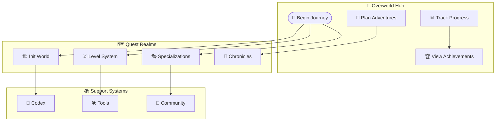
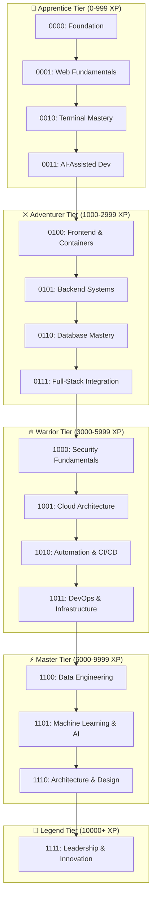
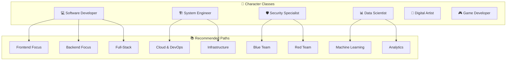

This is your central hub for the IT-Journey quest system — a gamified learning framework with 180+ quests organized across 16 binary levels (0000–1111). Pick a starting realm, choose a character class, and work through progressively harder challenges to build real IT skills.

> *Behold, brave adventurer! This is your personal overworld map — the mystical realm where all paths converge and all journeys begin. Track your progress, plan your next adventures, and survey the vast landscape of IT mastery that awaits.*

## Quest System Overview

```mermaid
graph TB
    subgraph "🏰 Overworld Hub"
        Start([🌟 Begin Journey])
        Progress[📊 Track Progress]
        Plan[🎯 Plan Adventures]
        Achievements[🏆 View Achievements]
    end
    
    subgraph "🗺️ Quest Realms"
        InitWorld[🏗️ Init World]
        Levels[⚔️ Level System]
        Specializations[🎭 Specializations]
        Chronicles[📜 Chronicles]
    end
    
    subgraph "📚 Support Systems"
        Codex[📖 Codex]
        Tools[🛠️ Tools]
        Community[🤝 Community]
    end
    
    Start --> InitWorld
    Start --> Levels
    Start --> Specializations
    Progress --> Achievements
    Plan --> Chronicles
    InitWorld --> Codex
    Levels --> Tools
    Specializations --> Community
```

## World Selection & Character Building

### Choose Your Operating System Realm

| 🌍 Realm | 🎯 Difficulty | 📍 Starting Point | 📊 Progress |
|-----------|---------------|-------------------|-------------|
| 🍎 **macOS Kingdom** | 🟢 Easy | [Hello Mac](/quests/0000/hello-macos/) | [ ] |
| 🪟 **Windows Empire** | 🟡 Medium | [Hello Windows](/quests/0000/hello-windows/) | [ ] |
| 🐧 **Linux Territory** | 🔴 Hard | [Hello Linux](/quests/0000/linux-fundamentals/) | [ ] |
| ☁️ **Cloud Heavens** | ⚔️ Epic | [Hello Cloud](/quests/0000/hello-cloud/) | [ ] |
| 🌱 **Universal n00b** | 🌟 Beginner | [Hello n00b](/quests/0000/hello-noob/) | [ ] |

### Character Class Selection

| 🎭 Character Class | 🎯 Focus Area | 📍 Specialized Paths | 📊 Mastery |
|-------------------|---------------|---------------------|-------------|
| 💻 **Software Developer** | Code Creation & Architecture | Frontend, Backend, Full-Stack | [ ] |
| 🏗️ **System Engineer** | Infrastructure & Operations | DevOps, Cloud, Automation | [ ] |
| 🛡️ **Security Specialist** | Cybersecurity & Protection | Ethical Hacking, Security Ops | [ ] |
| 📊 **Data Scientist** | Analytics & Intelligence | ML, AI, Big Data | [ ] |
| 🎨 **Digital Artist** | UI/UX & Creative Tech | Design Systems, Frontend | [ ] |
| 🎮 **Game Developer** | Interactive Entertainment | Game Engines, Graphics | [ ] |

## Level Progression System

### Complete Level Map

```mermaid
graph TB
    subgraph "🌱 Apprentice Tier (0-999 XP)"
        L0[0000: Foundation]
        L1[0001: Web Fundamentals]
        L2[0010: Terminal Mastery]
        L3[0011: AI-Assisted Dev]
    end
    
    subgraph "⚔️ Adventurer Tier (1000-2999 XP)"
        L4[0100: Frontend & Containers]
        L5[0101: Backend Systems]
        L6[0110: Database Mastery]
        L7[0111: Full-Stack Integration]
    end
    
    subgraph "🔥 Warrior Tier (3000-5999 XP)"
        L8[1000: Security Fundamentals]
        L9[1001: Cloud Architecture]
        L10[1010: Automation & CI/CD]
        L11[1011: DevOps & Infrastructure]
    end
    
    subgraph "⚡ Master Tier (6000-9999 XP)"
        L12[1100: Data Engineering]
        L13[1101: Machine Learning & AI]
        L14[1110: Architecture & Design]
    end
    
    subgraph "👑 Legend Tier (10000+ XP)"
        L15[1111: Leadership & Innovation]
    end
    
    L0 --> L1 --> L2 --> L3
    L3 --> L4 --> L5 --> L6 --> L7
    L7 --> L8 --> L9 --> L10 --> L11
    L11 --> L12 --> L13 --> L14
    L14 --> L15
```

---

## 🌱 Apprentice Tier (Levels 0000-0011)

*Master the fundamentals and discover your path*

### Level 0000 - Foundation & Init World

**Theme:** Digital Awakening | **XP Range:** 0-250

Terminal Mastery & Basic Setup

**Core Objectives:**

- [ ] Master terminal/command line navigation
- [ ] Set up development environment
- [ ] Learn basic file management
- [ ] Configure package managers
- [ ] Understand version control basics

**Available Quests:**

- [ ] [VS Code Mastery Quest](/quests/0000/vscode-mastery/) - *Forge Your Ultimate Development Weapon* (50 XP)
- [ ] [Terminal Fundamentals](/quests/0000/terminal-fundamentals/) - *Command Line Mastery* (40 XP)
- [ ] [Bashcrawl Adventure](/quests/0000/bashcrawl/) - *Browser Dungeon Practice* (40 XP)
- [ ] [Bash-run Extension Lab](/quests/0000/side-quests/bash-run/) - *Terminal Game Scripting* (40 XP)
- [ ] [Begin Your IT Journey](/quests/0000/begin-your-it-journey/) - *The Hero's Call* (30 XP)
- [ ] [Hello n00b](/quests/0000/hello-noob/) - *First Steps* (20 XP)
- [ ] [Git Basics](/quests/0000/git-basics/) - *Version Control Foundation* (40 XP)
- [ ] [Markdown Mastery](/quests/0000/markdown-mastery/) - *Documentation Magic* (30 XP)
- [ ] [Character Building](/quests/0000/character-building/) - *Forge Your Identity* (30 XP)
- [ ] [Character Selection](/quests/0000/character-selection/) - *Choose Your Path* (20 XP)
- [ ] [OS Selection](/quests/0000/os-selection/) - *Pick Your Realm* (20 XP)
- [ ] [IT Fundamentals](/quests/0000/it-fundamentals/) - *Core Concepts* (40 XP)

**Platform-Specific Tracks:**

| Platform | Quest | Status | XP |
|----------|-------|--------|-----|
| 🪟 Windows | [Hello Windows](/quests/0000/hello-windows/) | [ ] | 50 |
| 🍎 macOS | Hello macOS (Coming Soon) | 🔮 | 50 |
| 🐧 Linux | [Hello Linux](/quests/0000/linux-fundamentals/) | [ ] | 50 |
| ☁️ Cloud | Hello Cloud (Coming Soon) | 🔮 | 50 |

### Level 0001 - Web Fundamentals

**Theme:** Building Blocks | **XP Range:** 250-500

Web Technologies & Programming Fundamentals

**Core Objectives:**

- [ ] HTML/CSS fundamentals
- [ ] JavaScript basics
- [ ] Python introduction
- [ ] Version control with Git
- [ ] Deploy first website

**Available Quests:**

- [ ] [Personal Site Creation](/quests/0001/side-quests/personal-site/) - *Build Your Digital Castle* (60 XP)
- [ ] [GitHub Pages Portal](/quests/0001/github-pages-portal/) - *Deploy Your First Website* (50 XP)
- [ ] [GitHub Pages Basics](/quests/0001/github-pages-basics/) - *Static Site Hosting* (40 XP)
- [ ] [Docs in a Row](/quests/0001/docs-in-a-row/) - *Documentation Basics* (40 XP)
- [ ] [Stack Attack](/quests/0001/stack-attack/) - *Understanding Tech Stacks* (30 XP)
- [ ] [Jekyll Fundamentals](/quests/0001/jekyll-fundamentals/) - *Static Site Generation* (50 XP)
- [ ] [Liquid Templating](/quests/0001/liquid-templating/) - *Dynamic Content Magic* (40 XP)
- [ ] [YAML Configuration](/quests/0001/yaml-configuration/) - *Data Structuring* (30 XP)
- [ ] [Git Workflow Mastery](/quests/0001/git-workflow-mastery/) - *Collaboration Patterns* (50 XP)
- [ ] [Kaizen](/quests/0001/kaizen-continuous-improvement/) - *Continuous Improvement* (40 XP)
- [ ] [Stating the Stats](/quests/0001/stating-the-stats/) - *Data Tracking* (30 XP)
- [ ] [Terminal Mastery](/quests/0001/terminal-mastery/) - *Advanced Terminal Skills* (40 XP)
- [ ] [Building Testing Git Init Script](/quests/0001/git-init-testing/) - *Automation Testing* (50 XP)

### Level 0010 - Terminal Mastery

**Theme:** Command Line Arts | **XP Range:** 500-750

Advanced Terminal & Shell Scripting

**Core Objectives:**

- [ ] Advanced shell scripting
- [ ] Terminal customization
- [ ] Regular expressions
- [ ] Remote connections (SSH)
- [ ] Process management

**Available Quests:**

- [ ] [Bash Scripting Mastery](/quests/0010/bash-scripting/) - *Ancient Bash Incantations* (70 XP)
- [ ] [Oh My Zsh Enchantment](/quests/0010/oh-my-zsh-mastery/) - *Transform Your Terminal* (50 XP)
- [ ] [Nerd Font Enchantment](/quests/0010/side-quests/nerd-font-enchantment/) - *Visual Terminal Magic* (30 XP)
- [ ] [Prompt Engineering](/quests/0010/prompt-engineering-mastery/) - *Forge the Prompt Crystal* (40 XP)
- [ ] [Jekyll Mermaid Integration](/quests/0010/jekyll-mermaid-integration/) - *Diagram Magic* (40 XP)
- [ ] [Advanced Markdown](/quests/0010/advanced-markdown/) - *Documentation Mastery* (40 XP)
- [ ] [JavaScript Fundamentals](/quests/0010/javascript-fundamentals/) - *Interactive Web Programming* (60 XP)
- [ ] [CSS Styling Basics](/quests/0010/css-styling-basics/) - *Visual Design Magic* (50 XP)
- [ ] [Bootstrap Framework](/quests/0010/bootstrap-framework/) - *Rapid UI Development* (40 XP)
- [ ] [Terminal Artificer Frontend Building](/quests/0010/side-quests/terminal-artificer/) - *Command Line UI* (50 XP)
- [ ] [Testing Quests with Recursive Questing](/quests/0010/recursive-realms-testing/) - *Quest Validation* (40 XP)

### Level 0011 - AI-Assisted Development

**Theme:** Digital Familiars | **XP Range:** 750-1000

AI Tools & Productivity Workflows

**Core Objectives:**

- [ ] AI pair programming
- [ ] Prompt engineering for code
- [ ] AI-powered debugging
- [ ] Code generation tools
- [ ] Productivity automation

**Available Quests:**

- [ ] [GitHub Code Search Quest](/quests/0011/github-pages-hidden-gem/) - *Master Code Discovery* (50 XP)
- [ ] [VS Code Copilot Mastery](/quests/0011/prompt-crystal-vscode-copilot/) - *AI Pair Programming* (70 XP)
- [ ] [Advanced Git Workflows](/quests/0011/advanced-git-workflows/) - *Version Control Mastery* (60 XP)
- [ ] [Custom Domains](/quests/0011/custom-domains/) - *Professional Web Presence* (40 XP)
- [ ] [SEO Optimization](/quests/0011/seo-optimization/) - *Search Engine Magic* (50 XP)
- [ ] [Analytics Integration](/quests/0011/analytics-integration/) - *Data Tracking* (40 XP)
- [ ] [Jekyll Plugins](/quests/0011/jekyll-plugins/) - *Extending Functionality* (50 XP)

---

## ⚔️ Adventurer Tier (Levels 0100-0111)

*Specialize your craft and build real-world applications*

### Level 0100 - Frontend & Containers

**Theme:** Interface Magic | **XP Range:** 1000-1500

User Interface & Docker Fundamentals

**Core Objectives:**

- [ ] Modern framework mastery (React/Vue)
- [ ] CSS frameworks
- [ ] Docker containerization
- [ ] Build tool proficiency
- [ ] Component architecture

**Available Quests:**

- [ ] [Frontend Fundamentals](/quests/0100/frontend/) - *Digital Presentation Arts* (60 XP)
- [ ] [Frontend Docker](/quests/0100/frontend-docker/) - *Containerized UI Magic* (70 XP)
- [ ] [Sourcery Code Methods](/quests/0100/source-control-sorcery/) - *Advanced Coding Arts* (50 XP)
- [ ] [Container Fundamentals](/quests/0100/container-fundamentals/) - *Docker Basics* (60 XP)
- [ ] [Docker Compose Orchestration](/quests/0100/docker-compose-orchestration/) - *Multi-Container Magic* (70 XP)
- [ ] [Frontend Levels](/quests/0100/frontend-levels/) - *Progressive Learning* (50 XP)
- [ ] [Level 000 Frontend Docker](/quests/0100/frontend-docker-000/) - *Beginner Containers* (40 XP)
- [ ] [Level 001 Frontend Docker](/quests/0100/001-frontend-docker/) - *Intermediate Containers* (50 XP)
- [ ] [Level 010 Frontend Docker](/quests/0100/010-frontend-docker/) - *Advanced Containers* (60 XP)

### Level 0101 - Backend Systems

**Theme:** Server Sorcery | **XP Range:** 1500-2000

Server-Side Development & APIs

**Core Objectives:**

- [ ] Server-side programming
- [ ] RESTful API design
- [ ] Database connectivity
- [ ] Authentication basics
- [ ] API documentation

**Available Quests:**

- [ ] [Docker Mastery Example](/quests/0101/docker-mastery/) - *Advanced Container Patterns* (70 XP)
- [ ] [LazyTeX CV Building](/quests/0101/latex-cv-forging/) - *Document Automation* (50 XP)
- [ ] [CI/CD Fundamentals](/quests/0101/cicd-fundamentals/) - *Continuous Integration Basics* (60 XP)
- [ ] [GitHub Actions Basics](/quests/0101/github-actions-basics/) - *Workflow Automation* (60 XP)
- [ ] [Deployment Pipelines](/quests/0101/deployment-pipelines/) - *Automated Deployments* (70 XP)
- [ ] [Environment Management](/quests/0101/environment-management/) - *Configuration Control* (50 XP)
- [ ] [Secrets Management](/quests/0101/secrets-management/) - *Secure Configuration* (50 XP)
- [ ] [Artifact Management](/quests/0101/artifact-management/) - *Build Outputs* (40 XP)
- [ ] [Testing Integration](/quests/0101/testing-integration/) - *Automated Testing* (60 XP)
- [ ] [Workflow Optimization](/quests/0101/workflow-optimization/) - *Pipeline Efficiency* (50 XP)

### Level 0110 - Database Mastery

**Theme:** Data Vaults | **XP Range:** 2000-2500

Data Storage & Retrieval

**Core Objectives:**

- [ ] SQL fundamentals
- [ ] NoSQL databases
- [ ] Data modeling
- [ ] Query optimization
- [ ] Database administration

**Available Quests:**

- [ ] [Database Fundamentals](/quests/0110/database-fundamentals/) - *Data Storage Basics* (60 XP)
- [ ] [SQL Mastery](/quests/0110/sql-mastery/) - *Query Language Power* (70 XP)
- [ ] [Data Modeling](/quests/0110/data-modeling/) - *Structure Design* (60 XP)
- [ ] [Query Optimization](/quests/0110/query-optimization/) - *Performance Tuning* (70 XP)
- [ ] [Database Migrations](/quests/0110/database-migrations/) - *Schema Evolution* (50 XP)
- [ ] [Database Security](/quests/0110/database-security/) - *Access Control* (60 XP)
- [ ] [Connection Pooling](/quests/0110/connection-pooling/) - *Resource Management* (40 XP)
- [ ] [Backup Recovery](/quests/0110/backup-recovery/) - *Data Protection* (50 XP)

### Level 0111 - Full-Stack Integration

**Theme:** Bridge Building | **XP Range:** 2500-3000

Complete Application Development

**Core Objectives:**

- [ ] Frontend-backend integration
- [ ] Authentication & authorization
- [ ] State management
- [ ] Real-time features
- [ ] Performance optimization

**Available Quests:**

- [ ] [API Fundamentals](/quests/0111/api-fundamentals/) - *Service Communication* (60 XP)
- [ ] [REST Principles](/quests/0111/rest-principles/) - *RESTful Design* (50 XP)
- [ ] [API Authentication](/quests/0111/api-authentication/) - *Security Keys* (70 XP)
- [ ] [API Documentation](/quests/0111/api-documentation/) - *Clear Contracts* (40 XP)
- [ ] [API Versioning](/quests/0111/api-versioning/) - *Evolution Management* (50 XP)
- [ ] [Error Handling](/quests/0111/error-handling/) - *Graceful Failures* (50 XP)
- [ ] [Rate Limiting](/quests/0111/rate-limiting/) - *Traffic Control* (40 XP)

---

## 🔥 Warrior Tier (Levels 1000-1011)

*Master advanced skills and production systems*

### Level 1000 - Cloud Fundamentals

**Theme:** Sky Infrastructure | **XP Range:** 3000-3750

Cloud Computing Basics

**Core Objectives:**

- [ ] Cloud computing concepts
- [ ] Infrastructure as Code
- [ ] Cloud providers basics
- [ ] Serverless computing
- [ ] Cloud security

**Available Quests:**

- [ ] [Cloud Computing Fundamentals](/quests/1000/cloud-computing-fundamentals/) - *Understanding the Cloud* (60 XP)
- [ ] [Infrastructure as Code](/quests/1000/infrastructure-as-code/) - *Code-Based Infrastructure* (70 XP)
- [ ] [AWS Essentials](/quests/1000/aws-essentials/) - *Amazon Web Services* (80 XP)

### Level 1001 - Kubernetes & Orchestration

**Theme:** Container Orchestration | **XP Range:** 3750-4500

Kubernetes & Container Management

**Core Objectives:**

- [ ] Kubernetes fundamentals
- [ ] Pod and workload management
- [ ] Services and networking
- [ ] Configuration and secrets
- [ ] Cluster operations

**Available Quests:**

- [ ] [Kubernetes Fundamentals](/quests/1001/kubernetes-fundamentals/) - *Container Orchestration Basics* (80 XP)
- [ ] [K8s Pods & Workloads](/quests/1001/k8s-pods-workloads/) - *Managing Applications* (70 XP)
- [ ] [K8s Services & Networking](/quests/1001/k8s-services-networking/) - *Cluster Communication* (70 XP)
- [ ] [K8s Config & Secrets](/quests/1001/k8s-config-secrets/) - *Configuration Management* (60 XP)

### Level 1010 - Automation & CI/CD

**Theme:** Spell Automation | **XP Range:** 4500-5250

Testing & Continuous Integration

**Core Objectives:**

- [ ] Unit testing mastery
- [ ] Integration testing
- [ ] CI/CD pipelines
- [ ] Test-driven development
- [ ] Automated deployments

**Available Quests:**

- [ ] [Link to the Future](/quests/1010/automated-hyperlink-guardian/) - *Automated Validation* (70 XP)
- [ ] [Monitoring Fundamentals](/quests/1010/monitoring-fundamentals/) - *System Observability* (60 XP)
- [ ] [Prometheus & Grafana](/quests/1010/prometheus-grafana/) - *Metrics & Dashboards* (80 XP)
- [ ] [ELK Stack](/quests/1010/elk-stack/) - *Elasticsearch, Logstash, Kibana* (90 XP)
- [ ] [Distributed Tracing](/quests/1010/distributed-tracing/) - *Request Tracking* (70 XP)
- [ ] [Alerting Systems](/quests/1010/alerting-systems/) - *Incident Detection* (60 XP)

### Level 1011 - DevOps & Infrastructure

**Theme:** System Forging | **XP Range:** 5250-6000

Infrastructure & Operations

**Core Objectives:**

- [ ] Container orchestration
- [ ] Infrastructure as Code
- [ ] Monitoring & observability
- [ ] Log management
- [ ] Incident response

**Available Quests:**

- [ ] [Feature Re-Quest](/quests/1011/ai-feature-pipeline-architect/) - *Feature Workflows* (60 XP)
- [ ] [Security Fundamentals](/quests/1011/security-fundamentals/) - *Cybersecurity Basics* (70 XP)
- [ ] [Secure Coding](/quests/1011/secure-coding/) - *Defensive Programming* (80 XP)
- [ ] [Threat Modeling](/quests/1011/threat-modeling/) - *Risk Assessment* (70 XP)
- [ ] [Penetration Testing](/quests/1011/penetration-testing/) - *Ethical Hacking* (90 XP)
- [ ] [Compliance Standards](/quests/1011/compliance-standards/) - *Regulatory Requirements* (60 XP)

---

## ⚡ Master Tier (Levels 1100-1110)

*Achieve expertise and design complex systems*

### Level 1100 - Data Engineering

**Theme:** Information Alchemy | **XP Range:** 6000-7000

Data Pipelines & Analytics

**Core Objectives:**

- [ ] ETL pipeline design
- [ ] Data warehousing
- [ ] Stream processing
- [ ] Data quality
- [ ] Analytics infrastructure

**Available Quests:**

- [ ] [EDGAR API Integration](/quests/1100/conquer-king-edgar/) - *Financial Data Access* (70 XP)
- [ ] [SEC EDGAR Deep Dive](/quests/1100/sec-edgar-siege/) - *Advanced Financial Analysis* (80 XP)
- [ ] [Temple of Templates](/quests/1100/temple-of-templates/) - *Reusable Systems* (60 XP)
- [ ] [ETL Pipeline Design](/quests/1100/etl-pipeline-design/) - *Data Transformation* (80 XP)
- [ ] [Data Warehousing](/quests/1100/data-warehousing/) - *Grand Data Library* (90 XP)
- [ ] [Stream Processing](/quests/1100/stream-processing/) - *Real-time Data Rivers* (80 XP)
- [ ] [Apache Spark Mastery](/quests/1100/apache-spark/) - *Big Data Processing* (100 XP)
- [ ] [Data Quality Engineering](/quests/1100/data-quality/) - *Information Integrity* (70 XP)

### Level 1101 - Machine Learning & AI

**Theme:** Digital Intelligence | **XP Range:** 7000-8500

AI & Machine Learning

**Core Objectives:**

- [ ] ML fundamentals
- [ ] Neural networks
- [ ] Natural language processing
- [ ] Computer vision
- [ ] MLOps

**Available Quests:**

- [ ] [Machine Learning Fundamentals](/quests/1101/ml-fundamentals/) - *Teaching Machines to Learn* (80 XP)
- [ ] [Python for Data Science](/quests/1101/python-data-science/) - *Pythonic Prophecies* (70 XP)
- [ ] [Neural Networks Deep Dive](/quests/1101/neural-networks/) - *Digital Brain Construction* (100 XP)
- [ ] [Deep Learning Frameworks](/quests/1101/deep-learning-frameworks/) - *TensorFlow & PyTorch* (90 XP)
- [ ] [Natural Language Processing](/quests/1101/natural-language-processing/) - *Understanding Speech* (90 XP)
- [ ] [Computer Vision Mastery](/quests/1101/computer-vision/) - *Machine Sight* (90 XP)
- [ ] [MLOps Engineering](/quests/1101/mlops/) - *Deploying Intelligence* (80 XP)
- [ ] [AI Ethics and Responsible AI](/quests/1101/side-quests/ai-ethics/) - *Responsible Creation* (50 XP)

### Level 1110 - Architecture & Design

**Theme:** Master Builder | **XP Range:** 8500-10000

System Architecture & Design Patterns

**Core Objectives:**

- [ ] Design patterns
- [ ] Microservices
- [ ] Event-driven architecture
- [ ] Domain-driven design
- [ ] System design

**Available Quests:**

- [ ] [404 Hunting Quest](/quests/1110/404-hunting-quest/) - *Error Handling Mastery* (60 XP)
- [ ] [Software Design Patterns](/quests/1110/design-patterns/) - *Architectural Blueprints* (90 XP)
- [ ] [Microservices Architecture](/quests/1110/microservices-architecture/) - *Distributed Kingdoms* (100 XP)
- [ ] [Event-Driven Architecture](/quests/1110/event-driven-design/) - *Reactive Systems* (80 XP)
- [ ] [Domain-Driven Design](/quests/1110/domain-driven-design/) - *Business Logic Mastery* (90 XP)
- [ ] [System Design Interview Mastery](/quests/1110/system-design-interviews/) - *Architect Certification* (100 XP)
- [ ] [API Gateway Patterns](/quests/1110/api-gateway-patterns/) - *Traffic Control* (70 XP)
- [ ] [Scaling Strategies](/quests/1110/scaling-strategies/) - *Handling Growth* (80 XP)

---

## 👑 Legend Tier (Level 1111)

*Lead, innovate, and create lasting impact*

### Level 1111 - Leadership & Innovation

**Theme:** Realm Shaper | **XP Range:** 10000+

Technical Leadership & Industry Impact

**Core Objectives:**

- [ ] Technical leadership
- [ ] Open source contribution
- [ ] Tech speaking & writing
- [ ] Mentorship
- [ ] Innovation & R&D

**Available Quests:**

- [ ] [Technical Leadership](/quests/1111/technical-leadership/) - *Leading the Guild* (100 XP)
- [ ] [Open Source Contribution](/quests/1111/open-source-contribution/) - *Community Building* (120 XP)
- [ ] [Tech Speaking and Writing](/quests/1111/tech-speaking-writing/) - *Spreading Knowledge* (80 XP)
- [ ] [Mentorship Programs](/quests/1111/mentorship-programs/) - *Training the Next Generation* (100 XP)
- [ ] [Innovation and R&D](/quests/1111/innovation-rnd/) - *Pushing Boundaries* (150 XP)
- [ ] [Architecture Reviews](/quests/1111/architecture-reviews/) - *System Evaluation* (100 XP)
- [ ] [Building Technical Communities](/quests/1111/building-technical-communities/) - *Guild Formation* (100 XP)
- [ ] [Career Advancement Strategies](/quests/1111/career-advancement/) - *Creating Lasting Impact* (100 XP)

## Character Class Paths

### 🎭 Choose Your Specialization

*Select your primary class based on your interests and career goals*

```mermaid
graph TB
    subgraph "🎯 Character Classes"
        DEV[💻 Software Developer]
        ENG[🏗️ System Engineer]
        SEC[🛡️ Security Specialist]
        DATA[📊 Data Scientist]
        ART[🎨 Digital Artist]
        GAME[🎮 Game Developer]
    end
    
    subgraph "📚 Recommended Paths"
        DEV --> FE[Frontend Focus]
        DEV --> BE[Backend Focus]
        DEV --> FS[Full-Stack]
        
        ENG --> CLOUD[Cloud & DevOps]
        ENG --> INFRA[Infrastructure]
        
        SEC --> BLUE[Blue Team]
        SEC --> RED[Red Team]
        
        DATA --> ML[Machine Learning]
        DATA --> ANALYTICS[Analytics]
    end
```

### 💻 Software Developer Path

**Core Levels:** 0000 → 0001 → 0100 → 0101 → 0110 → 0111

**Specialization Options:**
- **Frontend Focus:** React/Vue/Angular mastery
- **Backend Focus:** Node.js/Python/Java expertise
- **Full-Stack:** End-to-end application development

**Recommended Quests by Phase:**
1. **Foundation:** VS Code Mastery, Personal Site, GitHub Pages
2. **Building:** Frontend Fundamentals, Docker, API Design
3. **Integration:** Full-Stack Project, Database Mastery
4. **Mastery:** Architecture & Design, Microservices

### 🏗️ System Engineer Path

**Core Levels:** 0000 → 0010 → 1001 → 1010 → 1011

**Specialization Options:**
- **Cloud Architect:** AWS/Azure/GCP platforms
- **DevOps Engineer:** CI/CD, automation, Kubernetes
- **Infrastructure:** Networking, systems administration

**Recommended Quests by Phase:**
1. **Foundation:** Terminal Mastery, Bash Scripting
2. **Automation:** CI/CD Pipelines, GitHub Actions
3. **Cloud:** Cloud Architecture, IaC with Terraform
4. **Operations:** Kubernetes, Monitoring, Incident Response

### 🛡️ Security Specialist Path

**Core Levels:** 0000 → 0010 → 1000 → 1001 → 1010

**Specialization Options:**
- **Blue Team:** Defense, monitoring, incident response
- **Red Team:** Penetration testing, vulnerability assessment
- **Compliance:** Security auditing, regulatory frameworks

**Recommended Quests by Phase:**
1. **Foundation:** Terminal Mastery, Networking Basics
2. **Security Core:** OWASP Top 10, Secure Coding
3. **Specialization:** Pen Testing or Defense Strategy
4. **Leadership:** Security Architecture, Compliance

### 📊 Data Scientist Path

**Core Levels:** 0000 → 0011 → 0110 → 1100 → 1101

**Specialization Options:**
- **Machine Learning:** Neural networks, deep learning
- **Analytics:** Business intelligence, visualization
- **Data Engineering:** Pipelines, warehousing

**Recommended Quests by Phase:**
1. **Foundation:** Python Basics, Statistics
2. **Data:** SQL Mastery, Database Design
3. **Analysis:** Data Engineering, ETL Pipelines
4. **AI:** Machine Learning, Neural Networks

### 🎨 Digital Artist / Creative Developer Path

**Core Levels:** 0000 → 0001 → 0100 → 0111

**Specialization Options:**
- **UI/UX Design:** User experience, interface design
- **Web Animation:** Motion graphics, interactive media
- **3D Web:** WebGL, Three.js, immersive experiences

### 🎮 Game Developer Path

**Core Levels:** 0000 → 0001 → 0011 → 0100 → 0111

**Specialization Options:**
- **Web Games:** Browser-based game development
- **Game Engine:** Unity, Unreal, Godot integration
- **Multiplayer:** Networking, real-time systems

---

## Init World - Character Creation Hub

### Foundation Quests

Essential Starting Adventures

- [ ] [VS Code Mastery Quest](/quests/0000/vscode-mastery/) - *Forge Your Ultimate Development Weapon*
- [ ] [Begin Your IT Journey](/quests/0000/begin-your-it-journey/) - *The Hero's Call*
- [ ] [Character Building](/quests/0000/character-building/) - *Forge Your Identity*
- [ ] [IT Fundamentals](/quests/0000/it-fundamentals/) - *Ancient Arts Foundation*
- [ ] [Character Selection](/quests/0000/character-selection/) - *Choose Your Destiny*
- [ ] [OS Selection](/quests/0000/os-selection/) - *Pick Your Realm*

### Quick Start Paths by Class

Fast Track Adventures

#### 💻 Developer Quick Start
1. [Hello n00b](/quests/0000/hello-noob/) - First Steps
2. [VS Code Mastery](/quests/0000/vscode-mastery/) - Tool Setup
3. [Personal Site](/quests/0001/side-quests/personal-site/) - First Project

#### 🏗️ Engineer Quick Start
1. [Terminal Fundamentals](/quests/0000/terminal-fundamentals/) - Terminal Basics
2. [Bashcrawl Adventure](/quests/0000/bashcrawl/) - Browser command practice
3. [Bash-run Extension Lab](/quests/0000/side-quests/bash-run/) - Local Bash project extension
4. [Bash Scripting](/quests/0010/bash-scripting/) - Automation

#### 🛡️ Security Quick Start
1. [Terminal Mastery](/quests/0000/) - Command Line Foundation
2. [GitHub Security](/quests/0011/) - AI-Assisted Security
3. Security Fundamentals (Level 1000) - Defense Training

#### 📊 Data Science Quick Start
1. [Python Basics](/quests/0001/) - Programming Foundation
2. [AI Tools](/quests/0011/prompt-crystal-vscode-copilot/) - AI Assistance
3. [EDGAR Quest](/quests/1100/conquer-king-edgar/) - Data Analysis

### Platform-Specific Paths

#### 🪟 Windows Heroes - "pshero"

- [ ] PowerShell mastery
- [ ] WinGet package management
- [ ] Windows Terminal customization
- [ ] Visual Studio integration

#### 🍎 Mac Champions - "machero"

- [ ] iTerm2 enhancement
- [ ] Homebrew package management
- [ ] Xcode command line tools
- [ ] macOS development setup

#### 🐧 Linux Warriors - "bashero"

- [ ] Shell scripting mastery
- [ ] Package manager fluency
- [ ] System administration
- [ ] Open source contribution

#### ☁️ Cloud Wanderers - "chero"

- [ ] Multi-cloud platform basics
- [ ] Infrastructure as Code
- [ ] Container orchestration
- [ ] Serverless computing

## Chronicle System - Recent Adventures

### 2025 AI-Enhanced Quest Series

Latest Magical Discoveries

#### Tools & Workflows Collection

Advanced productivity and workflow mastery quests:

- [ ] [Django & Git Mastery](/quests/0010/django-and-git/) - *Web Framework Sorcery* (70 XP)
- [ ] [Action Triggers](/quests/0010/action-triggers/) - *Automation Spell Casting* (50 XP)
- [ ] [Branches & Pull Requests](/quests/0010/branches-and-pull-requests/) - *Version Control Mastery* (60 XP)
- [ ] [Change Log Chronicles](/quests/0010/change-logs/) - *Document Your Journey* (40 XP)
- [ ] [Clean Commit Commitments](/quests/0010/commitments-to-clean-commits/) - *Perfect Git Rituals* (50 XP)
- [ ] [AI Automation Revolution](/quests/0010/revolutionizing-work-with-ai-automation/) - *Summon AI Familiars* (80 XP)
- [ ] [Planting Seeds](/quests/0010/planting-seeds/) - *Project Initialization* (40 XP)
- [ ] [Epic Quest: Zer0 to Her0 CM Style](/quests/0010/epic-quest-zer0-to-her0-cmstyle/) - *Complete Journey* (200 XP)

#### Featured Chronicles

- [ ] [Sourcery Code Methods](/quests/0100/source-control-sorcery/) - *Advanced Coding Arts* (50 XP)
- [ ] [Siege of King EDGAR: Storming the SEC Data Castle](/quests/1100/sec-edgar-siege/) - *Data Liberation Trail* (80 XP)

## Essential Equipment & Spell Components

### Core Development Arsenal

Universal Tools for All Classes

#### Cross-Platform Essentials

- [ ] **VS Code** - *Primary IDE Mastery* → [VS Code Mastery Quest](/quests/0000/vscode-mastery/)
- [ ] **Git** - *Version Control Magic*
- [ ] **Docker** - *Container Summoning*
- [ ] **Terminal** - *Command Line Mastery*

#### Technology Stacks

Proven Magical Combinations

- [ ] **LAMP Stack** - *Linux, Apache, MySQL, PHP*
- [ ] **JAM Stack** - *JavaScript, APIs, Markup*
- [ ] **MEAN Stack** - *MongoDB, Express, Angular, Node*
- [ ] **Container Stack** - *Docker, Kubernetes, Microservices*

## Main Quest Lines

### Primary Adventures

Epic Campaign Objectives

1. [ ] **Build Your Digital Castle**
   - [ ] Master your IDE with [VS Code Mastery Quest](/quests/0000/vscode-mastery/)
   - [ ] Set up development environment
   - [ ] Configure essential tools
   - [ ] Establish workflow processes
   - [ ] Create backup & recovery systems

2. [ ] **Git Your Shit Together**
   - [ ] Master version control fundamentals
   - [ ] Learn collaborative development
   - [ ] Implement CI/CD pipelines
   - [ ] Practice code review processes

3. [ ] **Summon AI Familiars**
   - [ ] Integrate AI development tools
   - [ ] Automate repetitive tasks
   - [ ] Enhance productivity workflows
   - [ ] Learn AI-assisted development

4. [ ] **Ascend to the Cloud**
   - [ ] Deploy applications to cloud platforms
   - [ ] Implement scalable architectures
   - [ ] Master container orchestration
   - [ ] Practice cloud security

5. [ ] **Secure Your Realm**
   - [ ] Implement security best practices
   - [ ] Learn threat assessment
   - [ ] Practice incident response
   - [ ] Master compliance requirements

## Achievement System

### Skill Badges & Certifications

Proof of Your Growing Power

#### Development Achievements

- [ ] **First Pull Request** - *Make your inaugural contribution*
- [ ] **Bug Slayer** - *Fix critical system issues*
- [ ] **Test Conjurer** - *Achieve 100% test coverage*
- [ ] **Performance Optimizer** - *Significantly improve application speed*
- [ ] **Documentation Sage** - *Create comprehensive project documentation*

#### Security Achievements

- [ ] **Security Guardian** - *Implement robust security measures*
- [ ] **Ethical Hacker** - *Complete penetration testing challenges*
- [ ] **Compliance Master** - *Achieve industry certification*

#### Leadership Achievements

- [ ] **Mentor** - *Guide fellow adventurers*
- [ ] **Open Source Contributor** - *Make significant project contributions*
- [ ] **Community Builder** - *Foster learning communities*

## Codex & Reference Materials

### Navigation & Knowledge Base

Your Mystical Library

- [ ] [World Map](/quests/codex/world-map/) - *Navigate All Realms*
- [ ] [Glossary](/quests/codex/glossary/) - *Dictionary of Digital Spells*
- [ ] [Quest Index](/quests/) - *Complete Adventure Catalog*

### Learning Resources

Wisdom from the Masters

#### Documentation Libraries

- [ ] [PowerShell Docs](https://docs.microsoft.com/en-us/powershell/)
- [ ] [Microsoft Learn](https://docs.microsoft.com/en-us/learn/)
- [ ] [VS Code Documentation](https://code.visualstudio.com/docs)

#### Tutorial Systems

- [ ] [MkDocs](https://www.mkdocs.org/) - *Documentation Generation*
- [ ] [Docusaurus](https://docusaurus.io/) - *Modern Documentation Platform*

## Progress Tracking Dashboard

### Current Adventure Status

Track Your Journey Through All 16 Binary Levels

| Tier | Level Range | Status | Quests | XP Available |
|------|-------------|--------|--------|--------------|
| 🌱 **Apprentice** | 0000-0011 | [ ] Not Started | 42 | 0-1000 |
| ⚔️ **Adventurer** | 0100-0111 | [ ] Locked | 34 | 1000-3000 |
| 🔥 **Warrior** | 1000-1011 | [ ] Locked | 19 | 3000-6000 |
| ⚡ **Master** | 1100-1110 | [ ] Locked | 24 | 6000-10000 |
| 👑 **Legend** | 1111 | [ ] Locked | 8 | 10000+ |
| **Total** | 16 Levels | | 127 Quests | ∞ XP |

### Detailed Level Progress

| Level | Theme | Quests Completed | Available Quests | Status |
|-------|-------|------------------|------------------|--------|
| 0000 | Foundation | 0/11 | 11 | [ ] |
| 0001 | Web Fundamentals | 0/13 | 13 | [ ] |
| 0010 | Terminal Mastery | 0/11 | 11 | [ ] |
| 0011 | AI-Assisted Dev | 0/7 | 7 | [ ] |
| 0100 | Frontend & Containers | 0/9 | 9 | [ ] |
| 0101 | Backend Systems | 0/10 | 10 | [ ] |
| 0110 | Database Mastery | 0/8 | 8 | [ ] |
| 0111 | Full-Stack Integration | 0/7 | 7 | [ ] |
| 1000 | Cloud Fundamentals | 0/3 | 3 | [ ] |
| 1001 | Kubernetes & Orchestration | 0/4 | 4 | [ ] |
| 1010 | Monitoring & Observability | 0/6 | 6 | [ ] |
| 1011 | Security & DevOps | 0/6 | 6 | [ ] |
| 1100 | Data Engineering | 0/8 | 8 | [ ] |
| 1101 | Machine Learning & AI | 0/8 | 8 | [ ] |
| 1110 | Architecture & Design | 0/8 | 8 | [ ] |
| 1111 | Leadership & Innovation | 0/8 | 8 | [ ] |

**Legend:** [ ] Available

### Level Progression Visualization

```mermaid
graph TB
    subgraph "🌱 Apprentice Tier"
        direction LR
        L0[0000<br/>Foundation<br/>0/15] --> L1[0001<br/>Web<br/>0/12]
        L1 --> L2[0010<br/>Terminal<br/>0/12]
        L2 --> L3[0011<br/>AI<br/>0/9]
    end
    
    subgraph "⚔️ Adventurer Tier"
        direction LR
        L4[0100<br/>Frontend<br/>0/12] --> L5[0101<br/>Backend<br/>0/10]
        L5 --> L6[0110<br/>Database<br/>🔮]
        L6 --> L7[0111<br/>Full-Stack<br/>🔮]
    end
    
    subgraph "🔥 Warrior Tier"
        direction LR
        L8[1000<br/>Security<br/>🔮] --> L9[1001<br/>Cloud<br/>🔮]
        L9 --> L10[1010<br/>CI/CD<br/>0/9]
        L10 --> L11[1011<br/>DevOps<br/>0/9]
    end
    
    subgraph "⚡ Master Tier"
        direction LR
        L12[1100<br/>Data<br/>0/8] --> L13[1101<br/>ML/AI<br/>0/8]
        L13 --> L14[1110<br/>Architecture<br/>0/8]
    end
    
    subgraph "👑 Legend Tier"
        L15[1111<br/>Leadership<br/>0/8]
    end
    
    L3 --> L4
    L7 --> L8
    L11 --> L12
    L14 --> L15
    
    style L0 fill:#90EE90
    style L1 fill:#90EE90
    style L2 fill:#90EE90
    style L3 fill:#90EE90
```

### Character Progress Summary

| Metric | Value | Target |
|--------|-------|--------|
| 📊 Current Level | 0000 | 1111 |
| ⭐ Total XP | 0 | 10,000+ |
| 🎯 Quests Completed | 0 | 99+ |
| 🏆 Badges Earned | 0 | 50+ |
| 📅 Days Active | 0 | - |
| 🔥 Current Streak | 0 | - |

### Next Recommended Actions

Based on your current progress:

1. **Start Here:** [Hello n00b](/quests/0000/hello-noob/) - Begin your journey
2. **Then:** [VS Code Mastery](/quests/0000/vscode-mastery/) - Set up your tools
3. **Next:** [Terminal Fundamentals](/quests/0000/terminal-fundamentals/) - Learn the terminal
4. **Practice:** [Bashcrawl Adventure](/quests/0000/bashcrawl/) - Reinforce commands through play
5. **Goal:** Complete Apprentice Tier (Levels 0000-0011)

## Community & Support

### Getting Help

When You're Stuck on a Quest

- 📖 **Research**: Check [Glossary](/quests/codex/glossary/) for term definitions
- 🗺️ **Navigate**: Consult [World Map](/quests/codex/world-map/) for orientation
- 💬 **Discuss**: Join community discussions via Giscus comments
- 🐛 **Report**: Submit issues or suggestions via GitHub Issues
- 🤝 **Collaborate**: Connect with fellow adventurers in the community

### Quest Contribution

Become a Quest Creator

Interested in adding your own adventures to the quest system?
Follow the [contribution guidelines](/quests/#contributing-to-the-quest-realm) to:

1. Share your learning journey
2. Create new quest content
3. Improve existing adventures
4. Help fellow adventurers

---

## Explore Other IT-Journey Collections

The quest system is one part of the IT-Journey platform. These collections complement your learning:

| Collection | What It Is |
|------------|------------|
| [📘 Quick Start Guide](/quickstart/) | Step-by-step setup — machine config, Jekyll, GitHub, VS Code, deployment, CI/CD |
| [📚 Docs Library](/docs/) | Reference documentation — terminal shortcuts, Bash, Jekyll config, Liquid, Mermaid, MathJax |
| [📝 Notes](/notes/) | Working notes, code snippets, and quick references collected during development |
| [📰 Blog Posts](/posts/) | Tutorials, AI development chronicles, and technical write-ups across 10 categories |

---

*Remember, noble adventurer: This overworld map grows with your journey.
Check back regularly to track your progress, plan new adventures, and celebrate your achievements.
Every checkbox you mark is a step closer to IT mastery!*

**Ready to begin your next quest? Choose your path and let the adventure continue!** ⚔️✨

## 🧭 Quest Index (Auto-Generated)

<!-- QUEST_INDEX:START -->
_This section is auto-generated. Do not edit manually._
_Last generated: 2026-01-15T20:39:18Z_

**Total quests:** 144

### Level 0000

| Quest | Type | Difficulty | Time | Series | Status |
| --- | --- | --- | --- | --- | --- |
| [bashrun and Beyond: Building an Advanced Terminal Game](/quests/0000/side-quests/bash-run/) | side_quest | 🟡 Medium | 90-120 minutes | Level 000 - Foundation Skills | ✅ Complete |
| [Begin your IT Journey](/quests/0000/begin-your-it-journey/) | main_quest | 🟢 Easy | 30-45 minutes | Level 0000 Quest Line | 🔮 Draft |
| [Character Building: Forge Your IT Identity and Development Environment](/quests/0000/character-building/) | main_quest | 🟢 Easy | 45-60 minutes | Init World - Character Creation | ✅ Complete |
| [Character Selection](/quests/0000/character-selection/) | main_quest | 🟢 Easy | 20-30 minutes | Level 0000 Quest Line | 🔮 Draft |
| [Git Basics: Version Control Introduction](/quests/0000/git-basics/) | main_quest | 🟢 Easy | 60-75 minutes | Version Control Mastery | 🔮 Draft |
| [Hello Cloud: First Steps into the Sky Realm](/quests/0000/hello-cloud/) | main_quest | ⚔️ Epic | 120-180 minutes | Init World - Platform Mastery | ✅ Complete |
| [Hello macOS: Setting Up the Apple Kingdom](/quests/0000/hello-macos/) | main_quest | 🟢 Easy | 60-90 minutes | Init World - Platform Mastery | ✅ Complete |
| [Hello n00b: Your First Steps into the IT Journey](/quests/0000/hello-noob/) | main_quest | 🟢 Easy | 15-30 minutes | Character Creation Journey | ✅ Complete |
| [Hello Windows: Mastering the Windows Development Environment](/quests/0000/hello-windows/) | main_quest | 🟡 Medium | 90-120 minutes | Init World - Platform Mastery | ✅ Complete |
| [IT Fundamentals](/quests/0000/it-fundamentals/) | main_quest | 🟢 Easy | 60-90 minutes | Level 0000 Quest Line | 🔮 Draft |
| [Linux Fundamentals](/quests/0000/linux-fundamentals/) | main_quest | 🟡 Medium | 60-90 minutes | Level 0000 Quest Line | ✅ Complete |
| [Markdown Mastery: Content Formatting Fundamentals](/quests/0000/markdown-mastery/) | main_quest | 🟢 Easy | 30-45 minutes | Content Creation Basics | 🔮 Draft |
| [OS Selection](/quests/0000/os-selection/) | main_quest | 🟢 Easy | 30-45 minutes | Level 0000 Quest Line | 🔮 Draft |
| [Terminal Fundamentals: Command Line Navigation Quest](/quests/0000/terminal-fundamentals/) | main_quest | 🟢 Easy | 45-60 minutes | Terminal Arts | 🔮 Draft |
| [VS Code Mastery Quest: Forge Your Ultimate Development Weapon](/quests/0000/vscode-mastery/) | main_quest | 🟢 Easy | 45 minutes | Level 0000 Quest Line | ✅ Complete |

### Level 0001

| Quest | Type | Difficulty | Time | Series | Status |
| --- | --- | --- | --- | --- | --- |
| [Building & Testing the Git Init Script: Headless, Interactive, Scaffolding](/quests/0001/git-init-testing/) | main_quest | 🟢 Easy | 45-75 minutes | Level 0001 Quest Line | ✅ Complete |
| [Forging the Stats Portal: Data Analytics Quest](/quests/0001/stating-the-stats/) | main_quest | 🟢 Easy | 60-90 minutes | Jekyll Site Building | ✅ Complete |
| [Git Workflow Mastery: Branches, Merging & Team Collaboration](/quests/0001/git-workflow-mastery/) | main_quest | 🟢 Easy | 60-75 minutes | Version Control Mastery | 🔮 Draft |
| [GitHub Pages Basics: Deploy Free Websites in Minutes](/quests/0001/github-pages-basics/) | main_quest | 🟢 Easy | 60-75 minutes | Web Hosting Fundamentals | 🔮 Draft |
| [Jekyll Fundamentals: Build Static Sites with Ruby](/quests/0001/jekyll-fundamentals/) | main_quest | 🟢 Easy | 75-90 minutes | Static Site Mastery | 🔮 Draft |
| [Kaizen Quest: The Path of Continuous Improvement in Software Alchemy](/quests/0001/kaizen-continuous-improvement/) | main_quest | 🟡 Medium | 90-120 minutes | Process Mastery Path | ✅ Complete |
| [Liquid Templating: Dynamic Content for Jekyll Sites](/quests/0001/liquid-templating/) | main_quest | 🟢 Easy | 45-60 minutes | Static Site Mastery | 🔮 Draft |
| [Personal Site](/quests/0001/side-quests/personal-site/) | side_quest | 🟢 Easy | 45-60 minutes | Level 0001 Quest Line | ✅ Complete |
| [Stack Attack Analysis: IT-Journey](/quests/0001/side-quests/it-journey-stack-analysis/) | side_quest | 🟢 Easy | 60-90 minutes | Level 0001 Quest Line | ✅ Complete |
| [Stack Attack: Deciphering the Technology Matrix](/quests/0001/stack-attack/) | main_quest | 🟡 Medium | 90-120 minutes | Repository Mastery Path | ✅ Complete |
| [Technology Stack Analysis: Barodybroject](/quests/0001/side-quests/barodybroject-stack-analysis/) | side_quest | 🟢 Easy | 60-90 minutes | Level 0001 Quest Line | ✅ Complete |
| [Terminal Mastery: Conquering the Command-Line Realm](/quests/0001/terminal-mastery/) | main_quest | 🟢 Easy | 45-90 minutes | Foundation Path: Digital Literacy Mastery | ✅ Complete |
| [The GitHub Pages Portal: Forging Your Digital Realm](/quests/0001/github-pages-portal/) | main_quest | 🟢 Easy | 2-4 hours | Web Development Fundamentals | ✅ Complete |
| [The Knowledge Vault: Building an Automated Documentation Hub](/quests/0001/docs-in-a-row/) | main_quest | 🟡 Medium | 2-3 hours | Automation Mastery | ✅ Complete |
| [YAML Configuration: Site Settings Mastery](/quests/0001/yaml-configuration/) | main_quest | 🟢 Easy | 30-45 minutes | Jekyll Foundations | 🔮 Draft |

### Level 0010

| Quest | Type | Difficulty | Time | Series | Status |
| --- | --- | --- | --- | --- | --- |
| [Advanced Markdown: Tables, Footnotes & Extended Syntax](/quests/0010/advanced-markdown/) | main_quest | 🟡 Medium | 45-60 minutes | Documentation Mastery | 🔮 Draft |
| [Bootstrap Framework: Build Responsive Sites Fast](/quests/0010/bootstrap-framework/) | main_quest | 🟡 Medium | 60-75 minutes | Web Development Fundamentals | 🔮 Draft |
| [Change Logs](/quests/0010/change-logs/) | main_quest | 🟢 Easy | 30-60 minutes | Tools Collection | ✅ Complete |
| [Commitments to clean commits](/quests/0010/commitments-to-clean-commits/) | main_quest | 🟢 Easy | 30-60 minutes | Tools Collection | ✅ Complete |
| [CSS Styling Basics: Selectors, Layout & Responsive Design](/quests/0010/css-styling-basics/) | main_quest | 🟡 Medium | 60-75 minutes | Web Development Fundamentals | 🔮 Draft |
| [Epic Quest: Zer0-to-Her0 CMStyle](/quests/0010/epic-quest-zer0-to-her0-cmstyle/) | epic_quest | 🟢 Easy | 30-60 minutes | Tools Collection | 🔮 Draft |
| [Forging the Prompt Crystal: Master AI Communication](/quests/0010/prompt-engineering-mastery/) | main_quest | 🟡 Medium | 90-120 minutes | AI Development Mastery | ✅ Complete |
| [JavaScript Fundamentals: DOM Manipulation & Events](/quests/0010/javascript-fundamentals/) | main_quest | 🟡 Medium | 75-90 minutes | Web Development Fundamentals | 🔮 Draft |
| [Mastering Branches and Pull Requests for Developers](/quests/0010/branches-and-pull-requests/) | main_quest | 🟢 Easy | 30-60 minutes | Tools Collection | ✅ Complete |
| [Mastering the Bash Incantations: Binary Level 0010 (2) Command Line Sorcery Quest](/quests/0010/bash-scripting/) | main_quest | 🟡 Medium | 90-120 minutes | Foundation Binary Mastery Path | ✅ Complete |
| [Nerd Font Enchantment: Terminal Icon Mastery](/quests/0010/side-quests/nerd-font-enchantment/) | side_quest | 🟢 Easy | 20-30 minutes | Terminal Mastery Path | ✅ Complete |
| [planting seeds](/quests/0010/planting-seeds/) | main_quest | 🟢 Easy | 30-60 minutes | Tools Collection | ✅ Complete |
| [Recursive Realms: Testing Infinite Loops with AI](/quests/0010/recursive-realms-testing/) | main_quest | 🟡 Medium | 90-120 minutes | Python Mastery Path | ✅ Complete |
| [Revolutionizing Work with AI Automation](/quests/0010/revolutionizing-work-with-ai-automation/) | main_quest | 🟢 Easy | 30-60 minutes | Tools Collection | ✅ Complete |
| [Setting up Django and Git](/quests/0010/django-and-git/) | main_quest | 🟢 Easy | 30-60 minutes | Tools Collection | ✅ Complete |
| [Terminal Artificer: Forging the Glass Interface](/quests/0010/side-quests/terminal-artificer/) | side_quest | 🟢 Easy | 30-45 minutes | Terminal Mastery Path | ✅ Complete |
| [Terminal Enchantment: Oh-My-Zsh Mastery related_quests:](/quests/0010/oh-my-zsh-mastery/) | main_quest | 🟡 Medium | 45-90 minutes | Terminal Mastery Path | ✅ Complete |
| [The Diagrammatic Enchantment: Jekyll-Mermaid Integration Quest](/quests/0010/jekyll-mermaid-integration/) | main_quest | 🟡 Medium | 2-3 hours | Jekyll Mastery | ✅ Complete |
| [Understanding Action Triggers in Depth](/quests/0010/action-triggers/) | main_quest | 🟢 Easy | 30-60 minutes | Tools Collection | ✅ Complete |

### Level 0011

| Quest | Type | Difficulty | Time | Series | Status |
| --- | --- | --- | --- | --- | --- |
| [Advanced Git Workflows: Master Rebase, Cherry-pick, and Stash Commands](/quests/0011/advanced-git-workflows/) | main_quest | 🟡 Medium | 60-75 minutes | Git Mastery | 🔮 Draft |
| [Custom Domains for GitHub Pages: Professional Website Setup Guide](/quests/0011/custom-domains/) | main_quest | 🟡 Medium | 30-45 minutes | GitHub Pages Mastery | 🔮 Draft |
| [Forging the Prompt Crystal: VS Code Copilot Mastery Quest](/quests/0011/prompt-crystal-vscode-copilot/) | main_quest | 🟡 Medium | 90-120 minutes | AI Development Mastery | ✅ Complete |
| [Google Analytics for Jekyll: Complete User Tracking Integration Guide](/quests/0011/analytics-integration/) | main_quest | 🟡 Medium | 45-60 minutes | Site Analytics Mastery | 🔮 Draft |
| [Jekyll Plugins: Essential Extensions for Powerful Static Sites](/quests/0011/jekyll-plugins/) | main_quest | 🟡 Medium | 60-75 minutes | Jekyll Mastery | 🔮 Draft |
| [SEO Optimization: Boost Search Engine Visibility for Jekyll Sites](/quests/0011/seo-optimization/) | main_quest | 🟡 Medium | 45-60 minutes | Jekyll Mastery | 🔮 Draft |
| [The Epic Quest for the Hidden Gem: Unleashing GitHub Pages to Capture and Conquer AI Realms](/quests/0011/github-pages-hidden-gem/) | main_quest | 🟢 Easy | 60-90 minutes | Web Publishing Mastery | ✅ Complete |
| [The PRD Codex: Mastering the Art of Product Reality Distillation](/quests/0011/prd-codex-mastery/) | main_quest | 🟡 Medium | 45-60 minutes | Documentation Mastery Path | ✅ Complete |

### Level 0100

| Quest | Type | Difficulty | Time | Series | Status |
| --- | --- | --- | --- | --- | --- |
| [Docker Compose Orchestration: Build Multi-Container Applications](/quests/0100/docker-compose-orchestration/) | main_quest | 🟡 Medium | 75-90 minutes | Docker Mastery | 🔮 Draft |
| [Docker Container Fundamentals: Master Isolation & Portability for DevOps](/quests/0100/container-fundamentals/) | main_quest | 🟡 Medium | 60-75 minutes | Docker Mastery | 🔮 Draft |
| [Dockering Jekyll with Bootstrap 5](/quests/0100/frontend-docker/) | main_quest | 🟡 Medium | 90-120 minutes | Level 0100 Quest Line | 🔮 Draft |
| [Frontend Docker - level 000](/quests/0100/frontend-docker-000/) | main_quest | 🟡 Medium | 90-120 minutes | Level 0100 Quest Line | 🔮 Draft |
| [Frontend Docker Level 001: Create Jekyll Site with Docker Container](/quests/0100/001-frontend-docker/) | main_quest | 🟡 Medium | 90-120 minutes | Level 0100 Quest Line | 🔮 Draft |
| [Frontend Docker Level 010: Adding Bootstrap 5 to Jekyll in Docker](/quests/0100/010-frontend-docker/) | main_quest | 🟡 Medium | 90-120 minutes | Level 0100 Quest Line | 🔮 Draft |
| [Frontend Forests Levels](/quests/0100/frontend-levels/) | main_quest | 🟡 Medium | 90-120 minutes | Level 0100 Quest Line | 🔮 Draft |
| [Frontend Forests: Building a Jekyll Site with Bootstrap](/quests/0100/frontend/) | main_quest | 🟡 Medium | 90-120 minutes | Level 0100 Quest Line | 🔮 Draft |
| [Quest: Mastering the Ancient Arts of Source Control Sorcery](/quests/0100/source-control-sorcery/) | main_quest | 🟡 Medium | 120-180 minutes | Foundation Development Skills | ✅ Complete |

### Level 0101

| Quest | Type | Difficulty | Time | Series | Status |
| --- | --- | --- | --- | --- | --- |
| [Artifact Management: Build Output Storage and Dependency Caching](/quests/0101/artifact-management/) | main_quest | 🟡 Medium | 45-60 minutes | DevOps Pipeline Mastery | 🔮 Draft |
| [CI/CD Fundamentals: Continuous Integration and Continuous Deployment Essentials](/quests/0101/cicd-fundamentals/) | main_quest | 🟡 Medium | 75-90 minutes | DevOps Pipeline Mastery | 🔮 Draft |
| [Deployment Pipelines: Production Release Automation Strategies](/quests/0101/deployment-pipelines/) | main_quest | 🟡 Medium | 90-120 minutes | DevOps Pipeline Mastery | 🔮 Draft |
| [Docker Containerization Mastery: Level 0101 (5) Quest](/quests/0101/docker-mastery/) | main_quest | 🟡 Medium | 60-90 minutes | DevOps Fundamentals | ✅ Complete |
| [Environment Management: Dev, Staging, and Production Configuration](/quests/0101/environment-management/) | main_quest | 🟡 Medium | 60-75 minutes | DevOps Pipeline Mastery | 🔮 Draft |
| [Forging the La(zy)TeX CV: Binary Level 0101 (5) Quest](/quests/0101/latex-cv-forging/) | main_quest | 🟡 Medium | 90-120 minutes | Professional Identity Path | ✅ Complete |
| [GitHub Actions Basics: Workflow Automation for Modern DevOps](/quests/0101/github-actions-basics/) | main_quest | 🟡 Medium | 60-75 minutes | DevOps Pipeline Mastery | 🔮 Draft |
| [Jekyll Quest Tracking: Building Dynamic Collection Layouts](/quests/0101/side-quests/jekyll-quest-tracking/) | side_quest | 🔴 Hard | 4-6 hours | Static Site Mastery | ✅ Complete |
| [Secrets Management: Secure Configuration and Credential Handling](/quests/0101/secrets-management/) | main_quest | 🟡 Medium | 45-60 minutes | DevOps Pipeline Mastery | 🔮 Draft |
| [Testing Integration: Automated Quality Assurance in CI/CD Pipelines](/quests/0101/testing-integration/) | main_quest | 🟡 Medium | 75-90 minutes | DevOps Pipeline Mastery | 🔮 Draft |
| [Workflow Optimization: Caching Strategies and Pipeline Parallelization](/quests/0101/workflow-optimization/) | main_quest | 🟡 Medium | 60-75 minutes | DevOps Pipeline Mastery | 🔮 Draft |

### Level 0110

| Quest | Type | Difficulty | Time | Series | Status |
| --- | --- | --- | --- | --- | --- |
| [Backup and Recovery: Data Protection Strategies for Databases](/quests/0110/backup-recovery/) | main_quest | 🔴 Hard | 60-75 minutes | Database Mastery | 🔮 Draft |
| [Connection Pooling: Efficient Database Resource Management](/quests/0110/connection-pooling/) | main_quest | 🔴 Hard | 45-60 minutes | Database Mastery | 🔮 Draft |
| [Data Modeling: Schema Design and Database Relationships](/quests/0110/data-modeling/) | main_quest | 🔴 Hard | 75-90 minutes | Database Mastery | 🔮 Draft |
| [Database Fundamentals: Data Storage and Retrieval](/quests/0110/database-fundamentals/) | main_quest | 🔴 Hard | 90-120 minutes | Database Mastery | 🔮 Draft |
| [Database Migrations: Schema Evolution and Version Control](/quests/0110/database-migrations/) | main_quest | 🔴 Hard | 60-75 minutes | Database Mastery | 🔮 Draft |
| [Database Security: Access Control and Data Encryption](/quests/0110/database-security/) | main_quest | 🔴 Hard | 75-90 minutes | Database Mastery | 🔮 Draft |
| [Query Optimization: Performance Tuning for Fast Database Queries](/quests/0110/query-optimization/) | main_quest | 🔴 Hard | 75-90 minutes | Database Mastery | 🔮 Draft |
| [SQL Mastery: Query Language Proficiency for Data Professionals](/quests/0110/sql-mastery/) | main_quest | 🔴 Hard | 90-120 minutes | Database Mastery | 🔮 Draft |

### Level 0111

| Quest | Type | Difficulty | Time | Series | Status |
| --- | --- | --- | --- | --- | --- |
| [API Authentication: OAuth, JWT, and API Keys Implementation](/quests/0111/api-authentication/) | main_quest | 🔴 Hard | 90-120 minutes | API Design Mastery | 🔮 Draft |
| [API Documentation: OpenAPI Specification and Developer Experience](/quests/0111/api-documentation/) | main_quest | 🔴 Hard | 60-75 minutes | API Design Mastery | 🔮 Draft |
| [API Fundamentals: Building Web Services and HTTP APIs](/quests/0111/api-fundamentals/) | main_quest | 🔴 Hard | 90-120 minutes | API Design Mastery | 🔮 Draft |
| [API Versioning: Managing API Evolution and Backwards Compatibility](/quests/0111/api-versioning/) | main_quest | 🔴 Hard | 60-75 minutes | API Design Mastery | 🔮 Draft |
| [Error Handling: API Response Patterns and HTTP Status Codes](/quests/0111/error-handling/) | main_quest | 🔴 Hard | 45-60 minutes | API Design Mastery | 🔮 Draft |
| [Rate Limiting: API Traffic Control and Throttling Strategies](/quests/0111/rate-limiting/) | main_quest | 🔴 Hard | 60-75 minutes | API Design Mastery | 🔮 Draft |
| [REST Principles: RESTful API Design Best Practices](/quests/0111/rest-principles/) | main_quest | 🔴 Hard | 75-90 minutes | API Design Mastery | 🔮 Draft |

### Level 1000

| Quest | Type | Difficulty | Time | Series | Status |
| --- | --- | --- | --- | --- | --- |
| [AWS Essentials: Core Services and Cloud Architecture Patterns](/quests/1000/aws-essentials/) | main_quest | 🔴 Hard | 120-150 minutes | Cloud Journey | 🔮 Draft |
| [Cloud Computing Fundamentals: IaaS, PaaS, and SaaS Explained](/quests/1000/cloud-computing-fundamentals/) | main_quest | 🔴 Hard | 90-120 minutes | Cloud Journey | 🔮 Draft |
| [Infrastructure as Code: Terraform and CloudFormation Fundamentals](/quests/1000/infrastructure-as-code/) | main_quest | 🔴 Hard | 120-150 minutes | Cloud Journey | 🔮 Draft |

### Level 1001

| Quest | Type | Difficulty | Time | Series | Status |
| --- | --- | --- | --- | --- | --- |
| [Azure Ascension: Deploying Jekyll to the Cloud Kingdom](/quests/1000/azure-ascension-jekyll-deployment/) | main_quest | 🔴 Hard | 90-120 minutes | Cloud Deployment Quests | ✅ Complete |
| [Kubernetes ConfigMaps and Secrets: Configuration Management Best Practices](/quests/1001/k8s-config-secrets/) | main_quest | 🔴 Hard | 75-90 minutes | Kubernetes Mastery | 🔮 Draft |
| [Kubernetes Fundamentals: Container Orchestration Essentials](/quests/1001/kubernetes-fundamentals/) | main_quest | 🔴 Hard | 120-150 minutes | Kubernetes Mastery | 🔮 Draft |
| [Kubernetes Pods and Workloads: Deployments and StatefulSets](/quests/1001/k8s-pods-workloads/) | main_quest | 🔴 Hard | 90-120 minutes | Kubernetes Mastery | 🔮 Draft |
| [Kubernetes Services and Networking: Ingress and DNS Configuration](/quests/1001/k8s-services-networking/) | main_quest | 🔴 Hard | 90-120 minutes | Kubernetes Mastery | 🔮 Draft |

### Level 1010

| Quest | Type | Difficulty | Time | Series | Status |
| --- | --- | --- | --- | --- | --- |
| [Alerting Systems: PagerDuty Integration & Incident Management Guide](/quests/1010/alerting-systems/) | main_quest | 🔴 Hard | 75-90 minutes | Observability Mastery | 🔮 Draft |
| [Distributed Tracing: Jaeger & OpenTelemetry Implementation Guide](/quests/1010/distributed-tracing/) | main_quest | 🔴 Hard | 90-120 minutes | Observability Mastery | 🔮 Draft |
| [ELK Stack Tutorial: Elasticsearch, Logstash & Kibana for Log Analysis](/quests/1010/elk-stack/) | main_quest | 🔴 Hard | 120-150 minutes | Observability Mastery | 🔮 Draft |
| [Link to the Future: Automated Hyperlink Guardian Quest](/quests/1010/automated-hyperlink-guardian/) | main_quest | 🟡 Medium | 120-180 minutes | DevOps Automation Mastery Path | ✅ Complete |
| [Monitoring Fundamentals: Master Metrics, Logs & Traces for Observability](/quests/1010/monitoring-fundamentals/) | main_quest | 🔴 Hard | 90-120 minutes | Observability Mastery | 🔮 Draft |
| [Prometheus & Grafana: Complete Metrics Collection & Visualization Tutorial](/quests/1010/prometheus-grafana/) | main_quest | 🔴 Hard | 90-120 minutes | Observability Mastery | 🔮 Draft |

### Level 1011

| Quest | Type | Difficulty | Time | Series | Status |
| --- | --- | --- | --- | --- | --- |
| [AI Feature Pipeline Architect: DevSecOps Mastery Quest](/quests/1011/ai-feature-pipeline-architect/) | main_quest | 🔴 Hard | 240-360 minutes | AI-Enhanced Development Mastery Path | 🔮 Draft |
| [Compliance Standards: SOC 2, GDPR, and HIPAA Requirements](/quests/1011/compliance-standards/) | main_quest | 🔴 Hard | 90-120 minutes | Security Mastery | 🔮 Draft |
| [Penetration Testing: Tools and Ethical Hacking Methodologies](/quests/1011/penetration-testing/) | main_quest | 🔴 Hard | 120-150 minutes | Security Mastery | 🔮 Draft |
| [Secure Coding Practices: OWASP Top 10 Vulnerability Prevention](/quests/1011/secure-coding/) | main_quest | 🔴 Hard | 120-150 minutes | Security Mastery | 🔮 Draft |
| [Security Fundamentals: CIA Triad and Defense in Depth Strategies](/quests/1011/security-fundamentals/) | main_quest | 🔴 Hard | 90-120 minutes | Security Mastery | 🔮 Draft |
| [Threat Modeling: STRIDE Framework and Attack Trees Analysis](/quests/1011/threat-modeling/) | main_quest | 🔴 Hard | 90-120 minutes | Security Mastery | 🔮 Draft |

### Level 1100

| Quest | Type | Difficulty | Time | Series | Status |
| --- | --- | --- | --- | --- | --- |
| [Apache Spark Mastery: Big Data Processing with PySpark & Scala](/quests/1100/apache-spark/) | main_quest | ⚔️ Epic | 6-8 hours | Data Engineering Mastery | 🔮 Draft |
| [Data Quality Engineering: Testing, Validation & Monitoring Frameworks](/quests/1100/data-quality/) | main_quest | 🔴 Hard | 3-4 hours | Data Engineering Mastery | 🔮 Draft |
| [Data Warehousing: Design Star Schema & Build Modern Analytics Architecture](/quests/1100/data-warehousing/) | main_quest | 🔴 Hard | 5-6 hours | Data Engineering Mastery | 🔮 Draft |
| [ETL Pipeline Design: Build Scalable Data Pipelines with Python](/quests/1100/etl-pipeline-design/) | main_quest | 🔴 Hard | 4-5 hours | Data Engineering Mastery | 🔮 Draft |
| [Quest to Conquer King EDGAR: The Epic Siege of the SEC Data Castle](/quests/1100/conquer-king-edgar/) | main_quest | 🟡 Medium | 60-180 minutes | Data Realm Conquests | ✅ Complete |
| [Stream Processing: Real-Time Data with Apache Kafka & Flink](/quests/1100/stream-processing/) | main_quest | 🔴 Hard | 4-5 hours | Data Engineering Mastery | 🔮 Draft |
| [The Siege of King EDGAR: Storming the SEC Data Castle](/quests/1100/sec-edgar-siege/) | main_quest | 🟡 Medium | 90-150 minutes | Data Liberation Trail | ✅ Complete |
| [The Temple of Templates: Binary Abstractions and Reusable Realms](/quests/1100/temple-of-templates/) | main_quest | 🟡 Medium | 60-90 minutes | Binary Function Crafting | ✅ Complete |

### Level 1101

| Quest | Type | Difficulty | Time | Series | Status |
| --- | --- | --- | --- | --- | --- |
| [AI Ethics and Responsible AI: Bias Detection, Fairness & Governance](/quests/1101/side-quests/ai-ethics/) | side_quest | 🟡 Medium | 2-3 hours | AI/ML Mastery | 🔮 Draft |
| [Computer Vision Mastery: Image Classification, Object Detection & Segmentation](/quests/1101/computer-vision/) | main_quest | 🔴 Hard | 5-6 hours | AI/ML Mastery | 🔮 Draft |
| [Deep Learning Frameworks: PyTorch vs TensorFlow Comparison & Implementation](/quests/1101/deep-learning-frameworks/) | main_quest | 🔴 Hard | 5-6 hours | AI/ML Mastery | 🔮 Draft |
| [Machine Learning Fundamentals: Supervised & Unsupervised Learning with Scikit-Learn](/quests/1101/ml-fundamentals/) | main_quest | 🔴 Hard | 5-6 hours | AI/ML Mastery | 🔮 Draft |
| [MLOps Engineering: CI/CD Pipelines for Machine Learning Production](/quests/1101/mlops/) | main_quest | 🔴 Hard | 5-6 hours | AI/ML Mastery | 🔮 Draft |
| [Natural Language Processing: Text Analysis, Transformers & LLMs with Python](/quests/1101/natural-language-processing/) | main_quest | 🔴 Hard | 5-6 hours | AI/ML Mastery | 🔮 Draft |
| [Neural Networks Deep Dive: Build CNNs, RNNs & Transformers from Scratch](/quests/1101/neural-networks/) | main_quest | ⚔️ Epic | 6-8 hours | AI/ML Mastery | 🔮 Draft |
| [Python for Data Science: NumPy, Pandas & Matplotlib Complete Guide](/quests/1101/python-data-science/) | main_quest | 🟡 Medium | 4-5 hours | AI/ML Mastery | 🔮 Draft |

### Level 1110

| Quest | Type | Difficulty | Time | Series | Status |
| --- | --- | --- | --- | --- | --- |
| [404 Hunting: Binary Wards for Unbreakable Links](/quests/1110/404-hunting-quest/) | main_quest | 🟡 Medium | 60-90 minutes | Site Reliability for Static Sites | ✅ Complete |
| [API Gateway Patterns: Routing, Load Balancing and Security](/quests/1110/api-gateway-patterns/) | main_quest | 🔴 Hard | 4-5 hours | System Design Mastery | 🔮 Draft |
| [Domain-Driven Design: Strategic and Tactical Patterns](/quests/1110/domain-driven-design/) | main_quest | 🔴 Hard | 5-6 hours | System Design Mastery | 🔮 Draft |
| [Event-Driven Architecture: Message Queues and Event Sourcing](/quests/1110/event-driven-design/) | main_quest | 🔴 Hard | 5-6 hours | System Design Mastery | 🔮 Draft |
| [Microservices Architecture: Building Scalable Distributed Systems](/quests/1110/microservices-architecture/) | main_quest | ⚔️ Epic | 6-8 hours | System Design Mastery | 🔮 Draft |
| [Scaling Strategies: Horizontal and Vertical Scaling Patterns](/quests/1110/scaling-strategies/) | main_quest | 🔴 Hard | 4-5 hours | System Design Mastery | 🔮 Draft |
| [Software Design Patterns: Gang of Four and Modern Patterns](/quests/1110/design-patterns/) | main_quest | 🔴 Hard | 5-6 hours | System Design Mastery | 🔮 Draft |
| [System Design Interview Mastery: Ace Technical Interviews](/quests/1110/system-design-interviews/) | main_quest | ⚔️ Epic | 6-8 hours | System Design Mastery | 🔮 Draft |

### Level 1111

| Quest | Type | Difficulty | Time | Series | Status |
| --- | --- | --- | --- | --- | --- |
| [Architecture Reviews: Leading Technical Design Discussions](/quests/1111/architecture-reviews/) | main_quest | 🔴 Hard | 4-5 hours | Leadership Mastery | 🔮 Draft |
| [Building Technical Communities: Growing Developer Ecosystems](/quests/1111/building-technical-communities/) | main_quest | 🔴 Hard | 5-6 hours | Leadership Mastery | 🔮 Draft |
| [Career Advancement Strategies: Growing from Engineer to Leader](/quests/1111/career-advancement/) | main_quest | 🔴 Hard | 4-5 hours | Leadership Mastery | 🔮 Draft |
| [Innovation and R&D: Driving Technical Innovation](/quests/1111/innovation-rnd/) | main_quest | ⚔️ Epic | 6-8 hours | Leadership Mastery | 🔮 Draft |
| [Mentorship Programs: Developing and Growing Engineering Talent](/quests/1111/mentorship-programs/) | main_quest | 🔴 Hard | 4-5 hours | Leadership Mastery | 🔮 Draft |
| [Open Source Contribution: Leading and Maintaining Projects](/quests/1111/open-source-contribution/) | main_quest | 🔴 Hard | 5-6 hours | Leadership Mastery | 🔮 Draft |
| [Tech Speaking and Writing: Building Your Technical Brand](/quests/1111/tech-speaking-writing/) | main_quest | 🔴 Hard | 4-5 hours | Leadership Mastery | 🔮 Draft |
| [Technical Leadership: Building High-Performance Engineering Teams](/quests/1111/technical-leadership/) | main_quest | ⚔️ Epic | 6-8 hours | Leadership Mastery | 🔮 Draft |
<!-- QUEST_INDEX:END -->
