*Behold, brave adventurer! This is your personal overworld map—the mystical realm where all paths converge and all journeys begin. Here you can track your progress, plan your next adventures, and survey the vast landscape of IT mastery that awaits.*

## Quest System Overview

```mermaid
graph TB
    subgraph "🏰 Overworld Hub"
        Start([🌟 Begin Journey])
        Progress[📊 Track Progress]
        Plan[🎯 Plan Adventures]
        Achievements[🏆 View Achievements]
    end
    
    subgraph "🗺️ Quest Realms"
        InitWorld[🏗️ Init World]
        Levels[⚔️ Level System]
        Specializations[🎭 Specializations]
        Chronicles[📜 Chronicles]
    end
    
    subgraph "📚 Support Systems"
        Codex[📖 Codex]
        Tools[🛠️ Tools]
        Community[🤝 Community]
    end
    
    Start --> InitWorld
    Start --> Levels
    Start --> Specializations
    Progress --> Achievements
    Plan --> Chronicles
    InitWorld --> Codex
    Levels --> Tools
    Specializations --> Community
```

## World Selection & Character Building

### Choose Your Operating System Realm

| 🌍 Realm | 🎯 Difficulty | 📍 Starting Point | 📊 Progress |
|-----------|---------------|-------------------|-------------|
| 🍎 **macOS Kingdom** | 🟢 Easy | [Hello Mac](init_world/hello-mac/) | [ ] |
| 🪟 **Windows Empire** | 🟡 Medium | [Hello Windows](init_world/hello-win/) | [ ] |
| 🐧 **Linux Territory** | 🔴 Hard | [Hello Linux](init_world/hello-linux/) | [ ] |
| ☁️ **Cloud Heavens** | ⚔️ Epic | [Hello Cloud](init_world/hello-cloud/) | [ ] |
| 🌱 **Universal n00b** | 🌟 Beginner | [Hello n00b](init_world/hello-noob.md) | [ ] |

### Character Class Selection

| 🎭 Character Class | 🎯 Focus Area | 📍 Specialized Paths | 📊 Mastery |
|-------------------|---------------|---------------------|-------------|
| 💻 **Software Developer** | Code Creation & Architecture | Frontend, Backend, Full-Stack | [ ] |
| 🏗️ **System Engineer** | Infrastructure & Operations | DevOps, Cloud, Automation | [ ] |
| 🛡️ **Security Specialist** | Cybersecurity & Protection | Ethical Hacking, Security Ops | [ ] |
| 📊 **Data Scientist** | Analytics & Intelligence | ML, AI, Big Data | [ ] |
| 🎨 **Digital Artist** | UI/UX & Creative Tech | Design Systems, Frontend | [ ] |
| 🎮 **Game Developer** | Interactive Entertainment | Game Engines, Graphics | [ ] |

## Level Progression System

### Foundation Levels (0000-0011)

#### Level 0000 - Navigation & Foundation

Terminal Mastery & Basic Setup

**Core Objectives:**

- [ ] Master terminal/command line navigation
- [ ] Set up development environment
- [ ] Learn basic file management
- [ ] Configure package managers

**Available Quests:**

- [ ] [VS Code Mastery Quest](init_world/2025-07-21-vscode-mastery-quest.md) - *Forge Your Ultimate Development Weapon*
- [ ] [Bash Fundamentals](lvl_000/2024-05-28-bash-run.md) - *Terminal Incantations*
- [ ] `bash_crawl.sh` - *First Automation Spell*
- [ ] `calculator.sh` - *Mathematical Magic*
- [ ] `profile.sh` - *Environment Customization*

**Platform-Specific Tracks:**

- [ ] **Windows**: PowerShell & WinGet mastery
- [ ] **macOS**: iTerm2 & Homebrew setup
- [ ] **Linux**: Bash & package manager fluency

#### Level 0001 - Basic Building Blocks

Web Technologies & Programming Fundamentals

**Core Objectives:**

- [ ] HTML/CSS fundamentals
- [ ] JavaScript basics
- [ ] Python introduction
- [ ] Version control with Git

**Available Quests:**

- [ ] [Personal Site Creation](lvl_001/personal-site.md) - *Build Your Digital Castle*
- [ ] `js-examples.js` - *JavaScript Spell Components*
- [ ] `js_testing.js` - *Test Your Constructs*
- [ ] `python.py` - *Pythonic Sorcery*

**Web Building Technologies:**

- [ ] **Responsive Design**: Tailwind CSS or Bootstrap
- [ ] **Static Site Generators**: Jekyll basics
- [ ] **Infrastructure**: Basic hosting concepts

#### Level 0010 - Programming Mastery

Advanced Development Patterns

**Core Objectives:**

- [ ] Object-oriented programming
- [ ] Design patterns
- [ ] Testing methodologies
- [ ] Code organization

#### Level 0011 - Projects & Integration

Real-World Application Development

**Core Objectives:**

- [ ] Complete project lifecycle
- [ ] Integration patterns
- [ ] Deployment strategies
- [ ] Performance optimization

### Intermediate Levels (0100-0111)

#### Level 0100 - Frontend Mastery

User Interface & Experience Specialization

**Frontend Quest Series:**

- [ ] [Frontend Fundamentals](frontend/frontend.md) - *Digital Presentation Arts*
- [ ] [Frontend Docker](frontend/frontend-docker.md) - *Containerized UI Magic*
- [ ] [Level 000 Frontend](frontend/lvl-000-frontend-docker.md) - *Beginner Container UI*
- [ ] [Level 001 Frontend](frontend/lvl-001-frontend-docker.md) - *Intermediate UI Sorcery*
- [ ] [Level 010 Frontend](frontend/lvl-010-frontend-docker.md) - *Advanced Interface Wizardry*

**Mastery Objectives:**

- [ ] Modern frameworks (React, Vue, Angular)
- [ ] State management
- [ ] Performance optimization
- [ ] Accessibility standards

#### Level 0101 - Backend Systems

Server-Side Development & APIs

**Core Objectives:**

- [ ] RESTful API design
- [ ] Database integration
- [ ] Authentication & authorization
- [ ] Microservices architecture

#### Level 0110 - Data Engineering

Database Design & Data Pipeline Creation

**Core Objectives:**

- [ ] Database design & normalization
- [ ] ETL processes
- [ ] Data warehousing
- [ ] Analytics pipelines

#### Level 0111 - Full-Stack Integration

Complete Application Architecture

**Core Objectives:**

- [ ] End-to-end application development
- [ ] System integration
- [ ] Performance monitoring
- [ ] Scalability planning

### Advanced Levels (1000-1010)

#### Level 1000 - Security Mastery

Cybersecurity & System Protection

**Core Objectives:**

- [ ] Security audit practices
- [ ] Penetration testing
- [ ] Secure coding practices
- [ ] Incident response

**Training Grounds:**

- [ ] [War Games](https://overthewire.org/wargames/bandit/) - *Security Challenges*
- [ ] [Vigilant Mode](https://docs.github.com/en/authentication/managing-commit-signature-verification/displaying-verification-statuses-for-all-of-your-commits) - *Commit Verification*

#### Level 1001 - Cloud Architecture

Distributed Systems & Cloud Platforms

**Core Objectives:**

- [ ] Cloud platform mastery (AWS, Azure, GCP)
- [ ] Container orchestration (Kubernetes)
- [ ] Serverless architectures
- [ ] Multi-cloud strategies

#### Level 1010 - Borne Again Solutions Hero

Enterprise Architecture & Leadership

**Mastery Objectives:**

- [ ] System architecture design
- [ ] Team leadership & mentoring
- [ ] Technology strategy
- [ ] Industry thought leadership

**Certification Paths:**

- [ ] **Linux**: RHCE, LPIC certifications
- [ ] **Cloud**: AWS Solutions Architect, Azure Architect
- [ ] **Windows**: MCSE, Azure certifications
- [ ] **Process**: BPMN, UML modeling
- [ ] **Networking**: Cisco CCNA, CCNP
- [ ] **Supply Chain**: APICS certifications

## Init World - Character Creation Hub

### Foundation Quests

Essential Starting Adventures

- [ ] [VS Code Mastery Quest](init_world/2025-07-21-vscode-mastery-quest.md) - *Forge Your Ultimate Development Weapon*
- [ ] [Begin Your IT Journey](init_world/2023-11-23-begin-your-it-journey.md) - *The Hero's Call*
- [ ] [Character Building](init_world/2023-11-23-character-building.md) - *Forge Your Identity*
- [ ] [IT Fundamentals](init_world/2023-11-23-it-fundamentals.md) - *Ancient Arts Foundation*
- [ ] [Character Selection](init_world/2023-11-24-character-selection.md) - *Choose Your Destiny*
- [ ] [OS Selection](init_world/2023-11-24-os-selection.md) - *Pick Your Realm*

### Quick Start Paths

Fast Track Adventures by Platform

#### Windows Heroes - "pshero"

- [ ] PowerShell mastery
- [ ] WinGet package management
- [ ] Windows Terminal customization
- [ ] Visual Studio integration

#### Mac Champions - "machero"

- [ ] iTerm2 enhancement
- [ ] Homebrew package management
- [ ] Xcode command line tools
- [ ] macOS development setup

#### Linux Warriors - "bashero"

- [ ] Shell scripting mastery
- [ ] Package manager fluency
- [ ] System administration
- [ ] Open source contribution

#### Cloud Wanderers - "chero"

- [ ] Multi-cloud platform basics
- [ ] Infrastructure as Code
- [ ] Container orchestration
- [ ] Serverless computing

## Chronicle System - Recent Adventures

### 2025 AI-Enhanced Quest Series

Latest Magical Discoveries

- [ ] [Django & Git Mastery](2025-03-08-django-and-git.md) - *Web Framework Sorcery*
- [ ] [Action Triggers](2025-04-18-action-triggers.md) - *Automation Spell Casting*
- [ ] [Branches & Pull Requests](2025-04-18-branches-and-pull-requests.md) - *Version Control Mastery*
- [ ] [Change Log Chronicles](2025-04-18-change-logs.md) - *Document Your Journey*
- [ ] [Clean Commit Commitments](2025-04-18-commitments-to-clean-commits.md) - *Perfect Git Rituals*
- [ ] [AI Automation Revolution](2025-04-18-revolutionizing-work-with-ai-automation.md) - *Summon AI Familiars*
- [ ] [Sourcery Code Methods](2025-04-18-sourcery-code-methods.md) - *Advanced Coding Arts*
- [ ] [Siege of King EDGAR: Storming the SEC Data Castle](/quests/level-1100-sec-edgar-siege/) - *Data Liberation Trail*

## Essential Equipment & Spell Components

### Core Development Arsenal

Universal Tools for All Classes

#### Cross-Platform Essentials

- [ ] **VS Code** - *Primary IDE Mastery* → [VS Code Mastery Quest](init_world/2025-07-21-vscode-mastery-quest.md)
- [ ] **Git** - *Version Control Magic*
- [ ] **Docker** - *Container Summoning*
- [ ] **Terminal** - *Command Line Mastery*

#### Technology Stacks

Proven Magical Combinations

- [ ] **LAMP Stack** - *Linux, Apache, MySQL, PHP*
- [ ] **JAM Stack** - *JavaScript, APIs, Markup*
- [ ] **MEAN Stack** - *MongoDB, Express, Angular, Node*
- [ ] **Container Stack** - *Docker, Kubernetes, Microservices*

## Main Quest Lines

### Primary Adventures

Epic Campaign Objectives

1. [ ] **Build Your Digital Castle**
   - [ ] Master your IDE with [VS Code Mastery Quest](init_world/2025-07-21-vscode-mastery-quest.md)
   - [ ] Set up development environment
   - [ ] Configure essential tools
   - [ ] Establish workflow processes
   - [ ] Create backup & recovery systems

2. [ ] **Git Your Shit Together**
   - [ ] Master version control fundamentals
   - [ ] Learn collaborative development
   - [ ] Implement CI/CD pipelines
   - [ ] Practice code review processes

3. [ ] **Summon AI Familiars**
   - [ ] Integrate AI development tools
   - [ ] Automate repetitive tasks
   - [ ] Enhance productivity workflows
   - [ ] Learn AI-assisted development

4. [ ] **Ascend to the Cloud**
   - [ ] Deploy applications to cloud platforms
   - [ ] Implement scalable architectures
   - [ ] Master container orchestration
   - [ ] Practice cloud security

5. [ ] **Secure Your Realm**
   - [ ] Implement security best practices
   - [ ] Learn threat assessment
   - [ ] Practice incident response
   - [ ] Master compliance requirements

## Achievement System

### Skill Badges & Certifications

Proof of Your Growing Power

#### Development Achievements

- [ ] **First Pull Request** - *Make your inaugural contribution*
- [ ] **Bug Slayer** - *Fix critical system issues*
- [ ] **Test Conjurer** - *Achieve 100% test coverage*
- [ ] **Performance Optimizer** - *Significantly improve application speed*
- [ ] **Documentation Sage** - *Create comprehensive project documentation*

#### Security Achievements

- [ ] **Security Guardian** - *Implement robust security measures*
- [ ] **Ethical Hacker** - *Complete penetration testing challenges*
- [ ] **Compliance Master** - *Achieve industry certification*

#### Leadership Achievements

- [ ] **Mentor** - *Guide fellow adventurers*
- [ ] **Open Source Contributor** - *Make significant project contributions*
- [ ] **Community Builder** - *Foster learning communities*

## Codex & Reference Materials

### Navigation & Knowledge Base

Your Mystical Library

- [ ] [World Map](codex/world_map.md) - *Navigate All Realms*
- [ ] [Glossary](codex/glossary.md) - *Dictionary of Digital Spells*
- [ ] [Quest Index](README.md) - *Complete Adventure Catalog*

### Learning Resources

Wisdom from the Masters

#### Documentation Libraries

- [ ] [PowerShell Docs](https://docs.microsoft.com/en-us/powershell/)
- [ ] [Microsoft Learn](https://docs.microsoft.com/en-us/learn/)
- [ ] [VS Code Documentation](https://code.visualstudio.com/docs)

#### Tutorial Systems

- [ ] [MkDocs](https://www.mkdocs.org/) - *Documentation Generation*
- [ ] [Docusaurus](https://docusaurus.io/) - *Modern Documentation Platform*

## Progress Tracking Dashboard

### Current Adventure Status

Track Your Journey

| Quest Category | Completed | In Progress | Not Started | Total |
|----------------|-----------|-------------|-------------|-------|
| 🏗️ Init World | 0 | 0 | 11 | 11 |
| ⚔️ Level 000-011 | 0 | 0 | 16 | 16 |
| 🔥 Level 100-111 | 0 | 0 | 12 | 12 |
| ⚡ Level 1000+ | 0 | 0 | 8 | 8 |
| 📜 Chronicles | 0 | 0 | 7 | 7 |
| **Total Progress** | **0** | **0** | **54** | **54** |

### Level Progression Visualization

```mermaid
graph LR
    subgraph "Progress Meter"
        A[🌱 Apprentice] --> B[⚔️ Adventurer]
        B --> C[🔥 Warrior]
        C --> D[⚡ Master]
        D --> E[👑 Legend]
    end
    
    subgraph "Current Status"
        Status[📍 Currently at: Apprentice Level]
        Next[🎯 Next Goal: Complete Init World]
        XP[✨ Experience: 0/1000]
    end
```

## Community & Support

### Getting Help

When You're Stuck on a Quest

- 📖 **Research**: Check [Glossary](codex/glossary.md) for term definitions
- 🗺️ **Navigate**: Consult [World Map](codex/world_map.md) for orientation
- 💬 **Discuss**: Join community discussions via Giscus comments
- 🐛 **Report**: Submit issues or suggestions via GitHub Issues
- 🤝 **Collaborate**: Connect with fellow adventurers in the community

### Quest Contribution

Become a Quest Creator

Interested in adding your own adventures to the quest system?
Follow the [contribution guidelines](README.md#contributing-to-the-quest-realm) to:

1. Share your learning journey
2. Create new quest content
3. Improve existing adventures
4. Help fellow adventurers

---

*Remember, noble adventurer: This overworld map grows with your journey.
Check back regularly to track your progress, plan new adventures, and celebrate your achievements.
Every checkbox you mark is a step closer to IT mastery!*

**Ready to begin your next quest? Choose your path and let the adventure continue!** ⚔️✨

