*Behold, brave adventurer! This is your personal overworld map—the mystical realm where all paths converge and all journeys begin. Here you can track your progress, plan your next adventures, and survey the vast landscape of IT mastery that awaits.*

## Quest System Overview

## World Selection & Character Building

### Choose Your Operating System Realm

| 🌍 Realm | 🎯 Difficulty | 📍 Starting Point | 📊 Progress |
|-----------|---------------|-------------------|-------------|
| 🍎 **macOS Kingdom** | 🟢 Easy | [Hello Mac](0000/hello-mac/) | [ ] |
| 🪟 **Windows Empire** | 🟡 Medium | [Hello Windows](0000/hello-win/) | [ ] |
| 🐧 **Linux Territory** | 🔴 Hard | [Hello Linux](0000/hello-linux/) | [ ] |
| ☁️ **Cloud Heavens** | ⚔️ Epic | [Hello Cloud](0000/hello-cloud/) | [ ] |
| 🌱 **Universal n00b** | 🌟 Beginner | [Hello n00b](0000/hello-noob.md) | [ ] |

### Character Class Selection

| 🎭 Character Class | 🎯 Focus Area | 📍 Specialized Paths | 📊 Mastery |
|-------------------|---------------|---------------------|-------------|
| 💻 **Software Developer** | Code Creation & Architecture | Frontend, Backend, Full-Stack | [ ] |
| 🏗️ **System Engineer** | Infrastructure & Operations | DevOps, Cloud, Automation | [ ] |
| 🛡️ **Security Specialist** | Cybersecurity & Protection | Ethical Hacking, Security Ops | [ ] |
| 📊 **Data Scientist** | Analytics & Intelligence | ML, AI, Big Data | [ ] |
| 🎨 **Digital Artist** | UI/UX & Creative Tech | Design Systems, Frontend | [ ] |
| 🎮 **Game Developer** | Interactive Entertainment | Game Engines, Graphics | [ ] |

## Level Progression System

### Complete Level Map

```mermaid
graph TB
    subgraph "🌱 Apprentice Tier (0-999 XP)"
        L0[0000: Foundation]
        L1[0001: Web Fundamentals]
        L2[0010: Terminal Mastery]
        L3[0011: AI-Assisted Dev]
    end
    
    subgraph "⚔️ Adventurer Tier (1000-2999 XP)"
        L4[0100: Frontend & Containers]
        L5[0101: Backend Systems]
        L6[0110: Database Mastery]
        L7[0111: Full-Stack Integration]
    end
    
    subgraph "🔥 Warrior Tier (3000-5999 XP)"
        L8[1000: Security Fundamentals]
        L9[1001: Cloud Architecture]
        L10[1010: Automation & CI/CD]
        L11[1011: DevOps & Infrastructure]
    end
    
    subgraph "⚡ Master Tier (6000-9999 XP)"
        L12[1100: Data Engineering]
        L13[1101: Machine Learning & AI]
        L14[1110: Architecture & Design]
    end
    
    subgraph "👑 Legend Tier (10000+ XP)"
        L15[1111: Leadership & Innovation]
    end
    
    L0 --> L1 --> L2 --> L3
    L3 --> L4 --> L5 --> L6 --> L7
    L7 --> L8 --> L9 --> L10 --> L11
    L11 --> L12 --> L13 --> L14
    L14 --> L15
```

---

## 🌱 Apprentice Tier (Levels 0000-0011)

*Master the fundamentals and discover your path*

### Level 0000 - Foundation & Init World

**Theme:** Digital Awakening | **XP Range:** 0-250

Terminal Mastery & Basic Setup

**Core Objectives:**

- [ ] Master terminal/command line navigation
- [ ] Set up development environment
- [ ] Learn basic file management
- [ ] Configure package managers
- [ ] Understand version control basics

**Available Quests:**

- [ ] [VS Code Mastery Quest](0000/vscode-mastery-quest.md) - *Forge Your Ultimate Development Weapon* (50 XP)
- [ ] [Bash Fundamentals](0000/bash-run.md) - *Terminal Incantations* (40 XP)
- [ ] [Begin Your IT Journey](0000/begin-your-it-journey.md) - *The Hero's Call* (30 XP)
- [ ] [Hello n00b](0000/hello-noob.md) - *First Steps* (20 XP)
- [ ] [Terminal Fundamentals](0000/terminal-fundamentals.md) - *Command Line Mastery* (40 XP)
- [ ] [Git Basics](0000/git-basics.md) - *Version Control Foundation* (40 XP)
- [ ] [Markdown Mastery](0000/markdown-mastery.md) - *Documentation Magic* (30 XP)
- [ ] [Character Building](0000/character-building.md) - *Forge Your Identity* (30 XP)
- [ ] [Character Selection](0000/character-selection.md) - *Choose Your Path* (20 XP)
- [ ] [OS Selection](0000/os-selection.md) - *Pick Your Realm* (20 XP)
- [ ] [IT Fundamentals](0000/it-fundamentals.md) - *Core Concepts* (40 XP)

**Platform-Specific Tracks:**

| Platform | Quest | Status | XP |
|----------|-------|--------|-----|
| 🪟 Windows | [Hello Windows](0000/hello-win/hello-win.md) | [ ] | 50 |
| 🍎 macOS | Hello macOS (Coming Soon) | 🔮 | 50 |
| 🐧 Linux | [Hello Linux](0000/hello-linux/linux-fun.md) | [ ] | 50 |
| ☁️ Cloud | Hello Cloud (Coming Soon) | 🔮 | 50 |

### Level 0001 - Web Fundamentals

**Theme:** Building Blocks | **XP Range:** 250-500

Web Technologies & Programming Fundamentals

**Core Objectives:**

- [ ] HTML/CSS fundamentals
- [ ] JavaScript basics
- [ ] Python introduction
- [ ] Version control with Git
- [ ] Deploy first website

**Available Quests:**

- [ ] [Personal Site Creation](0001/personal-site.md) - *Build Your Digital Castle* (60 XP)
- [ ] [GitHub Pages Portal](0001/github-pages-portal.md) - *Deploy Your First Website* (50 XP)
- [ ] [GitHub Pages Basics](0001/github-pages-basics.md) - *Static Site Hosting* (40 XP)
- [ ] [Docs in a Row](0001/docs-in-a-row.md) - *Documentation Basics* (40 XP)
- [ ] [Stack Attack](0001/stackattack.md) - *Understanding Tech Stacks* (30 XP)
- [ ] [Jekyll Fundamentals](0001/jekyll-fundamentals.md) - *Static Site Generation* (50 XP)
- [ ] [Liquid Templating](0001/liquid-templating.md) - *Dynamic Content Magic* (40 XP)
- [ ] [YAML Configuration](0001/yaml-configuration.md) - *Data Structuring* (30 XP)
- [ ] [Git Workflow Mastery](0001/git-workflow-mastery.md) - *Collaboration Patterns* (50 XP)
- [ ] [Kaizen](0001/kaizen.md) - *Continuous Improvement* (40 XP)
- [ ] [Stating the Stats](0001/stating-the-stats.md) - *Data Tracking* (30 XP)
- [ ] [Terminal Illness](0001/terminal-illness.md) - *Advanced Terminal Skills* (40 XP)
- [ ] [Building Testing Git Init Script](0001/building-testing-git-init-script.md) - *Automation Testing* (50 XP)

### Level 0010 - Terminal Mastery

**Theme:** Command Line Arts | **XP Range:** 500-750

Advanced Terminal & Shell Scripting

**Core Objectives:**

- [ ] Advanced shell scripting
- [ ] Terminal customization
- [ ] Regular expressions
- [ ] Remote connections (SSH)
- [ ] Process management

**Available Quests:**

- [ ] [Bash Scripting Mastery](0010/bash-scripting.md) - *Ancient Bash Incantations* (70 XP)
- [ ] [Oh My Zsh Enchantment](0010/oh-my-zsh-terminal-enchantment.md) - *Transform Your Terminal* (50 XP)
- [ ] [Nerd Font Enchantment](0010/nerd-font-enchantment-side-quest.md) - *Visual Terminal Magic* (30 XP)
- [ ] [Prompt Engineering](0010/prompt-engineering.md) - *Forge the Prompt Crystal* (40 XP)
- [ ] [Jekyll Mermaid Integration](0010/jekyll-mermaid-integration-quest.md) - *Diagram Magic* (40 XP)
- [ ] [Advanced Markdown](0010/advanced-markdown.md) - *Documentation Mastery* (40 XP)
- [ ] [JavaScript Fundamentals](0010/javascript-fundamentals.md) - *Interactive Web Programming* (60 XP)
- [ ] [CSS Styling Basics](0010/css-styling-basics.md) - *Visual Design Magic* (50 XP)
- [ ] [Bootstrap Framework](0010/bootstrap-framework.md) - *Rapid UI Development* (40 XP)
- [ ] [Terminal Artificer Frontend Building](0010/terminal-artificer-frontend-building.md) - *Command Line UI* (50 XP)
- [ ] [Testing Quests with Recursive Questing](0010/testing-quests-with-recurrisive-questing.md) - *Quest Validation* (40 XP)

### Level 0011 - AI-Assisted Development

**Theme:** Digital Familiars | **XP Range:** 750-1000

AI Tools & Productivity Workflows

**Core Objectives:**

- [ ] AI pair programming
- [ ] Prompt engineering for code
- [ ] AI-powered debugging
- [ ] Code generation tools
- [ ] Productivity automation

**Available Quests:**

- [ ] [GitHub Code Search Quest](0011/github-hidden-gem-code-search-quest.md) - *Master Code Discovery* (50 XP)
- [ ] [VS Code Copilot Mastery](0011/prompt-crystal-mastery-vscode-copilot-quest.md) - *AI Pair Programming* (70 XP)
- [ ] [Advanced Git Workflows](0011/advanced-git-workflows.md) - *Version Control Mastery* (60 XP)
- [ ] [Custom Domains](0011/custom-domains.md) - *Professional Web Presence* (40 XP)
- [ ] [SEO Optimization](0011/seo-optimization.md) - *Search Engine Magic* (50 XP)
- [ ] [Analytics Integration](0011/analytics-integration.md) - *Data Tracking* (40 XP)
- [ ] [Jekyll Plugins](0011/jekyll-plugins.md) - *Extending Functionality* (50 XP)

---

## ⚔️ Adventurer Tier (Levels 0100-0111)

*Specialize your craft and build real-world applications*

### Level 0100 - Frontend & Containers

**Theme:** Interface Magic | **XP Range:** 1000-1500

User Interface & Docker Fundamentals

**Core Objectives:**

- [ ] Modern framework mastery (React/Vue)
- [ ] CSS frameworks
- [ ] Docker containerization
- [ ] Build tool proficiency
- [ ] Component architecture

**Available Quests:**

- [ ] [Frontend Fundamentals](0100/frontend.md) - *Digital Presentation Arts* (60 XP)
- [ ] [Frontend Docker](0100/frontend-docker.md) - *Containerized UI Magic* (70 XP)
- [ ] [Sourcery Code Methods](0100/sourcery-code-methods.md) - *Advanced Coding Arts* (50 XP)
- [ ] [Container Fundamentals](0100/container-fundamentals.md) - *Docker Basics* (60 XP)
- [ ] [Docker Compose Orchestration](0100/docker-compose-orchestration.md) - *Multi-Container Magic* (70 XP)
- [ ] [Frontend Levels](0100/frontend-levels.md) - *Progressive Learning* (50 XP)
- [ ] [Level 000 Frontend Docker](0100/lvl-000-frontend-docker.md) - *Beginner Containers* (40 XP)
- [ ] [Level 001 Frontend Docker](0100/lvl-001-frontend-docker.md) - *Intermediate Containers* (50 XP)
- [ ] [Level 010 Frontend Docker](0100/lvl-010-frontend-docker.md) - *Advanced Containers* (60 XP)

### Level 0101 - Backend Systems

**Theme:** Server Sorcery | **XP Range:** 1500-2000

Server-Side Development & APIs

**Core Objectives:**

- [ ] Server-side programming
- [ ] RESTful API design
- [ ] Database connectivity
- [ ] Authentication basics
- [ ] API documentation

**Available Quests:**

- [ ] [Docker Mastery Example](0101/docker-mastery-example.md) - *Advanced Container Patterns* (70 XP)
- [ ] [LazyTeX CV Building](0101/the-lazytex-of-building-a-curriculum-vitae.md) - *Document Automation* (50 XP)
- [ ] [CI/CD Fundamentals](0101/cicd-fundamentals.md) - *Continuous Integration Basics* (60 XP)
- [ ] [GitHub Actions Basics](0101/github-actions-basics.md) - *Workflow Automation* (60 XP)
- [ ] [Deployment Pipelines](0101/deployment-pipelines.md) - *Automated Deployments* (70 XP)
- [ ] [Environment Management](0101/environment-management.md) - *Configuration Control* (50 XP)
- [ ] [Secrets Management](0101/secrets-management.md) - *Secure Configuration* (50 XP)
- [ ] [Artifact Management](0101/artifact-management.md) - *Build Outputs* (40 XP)
- [ ] [Testing Integration](0101/testing-integration.md) - *Automated Testing* (60 XP)
- [ ] [Workflow Optimization](0101/workflow-optimization.md) - *Pipeline Efficiency* (50 XP)

### Level 0110 - Database Mastery

**Theme:** Data Vaults | **XP Range:** 2000-2500

Data Storage & Retrieval

**Core Objectives:**

- [ ] SQL fundamentals
- [ ] NoSQL databases
- [ ] Data modeling
- [ ] Query optimization
- [ ] Database administration

**Available Quests:**

- [ ] [Database Fundamentals](0110/database-fundamentals.md) - *Data Storage Basics* (60 XP)
- [ ] [SQL Mastery](0110/sql-mastery.md) - *Query Language Power* (70 XP)
- [ ] [Data Modeling](0110/data-modeling.md) - *Structure Design* (60 XP)
- [ ] [Query Optimization](0110/query-optimization.md) - *Performance Tuning* (70 XP)
- [ ] [Database Migrations](0110/database-migrations.md) - *Schema Evolution* (50 XP)
- [ ] [Database Security](0110/database-security.md) - *Access Control* (60 XP)
- [ ] [Connection Pooling](0110/connection-pooling.md) - *Resource Management* (40 XP)
- [ ] [Backup Recovery](0110/backup-recovery.md) - *Data Protection* (50 XP)

### Level 0111 - Full-Stack Integration

**Theme:** Bridge Building | **XP Range:** 2500-3000

Complete Application Development

**Core Objectives:**

- [ ] Frontend-backend integration
- [ ] Authentication & authorization
- [ ] State management
- [ ] Real-time features
- [ ] Performance optimization

**Available Quests:**

- [ ] [API Fundamentals](0111/api-fundamentals.md) - *Service Communication* (60 XP)
- [ ] [REST Principles](0111/rest-principles.md) - *RESTful Design* (50 XP)
- [ ] [API Authentication](0111/api-authentication.md) - *Security Keys* (70 XP)
- [ ] [API Documentation](0111/api-documentation.md) - *Clear Contracts* (40 XP)
- [ ] [API Versioning](0111/api-versioning.md) - *Evolution Management* (50 XP)
- [ ] [Error Handling](0111/error-handling.md) - *Graceful Failures* (50 XP)
- [ ] [Rate Limiting](0111/rate-limiting.md) - *Traffic Control* (40 XP)

---

## 🔥 Warrior Tier (Levels 1000-1011)

*Master advanced skills and production systems*

### Level 1000 - Cloud Fundamentals

**Theme:** Sky Infrastructure | **XP Range:** 3000-3750

Cloud Computing Basics

**Core Objectives:**

- [ ] Cloud computing concepts
- [ ] Infrastructure as Code
- [ ] Cloud providers basics
- [ ] Serverless computing
- [ ] Cloud security

**Available Quests:**

- [ ] [Cloud Computing Fundamentals](1000/cloud-computing-fundamentals.md) - *Understanding the Cloud* (60 XP)
- [ ] [Infrastructure as Code](1000/infrastructure-as-code.md) - *Code-Based Infrastructure* (70 XP)
- [ ] [AWS Essentials](1000/aws-essentials.md) - *Amazon Web Services* (80 XP)

### Level 1001 - Kubernetes & Orchestration

**Theme:** Container Orchestration | **XP Range:** 3750-4500

Kubernetes & Container Management

**Core Objectives:**

- [ ] Kubernetes fundamentals
- [ ] Pod and workload management
- [ ] Services and networking
- [ ] Configuration and secrets
- [ ] Cluster operations

**Available Quests:**

- [ ] [Kubernetes Fundamentals](1001/kubernetes-fundamentals.md) - *Container Orchestration Basics* (80 XP)
- [ ] [K8s Pods & Workloads](1001/k8s-pods-workloads.md) - *Managing Applications* (70 XP)
- [ ] [K8s Services & Networking](1001/k8s-services-networking.md) - *Cluster Communication* (70 XP)
- [ ] [K8s Config & Secrets](1001/k8s-config-secrets.md) - *Configuration Management* (60 XP)

### Level 1010 - Automation & CI/CD

**Theme:** Spell Automation | **XP Range:** 4500-5250

Testing & Continuous Integration

**Core Objectives:**

- [ ] Unit testing mastery
- [ ] Integration testing
- [ ] CI/CD pipelines
- [ ] Test-driven development
- [ ] Automated deployments

**Available Quests:**

- [ ] [Link to the Future](1010/link-to-the-future-automated-hyperlink-checking-and-error-reporting.md) - *Automated Validation* (70 XP)
- [ ] [Monitoring Fundamentals](1010/monitoring-fundamentals.md) - *System Observability* (60 XP)
- [ ] [Prometheus & Grafana](1010/prometheus-grafana.md) - *Metrics & Dashboards* (80 XP)
- [ ] [ELK Stack](1010/elk-stack.md) - *Elasticsearch, Logstash, Kibana* (90 XP)
- [ ] [Distributed Tracing](1010/distributed-tracing.md) - *Request Tracking* (70 XP)
- [ ] [Alerting Systems](1010/alerting-systems.md) - *Incident Detection* (60 XP)

### Level 1011 - DevOps & Infrastructure

**Theme:** System Forging | **XP Range:** 5250-6000

Infrastructure & Operations

**Core Objectives:**

- [ ] Container orchestration
- [ ] Infrastructure as Code
- [ ] Monitoring & observability
- [ ] Log management
- [ ] Incident response

**Available Quests:**

- [ ] [Feature Re-Quest](1011/feature-re-quest-.md) - *Feature Workflows* (60 XP)
- [ ] [Security Fundamentals](1011/security-fundamentals.md) - *Cybersecurity Basics* (70 XP)
- [ ] [Secure Coding](1011/secure-coding.md) - *Defensive Programming* (80 XP)
- [ ] [Threat Modeling](1011/threat-modeling.md) - *Risk Assessment* (70 XP)
- [ ] [Penetration Testing](1011/penetration-testing.md) - *Ethical Hacking* (90 XP)
- [ ] [Compliance Standards](1011/compliance-standards.md) - *Regulatory Requirements* (60 XP)

---

## ⚡ Master Tier (Levels 1100-1110)

*Achieve expertise and design complex systems*

### Level 1100 - Data Engineering

**Theme:** Information Alchemy | **XP Range:** 6000-7000

Data Pipelines & Analytics

**Core Objectives:**

- [ ] ETL pipeline design
- [ ] Data warehousing
- [ ] Stream processing
- [ ] Data quality
- [ ] Analytics infrastructure

**Available Quests:**

- [ ] [EDGAR API Integration](1100/edgar.md) - *Financial Data Access* (70 XP)
- [ ] [SEC EDGAR Deep Dive](1100/sec-edgar.md) - *Advanced Financial Analysis* (80 XP)
- [ ] [Temple of Templates](1100/the-temple-of-templates.md) - *Reusable Systems* (60 XP)
- [ ] [ETL Pipeline Design](1100/etl-pipeline-design.md) - *Data Transformation* (80 XP)
- [ ] [Data Warehousing](1100/data-warehousing.md) - *Grand Data Library* (90 XP)
- [ ] [Stream Processing](1100/stream-processing.md) - *Real-time Data Rivers* (80 XP)
- [ ] [Apache Spark Mastery](1100/apache-spark.md) - *Big Data Processing* (100 XP)
- [ ] [Data Quality Engineering](1100/data-quality.md) - *Information Integrity* (70 XP)

### Level 1101 - Machine Learning & AI

**Theme:** Digital Intelligence | **XP Range:** 7000-8500

AI & Machine Learning

**Core Objectives:**

- [ ] ML fundamentals
- [ ] Neural networks
- [ ] Natural language processing
- [ ] Computer vision
- [ ] MLOps

**Available Quests:**

- [ ] [Machine Learning Fundamentals](1101/ml-fundamentals.md) - *Teaching Machines to Learn* (80 XP)
- [ ] [Python for Data Science](1101/python-data-science.md) - *Pythonic Prophecies* (70 XP)
- [ ] [Neural Networks Deep Dive](1101/neural-networks.md) - *Digital Brain Construction* (100 XP)
- [ ] [Deep Learning Frameworks](1101/deep-learning-frameworks.md) - *TensorFlow & PyTorch* (90 XP)
- [ ] [Natural Language Processing](1101/natural-language-processing.md) - *Understanding Speech* (90 XP)
- [ ] [Computer Vision Mastery](1101/computer-vision.md) - *Machine Sight* (90 XP)
- [ ] [MLOps Engineering](1101/mlops.md) - *Deploying Intelligence* (80 XP)
- [ ] [AI Ethics and Responsible AI](1101/ai-ethics.md) - *Responsible Creation* (50 XP)

### Level 1110 - Architecture & Design

**Theme:** Master Builder | **XP Range:** 8500-10000

System Architecture & Design Patterns

**Core Objectives:**

- [ ] Design patterns
- [ ] Microservices
- [ ] Event-driven architecture
- [ ] Domain-driven design
- [ ] System design

**Available Quests:**

- [ ] [404 Hunting Quest](1110/404-hunting.md) - *Error Handling Mastery* (60 XP)
- [ ] [Software Design Patterns](1110/design-patterns.md) - *Architectural Blueprints* (90 XP)
- [ ] [Microservices Architecture](1110/microservices-architecture.md) - *Distributed Kingdoms* (100 XP)
- [ ] [Event-Driven Architecture](1110/event-driven-design.md) - *Reactive Systems* (80 XP)
- [ ] [Domain-Driven Design](1110/domain-driven-design.md) - *Business Logic Mastery* (90 XP)
- [ ] [System Design Interview Mastery](1110/system-design-interviews.md) - *Architect Certification* (100 XP)
- [ ] [API Gateway Patterns](1110/api-gateway-patterns.md) - *Traffic Control* (70 XP)
- [ ] [Scaling Strategies](1110/scaling-strategies.md) - *Handling Growth* (80 XP)

---

## 👑 Legend Tier (Level 1111)

*Lead, innovate, and create lasting impact*

### Level 1111 - Leadership & Innovation

**Theme:** Realm Shaper | **XP Range:** 10000+

Technical Leadership & Industry Impact

**Core Objectives:**

- [ ] Technical leadership
- [ ] Open source contribution
- [ ] Tech speaking & writing
- [ ] Mentorship
- [ ] Innovation & R&D

**Available Quests:**

- [ ] [Technical Leadership](1111/technical-leadership.md) - *Leading the Guild* (100 XP)
- [ ] [Open Source Contribution](1111/open-source-contribution.md) - *Community Building* (120 XP)
- [ ] [Tech Speaking and Writing](1111/tech-speaking-writing.md) - *Spreading Knowledge* (80 XP)
- [ ] [Mentorship Programs](1111/mentorship-programs.md) - *Training the Next Generation* (100 XP)
- [ ] [Innovation and R&D](1111/innovation-rnd.md) - *Pushing Boundaries* (150 XP)
- [ ] [Architecture Reviews](1111/architecture-reviews.md) - *System Evaluation* (100 XP)
- [ ] [Building Technical Communities](1111/building-technical-communities.md) - *Guild Formation* (100 XP)
- [ ] [Career Advancement Strategies](1111/career-advancement.md) - *Creating Lasting Impact* (100 XP)

## Character Class Paths

### 🎭 Choose Your Specialization

*Select your primary class based on your interests and career goals*

```mermaid
graph TB
    subgraph "🎯 Character Classes"
        DEV[💻 Software Developer]
        ENG[🏗️ System Engineer]
        SEC[🛡️ Security Specialist]
        DATA[📊 Data Scientist]
        ART[🎨 Digital Artist]
        GAME[🎮 Game Developer]
    end
    
    subgraph "📚 Recommended Paths"
        DEV --> FE[Frontend Focus]
        DEV --> BE[Backend Focus]
        DEV --> FS[Full-Stack]
        
        ENG --> CLOUD[Cloud & DevOps]
        ENG --> INFRA[Infrastructure]
        
        SEC --> BLUE[Blue Team]
        SEC --> RED[Red Team]
        
        DATA --> ML[Machine Learning]
        DATA --> ANALYTICS[Analytics]
    end
```

### 💻 Software Developer Path

**Core Levels:** 0000 → 0001 → 0100 → 0101 → 0110 → 0111

**Specialization Options:**
- **Frontend Focus:** React/Vue/Angular mastery
- **Backend Focus:** Node.js/Python/Java expertise
- **Full-Stack:** End-to-end application development

**Recommended Quests by Phase:**
1. **Foundation:** VS Code Mastery, Personal Site, GitHub Pages
2. **Building:** Frontend Fundamentals, Docker, API Design
3. **Integration:** Full-Stack Project, Database Mastery
4. **Mastery:** Architecture & Design, Microservices

### 🏗️ System Engineer Path

**Core Levels:** 0000 → 0010 → 1001 → 1010 → 1011

**Specialization Options:**
- **Cloud Architect:** AWS/Azure/GCP platforms
- **DevOps Engineer:** CI/CD, automation, Kubernetes
- **Infrastructure:** Networking, systems administration

**Recommended Quests by Phase:**
1. **Foundation:** Terminal Mastery, Bash Scripting
2. **Automation:** CI/CD Pipelines, GitHub Actions
3. **Cloud:** Cloud Architecture, IaC with Terraform
4. **Operations:** Kubernetes, Monitoring, Incident Response

### 🛡️ Security Specialist Path

**Core Levels:** 0000 → 0010 → 1000 → 1001 → 1010

**Specialization Options:**
- **Blue Team:** Defense, monitoring, incident response
- **Red Team:** Penetration testing, vulnerability assessment
- **Compliance:** Security auditing, regulatory frameworks

**Recommended Quests by Phase:**
1. **Foundation:** Terminal Mastery, Networking Basics
2. **Security Core:** OWASP Top 10, Secure Coding
3. **Specialization:** Pen Testing or Defense Strategy
4. **Leadership:** Security Architecture, Compliance

### 📊 Data Scientist Path

**Core Levels:** 0000 → 0011 → 0110 → 1100 → 1101

**Specialization Options:**
- **Machine Learning:** Neural networks, deep learning
- **Analytics:** Business intelligence, visualization
- **Data Engineering:** Pipelines, warehousing

**Recommended Quests by Phase:**
1. **Foundation:** Python Basics, Statistics
2. **Data:** SQL Mastery, Database Design
3. **Analysis:** Data Engineering, ETL Pipelines
4. **AI:** Machine Learning, Neural Networks

### 🎨 Digital Artist / Creative Developer Path

**Core Levels:** 0000 → 0001 → 0100 → 0111

**Specialization Options:**
- **UI/UX Design:** User experience, interface design
- **Web Animation:** Motion graphics, interactive media
- **3D Web:** WebGL, Three.js, immersive experiences

### 🎮 Game Developer Path

**Core Levels:** 0000 → 0001 → 0011 → 0100 → 0111

**Specialization Options:**
- **Web Games:** Browser-based game development
- **Game Engine:** Unity, Unreal, Godot integration
- **Multiplayer:** Networking, real-time systems

---

## Init World - Character Creation Hub

### Foundation Quests

Essential Starting Adventures

- [ ] [VS Code Mastery Quest](0000/vscode-mastery-quest.md) - *Forge Your Ultimate Development Weapon*
- [ ] [Begin Your IT Journey](0000/begin-your-it-journey.md) - *The Hero's Call*
- [ ] [Character Building](0000/character-building.md) - *Forge Your Identity*
- [ ] [IT Fundamentals](0000/it-fundamentals.md) - *Ancient Arts Foundation*
- [ ] [Character Selection](0000/character-selection.md) - *Choose Your Destiny*
- [ ] [OS Selection](0000/os-selection.md) - *Pick Your Realm*

### Quick Start Paths by Class

Fast Track Adventures

#### 💻 Developer Quick Start
1. [Hello n00b](0000/hello-noob.md) - First Steps
2. [VS Code Mastery](0000/vscode-mastery-quest.md) - Tool Setup
3. [Personal Site](0001/personal-site.md) - First Project

#### 🏗️ Engineer Quick Start
1. [Bash Fundamentals](0000/bash-run.md) - Terminal Basics
2. [Oh My Zsh](0010/oh-my-zsh-terminal-enchantment.md) - Terminal Enhancement
3. [Bash Scripting](0010/bash-scripting.md) - Automation

#### 🛡️ Security Quick Start
1. [Terminal Mastery](0000/) - Command Line Foundation
2. [GitHub Security](0011/) - AI-Assisted Security
3. Security Fundamentals (Level 1000) - Defense Training

#### 📊 Data Science Quick Start
1. [Python Basics](0001/) - Programming Foundation
2. [AI Tools](0011/prompt-crystal-mastery-vscode-copilot-quest.md) - AI Assistance
3. [EDGAR Quest](1100/edgar.md) - Data Analysis

### Platform-Specific Paths

#### 🪟 Windows Heroes - "pshero"

- [ ] PowerShell mastery
- [ ] WinGet package management
- [ ] Windows Terminal customization
- [ ] Visual Studio integration

#### 🍎 Mac Champions - "machero"

- [ ] iTerm2 enhancement
- [ ] Homebrew package management
- [ ] Xcode command line tools
- [ ] macOS development setup

#### 🐧 Linux Warriors - "bashero"

- [ ] Shell scripting mastery
- [ ] Package manager fluency
- [ ] System administration
- [ ] Open source contribution

#### ☁️ Cloud Wanderers - "chero"

- [ ] Multi-cloud platform basics
- [ ] Infrastructure as Code
- [ ] Container orchestration
- [ ] Serverless computing

## Chronicle System - Recent Adventures

### 2025 AI-Enhanced Quest Series

Latest Magical Discoveries

#### Tools & Workflows Collection

Advanced productivity and workflow mastery quests:

- [ ] [Django & Git Mastery](tools/django-and-git.md) - *Web Framework Sorcery* (70 XP)
- [ ] [Action Triggers](tools/action-triggers.md) - *Automation Spell Casting* (50 XP)
- [ ] [Branches & Pull Requests](tools/branches-and-pull-requests.md) - *Version Control Mastery* (60 XP)
- [ ] [Change Log Chronicles](tools/change-logs.md) - *Document Your Journey* (40 XP)
- [ ] [Clean Commit Commitments](tools/commitments-to-clean-commits.md) - *Perfect Git Rituals* (50 XP)
- [ ] [AI Automation Revolution](tools/revolutionizing-work-with-ai-automation.md) - *Summon AI Familiars* (80 XP)
- [ ] [Planting Seeds](tools/planting-seeds.md) - *Project Initialization* (40 XP)
- [ ] [Epic Quest: Zer0 to Her0 CM Style](tools/epic-quest-zer0-to-her0-cmstyle.md) - *Complete Journey* (200 XP)

#### Featured Chronicles

- [ ] [Sourcery Code Methods](0100/sourcery-code-methods.md) - *Advanced Coding Arts* (50 XP)
- [ ] [Siege of King EDGAR: Storming the SEC Data Castle](1100/sec-edgar.md) - *Data Liberation Trail* (80 XP)

## Essential Equipment & Spell Components

### Core Development Arsenal

Universal Tools for All Classes

#### Cross-Platform Essentials

- [ ] **VS Code** - *Primary IDE Mastery* → [VS Code Mastery Quest](0000/vscode-mastery-quest.md)
- [ ] **Git** - *Version Control Magic*
- [ ] **Docker** - *Container Summoning*
- [ ] **Terminal** - *Command Line Mastery*

#### Technology Stacks

Proven Magical Combinations

- [ ] **LAMP Stack** - *Linux, Apache, MySQL, PHP*
- [ ] **JAM Stack** - *JavaScript, APIs, Markup*
- [ ] **MEAN Stack** - *MongoDB, Express, Angular, Node*
- [ ] **Container Stack** - *Docker, Kubernetes, Microservices*

## Main Quest Lines

### Primary Adventures

Epic Campaign Objectives

1. [ ] **Build Your Digital Castle**
   - [ ] Master your IDE with [VS Code Mastery Quest](0000/vscode-mastery-quest.md)
   - [ ] Set up development environment
   - [ ] Configure essential tools
   - [ ] Establish workflow processes
   - [ ] Create backup & recovery systems

2. [ ] **Git Your Shit Together**
   - [ ] Master version control fundamentals
   - [ ] Learn collaborative development
   - [ ] Implement CI/CD pipelines
   - [ ] Practice code review processes

3. [ ] **Summon AI Familiars**
   - [ ] Integrate AI development tools
   - [ ] Automate repetitive tasks
   - [ ] Enhance productivity workflows
   - [ ] Learn AI-assisted development

4. [ ] **Ascend to the Cloud**
   - [ ] Deploy applications to cloud platforms
   - [ ] Implement scalable architectures
   - [ ] Master container orchestration
   - [ ] Practice cloud security

5. [ ] **Secure Your Realm**
   - [ ] Implement security best practices
   - [ ] Learn threat assessment
   - [ ] Practice incident response
   - [ ] Master compliance requirements

## Achievement System

### Skill Badges & Certifications

Proof of Your Growing Power

#### Development Achievements

- [ ] **First Pull Request** - *Make your inaugural contribution*
- [ ] **Bug Slayer** - *Fix critical system issues*
- [ ] **Test Conjurer** - *Achieve 100% test coverage*
- [ ] **Performance Optimizer** - *Significantly improve application speed*
- [ ] **Documentation Sage** - *Create comprehensive project documentation*

#### Security Achievements

- [ ] **Security Guardian** - *Implement robust security measures*
- [ ] **Ethical Hacker** - *Complete penetration testing challenges*
- [ ] **Compliance Master** - *Achieve industry certification*

#### Leadership Achievements

- [ ] **Mentor** - *Guide fellow adventurers*
- [ ] **Open Source Contributor** - *Make significant project contributions*
- [ ] **Community Builder** - *Foster learning communities*

## Codex & Reference Materials

### Navigation & Knowledge Base

Your Mystical Library

- [ ] [World Map](codex/world_map.md) - *Navigate All Realms*
- [ ] [Glossary](codex/glossary.md) - *Dictionary of Digital Spells*
- [ ] [Quest Index](README.md) - *Complete Adventure Catalog*

### Learning Resources

Wisdom from the Masters

#### Documentation Libraries

- [ ] [PowerShell Docs](https://docs.microsoft.com/en-us/powershell/)
- [ ] [Microsoft Learn](https://docs.microsoft.com/en-us/learn/)
- [ ] [VS Code Documentation](https://code.visualstudio.com/docs)

#### Tutorial Systems

- [ ] [MkDocs](https://www.mkdocs.org/) - *Documentation Generation*
- [ ] [Docusaurus](https://docusaurus.io/) - *Modern Documentation Platform*

## Progress Tracking Dashboard

### Current Adventure Status

Track Your Journey Through All 16 Binary Levels

| Tier | Level Range | Status | Quests | XP Available |
|------|-------------|--------|--------|--------------|
| 🌱 **Apprentice** | 0000-0011 | [ ] Not Started | 42 | 0-1000 |
| ⚔️ **Adventurer** | 0100-0111 | [ ] Locked | 34 | 1000-3000 |
| 🔥 **Warrior** | 1000-1011 | [ ] Locked | 19 | 3000-6000 |
| ⚡ **Master** | 1100-1110 | [ ] Locked | 24 | 6000-10000 |
| 👑 **Legend** | 1111 | [ ] Locked | 8 | 10000+ |
| **Total** | 16 Levels | | 127 Quests | ∞ XP |

### Detailed Level Progress

| Level | Theme | Quests Completed | Available Quests | Status |
|-------|-------|------------------|------------------|--------|
| 0000 | Foundation | 0/11 | 11 | [ ] |
| 0001 | Web Fundamentals | 0/13 | 13 | [ ] |
| 0010 | Terminal Mastery | 0/11 | 11 | [ ] |
| 0011 | AI-Assisted Dev | 0/7 | 7 | [ ] |
| 0100 | Frontend & Containers | 0/9 | 9 | [ ] |
| 0101 | Backend Systems | 0/10 | 10 | [ ] |
| 0110 | Database Mastery | 0/8 | 8 | [ ] |
| 0111 | Full-Stack Integration | 0/7 | 7 | [ ] |
| 1000 | Cloud Fundamentals | 0/3 | 3 | [ ] |
| 1001 | Kubernetes & Orchestration | 0/4 | 4 | [ ] |
| 1010 | Monitoring & Observability | 0/6 | 6 | [ ] |
| 1011 | Security & DevOps | 0/6 | 6 | [ ] |
| 1100 | Data Engineering | 0/8 | 8 | [ ] |
| 1101 | Machine Learning & AI | 0/8 | 8 | [ ] |
| 1110 | Architecture & Design | 0/8 | 8 | [ ] |
| 1111 | Leadership & Innovation | 0/8 | 8 | [ ] |

**Legend:** [ ] Available

### Level Progression Visualization

```mermaid
graph TB
    subgraph "🌱 Apprentice Tier"
        direction LR
        L0[0000<br/>Foundation<br/>0/15] --> L1[0001<br/>Web<br/>0/12]
        L1 --> L2[0010<br/>Terminal<br/>0/12]
        L2 --> L3[0011<br/>AI<br/>0/9]
    end
    
    subgraph "⚔️ Adventurer Tier"
        direction LR
        L4[0100<br/>Frontend<br/>0/12] --> L5[0101<br/>Backend<br/>0/10]
        L5 --> L6[0110<br/>Database<br/>🔮]
        L6 --> L7[0111<br/>Full-Stack<br/>🔮]
    end
    
    subgraph "🔥 Warrior Tier"
        direction LR
        L8[1000<br/>Security<br/>🔮] --> L9[1001<br/>Cloud<br/>🔮]
        L9 --> L10[1010<br/>CI/CD<br/>0/9]
        L10 --> L11[1011<br/>DevOps<br/>0/9]
    end
    
    subgraph "⚡ Master Tier"
        direction LR
        L12[1100<br/>Data<br/>0/8] --> L13[1101<br/>ML/AI<br/>0/8]
        L13 --> L14[1110<br/>Architecture<br/>0/8]
    end
    
    subgraph "👑 Legend Tier"
        L15[1111<br/>Leadership<br/>0/8]
    end
    
    L3 --> L4
    L7 --> L8
    L11 --> L12
    L14 --> L15
    
    style L0 fill:#90EE90
    style L1 fill:#90EE90
    style L2 fill:#90EE90
    style L3 fill:#90EE90
```

### Character Progress Summary

| Metric | Value | Target |
|--------|-------|--------|
| 📊 Current Level | 0000 | 1111 |
| ⭐ Total XP | 0 | 10,000+ |
| 🎯 Quests Completed | 0 | 99+ |
| 🏆 Badges Earned | 0 | 50+ |
| 📅 Days Active | 0 | - |
| 🔥 Current Streak | 0 | - |

### Next Recommended Actions

Based on your current progress:

1. **Start Here:** [Hello n00b](0000/hello-noob.md) - Begin your journey
2. **Then:** [VS Code Mastery](0000/vscode-mastery-quest.md) - Set up your tools
3. **Next:** [Bash Fundamentals](0000/bash-run.md) - Learn the terminal
4. **Goal:** Complete Apprentice Tier (Levels 0000-0011)

## Community & Support

### Getting Help

When You're Stuck on a Quest

- 📖 **Research**: Check [Glossary](codex/glossary.md) for term definitions
- 🗺️ **Navigate**: Consult [World Map](codex/world_map.md) for orientation
- 💬 **Discuss**: Join community discussions via Giscus comments
- 🐛 **Report**: Submit issues or suggestions via GitHub Issues
- 🤝 **Collaborate**: Connect with fellow adventurers in the community

### Quest Contribution

Become a Quest Creator

Interested in adding your own adventures to the quest system?
Follow the [contribution guidelines](README.md#contributing-to-the-quest-realm) to:

1. Share your learning journey
2. Create new quest content
3. Improve existing adventures
4. Help fellow adventurers

---

*Remember, noble adventurer: This overworld map grows with your journey.
Check back regularly to track your progress, plan new adventures, and celebrate your achievements.
Every checkbox you mark is a step closer to IT mastery!*

**Ready to begin your next quest? Choose your path and let the adventure continue!** ⚔️✨

