*Welcome, brave n00b, to the beginning of your legendary IT journey! You stand at the threshold of an incredible adventure where code becomes magic, problems transform into puzzles, and you'll develop superpowers that would seem impossible to your past self.*

*This quest is specifically designed for absolute beginners - those who might not even know what GitHub is yet. That's perfectly okay! Every expert started exactly where you are now.*

### 🗺️ Quest Network Position

```mermaid
graph TB
    subgraph "Entry Point"
        Start[🌟 Begin Your Journey]
    end
    
    subgraph "Hello n00b Main Quest"
        Main[🏰 Hello n00b]
        Profile[⚔️ GitHub Profile Setup]
        Explore[⚔️ Repository Explorer]
    end
    
    subgraph "Foundation Path Unlocked"
        Character[🏰 Character Building]
        OS[🏰 Operating System Selection]
        Terminal[🏰 Terminal Navigation]
        Computer[🏰 Computer Literacy]
    end
    
    Start --> Main
    Main --> Profile
    Main --> Explore
    Main --> Character
    Main --> OS
    Main --> Terminal
    Main --> Computer
    
    style Main fill:#87ceeb
    style Profile fill:#ffd700
    style Explore fill:#ffd700
    style Start fill:#90EE90
```

**Character Creation Journey Series**:

```mermaid
graph LR
    subgraph "Character Creation Journey"
        A[🏰 Hello n00b] --> B[🏰 Character Building]
        B --> C[🏰 OS Selection]
        C --> D[🏰 Development Environment]
        D --> E[🏰 First Project]
    end
    
    style A fill:#87ceeb
    style B fill:#87ceeb
    style C fill:#87ceeb
    style D fill:#87ceeb
    style E fill:#87ceeb
```

## 🎯 Quest Objectives

By completing this foundational quest, you will achieve:

### Primary Objectives (Required for Quest Completion)
- [ ] **Create Your GitHub Account** - Establish your identity in the developer universe
- [ ] **Fork the IT-Journey Repository** - Make your first contribution to open source
- [ ] **Navigate GitHub Interface** - Understand the basic layout and features
- [ ] **Join the Community** - Connect with fellow adventurers on their learning journeys

### Secondary Objectives (Bonus Achievements)
- [ ] **Customize Your Profile** - Add a bio, avatar, and personal information
- [ ] **Explore Repository Structure** - Understand how code projects are organized
- [ ] **Star Interesting Projects** - Begin building your collection of useful resources

### Mastery Indicators
You'll know you've mastered this quest when you can:
- [ ] Confidently navigate to and around GitHub
- [ ] Explain what a "fork" means in the context of code sharing
- [ ] Feel comfortable with the idea of collaborative development
- [ ] Successfully find and interact with code repositories

## 🗺️ Quest Prerequisites

### 📋 Knowledge Requirements
- [ ] Basic computer operation (clicking, typing, navigating websites)
- [ ] Understanding of what a website is
- [ ] Familiarity with creating online accounts (like email or social media)

### 🛠️ System Requirements
- [ ] Computer with internet connection (desktop, laptop, or even mobile device)
- [ ] Web browser (Chrome, Firefox, Safari, or Edge)
- [ ] Valid email address for account creation

### 🧠 Skill Level Indicators
- [ ] You're curious about technology and want to learn more
- [ ] You're not afraid to click on things and explore
- [ ] You can follow step-by-step instructions

## 🌟 Chapter 1: Understanding What We're About to Do

*Before we dive in, let's understand what GitHub is and why it's important for your IT journey.*

### 🤔 What is GitHub?

Think of GitHub as:
- **A social network for developers** - Like Facebook, but for code
- **A storage place for projects** - Like Google Drive, but specifically designed for code
- **A collaboration platform** - Where people work together on software projects
- **A portfolio showcase** - Where you can display your coding achievements

### 🔗 What is "Forking"?

When you "fork" a repository (project), you're essentially saying:
*"I like this project, and I want my own copy that I can experiment with!"*

It's like photocopying a recipe so you can try your own variations without affecting the original.

## 🚀 Chapter 2: Creating Your GitHub Account

*Time to establish your presence in the developer universe!*

### 🏰 Step 1: Navigate to GitHub

Open your web browser and go to: **[github.com](https://github.com)**

### 📝 Step 2: Choose Your Path

You'll see two options:

**Already have an account?** 
- Click **[Sign in](https://github.com/login)** 
- Log in with your existing credentials
- Skip to Chapter 3

**New to GitHub?**
- Click **[Sign up](https://github.com/signup)**
- Continue with the account creation process below

### ⚔️ Step 3: Create Your Account (New Users Only)

Fill out the registration form with:

1. **Username**: Choose wisely! This becomes part of your developer identity
   - Make it professional (you might use this for job applications someday)
   - Keep it memorable and relatively short
   - Examples: `sarah_codes`, `mike_developer`, `alex_learns_tech`

2. **Email**: Use an email you check regularly
   - GitHub will send you important notifications
   - You can change this later if needed

3. **Password**: Create a strong, secure password
   - Mix of letters, numbers, and symbols
   - Don't reuse passwords from other accounts

4. **Verification**: Complete any human verification steps

### 📧 Step 4: Verify Your Email

Check your email for a verification message from GitHub and click the confirmation link.

## 🎮 Chapter 3: Your First Fork - Join the IT Journey

*Now for the exciting part - making your first contribution to an open source project!*

### 🏗️ Step 1: Navigate to IT-Journey Repository

Click this link: **[Fork IT-Journey Repository](https://github.com/bamr87/it-journey/fork)**

Or manually navigate:
1. Go to **[github.com/bamr87/it-journey](https://github.com/bamr87/it-journey)**
2. Look for the "Fork" button in the top-right area of the page

### 🍴 Step 2: Create Your Fork

1. Click the **"Fork"** button
2. Choose where to create the fork (usually your own account)
3. Wait a moment while GitHub creates your personal copy
4. You'll be redirected to your new forked repository

### 🎉 Step 3: Celebrate Your Achievement!

Congratulations! You've just:
- ✅ Created a GitHub account
- ✅ Made your first open source contribution
- ✅ Joined the IT-Journey community

## 🧭 Chapter 4: Exploring Your New Environment

*Let's take a tour of your new digital workspace.*

### 🗂️ Understanding Repository Structure

Look around your forked repository. You'll see:

- **README.md**: The main information page about the project
- **Folders**: Different sections of the project (pages, assets, scripts, etc.)
- **Files**: Individual documents, code files, and resources
- **Commits**: A history of changes made to the project
- **Issues**: A place to report problems or suggest improvements

### 🔍 Key Interface Elements

Familiarize yourself with these important buttons and sections:

- **Code tab**: View and browse the project files
- **Issues tab**: See discussions about problems and improvements
- **Pull requests**: Proposed changes to the project
- **Settings**: Configure your repository options
- **Star**: Show appreciation for projects you like
- **Watch**: Get notifications about project updates

## 🏆 Quest Completion Validation

### Portfolio Artifacts Created
- [ ] **Active GitHub Account**: Your new developer identity
- [ ] **IT-Journey Fork**: Your personal copy of the project
- [ ] **Profile Setup**: Basic information about yourself

### Skills Demonstrated
- [ ] **Account Management**: Successfully created and verified GitHub account
- [ ] **Repository Navigation**: Comfortable moving around GitHub interface
- [ ] **Open Source Participation**: Made your first fork and joined a community project

### Knowledge Gained
- [ ] **GitHub Fundamentals**: Understanding of what GitHub is and why it's useful
- [ ] **Fork Concept**: Clear grasp of how forking works in open source
- [ ] **Community Awareness**: Recognition that coding is collaborative

## 🗺️ Quest Network Position

**Quest Series**: Init World - Character Creation

**Prerequisite Quests**:
- None! This is perfect for absolute beginners

**Follow-Up Quests**:
- [Begin Your IT Journey](2023-11-23-begin-your-it-journey.md) - Official welcome and orientation
- [Character Selection](2023-11-24-character-selection.md) - Choose your development focus area
- [OS Selection](2023-11-24-os-selection.md) - Set up your development environment

**Parallel Quests** (can be completed in any order):
- Basic computer literacy and digital citizenship quests
- Introduction to development tools and environments

## 🎊 Congratulations, Brave n00b!

*You are no longer a complete newcomer to the world of collaborative development! You've taken your first brave steps into the vast and exciting universe of information technology.*

### 🌟 What You've Accomplished

- **Joined the Developer Community**: You're now part of the massive global community of developers
- **Made Your First Open Source Contribution**: By forking IT-Journey, you've participated in open source
- **Established Your Online Presence**: Your GitHub profile is the beginning of your developer portfolio
- **Overcome the First Hurdle**: The hardest part of any journey is taking the first step - and you've done it!

### 🔮 What's Next?

Your GitHub account opens up incredible possibilities:

- **Explore Other Projects**: Browse interesting repositories and see what others are building
- **Start Learning**: Use your fork to follow along with IT-Journey lessons and quests
- **Build Your Profile**: As you learn, your GitHub activity will showcase your growth
- **Connect with Others**: Follow other developers and see what they're working on

### 📚 Helpful Resources for Continued Learning

- **GitHub Docs**: [docs.github.com](https://docs.github.com) - Official documentation
- **GitHub Skills**: [skills.github.com](https://skills.github.com) - Interactive learning modules
- **IT-Journey Home**: Navigate to the main site for your next adventures

---

*Welcome to the community, fellow adventurer! Your journey from n00b to hero starts here. Every line of code you'll write, every problem you'll solve, and every project you'll build begins with this first step you've just taken.*

**Ready for your next adventure? Your quest network awaits!** ⚔️✨  