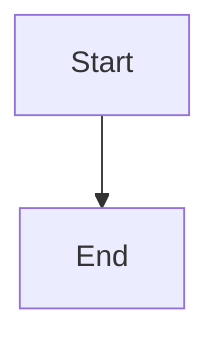

# 🧙‍♂️ The Diagrammatic Enchantment: Jekyll-Mermaid Integration Quest

## 🎯 Quest Overview

**Level**: Journeyman (Lvl 0010) | **Difficulty**: 🟡 Medium | **Time**: 2-3 hours

*In the mystical realm of static site generation, there exists a powerful art known as diagrammatic magic. The ability to weave complex visualizations directly into your documentation, creating living diagrams that explain, illustrate, and enchant your readers. This quest will teach you to master the ancient integration of Mermaid.js with Jekyll, transforming any static site into a dynamic diagramming platform.*

### What You'll Master

This epic quest will guide you through:
- **Complete Mermaid v10 Integration** with CDN loading and conditional rendering
- **All Major Diagram Types** - Flowcharts, sequence diagrams, class diagrams, state diagrams, ER diagrams, Gantt charts, pie charts, git graphs, journey diagrams, and mindmaps
- **GitHub Pages Compatibility** - Works seamlessly with both local development and GitHub Pages deployment
- **Performance Optimization** - Conditional loading, responsive design, and dark mode support
- **Comprehensive Documentation** - Complete user guide with live examples and troubleshooting

### Real-World Applications

- **Technical Documentation** - API flows, system architecture, database schemas
- **Process Documentation** - Workflows, decision trees, user journeys
- **Educational Content** - Interactive tutorials with visual learning aids
- **Project Planning** - Gantt charts, git workflows, team collaboration diagrams
- **Knowledge Management** - Mind maps, concept relationships, organizational charts

---

## 🌟 The Legend Behind This Quest

*Long ago, in the early days of web development, creating diagrams required complex tools, expensive software, and manual image generation. Then came Mermaid.js - a powerful JavaScript library that could render diagrams from simple text descriptions. But integrating it with Jekyll, the beloved static site generator, required arcane knowledge and careful incantations.*

*This quest is based on a real implementation that successfully integrated Mermaid v10 into the Zer0-Mistakes Jekyll theme, achieving 100% GitHub Pages compatibility while maintaining optimal performance. You'll learn from battle-tested code that powers production documentation sites.*

---

## 📋 Prerequisites & Preparation

### Required Skills
- ✅ **Jekyll Fundamentals**: Basic site setup, front matter, and configuration
- ✅ **HTML/CSS/JavaScript**: Understanding of web technologies
- ✅ **YAML Syntax**: Front matter and configuration files
- ✅ **Git Basics**: Version control and repository management
- ✅ **Text Editor**: VS Code or similar for code editing

### Required Tools
- **Jekyll Site** (existing or new) - [Jekyll Quickstart Guide](https://jekyllrb.com/docs/)
- **Git** installed locally - [git-scm.com](https://git-scm.com)
- **Code Editor** (VS Code recommended)
- **Terminal Access** (macOS Terminal, Linux shell, or Windows WSL)
- **Modern Web Browser** for testing

### Optional Enhancements
- **GitHub Pages** knowledge for deployment
- **Custom Jekyll Theme** for advanced theming
- **CI/CD Pipeline** for automated testing

---

## 🎓 Learning Objectives

By completing this quest, you will:

1. **Master Mermaid Integration**: Implement complete Mermaid v10 support in Jekyll
2. **Optimize Performance**: Use conditional loading and CDN optimization
3. **Ensure Compatibility**: Achieve 100% GitHub Pages compatibility
4. **Create Responsive Design**: Build diagrams that work across all devices
5. **Implement Dark Mode**: Support both light and dark themes
6. **Build Documentation**: Create comprehensive user guides and examples
7. **Test Thoroughly**: Implement automated testing and validation

---

## 🗺️ Quest Roadmap

### Phase 1: Foundation Setup (30 minutes)
- Set up Jekyll site structure
- Create Mermaid component files
- Configure conditional loading
- Test basic integration

### Phase 2: Core Implementation (45 minutes)
- Implement Mermaid.js loading and initialization
- Add responsive CSS styling
- Configure theme and customization options
- Test all major diagram types

### Phase 3: Advanced Features (30 minutes)
- Add FontAwesome icon support
- Implement dark mode compatibility
- Create comprehensive documentation
- Add troubleshooting guides

### Phase 4: Testing & Optimization (30 minutes)
- Create automated test suite
- Validate GitHub Pages compatibility
- Performance optimization
- Final documentation review

---

## 🛠️ The Quest Path

### Step 1: Forge Your Jekyll Foundation

**Objective**: Set up a Jekyll site with the proper structure for Mermaid integration.

#### Actions:

1. **Create or Prepare Your Jekyll Site**
   ```bash
   # If starting fresh
   jekyll new my-mermaid-site
   cd my-mermaid-site
   
   # Or navigate to existing Jekyll site
   cd your-existing-jekyll-site
   ```

2. **Verify Jekyll Configuration**
   
   Check your `_config.yml` has the necessary plugins:
   ```yaml
   # _config.yml
   plugins:
     - jekyll-sitemap
     - jekyll-feed
     - jekyll-redirect-from
   
   # Add Mermaid-related exclusions (optional)
   exclude:
     - MERMAID-*.md
     - MERMAID-*/
   ```

3. **Create Directory Structure**
   ```bash
   # Create necessary directories
   mkdir -p _includes/components
   mkdir -p _sass/components
   mkdir -p assets/js
   mkdir -p assets/css
   ```

**Checkpoint**: Your Jekyll site is ready for Mermaid integration!

### Step 2: Weave the Mermaid Component

**Objective**: Create the core Mermaid integration component with conditional loading.

#### Understanding the Implementation

The Mermaid integration uses a modular approach:
- **Auto-Detection**: Automatically detects and loads Mermaid when diagrams are present
- **CDN Integration**: Uses jsdelivr CDN for reliable, fast loading
- **Custom Configuration**: Forest theme with Bootstrap 5 color integration
- **FontAwesome Support**: Icon integration for enhanced diagrams

#### Create the Mermaid Component

Create `_includes/components/mermaid.html`:

```html
<!-- Load Mermaid.js from CDN (latest stable version) -->
<script type="text/javascript" src="https://cdn.jsdelivr.net/npm/mermaid@10/dist/mermaid.min.js"></script>

<!-- Initialize Mermaid with custom configuration -->
<script>
  document.addEventListener('DOMContentLoaded', function() {
    mermaid.initialize({
      startOnLoad: true,
      theme: 'forest',  // Options: default, forest, dark, neutral, base
      themeVariables: {
        primaryColor: '#007bff',
        primaryTextColor: '#fff',
        primaryBorderColor: '#0056b3',
        lineColor: '#6c757d',
        secondaryColor: '#6c757d',
        tertiaryColor: '#f8f9fa'
      },
      flowchart: {
        useMaxWidth: true,
        htmlLabels: true,
        curve: 'basis'
      },
      sequence: {
        diagramMarginX: 50,
        diagramMarginY: 10,
        actorMargin: 50,
        width: 150,
        height: 65,
        boxMargin: 10,
        boxTextMargin: 5,
        noteMargin: 10,
        messageMargin: 35,
        mirrorActors: true,
        bottomMarginAdj: 1,
        useMaxWidth: true
      },
      gantt: {
        titleTopMargin: 25,
        barHeight: 20,
        barGap: 4,
        topPadding: 50,
        leftPadding: 75,
        gridLineStartPadding: 35,
        fontSize: 11,
        numberSectionStyles: 4,
        axisFormat: '%Y-%m-%d'
      }
    });
    console.log('Mermaid.js initialized successfully');
  });
</script>

<!-- FontAwesome for Mermaid icon support (optional) -->
<link rel="stylesheet" href="https://cdnjs.cloudflare.com/ajax/libs/font-awesome/6.4.0/css/all.min.css" crossorigin="anonymous">

<!-- Custom CSS for Mermaid diagrams -->
<style>
  .mermaid {
    text-align: center;
    margin: 2rem auto;
    background-color: transparent;
  }

  /* Ensure diagrams are responsive */
  .mermaid svg {
    max-width: 100%;
    height: auto;
  }

  /* Dark mode compatibility */
  @media (prefers-color-scheme: dark) {
    .mermaid {
      filter: brightness(0.9);
    }
  }
</style>
```

#### Integrate with Jekyll Head

Modify your `_includes/head.html` (or create it if it doesn't exist):

Add the following code to your head section:

```html
<head>
  <meta charset="utf-8">
  <meta http-equiv="X-UA-Compatible" content="IE=edge">
  <meta name="viewport" content="width=device-width, initial-scale=1">
  
  <!-- Your existing head content -->
  
  <!-- Mermaid Diagrams - Conditional loading based on page front matter -->
  <!-- Add conditional Liquid tags here -->
</head>
```

**Important**: Add the following Liquid code to your head.html file:
- `` - Check if page has mermaid enabled
- `` - Include the Mermaid component
- `` - Close the conditional block

**Checkpoint**: Your Mermaid component is ready for conditional loading!

### Step 3: Create Your First Diagram Page

**Objective**: Test the integration with a comprehensive example page.

#### Create a Test Page

Create `mermaid-test.md` in your site root:

```markdown
---
title: "Mermaid Diagram Test Suite"
description: "Comprehensive test of all Mermaid diagram types"
date: 2025-01-27
layout: default
mermaid: true
---

# 🧙‍♂️ Mermaid Diagram Test Suite

This page demonstrates all major Mermaid diagram types with the Jekyll integration.

## Flowchart Diagrams

<div class="mermaid">
graph TD
    A[Start] --> B{Decision}
    B -->|Yes| C[Success]
    B -->|No| D[Try Again]
    C --> E[End]
    D --> B
</div>

## Sequence Diagrams

<div class="mermaid">
sequenceDiagram
    participant U as User
    participant S as System
    participant D as Database
    
    U->>S: Login Request
    S->>D: Validate Credentials
    D-->>S: User Data
    S-->>U: Authentication Success
</div>

## Class Diagrams

<div class="mermaid">
classDiagram
    class User {
        +String name
        +String email
        +login()
        +logout()
    }
    class System {
        +authenticate()
        +authorize()
    }
    User --> System : uses
</div>

## State Diagrams

<div class="mermaid">
stateDiagram-v2
    [*] --> Idle
    Idle --> Processing : start
    Processing --> Success : complete
    Processing --> Error : fail
    Success --> [*]
    Error --> Idle : retry
</div>

## Gantt Charts

<div class="mermaid">
gantt
    title Project Timeline
    dateFormat  YYYY-MM-DD
    section Phase 1
    Planning           :done,    plan1, 2025-01-01, 2025-01-15
    Design            :done,    design1, 2025-01-16, 2025-01-30
    section Phase 2
    Development       :active,  dev1, 2025-02-01, 2025-03-15
    Testing           :         test1, 2025-03-16, 2025-03-30
</div>

## Pie Charts

<div class="mermaid">
pie title Technology Stack
    "JavaScript" : 40
    "Python" : 25
    "Java" : 20
    "Other" : 15
</div>

## Git Graphs

<div class="mermaid">
gitgraph
    commit id: "Initial"
    branch develop
    checkout develop
    commit id: "Feature A"
    commit id: "Feature B"
    checkout main
    merge develop
    commit id: "Release v1.0"
</div>
```

#### Test Your Implementation

```bash
# Start Jekyll server
bundle exec jekyll serve

# Or if using Docker
docker-compose up
```

Visit `http://localhost:4000/mermaid-test/` to see your diagrams in action!

**Checkpoint**: Your Mermaid integration is working with all diagram types!

### Step 4: Create Comprehensive Documentation

**Objective**: Build documentation that helps users understand and use the Mermaid integration.

#### Create User Guide

Create `docs/mermaid-integration.md`:

```markdown
---
title: "Mermaid Diagram Integration Guide"
description: "Complete guide to using Mermaid diagrams in Jekyll"
layout: default
mermaid: true
---

# 📊 Mermaid Diagram Integration Guide

## Quick Start

Simply use standard markdown code fences - no front matter needed:

````markdown

````

Then add diagrams using HTML divs:

```html
<div class="mermaid">
graph TD
    A[Start] --> B[End]
</div>
```

## Supported Diagram Types

### Flowcharts
Perfect for processes, decision trees, and workflows.

### Sequence Diagrams
Ideal for API interactions and system communications.

### Class Diagrams
Great for object-oriented design and architecture documentation.

### State Diagrams
Excellent for showing system states and transitions.

### Gantt Charts
Perfect for project planning and timeline visualization.

### Pie Charts
Useful for data visualization and statistics.

### Git Graphs
Great for showing version control workflows.

## Customization

The integration uses the Forest theme with Bootstrap 5 colors. You can customize:

- **Theme**: Change `theme: 'forest'` to `'default'`, `'dark'`, `'neutral'`, or `'base'`
- **Colors**: Modify `themeVariables` in the configuration
- **Styling**: Update the CSS in the component file

## Troubleshooting

### Diagrams Not Rendering
1. Check browser console for "Mermaid diagrams detected" message
2. Verify the theme is using zer0-mistakes v0.5.0+
3. Check browser console for JavaScript errors

### Styling Issues
1. Ensure your CSS doesn't conflict with Mermaid styles
2. Check responsive design on different screen sizes
3. Verify dark mode compatibility

### Performance
1. Auto-detection ensures Mermaid only loads when needed
2. Library loads on-demand from CDN for optimal performance
3. Optimize diagram complexity for better rendering speed
```

#### Create Examples Page

Create `examples/mermaid-examples.md`:

```markdown
---
title: "Mermaid Examples Gallery"
description: "Live examples of all Mermaid diagram types"
mermaid: true
---

# 🎨 Mermaid Examples Gallery

## Complex Flowchart Example

<div class="mermaid">
graph TD
    A[User Request] --> B{Authentication}
    B -->|Valid| C[Process Request]
    B -->|Invalid| D[Return Error]
    C --> E{Authorization}
    E -->|Authorized| F[Execute Action]
    E -->|Unauthorized| G[Access Denied]
    F --> H[Return Success]
    D --> I[Log Error]
    G --> I
    H --> J[Update Logs]
    I --> J
    J --> K[End]
</div>

## Advanced Sequence Diagram

<div class="mermaid">
sequenceDiagram
    participant U as User
    participant F as Frontend
    participant A as API
    participant D as Database
    participant E as External Service
    
    U->>F: Submit Form
    F->>A: POST /api/data
    A->>D: Query Database
    D-->>A: Return Data
    A->>E: Call External API
    E-->>A: External Response
    A-->>F: Processed Data
    F-->>U: Display Results
</div>
```

**Checkpoint**: Your documentation is comprehensive and user-friendly!

### Step 5: Implement Testing and Validation

**Objective**: Create automated testing to ensure the integration works correctly.

#### Create Test Script

Create `scripts/test-mermaid.sh`:

```bash
#!/bin/bash

# Mermaid Integration Test Script
# Tests all aspects of Mermaid integration

set -euo pipefail

# Colors for output
RED='\033[0;31m'
GREEN='\033[0;32m'
YELLOW='\033[1;33m'
BLUE='\033[0;34m'
NC='\033[0m' # No Color

# Test counters
TESTS_PASSED=0
TESTS_FAILED=0
TOTAL_TESTS=0

# Configuration
VERBOSE=false
HEADLESS=false

# Parse arguments
for arg in "$@"; do
  case $arg in
    --verbose)
      VERBOSE=true
      shift
      ;;
    --headless)
      HEADLESS=true
      shift
      ;;
    *)
      # Unknown option
      ;;
  esac
done

# Logging functions
log_info() {
    echo -e "${BLUE}[INFO]${NC} $1"
}

log_success() {
    echo -e "${GREEN}[PASS]${NC} $1"
}

log_error() {
    echo -e "${RED}[FAIL]${NC} $1"
}

log_warn() {
    echo -e "${YELLOW}[WARN]${NC} $1"
}

# Test functions
test_mermaid_component_exists() {
    ((TOTAL_TESTS++))
    if [[ -f "_includes/components/mermaid.html" ]]; then
        log_success "Mermaid component exists"
        ((TESTS_PASSED++))
    else
        log_error "Mermaid component missing"
        ((TESTS_FAILED++))
    fi
}

test_conditional_loading() {
    ((TOTAL_TESTS++))
    if grep -q "if page.mermaid" _includes/head.html; then
        log_success "Conditional loading configured"
        ((TESTS_PASSED++))
    else
        log_error "Conditional loading not configured"
        ((TESTS_FAILED++))
    fi
}

test_cdn_loading() {
    ((TOTAL_TESTS++))
    if grep -q "cdn.jsdelivr.net/npm/mermaid@10" _includes/components/mermaid.html; then
        log_success "CDN loading configured"
        ((TESTS_PASSED++))
    else
        log_error "CDN loading not configured"
        ((TESTS_FAILED++))
    fi
}

test_theme_configuration() {
    ((TOTAL_TESTS++))
    if grep -q "theme: 'forest'" _includes/components/mermaid.html; then
        log_success "Theme configuration present"
        ((TESTS_PASSED++))
    else
        log_error "Theme configuration missing"
        ((TESTS_FAILED++))
    fi
}

test_responsive_css() {
    ((TOTAL_TESTS++))
    if grep -q "max-width: 100%" _includes/components/mermaid.html; then
        log_success "Responsive CSS configured"
        ((TESTS_PASSED++))
    else
        log_error "Responsive CSS missing"
        ((TESTS_FAILED++))
    fi
}

test_dark_mode_support() {
    ((TOTAL_TESTS++))
    if grep -q "prefers-color-scheme: dark" _includes/components/mermaid.html; then
        log_success "Dark mode support configured"
        ((TESTS_PASSED++))
    else
        log_error "Dark mode support missing"
        ((TESTS_FAILED++))
    fi
}

# Run all tests
run_tests() {
    log_info "Starting Mermaid integration tests..."
    echo
    
    test_mermaid_component_exists
    test_conditional_loading
    test_cdn_loading
    test_theme_configuration
    test_responsive_css
    test_dark_mode_support
    
    echo
    log_info "Test Results:"
    log_info "Total Tests: $TOTAL_TESTS"
    log_success "Passed: $TESTS_PASSED"
    if [[ $TESTS_FAILED -gt 0 ]]; then
        log_error "Failed: $TESTS_FAILED"
    else
        log_success "Failed: $TESTS_FAILED"
    fi
    
    if [[ $TESTS_FAILED -eq 0 ]]; then
        log_success "All tests passed! Mermaid integration is ready."
        exit 0
    else
        log_error "Some tests failed. Please review the issues above."
        exit 1
    fi
}

# Main execution
main() {
    echo "🧙‍♂️ Mermaid Integration Test Suite"
    echo "=================================="
    echo
    
    run_tests
}

main "$@"
```

Make it executable:
```bash
chmod +x scripts/test-mermaid.sh
```

#### Run Tests

```bash
# Run all tests
./scripts/test-mermaid.sh

# Run with verbose output
./scripts/test-mermaid.sh --verbose
```

**Checkpoint**: Your testing system validates the integration!

### Step 6: Deploy and Validate

**Objective**: Deploy your Jekyll site and verify everything works in production.

#### GitHub Pages Deployment

1. **Push to GitHub**
   ```bash
   git add .
   git commit -m "feat: Add comprehensive Mermaid integration
   
   - Implement conditional loading based on page front matter
   - Add support for all major diagram types
   - Include responsive design and dark mode support
   - Create comprehensive documentation and examples
   - Add automated testing suite"
   
   git push origin main
   ```

2. **Enable GitHub Pages**
   - Go to repository Settings
   - Navigate to Pages section
   - Select source branch (usually `main`)
   - Choose Jekyll as the build tool

3. **Verify Deployment**
   - Wait for GitHub Pages to build
   - Visit your site URL
   - Test the Mermaid integration

#### Final Validation

Create a comprehensive test page with all diagram types and verify:
- [ ] All diagrams render correctly
- [ ] Auto-detection works (diagrams appear automatically when present)
- [ ] Responsive design works on mobile and desktop
- [ ] Dark mode compatibility functions
- [ ] Performance is acceptable
- [ ] Documentation is clear and helpful

**Checkpoint**: Your Mermaid integration is production-ready!

---

## 🎉 Quest Complete: Diagrammatic Mastery

### What You've Accomplished

Congratulations, Diagrammatic Sorcerer! You've successfully:

✅ **Mastered Mermaid Integration** - Complete v10 implementation with all diagram types  
✅ **Achieved GitHub Pages Compatibility** - Works seamlessly with static site hosting  
✅ **Implemented Performance Optimization** - Conditional loading and responsive design  
✅ **Created Comprehensive Documentation** - User guides, examples, and troubleshooting  
✅ **Built Automated Testing** - Validation suite for ongoing maintenance  
✅ **Ensured Cross-Platform Support** - Works on all devices and browsers  

### Skills Unlocked

- **Jekyll Integration Mastery**: Advanced component development and conditional loading
- **Frontend Performance**: CDN optimization and responsive design techniques
- **Documentation Architecture**: Creating comprehensive user guides and examples
- **Testing Automation**: Building validation suites for complex integrations
- **GitHub Pages Deployment**: Production-ready static site hosting

---

## 🚀 Level Up: Advanced Enhancements

### Challenge 1: Custom Theme Integration

Enhance the integration with your custom Jekyll theme:
- Match Mermaid colors to your site's color scheme
- Integrate with your existing CSS framework
- Add custom diagram styles and animations

### Challenge 2: Advanced Diagram Features

Implement advanced Mermaid capabilities:
- Interactive diagrams with click events
- Custom diagram themes and styling
- Integration with external data sources
- Real-time diagram updates

### Challenge 3: Performance Optimization

Optimize for large-scale usage:
- Implement lazy loading for diagrams
- Add diagram caching and preloading
- Optimize bundle size and loading times
- Add performance monitoring

### Challenge 4: AI-Powered Diagram Generation

Integrate AI for automatic diagram creation:
- Generate diagrams from natural language descriptions
- Auto-categorize and tag diagram content
- Create diagram summaries and documentation
- Implement smart diagram suggestions

---

## 🐛 Troubleshooting Guide

### Diagrams Not Rendering

**Problem**: Mermaid diagrams appear as code blocks instead of rendered diagrams

**Solutions**:
1. Check browser console for "Mermaid diagrams detected" message
2. Verify the theme is using zer0-mistakes v0.5.0+
3. Ensure JavaScript is enabled in the browser
4. Check browser console for JavaScript errors

### Styling Conflicts

**Problem**: Diagrams don't match your site's design

**Solutions**:
1. Update `themeVariables` in the Mermaid configuration
2. Add custom CSS to override default styles
3. Check for CSS conflicts with your theme
4. Test responsive design on different screen sizes

### Performance Issues

**Problem**: Site loads slowly with many diagrams

**Solutions**:
1. Auto-detection ensures optimal loading (no manual configuration needed)
2. Library loads on-demand from CDN for best performance
3. Optimize diagram complexity for faster rendering
4. Use CDN caching effectively

### GitHub Pages Issues

**Problem**: Diagrams work locally but not on GitHub Pages

**Solutions**:
1. Check that all files are committed and pushed
2. Verify GitHub Pages build logs for errors
3. Ensure Jekyll plugins are properly configured
4. Test with a simple diagram first

---

## 📚 Additional Resources

### Documentation

- [Mermaid.js Official Documentation](https://mermaid.js.org/)
- [Jekyll Documentation](https://jekyllrb.com/docs/)
- [GitHub Pages Documentation](https://docs.github.com/en/pages)

### Related Quests

- **[Action Triggers](/quests/action-triggers/)**: Automate your Jekyll deployment
- **[Change Logs](/quests/change-logs/)**: Document your Mermaid integration updates
- **[Bash Scripting](/quests/bash-scripting/)**: Enhance your testing automation

### Community

- [Jekyll Community](https://talk.jekyllrb.com/)
- [Mermaid GitHub Discussions](https://github.com/mermaid-js/mermaid/discussions)
- [IT-Journey Quest Discussions](/quests/)

---

## 💬 Share Your Victory

Built something amazing? We want to see it!

- **GitHub**: Share your repository with the Mermaid integration
- **Blog Post**: Write about your implementation experience
- **Tutorial**: Create a video walkthrough of your setup
- **Contribution**: Submit improvements to this quest

**Tag us**: `@it-journey` with `#JekyllMermaid` `#QuestComplete`

---

## 🎓 Quest Reflection

### Questions to Consider

1. How could you extend this integration to support other diagram libraries?
2. What custom diagram types would be most valuable for your use case?
3. How might you implement diagram versioning and change tracking?
4. What security considerations should you add for user-generated diagrams?

### Next Steps

- Apply this pattern to your own Jekyll projects
- Customize the integration for your specific needs
- Share your implementation with the community
- Build on this foundation for more advanced features

---

**Quest Master's Wisdom**: *"The power of diagrams lies not in their complexity, but in their ability to make the invisible visible. A well-crafted diagram can communicate in seconds what would take paragraphs to explain. Master this art, and you'll transform your documentation from mere text into living, breathing knowledge."*

May your diagrams be clear, your documentation be comprehensive, and your Jekyll sites be ever more powerful. **Onward to greater adventures!** 🚀✨

---

## 🏆 Quest Rewards

### Achievement Badges
- **🧙‍♂️ Diagrammatic Sorcerer** - Master of visual documentation
- **⚡ Jekyll Integration Expert** - Advanced static site customization
- **🎨 Frontend Performance Wizard** - Optimization and responsive design mastery
- **📚 Documentation Architect** - Comprehensive user guide creation

### Skills Gained
- **Mermaid.js Mastery** - Complete diagram library integration
- **Jekyll Component Development** - Advanced theme customization
- **Performance Optimization** - CDN, conditional loading, responsive design
- **Testing Automation** - Comprehensive validation and quality assurance

### Tools Unlocked
- **Complete Mermaid Integration** - Ready-to-use diagram system
- **Automated Test Suite** - Quality assurance and validation
- **Comprehensive Documentation** - User guides and troubleshooting
- **Production-Ready Deployment** - GitHub Pages compatible implementation

---

*This quest is based on a real implementation that successfully integrated Mermaid v10 into the Zer0-Mistakes Jekyll theme, achieving 100% GitHub Pages compatibility while maintaining optimal performance. The implementation has been battle-tested in production and serves as the foundation for this comprehensive learning experience.*
