*Greetings, brave adventurer! Welcome to **The GitHub Pages Portal: Forging Your Digital Realm** - an epic journey that will transform your code into live web experiences. This quest will guide you through deploying your first website using GitHub Pages, the free hosting solution that turns your GitHub repositories into beautiful, accessible websites.*

*Whether you're a novice developer seeking to showcase your first projects or an experienced coder looking to quickly deploy prototypes, this adventure will equip you with the fundamental skills of web deployment. No servers to manage, no hosting fees - just pure, magical web presence!*

### 🌟 The Legend Behind This Quest

*In the ancient scrolls of web development, there existed a mystical portal that could transform mere code repositories into living, breathing websites accessible to all corners of the realm. This portal, known as GitHub Pages, was forged by the great wizards of GitHub to democratize web hosting. No longer did developers need to bargain with hosting dragons or maintain server beasts - they could simply push their code and watch as the portal wove their creations into the very fabric of the web.*

*Today, you shall learn to harness this portal's power, deploying your digital realms with the ease of a seasoned archmage. Master the incantations of repository settings, the rituals of Jekyll integration, and the secrets of custom domains. Your journey begins now!*

## 🎯 Quest Objectives

By the time you complete this epic journey, you will have mastered:

### Primary Objectives (Required for Quest Completion)
- [ ] **Portal Activation** - Successfully enable GitHub Pages for a repository
- [ ] **Realm Deployment** - Deploy a functional website accessible via GitHub Pages URL
- [ ] **Code-to-Web Alchemy** - Transform static HTML/CSS/JS into a live website
- [ ] **Portal Mastery** - Understand GitHub Pages limitations, features, and best practices

### Secondary Objectives (Bonus Achievements)
- [ ] **Custom Domain Enchantment** - Configure a custom domain for your GitHub Pages site
- [ ] **Jekyll Integration** - Add Jekyll for enhanced static site generation
- [ ] **Multi-Page Realm** - Create a multi-page website with navigation
- [ ] **Community Contribution** - Help another adventurer with their GitHub Pages setup

### Mastery Indicators
You'll know you've truly mastered this quest when you can:
- [ ] Explain GitHub Pages to another developer and guide them through setup
- [ ] Choose appropriate use cases for GitHub Pages vs other hosting solutions
- [ ] Troubleshoot common GitHub Pages deployment issues
- [ ] Integrate GitHub Pages into your development workflow

## 🗺️ Quest Prerequisites

### 📋 Knowledge Requirements
- [ ] Basic understanding of HTML and CSS (see Level 001: HTML Basics)
- [ ] Familiarity with Git version control (clone, commit, push operations)
- [ ] GitHub account and basic repository management
- [ ] Understanding of static vs dynamic websites

### 🛠️ System Requirements
- [ ] Modern web browser (Chrome, Firefox, Safari, Edge)
- [ ] Git installed and configured
- [ ] Text editor or IDE (VS Code recommended)
- [ ] Internet connection for GitHub access

### 🧠 Skill Level Indicators
This 🟢 Easy quest expects:
- [ ] Beginner-friendly - no prior web deployment experience required
- [ ] Comfortable with basic command-line operations
- [ ] Ready for 2-4 hours of focused learning and experimentation

## 🌍 Choose Your Adventure Platform

*GitHub Pages works across all platforms! The core setup is identical, but here are platform-specific tips for your development environment.*

### 🍎 macOS Kingdom Path

```bash
# Ensure Git is installed
git --version

# Clone your repository (replace with your repo)
git clone https://github.com/yourusername/your-repo-name.git
cd your-repo-name

# Create a simple index.html
echo '<!DOCTYPE html>
<html>
<head><title>My GitHub Pages Site</title></head>
<body><h1>Hello from GitHub Pages!</h1></body>
</html>' > index.html

# Commit and push
git add index.html
git commit -m "Add basic HTML page"
git push origin main
```

*macOS users can use Terminal for all Git operations. Consider installing GitHub Desktop for a GUI alternative.*

### 🪟 Windows Empire Path

```powershell
# Check Git installation
git --version

# Clone repository
git clone https://github.com/yourusername/your-repo-name.git
cd your-repo-name

# Create index.html
@"
<!DOCTYPE html>
<html>
<head><title>My GitHub Pages Site</title></head>
<body><h1>Hello from GitHub Pages!</h1></body>
</html>
"@ | Out-File -FilePath index.html -Encoding UTF8

# Commit and push
git add index.html
git commit -m "Add basic HTML page"
git push origin main
```

*Windows users can use Command Prompt, PowerShell, or Git Bash. GitHub Desktop provides an excellent GUI option.*

### 🐧 Linux Territory Path

```bash
# Verify Git installation
git --version

# Clone your repository
git clone https://github.com/yourusername/your-repo-name.git
cd your-repo-name

# Create a simple HTML page
cat > index.html << 'EOF'
<!DOCTYPE html>
<html>
<head><title>My GitHub Pages Site</title></head>
<body><h1>Hello from GitHub Pages!</h1></body>
</html>
EOF

# Commit and push changes
git add index.html
git commit -m "Add basic HTML page"
git push origin main
```

*Linux users have native Git support. Use your preferred terminal emulator.*

### ☁️ Cloud Realms Path

*For cloud-based development (GitHub Codespaces, GitPod, etc.):*

```bash
# The process is identical to local development
# Your cloud environment already has Git configured
git clone https://github.com/yourusername/your-repo-name.git
cd your-repo-name

# Create and edit files using the cloud IDE
# Commit and push as usual
git add .
git commit -m "Initial GitHub Pages setup"
git push origin main
```

*Cloud environments provide the same GitHub Pages workflow with enhanced collaboration features.*

## 🧙‍♂️ Chapter 1: Portal Awakening - Setting Up Your GitHub Repository

*In this foundational chapter, we'll awaken the GitHub Pages portal by preparing your repository and creating the basic structure for your digital realm.*

### ⚔️ Skills You'll Forge in This Chapter
- GitHub repository creation and configuration
- Basic HTML page creation
- Git workflow for web deployment
- Understanding GitHub Pages repository naming conventions

### 🏗️ Building Your Repository Foundation

1. **Create Your Repository**
   - Go to GitHub.com and click "New repository"
   - Name it `yourusername.github.io` (for user/organization sites) OR any name (for project sites)
   - Initialize with a README.md
   - Make it public (required for free GitHub Pages)

2. **Clone and Setup**
   ```bash
   git clone https://github.com/yourusername/your-repo-name.git
   cd your-repo-name
   ```

3. **Create Your First Page**
   ```html
   <!DOCTYPE html>
   <html lang="en">
   <head>
       <meta charset="UTF-8">
       <meta name="viewport" content="width=device-width, initial-scale=1.0">
       <title>My GitHub Pages Site</title>
       <style>
           body {
               font-family: Arial, sans-serif;
               max-width: 800px;
               margin: 0 auto;
               padding: 20px;
               background-color: #f5f5f5;
           }
           .hero {
               text-align: center;
               background: linear-gradient(135deg, #667eea 0%, #764ba2 100%);
               color: white;
               padding: 50px 20px;
               border-radius: 10px;
               margin: 20px 0;
           }
       </style>
   </head>
   <body>
       <div class="hero">
           <h1>🌟 Welcome to My Digital Realm!</h1>
           <p>Deployed with GitHub Pages - The Magic Portal</p>
       </div>
       
       <h2>About This Quest</h2>
       <p>This website was created as part of the IT-Journey GitHub Pages quest. 
       Here you'll find information about my learning journey and projects.</p>
       
       <h2>Projects</h2>
       <ul>
           <li><a href="#project1">Project 1: Coming Soon</a></li>
           <li><a href="#project2">Project 2: Coming Soon</a></li>
       </ul>
       
       <footer style="text-align: center; margin-top: 50px; color: #666;">
           <p>© 2025 My Digital Realm | Powered by GitHub Pages</p>
       </footer>
   </body>
   </html>
   ```

4. **Commit and Push**
   ```bash
   git add index.html
   git commit -m "Add initial GitHub Pages website"
   git push origin main
   ```

### 🔍 Knowledge Check: Repository Setup
- [ ] Can you explain the difference between user/organization sites and project sites?
- [ ] What files are required for a basic GitHub Pages site?
- [ ] How does GitHub Pages know which branch to deploy from?

## 🧙‍♂️ Chapter 2: Portal Activation - Enabling GitHub Pages

*Now that your repository is prepared, it's time to activate the mystical portal that will make your website live!*

### ⚔️ Skills You'll Forge in This Chapter
- GitHub Pages settings configuration
- Branch deployment strategies
- Custom domain setup (optional)
- Understanding deployment workflows

### 🏗️ Activating the GitHub Pages Portal

1. **Access Repository Settings**
   - Go to your repository on GitHub
   - Click "Settings" tab
   - Scroll down to "Pages" section

2. **Configure Source**
   - Select "Deploy from a branch"
   - Choose "main" branch (or "master" if using older repos)
   - Select "/ (root)" folder
   - Click "Save"

3. **Wait for Deployment**
   - GitHub Pages will show "Your site is ready to be published"
   - Wait 1-3 minutes for deployment
   - Your site will be available at:
     - User/Org sites: `https://yourusername.github.io`
     - Project sites: `https://yourusername.github.io/repository-name`

4. **Verify Deployment**
   - Visit your GitHub Pages URL
   - Check that your index.html loads correctly
   - Verify styling and content display properly

### 🔍 Knowledge Check: Portal Activation
- [ ] What are the different source options for GitHub Pages?
- [ ] How long does typical deployment take?
- [ ] What indicates successful deployment vs failure?

## 🧙‍♂️ Chapter 3: Realm Enhancement - Adding Jekyll Magic

*To truly master the portal, learn to wield Jekyll - the powerful static site generator that transforms markdown into magnificent websites!*

### ⚔️ Skills You'll Forge in This Chapter
- Jekyll installation and setup
- Markdown-to-HTML conversion
- Jekyll themes and layouts
- Front matter usage

### 🏗️ Enhancing Your Realm with Jekyll

1. **Install Jekyll**
   ```bash
   # Install Ruby (if not already installed)
   # macOS: brew install ruby
   # Ubuntu: sudo apt-get install ruby-full
   # Windows: Download from rubyinstaller.org
   
   # Install Jekyll and Bundler
   gem install jekyll bundler
   ```

2. **Create Jekyll Site**
   ```bash
   # In your repository directory
   jekyll new . --force  # Force to avoid conflicts
   ```

3. **Configure for GitHub Pages**
   Create `Gemfile`:
   ```ruby
   source 'https://rubygems.org'
   
   gem 'github-pages', group: :jekyll_plugins
   
   group :jekyll_plugins do
     gem 'jekyll-feed'
     gem 'jekyll-sitemap'
     gem 'jekyll-seo-tag'
   end
   ```

4. **Update _config.yml**
   ```yaml
   title: My Digital Realm
   description: A GitHub Pages site created during IT-Journey
   url: "https://yourusername.github.io"  # Update with your URL
   baseurl: ""  # Leave empty for user/org sites, or "/repo-name" for project sites
   
   # Build settings
   markdown: kramdown
   highlander: true
   plugins:
     - jekyll-feed
     - jekyll-sitemap
     - jekyll-seo-tag
   ```

5. **Create Content**
   Update `index.md`:
   ```markdown
   ---
   layout: default
   title: Home
   ---
   
   # 🌟 Welcome to My Digital Realm!
   
   This website was forged using **GitHub Pages** and **Jekyll** during the IT-Journey quest.
   
   ## About This Quest
   
   Through this adventure, I've learned to:
   - Deploy websites using GitHub Pages
   - Use Jekyll for static site generation
   - Configure custom domains
   - Apply modern web development practices
   
   ## Projects
   
   ### Project 1: GitHub Pages Mastery
   - **Status**: ✅ Completed
   - **Technologies**: HTML, CSS, Jekyll
   - **Live Demo**: [View Site]({{ site.url }})
   
   ### Project 2: Portfolio Foundation
   - **Status**: 🚧 In Progress
   - **Technologies**: Jekyll, Liquid templating
   - **Features**: Responsive design, SEO optimization
   ```

6. **Build and Test Locally**
   ```bash
   bundle install
   bundle exec jekyll serve
   # Visit http://localhost:4000
   ```

7. **Deploy**
   ```bash
   git add .
   git commit -m "Add Jekyll site with enhanced content"
   git push origin main
   ```

### 🔍 Knowledge Check: Jekyll Enhancement
- [ ] What is the difference between Jekyll and plain HTML?
- [ ] How does front matter work in Jekyll?
- [ ] What are Jekyll plugins and why are they useful?

## 🎮 Implementation Challenges

### 🟢 Novice Challenge: Basic Portal
**Goal**: Deploy a simple single-page website
**Time**: 30 minutes
**Success Criteria**:
- [ ] GitHub Pages enabled and accessible
- [ ] Basic HTML structure with title and content
- [ ] Proper meta tags for SEO

### 🟡 Apprentice Challenge: Styled Realm
**Goal**: Add CSS styling and multiple sections
**Time**: 1 hour
**Success Criteria**:
- [ ] Custom CSS with responsive design
- [ ] Multiple content sections (About, Projects, Contact)
- [ ] Professional appearance and navigation

### 🔴 Expert Challenge: Jekyll Mastery
**Goal**: Implement full Jekyll site with themes
**Time**: 2 hours
**Success Criteria**:
- [ ] Jekyll site with custom theme
- [ ] Multiple pages with navigation
- [ ] Blog functionality with posts
- [ ] SEO optimization and performance

### ⚔️ Master Challenge: Custom Domain & CI/CD
**Goal**: Add custom domain and automated deployment
**Time**: 3 hours
**Success Criteria**:
- [ ] Custom domain configured
- [ ] GitHub Actions for automated deployment
- [ ] HTTPS enabled with custom domain
- [ ] Performance optimization implemented

## 🗺️ Quest Network Position


**Quest Series**: Web Development Fundamentals

**Prerequisite Quests**:
- None required (beginner-friendly)

**Recommended Background**:
- Level 001: HTML Basics - Basic HTML structure knowledge
- Level 001: CSS Fundamentals - Styling and layout skills

**Follow-Up Quests**:
- Level 010: Jekyll Mastery - Advanced Jekyll features and themes
- Level 011: Static Site Generators - Hugo, Eleventy, and other SSGs
- Level 100: Advanced Web Development - Full-stack development

**Parallel Quests** (can be completed in any order):
- Level 001: Git Fundamentals - Version control mastery
- Level 001: Markdown Magic - Content creation skills

## ⚙️ Flow Diagram

```mermaid
flowchart TD
    A[Start Quest] --> B{Create Repository}
    B --> C[Choose Repository Type]
    C --> D[User/Org Site<br/>yourusername.github.io]
    C --> E[Project Site<br/>yourusername.github.io/repo-name]
    
    D --> F[Create index.html]
    E --> F
    
    F --> G[Commit & Push]
    G --> H[Enable GitHub Pages<br/>in Settings]
    H --> I[Configure Source Branch]
    I --> J[Wait for Deployment<br/>1-3 minutes]
    J --> K{Success?}
    
    K --> L[Site Live!<br/>Access via GitHub URL]
    K --> M[Troubleshoot Issues]
    M --> N[Check Repository Settings]
    N --> O[Verify Branch & Folder]
    O --> P[Check Build Logs]
    P --> J
    
    L --> Q{Optional: Jekyll?}
    Q --> R[Install Jekyll]
    R --> S[Configure Gemfile<br/>& _config.yml]
    S --> T[Create Jekyll Content]
    T --> U[Test Locally]
    U --> V[Deploy to GitHub Pages]
    
    V --> W{Optional: Custom Domain?}
    W --> X[Configure DNS]
    X --> Y[Update GitHub Settings]
    Y --> Z[Enable HTTPS]
    
    Z --> AA[Quest Complete! 🎉]
    V --> AA
    L --> AA
```



## ✅ Validation & Knowledge Checks

### Portfolio Artifacts Created
- [ ] Live GitHub Pages website accessible via public URL
- [ ] Repository with clean commit history
- [ ] Documentation of deployment process
- [ ] Screenshots of live website (optional)

### Skills Demonstrated
- [ ] Successfully configured GitHub Pages settings
- [ ] Deployed website using Git workflow
- [ ] Troubleshot and resolved deployment issues
- [ ] Applied basic web development best practices

### Knowledge Gained
- [ ] Understanding of static site hosting vs traditional hosting
- [ ] Knowledge of GitHub Pages limitations and capabilities
- [ ] Familiarity with Jekyll static site generation
- [ ] Awareness of custom domain configuration options

## 🎁 Rewards & Progression

### 🏆 Quest Completion Rewards
- **GitHub Pages Portal Master Badge** - Display on your GitHub profile
- **Digital Realm Certificate** - PDF certificate of completion
- **Web Deployment Skill Points** - 100 XP toward Web Development track
- **Portal Access Token** - Unlocks advanced deployment quests

### 🎯 Skill Progression Unlocks
- **Web Deployment Novice** → **Web Deployment Adept**
- **Static Site Beginner** → **Static Site Practitioner**
- **GitHub User** → **GitHub Pages Developer**

### 🌟 Next Adventure Recommendations
Based on your performance in this quest:

**If you excelled at basic deployment:**
- Level 010: Jekyll Mastery - Deep dive into Jekyll themes and plugins

**If you enjoyed styling and design:**
- Level 011: CSS Frameworks - Bootstrap, Tailwind, and modern CSS

**If you want to explore alternatives:**
- Level 011: Static Site Generators - Hugo, Eleventy, and Gatsby

**If you're ready for dynamic sites:**
- Level 100: JavaScript Frameworks - React, Vue, and Angular basics

## 📚 Resource Codex

### 📖 Official Documentation
- [GitHub Pages Documentation](https://docs.github.com/en/pages) - Complete official guide
- [Jekyll Documentation](https://jekyllrb.com/docs/) - Jekyll static site generator
- [GitHub Pages with Jekyll](https://docs.github.com/en/pages/setting-up-a-github-pages-site-with-jekyll) - Jekyll integration guide

### 🎥 Video Tutorials
- [GitHub Pages Crash Course](https://www.youtube.com/results?search_query=github+pages+crash+course) - Quick start videos
- [Jekyll for Beginners](https://www.youtube.com/results?search_query=jekyll+for+beginners) - Jekyll fundamentals
- [Custom Domains with GitHub Pages](https://www.youtube.com/results?search_query=github+pages+custom+domain) - Domain setup guides

### 🛠️ Tools & Templates
- [GitHub Pages Starter Templates](https://github.com/topics/github-pages-template) - Ready-to-use templates
- [Jekyll Themes](https://jekyllthemes.io/) - Free and premium Jekyll themes
- [HTML5 Boilerplate](https://html5boilerplate.com/) - Professional HTML/CSS/JS template

### 👥 Community Resources
- [GitHub Community Forum](https://github.community/t/github-pages/) - GitHub Pages discussions
- [Jekyll Talk](https://talk.jekyllrb.com/) - Jekyll community forum
- [DEV.to GitHub Pages Tag](https://dev.to/t/githubpages) - Community tutorials and tips

### 🔧 Troubleshooting Guides
- [GitHub Pages Troubleshooting](https://docs.github.com/en/pages/setting-up-a-github-pages-site-with-jekyll/troubleshooting-jekyll-build-errors-for-github-pages-sites) - Common issues and solutions
- [Jekyll Build Errors](https://jekyllrb.com/docs/troubleshooting/) - Jekyll-specific troubleshooting
- [Custom Domain Issues](https://docs.github.com/en/pages/configuring-a-custom-domain-for-your-github-pages-site/troubleshooting-custom-domains-and-github-pages) - Domain configuration problems

## 📓 AI Collaboration Log

*This quest was developed with AI assistance to ensure comprehensive coverage of GitHub Pages deployment, multi-platform compatibility, and educational best practices. AI helped generate code examples, validate technical accuracy, and enhance the fantasy narrative while maintaining educational integrity.*

*Human oversight ensured:*
- Technical accuracy of GitHub Pages workflows
- Educational progression and learning objectives
- Fantasy theme consistency with IT-Journey lore
- Multi-platform implementation details
- Validation criteria and success metrics

## 🧠 Lessons & Next Steps

### Key Takeaways from This Quest
- **GitHub Pages democratizes web hosting** - No server management or hosting costs
- **Static sites are powerful** - Fast, secure, and SEO-friendly by default
- **Git workflow integration** - Deployment becomes part of your development process
- **Jekyll enhances productivity** - Markdown content with powerful templating
- **Custom domains add professionalism** - Transform GitHub URLs into branded sites

### Modern Web Development Context
GitHub Pages represents the evolution of web hosting from complex server management to developer-friendly static site deployment. As part of the broader Jamstack movement, it enables:
- **Faster development cycles** - No backend complexity for content sites
- **Better performance** - CDN-delivered static assets
- **Enhanced security** - No server-side processing or databases to attack
- **Scalability** - Handles millions of requests without server management

### Future Evolution Ideas
- **GitHub Actions integration** - Automated building and deployment
- **Headless CMS integration** - Dynamic content management for static sites
- **Progressive Web App features** - Offline capability and app-like experiences
- **API integration** - Client-side API calls for dynamic functionality

---

## Quest Validation Checklist

- [ ] Front matter populated with all required fields and current timestamps
- [ ] Mermaid diagrams render correctly (quest network and flow diagrams included)
- [ ] Commands tested across macOS, Windows, and Linux platforms
- [ ] Multi-page website structure with navigation implemented
- [ ] Jekyll integration with proper Gemfile and _config.yml configuration
- [ ] Custom domain setup instructions included (optional bonus)
- [ ] README-first reminder: Update quest index and parent READMEs
- [ ] Cross-references to related quests and resources verified

## Kaizen Hooks

### Incremental Improvements
- **Enhanced Error Handling**: Add more detailed troubleshooting for common GitHub Pages issues
- **Performance Optimization**: Include tips for optimizing GitHub Pages sites (image optimization, caching)
- **Accessibility Focus**: Add WCAG compliance guidelines for GitHub Pages sites
- **CI/CD Integration**: Expand GitHub Actions section for automated deployment workflows

### Metrics to Monitor
- **Completion Rate**: Track percentage of users successfully deploying sites
- **Time to Complete**: Average time spent on quest vs estimated time
- **Common Issues**: Most frequent problems encountered by users
- **Platform Distribution**: Usage across different operating systems

### Derivative Quest Ideas
- **GitHub Pages + React**: Single-page application deployment
- **GitHub Pages + Vue.js**: Progressive web app deployment
- **GitHub Pages + API Integration**: Client-side API consumption
- **GitHub Pages Portfolio**: Personal developer portfolio creation

### Community Enhancement Opportunities
- **Mentorship Program**: Pair experienced users with newcomers
- **Code Review Sessions**: Regular reviews of user-created GitHub Pages sites
- **Theme Development**: Community-contributed Jekyll themes
- **Showcase Gallery**: Featured user sites and templates

---

*Congratulations, Portal Master! You have successfully harnessed the power of GitHub Pages to create your digital realm. Your website now lives on the eternal web, accessible to adventurers across the globe. May your deployments be swift, your sites be fast, and your code be clean!*

*Ready for your next quest? The path of web development awaits...* ⚔️✨

---

**Quest Completed**: Level 001 - The GitHub Pages Portal  
**Date Completed**: {{ "now" | date: "%Y-%m-%d" }}  
**Next Recommended Quest**: Level 010: Jekyll Mastery