*In the raw chaotic energy of the command line, powerful spells (scripts) are often cast with cryptic runes (arguments) and dangerous incantations. A single typo can spell disaster. As a Terminal Artificer, you have learned that power without control is chaos. You seek to forge a "Glass Interface"—a layer of elegance and order that allows even the uninitiated to wield powerful magic safely.*

*Today, you will learn to craft these interfaces using **Gum**, a mystical artifact from the Charm realm that brings glamour and interactivity to your shell scripts.*

### 🌟 The Legend Behind This Quest
For decades, wizards of the terminal have relied on `read` and arcane flags to gather intelligence from users. But the modern era demands more. We crave the tactile feedback of a menu, the safety of a confirmation dialog, and the clarity of a well-formatted prompt. Gum is the modern artificer's hammer, allowing you to build beautiful, composable CLIs with simple shell commands.

## 🎯 Quest Objectives

By the time you complete this epic journey, you will have mastered:

### Primary Objectives (Required for Quest Completion)
- [ ] **Artifact Acquisition**: Install and verify the Gum tool on your system.
- [ ] **The Rune of Selection**: Create interactive menus for user choices.
- [ ] **The Tablet of Inscription**: Build robust text input fields for data gathering.
- [ ] **The Seal of Binding**: Implement confirmation dialogs to prevent disasters.

### Secondary Objectives (Bonus Achievements)
- [ ] **Styling Enchantments**: Customize colors and borders to match your terminal theme.
- [ ] **The Spinner's Trance**: Add loading animations for long-running tasks.

### Mastery Indicators
You'll know you've truly mastered this quest when you can:
- [ ] Replace a complex `read` loop with a single `gum` command.
- [ ] Build a script that a non-technical user can run without fear.
- [ ] Chain multiple input types into a cohesive wizard.

## 🌍 Choose Your Adventure Platform

*To forge your Glass Interface, you must first acquire the Artificer's Hammer (Gum).*

### 🍎 macOS Kingdom Path
The Homebrew guild maintains the finest artifacts.

```bash
brew install gum
```

### 🪟 Windows Empire Path
The artificers of the Windows realm can use Scoop or Winget.

```powershell
# Via Scoop
scoop install gum

# Via Winget
winget install charmbracelet.gum
```

### 🐧 Linux Territory Path
The Linux clans have multiple paths. Choose the one that fits your distribution.

```bash
# Debian/Ubuntu
sudo mkdir -p /etc/apt/keyrings
curl -fsSL https://repo.charm.sh/apt/gpg.key | sudo gpg --dearmor -o /etc/apt/keyrings/charm.gpg
echo "deb [signed-by=/etc/apt/keyrings/charm.gpg] https://repo.charm.sh/apt/ * *" | sudo tee /etc/apt/sources.list.d/charm.list
sudo apt update && sudo apt install gum

# Arch/Manjaro
pacman -S gum

# Go (Universal)
go install github.com/charmbracelet/gum@latest
```

## 🧙‍♂️ Chapter 1: The Rune of Selection (Menus)

*The most common spell an Artificer casts is the "Choice". Instead of forcing a user to type "yes", "no", or a specific filename, we present them with a vision of their options.*

### ⚔️ Skills You'll Forge in This Chapter
- Creating interactive lists.
- Capturing user selection into variables.
- Handling multi-selection.

### 🏗️ Building Your Knowledge Foundation

Let's create a simple script that asks the user to choose their character class.

1.  Create a file named `class_selector.sh`.
2.  Add the shebang `#!/bin/bash` (or `#!/bin/zsh`).
3.  Use `gum choose` to present options.

```bash
#!/bin/bash

echo "Greetings, traveler. What is your profession?"

# gum choose presents a list. The result is printed to stdout.
# We capture it in a variable named CLASS.
CLASS=$(gum choose "Wizard" "Warrior" "Rogue" "Artificer")

echo "Ah, a $CLASS! A fine choice."
```

**Run your spell:**
```bash
chmod +x class_selector.sh
./class_selector.sh
```

### 🔍 Knowledge Check: Selection
- [ ] What happens if you press `Enter` without moving the selection? (It selects the first/highlighted item).
- [ ] How would you allow a user to pick multiple items? (Hint: check `gum choose --help` for `--no-limit`).

## 🧙‍♂️ Chapter 2: The Tablet of Inscription (Input)

*Sometimes, a choice is not enough. You need a name, a path, or a secret code. The Tablet of Inscription allows users to write directly into your spell.*

### ⚔️ Skills You'll Forge in This Chapter
- Creating text input fields.
- Using placeholder text.
- Masking secrets (passwords).

### 🏗️ Building Your Knowledge Foundation

Let's expand our script to ask for the hero's name and a secret password.

```bash
#!/bin/bash

# Basic text input with a placeholder
echo "What is your name, hero?"
NAME=$(gum input --placeholder "Enter your name...")

# Password input (masked characters)
echo "Whisper your secret password:"
PASSWORD=$(gum input --password --placeholder "Secret...")

echo "Welcome, $NAME. Your secret is safe with me."
```

### ⚡ Quick Wins and Checkpoints
- [ ] **Input Mastered**: You can now gather free-form text.
- [ ] **Secrets Kept**: You know how to hide sensitive keystrokes.

## 🧙‍♂️ Chapter 3: The Seal of Binding (Confirmation)

*Powerful spells require safeguards. Before deleting a kingdom (or a file), an Artificer must ask: "Are you sure?"*

### ⚔️ Skills You'll Forge in This Chapter
- Creating confirmation dialogs.
- Handling exit codes (0 for Yes, 1 for No).

### 🏗️ Building Your Knowledge Foundation

```bash
#!/bin/bash

echo "You are about to cast 'Fireball' in a crowded room."

# gum confirm exits with 0 if confirmed, 1 if cancelled.
if gum confirm "Are you sure you want to do this?"; then
    echo "🔥 BOOM! The room is charred."
else
    echo "Phew. You lowered your staff."
fi
```

## 🎮 Quest Implementation Challenges

### Challenge 1: The Potion Shop (🕐 Estimated Time: 15 minutes)
**Objective**: Build a script that acts as a shop interface.

**Requirements**:
- [ ] Ask the user to select a potion (Health, Mana, Stamina) using `gum choose`.
- [ ] Ask for the quantity using `gum input`.
- [ ] Show a summary: "You are buying X potions of Y."
- [ ] Ask for confirmation using `gum confirm`.
- [ ] Print a success message or a cancellation message.

**Success Criteria**:
- [ ] The script runs without errors.
- [ ] Variables are captured correctly.
- [ ] The logic flow respects the confirmation.

### Challenge 2: The Git Commit Wizard (🕐 Estimated Time: 20 minutes)
**Objective**: Create a script to help you write standardized git commits.

**Requirements**:
- [ ] Select the type of change (feat, fix, docs, chore) using `gum choose`.
- [ ] Input the scope (optional) using `gum input`.
- [ ] Input the message using `gum input` (or `gum write` for multi-line!).
- [ ] Construct the final string: `type(scope): message`.
- [ ] Ask to confirm execution.
- [ ] (Bonus) Actually run `git commit -m "..."`.

## 🗺️ Quest Network Position

```mermaid
graph TB
    subgraph "Prerequisites"
        Term[🌱 Terminal Basics]
        Script[🏰 Shell Scripting]
    end
    
    subgraph "Current Quest"
        Gum[🏰 Terminal Artificer]
    end
    
    subgraph "Unlocked Quests"
        AdvScript[⚔️ Advanced Scripting]
        Auto[👑 Automation Epic]
    end
    
    Term --> Gum
    Script --> Gum
    Gum --> AdvScript
    Gum --> Auto
```



## ⚙️ Flow Diagram: The Potion Shop

```mermaid
graph TD
    A[Start Shop] --> B{Choose Potion}
    B -->|Health| C[Set Item: Health]
    B -->|Mana| D[Set Item: Mana]
    C --> E[Input Quantity]
    D --> E
    E --> F[Show Summary]
    F --> G{Confirm Purchase?}
    G -->|Yes| H[💰 Transaction Complete]
    G -->|No| I[❌ Transaction Cancelled]
    H --> J[End]
    I --> J
```



## ✅ Quest Validation Checklist

- [ ] **Front Matter**: Populated with correct dates and tags.
- [ ] **Diagrams**: Mermaid diagrams render correctly.
- [ ] **Code**: All `gum` commands tested and working.
- [ ] **Links**: Checked for broken URLs.
- [ ] **README**: Remember to update the Quest Index in `pages/_quests/README.md`!

## 🎁 Rewards and Progression

### 🏆 Achievement Badges Earned
- **Glass Interface Artificer**: For bringing beauty to the terminal.

### ⚡ Skills and Abilities Unlocked
- **UI Construction**: Ability to build user-friendly CLI tools.
- **Input Sanitization**: Better handling of user data.

### 📚 Resource Codex

- [Gum Repository](https://github.com/charmbracelet/gum) - The official source code and docs.
- [Charm.sh](https://charm.sh/) - The wizards behind Gum and other TUI tools.
- [Bash Guide](https://tldp.org/LDP/Bash-Beginners-Guide/html/) - Reference for shell scripting logic.

## 📓 AI Collaboration Log
- **Plan**: Analyzed user request for "frontend terminal building" and selected `gum` as the primary tool.
- **Draft**: Structured quest around installation, selection, input, and confirmation.
- **Refine**: Added "Potion Shop" and "Git Commit Wizard" challenges to provide practical application.

## 🧠 Lessons & Next Steps
Now that you can build interfaces, consider:
- **Styling**: Explore `gum style` to add borders, colors, and layouts.
- **Layouts**: Use `gum join` to create multi-column interfaces.
- **Next Quest**: Explore **Advanced Shell Scripting** to add complex logic behind your beautiful interfaces.

---

*May your prompts be clear, your inputs sanitized, and your interfaces forever shiny!* ⚔️✨
