# Tools Collection: Development Tools & Workflows

*Every craftsman needs their tools. This collection houses quests focused on mastering the tools, workflows, and practices that professional developers use daily. From version control to CI/CD, these quests transform you from a code writer into a software craftsperson.*

## Collection Overview

The Tools collection includes quests about:
- **Version Control** - Git, branching strategies, and commit practices
- **CI/CD Pipelines** - GitHub Actions and automated workflows
- **AI Automation** - AI-powered development tools and practices
- **Project Management** - Issue tracking, changelogs, and documentation
- **Framework Mastery** - Django, Jekyll, and other development frameworks

## Available Quests

### 📜 Version Control & Git

#### [Commitments to Clean Commits](commitments-to-clean-commits.md)
**Quest Type**: Main 🏰 | **Difficulty**: 🟢 Easy | **Estimated Time**: 30-45 minutes

Learn the art of writing meaningful, well-structured commit messages. Master conventional commits and clean Git history practices.

**Skills You'll Master:**
- Conventional commit format
- Semantic versioning alignment
- Git history management
- Commit message best practices

**Prerequisites:** Basic Git knowledge

---

#### [Branches and Pull Requests](branches-and-pull-requests.md)
**Quest Type**: Main 🏰 | **Difficulty**: 🟡 Medium | **Estimated Time**: 45-60 minutes

Master branching strategies and pull request workflows. Learn GitFlow, GitHub Flow, and how to collaborate effectively.

**Skills You'll Master:**
- Branch naming conventions
- PR creation and review workflows
- Merge strategies (merge, squash, rebase)
- Code review best practices

**Prerequisites:** [Commitments to Clean Commits](commitments-to-clean-commits.md)

### 🔧 CI/CD & Automation

#### [Action Triggers](action-triggers.md)
**Quest Type**: Side ⚔️ | **Difficulty**: 🟡 Medium | **Estimated Time**: 45-60 minutes

Master GitHub Actions triggers and events. Learn to automate workflows based on pushes, PRs, schedules, and custom events.

**Skills You'll Master:**
- GitHub Actions event triggers
- Workflow dispatch and manual triggers
- Scheduled workflows (cron)
- Conditional workflow execution

**Prerequisites:** GitHub account, YAML basics

---

#### [Change Logs](change-logs.md)
**Quest Type**: Side ⚔️ | **Difficulty**: 🟢 Easy | **Estimated Time**: 30-45 minutes

Learn to maintain professional changelogs. Track releases, document changes, and communicate updates to users.

**Skills You'll Master:**
- Keep a Changelog format
- Semantic versioning integration
- Automated changelog generation
- Release note writing

**Prerequisites:** Git basics

### 🤖 AI & Automation

#### [Revolutionizing Work with AI Automation](revolutionizing-work-with-ai-automation.md)
**Quest Type**: Main 🏰 | **Difficulty**: 🟡 Medium | **Estimated Time**: 60-90 minutes

Explore how AI is transforming development workflows. Learn to integrate AI tools into your daily work for maximum productivity.

**Skills You'll Master:**
- AI tool selection and integration
- Prompt engineering for development
- AI-assisted code review
- Automation workflow design

**Prerequisites:** Basic programming, AI awareness

### 🌱 Project & Framework Mastery

#### [Planting Seeds: Software Evolution](planting-seeds.md)
**Quest Type**: Main 🏰 | **Difficulty**: 🟡 Medium | **Estimated Time**: 60-90 minutes

Understand the lifecycle of software projects. Learn to plant the seeds of good architecture and watch your projects grow.

**Skills You'll Master:**
- Project initialization patterns
- Architecture decision records
- Documentation-first development
- Sustainable codebase practices

**Prerequisites:** Basic development experience

---

#### [Django and Git Integration](django-and-git.md)
**Quest Type**: Side ⚔️ | **Difficulty**: 🟡 Medium | **Estimated Time**: 45-60 minutes

Master Git workflows specifically for Django projects. Learn migration management, settings handling, and deployment practices.

**Skills You'll Master:**
- Django project Git structure
- Migration version control
- Environment-specific settings
- Django deployment pipelines

**Prerequisites:** Django basics, Git fundamentals

### 👑 Epic Adventures

#### [Epic Quest: Zer0 to Her0 CMStyle](epic-quest-zer0-to-her0-cmstyle.md)
**Quest Type**: Epic 👑 | **Difficulty**: ⚔️ Epic | **Estimated Time**: 4+ hours

The ultimate journey from complete beginner to configuration management hero. A comprehensive multi-session quest covering all aspects of professional development workflows.

**Skills You'll Master:**
- Complete development environment setup
- Version control mastery
- CI/CD pipeline creation
- Documentation and collaboration
- Professional workflow establishment

**Prerequisites:** Computer with internet access (everything else taught in quest)

## Learning Path Recommendations

### For Git Newcomers
1. [Commitments to Clean Commits](commitments-to-clean-commits.md)
2. [Branches and Pull Requests](branches-and-pull-requests.md)
3. [Change Logs](change-logs.md)

### For Automation Enthusiasts
1. [Action Triggers](action-triggers.md)
2. [Revolutionizing Work with AI Automation](revolutionizing-work-with-ai-automation.md)
3. [Planting Seeds: Software Evolution](planting-seeds.md)

### For the Complete Journey
1. [Epic Quest: Zer0 to Her0 CMStyle](epic-quest-zer0-to-her0-cmstyle.md) - Start here for the full experience!

## Collection Integration

These quests complement all binary level quests:
- **Level 0000-0001**: Git basics pair perfectly with foundation quests
- **Level 0010-0011**: Automation enhances terminal and AI tool quests
- **Level 0100+**: CI/CD essential for advanced development

## Quest Network

```mermaid
graph TD
    A[🌱 Planting Seeds] --> B[📜 Clean Commits]
    B --> C[🌿 Branches & PRs]
    C --> D[📋 Change Logs]
    D --> E[⚡ Action Triggers]
    E --> F[🤖 AI Automation]
    A --> G[🎯 Django + Git]
    F --> H[👑 Zer0 to Her0 Epic]
    
    style H fill:#ffd700
```

---

*The right tools in skilled hands create masterpieces. Master your tools.* 🛠️✨
