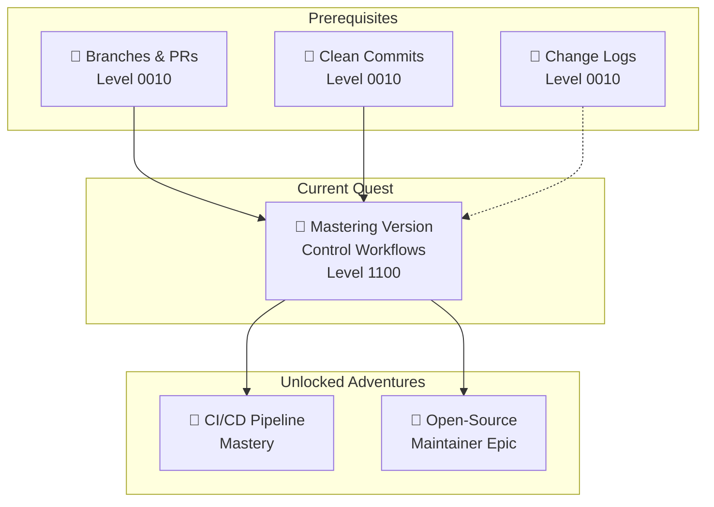
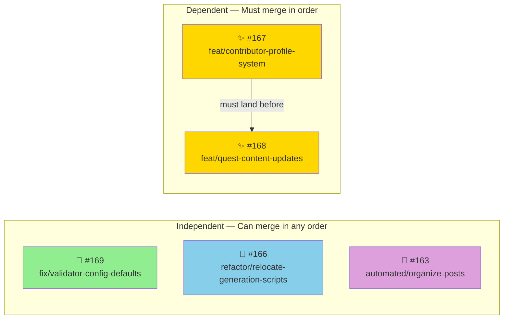
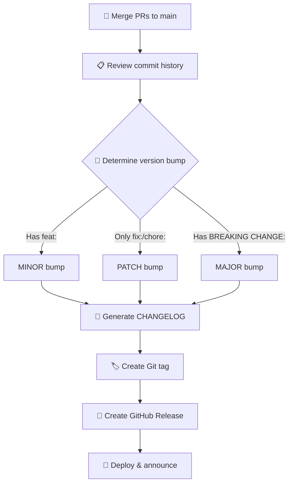

*Greetings, battle-hardened code warrior! You have survived the introductory enchantments of branching and the clean-commit oath. But the realm of version control runs far deeper than a single `git push`. Today you face the Grand Merge Ritual — a trial reserved for those who would command entire release kingdoms, orchestrate fleets of pull requests, and bend the timeline of code to their will.*

*In this quest you will study **real pull requests** from an active open-source repository and learn the advanced arts of semantic versioning, branch orchestration, automated changelogs, and CI/CD-driven releases. The spells you forge here are the same ones used by maintainers of the world's most critical software.*

### 🌟 The Legend Behind This Quest

*Long ago, the Great Repository fell into chaos. Features collided, hotfixes overwrote releases, and the changelog — the sacred chronicle of change — went blank for months. It took a council of senior engineers, armed with conventional commits, semantic versions, and automated pipelines, to restore order. Their techniques were codified into the Grand Merge Ritual, and now they are yours to learn.*

* * * *

## 🎯 Quest Objectives

By the time you complete this epic journey, you will have mastered:

### Primary Objectives (Required for Quest Completion)
- [ ] **Semantic Versioning Mastery** — Apply MAJOR.MINOR.PATCH rules to real changes
- [ ] **Branch Strategy Command** — Choose the correct branch type for any change
- [ ] **PR Orchestration** — Write, review, and sequence dependent pull requests
- [ ] **Automated Release Pipeline** — Generate changelogs and tags from commit history
- [ ] **Conflict Resolution** — Resolve merge conflicts across competing branches

### Secondary Objectives (Bonus Achievements)
- [ ] **Hotfix Under Fire** — Execute an emergency hotfix while a release branch is open
- [ ] **CI Guardian Configuration** — Add branch protection rules and status checks
- [ ] **Rebase vs Merge Judgement** — Know when each strategy is appropriate

### Mastery Indicators
You'll know you've truly mastered this quest when you can:
- [ ] Look at any commit and immediately know the SemVer bump it triggers
- [ ] Orchestrate five PRs with dependencies without a merge conflict
- [ ] Explain your branching strategy to a junior developer
- [ ] Recover from a botched release using `git revert` or `git reset` safely

## 🗺️ Quest Prerequisites

### 📋 Knowledge Requirements
- [ ] Completed [Branches and Pull Requests quest](/quests/level-0010-branches-and-pull-requests/)
- [ ] Completed [Commitments to Clean Commits quest](/quests/level-0010-commitments-to-clean-commits/)
- [ ] Comfortable with `git log`, `git diff`, and `git stash`

### 🛠️ System Requirements
- [ ] Git 2.30+ — `git --version`
- [ ] GitHub CLI — `gh --version`
- [ ] A text editor or IDE with Git integration (VS Code recommended)
- [ ] Node.js 18+ (for `standard-version` tooling)

* * * *

## 🗺️ Quest Network Position



* * * *

## 🧙‍♂️ Chapter 1: The Semantic Versioning Codex

*Before touching a single branch, every master architect must understand the language of versions. Semantic Versioning (SemVer) is the universal tongue that tells the world what your changes mean.*

### ⚔️ The Three Sacred Numbers

```text
MAJOR . MINOR . PATCH
  ↑        ↑       ↑
  │        │       └── Bug fixes, chores — backward compatible
  │        └────────── New features — backward compatible
  └─────────────────── Breaking changes — contracts change
```

### 🔮 Commit-to-Version Mapping

Every conventional commit carries a **version destiny**:

| Commit Prefix | SemVer Bump | Example | Version Change |
|---|---|---|---|
| `fix:` | PATCH ↑ | `fix: prevent crash on empty input` | 1.0.0 → 1.0.1 |
| `chore:` | PATCH ↑ | `chore(deps): upgrade axios` | 1.0.0 → 1.0.1 |
| `docs:` | PATCH ↑ | `docs: update API examples` | 1.0.0 → 1.0.1 |
| `feat:` | MINOR ↑ | `feat: add dark mode toggle` | 1.0.0 → 1.1.0 |
| `BREAKING CHANGE:` | MAJOR ↑ | Footer in any commit | 1.0.0 → 2.0.0 |

### 🏗️ Real-World Example: PR #169

Let's examine a **real bug fix** from the IT-Journey repository:

> **PR #169** — `fix(validator): skip required field checks for fields with _config.yml defaults`
>
> - **Branch**: `fix/validator-config-defaults` → `main`
> - **What it does**: Updates the quest validator to respect Jekyll `_config.yml` default values, preventing false validation failures
> - **SemVer impact**: **PATCH** bump — this fixes incorrect behavior without changing the API

```bash
# The commit that would trigger this:
fix(validator): skip required field checks for fields with _config.yml defaults
```

### 🔍 Knowledge Check: SemVer
- [ ] What version bump does `feat(auth): add 2FA login` trigger?
- [ ] If you rename a public API endpoint, which number changes?
- [ ] A `chore(deps):` commit bumps which version component?

* * * *

## 🧙‍♂️ Chapter 2: The Branch Strategy War Room

*Not all branches are created equal. A master architect knows which type of branch to summon for every situation — and more importantly, when to merge them and in what order.*

### ⚔️ The Advanced Branch Arsenal

| Branch Type | Naming Convention | Purpose | Merges Into | SemVer Impact |
|---|---|---|---|---|
| `feature/` | `feat/short-description` | New capabilities | `main` | MINOR |
| `bugfix/` | `fix/short-description` | Non-urgent fixes | `main` | PATCH |
| `hotfix/` | `hotfix/short-description` | Urgent production fixes | `main` | PATCH |
| `refactor/` | `refactor/short-description` | Code reorganization | `main` | PATCH (no behavior change) |
| `release/` | `release/vX.Y.Z` | Prepare versioned release | `main` | Tagged release |
| `automated/` | `automated/workflow-name` | Bot-generated changes | `main` | PATCH |

### 🏗️ Real-World Branch Anatomy: The Five Open PRs

Let's dissect every open PR in the IT-Journey repo and classify them:

#### 🔧 PR #169 — Bug Fix Branch

```text
fix/validator-config-defaults → main
```

- **Type**: `bugfix/` (prefixed `fix/`)
- **Scope**: `validator` — the quest validation system
- **Change**: Adds `--config` CLI argument, parses `_config.yml` defaults, skips false-positive errors
- **SemVer**: PATCH
- **Why it matters**: 142 quests now pass validation without false failures

#### ✨ PR #168 — Feature Branch (with dependency)

```text
feat/quest-content-updates → main
```

- **Type**: `feature/`
- **Scope**: Quest content — adds 6 new quests and rewrites one
- **Dependency**: ⚠️ **Depends on PR #167** — the contributor profile system must land first
- **SemVer**: MINOR
- **Lesson**: Feature branches can have **ordering dependencies** — merge the foundation first!

#### ✨ PR #167 — Feature Branch (foundation)

```text
feat/contributor-profile-system → main
```

- **Type**: `feature/`
- **Scope**: Full contributor system — data layer, components, CSS, GitHub Actions, scripts
- **SemVer**: MINOR
- **Lesson**: This is a **large feature PR** touching many subsystems. In a team, you'd want this reviewed by multiple people.

#### 🔄 PR #166 — Refactor Branch

```text
refactor/relocate-generation-scripts → main
```

- **Type**: `refactor/`
- **Scope**: Moves scripts from `_data/` to `scripts/generation/`
- **SemVer**: PATCH (no behavior change)
- **Lesson**: Refactors update **references everywhere** — Makefile, AGENTS.md, README, quests. Always grep for old paths.

#### 🤖 PR #163 — Automated Branch

```text
automated/organize-posts-23102108538 → main
```

- **Type**: `automated/`
- **Scope**: Weekly post organization and archiving via GitHub Actions
- **SemVer**: PATCH
- **Lesson**: Bots create branches too! Automated workflows should follow the same naming conventions.

### 🧪 The PR Dependency Graph



### ⚡ Quick Win: Classify Any Change

Before creating a branch, ask yourself:

1. **Does it add something new?** → `feature/`
2. **Does it fix broken behavior?** → `bugfix/` or `hotfix/` (if urgent)
3. **Does it reorganize without changing behavior?** → `refactor/`
4. **Is it generated by a bot?** → `automated/`
5. **Does it prepare a tagged release?** → `release/`

### 🔍 Knowledge Check: Branch Strategy
- [ ] Why must PR #167 merge before PR #168?
- [ ] What branch type would you use to urgently fix a broken login in production?
- [ ] PR #166 moves files but doesn't change behavior. Why is `refactor/` the right prefix?

* * * *

## 🧙‍♂️ Chapter 3: The Art of the Pull Request Scroll

*A pull request is not just a code diff — it's a communication artifact. The best PRs tell a story: what changed, why it changed, how to verify it, and what it affects downstream.*

### ⚔️ Anatomy of a Master-Class PR Description

Let's study PR #169's description — it's a model of clarity:

```markdown
## Description
Updates quest_validator.py to respect Jekyll _config.yml default values,
preventing false validation failures for fields that have defaults set
at the collection level.

## Changes Made
- Added --config / -c CLI argument to specify config file path
- Auto-detects _config.yml if not explicitly provided
- Parses defaults section to find collection-scoped default fields
- Handles YAML anchors/aliases via regex fallback parser
- Skips required field errors for fields that have config defaults (e.g., layout)

## Type of Change
- [x] Bug fix (non-breaking change fixing an issue)

## Testing
- 142/142 quests pass validation with -c _config.yml
- No false positives for fields with config-level defaults
```

### 📜 The Five Runes of an Excellent PR

| Rune | Purpose | PR #169 Example |
|---|---|---|
| 🧙 **Description** | What and why in plain language | "Preventing false validation failures" |
| 📝 **Changes Made** | Bullet list of specific modifications | 5 clear, scannable bullets |
| 🏷️ **Type of Change** | Checkbox classification | Bug fix checked |
| 🧪 **Testing** | Proof it works | "142/142 quests pass" |
| 🔗 **Dependencies** | Other PRs that must merge first | (See PR #168 → depends on #167) |

### 🏗️ PR Description Patterns by Type

**Feature PR (like #167):**

```markdown
## Description
Adds a complete contributor profile system with gamified RPG elements
including character sheets, achievement walls, and stats panels.

## Changes Made
- Data layer: _data/contributors/ with YAML profiles and template
- Display components: _includes/contributor/ (character_sheet, stats_panel,
  profile_card, achievement_wall)
- Contributor CSS styling
- Contributor directory and individual pages
- GitHub Actions workflow for updating contributor profiles
- Generation scripts and Makefile targets

## Type of Change
- [x] New feature (non-breaking change adding functionality)
```

**Refactor PR (like #166):**

```markdown
## Description
Moves statistics generation scripts from `_data/` to `scripts/generation/`
for better project organization. Scripts don't belong in the data directory.

## Changes Made
- Relocated generate_statistics.rb, generate_statistics.sh,
  update_statistics.sh to scripts/generation/
- Updated all path references in Makefile, AGENTS.md, _data/README.md,
  scripts/README.md, pages/stats.md, and stating-the-stats quest
- Removed obsolete files

## Type of Change
- [x] Refactoring (no behavior change)

## Testing
- [x] `make test` passes with new paths
- [x] Script syntax checks pass
```

### 🧪 Challenge 1: Write a PR Description (🕐 15 minutes)

You've just finished a feature that adds dark mode to the site. Write a complete PR description using the five runes above.

**Requirements:**
- [ ] Clear description explaining what and why
- [ ] At least 4 specific changes listed
- [ ] Type of change marked
- [ ] Testing evidence included
- [ ] Note any related issues or PRs

* * * *

## 🧙‍♂️ Chapter 4: Release Orchestration — The Grand Ritual

*The most powerful spell in the version control codex is the **release**. It transforms a stream of commits into a versioned artifact that the world can depend on.*

### ⚔️ The Release Lifecycle



### 🏗️ Planning a Release from the Open PRs

Imagine all five open PRs have been reviewed and approved. Let's plan the release:

**Step 1: Determine merge order**

```text
1. PR #163 (automated/organize-posts)     — independent, safe to merge first
2. PR #166 (refactor/relocate-scripts)     — independent, no behavior change
3. PR #169 (fix/validator-config-defaults) — independent bug fix
4. PR #167 (feat/contributor-profiles)     — foundation feature, must precede #168
5. PR #168 (feat/quest-content-updates)    — depends on #167
```

**Step 2: Calculate the version bump**

```text
Current version: v1.5.0 (hypothetical)

Commits entering main:
  - chore: automated post organization    → PATCH
  - refactor: relocate generation scripts → PATCH
  - fix: validator config defaults        → PATCH
  - feat: contributor profile system      → MINOR ← highest non-breaking
  - feat: quest content updates           → MINOR

Highest impact: feat: → MINOR bump
New version: v1.6.0
```

**Step 3: Generate the changelog**

```markdown
# Changelog

## [1.6.0] - 2026-03-21

### Added
- feat(contributors): add contributor profile system with RPG character sheets (#167)
- feat(quests): add contributor quest line and rewrite bash-run quest (#168)

### Fixed
- fix(validator): skip required field checks for fields with _config.yml defaults (#169)

### Changed
- refactor(scripts): relocate generation scripts from _data/ to scripts/generation/ (#166)

### Maintenance
- chore: weekly post organization and archiving (#163)
```

### 🛠️ Hands-On: Automated Releases with `standard-version`

```bash
# Install the release automation tool
npm install --save-dev standard-version

# Add release scripts to package.json
# "scripts": {
#   "release": "standard-version",
#   "release:minor": "standard-version --release-as minor",
#   "release:patch": "standard-version --release-as patch",
#   "release:major": "standard-version --release-as major"
# }

# Dry run — see what would happen without committing
npx standard-version --dry-run

# Execute the release
npx standard-version

# Push the tag
git push --follow-tags origin main
```

### 🏷️ Creating a GitHub Release

```bash
# Create a release from the latest tag
gh release create v1.6.0 \
  --title "v1.6.0 — Contributor Profiles & Validation Fixes" \
  --notes-file CHANGELOG.md \
  --target main

# Or auto-generate release notes from PRs
gh release create v1.6.0 --generate-notes
```

### 🔍 Knowledge Check: Release Management
- [ ] Why do we merge independent PRs before dependent ones?
- [ ] If a release contains only `fix:` and `docs:` commits, what version bump applies?
- [ ] What does `--dry-run` do and why should you always use it first?

* * * *

## 🧙‍♂️ Chapter 5: Conflict Resolution — The Battle of the Branches

*When two branches modify the same lines of code, Git summons you to settle the dispute. Conflict resolution is not a failure — it is a rite of passage.*

### ⚔️ When Conflicts Strike

Imagine PR #166 (refactor scripts) and PR #169 (fix validator) both modify `Makefile` references. When you merge one, the other will conflict.

```bash
# After merging PR #166, rebase PR #169 onto updated main
git switch fix/validator-config-defaults
git fetch origin main
git rebase origin/main

# Git pauses at the conflict:
# CONFLICT (content): Merge conflict in Makefile
```

### 🛠️ Resolving the Conflict

```bash
# 1. Open the conflicted file — look for conflict markers
<<<<<<< HEAD
STATS_SCRIPT = scripts/generation/generate_statistics.sh
=======
STATS_SCRIPT = _data/generate_statistics.sh
>>>>>>> fix/validator-config-defaults

# 2. Choose the correct version (PR #166 already relocated the scripts)
STATS_SCRIPT = scripts/generation/generate_statistics.sh

# 3. Remove ALL conflict markers (<<<, ===, >>>)

# 4. Stage and continue
git add Makefile
git rebase --continue

# 5. Force-push the rebased branch (only YOUR branch, never main!)
git push --force-with-lease origin fix/validator-config-defaults
```

### ⚡ The Golden Rules of Conflict Resolution

1. **Never blindly accept one side** — read both changes and understand intent
2. **Use `--force-with-lease`** — safer than `--force`, prevents overwriting others' work
3. **Rebase feature branches onto main** — don't merge main into your feature branch
4. **Test after resolving** — conflicts can introduce subtle bugs
5. **Communicate with the other author** — if unsure whose code should win, ask

### 🧪 Challenge 2: Simulate a Merge Conflict (🕐 20 minutes)

Practice conflict resolution in a safe sandbox:

```bash
# Create a practice repo
mkdir conflict-practice && cd conflict-practice
git init

# Create a base file
echo "line 1: hello" > greetings.txt
echo "line 2: world" >> greetings.txt
git add . && git commit -m "feat: initial greetings"

# Branch A: changes line 2
git switch -c feature/formal-greeting
sed -i '' 's/world/esteemed colleague/' greetings.txt
git add . && git commit -m "feat: formal greeting"

# Branch B: also changes line 2
git switch main
git switch -c feature/casual-greeting
sed -i '' 's/world/friend/' greetings.txt
git add . && git commit -m "feat: casual greeting"

# Merge A into main
git switch main
git merge feature/formal-greeting

# Now try merging B — CONFLICT!
git merge feature/casual-greeting
# Resolve it, then commit
```

**Success Criteria:**
- [ ] Both branches created and committed
- [ ] Conflict triggered on merge
- [ ] Conflict markers identified and removed
- [ ] Final file contains your chosen resolution
- [ ] Merge completed cleanly

* * * *

## 🧙‍♂️ Chapter 6: Branch Protection and CI Gatekeeping

*A kingdom without walls falls to invaders. Branch protection rules are the enchanted walls that guard your `main` branch from chaos.*

### ⚔️ Essential Protection Rules

| Rule | Setting | Why |
|---|---|---|
| Require PR | ✓ | No direct commits to `main` |
| Require approvals | 1-2 reviewers | Peer review catches bugs |
| Require status checks | CI must pass | Automated quality gate |
| Require linear history | Optional | Cleaner `git log` |
| Block force pushes | ✓ | Protect shared history |

### 🛠️ Setting Up Branch Protection

```bash
# Using GitHub CLI to configure branch protection
gh api repos/{owner}/{repo}/branches/main/protection \
  --method PUT \
  --field required_status_checks='{"strict":true,"contexts":["ci/build","ci/test"]}' \
  --field enforce_admins=true \
  --field required_pull_request_reviews='{"required_approving_review_count":1}'
```

### 🤖 CI Status Checks in Action

Every PR in the IT-Journey repo must pass automated checks before merging. For example, PR #169 added validation that proves 142/142 quests pass — that's a status check in action.

```yaml
# Example: .github/workflows/pr-checks.yml
name: PR Quality Gate
on: [pull_request]

jobs:
  validate:
    runs-on: ubuntu-latest
    steps:
      - uses: actions/checkout@v4

      - name: Validate quest frontmatter
        run: python3 test/quest-validator/quest_validator.py -d pages/_quests/

      - name: Check for broken links
        run: python3 scripts/link-checker.py --scope internal

      - name: Build Jekyll site
        run: |
          bundle install
          bundle exec jekyll build
```

### 🔍 Knowledge Check: Branch Protection
- [ ] Why should you never allow force pushes to `main`?
- [ ] What happens when a required status check fails on a PR?
- [ ] How many reviewers should a hotfix require vs a feature PR?

* * * *

## 🎮 Quest Implementation Challenges

### Challenge 3: Orchestrate a Multi-PR Release (🕐 45 minutes)

Simulate the full release workflow using the five open PRs as your model.

**Setup**: Create a practice repository with five branches mirroring the PR types:

```bash
mkdir release-practice && cd release-practice
git init
echo '{"version": "1.5.0"}' > package.json
echo "# My Project" > README.md
git add . && git commit -m "chore: initial commit"

# Create the five branches
git switch -c automated/organize-posts
echo "Posts organized" >> README.md
git add . && git commit -m "chore: weekly post organization"
git switch main

git switch -c refactor/relocate-scripts
mkdir -p scripts/generation
echo "#!/bin/bash" > scripts/generation/generate.sh
git add . && git commit -m "refactor(scripts): relocate generation scripts"
git switch main

git switch -c fix/validator-defaults
echo "validator fixed" >> README.md
git add . && git commit -m "fix(validator): skip checks for config defaults"
git switch main

git switch -c feat/contributor-profiles
echo "profiles system" >> README.md
git add . && git commit -m "feat(contributors): add contributor profile system"
git switch main

git switch -c feat/quest-updates
echo "new quests" >> README.md
git add . && git commit -m "feat(quests): add contributor quest line"
git switch main
```

**The Mission:**

- [ ] Merge the three independent branches in any order (resolve any conflicts)
- [ ] Merge `feat/contributor-profiles` before `feat/quest-updates`
- [ ] Determine the correct SemVer bump (answer: MINOR — `feat:` present)
- [ ] Write a CHANGELOG.md entry following the format from Chapter 4
- [ ] Create an annotated tag: `git tag -a v1.6.0 -m "Release 1.6.0"`
- [ ] Verify with `git log --oneline --graph`

### 🏆 Master Challenge: Real Repository Contribution (🕐 60 minutes)

Apply everything you've learned to the actual IT-Journey repository:

1. **Fork** the repository: `gh repo fork bamr87/it-journey`
2. **Create a branch** with the correct naming convention for your change
3. **Make a meaningful contribution** (fix a typo, improve documentation, or enhance a quest)
4. **Write conventional commits** that would produce correct SemVer bumps
5. **Open a PR** with a description following the five runes
6. **Link related issues** and note any dependencies

**Success Criteria:**
- [ ] Branch name follows the naming convention
- [ ] Commits follow conventional format
- [ ] PR description includes all five runes
- [ ] Change is tested or validated
- [ ] PR references related issues or quests

* * * *

## ✅ Quest Completion Verification

### 📋 Final Checklist

**Semantic Versioning:**
- [ ] Can determine SemVer bump from any conventional commit
- [ ] Understand MAJOR vs MINOR vs PATCH implications
- [ ] Know that `feat:` → MINOR, `fix:` → PATCH, `BREAKING CHANGE:` → MAJOR

**Branch Strategy:**
- [ ] Can classify any change into the correct branch type
- [ ] Understand PR dependency ordering
- [ ] Know when to use `rebase` vs `merge`

**PR Mastery:**
- [ ] Write PR descriptions with all five runes
- [ ] Include testing evidence in every PR
- [ ] Document dependencies between PRs

**Release Management:**
- [ ] Can plan a release from a set of PRs
- [ ] Generate a changelog from conventional commits
- [ ] Create annotated tags and GitHub releases

**Conflict Resolution:**
- [ ] Resolve merge conflicts without losing changes
- [ ] Use `--force-with-lease` instead of `--force`
- [ ] Communicate with other authors when conflicts arise

* * * *

## 🎁 Quest Rewards and Achievements

### 🏆 Achievement Badges Earned
- **Grand Architect of the Merge Ritual** — Mastered multi-PR orchestration
- **Release Sorcerer** — Successfully planned and executed a versioned release
- **Conflict Arbiter** — Resolved merge conflicts with precision and diplomacy

### ⚡ Skills and Abilities Unlocked
- **Semantic Versioning** — Speak the universal language of software releases
- **Branch Command** — Summon the right branch for any situation
- **CI Gatekeeping** — Configure automated quality shields
- **Release Automation** — Generate changelogs and tags from commit history

### 🛠️ Tools Added to Your Arsenal
- `standard-version` / `release-please` — Automated release management
- `gh release create` — GitHub Release creation from CLI
- `git rebase` — Clean branch integration
- `git tag -a` — Annotated release tags
- Branch protection rules — Automated quality gates

### 📈 Your Journey Progress
- **Previous Skills**: Branches, PRs, clean commits, changelogs
- **Current Mastery**: Advanced workflows, SemVer, release orchestration, CI/CD integration
- **Next Adventures**: Full CI/CD pipeline design, open-source maintainership

* * * *

## 🔮 Your Next Epic Adventures

### 🎯 Recommended Follow-Up Quests
- **CI/CD Pipeline Mastery** — Design and implement full automated deployment pipelines
- **Open-Source Maintainer Epic** — Learn to manage contributors, issues, and releases at scale
- **GitHub Actions Sorcery** — Write custom actions and reusable workflows

### 🌐 Skill Web Connections
- **DevOps Integration** — Version control feeds directly into CI/CD and infrastructure
- **Team Leadership** — Branch strategies shape how teams collaborate
- **Security** — Branch protection and signed commits protect the supply chain

* * * *

## 📚 Quest Resource Codex

### 📖 Essential Documentation
- [Semantic Versioning Specification](https://semver.org/) — The official SemVer standard
- [Conventional Commits](https://www.conventionalcommits.org/) — Commit message specification
- [GitHub Flow Guide](https://docs.github.com/en/get-started/using-github/github-flow) — GitHub's branching model
- [Git Branching Documentation](https://git-scm.com/book/en/v2/Git-Branching-Branches-in-a-Nutshell) — Official Git reference

### 🔧 Tools and Extensions
- [standard-version](https://github.com/conventional-changelog/standard-version) — Automated versioning and changelog
- [release-please](https://github.com/googleapis/release-please) — Google's release automation
- [commitlint](https://commitlint.js.org/) — Enforce conventional commit format
- [GitLens for VS Code](https://marketplace.visualstudio.com/items?itemName=eamodio.gitlens) — Enhanced Git visualization

### 💬 Community and Support
- [Git subreddit](https://www.reddit.com/r/git/) — Community discussions
- [GitHub Community Forum](https://github.com/orgs/community/discussions) — Official support
- [Stack Overflow — Git tag](https://stackoverflow.com/questions/tagged/git) — Q&A archive

*Go forth, architect. The branches await your command, the versions await your decree, and the changelog shall record your legend for all time.* ⚔️
