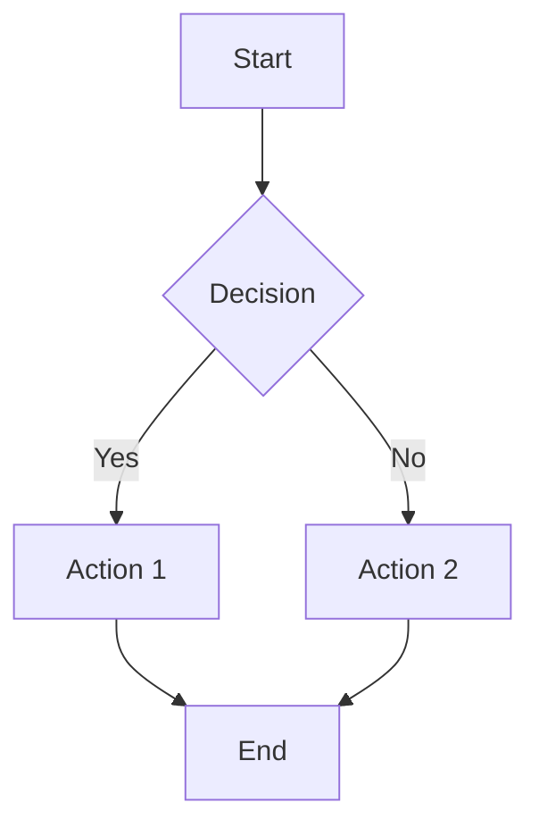

## Introduction
{: #introduction}

This is a complete, end-to-end guide to establishing a development environment and building a Jekyll site like [it-journey.dev](https://it-journey.dev). You will go from a brand-new machine to a fully deployed, content-rich static site using the [zer0-mistakes](https://github.com/bamr87/zer0-mistakes) theme, VS Code as your CMS, Docker for local development, and GitHub Pages for hosting.

### What You Will Build

By the end of this guide you will have:

- ✅ A **fully configured development environment** (Ruby, Jekyll, Git, Docker, VS Code)
- ✅ A **GitHub repository** with a Jekyll site using the zer0-mistakes theme
- ✅ **Multiple content collections** — posts, docs, quests, quickstart guides, and more
- ✅ **Sidebar navigation**, search, comments, analytics, and SEO built in
- ✅ **VS Code as a CMS** with FrontMatter CMS for visual content management
- ✅ **Docker-based local development** for a consistent, portable environment
- ✅ **Automated deployment** to GitHub Pages via GitHub Actions
- ✅ **Advanced features** — Mermaid diagrams, MathJax, syntax highlighting, and responsive design

### Tech Stack Overview

| Component | Technology | Version | Purpose |
|-----------|-----------|---------|---------|
| Language | [Ruby](https://www.ruby-lang.org/) | 3.2+ | Jekyll runtime |
| Generator | [Jekyll](https://jekyllrb.com/) | 3.9.5 | Static site generation |
| Theme | [zer0-mistakes](https://github.com/bamr87/zer0-mistakes) | latest | Bootstrap 5 responsive theme |
| CSS Framework | [Bootstrap](https://getbootstrap.com/) | 5.2 | Responsive layout and components |
| Template Language | [Liquid](https://shopify.github.io/liquid/) | 5.x | Dynamic content templates |
| Markdown | [Kramdown](https://kramdown.gettalong.org/) | 2.x | Content authoring |
| Hosting | [GitHub Pages](https://pages.github.com/) | — | Free static site hosting |
| CI/CD | [GitHub Actions](https://docs.github.com/en/actions) | — | Automated build and deploy |
| Container | [Docker](https://www.docker.com/) | 20+ | Consistent dev environment |
| Editor | [VS Code](https://code.visualstudio.com/) | latest | Code editing and CMS |
| CMS | [FrontMatter CMS](https://frontmatter.codes/) | latest | Visual content management |
| Diagrams | [Mermaid](https://mermaid.js.org/) | 10.x | Diagram rendering |
| Math | [MathJax](https://www.mathjax.org/) | 3.2 | Math equation rendering |
| Comments | [Giscus](https://giscus.app/) | — | GitHub Discussions-based comments |
| JS Library | [jQuery](https://jquery.com/) | 3.7 | DOM manipulation |

### Prerequisites

Before starting, ensure you have:

- [ ] A computer with **administrator access** (macOS, Windows, or Linux)
- [ ] A **stable internet connection**
- [ ] A [GitHub account](https://github.com/signup) (free)
- [ ] Basic familiarity with the **command line** (helpful, not required)

### Journey Overview

```mermaid
graph LR
    P1[Phase 1<br>Machine Setup] --> P2[Phase 2<br>Git & GitHub]
    P2 --> P3[Phase 3<br>Jekyll Install]
    P3 --> P4[Phase 4<br>Theme Setup]
    P4 --> P5[Phase 5<br>Project Structure]
    P5 --> P6[Phase 6<br>Configuration]
    P6 --> P7[Phase 7<br>Navigation]
    P7 --> P8[Phase 8<br>VS Code CMS]
    P8 --> P9[Phase 9<br>Docker Dev]
    P9 --> P10[Phase 10<br>Deploy]
    P10 --> P11[Phase 11<br>Content]
    P11 --> P12[Phase 12<br>Advanced]
    P12 --> P13[Phase 13<br>Maintain]
```



| Phase | Topic | Time Estimate |
|-------|-------|--------------|
| [Phase 1](#phase-1) | Machine & Environment Setup | 30–60 min |
| [Phase 2](#phase-2) | Git & GitHub Foundation | 15–30 min |
| [Phase 3](#phase-3) | Jekyll Installation & First Site | 15–30 min |
| [Phase 4](#phase-4) | zer0-mistakes Theme Implementation | 15–30 min |
| [Phase 5](#phase-5) | Project Structure & Collections | 20–40 min |
| [Phase 6](#phase-6) | Configuration Deep Dive | 30–60 min |
| [Phase 7](#phase-7) | Navigation & Sidebar Setup | 15–30 min |
| [Phase 8](#phase-8) | Content Management with VS Code | 15–30 min |
| [Phase 9](#phase-9) | Docker Development Environment | 15–30 min |
| [Phase 10](#phase-10) | GitHub Pages Deployment & CI/CD | 15–30 min |
| [Phase 11](#phase-11) | Writing & Managing Content | 20–40 min |
| [Phase 12](#phase-12) | Advanced Features | 30–60 min |
| [Phase 13](#phase-13) | Maintenance & Growth | Ongoing |

---

## Phase 1: Machine & Environment Setup
{: #phase-1}

Before writing any content, you need the core developer tools on your machine: a package manager, Git, Ruby, Node.js, and VS Code.

> 📖 **Detailed guide:** [Complete Machine Setup Guide](/quickstart/machine-setup/) covers every step with platform-specific automation scripts.
{: .notice}

### Quick Setup by Platform

#### macOS

```bash
# Install Homebrew (package manager)
/bin/bash -c "$(curl -fsSL https://raw.githubusercontent.com/Homebrew/install/HEAD/install.sh)"

# Install core developer tools
brew install git ruby node

# Add Homebrew Ruby to your PATH (Apple ships an old system Ruby)
echo 'export PATH="/opt/homebrew/opt/ruby/bin:$PATH"' >> ~/.zshrc
source ~/.zshrc

# Verify
ruby -v   # Should show 3.2+
git -v
node -v
```

#### Windows

```powershell
# Install Winget (built into Windows 11; update App Installer on Windows 10)
# Then install tools:
winget install Git.Git
winget install RubyInstallerTeam.Ruby.WithDevKit
winget install OpenJS.NodeJS
winget install Microsoft.VisualStudioCode

# Open a NEW terminal after installation, then verify:
ruby -v
git -v
node -v
```

> ⚠️ On Windows, the Ruby installer will prompt you to install MSYS2 and the development toolchain. **Accept all defaults** — this installs the C compiler needed to build native gem extensions.
{: .notice--warning}

#### Linux (Debian/Ubuntu)

```bash
# Update system and install essentials
sudo apt update && sudo apt install -y \
    git ruby-full build-essential zlib1g-dev nodejs npm

# Avoid installing gems as root
echo 'export GEM_HOME="$HOME/gems"' >> ~/.bashrc
echo 'export PATH="$HOME/gems/bin:$PATH"' >> ~/.bashrc
source ~/.bashrc

# Verify
ruby -v
git -v
node -v
```

### Install Jekyll and Bundler

Once Ruby is installed on any platform:

```bash
gem install jekyll bundler
jekyll -v   # Should show jekyll 4.x or 3.x
```

### Install VS Code

Download from [code.visualstudio.com](https://code.visualstudio.com/) or install via your package manager:

```bash
# macOS
brew install --cask visual-studio-code

# Windows (already installed above via winget)

# Linux (snap)
sudo snap install --classic code
```

> 🎯 **Quests:**
> - [Hello n00b — Begin Your IT Journey](/quests/hello-noob/) — Your very first steps
> - [VS Code Mastery](/quests/vscode-mastery/) — Setting up the ultimate dev environment
> - [Terminal Fundamentals](/quests/terminal-fundamentals/) — Command line essentials
{: .notice--success}

> 📖 **Official docs:**
> - [Ruby Installation](https://www.ruby-lang.org/en/documentation/installation/)
> - [Jekyll Installation](https://jekyllrb.com/docs/installation/)
> - [Homebrew](https://brew.sh/)
> - [VS Code Download](https://code.visualstudio.com/)
{: .notice}

---

## Phase 2: Git & GitHub Foundation
{: #phase-2}

Your site lives in a Git repository hosted on GitHub. This phase sets up version control, your GitHub account, and the repository that will hold your site.

> 📖 **Detailed guide:** [GitHub Setup](/quickstart/github/) covers forking, authentication, and submodule configuration.
{: .notice}

### Configure Git

```bash
# Set your identity (used in every commit)
git config --global user.name "Your Name"
git config --global user.email "your-email@example.com"

# Use 'main' as the default branch name
git config --global init.defaultBranch main

# Enable helpful coloring
git config --global color.ui auto
```

### Authenticate with GitHub

```bash
# Install GitHub CLI
brew install gh          # macOS
winget install GitHub.cli  # Windows
sudo apt install gh      # Linux

# Authenticate (follow the browser prompts)
gh auth login
```

### Create Your Repository

**Option A — Fork the IT-Journey repo** (recommended for learning):

```bash
gh repo fork bamr87/it-journey --clone
cd it-journey
```

**Option B — Create a fresh repository**:

```bash
# Create on GitHub and clone locally
gh repo create my-jekyll-site --public --clone
cd my-jekyll-site
git checkout -b main
```

**Option C — From a Jekyll starter**:

```bash
jekyll new my-jekyll-site
cd my-jekyll-site
git init
git add .
git commit -m "feat: initial Jekyll site"
gh repo create my-jekyll-site --public --source=. --push
```

> 🎯 **Quests:**
> - [Git Basics](/quests/git-basics/) — Core Git commands and concepts
> - [GitHub Pages Portal](/quests/github-pages-portal/) — Hosting static sites
> - [GitHub Pages Basics](/quests/github-pages-basics/) — Getting started with GitHub Pages
{: .notice--success}

> 📖 **Official docs:**
> - [Git Documentation](https://git-scm.com/doc)
> - [GitHub CLI Manual](https://cli.github.com/manual/)
> - [GitHub Quickstart](https://docs.github.com/en/get-started/quickstart)
{: .notice}

---

## Phase 3: Jekyll Installation & First Site
{: #phase-3}

Jekyll is the static site generator that transforms your Markdown files into a complete website. This phase creates and serves your first Jekyll site.

> 📖 **Detailed guide:** [Jekyll Setup](/quickstart/jekyll/) covers Jekyll fundamentals and troubleshooting.
{: .notice}

### Create a New Jekyll Site

If you started from Option B or C above, you already have a site. Otherwise:

```bash
jekyll new my-site
cd my-site
```

### Understand the Default Structure

```
my-site/
├── _config.yml          # Site-wide configuration
├── _posts/              # Blog posts (date-prefixed Markdown)
│   └── 2026-01-01-welcome-to-jekyll.markdown
├── _site/               # Generated output (git-ignored)
├── .gitignore
├── 404.html
├── about.markdown
├── Gemfile              # Ruby dependencies
├── Gemfile.lock
└── index.markdown       # Home page
```

### Serve Locally

```bash
bundle install        # Install gems from Gemfile
bundle exec jekyll serve --livereload
```

Open [http://localhost:4000](http://localhost:4000) in your browser. Changes to files are reflected automatically.

> ⚠️ **Ruby 3.0+ users:** If you see a `webrick` error, add it to your Gemfile: `gem "webrick"`, then run `bundle install` again.
{: .notice--warning}

### Key Jekyll Concepts

| Concept | Description |
|---------|-------------|
| **Front matter** | YAML between `---` markers at the top of any file — controls layout, title, date, etc. |
| **Collections** | Groups of related content (posts, docs, quests) — each rendered as pages |
| **Layouts** | HTML templates that wrap your content — defined in `_layouts/` |
| **Includes** | Reusable HTML fragments — defined in `_includes/` |
| **Data files** | YAML/JSON/CSV in `_data/` — accessible as `site.data.*` in templates |
| **Plugins** | Gems that extend Jekyll — listed in `_config.yml` under `plugins:` |
| **Liquid** | Template language used in layouts and includes — `{{ variable }}` and `` |
| **Sass/SCSS** | CSS preprocessor — files in `_sass/` are compiled automatically |

> 🎯 **Quests:**
> - [Jekyll Fundamentals](/quests/jekyll-fundamentals/) — Deep dive into Jekyll concepts
> - [Markdown Mastery](/quests/markdown-mastery/) — Rich content formatting
> - [Liquid Templating](/quests/liquid-templating/) — Jekyll's template language
> - [YAML Configuration](/quests/yaml-configuration/) — Structured data for Jekyll
{: .notice--success}

> 📖 **Official docs:**
> - [Jekyll Documentation](https://jekyllrb.com/docs/)
> - [Jekyll Quickstart](https://jekyllrb.com/docs/)
> - [Liquid Template Language](https://shopify.github.io/liquid/)
> - [Kramdown Syntax](https://kramdown.gettalong.org/syntax.html)
{: .notice}

> 📖 **IT-Journey docs:**
> - [Jekyll Documentation Index](/docs/jekyll/)
> - [Jekyll Configuration Guide](/docs/jekyll/jekyll-config/)
> - [Liquid in Jekyll](/docs/jekyll/jekyll-liquid/)
{: .notice}

---

## Phase 4: zer0-mistakes Theme Implementation
{: #phase-4}

The [zer0-mistakes](https://github.com/bamr87/zer0-mistakes) theme provides a responsive Bootstrap 5 layout with dark/light mode, sidebar navigation, table of contents, Mermaid diagrams, MathJax, and more. This phase replaces the default Jekyll theme.

### Update Your Gemfile

Replace the contents of your `Gemfile` with:

```ruby
source "https://rubygems.org"

gem 'github-pages'          # GitHub Pages-compatible gem bundle
gem 'jekyll-theme-zer0'     # zer0-mistakes theme (for local dev)

gem "ffi"                   # Foreign function interface (dependency)
gem 'webrick'               # Web server for Ruby 3.0+
```

Then install:

```bash
bundle install
```

### Configure the Remote Theme

Open `_config.yml` and set the remote theme:

```yaml
# Theme
remote_theme: "bamr87/zer0-mistakes"
```

For local development (without GitHub), create a `_config_dev.yml` override that uses the gem directly:

```yaml
# _config_dev.yml — overrides for local development
remote_theme: false
theme: "jekyll-theme-zer0"

incremental: true

plugins:
  - jekyll-relative-links
  - jekyll-seo-tag
  - jekyll-paginate

liquid:
  error_mode: warn
  strict_filters: false
```

> ⚠️ In Jekyll, keys in the override file **completely replace** the same key from the base config. The `plugins:` list above replaces (not merges with) the one in `_config.yml`. Include every plugin you need.
{: .notice--warning}

Serve with both configs:

```bash
bundle exec jekyll serve --config _config.yml,_config_dev.yml --livereload
```

### Theme Skin

The theme supports multiple Bootstrap color skins. Set the active skin in `_config.yml`:

```yaml
theme_skin: "dark"     # Options: dark, light, or any custom Bootstrap skin
```

### Required Plugins

These plugins are required (or strongly recommended) for the zer0-mistakes theme to work properly with GitHub Pages:

```yaml
plugins:
  - github-pages            # GitHub Pages compatibility bundle
  - jekyll-remote-theme     # Load theme from GitHub repository
  - jekyll-feed             # Atom feed generation (/feed.xml)
  - jekyll-sitemap          # Sitemap generation (/sitemap.xml)
  - jekyll-seo-tag          # SEO meta tags in <head>
  - jekyll-paginate          # Pagination for post listings
  - jekyll-relative-links   # Convert relative Markdown links
```

Add each of these to the `plugins:` array in your `_config.yml`. The `github-pages` gem bundles most of them, but they must be listed explicitly.

### Verify Theme Installation

After configuration, serve your site and verify:

```bash
bundle exec jekyll serve --livereload
```

You should see:
- Bootstrap 5 styling with the selected skin
- A responsive navigation bar
- Sidebar navigation (once configured)
- Footer with powered-by section

> 🎯 **Quests:**
> - [Personal Site](/quests/personal-site/) — Build your first site with the zer0-mistakes theme
> - [Begin Your IT Journey](/quests/begin-your-it-journey/) — Full project setup walkthrough
{: .notice--success}

> 📖 **Official docs:**
> - [zer0-mistakes Theme Repository](https://github.com/bamr87/zer0-mistakes)
> - [Jekyll Remote Theme Plugin](https://github.com/benbalter/jekyll-remote-theme)
> - [GitHub Pages Supported Themes](https://pages.github.com/themes/)
> - [Bootstrap 5 Documentation](https://getbootstrap.com/docs/5.2/)
{: .notice}

---

## Phase 5: Project Structure & Collections
{: #phase-5}

A site like it-journey.dev uses multiple content collections — posts, docs, quests, quickstart guides, and more. This phase sets up the full project directory structure.

### Recommended Directory Layout

```
my-site/
├── _config.yml                # Main configuration
├── _config_dev.yml            # Development overrides
├── _data/                     # Data files (YAML, JSON, CSV)
│   └── navigation/            # Sidebar and menu navigation
│       ├── main.yml           # Top navbar links
│       ├── docs.yml           # Docs sidebar
│       ├── quests.yml         # Quests sidebar
│       ├── quickstart.yml     # Quickstart sidebar
│       └── about.yml          # About sidebar
├── _includes/                 # Reusable HTML partials
│   └── components/            # Custom component overrides
├── _layouts/                  # Custom layout overrides
├── assets/                    # Static files
│   ├── css/                   # Custom stylesheets
│   ├── images/                # Site images
│   └── js/                    # Custom JavaScript
├── pages/                     # All content collections
│   ├── _posts/                # Blog posts (YYYY-MM-DD-title.md)
│   ├── _docs/                 # Documentation pages
│   ├── _quests/               # Gamified learning quests
│   ├── _quickstart/           # Quickstart guides (this guide!)
│   ├── _about/                # About pages
│   ├── _hobbies/              # Hobby content
│   ├── _notes/                # Personal notes
│   └── _notebooks/            # Jupyter notebook conversions
├── .frontmatter/              # FrontMatter CMS configuration
│   ├── templates/             # Content creation templates
│   └── database/              # CMS metadata database
├── .github/                   # GitHub Actions workflows
│   └── workflows/
├── docker-compose.yml         # Docker development setup
├── Dockerfile                 # Container build definition
├── Gemfile                    # Ruby dependencies
├── CNAME                      # Custom domain (optional)
└── README.md                  # Repository documentation
```

### Defining Collections

Collections are the core organizational unit in Jekyll. Each collection groups related content and can have its own URL pattern, default layout, and sidebar navigation.

Add every collection to `_config.yml`:

```yaml
collections_dir: pages    # All collections live under pages/

collections:
  posts:
    output: true
    permalink: /:collection/:year/:month/:day/:slug/
  docs:
    output: true
    permalink: /:collection/:categories/:name/
  quests:
    output: true
    permalink: /:collection/:categories/:name/
  quickstart:
    output: true
    permalink: /:collection/:name/
  about:
    output: true
    permalink: /:collection/:categories/:name/
  hobbies:
    output: true
    permalink: /:collection/:categories/:name/
  notes:
    output: true
    permalink: /:collection/:path/:name/
  notebooks:
    output: true
    permalink: /:collection/:path/:name/
```

Key options:

| Option | Description |
|--------|-------------|
| `output: true` | Generate individual HTML pages for each document |
| `permalink` | URL pattern for the collection — supports `:collection`, `:categories`, `:name`, `:slug`, `:year`, `:month`, `:day`, `:path` |

### Front Matter Defaults

Set defaults so you don't have to repeat the same front matter in every file. Add these to `_config.yml`:

```yaml
defaults:
  # Global defaults for every page
  - scope:
      path: ""
    values:
      layout: "root"
      author_profile: false
      read_time: true
      comments: false
      share: true
      related: true
      sidebar:
        nav: "main"

  # Posts
  - scope:
      path: "pages/_posts"
      type: "posts"
    values:
      layout: "article"
      author_profile: true
      read_time: true
      sidebar:
        nav: "dynamic"

  # Documentation
  - scope:
      path: "pages/_docs"
      type: "docs"
    values:
      layout: "default"
      author_profile: true
      read_time: true
      sidebar:
        nav: "docs"

  # Quests
  - scope:
      path: "pages/_quests"
      type: "quests"
    values:
      layout: "default"
      author_profile: true
      read_time: true
      sidebar:
        nav: "quests"
      permalink: "/:categories/:slug"

  # Quickstart guides
  - scope:
      path: "pages/_quickstart"
      type: "quickstart"
    values:
      layout: "default"
      sidebar:
        nav: "quickstart"

  # About pages
  - scope:
      path: "pages/_about"
      type: "about"
    values:
      layout: "default"
      sidebar:
        nav: "about"

  # Hobbies
  - scope:
      path: "pages/_hobbies"
      type: "hobbies"
    values:
      layout: "default"
      share: false
      author_profile: false
      sidebar:
        nav: "hobbies"

  # Notes and Notebooks
  - scope:
      path: "pages/_notes"
      type: "notes"
    values:
      layout: "default"
      share: false
      author_profile: false
      sidebar:
        nav: "notebooks"
  - scope:
      path: "pages/_notebooks"
      type: "notebooks"
    values:
      layout: "default"
      share: false
      author_profile: false
      sidebar:
        nav: "notebooks"
```

### Creating Collection Directories

```bash
# Create all collection directories
mkdir -p pages/{_posts,_docs,_quests,_quickstart,_about,_hobbies,_notes,_notebooks}
mkdir -p _data/navigation
mkdir -p _includes/components
mkdir -p _layouts
mkdir -p assets/{css,images,js}
mkdir -p .frontmatter/templates
```

> 🎯 **Quests:**
> - [Jekyll Fundamentals](/quests/jekyll-fundamentals/) — Collections, layouts, and includes
> - [YAML Configuration](/quests/yaml-configuration/) — Structured data and config
{: .notice--success}

> 📖 **Official docs:**
> - [Jekyll Collections](https://jekyllrb.com/docs/collections/)
> - [Jekyll Front Matter Defaults](https://jekyllrb.com/docs/configuration/front-matter-defaults/)
> - [Jekyll Directory Structure](https://jekyllrb.com/docs/structure/)
{: .notice}

> 📖 **IT-Journey docs:**
> - [Repository Structure](/docs/architecture/REPOSITORY_STRUCTURE/)
> - [Jekyll Implementation](/docs/architecture/JEKYLL_IMPLEMENTATION/)
{: .notice}

---

## Phase 6: Configuration Deep Dive
{: #phase-6}

The `_config.yml` file is the heart of your Jekyll site. This phase documents every important configuration option, organized by category.

### Site Identity

```yaml
title: "IT-Journey"
subtitle: "zer0 to her0"
url: https://it-journey.dev      # Your production URL (no trailing slash)
baseurl: ""                       # Subdirectory path (e.g., "/blog"); empty for root
description: >-
  An educational IT platform for learning modern development
  skills through gamified quests and hands-on guides.
```

### Author Information

```yaml
author:
  name: "Your Name"
  avatar: "/assets/images/avatar.png"    # Profile image
  email_hash: ""                          # Gravatar MD5 hash (optional)
  bio: "Your bio or tagline"
  location: "City, State"
  twitter_username: "yourhandle"
  github_username: "yourusername"
```

The author block powers the author profile sidebar shown on posts and docs (when `author_profile: true` in front matter defaults).

### Social Links

```yaml
social:
  links:
    - label: GitHub
      url: https://github.com/yourusername
    - label: Twitter
      url: https://twitter.com/yourhandle
    - label: LinkedIn
      url: https://linkedin.com/in/yourprofile
```

### Theme and Appearance

```yaml
remote_theme: "bamr87/zer0-mistakes"
theme_skin: "dark"         # Bootstrap color skin: dark, light
```

### Plugin Configuration

```yaml
plugins:
  - github-pages
  - jekyll-remote-theme
  - jekyll-feed
  - jekyll-sitemap
  - jekyll-seo-tag
  - jekyll-paginate
  - jekyll-relative-links
```

Each plugin adds functionality:

| Plugin | Purpose | Generated Output |
|--------|---------|-----------------|
| `github-pages` | GitHub Pages compatibility bundle | — |
| `jekyll-remote-theme` | Load theme from a GitHub repo | — |
| `jekyll-feed` | Atom/RSS feed | `/feed.xml` |
| `jekyll-sitemap` | XML sitemap for search engines | `/sitemap.xml` |
| `jekyll-seo-tag` | SEO meta tags in `<head>` | `<meta>` tags |
| `jekyll-paginate` | Paginate post listings | paginated index pages |
| `jekyll-relative-links` | Convert relative `.md` links to URLs | — |

### SEO and Analytics

```yaml
# Google Analytics 4
google_analytics: "G-XXXXXXXXXX"

# Search engine verification (paste the content value from each service)
google_site_verification: null
bing_site_verification: null
```

The `jekyll-seo-tag` plugin automatically generates:
- `<title>` tags with site and page title
- `<meta name="description">` from page descriptions
- Open Graph tags for social sharing
- Twitter card meta tags
- Canonical URL tags
- JSON-LD structured data

### Comments with Giscus

[Giscus](https://giscus.app/) provides a comment system powered by GitHub Discussions. Enable it in `_config.yml`:

```yaml
gisgus:
  enabled: true
  data-repo-id: "YOUR_REPO_ID"         # Get from giscus.app
  data-category-id: "YOUR_CATEGORY_ID" # Get from giscus.app
```

To set up Giscus:

1. Go to [giscus.app](https://giscus.app/)
2. Enter your repository URL
3. Choose the Discussions category for comments
4. Copy the `data-repo-id` and `data-category-id` values
5. Paste them into `_config.yml`

Then enable comments per-page via front matter:

```yaml
---
comments: true
---
```

Or enable globally in defaults:

```yaml
defaults:
  - scope:
      path: "pages/_posts"
    values:
      comments: true
```

### Footer and Powered-By

The theme renders a "Powered by" section in the footer. Configure the technologies shown:

```yaml
powered_by:
  - name: Ruby
    version: "3.2.3"
    url: https://www.ruby-lang.org/
  - name: Jekyll
    version: "3.9.5"
    url: https://jekyllrb.com/
  - name: Bootstrap
    version: "5.2.0"
    url: https://getbootstrap.com/
  - name: jQuery
    version: "3.7"
    url: https://jquery.com/
  - name: MathJax
    version: "3.2"
    url: https://www.mathjax.org/
  - name: GitHub Pages
    version: "232"
    url: https://pages.github.com/
  - name: Docker
    version: "20.10.8"
    url: https://www.docker.com/
```

### Sass Configuration

```yaml
sass:
  sass_dir: _sass
  style: expanded       # expanded (dev) or compressed (production)
```

### Exclude List

Tell Jekyll which files to **skip** during the build. This keeps scripts, Docker files, tests, and dev configuration out of your generated site:

```yaml
exclude:
  # Ruby / Jekyll
  - .sass-cache/
  - .jekyll-cache/
  - .bundle/
  - Gemfile
  - Gemfile.lock
  - vendor/

  # Build tools
  - node_modules/
  - _site/

  # Development files
  - .env
  - .DS_Store
  - .vscode/
  - .frontmatter/
  - .git/
  - .gitignore

  # Docker
  - Dockerfile
  - docker-compose.yml
  - docker-compose.*.yml

  # Scripts and tests
  - "*.sh"
  - "*.py"
  - scripts/
  - test/
  - Makefile

  # Documentation (build-time only)
  - docs/
  - TODO/
  - "*.log"
```

### Complete _config.yml Example

Here is a complete, annotated `_config.yml` showing all sections together:

```yaml
# ============================================================
# Site Identity
# ============================================================
title: "My Jekyll Site"
subtitle: "zer0 to her0"
url: https://yourusername.github.io   # Production URL
baseurl: ""
description: >-
  A Jekyll site powered by the zer0-mistakes theme.

founder: "Your Name"
copyright_year: 2025

# ============================================================
# Author
# ============================================================
author:
  name: "Your Name"
  avatar: "/assets/images/avatar.png"
  bio: "Your bio here"
  location: "City, State"
  github_username: "yourusername"

# ============================================================
# Theme
# ============================================================
remote_theme: "bamr87/zer0-mistakes"
theme_skin: "dark"

# ============================================================
# Plugins
# ============================================================
plugins:
  - github-pages
  - jekyll-remote-theme
  - jekyll-feed
  - jekyll-sitemap
  - jekyll-seo-tag
  - jekyll-paginate
  - jekyll-relative-links

# ============================================================
# Collections
# ============================================================
collections_dir: pages

collections:
  posts:
    output: true
    permalink: /:collection/:year/:month/:day/:slug/
  docs:
    output: true
    permalink: /:collection/:categories/:name/
  quests:
    output: true
    permalink: /:collection/:categories/:name/
  quickstart:
    output: true
    permalink: /:collection/:name/
  about:
    output: true
    permalink: /:collection/:categories/:name/

# ============================================================
# Front Matter Defaults
# ============================================================
defaults:
  - scope:
      path: ""
    values:
      layout: "root"
      sidebar:
        nav: "main"
  - scope:
      path: "pages/_posts"
      type: "posts"
    values:
      layout: "article"
      author_profile: true
      comments: true
      sidebar:
        nav: "dynamic"
  - scope:
      path: "pages/_docs"
      type: "docs"
    values:
      layout: "default"
      sidebar:
        nav: "docs"
  - scope:
      path: "pages/_quests"
      type: "quests"
    values:
      layout: "default"
      sidebar:
        nav: "quests"

# ============================================================
# Analytics & SEO
# ============================================================
google_analytics: ""

# ============================================================
# Comments (Giscus)
# ============================================================
gisgus:
  enabled: false

# ============================================================
# Powered By (Footer)
# ============================================================
powered_by:
  - name: Jekyll
    url: https://jekyllrb.com/
  - name: GitHub Pages
    url: https://pages.github.com/

# ============================================================
# Sass
# ============================================================
sass:
  sass_dir: _sass
  style: expanded

# ============================================================
# Exclude
# ============================================================
exclude:
  - .sass-cache/
  - .jekyll-cache/
  - Gemfile
  - Gemfile.lock
  - vendor/
  - node_modules/
  - Dockerfile
  - docker-compose.yml
  - scripts/
  - test/
  - docs/
  - "*.sh"
  - "*.py"
```

> 📖 **Official docs:**
> - [Jekyll Configuration](https://jekyllrb.com/docs/configuration/)
> - [Jekyll SEO Tag](https://github.com/jekyll/jekyll-seo-tag)
> - [Jekyll Feed](https://github.com/jekyll/jekyll-feed)
> - [Jekyll Sitemap](https://github.com/jekyll/jekyll-sitemap)
> - [Giscus Comments](https://giscus.app/)
> - [Google Analytics 4](https://analytics.google.com/)
{: .notice}

> 📖 **IT-Journey docs:**
> - [Jekyll Configuration Guide](/docs/jekyll/jekyll-config/)
{: .notice}

---

## Phase 7: Navigation & Sidebar Setup
{: #phase-7}

The zer0-mistakes theme uses YAML data files to define sidebar and top-bar navigation menus. Each collection can have its own sidebar.

### How Sidebar Navigation Works

1. You create a YAML file in `_data/navigation/` (e.g., `quickstart.yml`)
2. You reference that file name in front matter defaults: `sidebar: { nav: "quickstart" }`
3. The theme renders the sidebar automatically using the YAML structure

### Navigation YAML Structure

Create `_data/navigation/quickstart.yml`:

```yaml
- title: Quick-Start
  url: /quickstart/
  icon: bi-rocket-takeoff          # Bootstrap Icon class (optional)
  children:
    - title: Index
      url: /quickstart/
    - title: Machine Setup
      url: /quickstart/machine-setup
    - title: GitHub Setup
      url: /quickstart/github
    - title: Jekyll Setup
      url: /quickstart/jekyll
    - title: Charm Tools
      url: /quickstart/charm-setup/
- title: Related Guides
  icon: bi-signpost-2
  children:
    - title: VS Code for Neuroscience
      url: /quickstart/vscode-for-neuroscience
    - title: Django and Git
      url: /quickstart/setting-up-django-and-git
```

### Navigation YAML Format Reference

| Field | Description |
|-------|-------------|
| `title` | Display text for the link |
| `url` | URL path (relative to `baseurl`) |
| `icon` | [Bootstrap Icons](https://icons.getbootstrap.com/) class (optional) |
| `children` | Array of sub-items — creates an expandable section |

### Example: Docs Sidebar

Create `_data/navigation/docs.yml`:

```yaml
- title: Documentation
  url: /docs/
  icon: bi-book
  children:
    - title: Overview
      url: /docs/
    - title: Jekyll
      url: /docs/jekyll/
    - title: Configuration
      url: /docs/jekyll/jekyll-config/
    - title: Mermaid Diagrams
      url: /docs/jekyll/jekyll-diagram-with-mermaid/
    - title: MathJax
      url: /docs/jekyll/jekyll-math-symbols-with-mathjax/
    - title: Liquid Templates
      url: /docs/jekyll/jekyll-liquid/
    - title: FrontMatter CMS
      url: /docs/jekyll/jekyll-frontmatter-cms/
```

### Example: Main Navigation Bar

Create `_data/navigation/main.yml`:

```yaml
- title: Home
  url: /
  icon: bi-house
- title: Posts
  url: /posts/
  icon: bi-journal-text
- title: Docs
  url: /docs/
  icon: bi-book
- title: Quests
  url: /quests/
  icon: bi-trophy
- title: Quickstart
  url: /quickstart/
  icon: bi-rocket-takeoff
- title: About
  url: /about/
  icon: bi-info-circle
```

### Assigning Navigation to Pages

Navigation is assigned via front matter (or defaults). Example for a quickstart page:

```yaml
---
title: "My Quickstart Page"
sidebar:
  nav: quickstart        # Matches the filename: _data/navigation/quickstart.yml
---
```

> 📖 **Official docs:**
> - [Jekyll Data Files](https://jekyllrb.com/docs/datafiles/)
> - [Bootstrap Icons](https://icons.getbootstrap.com/)
{: .notice}

---

## Phase 8: Content Management with VS Code
{: #phase-8}

VS Code becomes your complete content management system with the right extensions and configuration.

### Essential VS Code Extensions

Install these extensions for the best Jekyll development experience:

| Extension | Purpose |
|-----------|---------|
| [FrontMatter CMS](https://marketplace.visualstudio.com/items?itemName=eliostruyf.vscode-front-matter) | Visual content management dashboard |
| [Markdown All in One](https://marketplace.visualstudio.com/items?itemName=yzhang.markdown-all-in-one) | Markdown shortcuts and preview |
| [YAML](https://marketplace.visualstudio.com/items?itemName=redhat.vscode-yaml) | YAML syntax support and validation |
| [Jekyll Snippets](https://marketplace.visualstudio.com/items?itemName=ginfuru.ginfuru-vscode-jekyll-syntax) | Liquid template snippets |
| [Code Spell Checker](https://marketplace.visualstudio.com/items?itemName=streetsidesoftware.code-spell-checker) | Catch typos in content |
| [GitLens](https://marketplace.visualstudio.com/items?itemName=eamodio.gitlens) | Git history and blame |
| [Docker](https://marketplace.visualstudio.com/items?itemName=ms-azuretools.vscode-docker) | Docker container management |
| [Dev Containers](https://marketplace.visualstudio.com/items?itemName=ms-vscode-remote.remote-containers) | Develop inside a container |
| [GitHub Copilot](https://marketplace.visualstudio.com/items?itemName=GitHub.copilot) | AI-powered code completion |
| [Mermaid Markdown Syntax](https://marketplace.visualstudio.com/items?itemName=bpruber.mermaid-markdown-syntax-highlighting) | Mermaid diagram preview |

### FrontMatter CMS Configuration

FrontMatter CMS turns VS Code into a full-featured content management system. Create a `frontmatter.json` at your project root:

```json
{
  "$schema": "https://frontmatter.codes/frontmatter.schema.json",
  "frontMatter.framework.id": "jekyll",
  "frontMatter.content.publicFolder": "assets",
  "frontMatter.dashboard.openOnStart": true,
  "frontMatter.templates.enabled": true,
  "frontMatter.content.pageFolders": [
    {
      "title": "Posts",
      "path": "[[workspace]]/pages/_posts",
      "contentTypes": ["default"],
      "previewPath": "/posts/"
    },
    {
      "title": "Docs",
      "path": "[[workspace]]/pages/_docs",
      "previewPath": "/docs/"
    },
    {
      "title": "Quests",
      "path": "[[workspace]]/pages/_quests",
      "contentTypes": ["quest"],
      "previewPath": "/quests/"
    },
    {
      "title": "Quickstart",
      "path": "[[workspace]]/pages/_quickstart",
      "previewPath": "/quickstart/"
    },
    {
      "title": "About",
      "path": "[[workspace]]/pages/_about",
      "previewPath": "/about/"
    }
  ],
  "frontMatter.content.draftField": {
    "name": "draft",
    "type": "choice",
    "choices": ["draft", "in progress", "published"]
  },
  "frontMatter.taxonomy.contentTypes": [
    {
      "name": "default",
      "pageBundle": false,
      "fields": [
        { "title": "Title", "name": "title", "type": "string" },
        { "title": "Description", "name": "description", "type": "string" },
        { "title": "Date", "name": "date", "type": "datetime", "default": "{{now}}", "isPublishDate": true },
        { "title": "Last Modified", "name": "lastmod", "type": "datetime", "default": "{{now}}", "isModifiedDate": true },
        { "title": "Tags", "name": "tags", "type": "tags" },
        { "title": "Categories", "name": "categories", "type": "categories" },
        { "title": "Preview Image", "name": "preview", "type": "image" },
        { "title": "Draft Status", "name": "draft", "type": "draft" }
      ]
    }
  ]
}
```

### Content Templates

Create reusable templates in `.frontmatter/templates/`. Here are examples used in IT-Journey:

**Article template** (`.frontmatter/templates/article.md`):

```markdown
---
title: "{{title}}"
description: ""
date: "{{now}}"
lastmod: "{{now}}"
tags: []
categories: []
layout: article
author_profile: true
---

## Introduction

Your content here.
```

**Quest template** (`.frontmatter/templates/quests.md`):

```markdown
---
title: "Quest Title"
description: ""
date: "{{now}}"
level: "0000"
difficulty: "🟢 Easy"
estimated_time: "1-2 hours"
primary_technology: ""
quest_type: "main_quest"
skill_focus: "devops"
fmContentType: quest
tags: []
categories:
  - Quests
---

## 🎯 Quest Objectives

- [ ] **Objective 1** — Description
- [ ] **Objective 2** — Description
```

### CMS Workflow

1. Open the FrontMatter Dashboard (`Ctrl+Shift+P` → "FrontMatter: Open Dashboard")
2. Browse, filter, and manage all content across collections
3. Create new content using templates
4. Edit front matter visually using the sidebar panel
5. Preview content in the built-in browser
6. Manage media assets through the Media Dashboard

> 📖 **Official docs:**
> - [FrontMatter CMS Documentation](https://frontmatter.codes/docs)
> - [VS Code Documentation](https://code.visualstudio.com/docs)
{: .notice}

> 📖 **IT-Journey docs:**
> - [Jekyll FrontMatter CMS Guide](/docs/jekyll/jekyll-frontmatter-cms/)
{: .notice}

---

## Phase 9: Docker Development Environment
{: #phase-9}

Docker ensures a consistent development environment across all machines and eliminates "works on my machine" issues.

### Docker Compose Configuration

Create a `docker-compose.yml` at the project root. Here is the configuration used by IT-Journey:

```yaml
services:
  jekyll:
    image: jekyll/jekyll:latest
    command: >
      jekyll serve --watch --force_polling
      --config "_config.yml,_config_dev.yml"
    volumes:
      - ./:/app
      - jekyll-cache:/app/.jekyll-cache
    ports:
      - "4002:4002"
    working_dir: /app
    env_file:
      - .env
    environment:
      JEKYLL_ENV: development

volumes:
  jekyll-cache:
```

Key configuration details:

| Setting | Purpose |
|---------|---------|
| `--config "_config.yml,_config_dev.yml"` | Loads base config then development overrides |
| `--watch --force_polling` | Auto-rebuild on file changes (required for Docker volumes) |
| `jekyll-cache` volume | Persists the build cache between container restarts |
| `.env` file | Loads environment variables (API keys, secrets) |

### Dockerfile (Optional Custom Image)

```dockerfile
FROM ruby:3.2-slim

# Install build dependencies
RUN apt-get update && apt-get install -y \
    build-essential \
    git \
    nodejs \
    && rm -rf /var/lib/apt/lists/*

WORKDIR /srv/jekyll

# Install Jekyll and dependencies
COPY Gemfile Gemfile.lock ./
RUN bundle install

# Copy site files
COPY . .

# Build and serve
EXPOSE 4000 35729
CMD ["bundle", "exec", "jekyll", "serve", "--host", "0.0.0.0", "--livereload"]
```

### Docker Commands

```bash
# Start development server
docker compose up

# Rebuild after Gemfile changes
docker compose up --build

# Run a one-off Jekyll build
docker compose run --rm jekyll bundle exec jekyll build

# Access the container shell
docker compose exec jekyll bash

# Stop containers
docker compose down

# Clean up volumes (nuclear option)
docker compose down -v
```

### VS Code + Docker Integration

1. Install the [Docker extension](https://marketplace.visualstudio.com/items?itemName=ms-azuretools.vscode-docker)
2. Install the [Dev Containers extension](https://marketplace.visualstudio.com/items?itemName=ms-vscode-remote.remote-containers)
3. Use the command palette: **"Dev Containers: Reopen in Container"**
4. This gives you a fully configured development environment inside Docker

> 📖 **Official docs:**
> - [Docker Documentation](https://docs.docker.com/)
> - [Docker Compose](https://docs.docker.com/compose/)
> - [VS Code Dev Containers](https://code.visualstudio.com/docs/devcontainers/containers)
{: .notice}

---

## Phase 10: GitHub Pages Deployment & CI/CD
{: #phase-10}

Deploy your site automatically every time you push to the `main` branch using GitHub Actions.

### Enable GitHub Pages

1. Go to your repository → **Settings** → **Pages**
2. Under **Source**, select **GitHub Actions**
3. GitHub will detect your Jekyll site and suggest a workflow

### GitHub Actions Workflow

Create `.github/workflows/jekyll-pages.yml`:

```yaml
name: Deploy Jekyll to GitHub Pages

on:
  push:
    branches: ["main"]
  workflow_dispatch:

permissions:
  contents: read
  pages: write
  id-token: write

concurrency:
  group: "pages"
  cancel-in-progress: false

jobs:
  build:
    runs-on: ubuntu-latest
    steps:
      - name: Checkout
        uses: actions/checkout@v4

      - name: Setup Ruby
        uses: ruby/setup-ruby@v1
        with:
          ruby-version: "3.2"
          bundler-cache: true

      - name: Setup Pages
        id: pages
        uses: actions/configure-pages@v4

      - name: Build Jekyll
        run: bundle exec jekyll build --baseurl "${{ steps.pages.outputs.base_path }}"
        env:
          JEKYLL_ENV: production

      - name: Upload artifact
        uses: actions/upload-pages-artifact@v3

  deploy:
    environment:
      name: github-pages
      url: ${{ steps.deployment.outputs.page_url }}
    runs-on: ubuntu-latest
    needs: build
    steps:
      - name: Deploy to GitHub Pages
        id: deployment
        uses: actions/deploy-pages@v4
```

> ⚠️ This workflow uses `secrets.GITHUB_TOKEN` (built-in) — no custom tokens required. The `permissions:` block grants the necessary scopes.
{: .notice--warning}

### Custom Domain (Optional)

To use a custom domain like `yoursite.dev`:

1. Add a `CNAME` file to your repository root with your domain:

   ```
   yoursite.dev
   ```

2. Configure DNS at your domain registrar:
   - **A records** pointing to GitHub Pages IPs:
     ```
     185.199.108.153
     185.199.109.153
     185.199.110.153
     185.199.111.153
     ```
   - **CNAME record** for `www` pointing to `yourusername.github.io`

3. Enable HTTPS in **Settings** → **Pages** → **Enforce HTTPS**

### Deployment Workflow

```bash
# Make changes to your site
git add .
git commit -m "feat: add new blog post"
git push origin main

# GitHub Actions automatically builds and deploys
# Check progress at: https://github.com/YOUR_USER/YOUR_REPO/actions
```

> 🎯 **Quests:**
> - [GitHub Pages Basics](/quests/github-pages-basics/) — Getting started with hosting
> - [GitHub Pages Portal](/quests/github-pages-portal/) — Hosting static sites
> - [Azure Ascension — Jekyll Deployment](/quests/azure-ascension-jekyll-deployment/) — Alternative: deploy to Azure
{: .notice--success}

> 📖 **Official docs:**
> - [GitHub Pages Documentation](https://docs.github.com/en/pages)
> - [GitHub Actions for Pages](https://docs.github.com/en/pages/getting-started-with-github-pages/configuring-a-publishing-source-for-your-github-pages-site#publishing-with-a-custom-github-actions-workflow)
> - [Custom Domains on GitHub Pages](https://docs.github.com/en/pages/configuring-a-custom-domain-for-your-github-pages-site)
{: .notice}

---

## Phase 11: Writing & Managing Content
{: #phase-11}

Now that your site is set up, here's how to create and manage different content types.

### Creating a Blog Post

Posts live in `pages/_posts/` and follow the naming convention `YYYY-MM-DD-title.md`:

```markdown
---
title: "My First Post"
description: "A brief introduction to my site"
date: 2026-01-15T10:00:00.000Z
lastmod: 2026-01-15T10:00:00.000Z
tags:
  - introduction
  - jekyll
categories:
  - Posts
layout: article
author_profile: true
---

## Welcome

This is my first blog post built with Jekyll and the zer0-mistakes theme.

### Code Example

```python
print("Hello, Jekyll!")
```
```

### Creating a Documentation Page

Documentation pages live in `pages/_docs/`:

```markdown
---
title: "Getting Started Guide"
description: "How to get started with our platform"
date: 2026-01-15T10:00:00.000Z
categories:
  - guides
layout: default
sidebar:
  nav: docs
---

## Getting Started

Follow these steps to begin...
```

### Creating a Quest

Quests live in `pages/_quests/` (organized by binary level code) and use gamified front matter:

```markdown
---
title: "Docker Mastery: Container Orchestration"
description: "Master container orchestration with Docker Compose"
date: 2026-01-15T10:00:00.000Z
level: 0100
difficulty: "🟡 Medium"
estimated_time: "2-4 hours"
primary_technology: "docker"
quest_type: "main_quest"
skill_focus: "devops"
fmContentType: quest
tags:
  - docker
  - containers
  - devops
categories:
  - Quests
---

## 🎯 Quest Objectives

- [ ] **Understand containers** — Learn what containers are and why they matter
- [ ] **Write Dockerfiles** — Create custom container images
- [ ] **Use Docker Compose** — Orchestrate multi-container applications
```

### Front Matter Reference

Common front matter fields used across all content types:

| Field | Type | Description |
|-------|------|-------------|
| `title` | string | Page title (required) |
| `description` | string | SEO description (150–300 chars) |
| `date` | datetime | Publication date (ISO 8601) |
| `lastmod` | datetime | Last modification date |
| `layout` | string | Page layout template (`article`, `default`, `root`) |
| `tags` | array | Content tags for filtering |
| `categories` | array | Content categories (used in permalinks) |
| `permalink` | string | Custom URL path override |
| `sidebar.nav` | string | Sidebar navigation key (references `_data/navigation/*.yml`) |
| `toc` | boolean | Show table of contents |
| `toc_sticky` | boolean | Sticky (scrolling) table of contents |
| `author_profile` | boolean | Show author sidebar |
| `read_time` | boolean | Show estimated reading time |
| `comments` | boolean | Enable Giscus comments |
| `share` | boolean | Show share buttons |
| `related` | boolean | Show related content |
| `preview` | string | Preview image path (`/assets/images/...`) |
| `draft` | boolean | Draft status (excluded from production build) |

> 🎯 **Quests:**
> - [Markdown Mastery](/quests/markdown-mastery/) — Rich documentation formatting
> - [Liquid Templating](/quests/liquid-templating/) — Jekyll template language
> - [Docs in a Row](/quests/docs-in-a-row/) — Documentation best practices
{: .notice--success}

> 📖 **Official docs:**
> - [Jekyll Posts](https://jekyllrb.com/docs/posts/)
> - [Jekyll Front Matter](https://jekyllrb.com/docs/front-matter/)
> - [Kramdown Syntax](https://kramdown.gettalong.org/syntax.html)
{: .notice}

---

## Phase 12: Advanced Features
{: #phase-12}

### Mermaid Diagrams

The zer0-mistakes theme includes built-in [Mermaid](https://mermaid.js.org/) diagram support via client-side rendering. Use fenced code blocks with the `mermaid` language identifier:

````markdown

````

Supported diagram types: flowcharts, sequence diagrams, Gantt charts, class diagrams, state diagrams, pie charts, entity-relationship diagrams, and more.

> 📖 **IT-Journey docs:** [Jekyll Mermaid Integration](/docs/jekyll/jekyll-diagram-with-mermaid/)
{: .notice}

### MathJax Support

Render mathematical equations with [MathJax](https://www.mathjax.org/) (included in the theme):

```markdown
Inline math: $E = mc^2$

Block math:

$$
\int_{-\infty}^{\infty} e^{-x^2} dx = \sqrt{\pi}
$$
```

> 📖 **IT-Journey docs:** [MathJax in Jekyll](/docs/jekyll/jekyll-math-symbols-with-mathjax/)
{: .notice}

### Syntax Highlighting

Code blocks use Rouge for syntax highlighting (built into Jekyll):

````markdown
```python
def hello(name: str) -> str:
    """Greet the user."""
    return f"Hello, {name}!"
```

```bash
#!/bin/bash
echo "Hello from Bash!"
```
````

Supported languages include Python, Ruby, JavaScript, Bash, YAML, JSON, HTML, CSS, SQL, and [many more](https://github.com/rouge-ruby/rouge/wiki/List-of-supported-languages-and-lexers).

### Responsive Images

```markdown
{: .img-fluid .rounded .shadow}
```

Bootstrap utility classes available via the theme:

| Class | Effect |
|-------|--------|
| `.img-fluid` | Responsive scaling |
| `.rounded` | Rounded corners |
| `.shadow` | Drop shadow |
| `.float-start` | Float left |
| `.float-end` | Float right |
| `.mx-auto .d-block` | Center block |

### Notices and Callouts

The theme supports styled notice blocks using Kramdown IAL (Inline Attribute Lists):

```markdown
> This is an info notice.
{: .notice--info}

> This is a success notice.
{: .notice--success}

> This is a warning notice.
{: .notice--warning}

> This is a danger notice.
{: .notice--danger}
```

### Tables

Tables are styled automatically by the theme with Bootstrap. Add responsive classes for wide tables:

```markdown
| Header 1 | Header 2 | Header 3 |
|----------|----------|----------|
| Cell 1   | Cell 2   | Cell 3   |
{: .table .table-bordered .table-striped .table-hover .table-responsive}
```

### Theme Layout Overrides

You can override any layout or include from the theme by placing a file with the same name in your project:

```
_layouts/quest-collection.html    # Overrides theme's quest-collection layout
_includes/components/powered-by.html  # Overrides theme's powered-by component
```

This lets you customize the theme without forking it. Jekyll checks your local directories first, then falls back to the theme.

> 📖 **Official docs:**
> - [Mermaid Documentation](https://mermaid.js.org/)
> - [MathJax Documentation](https://www.mathjax.org/)
> - [Rouge Syntax Highlighter](https://github.com/rouge-ruby/rouge)
> - [Bootstrap 5 Utilities](https://getbootstrap.com/docs/5.2/utilities/api/)
> - [Kramdown IAL](https://kramdown.gettalong.org/syntax.html#inline-attribute-lists)
{: .notice}

---

## Phase 13: Maintenance & Growth
{: #phase-13}

### Keeping Dependencies Updated

```bash
# Update Ruby gems
bundle update

# Check for outdated gems
bundle outdated

# Update the Gemfile.lock
bundle lock --update
```

### Link Validation

Use the IT-Journey Hyperlink Guardian to check for broken links:

```bash
python3 scripts/link-checker.py --scope website --timeout 30
```

### Content Validation

Validate quest content with the quest validator:

```bash
python3 test/quest-validator/quest_validator.py -d pages/_quests/
```

### Performance Optimization

- **Images**: Compress images before adding them to `assets/images/`
- **CSS**: The theme uses expanded SCSS in development — GitHub Pages compresses it in production
- **Incremental builds**: Use `--incremental` flag (or `_config_dev.yml`) for faster local rebuilds
- **Caching**: Docker volume mounts cache Bundler gems and the Jekyll cache between builds

### Git Workflow for Content

```bash
# Create a branch for new content
git checkout -b post/my-new-article

# Write and test locally
bundle exec jekyll serve --drafts --livereload

# Commit with conventional commit message
git add .
git commit -m "docs: add new article on Docker best practices"

# Push and create a pull request
git push origin post/my-new-article
# Open PR on GitHub for review
```

---

## Quick Reference

### Essential Commands

```bash
# Install dependencies
bundle install

# Serve locally (production config)
bundle exec jekyll serve

# Serve with dev overrides and live reload
bundle exec jekyll serve --config _config.yml,_config_dev.yml --livereload --drafts

# Build for production
JEKYLL_ENV=production bundle exec jekyll build

# Clean build artifacts
bundle exec jekyll clean

# Docker: start development server
docker compose up

# Docker: rebuild after changes
docker compose up --build

# Docker: stop
docker compose down
```

### File Naming Conventions

| Content Type | Location | Naming Pattern |
|-------------|----------|----------------|
| Posts | `pages/_posts/` | `YYYY-MM-DD-title-slug.md` |
| Docs | `pages/_docs/` | `topic-name.md` |
| Quests | `pages/_quests/LEVEL/` | `quest-name.md` |
| Quickstart | `pages/_quickstart/` | `page-name.md` |
| Navigation | `_data/navigation/` | `nav-name.yml` |
| Includes | `_includes/` | `component-name.html` |
| Layouts | `_layouts/` | `layout-name.html` |
| Templates | `.frontmatter/templates/` | `template-name.md` |

### Useful Links

| Resource | URL |
|----------|-----|
| **Jekyll Documentation** | [jekyllrb.com/docs](https://jekyllrb.com/docs/) |
| **zer0-mistakes Theme** | [github.com/bamr87/zer0-mistakes](https://github.com/bamr87/zer0-mistakes) |
| **GitHub Pages Docs** | [docs.github.com/en/pages](https://docs.github.com/en/pages) |
| **Bootstrap 5 Docs** | [getbootstrap.com/docs/5.2](https://getbootstrap.com/docs/5.2/) |
| **Liquid Template Language** | [shopify.github.io/liquid](https://shopify.github.io/liquid/) |
| **Kramdown Syntax** | [kramdown.gettalong.org](https://kramdown.gettalong.org/syntax.html) |
| **FrontMatter CMS** | [frontmatter.codes](https://frontmatter.codes/) |
| **Docker Documentation** | [docs.docker.com](https://docs.docker.com/) |
| **Mermaid Diagrams** | [mermaid.js.org](https://mermaid.js.org/) |
| **MathJax** | [mathjax.org](https://www.mathjax.org/) |
| **Bootstrap Icons** | [icons.getbootstrap.com](https://icons.getbootstrap.com/) |
| **Giscus Comments** | [giscus.app](https://giscus.app/) |
| **Google Analytics 4** | [analytics.google.com](https://analytics.google.com/) |
| **Rouge Highlighter** | [github.com/rouge-ruby/rouge](https://github.com/rouge-ruby/rouge) |
| **IT-Journey Live Site** | [it-journey.dev](https://it-journey.dev) |
| **IT-Journey Repository** | [github.com/bamr87/it-journey](https://github.com/bamr87/it-journey) |

---

## Other Quickstart Guides

Looking for something beyond Jekyll? Explore these additional quickstart resources:

### App Development

- [Front-end Development](/quickstart/front-end)
- [Back-end Development](/quickstart/back-end)
- [API Development](/quickstart/api-development)
- [Mobile Development](/quickstart/mobile-development)

### Cloud & DevOps

- [Azure](/quickstart/azure)
- [AWS](/quickstart/aws)
- [Google Cloud](/quickstart/google-cloud)
- [CI/CD with GitHub Actions](/quickstart/github-actions)
- [Kubernetes](/quickstart/kubernetes)

### Specialized Guides

- [VS Code for Neuroscience](/quickstart/vscode-for-neuroscience)
- [Django and Git Setup](/quickstart/setting-up-django-and-git)
- [Charm Terminal Tools](/quickstart/charm-setup/)
