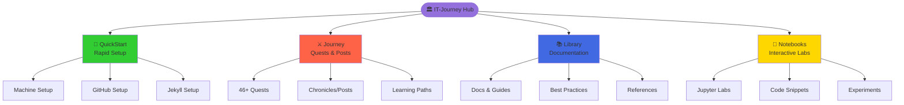
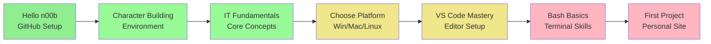
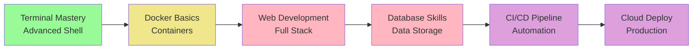
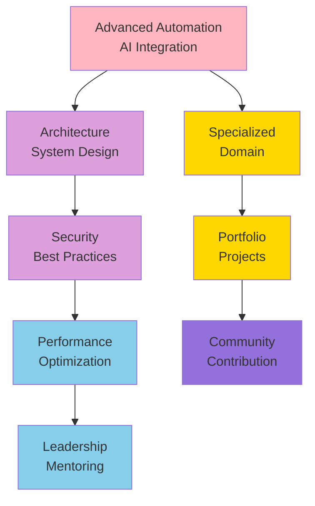
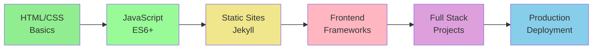
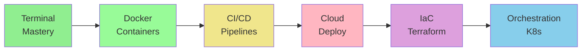
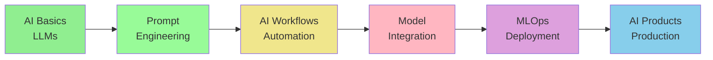
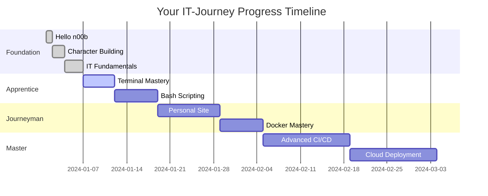

Go [Home]({{ page.backlink }})
{: .btn .btn-purple .border}

> *"Every expert was once a beginner who refused to give up after their first segmentation fault."*

Welcome to the IT-Journey roadmap - your comprehensive guide through the interconnected realms of technology mastery. This living document maps the pathways through our four core domains: **QuickStart**, **Journey**, **Library**, and **Notebook**.

* TOC
{:toc}

## 🌟 The Four Realms of IT-Journey

Our learning ecosystem is built on four interconnected pillars that feed into each other, creating a continuous cycle of growth and mastery:

### 🚀 QuickStart: The Launch Pad

Your entry point into digital mastery - rapid deployment tutorials to get you started immediately.

**Current State:** Active development with foundational tutorials

* ✅ [Machine Setup Guide](/quickstart/machine-setup/) - Complete development environment
* ✅ [GitHub Setup](/quickstart/github-setup/) - Version control fundamentals  
* ✅ [Jekyll Setup](/quickstart/jekyll-setup/) - Static site generation
* ✅ [Django & Git Setup](/quickstart/2025-03-08-setting-up-django-and-git/) - Web framework integration
* 🔄 [VS Code for Neuroscience](/quickstart/2025-07-22-vscode-for-neuroscience/) - (In Progress)

**Available QuickStart Tutorials:**

| Tutorial | Focus Area | Time | Level |
|----------|-----------|------|-------|
| [Machine Setup](/quickstart/machine-setup/) | Development Environment | 30-60 min | 🟢 Beginner |
| [GitHub Setup](/quickstart/github-setup/) | Version Control | 15-30 min | 🟢 Beginner |
| [Jekyll Setup](/quickstart/jekyll-setup/) | Static Sites | 20-40 min | 🟡 Intermediate |
| [Django & Git](/quickstart/2025-03-08-setting-up-django-and-git/) | Web Framework | 45-90 min | 🟡 Intermediate |

**Roadmap Goals:**

* **Phase 1:** Essential Developer Tools Setup
  * Complete Python development environment setup
  * Node.js and JavaScript toolchain configuration
  * Database setup guides (PostgreSQL, MongoDB)
  * Cloud platform initial setup (Azure, AWS basics)

* **Phase 2:** Platform-Specific Quick Starts
  * Azure Functions rapid deployment
  * Jekyll theme customization speedrun
  * API development with FastAPI/Express
  * Container orchestration with Docker Compose

### ⚔️ Journey: The Epic Adventure Paths

Where learning becomes an adventure through Posts and Quests - 46+ gamified learning experiences await!

**Current State:** Rich quest system with gamified learning

* ✅ Multi-level quest progression system (Level 0, 1, 10+)
* ✅ Fantasy-themed learning adventures
* ✅ Real-world skill application through challenges
* ✅ AI-assisted development methodologies

**Quest Navigation Hub:** [Browse All Quests](/quests/) | [World Map Guide](/quests/codex/world_map/)

#### 🗺️ Quest System by Level

**🌱 Level 0000 - Foundation Quests (Init World)**
*Your origin story and character creation*

| Quest | Focus | Difficulty | Platform |
|-------|-------|------------|----------|
| [Hello n00b](/quests/0000/hello-noob/) | GitHub & Community | 🟢 Easy | All |
| [Character Building](/quests/0000/character-building/) | Environment Setup | 🟢 Easy | All |
| [IT Fundamentals](/quests/0000/it-fundamentals/) | Core Concepts | 🟢 Easy | All |
| [OS Selection](/quests/0000/os-selection/) | Platform Choice | 🟢 Easy | All |
| [VS Code Mastery](/quests/0000/vscode-mastery-quest/) | IDE Configuration | 🟡 Medium | All |
| [Terminal Fundamentals](/quests/0000/terminal-fundamentals/) | Command Line Basics | 🟢 Easy | All |
| [Markdown Mastery](/quests/0000/markdown-mastery/) | Documentation | 🟢 Easy | All |
| [Git Basics](/quests/0000/git-basics/) | Version Control | 🟢 Easy | All |

**Platform-Specific Paths:**
- [Hello Windows](/quests/0000/hello-win/) - 🪟 Windows development setup
- [Hello macOS](/quests/0000/hello-mac/) - 🍎 Mac development environment
- [Hello Linux](/quests/0000/hello-linux/) - 🐧 Linux configuration
- [Hello Cloud](/quests/0000/hello-cloud/) - ☁️ Cloud platform basics

**🟢 Level 0001 - Apprentice Trials**
*Build your first projects and master the web*

| Quest | Technology | Time | Type |
|-------|-----------|------|------|
| [Personal Site](/quests/0001/personal-site/) | Web Development | 90-120 min | 🏰 Main |
| [Jekyll Fundamentals](/quests/0001/jekyll-fundamentals/) | Static Sites | 60-90 min | 🏰 Main |
| [GitHub Pages Basics](/quests/0001/github-pages-basics/) | Web Hosting | 45-60 min | 🏰 Main |
| [Liquid Templating](/quests/0001/liquid-templating/) | Template Engine | 60-90 min | ⚔️ Side |
| [YAML Configuration](/quests/0001/yaml-configuration/) | Data Formats | 30-45 min | ⚔️ Side |
| [Terminal Illness](/quests/0001/terminal-illness/) | Advanced Terminal | 60-90 min | ⚔️ Side |

**🟡 Level 0010 - Journeyman Challenges**
*Master scripting and advanced tooling*

| Quest | Focus | Deliverable | Level |
|-------|-------|-------------|-------|
| [Bash Scripting](/quests/0010/bash-scripting/) | Shell Automation | Scripts Library | 🟡 Medium |
| [Oh-My-Zsh Enchantment](/quests/0010/oh-my-zsh-terminal-enchantment/) | Terminal Enhancement | Custom Shell | 🟡 Medium |
| [Nerd Font Enchantment](/quests/0010/nerd-font-enchantment-side-quest/) | Terminal Icons | Enhanced Terminal | 🟢 Easy |
| [Jekyll-Mermaid Integration](/quests/0010/jekyll-mermaid-integration-quest/) | Diagram Integration | Documentation | 🟡 Medium |
| [JavaScript Fundamentals](/quests/0010/javascript-fundamentals/) | Frontend Dev | Interactive Sites | 🟡 Medium |
| [CSS Styling Basics](/quests/0010/css-styling-basics/) | Design | Styled Pages | 🟢 Easy |

**🔴 Level 0011+ - Master Tier**
*Advanced configurations and optimizations*

| Quest | Specialization | Time | Prerequisites |
|-------|---------------|------|---------------|
| [Prompt Crystal Mastery](/quests/0011/prompt-crystal-mastery-vscode-copilot-quest/) | AI & Copilot | 60-90 min | VS Code basics |
| [GitHub Hidden Gem](/quests/0011/github-hidden-gem-code-search-quest/) | Advanced Search | 45-60 min | GitHub basics |
| [SEO Optimization](/quests/0011/seo-optimization/) | Web Performance | 60-90 min | Web fundamentals |
| [Advanced Git Workflows](/quests/0011/advanced-git-workflows/) | Version Control | 90-120 min | Git basics |

#### 🎯 Specialized Quest Categories

**🔧 DevOps & Automation (Level 0100-0101)**
- [Container Fundamentals](/quests/0100/container-fundamentals/) - Docker basics
- [Docker Compose Orchestration](/quests/0100/docker-compose-orchestration/) - Multi-container apps
- [GitHub Actions Basics](/quests/0101/github-actions-basics/) - CI/CD automation
- [CI/CD Fundamentals](/quests/0101/cicd-fundamentals/) - Pipeline design
- [Deployment Pipelines](/quests/0101/deployment-pipelines/) - Production workflows

**🎨 Frontend & Documentation (Level 0100)**
- [Jekyll-Mermaid Integration](/quests/0010/jekyll-mermaid-integration-quest/) - Diagram integration
- [Frontend Development](/quests/0100/frontend/) - UI/UX development
- [Frontend Docker](/quests/0100/frontend-docker/) - Containerized frontend
- [Bootstrap Framework](/quests/0010/bootstrap-framework/) - CSS framework

**🤖 AI-Powered Development (Level 0010-0011)**
- [Prompt Engineering](/quests/0010/prompt-engineering/) - AI prompt skills
- [Prompt Crystal Mastery](/quests/0011/prompt-crystal-mastery-vscode-copilot-quest/) - VS Code Copilot
- [AI Development Posts](/posts/tags/ai/) - Real-world AI applications

**📜 Chronicles & Learning Posts**
*Battle-tested wisdom from the community*

**By Category:**
- [AI & Machine Learning](/posts/tags/ai/) - 15+ posts on AI development
- [DevOps](/posts/tags/devops/) - CI/CD, Docker, deployment strategies
- [System Administration](/posts/tags/system-admin/) - Linux, Windows configuration
- [Web Development](/posts/tags/web-dev/) - Frontend, backend, full-stack

**Recent Chronicles (2024-2025):**
- [Advanced Version Management with AI](/posts/2025-07-05-advanced-version-management-ai-implementation/)
- [Debugging GitHub Actions Workflows](/posts/2025-07-05-debugging-github-actions-workflows-ai-assisted/)
- [Dockering Your IT-Journey](/posts/2024-04-02-dockering-your-it-journey/)

**Roadmap Goals:**

* **Phase 1:** Quest System Enhancement
  * Complete beginner path (Level 0-3) covering fundamentals
  * Intermediate adventures (Level 4-7) for specialized skills
  * Advanced challenges (Level 8-10+) for mastery demonstration
  * Cross-platform compatibility quests (macOS, Windows, Linux)

* **Phase 2:** AI-Powered Learning Integration
  * AI-assisted code review and feedback in quests
  * Personalized learning path recommendations
  * Automated progress tracking and skill assessment
  * Community collaboration features within quests

### 📚 Library: The Sacred Repository

Deep knowledge vaults for comprehensive understanding - your technical reference library.

**Current State:** Growing documentation ecosystem

* ✅ Structured documentation hierarchy
* ✅ Integration with Jekyll and GitHub Pages
* ✅ Search functionality and navigation
* ✅ Version control and collaborative editing

**Library Access:** [Documentation Hub](/docs/)

#### 📖 Available Documentation

**Core Documentation:**
- [Jekyll Documentation](/docs/jekyll/) - Static site generation guides
- [Site Configuration](/about/config/) - Platform settings and customization
- [Theme Customization](/about/theme/) - Visual design and layouts

**Platform Guides:**
- [Contributing Guide](/about/contributing/) - How to add content
- [Sitemap](/about/sitemap/) - Complete site structure
- [Feature Overview](/about/features/) - Platform capabilities

**Best Practices & Standards:**
- [Development Principles](/about/) - DFF, DRY, KIS, REnO, MVP, COLAB, AIPD
- Quest Creation Instructions - See `.github/instructions/quest.instructions.md`
- Post Creation Instructions - See `.github/instructions/posts.instructions.md`

**Roadmap Goals:**

* **Phase 1:** Core Knowledge Domains
  * Comprehensive Python development guides
  * JavaScript/Node.js ecosystem documentation
  * DevOps and containerization best practices
  * Cloud architecture patterns and implementations

* **Phase 2:** Advanced Technical References
  * AI/ML integration patterns for developers
  * Security best practices and implementation guides
  * Performance optimization strategies
  * Architecture decision records and case studies

<!-- TODO: Phase 3 - periodic and automatic library evolution of content -->

### 📔 Notebook: Your Personal Grimoire

Interactive code environments and personal knowledge capture - learn by doing!

**Current State:** Jupyter notebook integration framework

* ✅ Notebook collection structure
* ✅ Jekyll integration for notebook rendering
* ✅ Code snippet management system
* ✅ Personal learning log capabilities

**Notebook Hub:** [Interactive Notebooks](/notebooks/)

#### 💻 Available Notebooks

**Interactive Learning Labs:**
- [JeykLLM Create](/notebooks/JeykLLM-create.html) - AI-powered Jekyll content generation
- [HTML/MD Doc Scraper](/notebooks/html_md_doc_scrapper.html) - Web scraping automation
- [Jupyter to Markdown](/notebooks/jupyter-to-markdown.html) - Notebook conversion tools
- [Markdown to Script](/notebooks/markdown-to-script.html) - Documentation automation

**Code Collections:**
- Personal experiments and explorations
- Algorithm implementations
- Data analysis projects
- Automation script development

**Roadmap Goals:**

* **Phase 1:** Enhanced Interactive Learning
  * Executable code examples within documentation
  * Live coding environments for tutorials
  * Progress tracking and personal metrics
  * Knowledge base search and retrieval

* **Phase 2:** AI-Enhanced Note-Taking
  * Automated code documentation generation
  * Smart tagging and categorization
  * Cross-reference discovery between notes and quests
  * Collaborative notebook sharing and community insights

## 🎓 Complete Learning Paths from Beginner to Expert

Choose your journey based on your experience level and goals:

### 🌱 Complete Beginner Path (0-3 Months)
*"I'm brand new to IT and want to start from scratch"*

**Step-by-Step Path:**
1. [Hello n00b Quest](/quests/0000/hello-noob/) - 15-30 min - Set up GitHub account
2. [Character Building](/quests/0000/character-building/) - 30-45 min - Configure development environment
3. [IT Fundamentals](/quests/0000/it-fundamentals/) - 60 min - Learn core concepts
4. **Platform Selection:**
   - [Hello Windows](/quests/0000/hello-win/) OR
   - [Hello macOS](/quests/0000/hello-mac/) OR
   - [Hello Linux](/quests/0000/hello-linux/)
5. [VS Code Mastery](/quests/0000/vscode-mastery-quest/) - 90 min - Master your primary tool
6. [Bash Run Quest](/quests/0000/bash-run/) - 90 min - Terminal game learning
7. [Personal Site Project](/quests/0001/personal-site/) - Build your portfolio

**Supporting Resources:**
- [Machine Setup QuickStart](/quickstart/machine-setup/) - Environment setup
- [GitHub Setup QuickStart](/quickstart/github-setup/) - Version control basics

---

### 🚀 Intermediate Developer Path (3-6 Months)
*"I know the basics and want to build real projects"*

**Recommended Quest Path:**
1. [Oh-My-Zsh Enchantment](/quests/0010/oh-my-zsh-terminal-enchantment/) - Enhanced terminal
2. [Nerd Font Enchantment](/quests/0010/nerd-font-enchantment-side-quest/) - Terminal customization
3. [Container Fundamentals](/quests/0100/container-fundamentals/) - Containerization
4. [Jekyll-Mermaid Integration](/quests/0010/jekyll-mermaid-integration-quest/) - Documentation
5. [GitHub Actions Basics](/quests/0101/github-actions-basics/) - CI/CD automation
6. [Hello Cloud](/quests/0000/hello-cloud/) - Cloud deployment

**Skill Building:**
- [Frontend Development](/quests/0100/frontend/) - UI/UX development
- [Bash Scripting](/quests/0010/bash-scripting/) - Automation scripts
- [Django & Git Setup](/quickstart/2025-03-08-setting-up-django-and-git/) - Web framework

**Learn from Experience:**
- [DevOps Posts](/posts/tags/devops/) - Real-world deployments
- [Docker Chronicles](/posts/2024-04-02-dockering-your-it-journey/) - Container strategies
- [GitHub Actions Debugging](/posts/2025-07-05-debugging-github-actions-workflows-ai-assisted/) - CI/CD troubleshooting

---

### ⚡ Advanced Professional Path (6+ Months)
*"I want mastery and professional-level skills"*

**Advanced Quest Progression:**
1. [Prompt Crystal Mastery](/quests/0011/prompt-crystal-mastery-vscode-copilot-quest/) - AI-powered workflows
2. [Advanced Version Management](/posts/devops/2025-07-05-advanced-version-management-ai-implementation/) - Complex CI/CD
3. Choose specialization path:
   - **Frontend:** Advanced frameworks, performance optimization
   - **Backend:** Microservices, system architecture
   - **DevOps:** Kubernetes, infrastructure as code
   - **AI/ML:** Model deployment, MLOps

**Master-Level Resources:**
- [AI Development Posts](/posts/tags/ai/) - Cutting-edge AI integration
- [System Architecture](/posts/tags/architecture/) - Design patterns
- [Performance Optimization](/posts/tags/performance/) - Scaling strategies

**Professional Development:**
- Contribute to open-source projects
- Create new quests for the community
- Mentor beginners through their journey
- Build portfolio projects showcasing expertise

---

## 🔮 AI-Powered Development Philosophy Integration

Our roadmap is guided by the core principles outlined in our Copilot Instructions:

### Core Development Principles Implementation

* **Design for Failure (DFF):** All tutorials include error handling and troubleshooting
* **Don't Repeat Yourself (DRY):** Reusable components across all learning materials
* **Keep It Simple (KIS):** Progressive complexity in learning paths
* **Release Early and Often (REnO):** Continuous content updates and improvements
* **Minimum Viable Product (MVP):** Start with functional basics, enhance iteratively
* **Collaboration (COLAB):** Community-driven content and peer learning
* **AI-Powered Development (AIPD):** AI assistance integrated throughout the learning journey

### Technology Mastery Paths

#### 🌐 Web Development Mastery

The Path of the Digital Architect

1. **Foundation Realm** (QuickStart)
   * [Jekyll Setup](/quickstart/jekyll-setup/) - Static site generation mastery
   * [Machine Setup](/quickstart/machine-setup/) - Development environment
   * HTML/CSS fundamentals with live examples
   * JavaScript essentials and modern ES6+ features

2. **Adventure Realm** (Journey/Quests)
   * [Personal Site Project](/quests/0001/personal-site/) - Build your portfolio
   * [Frontend Development](/quests/0100/frontend/) - UI/UX development path
   * [Jekyll-Mermaid Integration](/quests/0010/jekyll-mermaid-integration-quest/) - Enhanced documentation
   * Backend API development challenges

3. **Knowledge Vault** (Library)
   * [Jekyll Documentation](/docs/jekyll/) - Comprehensive guides
   * [Theme Customization](/about/theme/) - Design patterns
   * Web performance optimization guides
   * Security best practices for web applications
   * Accessibility and inclusive design principles

4. **Personal Codex** (Notebook)
   * [HTML/MD Scraper Notebook](/notebooks/html_md_doc_scrapper.html) - Web scraping
   * [JeykLLM Create](/notebooks/JeykLLM-create.html) - Content generation
   * Code snippet collections for common patterns
   * Project templates and boilerplates
   * Personal learning reflections and insights

**Web Development Posts:**
- [Angular Tour of Heroes](/posts/2022-07-01-angular-tour-of-heros/) - Framework tutorial
- [Frontend Development Chronicles](/posts/tags/frontend/) - Real-world examples

#### ☁️ Cloud & DevOps Mastery

The Path of the Infrastructure Sage

1. **Foundation Realm** (QuickStart)
   * [Machine Setup](/quickstart/machine-setup/) - Development tools
   * [Django & Git Setup](/quickstart/2025-03-08-setting-up-django-and-git/) - Version control integration
   * Docker containerization speedrun
   * CI/CD pipeline setup with GitHub Actions

2. **Adventure Realm** (Journey/Quests)
   * [Bash Scripting Quest](/quests/0010/bash-scripting/) - Automation fundamentals
   * [Container Fundamentals](/quests/0100/container-fundamentals/) - Containerization deep dive
   * [GitHub Actions Basics](/quests/0101/github-actions-basics/) - CI/CD automation
   * [Hello Cloud](/quests/0000/hello-cloud/) - Cloud platform basics
   * [CI/CD Fundamentals](/quests/0101/cicd-fundamentals/) - Pipeline design
   * Container orchestration challenges
   * Infrastructure as Code (Terraform) quests
   * Monitoring and observability adventures

3. **Knowledge Vault** (Library)
   * [Contributing Guide](/about/contributing/) - Collaboration workflows
   * [Site Configuration](/about/config/) - Platform management
   * Cloud architecture patterns and best practices
   * Security and compliance in cloud environments
   * Cost optimization strategies and tools

4. **Personal Codex** (Notebook)
   * [Markdown to Script](/notebooks/markdown-to-script.html) - Automation tools
   * Infrastructure templates and configurations
   * Troubleshooting guides and runbooks
   * Performance metrics and optimization notes

**DevOps Chronicles:**
- [Dockering Your IT-Journey](/posts/2024-04-02-dockering-your-it-journey/) - Container strategies
- [GitHub Actions Debugging](/posts/2025-07-05-debugging-github-actions-workflows-ai-assisted/) - CI/CD troubleshooting
- [Advanced Version Management](/posts/2025-07-05-advanced-version-management-ai-implementation/) - Complex workflows
- [Deploy Django on AWS Lambda](/posts/devops/deploy-django-on-aws-lambda-with-sam-a-step-by-step-guide/) - Serverless deployment
- [All DevOps Posts](/posts/tags/devops/) - Complete collection

#### 🤖 AI-Enhanced Development Mastery

The Path of the Code Sorcerer

1. **Foundation Realm** (QuickStart)
   * AI development environment setup
   * Introduction to LLMs and AI APIs
   * Prompt engineering fundamentals

2. **Adventure Realm** (Journey/Quests)
   * [Prompt Crystal Mastery](/quests/0011/prompt-crystal-mastery-vscode-copilot-quest/) - Workflow automation
   * [Prompt Engineering](/quests/0010/prompt-engineering/) - AI prompt skills
   * Build AI-powered applications
   * Create intelligent automation workflows
   * Implement ML model deployment pipelines

3. **Knowledge Vault** (Library)
   * [Quest Creation Guide](.github/instructions/quest.instructions.md) - AI-assisted content
   * [Post Creation Guidelines](.github/instructions/posts.instructions.md) - AI documentation
   * AI integration patterns and best practices
   * Ethical AI development guidelines
   * Performance and scaling considerations

4. **Personal Codex** (Notebook)
   * [JeykLLM Create](/notebooks/JeykLLM-create.html) - AI content generation
   * AI model experiments and results
   * Prompt templates and optimization techniques
   * Integration code patterns and examples

**AI Development Chronicles:**
- [Advanced Version Management AI](/posts/2025-07-05-advanced-version-management-ai-implementation/) - AI automation
- [AI-Assisted Script Consolidation](/posts/devops/ai-assisted-script-consolidation-development-workflows/) - Workflow optimization
- [GPT Prompt Engineering](/posts/ai%20&%20machine%20learning/gpt-prompt-engineering/) - Prompt techniques
- [AI to Create AI](/posts/ai%20&%20machine%20learning/ai-to-create-ai/) - Meta-learning
- [Open AI Future Features](/posts/ai%20&%20machine%20learning/open-ai-future-features-with-github-action/) - GitHub integration
- [From Programmed to Grokking Off](/posts/ai%20&%20machine%20learning/from-programmed-to-grokking-off/) - AI evolution
- [All AI/ML Posts](/posts/tags/ai/) - Complete AI collection

## 🚀 Immediate Next Steps (Q1 2026)

### Priority 1: Core Infrastructure Enhancement

* [ ] Complete QuickStart tutorial suite for essential tools
* [ ] Enhance quest progression system with clear skill checkpoints
* [ ] Implement robust search functionality across all content
* [ ] Establish automated content validation and testing

### Priority 2: Community Engagement Features

* [ ] Create contribution guidelines and templates
* [ ] Implement community feedback and rating systems
* [ ] Establish mentorship pathways within the quest system
* [ ] Build collaboration tools for group learning

### Priority 3: AI Integration Expansion

* [ ] Integrate AI-powered content recommendations
* [ ] Implement automated learning path optimization
* [ ] Create AI-assisted debugging and code review features
* [ ] Develop intelligent progress tracking and assessment

## 🌟 Long-term Vision (2026 and Beyond)

### The Interconnected Learning Ecosystem

Transform IT-Journey into a comprehensive platform where:

* **QuickStart** tutorials dynamically adapt to user skill level
* **Journey** quests provide personalized learning adventures
* **Library** documentation evolves based on community needs
* **Notebook** collections become shareable learning resources

### AI-Native Learning Platform

* Personalized learning paths generated by AI analysis
* Real-time code assistance and mentoring
* Automated skill assessment and certification
* Community-driven content curation with AI enhancement

### Global IT Education Impact

* Multi-language support for global accessibility
* Industry partnership programs for real-world skill validation
* Open-source educational resource sharing
* Contribution to democratizing IT education worldwide

## 🧭 Quick Navigation & Resource Index

### 📍 Essential Starting Points

**Absolute Beginners:**
1. [Hello n00b Quest](/quests/0000/hello-noob/) - Your first 30 minutes
2. [Machine Setup QuickStart](/quickstart/machine-setup/) - Configure your system
3. [Character Building](/quests/0000/character-building/) - Set up your environment
4. [World Map Guide](/quests/codex/world_map/) - Navigate the platform

**Developers with Experience:**
1. [All Quests Index](/quests/) - Browse 46+ quests
2. [Chronicle Archives](/posts/) - Learning from experience
3. [Documentation Hub](/docs/) - Technical references
4. [Interactive Notebooks](/notebooks/) - Hands-on labs

### 🎯 Quest Categories (Complete Index)

**By Level:**
- 🌱 [Level 0000](/quests/0000/) - Foundation & platform setup (15+ quests)
- 🟢 [Level 0001](/quests/0001/) - Apprentice: Web development basics (10+ quests)
- 🟡 [Level 0010](/quests/0010/) - Journeyman: Scripting & tooling (12+ quests)
- 🟠 [Level 0011](/quests/0011/) - Advanced: Git & optimization (8+ quests)
- 🔴 [Level 0100](/quests/0100/) - Expert: Containers & frontend (10+ quests)
- 🟣 [Level 0101](/quests/0101/) - Master: CI/CD & deployment (10+ quests)

**By Technology:**
- 🎨 [Frontend Development](/quests/0100/frontend/) - UI/UX and web technologies
- 🐳 Docker & Containers - [Container Fundamentals](/quests/0100/container-fundamentals/)
- ⚡ Terminal Enhancement - [Oh-My-Zsh](/quests/0010/oh-my-zsh-terminal-enchantment/), [Nerd Fonts](/quests/0010/nerd-font-enchantment-side-quest/)
- 🤖 AI Integration - [Prompt Crystal Mastery](/quests/0011/prompt-crystal-mastery-vscode-copilot-quest/)
- 📝 Documentation - [Jekyll-Mermaid](/quests/0010/jekyll-mermaid-integration-quest/)
- ⚙️ CI/CD - [GitHub Actions](/quests/0101/github-actions-basics/), [CI/CD Fundamentals](/quests/0101/cicd-fundamentals/)
- 🧙‍♂️ Scripting - [Bash Scripting](/quests/0010/bash-scripting/), [Bash Run](/quests/0000/bash-run/)

**By Quest Type:**
- 🏰 Main Quests - Core learning adventures with substantial content
- ⚔️ Side Quests - Focused enhancements and specialized skills
- 🎁 Bonus Quests - Optional explorations and experiments
- 👑 Epic Quests - Large-scale, portfolio-worthy projects

### 📚 Learning Resources by Topic

**Version Control & Collaboration:**
- [GitHub Setup QuickStart](/quickstart/github-setup/)
- [Hello n00b Quest](/quests/0000/hello-noob/) - GitHub fundamentals
- [Django & Git](/quickstart/2025-03-08-setting-up-django-and-git/)
- [Git Basics](/quests/0000/git-basics/) - Version control fundamentals
- [Advanced Git Workflows](/quests/0011/advanced-git-workflows/) - Advanced techniques

**Development Environment:**
- [Machine Setup Guide](/quickstart/machine-setup/)
- [Character Building Quest](/quests/0000/character-building/)
- [VS Code Mastery](/quests/0000/vscode-mastery-quest/)
- [Platform-Specific Guides](/quests/0000/) - Windows, Mac, Linux, Cloud

**Web Development:**
- [Jekyll Setup](/quickstart/jekyll-setup/)
- [Personal Site Project](/quests/0001/personal-site/)
- [Frontend Development](/quests/0100/frontend/)
- [Jekyll-Mermaid Integration](/quests/0010/jekyll-mermaid-integration-quest/)

**DevOps & Automation:**
- [Container Fundamentals](/quests/0100/container-fundamentals/)
- [GitHub Actions Basics](/quests/0101/github-actions-basics/)
- [Bash Scripting](/quests/0010/bash-scripting/)
- [DevOps Chronicles](/posts/devops/)

**AI & Machine Learning:**
- [Prompt Crystal Mastery](/quests/0011/prompt-crystal-mastery-vscode-copilot-quest/)
- [AI Development Posts](/posts/ai%20%26%20machine%20learning/)
- [JeykLLM Notebook](/notebooks/JeykLLM-create/)

### 🗺️ Platform Maps & Guides

**Navigation Resources:**
- [World Map - Complete Site Guide](/quests/codex/world_map/) - Comprehensive navigation
- [Glossary](/quests/codex/glossary/) - IT terminology reference
- [Sitemap](/about/sitemap/) - Complete site structure
- [Feature Overview](/about/features/) - Platform capabilities

**Community & Contribution:**
- [Contributing Guide](/about/contributing/) - How to add content
- [Development Principles](/about/) - Philosophy and standards
- Quest Creation Guide - See `.github/instructions/quest.instructions.md`
- Post Creation Guide - See `.github/instructions/posts.instructions.md`

### 📊 Progress Tracking

**Skill Development Milestones:**

**Recommended Checkpoint Markers:**
- ✅ Completed Hello n00b - GitHub account created
- ✅ Development environment configured
- ✅ First personal project deployed
- ⏳ Built first full-stack application
- ⏳ Implemented CI/CD pipeline
- ⏳ Deployed to cloud production
- ⏳ Contributing to open source

---

## 🔗 Explore the Journey

Ready to begin your adventure? Choose your starting path:

* 🚀 **[QuickStart](/quickstart/)** - Get up and running fast
* ⚔️ **[Quests](/quests/)** - Begin your epic learning adventure  
* 📚 **[Library](/docs/)** - Dive deep into comprehensive guides
* 📔 **[Notebook](/notebooks/)** - Explore interactive learning environments

> *"In this repository lies not just code, but the accumulated wisdom of countless developers who dared to push to production on Friday afternoons and lived to tell the tale."*

## 🌐 External Resources & Community

### Interactive Roadmaps
For additional roadmap visualization, see the interactive roadmap at [roadmap.sh](https://roadmap.sh/r/embed?id=662539e2e699ec2b9b3873ab).

### Community Links
- **GitHub Repository:** [bamr87/it-journey](https://github.com/bamr87/it-journey)
- **Main Site:** [it-journey.dev](/)
- **Issue Tracker:** Report bugs or suggest features
- **Discussions:** Community Q&A and knowledge sharing

### Additional Learning Resources
- [README - Getting Started](/readme/) - Platform overview
- [Zero to Hero Guide](/zer0/) - Alternative beginner path
- [Code of Conduct](/code-of-conduct/) - Community guidelines
- [Security Policy](/security/) - Reporting vulnerabilities
